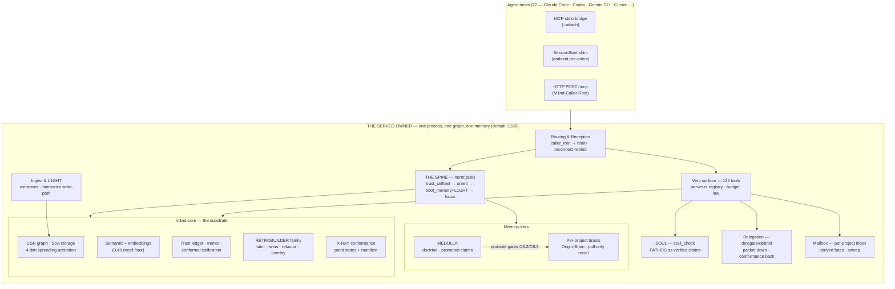
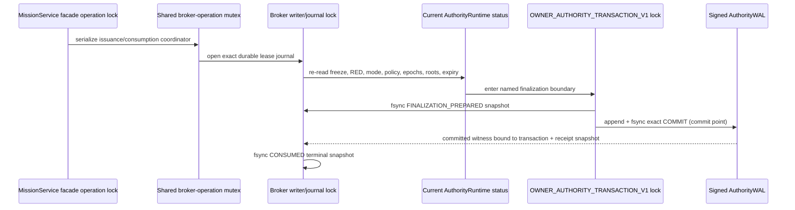

# The Organism — UML Atlas

**Every system, subsystem and seam of m1nd as code-grounded UML — one master map, twenty-two system sheets, one consolidated gap ledger.**

> **Status:** OFFICIAL — maintainer-directed, 2026-07-06; re-grounded 2026-07-12. Grounded at `origin/main` @ `c1ba801`. Every system sheet was derived from an exhaustive per-system code map (file:line-anchored), spot-checked against source, and every Mermaid block validated with the real `mermaid.parse()` (78 blocks across the master + the twenty-two sheets, 0 failures). **The symbol is the contract, the line is a hint — re-anchor at implementation start.**
> **How to read this:** this master gives the whole-organism view (topology, the four grammars, the seams) and the honest consolidated gap ledger. Each system's deep view — class / sequence / state diagrams, invariants, per-system gaps — lives in its sheet under [docs/uml/](uml/). Sheets state what the code DOES today, including where it diverges from its PRD; the PRDs state the intent. Where they disagree, the sheet wins about the present and the PRD wins about the target.
> **Sisters:** the constitution (`ORGANISM-PRD.md`) owns the ladder and the law; the six system PRDs own intent; `PATHOS.md` owns the live handoff state. This atlas owns STRUCTURE.

---

## 1. The organism at one glance

Three crates carry it: **m1nd-core** (the in-memory engine), **m1nd-ingest** (the write side), **m1nd-mcp** (the served owner + every verb). The npm wrapper is an installer/operator CLI, never the runtime.

## 2. The four grammars — the organism's orthogonal axes

These cross every system; no sheet may invent a fifth word for any of them.

| # | Grammar | Words | Where it lives |
|---|---|---|---|
| 1 | **Trust ladder** (answers) | `act \| reverify \| abstain \| unprovable` | predict gate, seek envelope, delegation-abstain, xray_gate |
| 2 | **Belief lifecycle** (stored claims) | `project_private → promoted → superseded` (+ `doctrine-born`; overlay `aged`) | medulla stores, promote, L1GHT frontmatter |
| 3 | **Letter fates** (telemetry) | `wet_ink \| in_flight \| fired_clay \| external` — derived, never stored | mailbox reply graph |
| 4 | **X-RAY conformance** (architecture) | node paint: `Bedrock \| Overgrowth \| Unproven \| ErosionCandidate` | xray verbs, seek conformance nudge |

**Two precision notes the atlas enforces** (they are commonly mis-stated): X-RAY's *node* grammar is exactly the four paint states above — `BLUEPRINT` is a **manifest-level existence result**, never a node tag, and `UNPROVABLE` belongs to the **trust envelope**, a different subsystem. And the letter fate `in_flight` is currently **dead code** (no producer fills `in_flight_ids`) — see the ledger.

## 3. The seams — where systems meet (what a per-system view misses)

- **The spine weave.** `north` is a pure composer: trust_selftest → orient → boot_memory + L1GHT recall → focus, one read-only round-trip, honesty signals passed through, never fabricated. Every other packet (delegation, reception, soul headline) is a projection of this one spine.
- **The trust ladder is the universal answer grammar,** not a Trust-system feature: predict speaks it through the conformal gate; seek wears it as a (dark) envelope; delegate abstains in it; underwrite renamed onto it.
- **Reception + cwd routing sit UNDER every call.** `mcp_http` resolves `M1nd-Caller-Root` → brain before any verb runs; a mismatch produces a reception block instead of silent wrong-brain answers; reconnect prefers a covering brain (unique-ancestry match, abstains on 0/>1).
- **The read-only attach contract.** Bridges dispatch through `query_readonly` and `persist = !read_only`; exactly one writer process exists by lease — cross-process write races are impossible by construction.
- **The capture loop.** `memorize` (the sole L1GHT writer) → `.light.md` with Origin-Brain → ingest → graph node → next session's recall → `cross_verify` freshness — read → prove → write, closed.
- **`finalize` is the universal materialization gate.** Every ingest adapter, snapshot load and merge funnels through it; PageRank exists only downstream of it (and goes stale between finalizes — see ledger).
- **Delegation + mailbox extend the spine from one agent to a tree.** `delegate` composes the retrieval half of a child's spec from the same graph the spine reads; `debrief` grades the real diff back into `learn`; field letters distribute into per-project boxes the same cwd-routing the calls use.
- **The medulla law (pull, never push).** A brain's default beat = its own store + the medulla, nothing else. The public `promote` crossing is now fail-closed at `POSITIVE_SOVEREIGN` until an exact typed G2 consumer exists; verification/source labels are content evidence, not authority. Owner-resolved internal promotion preserves the provenance/evidence model meanwhile.

## 4. The twenty-two sheets

| Sheet | System | Diagrams | Honest one-liner |
|---|---|---|---|
| [graph-core](uml/graph-core.md) | CSR graph, SoA storage, 4-dim activation, PageRank, topology, resonance, snapshots | class·seq·state | The load-bearing substrate; deterministic; the two engine bugs + PageRank/unfinalized holes CLOSED (hardening wave 2) |
| [semantic-embeddings](uml/semantic-embeddings.md) | Symbolic 3-component scorer + static-embedding tier + cache | class·seq | Embed cosine reaches only seek, never activation/seed — by boundary, stated |
| [trust-calibration](uml/trust-calibration.md) | Trust ledger, tremor, conformal calibration, envelope | class·seq·state | TWO ladders: predict (3-state) + envelope (4-state); both now have a real calibration writer (`calibrate_predict` / `calibrate_envelope`, hardening wave 2) — `act` reachable when calibrated, honest cap otherwise |
| [retrobuilder](uml/retrobuilder.md) | taint, twins, refactor, overlay, temporal, epidemic, flow, counterfactual, antibody | class·seq | Nine engines, one family; learn→antibody/co-change loop drawn |
| [layers-xray](uml/layers-xray.md) | Layer system + X-RAY conformance + audit ledger | class·seq·flow | Paint states are FOUR; blueprint is manifest-axis; nudge is additive, never a verdict |
| [search-surgical](uml/search-surgical.md) | search/glob/seek/activate + surgical_context + edit_preview/commit | class·seq | 14 verbs; incremental merge is additive-only (no prune) — ledger |
| [ingest-light](uml/ingest-light.md) | Code extractors, universal docs, L1GHT reader, memorize write-path | class·seq·flow | Five core extractors are regex (docs overclaim tree-sitter); pdf lanes silently zero — ledger |
| [spine-north](uml/spine-north.md) | The north packet composer | class·seq·state | Pure fan-out; MED-INV-6 honesty proven; medulla fold HTTP-only — ledger |
| [medulla](uml/medulla.md) | Per-project brains, tier recall, promotion, M5a migration | class·2×seq·2×state | Public promotion is sovereign-frozen pending a typed G2 consumer; owner-internal crossing and migration remain data-safe; classifier heuristic is residual — ledger |
| [routing-reception](uml/routing-reception.md) | Served owner, attach bridges, reception, reconnect-rebind, lease | class·2×seq·2×state | The outermost shell; non-loopback binds now fail closed, authenticated remote transport remains future work |
| [soul](uml/soul.md) | PATHOS as verified claims, freshness receipt, curator | class·seq·2×state | Receipt live; `Superseded` now produced by a cross-claim duplicate-per-anchor pass (hardening wave 4) |
| [delegation](uml/delegation.md) | delegate/debrief, conformance algebra, outcomes.jsonl | class·seq·2×state | Loop closes at edge level; calibration flywheel now MEASURES from the ledger (hardening wave 4) — scoping constants still untuned |
| [mailbox](uml/mailbox.md) | Letters, boxes, derived fates, sweep, case intelligence | class·seq·2×state | Substrate live + idempotent; R11 design-only; in_flight dead — ledger |
| [focus-runtime](uml/focus-runtime.md) | focus(goal,budget), sufficiency, conformance bias | class·seq·2×state | Shipped focus delegates to seek; PRD's composite ranker not built — stated |
| [tool-surface](uml/tool-surface.md) | 117-verb catalog, dispatch, ESSENTIAL tier, instructions | flow·seq·state | Catalog↔dispatch drift exists (5 `lock_*` dispatchable, uncataloged) — ledger |
| [mission-control](uml/mission-control.md) | mission lifecycle, evidence classes, handoff | class·seq·state | Keystone: SubagentStop-only, never the default loop; direct evidence now demands a verifiable signal + write-lock (hardening wave 4, partial) — read-only gating still open |
| [perspective](uml/perspective.md) | Multi-viewpoint exploration | class·seq·state | Route family now derived per-edge + lens filtering live (hardening wave 4) |
| [auto-ingest-daemon](uml/auto-ingest-daemon.md) | Watcher, tick, code daemon, alerts | class·seq·state | Idle `serve()` clock now pumps the drain — an idle session drains its queue (hardening wave 4) |
| [cli-operator](uml/cli-operator.md) | npm CLI, restart --binary, release parity | flow·seq·state | macOS reload trio (codesign/kickstart/kill) has zero tests — ledger |
| [host-integration](uml/host-integration.md) | 22-host matrix, shim, hosts apply, ambient wave | flow·seq | Pre-orient half real; the whole ambient/R12 wave is PRD-only — ledger |
| [scan-loading](uml/scan-loading.md) | The held `skeleton_candidate` scan wait: client state machine + SSE phase narration + honest abort | seq·state | Real events only — no fabricated %; the owner narrates phases on the existing SSE, degrades clean when silent (slice 2 shipped) |
| [cockpit](uml/cockpit.md) | The navigable read-only menu verb (`m1nd-cockpit-v0`): eight stable slots (P1 added `presences`), drill, derived deny-filter, `menu_sig` | class·seq | north's on-request sibling — breaks alone; a router in v1 (presents the read, never fabricates a receipt); slot 8 = the P1 control-room roster (this brain, collision on the label) |
| [presences](uml/presences.md) | Durable session-presence sidecars (`m1nd-presence-v0`): the throttled beat in `track_agent`, TTL + boot-GC, read-time collision derivation, the cockpit 8th slot + north collision gap | class·seq | ORGANISM-INSIDE P1 (verdict 2026-07-13) — witness tissue that gates nothing; presence == activity VISIBLE to m1nd |

## 5. The consolidated gap ledger — every open debt, ranked

Severity order: security > data-loss > correctness > fragility > honesty/cleanup. Each entry carries its home sheet; fixes land RED-first or not at all.

### SECURITY
1. **Unauthenticated network mutation surface.** `--serve` on `0.0.0.0` exposed graph mutation to the LAN with only a stderr warning, no refusal, no auth. *(routing-reception)* — **CLOSED** (hardening wave 1, strengthened): every non-loopback bind is now REFUSED at startup, including when the legacy `--allow-remote` flag is passed. Residual: authenticated TLS remote transport and scoped authorization remain future work; until they exist, remote exposure has no direct bind escape hatch.

### DATA-LOSS
2. **M5a migration cluster** *(medulla)* — **CLOSED**: the data-safety cluster is fixed RED-first. The six data-loss vectors — collision-overwrite (now a hard refusal), destination-scanning rollback (now manifest-authoritative, never scans the destination), cardinality-only conservation (now content-level too), destructive-first rollback (now snapshot-first into `pre-rollback-live/`), unrestored `ingest_roots.json` (now backed up + restored), and the missing live-owner guard (now refuses while `:1338` listens) — each carry a battery case. The last two architectural sub-notes closed 2026-07-06: apply now **registers the destination brain** (`ensure_registered` writes `project_brain.json` + `brain_kind:project`, reusing the bootstrap birth path — no more orphan store), and the **code graph stays at the medulla root by design** (option B: the runtime owner is both the medulla and its own home brain; migration is memory-only, pinned by a regression guard). Residual is medium/low only (classifier is heuristic substring-matching; `restore_tree` doesn't delete files the backup lacks) — see the medulla sheet.
3. **Document lanes silently produce zero nodes** (pdf/docx/pptx/xlsx without an external provider) — content vanishes with no warning, no receipt. *(ingest-light)*
4. **`load_co_change_matrix` is a stub** returning empty — the co-change temporal signal is dead weight wherever it is consumed. *(graph-core)*

### CORRECTNESS
5. **The seek trust envelope can never reach `act`:** its `envelope` calibration signal has no production writer (only a test helper) — structurally capped at `reverify`. *(trust-calibration)* — **CLOSED** (hardening wave 2): a real `calibrate_envelope` verb now derives a labeled corpus from the trust ledger's learn outcomes (confirmed defect ⇒ trusting was wrong/miss; false alarm ⇒ trusting was right/hit), measures a split-conformal τ on the envelope's OWN reliability scale (also closing the scale-mismatch gap), and persists the `envelope` row so a clean seek can reach `act`. With no labeled corpus it stays honestly uncalibrated (`envelope_uncalibrated`, capped at `reverify`), never a fabricated `act`.
6. **`handle_learn` catch-all maps any non-{wrong,partial} feedback to `record_defect`** — mislabeled feedback silently accrues defects against innocent nodes. *(trust-calibration)* — **CLOSED** (hardening wave 1): the feedback verb is validated up front (exactly `correct|wrong|partial`); any other value returns `InvalidParams` before any mutation, so a typo can no longer record a defect.
7. **HeapEngine re-expansion:** once a node enters the Bloom visited-set, a later STRONGER signal cannot update it — order-dependent activation loss. *(graph-core)* — **CLOSED** (hardening wave 2): both structural engines now RE-RELAX an already-visited node when a new arrival exceeds its stored activation by `REEXPANSION_MARGIN` (Dijkstra decrease-key via re-push / re-add to the next frontier); the margin bounds re-pushes so termination holds. The Heap re-push also rescues a Bloom false-positive first-time node. A cross-engine equivalence test (independent brute-force fixpoint oracle) proves both engines converge to the true propagation fixpoint on a weak-first/strong-later topology.
8. **Perspective is single-viewpoint:** route family hardcoded `Structural` at both call sites; lens/`route_families` are no-ops. *(perspective)* — **CLOSED** (hardening wave 4): route family is now derived from each edge's relation (call/import/type/data-flow → the matching `RouteFamily`) instead of a hardcoded `Structural`, and `lens.route_families` filters the synthesized routes, so the multi-family taxonomy and lens filtering are live.
9. **Mailbox `in_flight` fate is dead code:** `in_flight_ids` has no producer, yet every surface counts it inside "open". *(mailbox)* — **CLOSED** (hardening wave 1): `in_flight_ids` now has a natural reply-graph producer — a `triage`/receipt answer CLOSES an id (`fired_clay`), a non-receipt reference PICKS IT UP without closing (`in_flight`); closed takes precedence.
10. **North freshest-first inversion:** the broad L1GHT fallback sorts `Option<u64>` ascending, so `None` (undated legacy) outranks every dated claim — oldest-first where freshest-first is promised. *(spine-north)* — **CLOSED** (hardening wave 1): the fallback now sorts on `(authored_ms_ago.is_none(), authored_ms_ago)` — dated claims first (freshest within them), undated claims trail.
11. **Restart reload trio is field-hazardous:** kickstart matches EVERY label containing "m1nd" (fleet-wide SIGKILL from one swap), runs even when codesign failed (re-execs an unsigned binary → OS-level kill loop), and label parsing breaks on labels with spaces. *(cli-operator; review-confirmed)* — **CLOSED** (hardening wave 1): kickstart resolves each candidate label's managed program via `launchctl print` and kicks ONLY the one matching the installed target (fail-closed on an undiscoverable path); a failed darwin codesign skips the reload; label parsing takes columns 3..end so spaced labels survive.

### FRAGILITY
12. **Medulla fold is HTTP-only:** a stdio caller's `north.memory` silently lacks the medulla feed — the pull law realized on one transport. *(spine-north / routing)*
13. **PageRank staleness + unfinalized-query hole:** rank recomputed only in `finalize`; queries against a non-finalized graph hit empty CSR with no guard. *(graph-core)* — **CLOSED** (hardening wave 2): a `pagerank_dirty` flag is set on every post-finalize `add_node`/`add_edge` and cleared by `compute_pagerank`; the seek/query PageRank boost is skipped when dirty, degrading to the un-boosted ranking rather than re-ranking on stale values. `query`/`query_readonly` now guard on `finalized` (honest empty result), and `out_range`/`in_range` are bounds-safe (empty range for an unbuilt CSR) so the index-OOB risk is removed for every caller.
14. **Auto-ingest has no background pump:** the watcher only enqueues; drain rides other verbs' traffic — an idle session accumulates forever. *(auto-ingest-daemon)* — **CLOSED** (hardening wave 4): `serve()`'s existing `recv_timeout` idle clock — the same wake that already drives the code daemon — now calls `pump_auto_ingest_if_due`, which reuses `maybe_tick`'s read-only / not-running / empty-queue short-circuits. No new thread; an idle session drains its queue and the short-circuits keep an empty tick cheap. RED: a change enqueued into a running auto-ingest with zero verb traffic is drained purely by the idle pump.
15. **Catalog↔dispatch drift:** 5 `lock_*` verbs dispatchable but uncataloged/invisible to help; no parity test pins catalog(122)↔dispatch↔ESSENTIAL. *(tool-surface)*
16. **Delegation flywheel open-loop:** `outcomes.jsonl` written but read only as a row count; `calibrated:false` hardcoded; scoping constants never learn. *(delegation)* — **CLOSED** (hardening wave 4): a pure reducer `calibration_metrics_from_rows` parses the ledger and computes the three §O.12.8 metrics — scope_precision = Σ(in_scope+expected_change)/Σ(touched), miss_rate = Σ(unpredicted)/Σ(touched), dependents_honesty = P(failure\|contact) − P(failure\|stayed) — and flips `calibrated` on at N ≥ 30; the numbers stay withheld below the floor (bands/counts only, the predict-gate discipline). Residual by design: the scoping/abstain constants are still UNTUNED (the sweep at N ≥ 30 is backlog) — the loop now MEASURES, it does not yet tune.
17. **Mission evidence class is lexical** (grade `direct` obtainable by naming an event `file_read`); mission verbs absent from `READ_ONLY_DENIED_TOOLS`; no store lock on load→write→save. *(mission-control)* — **CLOSED** (hardening wave 4, partial): (a) `classify_evidence` now demands a verifiable signal beyond the label — a cited path that EXISTS under a repo root, OR a referenced recorded mission event; a bare direct label with neither grades the new `direct_unverified`, which falls to `insufficient_evidence` and caps the self-reported confidence, so a lying label can no longer forge a verified claim. (c) every mutating mission handler now holds a per-mission exclusive `flock` across the load→mutate→save (reusing the memorize `LockGuard`, generalized to `acquire_in`), so concurrent writers serialize and lose no events. RED-proven both ways. Residual (b): mission verbs are still absent from `READ_ONLY_DENIED_TOOLS` — a read-only attacher is not yet gated off mutating mission state (untouched this wave).
18. **Soul `Superseded` unreachable** — defined, ranked, bucketed, never produced; self-supersession undetectable. *(soul)* — **CLOSED** (hardening wave 4): a pure `superseded_claim_indices` cross-claim pass detects duplicate-per-anchor claims and marks the OLDER as superseded (newest-wins, document order the age proxy — a claim is superseded iff it shares an anchor with a later claim and is not itself the latest author of any of its anchors). `soul_check` reports those claims as `superseded` with a `superseded_claims` block instead of re-verifying an anchor a newer claim now owns. RED: two claims on one anchor → the older grades Superseded, end-to-end through `parse_soul`.
19. **Embedding tests self-skip without the model blob** — CI without the ~30MB blob exercises ZERO embedding code; needs a deterministic fake Embedder. *(semantic-embeddings)* — **CLOSED** (hardening wave 2): a deterministic `FakeEmbedder` (FNV-1a seed → zero-mean LCG → L2-normalized; anchor mode for controllable cosine) plus `SemanticEngine::with_injected_embedder` make the whole embed path — seek blend, the 0.40 recall floor, cache warm-reuse / self-pruning / single-writer persist / corruption-ignored — CI-proven blobless. `SemanticEngine.embedder` is now `Arc<dyn Embedder>` to accept the injection. Proven under simulated no-blob: the old model-gated tests SKIP, the injected tests all pass.
20. **The ambient wave (R12) is entirely unbuilt** — no Stop/PreCompact hooks, no delegate-hook, no `integrations/` dir; only the SessionStart pre-orient shim exists (and it composes a thinner packet than live `north`: no memory[], no honest_gaps). *(host-integration)*

### HONESTY / CLEANUP
21. Extractor trait doc claims all-tree-sitter; five core extractors are regex. *(ingest-light)* · Stale "102 tools"/"~25 curated" literals in four docstrings — **CLOSED** (registry-derived counts now stated (122 full / 42 essential as of the F0a slice-2 landing)). *(tool-surface)* · `query`/`query_readonly` duplicate ~120 lines the doc promises byte-identical. *(graph-core)* · L1GHT supersession is frontmatter-only (no graph edge). *(ingest-light)* · Silent non-convergence in SpectralGapAnalyzer. *(graph-core)*

**Design-only (not debt, but not code):** R11 case intelligence (PRD shipped, S0–S4 unbuilt) · the delegate ambient hook (§O.12.7 slice 3) · the focus composite ranker.

## 6. Proof strategy — how this closes

**Determinism first.** The substrate is already deterministic (seeded LCG, fixed iterations, atomic snapshots, content-addressed caches) — every proof leans on that; no agent-in-the-loop tests for routine QA.

Per family: **graph-core** — JSON↔bin cross-format equivalence, unfinalized-query rejection (RED), Wavefront-as-oracle vs Heap harness to pin the re-expansion bug, loom/concurrency for the CAS weights. **semantic** — deterministic fake Embedder so the blend, the 0.40 floor, warm-cache reuse and corruption-tolerance are CI-proven blobless. **trust** — a learn→seek test asserting defects change ORDER, the catch-all fix test, a production `calibrate_envelope` writer + a test proving `act` is reachable. **write-side** — the silent-zero contract test (no provider ⇒ zero nodes AND a surfaced warning), memorize race + WouldDowngrade tests. **migration** — the six data-safety REDs (collision-refusal, bystander-preservation, manifest rollback, snapshot-first, roots-restore, live-owner refusal). **mailbox/spine** — corpus-replay batteries (the false-absence trilogy groups; the fold reaches stdio or is honestly gapped).

**Multi-environment stress (where the real stress lives).** One served owner; attach in sequence from **Claude Code, Codex CLI, Gemini CLI, Cursor**: per host prove — reception fires from a foreign cwd; `north` composes with the medulla fold (or the gap is stamped); memorize refuses brainless roots; two hosts writing concurrently serialize on the single-writer lease; owner kickstart mid-session and the bridge re-recovers; the shim injects on SessionStart where the host has one. Every failure is a field letter first, a battery case second, a fix third — the triage law, unchanged.

## 7. M1ND-10 G2→G3 authority seam (2026-07-18 working-tree supplement)

This supplement records implemented working-tree structure, not a published or live-machine
deployment. The body supplies signed authority artifacts; the served owner supplies wire identity,
caller-root/brain routing, ingress context, key registry, owner time, policy, and current safety state.
The 2026-07-12 receipt above still covers its original 78 Mermaid blocks; the two supplement blocks
below require re-count/parser validation in the final whole-doc gate and are not folded into that
historical claim yet.

```mermaid
flowchart LR
    HOST["Platform authority signer"] --> CH["Session challenge<br/>owner-bound correlation context"]
    CH --> AUTHN["Authenticate signed<br/>runtime.session.handshake capability"]
    AUTHN --> SESSION["Authenticated G2 session<br/>process-memory; restart re-authenticates"]
    SESSION --> AUTHZ["authority_authorize<br/>exact action, object, effects, policy"]
    AUTHZ --> LEASE["Durable one-shot lease<br/>UNUSED → RESERVED"]
    LEASE --> MS["Typed MissionService facade"]
    MS --> PREP["FINALIZATION_PREPARED<br/>current authority revalidated"]
    PREP --> WAL["Signed AuthorityWAL COMMIT<br/>sovereign commit point"]
    WAL --> USED["Lease CONSUMED + fsync"]
    PREP -.->|callback result uncertain| WAIT["Remain FINALIZATION_PREPARED"]
    WAIT -.->|exact COMMIT witness| USED
    WAIT -.->|expired and no witness| ABORT["Lease ABORTED"]
```

`Land` has a mandatory read-before-write binding. An Ordinary lease authorizes the canonical
`mission.service.land_intent` READ; the returned `LandIntent` core digest is then signed into the
Positive `mission.service.land` capability and bound again by the authorization receipt and
`AuthorityTransactionV1`. A different head, payload, intent, session, brain, root, policy snapshot,
or effect set fails closed.

The in-process lock and durability order is fixed:

Issuance and consumption share the broker-operation mutex, so their different internal runtime/
broker reads cannot interleave across the owner authority transaction. Crash recovery never infers
success: `FINALIZATION_PREPARED` becomes `CONSUMED` only with the exact committed WAL witness;
otherwise an expired reservation becomes `ABORTED`, while an unexpired reservation remains
reserved. A WAL callback error is deliberately treated as uncertain and never writes an immediate
ABORT that could contradict a COMMIT whose fsync acknowledgement was lost. Terminal lease GC
additionally requires retention expiry and caller-supplied proof of no
checkpoint, mission, release, WAL, or idempotency reference.

The production assembly and atomic AppState install seam exist, but concrete platform adapters are
deliberately absent until injected hardware-protected config/runtime roots, domain-separated protected
broker/WAL journal heads, a production signer/verifier, attestation, and operator-owned key material
exist. The authorization receipt, sealed outer transaction, execution result, review result, and WAL
record each have a separate domain-signature boundary; REST/MCP transport session ids remain
correlation labels and never authenticate the subject. Software fixture backends are test-only and
rejected by the production loader; h4nd is a caller of the ceremony, never an authority or key source.

---

*Atlas curated at the design seat from twenty-two code-grounded system maps; diagrams mechanically drafted from those maps and parser-validated; every load-bearing claim carries a file:line hint in its sheet. Where a sheet and reality diverge tomorrow, trust reality, re-anchor the sheet, and log a letter.*
