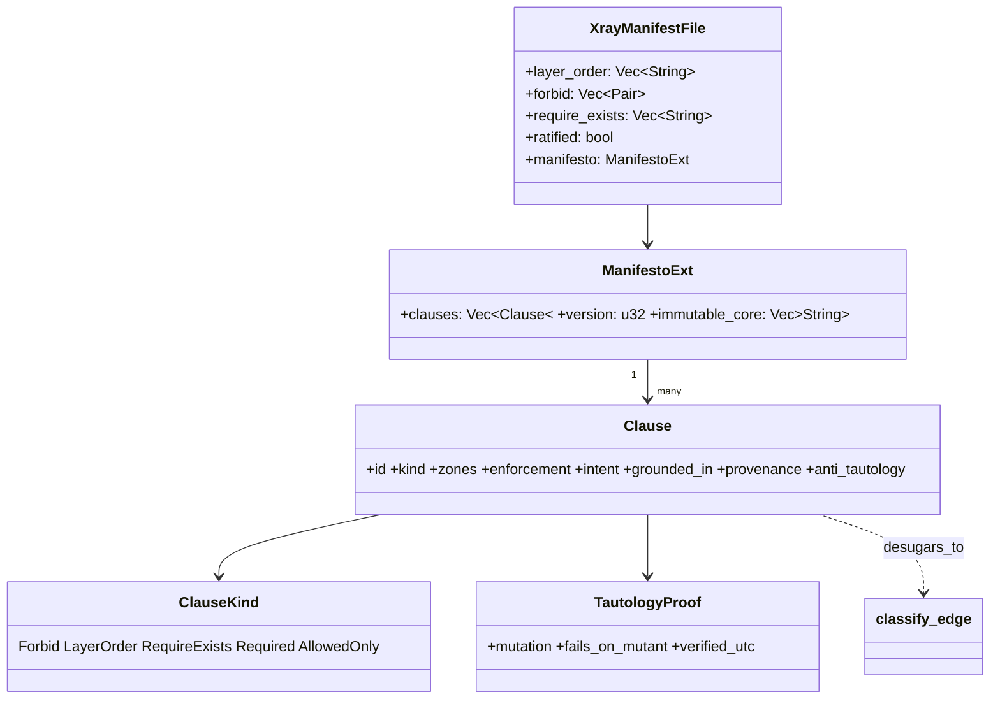
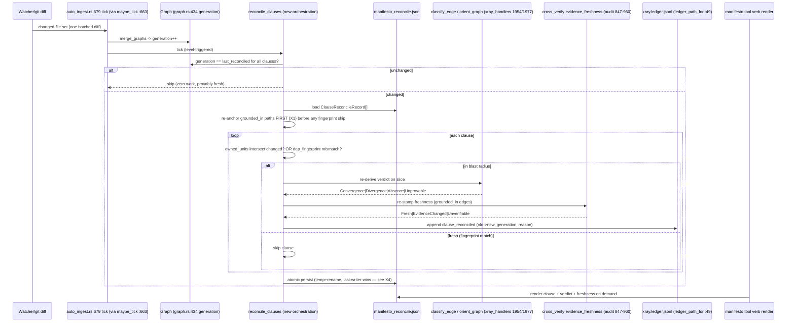
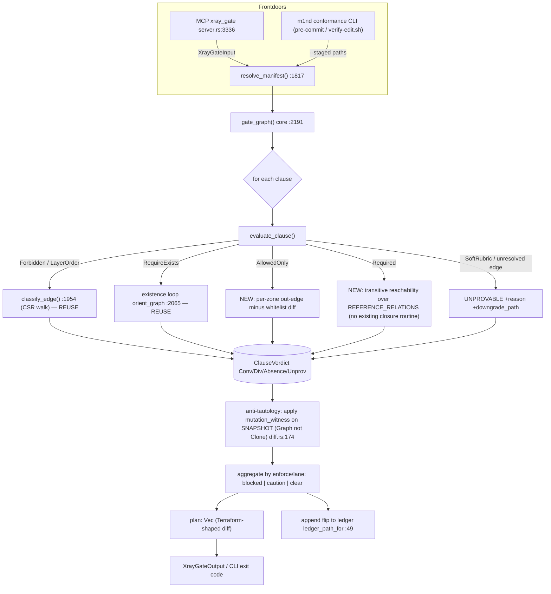
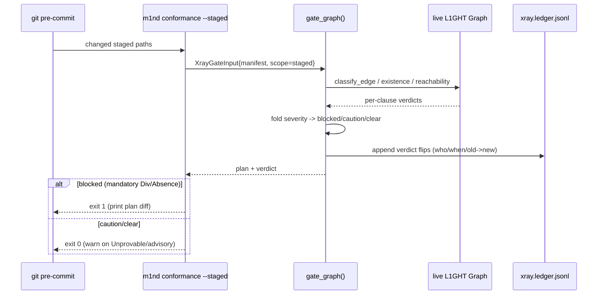
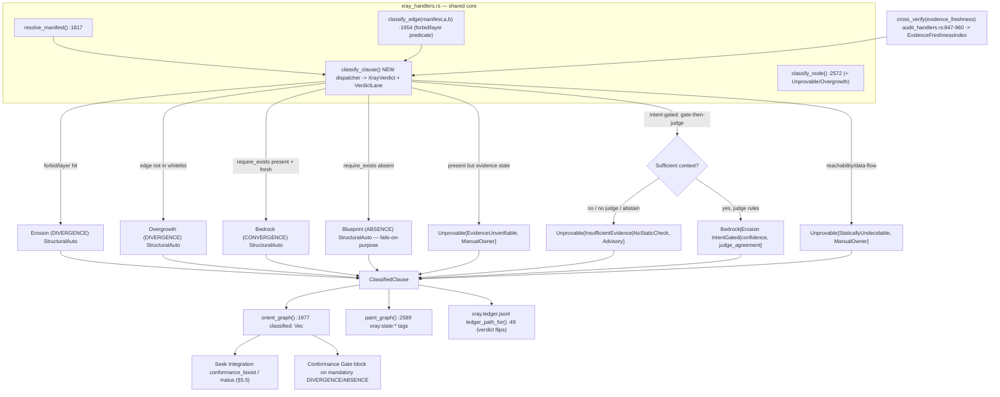
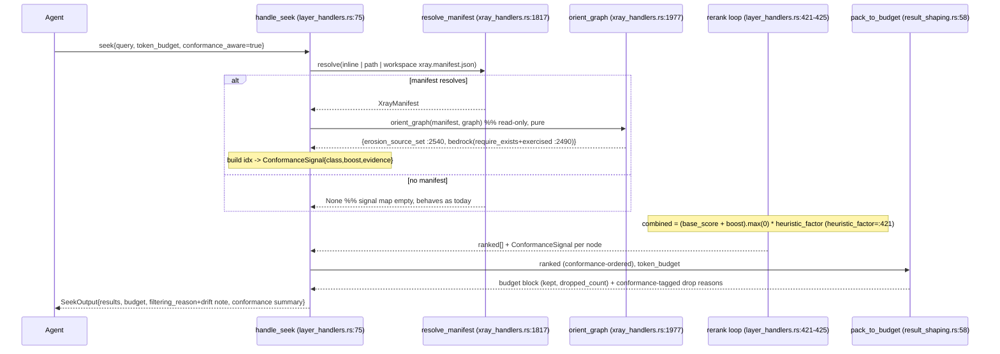

# m1nd 360 — Self-Updating Manifesto + X-RAY Conformance + Seek Integration (PRD & UML)

> A single coherent design for turning declared architectural intent into a living, graph-bound, self-updating contract that coding agents consult before they act.

> **Accuracy note (post-review correction).** The adversarial critique verified anchors against a local `~/m1nd` checkout that was **behind `origin/main`** and predated the merged `focus` runtime (PR #157, commit `9d742bf`). `focus` / `handle_focus` / `FocusInput` / `compute_sufficiency` **do exist** on `origin/main`. The design is unaffected: `focus` is a thin layer **over `handle_seek`**, so injecting the conformance term into the shared `handle_seek` rerank (as §5.5 does) is exactly right — it boosts attention for both `seek` and `focus`. Seek-rerank line anchors below were taken from the stale checkout; re-ground them at build time against `origin/main` (with `focus` merged, `layer_handlers.rs` is ~280 lines longer, so the rerank sits lower).

---

## 1. Executive Summary + the 360 Vision

The **Manifesto Runtime** is an **agent-generated, human-ratified, self-updating architectural constitution** that lives inside m1nd as one new small surface and turns declared intent into a *living, graph-bound contract* that coding agents consult before they act.

Today m1nd answers three questions well:

- **"What is the code?"** — the graph.
- **"What should I load?"** — `seek` / `focus` (the retrieval + attention verbs; `focus` is shipped (PR #157) as a thin layer over the same `handle_seek` rerank at `layer_handlers.rs:75`, so wiring conformance into that shared rerank covers both).
- **"Is this honest and fresh?"** — L1GHT (`evidence_freshness`, `am_i_stale`).

The missing axis is **"What is the code *supposed to be*, and where has it drifted?"** The manifesto supplies that north-star as machine-checkable rules — `forbid` / `layer_order` / `require_exists`, extended with reflexion tri-state semantics and two new kinds (`required`, `allowed_only`) — each clause **bound via `grounded_in` to the exact nodes that justify it**, continuously reconciled against the live graph, and projected back into the `seek` attention runtime so high-conformance (BEDROCK) context is up-boosted and erosion is surfaced honestly.

It is a game-changer because it converts the most expensive failure mode of agentic coding — *agents confidently building on top of architectural decay because nothing told them the intent* — into a cheap, deterministic, always-fresh signal that rides the same `_m1nd` envelope agents already read. It is the one component that makes m1nd **opinionated about the future of the code**, not just descriptive of its present.

> **Honest scope note (load-bearing).** Two deliverables touch infrastructure m1nd does **not** have today and must be costed as net-new, not as "rides existing machinery":
> 1. **The SSOT delivery surface.** The MCP server advertises capabilities `{"tools": {}}` only (`server.rs:3940`) — there are **no `resources/*` or `prompts/*` handlers anywhere in the crate**. A `mind://manifesto` *resource* + `get_prompt` is therefore a brand-new MCP capability (new `capabilities` entry + `resources/list`+`resources/read`+`prompts/get` JSON-RPC handlers + client support). Because the anti-rot property (render-on-demand with `evidence_freshness` attached) does **not** require the resource primitive, the **default plan delivers the SSOT through a new `seek`-class tool verb** (`manifesto`), which rides the only capability that exists; the MCP-resource form is an *optional* later surface, scoped with its own risk. See §5.1.
> 2. **The attention payoff (§5.5)** wires into the shared `handle_seek` rerank (`layer_handlers.rs:75`) that **both** `seek` and the shipped `focus` verb ride — so one injection point boosts attention for both.

**The whole runtime decomposes into five subsystems** (detailed in §5):

1. **Manifesto (Model + Authoring)** — the versioned, agent-drafted/human-ratified intent SSOT.
2. **Self-Update & Freshness** — intrinsic, level-triggered reconciliation that keeps verdicts and freshness correct.
3. **Conformance Gate** — the deterministic tri-state evaluator (pre-edit + CI).
4. **X-RAY Classification** — maps verdicts to named states (BEDROCK / BLUEPRINT / EROSION / OVERGROWTH / UNPROVABLE).
5. **Seek/Attention Integration** — feeds conformance back into `seek` ranking as an additive gradient.

---

## 2. The Self-Update Verdict (workflow vs intrinsic; what goes in the README)

**Decisive answer: self-update must be INTRINSIC to m1nd. The README/workflow holds only the *contract*, never the *mechanism*.**

This is not a stylistic choice — it is forced by the strongest finding in the research: *rules that live in workflow files rot, and rotted rules become rules nobody maintains* (Gloaguen 2026: LLM-grown context files **reduce** task success and raise inference cost >20%; the self-improving-`CLAUDE.md` pattern deliberately keeps detection automated but humans curating). A manifesto checked only at PR-time "silently diverges between commits… the same dead document as an unread ADR" (the dependency-cruiser / fitness-function pitfall). The Living Documentation principle (Martraire) and Kubernetes level-triggered reconciliation both point the same way: **freshness must be a side effect of the build, re-derived from the whole current graph each tick, never a chore.**

### Precise split

**INTRINSIC to m1nd (automatic):**

- **Canonical SSOT** = a render-on-demand `manifesto` surface that returns the current grounded manifesto with `evidence_freshness` / `am_i_stale` already attached, so agents never read a stale file. **Default delivery is a new `seek`-class MCP *tool* verb** (rides the only advertised capability, `{"tools":{}}` at `server.rs:3940`). A versioned MCP *resource* `mind://manifesto` + `get_prompt` is an *optional* later form and is **net-new MCP capability work** (no `resources/*`/`prompts/*` handler exists today) — its anti-rot value is identical to the tool form, so it is not on the critical path.
- **Continuous reconciliation** (K8s level-triggered, idempotent): manifesto = `spec`, live L1GHT graph = `status`. Recompute convergence / divergence / absence from the *whole graph* each tick, triggered by `Graph.generation` change (`graph.rs:434`) and the incremental-ingest tick (`tick` at `auto_ingest.rs:679`, entered via `maybe_tick` `:663`), never from a single edit event.
- **Per-clause freshness** via L1GHT: every clause is `grounded_in` the nodes it references (reuse `resolve_light_evidence` `tools.rs:248-372`); `cross_verify(evidence_freshness)` (`audit_handlers.rs:847-960`) re-stamps each clause when its evidence's SHA256 (`content_sha256` `audit_handlers.rs:422`) changes. **Detection is fully automatic.**
- **Delta-scoped recompute**: only clauses whose ownership set intersects the changed units re-derive (Glean ownership / CodeQL boundary-analysis lesson), keyed by a content-hash of dependency facts so unchanged clauses skip with zero work.

**README / workflow (the contract — human territory):**

- States *that* the SSOT lives in m1nd and that any `AGENTS.md` / `CLAUDE.md` / `.cursor/rules` are **generated projections** (DO-NOT-EDIT banners + a CI "projection-drift" gate).
- Declares the **invariant set the system itself must never self-edit** (the immutable constitution core — see §6; justified by Misevolution, Shao et al. 2025: self-updating memory can rot its own guardrails).
- Documents the **ratification workflow**: detection is automatic, but **committing a manifesto rule change is human/guardian-gated via PR**. This is the one hard line — auto-commit of doctrine is forbidden.

**Net:** automatic detection + automatic freshness + automatic reconciliation; human-gated ratification of *new intent*. The L1GHT `evidence_freshness` substrate and the incremental-ingest machinery (fingerprint / merge in `auto_ingest.rs`; the built-but-unused `diff.rs` for symbol-level scope) are the rails the *freshness/reconciliation* path rides — no new freshness engine, only orchestration. The one place this PRD does **not** ride existing rails is the SSOT *delivery* surface, which is net-new tool-verb work (see the honesty note in §1).

---

## 3. The Anti-Circularity Principle

**A manifesto reverse-engineered from current code is worthless** — it is a tautology that can never fail, giving false confidence (the documented fitness-function "mirror-of-code" failure mode; analogous to high line-coverage / low mutation-score). A rule auto-generated from the graph passes against both the real graph *and* a deliberately broken one — it is **vacuous and must be rejected.**

The manifesto is a **Software Reflexion Model** (Murphy / Notkin): the human authors the high-level intent *independently*, and the *value is the diff*. Three verdicts per clause, never a boolean:

- **CONVERGENCE** — graph satisfies intent (BEDROCK).
- **DIVERGENCE** — code does something intent forbids (EROSION / OVERGROWTH).
- **ABSENCE** — intent requires something the code lacks (BLUEPRINT). *This is intent-leading-code by construction — it fails on purpose until the code conforms.*

**Therefore the first deliverable of the agent is not a clean manifesto — it is a CONFRONTATION REPORT: "here is where your declared rules already disagree with the code."** Two proven mechanisms (dependency-cruiser + reflexion):

1. **required / ABSENCE clauses** assert a dependency or property the code doesn't yet have ("every host adapter MUST route through the envelope layer") → reports ABSENCE, fails the gate until conformance.
2. **allowed / whitelist clauses** declare the only permitted edges for a zone → any *new* edge surfaces as DIVERGENCE.

**Anti-tautology enforcement is a build-time requirement:** every clause must pass a **self-mutation test** — run it against a deliberately-mutated graph; a clause that passes against both real and broken graphs is rejected as vacuous. If you bootstrap zones from code, you must immediately add ≥1 required/absence clause the current graph fails. Authoring is **top-down from intent, never emitted from the current graph.**

---

## 4. Connection Map to Existing m1nd Systems

```
                  manifesto  (new seek-class TOOL verb, render-on-demand SSOT;
                              mind://manifesto resource is an optional later form)
                                   │  renders with evidence_freshness / am_i_stale attached
                                   ▼
   ┌──────── MANIFESTO RUNTIME (mostly reuse; one net-new delivery verb) ──────┐
   │  clauses: {forbidden | allowed/only | required | layer_order |            │
   │            require_exists}  →  tri-state verdict + enforcement lvl         │
   └──────────────────────────────────────────────────────────────────────────┘
        │                 │                 │                 │
        ▼                 ▼                 ▼                 ▼
   [X-RAY tools]     [L1GHT memory]    [graph/ingest]    [seek runtime]    [PATHOS/north-star]
```

- **→ X-RAY tools (extend, don't duplicate).** Every verdict flows through the *shared predicate* — `classify_edge(manifest, a, b)` (`xray_handlers.rs:1954`), `orient_graph()` (`xray_handlers.rs:1977`, pure ledger), `gate_graph()` (`xray_handlers.rs:2191`), `paint_graph()` (`xray_handlers.rs:2589`). Manifest resolution stays `resolve_manifest()` (`xray_handlers.rs:1817`). Module derivation stays `module_of()` (`xray_handlers.rs:1929`). The new work is **closing X-RAY's gaps**: store decision provenance (why/who/when) alongside rules; enforce `require_exists` in `gate_graph` as a pre-edit ABSENCE blocker (today only `paint` checks it); add the **UNPROVABLE** verdict (today `orient` only emits EROSION/BEDROCK/BLUEPRINT). The append-only `xray.ledger.jsonl` (`ledger_path_for()` `xray_handlers.rs:49`) becomes the audit trail of when/why a clause flipped.

- **→ L1GHT memory (the freshness + provenance substrate).** Each clause is stored AS a L1GHT claim via the `memorize` verb's `LightAuthorInput` (`light_author_handlers.rs:57`), whose `claims: Vec<LightClaim>` carry the `grounded_in` evidence. Reuse `resolve_light_evidence` (`tools.rs:248-372`) to create `grounded_in` edges clause→code; `reload_agent_memory` (`tools.rs:382`) re-anchors clauses every boot; `cross_verify(evidence_freshness)` (`audit_handlers.rs:847-960`) re-stamps staleness on code change. This is the **rule→entity→code triple-binding** the L1GHT gap analysis explicitly named as missing. A refactor that deletes the referenced entity auto-flags the clause `unverifiable` — self-repair and self-flag for free. *(Open dependency: `LightClaim` must carry the evidence/depends_on fields the grounding contract needs; if not, §5.1 P1 adds them — see §5.1 risks.)*

- **→ graph / incremental ingest (the trigger + delta scope).** Reconciliation fires on `Graph.generation` change (`graph.rs:434`) and the incremental-ingest tick — the real entry is `tick` (`auto_ingest.rs:679`), reached via `maybe_tick` (`:663`) / `handle_auto_ingest_tick` (`:988`); the reconcile call lands in the body of `tick` after the merge step. The changed-unit set comes from one batched `git diff` (avoid per-file `git show` fan-out). Delta-scope which clauses re-derive via fingerprint staleness + `merge_graphs` (`merge.rs:344`). PageRank and `change_frequency` feed the seek boost below. The diff machinery (`diff.rs`, built-but-unused — `compute` `:52`, `apply` `:174`, zero non-test callers) is the path to clause-level delta recompute.

- **→ seek attention runtime (the payoff — intent shapes attention).** Inject a **conformance signal as a separate additive term** into the **real `handle_seek` rerank** (`layer_handlers.rs:75`). Today `combined = base_score * heuristic_factor` at **`:425`**, where `heuristic_factor = trust_factor * tremor_factor` at **`:421`** (multiplicative damping only, `∈[0,1]`); `base_score` is built at **`:337`** and stored at **`:352`**. Add a **distinct** additive `conformance_boost` so BEDROCK can *raise* a node, not only damp suspect ones. Surface it on `SeekInput`/`SeekOutput` (`protocol/layers.rs:58`/`:88`) alongside the existing `token_budget` + `budget` accounting + `filtering_reason` + `proof_state`, and name conformance-relevant drops in the `budget` block produced by `pack_to_budget` (`result_shaping.rs:58`). (Note: the `trust*tremor*antibody` formula at `:5505` is a *different*, L6 vulnerability-probe path — not the seek rerank; do not wire here.)

- **→ PATHOS / north-star.** The manifesto IS the canonical north-star object; PATHOS continuity handoffs reference the `manifesto` render rather than copying doctrine. Projection: `m1nd render-manifesto` emits `AGENTS.md` (host-agnostic SSOT projection) + thin `CLAUDE.md` / `.cursor/rules` pointers, gated by a CI projection-drift check (reuse the existing `~/.claude/hooks/verify-edit.sh` machinery).

### Key reuse hooks (verbatim, for subsystem designers — anchors re-verified)

`classify_edge` `xray_handlers.rs:1954` · `orient_graph` `:1977` · `gate_graph` `:2191` (note: `gate_graph`'s `manifest_empty` checks only `forbid`+`layer_order` at `:2223`, so `require_exists` is **not** consulted by the gate today — a real gap §5.3 closes) · `paint_graph` `:2589` · `resolve_manifest` `:1817` · `module_of` `:1929` · `classify_node` `:2572` · `erosion_source_set` `:2540` · `exercised_set` `:2490` · `reference_indegree` `:2518` · `require_exists` existence loop `:2065` · `ledger_path_for` `:49` · `resolve_light_evidence` `tools.rs:248-372` · `reload_agent_memory` `tools.rs:382` · `cross_verify`/`evidence_freshness` `audit_handlers.rs:847-960` · `content_sha256` `:422` · **seek rerank inject** `layer_handlers.rs` `base_score` `:337`/`:352`, `heuristic_factor=trust*tremor` `:421`, `combined` `:425` · `handle_seek` `:75` · `pack_to_budget` `result_shaping.rs:58` · `handle_light_author`/`LightAuthorInput` `light_author_handlers.rs:87`/`:57` · triggers `graph.rs:434` & `tick` `auto_ingest.rs:679` (via `maybe_tick` `:663`) · delta `merge.rs:344` / `diff.rs` (`compute` `:52`, `apply` `:174`) · `prune_source_claims` `merge.rs:211` · atomic save / FNV fold `embed_cache.rs:68-81`/`:88-103` · projection gate via existing `~/.claude/hooks/verify-edit.sh`. **Re-ground at build time against `origin/main`:** the seek-rerank line anchors above came from a stale local checkout that predated the `focus` merge — `focus`/`handle_focus`/`FocusInput`/`FocusOutput`/`compute_sufficiency` DO exist on `origin/main` (PR #157) and `layer_handlers.rs` is ~280 lines longer there. **Genuinely absent from the crate:** MCP `resources/*` and `prompts/*` handlers (the server advertises only `{"tools":{}}`) — so the SSOT delivery verb is net-new tool work, per §1.

---

## 5. Subsystems

The runtime is five subsystems. Each shares one on-disk manifest (`XrayManifestFile` / `xray.manifest.json`), one evaluation predicate (`classify_edge`), and one audit ledger (`xray.ledger.jsonl`) — there is exactly one source of truth per concern, never a second evaluator.

---

### 5.1 Manifesto (Model + Authoring)

**Goal / one-liner.** Turn architectural intent into a **versioned, graph-bound, machine-checkable constitution** that agents author top-down, humans ratify, and m1nd grounds in real nodes — so the manifesto can *disagree with current code* (ABSENCE / DIVERGENCE) instead of mirroring it. Owns the clause data model, the `manifesto` render SSOT, the anti-tautology writer, the immutable-core enforcement point, and the ratification record. It does *not* own reconciliation, gating, classification mapping, or seek scoring.

**Problem & non-goals.**

- **Problem.** Today m1nd's intent lives in `xray.manifest.json` (`xray_handlers.rs`) as a flat `{layer_order, forbid, require_exists, ratified}` blob: no provenance (why/who/when — confirmed gap), no per-clause enforcement level, no `grounded_in` binding, no anti-tautology guard, and it's a file agents read directly (rots, no freshness). There is no agent-authoring path and no human-ratification *workflow* beyond a boolean timestamp.
- **Delivers.** The clause schema (extending the existing manifest), the agent authoring verb behavior, the anti-tautology self-mutation test, the human-ratification record + ledger event, the immutable-core rejection check (X3), and the `manifesto` rendered SSOT (tool-verb form).
- **Non-goals (owned elsewhere).** Continuous reconciliation / delta-scope (§5.2); `gate_graph` `require_exists` blocking (§5.3); the UNPROVABLE *verdict computation* (§5.4); seek `conformance_boost` (§5.5). Also non-goal: inventing a new rule-evaluation engine — clauses compile to the existing `classify_edge` predicate.

**Design — extend `XrayManifestFile`, don't fork it.** The current manifest (resolved via `resolve_manifest` `xray_handlers.rs:1817`) stays the on-disk SSOT and the input to `classify_edge` `xray_handlers.rs:1954`. We add a parallel, optional `manifesto` field (serde `#[serde(default)]`) so old manifests still parse, and `orient`/`gate`/`paint` keep reading the legacy fields unchanged. Each clause *desugars* to the legacy primitives the engine already evaluates.

```rust
// m1nd-mcp/src/xray_handlers.rs — additive fields on the existing manifest file struct.
#[derive(Serialize, Deserialize, Default)]
pub struct ManifestoExt {
    #[serde(default)] pub clauses: Vec<Clause>,
    #[serde(default)] pub version: u32,                  // bumped on every ratified change
    #[serde(default)] pub immutable_core: Vec<String>,   // clause ids the system may NEVER self-edit
}

#[derive(Serialize, Deserialize, Clone)]
pub struct Clause {
    pub id: String,                  // stable: "host-adapters-via-envelope"
    pub kind: ClauseKind,            // desugars to legacy forbid/layer_order/require_exists (+required)
    pub zones: Vec<String>,          // named zones over module_of() segments (xray_handlers.rs:1929)
    pub enforcement: Enforcement,    // Mandatory | Advisory  (Pulumi CrossGuard split)
    pub intent: String,              // the human "why", one sentence — public-intent prose
    pub grounded_in: Vec<String>,    // repo-relative node/file paths justifying the clause
    pub provenance: Provenance,      // who/when/why — the confirmed X-RAY gap, closed here
    pub anti_tautology: TautologyProof, // REQUIRED: proof the clause can fail
}

#[derive(Serialize, Deserialize, Clone)]
pub enum ClauseKind {
    Forbid { from: String, to: String },                 // -> manifest.forbid pair
    LayerOrder { order: Vec<String> },                   // -> manifest.layer_order
    RequireExists { substring: String },                 // -> manifest.require_exists
    Required { zone: String, must_depend_on: String },   // NEW: intent-leads-code (dependency-cruiser "required")
    AllowedOnly { zone: String, may_depend_on: Vec<String> }, // NEW: whitelist; new edge => DIVERGENCE
}

#[derive(Serialize, Deserialize, Clone)]
pub struct Provenance { pub author_agent: String, pub ratified_by: Option<String>,
    pub created_utc: String, pub ratified_utc: Option<String>, pub rationale: String }

#[derive(Serialize, Deserialize, Clone)] pub enum Enforcement { Mandatory, Advisory }

// Anti-circularity: a clause must demonstrably FAIL against ≥1 mutated graph, else it is a tautology.
#[derive(Serialize, Deserialize, Clone)]
pub struct TautologyProof {
    pub mutation: String,        // e.g. "remove edge host::adapter -> envelope::layer"
    pub fails_on_mutant: bool,   // must be true to ratify
    pub verified_utc: String,
}
```

**Tool surface — one net-new tool verb; authoring otherwise rides existing verbs.** Authoring reuses verbs agents already speak; only the SSOT *render* is new, and it is a **tool** (not an MCP resource):

- **Author a clause** → `memorize` (handler `handle_light_author` `light_author_handlers.rs:87`, input `LightAuthorInput` `:57`; dispatched at `server.rs:3848`, listed `server.rs:334`). A clause is written as an `agent-memory/*.light.md` claim with `node_label: "manifesto:clause:<id>"` and `claims` carrying the `grounded_in` evidence paths + zone entities. This gives clauses `grounded_in` edges for free via `resolve_light_evidence` `tools.rs:248-372`, and freshness for free via `cross_verify(evidence_freshness)` `audit_handlers.rs:847-960`. A small projector folds ratified clauses into the `clauses` array of `xray.manifest.json`. *Open dependency: confirm `LightClaim` already carries an evidence/depends_on field; if not, P1 extends it (small, additive).*
- **Confront / preview** → `xray_orient` (`orient_graph` `xray_handlers.rs:1977`, pure, read-only). Runs orient *before* ratification to produce the **Confrontation Report**. No new verb.
- **Anti-tautology self-test** → reuse `orient_graph` twice: once on the live graph, once on a mutated graph. **`Graph` does NOT derive `Clone`** (verified — no derive/impl above `graph.rs:426`) and `GraphDiff::apply(&self, graph: &mut Graph)` (`diff.rs:174`) **mutates in place**, so the mutant cannot be a cheap clone. Two viable snapshot mechanisms: (a) rebuild a fresh graph from source over the test scope via `merge_graphs` (`merge.rs:344`, which returns a new `Graph`), apply the mutation to *that*; or (b) compute the mutation's verdict delta without persisting by reverting the in-place `apply` after reading the verdict. **The test must never mutate the live graph** (P2 picks one mechanism and asserts a regression test on it). A clause whose verdict is identical on both graphs is vacuous → rejected.
- **Ratify** → a single field write through the existing `xray_ledger` append path (`ledger_path_for` `xray_handlers.rs:49`): `{event:"ratify_clause", id, version, by, utc, prev_hash}` plus a bump of `ManifestoExt.version`. **Immutable-core enforcement (X3):** ratification first checks the clause id against `ManifestoExt.immutable_core`; a self-update that would edit or remove an immutable-core clause is **rejected at this point** (ledger event `ratify_rejected{reason:"immutable_core"}`) — `immutable_core` is an *enforced precondition*, not a comment field. Human-gated: the *commit* of the manifest change is a PR; m1nd only records and renders.
- **Read the SSOT** → the one net-new surface: a `seek`-class **tool verb `manifesto`** that renders the current grounded manifesto with `evidence_freshness` / `am_i_stale` attached, so agents never read a drifting file. This rides the only advertised capability (`{"tools":{}}` `server.rs:3940`). The anti-rot property is render-on-demand, which a tool delivers fully; an MCP *resource* `mind://manifesto` + `get_prompt` is an **optional later form requiring net-new MCP capability work** (new `capabilities` entry + `resources/list`/`resources/read`/`prompts/get` handlers + client support) and is explicitly off the critical path. Render reuses `reload_agent_memory` `tools.rs:382` to anchor clauses first.

**UML.**

```mermaid
sequenceDiagram
    participant A as Coding Agent
    participant M as memorize (handle_light_author :87)
    participant L as resolve_light_evidence (tools.rs:248)
    participant O as orient_graph (xray_handlers.rs:1977)
    participant T as anti-tautology self-test (orient on live vs source-rebuilt mutant; Graph NOT Clone)
    participant P as clause->manifest projector (+ immutable_core check)
    participant LD as xray_ledger (ledger_path_for :49)
    participant H as Human / Guardian (PR)
    participant R as manifesto tool verb (render-on-demand SSOT)

    A->>M: memorize manifesto:clause:<id> (intent, zones, grounded_in, kind, TautologyProof)
    M->>L: write .light.md, add grounded_in edges (clause->code)
    A->>O: xray_orient (Confrontation Report, tri-state, no enforcement)
    O-->>A: CONVERGENCE / DIVERGENCE / ABSENCE per clause
    A->>T: self-mutation check (live graph vs source-rebuilt mutant; never mutate live)
    alt verdict identical on both graphs
        T-->>A: REJECT clause as vacuous (tautology)
    else fails on mutant only
        T-->>P: clause is non-vacuous, eligible
        P->>P: reject if id in immutable_core (X3); else desugar kind -> forbid/layer_order/require_exists/required
        P->>H: open PR: clauses[] + version bump (human ratifies INTENT)
        H->>LD: on merge -> append {ratify_clause,id,version,by,utc,prev_hash}
        H->>P: set provenance.ratified_by / ratified_utc
    end
    Note over R: render time (tool call)
    R->>L: reload_agent_memory (tools.rs:382) anchor clauses
    R->>R: cross_verify(evidence_freshness) per clause (audit_handlers.rs:847)
    R-->>A: grounded manifesto + am_i_stale/freshness attached (never a stale file)
```



**Self-update behavior.** Clauses are stored AS L1GHT memories, so freshness is a side effect of existing machinery. Every boot/replace, `reload_agent_memory` `tools.rs:382` re-ingests `agent-memory/*.light.md` and re-anchors each clause's `grounded_in` edges via `resolve_light_evidence` `tools.rs:248-372` (idempotent dedup); a clause whose cited node moved re-anchors or flags unresolved. On any code change, the next `cross_verify(evidence_freshness)` `audit_handlers.rs:847-960` recomputes `content_sha256` `:422` and stamps stale claims; the `manifesto` render always runs this pass. **Re-anchoring must run *before* the fingerprint skip (X1):** a renamed evidence file (`auth.rs`→`authn.rs`) can ingest as a *new* node with the *same* content-hash, so a fingerprint-only check would falsely mark the clause "provably fresh" while its `grounded_in` path string dangles. The contract here is: resolve evidence paths first; only then is a content-hash skip valid (§5.2 step ordering enforces this). Trigger / delta-scoping is owned by §5.2; this subsystem only guarantees each clause carries the `grounded_in` + `depends_on` edges that make delta-scope possible. **Detection is automatic; ratification of new intent is human/PR-gated** — the projector never auto-commits.

**Reuse vs new.**

| Concern | Reuse (existing) | Build (new) |
|---|---|---|
| On-disk manifest + resolution | `XrayManifestFile`, `resolve_manifest` `:1817` | additive `manifesto` field (`#[serde(default)]`) |
| Clause evaluation predicate | `classify_edge` `:1954` | clause→legacy desugarer (`Required`/`AllowedOnly`) |
| Zone→node mapping | `module_of` `:1929` | named-zone alias table over module segments |
| Authoring surface | `handle_light_author`/`LightAuthorInput` `light_author_handlers.rs:87`/`:57`, `xray_orient` `:1977` | clause `.light.md` schema + memorize→manifest projector |
| Grounding + freshness | `resolve_light_evidence` `tools.rs:248`, `cross_verify` `:847`, `content_sha256` `:422` | per-clause grounding contract (label convention); maybe-extend `LightClaim` evidence field |
| Provenance + ratify audit | `xray_ledger` / `ledger_path_for` `:49` | `Provenance` struct + `ratify_clause`/`ratify_rejected` ledger events |
| Anti-tautology | `orient_graph` `:1977`, `merge_graphs` `:344` (source rebuild), `GraphDiff::apply` `diff.rs:174` | self-mutation harness (orient on live vs **source-rebuilt** mutant — `Graph` is NOT `Clone`) |
| Immutable-core (X3) | `ManifestoExt.immutable_core`, ratify path | id-membership **rejection check** at ratify (new enforcement point, not a comment) |
| Self-consistency (X2) | `classify_edge` `:1954` over the proposed clause set | pairwise contradiction check at ratify (e.g. `Required:zone→X` vs `Forbidden:zone→X`) |
| SSOT delivery | new `seek`-class tool verb, `reload_agent_memory` `tools.rs:382` | **`manifesto` tool verb** (the one net-new surface); MCP `mind://manifesto` resource is optional/net-new, off critical path |

**Phased delivery.**

- **P1 — Confrontation Report + clause-as-L1GHT.** Add `Clause`/`ManifestoExt` structs (additive serde), the `memorize`-based authoring convention, and the projector that runs `xray_orient` to emit the tri-state Confrontation Report for m1nd's own manifesto, with `grounded_in` edges via `resolve_light_evidence`. No enforcement, no new verb. Proves anti-circularity, closes the provenance gap.
- **P2 — Anti-tautology gate + ratification record + self-consistency.** Wire `TautologyProof` self-mutation against a **source-rebuilt** mutant (never the live graph); refuse to mark a clause eligible unless it fails on the mutant. Add `ratify_clause`/`ratify_rejected` ledger events, the `immutable_core` rejection check (X3), the pairwise clause self-consistency check at ratification (X2), and the PR-gated commit workflow.
- **P3 — `manifesto` tool-verb SSOT render.** Ship the versioned render (tool form) with freshness attached, plus `Required`/`AllowedOnly` desugaring. Hand off reconciliation triggers to §5.2 and gate-blocking to §5.3. *(Optional P3b, separately scoped: the MCP `mind://manifesto` resource + `get_prompt` — net-new capability + handlers; only if a host needs the resource primitive specifically.)*

**Risks.** Tautology leakage (mitigate: `TautologyProof` is a hard precondition; the mutation must touch a node in the clause's own `grounded_in` set). Live-graph corruption by the mutation test (mitigate: `Graph` is not `Clone` — use a source-rebuilt mutant or post-read revert; regression test asserts the live graph is byte-identical after the self-test). Mutually-unsatisfiable clauses (X2) (mitigate: pairwise `Required`/`Forbidden` consistency check at ratify; emit a diagnosis, not a forever-`blocked` gate). Immutable-core bypass (X3) (mitigate: id-membership rejection is a hard ratify precondition with a ledger event). `LightClaim` may lack an evidence field (mitigate: P1 confirms; small additive extension if absent). Schema fork drift (mitigate: the projector is the *single* writer of legacy fields + CI projection-drift check). Grounding rot (mitigate: zones bind through `grounded_in`/`evidence_freshness`, so a moved node flags `unverifiable`). Provenance incompleteness (mitigate: refuse ratification on empty/unresolvable grounding). Context bloat (mitigate: small subtractive-biased render). Render staleness (mitigate: render always runs `cross_verify` + attaches `am_i_stale`, never caches past a `Graph.generation` bump).

---

### 5.2 Self-Update & Freshness (the anti-rot engine)

**Goal / one-liner.** Keep every manifesto clause's verdict and freshness automatically correct as the code graph changes — recomputed as a side effect of ingest, delta-scoped to only the clauses whose grounding moved, detection fully automatic and rule-change commit human-gated. No new freshness engine: orchestration over the L1GHT `evidence_freshness` substrate and the 90%-built incremental-ingest machinery.

**Problem & non-goals.**

- **Problem.** A manifesto checked only at PR-time silently diverges between commits. Clauses bind to code nodes that move, rename, or vanish; verdicts and freshness stamps go stale invisibly. Recomputing all clauses on every edit is wasteful; recomputing none is rot. We need *level-triggered, idempotent, delta-scoped* reconciliation that rides the existing `Graph.generation` (`graph.rs:434`) and the incremental-ingest `tick` (`auto_ingest.rs:679`, entered via `maybe_tick` `:663`; reconcile lands in the tick body after the merge) hooks.
- **Non-goals.** Not the rule model/authoring (§5.1). Not the verdict predicate (§5.3/§5.4) — we *call* it on a delta-scoped node set. Not auto-committing doctrine (detection + freshness re-stamp are automatic; ratifying a rule stays a human PR). Not a new TTL/decay subsystem (content-hash re-grounding is the source of truth for load-bearing clauses; TTL stays advisory-only on un-hashable SOFT clauses). Not full re-derive — we avoid the per-file `git show` fan-out.

**Design — a per-clause reconciliation record** (mirror `AutoIngestFingerprint` at `auto_ingest.rs:34-50`):

```rust
/// One reconciliation record per manifesto clause. Persisted to
/// runtime_root/.m1nd/manifesto_reconcile.json (sibling of the auto_ingest manifest).
struct ClauseReconcileRecord {
    clause_id: String,             // stable id from the clause's light:: node external_id
    clause_kind: ClauseKind,       // Forbidden|AllowedOnly|Required|LayerOrder|RequireExists
    // delta-scope key: FNV-1a over sorted dependency facts (grounded_in target sha256s + in-scope edges).
    // Reuses content_sha256 (audit_handlers.rs:422-425) per evidence file, folded together.
    dep_fingerprint: u64,          // see X1: only valid AFTER grounded_in paths are re-resolved
    owned_units: Vec<String>,      // external_ids of grounded_in targets — the "ownership set"
    verdict: Verdict,              // Convergence|Divergence|Absence|Unprovable
    verdict_reason: String,        // e.g. "require_exists 'envelope' absent in graph"
    evidence_freshness: FreshnessState, // Fresh|EvidenceChanged|Unverifiable (from cross_verify)
    last_reconciled_generation: u64,    // Graph.generation at last recompute
    last_reconciled_ms: u64,
}

enum FreshnessState { Fresh, EvidenceChanged, Unverifiable }
enum Verdict { Convergence, Divergence, Absence, Unprovable }
```

**The reconciliation loop (level-triggered, idempotent — K8s controller semantics):**

1. **Trigger.** Fires from the incremental-ingest `tick` (`auto_ingest.rs:679`) after a merge, also callable on-demand. Gate on `Graph.generation` (`graph.rs:434`): unchanged since `last_reconciled_generation` for all clauses ⇒ skip, zero work.
2. **Changed-unit set.** Take the batched changed-file set the ingest tick already computed from one `git diff` (NOT per-file `git show`).
3. **Re-anchor FIRST (X1 — load-bearing ordering).** Before any fingerprint skip, run `resolve_light_evidence` (`tools.rs:248-372`) so each clause's `grounded_in` *path strings* are re-resolved against the current graph. A rename can produce a new node with an identical content-hash; if the fingerprint check ran first it would falsely declare the clause fresh while its path dangles (silent under-invalidation — exactly the failure §6 forbids). Re-anchoring before the skip catches the rename as `Unverifiable`. Only after re-anchoring is `dep_fingerprint` meaningful.
4. **Delta-scope (blast radius).** A clause re-derives **iff** its `owned_units` intersects the changed set OR its (re-anchored) `dep_fingerprint` no longer matches (recompute via `content_sha256` `:422` per evidence file, fold with FNV-1a like `embed_cache.content_key` `embed_cache.rs:88-103`). Unchanged-fingerprint clauses are *provably fresh* and skipped — deterministic, no TTL. **Bias to over-invalidation when ownership is incomplete.**
5. **Re-derive verdict.** For each in-scope clause, call the X-RAY core verbatim on the slice: `classify_edge` (`xray_handlers.rs:1954`) for forbid/layer; the existence loop in `orient_graph` (`:2065`) for Required/RequireExists → ABSENCE. Write `verdict` + `verdict_reason`.
6. **Re-stamp freshness.** Run `cross_verify(check=["evidence_freshness"])` (`audit_handlers.rs:847-960`) over just the in-scope clauses' `grounded_in` edges; map `evidence_changed`→`EvidenceChanged`, missing/renamed target→`Unverifiable`.
7. **Audit.** Append a `clause_reconciled` line to `xray.ledger.jsonl` (`ledger_path_for` `:49`) recording `{clause_id, old_verdict, new_verdict, generation, reason}`.
8. **Persist** `manifesto_reconcile.json` atomically (temp write + rename, mirroring `embed_cache.rs:68-81`).

**Tool surface — NO new MCP verb.** Automatic path runs inside the ingest `tick` (`auto_ingest.rs:679`) and on boot `reload_agent_memory` (`tools.rs:382`). On-demand catch-up reuses `xray_orient`, extending its output with persisted per-clause `verdict`/`freshness`/`last_reconciled_generation` (no recompute if generation matches). Agents read via the `manifesto` tool-verb render (§5.1).

**UML.**



**Self-update behavior.** This subsystem *is* the freshness mechanism. Detection is a side effect of ingest: every tick and boot re-anchors clause `grounded_in` edges (X1: before the fingerprint skip) and re-stamps freshness; a rename of `auth.rs`→`authn.rs` flags affected clauses `Unverifiable` automatically (the re-anchor catches the dangling path even when the content-hash collides). Content-hash, not clock: load-bearing freshness is keyed on the SHA256 of evidence files folded into `dep_fingerprint`; TTL/decay only touches un-hashable SOFT clauses, and even then "serves-but-flags." Idempotent verdicts + multi-session-safe *correctness*: level-triggered on `Graph.generation` means concurrent worktree sessions converge to the same verdicts regardless of missed/duplicated edit events. **File integrity under concurrency (X4) is a separate, explicitly-addressed concern:** "level-triggered ⇒ idempotent" guarantees verdict *correctness*, not byte-safety of the two on-disk artifacts written from concurrent worktree sessions (a documented reality of this repo). (a) `xray.ledger.jsonl` is append-only; concurrent appends can interleave lines — mitigate with O_APPEND single-`write` of a whole serialized line (atomic up to PIPE_BUF) and treat the ledger as a multiset where order is not load-bearing. (b) `manifesto_reconcile.json` is temp-write+rename (`embed_cache.rs:68-81`) which is last-writer-wins across sessions; a session that recomputed against an older generation can clobber a newer record — mitigate by stamping each record with `last_reconciled_generation` and refusing to overwrite a record whose persisted generation is *newer* than the writer's (generation-guarded rename, or a per-runtime advisory lock). Subtractive bias: each tick prunes reconcile records for clauses whose `light::` node no longer exists (mirror `prune_source_claims` `merge.rs:211`).

**Reuse vs new.**

| Reuse (verbatim / extend output) | Build (new orchestration only) |
|---|---|
| `classify_edge` `:1954`, `orient_graph` `:1977` — verdict predicate | `reconcile_clauses()` — the level-triggered loop body |
| `cross_verify(evidence_freshness)` `:847-960` — freshness | `ClauseReconcileRecord` + `manifesto_reconcile.json` persistence |
| `content_sha256` `:422` — SHA256 | `dep_fingerprint` fold (per-clause ownership-set hash) |
| `resolve_light_evidence` `tools.rs:248-372` (re-anchor FIRST, X1), `reload_agent_memory` `:382` | blast-radius intersection (`owned_units` ∩ changed-set) |
| `tick` `auto_ingest.rs:679` (via `maybe_tick` `:663`), `Graph.generation` `graph.rs:434` | extend `xray_orient` output with persisted verdict/freshness |
| `ledger_path_for` `:49` — audit log | extend `manifesto` render to attach verdict+freshness |
| atomic save `embed_cache.rs:68-81`, FNV fold `:88-103` | generation-guarded persist + append-line ledger safety (X4) |
| `prune_source_claims` `merge.rs:211` — subtractive prune | (no new MCP verb — anti-bloat) |

**Phased delivery.**

- **P1 — generation-gated reconcile-on-ingest, file-level scope.** Add `ClauseReconcileRecord` + `manifesto_reconcile.json`; hook `reconcile_clauses()` into the ingest `tick` (`auto_ingest.rs:679`) and boot. Delta-scope at file granularity (`owned_units` ∩ changed). Re-derive via existing `orient_graph`/`classify_edge`, re-stamp via `cross_verify`, append flips to the ledger, surface verdict+freshness in `xray_orient`. Converts the manifesto from "dead at PR-time" to "auto-fresh every tick" with zero new surface.
- **P2 — dep-fingerprint skip + UNPROVABLE.** Unchanged-hash clauses skip even when in the changed-set (comment-only edits don't re-derive). Promote missing/renamed evidence to `Verdict::Unprovable` with downgrade path. Wire subtractive prune.
- **P3 — symbol-level scope via diff.rs.** Wire the built-but-unused `GraphDiff.compute`/`apply` (`diff.rs:41-278`, `merge.rs:344`) so delta scope is per-symbol not per-file. Add co-change taint from `commit_groups` (`walker.rs:232-313`) as a recompute hint.
- **P4 — render + projection freshness gate.** Attach verdict/freshness to the resource render and the `AGENTS.md` projection; CI "projection-drift + staleness" gate fails if evidence moved but the projection wasn't regenerated.

**Risks.** Rename content-hash collision → silent under-invalidation (X1) (mitigate: re-anchor `grounded_in` paths *before* the fingerprint skip; a dangling path forces `Unverifiable` regardless of hash match). Provenance incompleteness → under-invalidation (mitigate: over-invalidate when uncertain; periodic full-shadow reconcile vs from-scratch `orient_graph`). Concurrent file integrity (X4) (mitigate: O_APPEND whole-line ledger writes; generation-guarded rename on `manifesto_reconcile.json` so a stale-generation writer can't clobber a newer record). Over-coarse granularity in P1 (accepted; fixed by P2/P3). Whole-program clauses don't partition (don't promise O(change) for holistic clauses; fall back to full recompute). Eventual-consistency read (expose `last_reconciled_generation`). Trigger blind spots from rebases/force-push (gate on `Graph.generation`, not edit events; on-demand `xray_orient` catch-up). Misevolution (this loop writes verdicts + freshness only, never rule bodies; append-only ledger).

---

### 5.3 Conformance Gate (rule vs graph; hard/soft; UNPROVABLE; CI/git hooks)

**Goal / one-liner.** A deterministic, tri-state fitness function that evaluates the ratified manifesto against the live L1GHT graph — emitting **CONVERGENCE / DIVERGENCE / ABSENCE / UNPROVABLE** per clause with per-clause enforcement levels (mandatory blocks, advisory warns) — usable both as a pre-edit guardrail (MCP `xray_gate`) and as a CI/git-hook gate (`m1nd conformance`), so agents are stopped before building on decay and humans see a Terraform-plan-shaped diff of want-vs-have.

**Problem & non-goals.**

- **Problem.** Today `gate_graph()` (`xray_handlers.rs:2191`) only checks `forbid` + `layer_order` (its `manifest_empty` short-circuit at `:2223` is `forbid.is_empty() && layer_order.is_empty()` — `require_exists` is **never consulted**), blocks solely on EROSION, and emits a coarse `clear/caution/blocked`. Three gaps: (1) `require_exists` is checked in `paint`/`orient` (existence loop at `:2065`) but **not enforced in the gate** — ABSENCE never blocks; (2) **no UNPROVABLE verdict** — undecidable clauses are silently folded into pass (security theater); (3) enforcement is **all-or-nothing** at the manifest level, not per-clause; no severity, no SOFT lane, no per-clause provenance.
- **Non-goals.** Not authoring/ratification (§5.1). Not focus score injection (§5.5). Not the reconciliation trigger loop (§5.2 — the gate is the pure evaluator that loop calls). Not building a CodeQL/OPA dependency (license trap; HARD engine stays native over the L1GHT graph). Not an LLM that invents drift (SOFT is reserved strictly for no-static-check clauses, gated-then-judged).

**Design.** Add a parallel, optional `clauses` field on `XrayManifest` so old manifests keep working; each clause carries kind, lane, enforcement:

```rust
// new in xray_handlers.rs, alongside XrayManifest
#[derive(Deserialize, Serialize, Clone)]
pub struct Clause {
    pub id: String,
    pub kind: ClauseKind,
    pub lane: Lane,                  // Hard | Soft — Hard is default; Soft must justify
    pub enforce: Enforcement,        // Mandatory | Advisory
    pub grounded_in: Vec<String>,    // repo-relative code paths (L1GHT evidence)
    pub mutation_witness: Option<String>, // snippet that MUST make the clause fail; anti-tautology proof
    #[serde(default)] pub frozen: bool, // ArchUnit baseline: legacy debt (NEVER allowed for Absence)
}

#[derive(Deserialize, Serialize, Clone)]
#[serde(rename_all = "snake_case", tag = "kind")]
pub enum ClauseKind {
    Forbidden  { from: String, to: String },          // edge-set must be empty (DIVERGENCE on hit)
    AllowedOnly{ zone: String, to: Vec<String> },      // whitelist; new edges  (DIVERGENCE on hit)
    Required   { zone: String, must_reach: String },   // intent-leads-code     (ABSENCE until conforms)
    LayerOrder { order: Vec<String> },                 // reuse classify_edge layer rule
    RequireExists { needle: String },                  // ABSENCE blocker (today's gap)
    SoftRubric { prompt: String, rubric: Vec<String> }, // no static check; gate-then-judge
}

#[derive(Serialize, Clone, PartialEq)]
pub enum Verdict { Convergence, Divergence, Absence, Unprovable }
```

**The single evaluation predicate** keeps HARD verdicts reproducible and reuses the existing edge predicate verbatim:

```rust
// xray_handlers.rs — pure, no IO, deterministic for Hard lane
fn evaluate_clause(manifest: &XrayManifest, graph: &Graph, c: &Clause) -> ClauseVerdict {
    match &c.kind {
        ClauseKind::Forbidden{..} | ClauseKind::LayerOrder{..} =>
            // REUSE classify_edge (xray_handlers.rs:1954) over the CSR walk from gate_graph (:2191)
            // hit => Verdict::Divergence with the offending edge as evidence
        ClauseKind::RequireExists{ needle } =>
            // REUSE the existence loop in orient_graph (:2065)
            // present => Convergence ; absent => Absence
        ClauseKind::AllowedOnly{ zone, to } =>
            // NEW TRAVERSAL: classify_edge is a forbid/layer predicate and does NOT compute a
            // per-zone allowed-set diff. Enumerate out-edges of zone nodes, subtract the whitelist;
            // any residual edge => Verdict::Divergence (Overgrowth). (Not a classify_edge reuse.)
        ClauseKind::Required{ zone, must_reach } =>
            // NEW TRAVERSAL: transitive reachability over REFERENCE_RELATIONS from zone nodes.
            // No existing reachability/closure routine is reused (erosion_source_set :2540 is a
            // per-edge erosion marker, not reachability). Decidable -> Conv/Absence;
            // path crosses dyn-dispatch / unresolved edge -> Verdict::Unprovable (reason recorded)
        ClauseKind::SoftRubric{..} => Verdict::Unprovable, // until SOFT lane runs; never auto-pass
    }
}
```

**UNPROVABLE is first-class.** Returned when (a) reachability hits an unresolved/dynamic edge, (b) `grounded_in` evidence is missing/moved, or (c) `SoftRubric` and the SOFT lane hasn't run or abstained. **Never** folded into pass or fail — surfaces with a `reason` and a `downgrade_path` (advisory + named owner).

**Gate verdict aggregation** (replaces the coarse `clear/caution/blocked`): any **Mandatory** clause in `Divergence` or `Absence` (and not `frozen`) → `blocked`; any **Advisory** Divergence/Absence, or any **Unprovable** → `caution`; else → `clear`.

**Output shape — Terraform-plan diff.** `XrayGateOutput` gains `plan: Vec<ClauseVerdict>` where each entry is `{ id, kind, lane, enforce, verdict, want, have, evidence: Vec<node_path>, reason }`.

**Tool surface — NO new MCP verb.** `xray_gate` (wired `server.rs:336`, dispatch `:3336`) gains clause-aware aggregation + `plan`; `xray_orient` gains `Unprovable` in its ledger. The **CI/git-hook surface is a thin CLI shell**: `m1nd conformance [--staged] [--format=plan|json]` calls the same `gate_graph()` core and exits non-zero on `blocked`. The existing `~/.claude/hooks/verify-edit.sh` machinery and a pre-commit hook invoke it. One core, two front-doors — mirroring how `~/xray/xray-gate.py` already shells the gate.

**Anti-tautology enforcement at gate time.** Each clause's `mutation_witness` is checked once per ratification: apply the witness mutation to a *snapshot* graph and assert the clause flips to Divergence/Absence; a clause passing against both real and mutated graph is rejected as vacuous (`verdict: Unprovable, reason: "vacuous"`). **Mechanism caveat (shared with §5.1):** `GraphDiff::apply(&self, graph: &mut Graph)` (`diff.rs:174`) mutates **in place** and `Graph` is **not `Clone`** — so "a cloned graph" is not free. Use a source-rebuilt mutant (`merge_graphs` `:344` returns a fresh `Graph`) or apply-then-revert; the self-test **must not** mutate the live graph (asserted by a regression test).

**UML.**





**Self-update behavior.** The gate is a **pure evaluator** — it never caches a verdict; it re-derives from the whole current graph on every call (K8s level-triggered, idempotent). Clause anchoring via L1GHT: each clause's `grounded_in` paths resolve through `resolve_light_evidence` (`tools.rs:248-372`, re-anchored before any freshness skip per §5.2 X1); when evidence moves or is renamed, `cross_verify(evidence_freshness)` (`audit_handlers.rs:847-960`) re-stamps via `content_sha256` (`:422`), and the gate returns `Unprovable{reason:"evidence moved"}` instead of silently passing. Delta-scoped re-eval: §5.2's reconciliation tick calls `gate_graph()` only for clauses whose `grounded_in` set intersects the changed-unit set. Every verdict transition appends to `xray.ledger.jsonl` (X4: whole-line O_APPEND).

**Reuse vs new.**

| Reuse (verbatim or extend) | Build (new, minimal) |
|---|---|
| `classify_edge` `:1954` — Forbidden/LayerOrder ONLY | `Clause`/`ClauseKind`/`Verdict` (additive field on `XrayManifest`) |
| `gate_graph()` `:2191` — CSR walk core (note `manifest_empty` ignores `require_exists` `:2223`) | `evaluate_clause()` pure dispatcher + tri-state aggregation |
| existence loop `orient_graph()` `:2065` — RequireExists | UNPROVABLE verdict + `reason`/`downgrade_path` |
| `resolve_manifest()` `:1817`, `module_of()` `:1929` | `plan: Vec<ClauseVerdict>` Terraform-shaped output |
| (no existing reachability routine to reuse) | **NEW traversal:** `Required` transitive reachability over REFERENCE_RELATIONS (decidable→verdict, dynamic→Unprovable) |
| (`classify_edge` does not compute allowed-set diffs) | **NEW traversal:** `AllowedOnly` per-zone out-edge-minus-whitelist diff (Overgrowth) |
| `ledger_path_for()` `:49` | verdict-flip ledger record schema (id, old→new, who/when) |
| `GraphDiff.apply` `diff.rs:174` on a **snapshot** (`Graph` not `Clone`; rebuild via `merge_graphs :344` or revert) | anti-tautology `mutation_witness` self-test |
| `xray_gate`/`xray_orient` (`server.rs:336/3336`) | thin `m1nd conformance` CLI shell (no new MCP verb) |
| `~/.claude/hooks/verify-edit.sh`, `~/xray/xray-gate.py` | pre-commit hook wiring |
| `resolve_light_evidence` `tools.rs:248-372`, `cross_verify` `:847-960` | clause→`grounded_in`→`evidence_freshness` glue |

**Phased delivery.**

- **P1 — leapfrog.** Extend `gate_graph()` to (a) enforce `RequireExists` as an ABSENCE blocker and (b) emit the tri-state `plan` diff with `Unprovable` for any clause whose `grounded_in` evidence is missing. Wire `m1nd conformance --staged` as a pre-commit hook over the same core.
- **P2 — clause taxonomy + provenance.** Land `Clause`/`ClauseKind`/`Enforcement`/`Lane`, per-clause severity aggregation, verdict-flip ledger records, `frozen` legacy baseline (never for ABSENCE).
- **P3 — anti-tautology + Required reachability.** `mutation_witness` self-test via `GraphDiff.apply`; Required reachability with honest Unprovable on dynamic edges.
- **P4 — SOFT lane (only if real demand).** `SoftRubric` gate-then-judge (abstain → Unprovable), rubric-driven, self-consistency-aggregated, confidence-banded, weighted by historical HARD agreement. HARD never downgrades to SOFT.

**Risks.** Tautology / mirror-of-code (mandatory `mutation_witness` + top-down authoring; snapshot mutant, never the live graph). Mutually-unsatisfiable clauses → forever-`blocked` with no diagnosis (X2) (mitigate: the ratification-time self-consistency check in §5.1 rejects a `Required:zone→X` that contradicts a ratified `Forbidden:zone→X` *before* it can enter the gate; if one slips through, the `plan` names the contradicting pair as the reason rather than emitting an undiagnosed `blocked`). Reachability over-claim (default to Unprovable on unresolved edges; `Required`/`AllowedOnly` are new traversals, not `classify_edge` reuse). Under-invalidation from incomplete `grounded_in` (prefer over-invalidation: missing/renamed evidence → Unprovable, never silent pass). Frozen-debt abuse (forbid frozen ABSENCE; record freezes in the ledger). CLI/MCP core drift (single pure `gate_graph()` core; a self-conformance clause forbids a second evaluator). SOFT gameability in P4 (gate-then-judge, self-consistency, confidence bands, HARD-anchored weighting).

---

### 5.4 X-RAY Classification (structural-auto vs intent-gated; consumes the manifesto)

**Goal / one-liner.** Map every conformance verdict onto the named architectural states — **CONVERGENCE→BEDROCK, ABSENCE→BLUEPRINT, DIVERGENCE→EROSION/OVERGROWTH, plus the new first-class UNPROVABLE** — and split each verdict honestly into the **structural-auto** lane (deterministic, graph-checkable, never an LLM) vs the **intent-gated** lane (no static check; abstains to UNPROVABLE unless a rubric-driven, sufficient-context judge can ground it).

**Problem & non-goals.**

- **Problem.** Today `orient_graph()` (`:1977`) only emits EROSION (forbid/layer, capped at 25) + BEDROCK/BLUEPRINT (require_exists present/absent). `paint_graph()` (`:2589`) classifies nodes via `classify_node()` (`:2572`). There is **no UNPROVABLE verdict**, **no distinction between a structurally-proven and an LLM-judged verdict**, and erosion candidates are marked but not confirmed STRUCTURAL vs NAME-COLLISION. An undecidable clause is silently folded into pass (BEDROCK) or fail (EROSION) — both dishonest.
- **Non-goals.** Not the manifesto model/authoring (§5.1). Not the gate/blocking decision (§5.3). Not the seek scoring math (§5.5 — this subsystem only *emits the per-node verdict*). Not the reconciliation trigger loop (§5.2). No new LLM judge engine built here — the intent-gated lane is a thin gate-then-judge wrapper with abstain-by-default.

**Design.** One pure function family extending the existing core, not a new verb. Every consumer routes through `classify_edge` / `orient_graph` / `gate_graph` / `paint_graph`; we thread a richer verdict through the *same* shared predicate.

```rust
/// Reflexion tri-state + UNPROVABLE, mapped to named architectural states.
#[derive(Clone, Debug, PartialEq, Eq, Serialize)]
pub enum XrayVerdict {
    Bedrock,    // CONVERGENCE: graph satisfies intent
    Blueprint,  // ABSENCE: intent requires X, graph lacks X — fails-on-purpose
    Erosion,    // DIVERGENCE (forbidden edge / layer violation)
    Overgrowth, // DIVERGENCE (edge not in an allowed/only whitelist — new unexpected edge)
    Unprovable { reason: UnprovableReason, downgrade: Downgrade }, // NEVER folded into pass/fail
}

#[derive(Clone, Debug, PartialEq, Eq, Serialize)]
pub enum UnprovableReason {
    NoStaticCheck,          // intent-gated, no judge ruled / judge abstained
    InsufficientEvidence,   // sufficient-context gate failed
    StaticallyUndecidable,  // reachability / data-flow / dynamic dispatch beyond the graph
    EvidenceUnverifiable,   // require_exists matched a node whose grounded_in evidence is stale/missing
}

#[derive(Clone, Debug, PartialEq, Eq, Serialize)]
pub enum Downgrade { Advisory, ManualOwner }

/// The structural-auto vs intent-gated split, surfaced honestly.
#[derive(Clone, Debug, PartialEq, Eq, Serialize)]
pub enum VerdictLane {
    StructuralAuto,   // deterministic graph predicate; HARD never downgrades to SOFT
    IntentGated { confidence: FiniteF32, judge_agreement: Option<FiniteF32> },
}

#[derive(Clone, Debug, Serialize)]
pub struct ClassifiedClause {
    pub clause_id: String,
    pub target: ClauseTarget,   // Node(external_id) | Edge(a,b) | Existence(substring)
    pub verdict: XrayVerdict,
    pub lane: VerdictLane,
    pub evidence: Vec<String>,  // grounded_in external_ids; never empty for a non-Unprovable DIVERGENCE
}
```

**The shared classifier** wraps (does not replace) `classify_edge` `:1954`, lifting its boolean into the tri-state + lane:

```rust
/// Pure. One clause -> one verdict. The single source of truth all verbs share.
fn classify_clause(
    manifest: &XrayManifest,
    clause: &ManifestoClause,
    graph: &Graph,
    evidence_index: &EvidenceFreshnessIndex, // from cross_verify
    judge: Option<&dyn IntentJudge>,         // None in P1/P2 -> intent-gated == Unprovable
) -> ClassifiedClause
```

Decision flow (precedence mirroring `classify_node` `:2572`):

1. **forbid / layer_order** → `classify_edge()` (`:1954`). Violating edge → `Erosion`, `StructuralAuto`; else `Bedrock`.
2. **allowed/only (whitelist)** → edge exists but not in whitelist → `Overgrowth`, `StructuralAuto` (closes the "new edge" gap).
3. **require_exists** → substring present in a live `external_id` **and** that node's `grounded_in` evidence is fresh → `Bedrock`; absent → `Blueprint`; present **but** evidence stale/missing → `Unprovable{ EvidenceUnverifiable, ManualOwner }` (the STRUCTURAL-vs-NAME-COLLISION confirmation, now honest).
4. **intent-gated** (`static_checkable: false`): run `judge` behind a **sufficient-context gate** (ICLR 2025). No judge / gate fails / abstain → `Unprovable{ InsufficientEvidence | NoStaticCheck, Advisory }`; judge rules with sufficient context → `Bedrock`/`Erosion` with `IntentGated{ confidence, judge_agreement }`.
5. **reachability/data-flow the graph can't decide** → `Unprovable{ StaticallyUndecidable, ManualOwner }`.

**Tool surface — NO new MCP verb.** `xray_orient` output gains a `classified: Vec<ClassifiedClause>` field (the 25-cap stays for the EROSION subset only). `xray_paint` reuses `classify_clause` so node tags can include `xray:state:unprovable` and `xray:state:overgrowth`. `xray_ledger` records verdict flips with lane + reason (`ledger_path_for` `:49`).

**UML.**



**Self-update behavior.** Zero independent freshness state — a pure function re-run on demand. Inputs carry the freshness: the `EvidenceFreshnessIndex` (from `cross_verify(evidence_freshness)` `:847-960`, re-hashing each `grounded_in` target via `content_sha256` `:422`) flips a require_exists node `Bedrock → Unprovable{EvidenceUnverifiable}` automatically on the next reconcile tick — note the §5.2 X1 ordering (re-anchor paths before the hash skip) is what makes a *renamed* evidence file resolve to `Unverifiable` here rather than a false `Bedrock`. §5.2 fires `classify_clause` on `Graph.generation` change (`graph.rs:434`) and the ingest `tick` (`auto_ingest.rs:679`), delta-scoped to clauses whose target node-set intersects the changed-unit set; unchanged clauses keep their cached `ClassifiedClause` keyed by a content-hash of dependency facts. Every verdict flip appends to `xray.ledger.jsonl`, feeding trend analysis (closing the "computes coverage but no trend" gap).

**Reuse vs new.**

| Reuse (verbatim) | Build (new, minimal) |
|---|---|
| `classify_edge` `:1954` — forbid/layer predicate | `classify_clause()` dispatcher (tri-state + lane lift) |
| `orient_graph` `:1977` — ledger core | `XrayVerdict`/`VerdictLane`/`UnprovableReason` enums |
| `classify_node` `:2572`, `paint_graph` `:2589` | two new node states: `unprovable`, `overgrowth` |
| `resolve_manifest` `:1817`, `module_of` `:1929` | `ClassifiedClause` struct + `classified` field on orient output |
| `cross_verify`/`evidence_freshness` `:847-960`, `content_sha256` `:422` | `EvidenceFreshnessIndex` adapter (thin view) |
| `ledger_path_for` `:49` — append-only audit | verdict-flip ledger record shape |
| existing `xray_orient`/`xray_paint`/`xray_ledger` verbs | **no new MCP verb** (anti-bloat) |
| (deferred) `IntentJudge` trait — `None` until P3+ | trait definition only; no judge impl in P1/P2 |

**Phased delivery.**

- **P1 — leapfrog.** Add `XrayVerdict` with **UNPROVABLE** and `Overgrowth`; refactor `orient_graph` to emit `classified` for the three structural-auto lanes + rule 3 stale-evidence→UNPROVABLE using existing `evidence_freshness`. No judge, no new verb. The Confrontation Report now distinguishes "we proved a violation" from "we can't decide." Fully unit-testable against a fixture graph + a deliberately-broken graph (anti-tautology self-mutation test).
- **P2.** Wire `classify_clause` into `paint_graph`/`classify_node` (`xray:state:unprovable|overgrowth`) and emit verdict-flip records. Delta-scope re-classification under §5.2.
- **P3.** Introduce the `IntentJudge` trait + sufficient-context gate for `static_checkable: false` clauses; confidence band + `judge_agreement` anchoring to overlapping HARD verdicts. Until shipped, all intent-gated clauses remain UNPROVABLE (honest default).

**Risks.** Tautology (self-mutation test at author time; verdicts `Bedrock` against both real and broken graphs flagged vacuous). UNPROVABLE noise / dumping ground (`reason` + `downgrade` mandatory; trend tracks chronically-unprovable clauses for re-authoring). Over/under-invalidation of evidence freshness (prefer over-invalidation: ambiguous evidence → Unprovable, never Bedrock). Lane creep (HARD→SOFT on a `classify_edge`-decidable clause rejected at the schema level). Judge gaming in P3 (gate-then-judge, self-consistency, confidence band; the judge can only *confirm* an intent-gated clause, never override a structural-auto verdict).

---

### 5.5 Seek Integration (manifesto / X-RAY as an attention gradient)

> **[SHIPPED 2026-07-05 — ORGANISM ladder R17.]** The additive `conformance_boost` term is live in the
> shared `handle_seek` rerank (`layer_handlers.rs`): `combined = (base_score + conformance_boost).max(0.0)
> * heuristic_factor`, with `CONFORMANCE_BEDROCK_BOOST = +0.20` and `CONFORMANCE_EROSION_MALUS = -0.30`.
> `focus` rides the same rerank, so both are conformance-aware. Grammar-4 state is sourced verbatim from
> `resolve_node_conformance()` (`xray_handlers.rs`, the same `erosion_source_set`/`exercised_set`
> predicates the gate uses — no second evaluator): a `grounded_in`/test-exercised node → `Bedrock`, a
> layer/forbid-violating cross-module source → `ErosionCandidate`, else neutral (boost 0.0). Absence /
> opt-out (`conformance_aware=false` or no resolved manifesto) is byte-identical to the pre-conformance
> path (zero-cost by absence). Both P1 (EROSION malus) **and** P2 (BEDROCK up-boost) shipped — the
> P1-only leapfrog is superseded. The R17 rung added the RED→GREEN composition proof
> (`conformance_boost_composes_bedrock_up_erosion_down_no_term_dominates`) — BEDROCK rises, EROSION drops,
> a semantically-irrelevant BEDROCK node cannot ride the boost above the relevant pool, and the exact
> per-node delta equals `boost × heuristic_factor` (trust × tremor still composes) — plus a battery
> no-regression (`m1nd_wins` unchanged). **Deferred (honest residue):** P3 (freshness-aware
> `Bedrock`→`Unprovable` downgrade via `cross_verify(evidence_freshness)`) and P4 (lifting the three
> boost constants into `SessionState`/config for measured calibration) are NOT yet implemented.

**Goal / one-liner.** Make declared architectural intent *shape what the agent loads*: BEDROCK-conforming context gets an additive attention up-boost, EROSION context a malus, and every conformance-relevant drop is named honestly in the existing `budget` accounting. This is the payoff axis: the manifesto stops being a report and starts steering attention. **It wires into the shared `handle_seek` rerank (`layer_handlers.rs:75`). Both `seek` and the shipped `focus` verb (PR #157 — a thin layer that calls `handle_seek`) ride this rerank, so injecting the conformance term here boosts attention for both at once.**

**Problem & non-goals.**

- **Problem.** `seek` (`handle_seek` `layer_handlers.rs:75`) today builds `base_score` at `:337` (`kw*0.4 + …`), stores it at `:352`, then reranks at `:425` as `combined = (base_score * heuristic_factor).max(0.0)` where `heuristic_factor = trust_factor * tremor_factor` at `:421`. Conformance (`orient_graph`'s BEDROCK/EROSION/BLUEPRINT) is computed by a *separate read-only verb* and never consulted by `seek` scoring. Trust/tremor are **multiplicative damping** (`heuristic_factor`, with the L2-dampened factors near `:396`/`:420`) — there is no way to *raise* a node because it conforms, only to pull suspect nodes down. `SeekOutput` (`protocol/layers.rs:88`) already carries `token_budget` packing via a `budget` JSON block + `filtering_reason` + `proof_state`, but none of it is conformance-aware.
- **Non-goals.** Not the gate — blocking edits is §5.3. `seek` only *biases attention*, never blocks. Not authoring/ratification (§5.1). Not a new conformance engine — we consume `orient_graph` verbatim. No LLM judging in the scoring path: conformance bias is a deterministic function of the structural verdict; HARD never downgrades to SOFT inside `seek`. No new MCP verb.

**Design.** `handle_seek` (`layer_handlers.rs:75`) fetches the conformance ledger once via the pure `orient_graph()` (`:1977`), builds a per-node-index conformance signal map, threads it into the existing rerank loop as a **separate additive term** (not folded into `heuristic_factor`), and reports conformance-relevant drops inside the existing `budget` block. Manifest resolution reuses `resolve_manifest()` (`:1817`). If no manifest resolves, the signal map is empty and `seek` behaves exactly as today (zero-cost, opt-in by manifest presence).

```rust
// protocol/layers.rs — extend SeekInput (around :58) additively
pub struct SeekInput {
    // ...existing: query, agent_id, top_k, scope, node_types, min_score,
    //              graph_rerank, token_budget...
    #[serde(default)]
    pub conformance_manifest: Option<XrayManifest>, // inline override; else resolve_manifest()
    #[serde(default = "default_true")]
    pub conformance_aware: bool,                     // master switch; default true
}

#[derive(Clone, Copy, Debug, PartialEq, Eq, Serialize)]
pub enum ConformanceClass {
    Bedrock,     // CONVERGENCE: require_exists satisfied OR exercised/grounded proof
    Erosion,     // DIVERGENCE: node is src of a forbid/layer-violating edge
    Blueprint,   // ABSENCE: required-but-missing (rare at node granularity)
    Unprovable,  // statically undecidable / insufficient evidence
    Neutral,     // no clause touches this node
}

#[derive(Clone, Copy, Debug, Serialize)]
pub struct ConformanceSignal {
    pub class: ConformanceClass,
    pub boost: f32,    // additive attention term in [-0.5, +0.5]; 0.0 for Neutral/Unprovable
    pub evidence: u32, // stable evidence count behind the verdict; 0 if none
}

// protocol/layers.rs — extend SeekOutput (around :88) additively; rides the existing budget block
pub struct SeekOutput {
    // ...existing: query, results, total_candidates_scanned, filtering_reason,
    //              embeddings_used, proof_state, elapsed_ms, budget, ...
    #[serde(skip_serializing_if = "Option::is_none")]
    pub conformance: Option<ConformanceSummary>,   // counts + erosion-in-result-set
}
#[derive(Clone, Debug, Serialize)]
pub struct ConformanceSummary {
    pub bedrock: u32, pub erosion: u32, pub unprovable: u32,
    pub erosion_in_result_set: u32, // surfaced to the agent as a drift warning
}
```

**Scoring injection — additive, not multiplicative** (so we can *up-boost*, closing the gap): map verdicts to deterministic boosts — `BEDROCK_BOOST = +0.20`, `EROSION_MALUS = -0.30`, `BLUEPRINT/NEUTRAL/UNPROVABLE = 0.0`. At the rerank (`layer_handlers.rs:421-425`), where today `combined = (base_score * heuristic_factor).max(0.0)`, change to:

```
combined = (base_score + conformance_boost).max(0.0) * heuristic_factor
```

Conformance is an **additive pre-multiplier term on `base_score`** (built at `:337`/`:352`), so trust/tremor damping (`heuristic_factor` `:421`) stays a pure penalty and stays orthogonal. The `.max(0.0)` keeps `combined` non-negative for the existing sort at `:361-362`. Building the signal map walks `orient_graph()`'s erosion candidates (`erosion_source_set()` `:2540`) → `Erosion`; require_exists / `exercised_set()` (`:2490`) presence → `Bedrock`; else `Neutral` — the *exact same* predicates the gate uses, so `seek` and the gate can never disagree.

**Drift warning in the result set** — instead of a fictional `compute_sufficiency` branch, surface `erosion_in_result_set` in the new `conformance` summary on `SeekOutput`, and when it is `> 0` append a one-line note to the existing `filtering_reason`/`proof_state` channel: *"N result(s) sit on eroded edges; loading more context will not fix intent drift — consult xray_orient."* This reuses the channels `SeekOutput` already exposes (`:88`), adding no new top-level surface.

**Honest budget accounting** — extend the existing `budget` block that `pack_to_budget` (`result_shaping.rs:58`) already produces: for any node dropped to fit `token_budget` that carried a non-Neutral verdict, add a conformance tag to the drop reason, e.g. `"7 dropped to fit ~2000-tok budget (1 was erosion+low-base)"`. **No node is ever dropped *because* of conformance** — conformance only re-orders within the relevance-cleared pool; `token_budget`/`top_k` still decide the cut, exactly as today.

**UML.**



**Self-update behavior.** `seek` holds **no manifesto state of its own** — it re-derives the signal map from `orient_graph()` on every `seek` call, and `orient_graph` reads the live `Graph` (CSR) at current `Graph.generation` (`graph.rs:434`). A refactor landing via incremental ingest (the `tick` at `auto_ingest.rs:679`) bumps the generation, PageRank / `change_frequency` recompute, and the next `seek` call sees the new erosion/BEDROCK set with zero extra wiring. Manifest staleness is bounded to one call: if a clause's `grounded_in` evidence moved or was renamed, the L1GHT `cross_verify(evidence_freshness)` substrate (`audit_handlers.rs:847-960`, re-anchored per §5.2 X1) flags it, and `seek` downgrades that node's class to `Unprovable` (boost 0.0) rather than trusting a stale BEDROCK — "verify before asserting fresh" at the attention layer.

**Reuse vs new.**

| Reuse (verbatim) | Build (new, minimal) |
|---|---|
| `orient_graph()` `:1977` — conformance ledger | `ConformanceSignal`/`ConformanceClass`/`ConformanceSummary` in `protocol/layers.rs` |
| `resolve_manifest()` `:1817` — manifest precedence | idx→signal map builder in `handle_seek` `:75` |
| `erosion_source_set()` `:2540`, `exercised_set()` `:2490`, `classify_edge` `:1954`, `module_of` `:1929` | additive `+ boost` at rerank `:421-425` |
| `SeekOutput.filtering_reason`/`proof_state` `:88` — existing channels | `erosion_in_result_set` drift note (no new top-level field) |
| `pack_to_budget` `result_shaping.rs:58` + existing `budget` block | conformance tag on existing drop reasons |
| `cross_verify(evidence_freshness)` `:847-960` | stale/renamed-evidence → `Unprovable` downgrade (consumed; no new freshness engine) |
| `seek` verb + `_m1nd` envelope — **no new MCP verb** | (anti-bloat: all surface rides existing `seek`) |

**Phased delivery.**

- **P1 — leapfrog (EROSION malus only).** Wire `handle_seek` → `orient_graph()` and inject the `-0.30` malus plus the `erosion_in_result_set` drift note and the conformance-tagged budget drop reasons. Erosion-only is highest-signal, lowest-risk: it down-ranks code the manifesto says is drifting and tells the agent loading more won't help. No tuning of up-boosts.
- **P2 — BEDROCK up-boost.** Add `+0.20` for require_exists / `exercised_set` nodes — the genuinely new capability (`seek` can now *raise* attention). Gated behind P3's downgrade to avoid stale-proof inflation.
- **P3 — freshness-aware UNPROVABLE.** Consume `cross_verify(evidence_freshness)` so nodes whose backing clause moved/renamed downgrade `Bedrock`→`Unprovable` (boost 0.0).
- **P4 — calibration surface.** Lift the three boost constants into `SessionState`/config, measured against real `seek` result sets.

**Risks.** Boost magnitudes are guesses (ship P1 malus-only first, additive so bounded/inspectable, constants tunable in P4). Stale BEDROCK inflation (P2 only after P3's downgrade). `orient_graph` cost per call (pure read over existing CSR; cache keyed on `Graph.generation` if profiling shows it). Erosion-cap blind spots (`orient_graph` caps at 25; report `erosion_truncated: bool` in `ConformanceSummary`). Conformance-induced thrash (conformance only re-orders within the already-relevance-cleared pool; the partition stays `token_budget`/`top_k`-decided).

---

## 6. Cross-Cutting Honesty Invariants

These hold across all five subsystems and are the non-negotiable contract of the runtime.

- **Never invent drift.** A drift/erosion finding requires concrete graph evidence (`grounded_in` edges to real nodes). No finding may rest on an LLM guess alone. (Sufficient-Context, ICLR 2025: gate-then-judge; LLMs hallucinate even *with* context.)
- **UNPROVABLE when unverifiable — never folded into pass or fail.** Statically undecidable clauses (reachability, dynamic dispatch, data-flow beyond the graph) emit a distinct UNPROVABLE verdict with a reason and an explicit downgrade path (advisory + manual owner). Silently passing = security theater; silently failing = gate noise nobody trusts.
- **Human ratifies intent.** Agents draft and confront; only a human/guardian ratifies a new or changed rule (PR-gated). The constitution's **core invariants are immutable and non-self-editable** — and this is **enforced, not declared**: ratification rejects any clause id in `ManifestoExt.immutable_core` with a `ratify_rejected` ledger event (X3), not merely a comment field (Misevolution, Shao 2025).
- **Clauses must be mutually satisfiable.** Ratification runs a pairwise self-consistency check (X2); a new clause that contradicts a ratified one (e.g. `Required:zone→X` vs `Forbidden:zone→X`) is rejected with a named pair, so the gate never sits `blocked` forever with no diagnosis.
- **On-disk artifacts survive concurrency.** Level-triggering guarantees *verdict* idempotence, not *file* integrity. The append-only ledger uses whole-line O_APPEND writes; `manifesto_reconcile.json` uses generation-guarded temp+rename so a stale-generation worktree session cannot clobber a newer record (X4).
- **HARD never downgrades to SOFT.** Any graph-checkable clause stays a deterministic fitness function; never replace a checkable rule with an LLM verdict (gameable, non-reproducible). SOFT/LLM judgment is reserved for clauses with no static check, and is rubric-driven, self-consistency-aggregated, confidence-banded, and weighted by historical agreement with HARD checks.
- **Subtractive bias.** The self-update loop must prune/consolidate as aggressively as it adds, and prefer fixing root cause (lint rule, delete dead code) over adding a steering line (Gloaguen 2026: auto-growing context degrades agents).
- **Every pruned/ignored item is reported.** The `seek` `budget` accounting names the conformance reason for any node it drops; conformance only re-orders, never silently cuts.
- **Verify before asserting fresh.** Never trust `am_i_stale` / `evidence_freshness` blindly; load-bearing clauses require content-hash re-grounding, not TTL alone — and re-anchoring of `grounded_in` paths must run *before* any content-hash skip (X1), so a renamed evidence file with a colliding hash resolves to `Unverifiable`, never a false "fresh."
- **Anti-tautology is enforced, not advisory.** A clause without a passing self-mutation test (`mutation_witness` / `TautologyProof`) cannot block; it is downgraded to UNPROVABLE("vacuous"). Authoring is top-down from intent, never emitted from the current graph.
- **One core, no second evaluator.** Both the MCP and CLI front-doors call the same pure `gate_graph()` core; a self-conformance clause forbids a second gate evaluator from existing.

---

## 7. Phased Sequencing Across All Subsystems + Top Risks

The sequencing optimizes for **fastest honest value first** — the Confrontation Report proves anti-circularity before any enforcement or attention wiring is built. Each global phase composes the per-subsystem phases above.

- **Phase 0 — Confrontation Report (ships first, highest signal / lowest build).** Author a real manifesto top-down for m1nd itself (§5.1 P1); run `orient_graph()` to emit the tri-state diff *as a report*, no enforcement (§5.4 P1). Deliverable = "where m1nd's own code already violates declared intent," each finding grounded in real nodes. Proves anti-circularity, reuses existing X-RAY orient verbatim. *This is the honest hook that justifies everything after.*
- **Phase 1 — Clause-as-L1GHT-memory + freshness.** Store clauses as `.light.md` claims with `grounded_in` edges; wire `cross_verify(evidence_freshness)` so clauses auto-flag stale (§5.1 P1, §5.2 P1). Add the UNPROVABLE verdict (§5.4 P1). Detection becomes automatic.
- **Phase 2 — Gate hardening + ratification.** Enforce `require_exists` as ABSENCE blocker in `gate_graph` (today's `manifest_empty` at `:2223` ignores it) (§5.3 P1–P2); add per-clause enforcement level + decision provenance to the ledger; ship the PR-gated ratification workflow + immutable-core (X3) + clause self-consistency (X2) checks + projection (`m1nd render-manifesto` → AGENTS.md) + CI projection-drift gate (§5.1 P2, §5.2 P4). Anti-tautology self-test goes live, against a **source-rebuilt snapshot** (`Graph` is not `Clone`) (§5.1 P2, §5.3 P3).
- **Phase 3 — Intrinsic reconciliation.** Level-triggered recompute on `Graph.generation` / the ingest `tick` (`auto_ingest.rs:679`), delta-scoped via ownership/content-hash with re-anchoring *before* the hash skip (X1) and concurrency-safe persistence (X4); wire the built-but-unused `diff.rs` (`compute :52` / `apply :174`) for symbol-level scope (§5.2 P1–P3, §5.4 P2).
- **Phase 4 — Seek integration (the payoff).** Inject `conformance_boost`/`conformance_malus` into the real `handle_seek` rerank (`:421-425`), the `erosion_in_result_set` drift note, and conformance-tagged drops in the existing `budget` accounting (§5.5 P1–P4). Intent now actively shapes agent attention. *(The SSOT render verb from §5.1 P3 is a prerequisite for agents to consult the manifesto, but the attention bias itself rides the existing `seek` surface.)*

### Top risks (system-wide)

1. **Tautology** — auto-mirrored rules that can't fail. *Mitigate:* mandatory self-mutation test + top-down authoring.
2. **Boolean verdicts hide ABSENCE** — lose exactly the leading rules. *Mitigate:* tri-state everywhere.
3. **Mapping rot** — zone→node mapping breaks as code moves. *Mitigate:* tie mapping to `grounded_in`/`evidence_freshness`.
4. **Misevolution** — self-update rots guardrails. *Mitigate:* immutable core + append-only audited ledger + human-gated commits.
5. **Context bloat** — manifesto grows and degrades agents. *Mitigate:* subtractive bias + small surface.
6. **Provenance incompleteness** — incomplete ownership edges cause *under-invalidation* (confidently serving lies, worse than slow recompute). *Mitigate:* prefer over-invalidation when uncertain; re-anchor before hash-skip (X1).
7. **License trap** — keep the engine native over the L1GHT graph (ArchUnit / dependency-cruiser pattern, Apache/MIT-clean to imitate); the CodeQL engine is license-encumbered, never a hard dep.
8. **SSOT-surface over-scoping** — the MCP server has only `{"tools":{}}` (`server.rs:3940`); a `mind://manifesto` *resource* + `get_prompt` is net-new MCP capability, not "rides existing machinery." *Mitigate:* default-deliver the SSOT through a new `seek`-class **tool** verb (`manifesto`); treat the resource/prompt form as optional, separately-scoped work.
9. **Test corrupts the live graph** — `Graph` is not `Clone` and `GraphDiff::apply` mutates in place. *Mitigate:* source-rebuilt snapshot or apply-then-revert; regression test asserts the live graph is unchanged after every self-mutation test.

---

## 8. Appendix: Key External Techniques Drawn On

| Technique | Source | What we take |
|---|---|---|
| **Software Reflexion Models** | Murphy & Notkin | Tri-state CONVERGENCE/DIVERGENCE/ABSENCE; intent-leads-code; the value is the *diff*, not a clean map. |
| **dependency-cruiser** | Sander Verweij (OSS) | The forbidden / allowed / required rule triad; PR-time check pitfall (silent divergence between commits). |
| **Building Evolutionary Architectures (fitness functions)** | Ford, Parsons, Kua | Atomic vs holistic, triggered vs continual taxonomy; the automated-vs-manual axis that motivates UNPROVABLE. |
| **Kubernetes reconciliation** | CNCF / Kubernetes | Level-triggered, idempotent control loop robust to missed events and multi-session drift; spec vs status. |
| **Glean ownership sets** | Meta (Glean) | Delta-scoped recompute keyed on ownership/content-hash of dependency facts. |
| **CodeQL boundary analysis** | GitHub | Blast-radius reasoning for incremental recompute; license-encumbered engine → cautionary "never a hard dep." |
| **Sufficient Context** | ICLR 2025 | Gate-then-judge; abstain when context can't decide → maps to UNPROVABLE. |
| **Constitutional AI** | Anthropic | Manifesto-as-constitution with an immutable, human-gated core. |
| **Misevolution** | Shao et al. 2025 | Self-updating memory can rot its own guardrails → immutable core + append-only audited ledger + human-gated rule commits. |
| **Living Documentation** | Cyrille Martraire | Freshness as a side effect of the build, never a separate chore. |
| **Self-improving CLAUDE.md / auto-grown context harms agents** | Gloaguen 2026 | LLM-grown context reduces task success and raises cost >20% → subtractive bias, intrinsic mechanism, human curation. |
| **ArchUnit / Pulumi CrossGuard** | OSS / Pulumi | Native architecture rules over a graph (license-clean to imitate); mandatory-vs-advisory enforcement split + frozen legacy baselines. |
