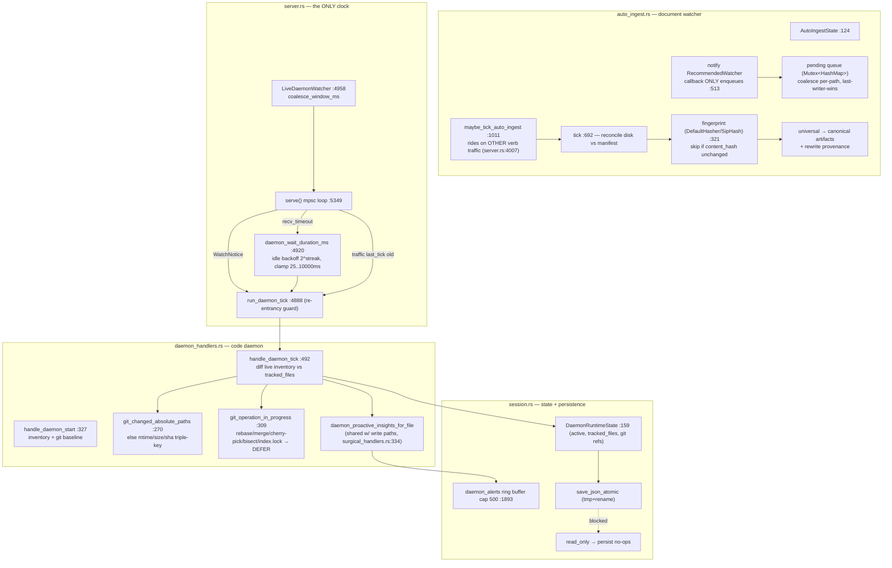
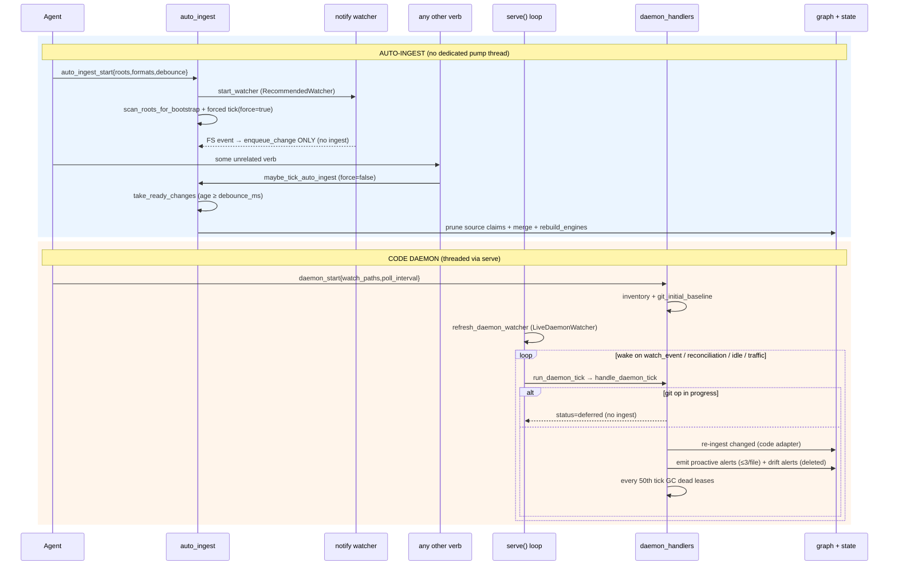
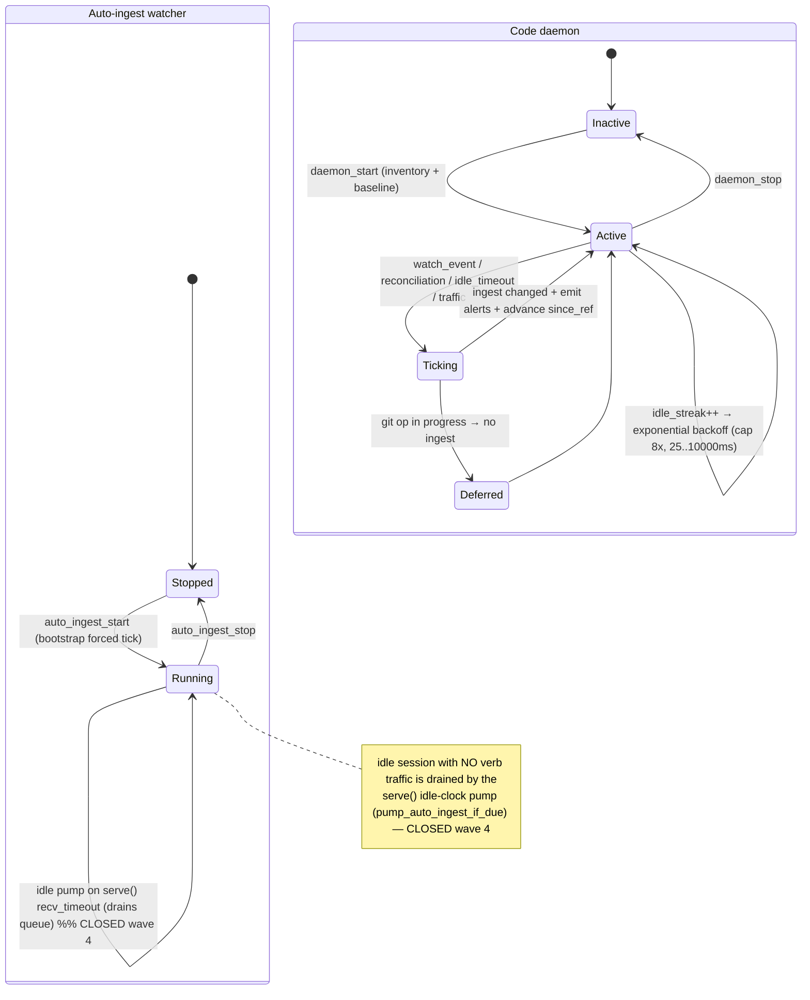

# auto-ingest-daemon

Two cooperating in-process freshness engines: a document auto-ingest watcher (notify-based, debounced, manifest+fingerprint incremental re-ingest) and a code daemon (git-native or polling change detection that re-ingests changed code files and emits proactive-insight + graph-vs-disk-drift alerts), both driven by the MCP server's single-threaded mpsc event loop — with no OS-level scheduler.

## Class/Component

## Sequence

## State/Flow

## Invariantes
- Debounce gate: a pending change is taken only when `force OR now - last_seen_ms >= debounce_ms` (:502) — editor save-bursts coalesce into one ingest.
- Pending queue coalesces per path, last-writer-wins on kind (:248; test `enqueue_coalesces_last_kind` :1082) — at most one entry per canonical path.
- Directories never enqueue; missing paths always enqueue as Delete (`watch_event_change_kind` :288).
- Fingerprint skip: identical `content_hash` → skipped, no graph mutation (:809-823; test `fingerprint_is_stable` :1135). Confirmed: `DefaultHasher` → `{:016x}` at :337-339.
- Claim-scoped replacement: every upsert prunes the source's prior SourceClaims before merging; delete prunes without merge — the graph stays a pure function of disk.
- read_only sessions never re-ingest or persist: `maybe_tick` short-circuits (:679); `persist_daemon_state/alerts` no-op with a logged skip.
- Daemon tick requires active daemon: `handle_daemon_tick` errors InvalidParams if `!active` (:497).
- Git-operation safety: a tick fully DEFERS (no ingest) while rebase/merge/cherry-pick/bisect/index.lock exists (:509-536; test `daemon_tick_defers` :1476). Confirmed via `git_operation_in_progress` :309.
- Re-entrancy: `run_daemon_tick` sets `pending_rerun` instead of overlapping when `tick_in_flight`, then runs exactly one reconciliation rerun (:4888-4918).
- Change detection triple-key: changed iff mtime OR size OR sha differ (or untracked) (:568-573).
- Idle backoff bounded: effective = poll · 2^min(idle_streak, max_backoff-1), clamped 25..10_000ms (:4932); any change/alert resets streak to 0.
- Bounded memory: recent_events cap 40; daemon_alerts cap 500; daemon proactive alerts cap 3/file. Atomic persistence via tmp+rename.
- git `since_ref` monotonically advances to current HEAD after each successful scan (:558-560).

## Gaps
- **[high] Auto-ingest has no background pump** — **CLOSED** (hardening wave 4): `serve()`'s `recv_timeout` Timeout arm now calls `pump_auto_ingest_if_due` (auto_ingest.rs), which reuses `maybe_tick`'s read-only / not-running / empty-queue short-circuits. It rides the SAME idle clock that already drives the code daemon's native_fs reconciliation — no new thread — so an idle session with zero verb traffic drains its queue, and an empty tick stays cheap. RED: a change enqueued into a running auto-ingest with no verb call is drained purely by the idle pump.
- **[medium] Content hashing used `DefaultHasher` (SipHash, 64-bit, non-crypto) under a `sha256` name** — **CLOSED for the code daemon / file inventory**: `FileInventoryEntry::sha256` (and `DaemonTrackedFile::sha256`) now carry a REAL SHA-256, 64 lowercase hex chars, produced by the workspace's single hashing routine `m1nd_ingest::ownership::sha256_bytes`. The three duplicated 16-hex folds (`tools.rs`, `daemon_handlers.rs`, `audit_handlers.rs`) collapsed into one shared `audit_handlers::content_sha256`, so every producer (`ingest`, `daemon_start`/`daemon_tick`, `audit`) and every consumer (`am_i_stale`, `cross_verify(evidence_freshness)`, `delegate`'s staleness header) compare the same honest digest — and a client that hashes the file itself now actually matches. RED: `content_sha256_is_a_real_sha256_digest` + `file_inventory_records_the_real_sha256` (audit_handlers.rs tests) pin the published sha256("")/sha256("abc") vectors and the 64-char length. **One-time cost:** inventories captured before this change no longer match, so the first run after upgrading re-reads/re-ingests once. **Still open:** the auto-ingest document watcher's own `content_hash` (auto_ingest.rs `file_fingerprint`) remains a 16-hex `DefaultHasher` fold — that field is *named* honestly (`content_hash`, not `sha256`), but it is still non-crypto and not stable across rustc versions, so a collision could make a real edit read as unchanged and be silently skipped.
- **[medium] Git changed-set silently drops files the diff reports but the live inventory omits** (gitignore/walker-skip mismatch): the loop only pushes entries found via same_path_text, with no skip counter or drift alert for unmatched diff paths (daemon_handlers.rs:548-557).
- **[medium] No auto-resume of an interrupted watcher**: `load()` forces `running:false`, `watcher:None` (:141-153); even a prior read-write session that left `running=true` gets no auto-resume — recovery requires re-calling `auto_ingest_start`.
- **[low] daemon `active=true` persisted but watcher is process-bound**: rebuilt only by `refresh_daemon_watcher` on serve() startup; a load path WITHOUT serve() (one-shot CLI) would have an active-but-unwatched daemon.
- **[low] Alert ring buffer drains oldest-first with no severity preservation**: a burst of low-value `co_change_prediction` alerts can evict an unacked critical `graph_vs_disk_drift`.
- **[low] Daemon `last_tick_ms` mutated from a non-tick path** (write-path apply, surgical_handlers.rs:597) — perturbs due/overdue scheduling even when no daemon tick ran.
- **[low] `file_fingerprint` reads the whole file on every candidate** before the content_hash skip check (:791→:809); no cheap mtime/size pre-filter — a burst forces N full reads + hashes per tick.

## Addendum — Gardener v1 (2026-07-12, `feat/gardener-v1`; line refs above predate this arc)

The arc law is `docs/voice/ASKGOD-VERDICT-GARDENER.md`; design + measured cost in
`docs/voice/GARDENER-V1.md`. What changed structurally in the systems this sheet maps:

- **Fail-open vigils:** the inline auto-ingest tick in `dispatch_tool` no longer
  propagates (`vigil_fail_open`, server.rs) — a watcher error can never fail an
  agent's tool call. The daemon paths were already fail-open (audited).
- **Resume sanitization:** `load_daemon_state` (session.rs) sanitizes transient
  runtime flags on boot — `tick_in_flight`/`pending_rerun` reset (the persisted
  mid-tick `true` used to WEDGE every resumed daemon), and a resumed
  `watch_backend:"native_fs"` downgrades to `polling` (only a live stdio watcher
  may claim the label — HTTP status honesty). This CLOSES the two gaps above:
  "[medium] No auto-resume …" (the daemon half — `active` now resumes AND ticks;
  the auto-ingest half still requires `auto_ingest_start`) and
  "[low] daemon active=true persisted but watcher is process-bound" (the label
  is now honest on watcherless boots; per-brain daemons advance by traffic).
- **Burst backlog:** `handle_daemon_tick` no longer truncates the changed set —
  the full detection enters the persisted `pending_backlog` (FIFO, dedup) and
  drains `max_files` per tick; `git_since_ref` advances immediately because the
  backlog owns the tail. Coalesce window 75 ms → 500 ms with a 5 s cap
  (`BURST_COALESCE_WINDOW_MS`/`_CAP_MS`).
- **Auto-reconcile:** after a burst settles (45 s quiet window, pushed by every
  activity tick), the tick reconciles the RATIFIED system-blocks store —
  voluntary yield to a live `candidate_lease`, fresh OCC key per attempt, one
  retry, then an `auto_reconcile_conflict` alert. Candidate skeletons skip.
- **Hosted-brain guard:** `auto_ingest_start` can no longer demote a
  manifest-bound `workspace_root` (the #326 class).
