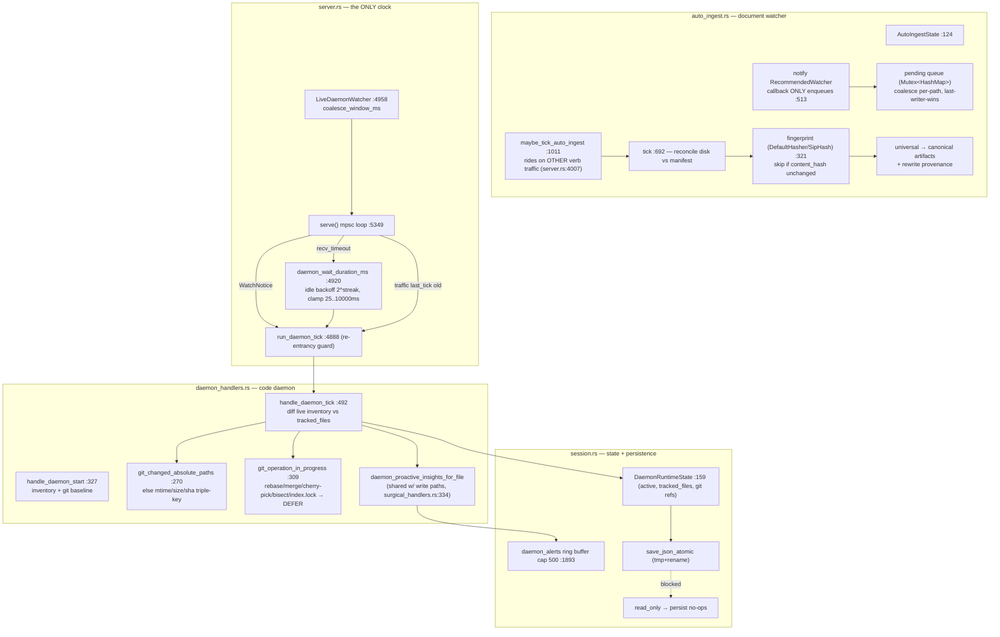
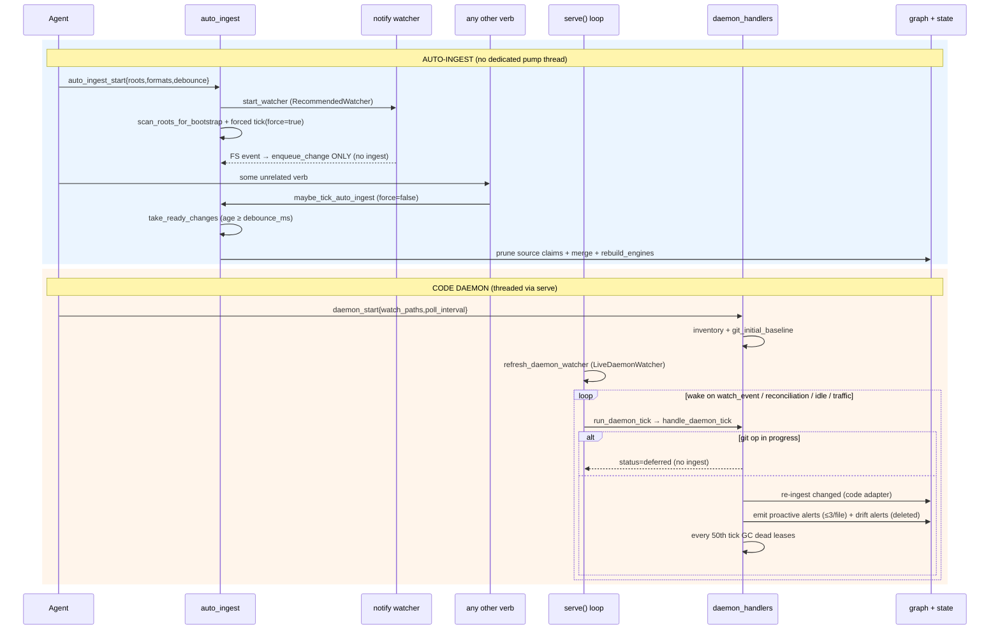
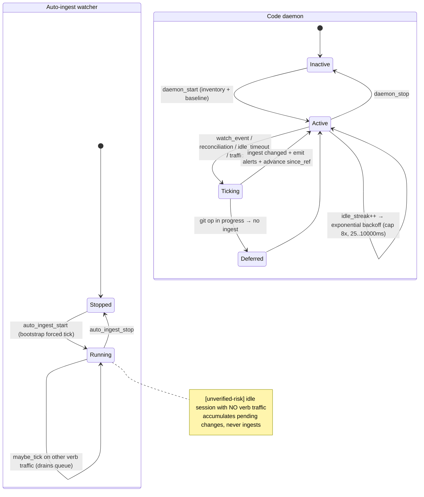

# auto-ingest-daemon

Two cooperating in-process freshness engines: a document auto-ingest watcher (notify-based, debounced, manifest+fingerprint incremental re-ingest) and a code daemon (git-native or polling change detection that re-ingests changed code files and emits proactive-insight + graph-vs-disk-drift alerts), both driven by the MCP server's single-threaded mpsc event loop — with no OS-level scheduler.

## Class/Component



## Sequence



## State/Flow



## Invariantes
- Debounce gate: a pending change is taken only when `force OR now - last_seen_ms >= debounce_ms` (:502) — editor save-bursts coalesce into one ingest.
- Pending queue coalesces per path, last-writer-wins on kind (:248; test `enqueue_coalesces_last_kind` :1082) — at most one entry per canonical path.
- Directories never enqueue; missing paths always enqueue as Delete (`watch_event_change_kind` :288).
- Fingerprint skip: identical `content_hash` → skipped, no graph mutation (:809-823; test `fingerprint_is_stable` :1135). Confirmed: `DefaultHasher` → `{:016x}` at :337-339.
- Claim-scoped replacement: every upsert prunes the source's prior SourceClaims before merging; delete prunes without merge — the graph stays a pure function of disk.
- read_only sessions never re-ingest or persist: `maybe_tick` short-circuits (:679); `persist_daemon_state/alerts` no-op with a logged skip.
- Daemon tick requires active daemon: `handle_daemon_tick` errors InvalidParams if `!active` (:497).
- Git-operation safety: a tick fully DEFERS (no ingest) while rebase/merge/cherry-pick/bisect/index.lock exists (:509-536; test `daemon_tick_defers` :1476). Confirmed via `git_operation_in_progress` :309.
- Re-entrancy: `run_daemon_tick` sets `pending_rerun` instead of overlapping when `tick_in_flight`, then runs exactly one reconciliation rerun (:4888-4918).
- Change detection triple-key: changed iff mtime OR size OR sha differ (or untracked) (:568-573).
- Idle backoff bounded: effective = poll · 2^min(idle_streak, max_backoff-1), clamped 25..10_000ms (:4932); any change/alert resets streak to 0.
- Bounded memory: recent_events cap 40; daemon_alerts cap 500; daemon proactive alerts cap 3/file. Atomic persistence via tmp+rename.
- git `since_ref` monotonically advances to current HEAD after each successful scan (:558-560).

## Gaps
- **[high] Auto-ingest has no background pump**: the notify callback ONLY enqueues (confirmed :513-561 — callback body is `enqueue_change` only); the queue is drained solely by `maybe_tick_auto_ingest` riding on OTHER verb traffic (server.rs:4007) or the one forced bootstrap tick. In an idle session, watched-file changes sit in the queue indefinitely. The daemon's native_fs event path IS threaded via serve(); auto-ingest is NOT.
- **[medium] Content hashing uses `DefaultHasher` (SipHash, 64-bit, non-crypto)** for change detection in BOTH systems; the field is named `sha256` (session.rs:203) but is NOT sha256 — a naming lie. Truncated 16-hex + collision could make a real edit read as unchanged and be silently skipped.
- **[medium] Git changed-set silently drops files the diff reports but the live inventory omits** (gitignore/walker-skip mismatch): the loop only pushes entries found via same_path_text, with no skip counter or drift alert for unmatched diff paths (daemon_handlers.rs:548-557).
- **[medium] No auto-resume of an interrupted watcher**: `load()` forces `running:false`, `watcher:None` (:141-153); even a prior read-write session that left `running=true` gets no auto-resume — recovery requires re-calling `auto_ingest_start`.
- **[low] daemon `active=true` persisted but watcher is process-bound**: rebuilt only by `refresh_daemon_watcher` on serve() startup; a load path WITHOUT serve() (one-shot CLI) would have an active-but-unwatched daemon.
- **[low] Alert ring buffer drains oldest-first with no severity preservation**: a burst of low-value `co_change_prediction` alerts can evict an unacked critical `graph_vs_disk_drift`.
- **[low] Daemon `last_tick_ms` mutated from a non-tick path** (write-path apply, surgical_handlers.rs:597) — perturbs due/overdue scheduling even when no daemon tick ran.
- **[low] `file_fingerprint` reads the whole file on every candidate** before the content_hash skip check (:791→:809); no cheap mtime/size pre-filter — a burst forces N full reads + hashes per tick.
```
