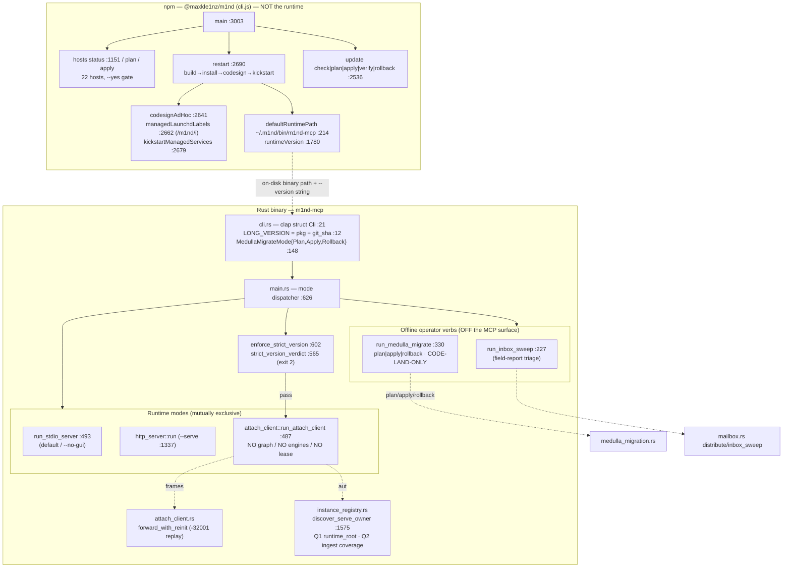
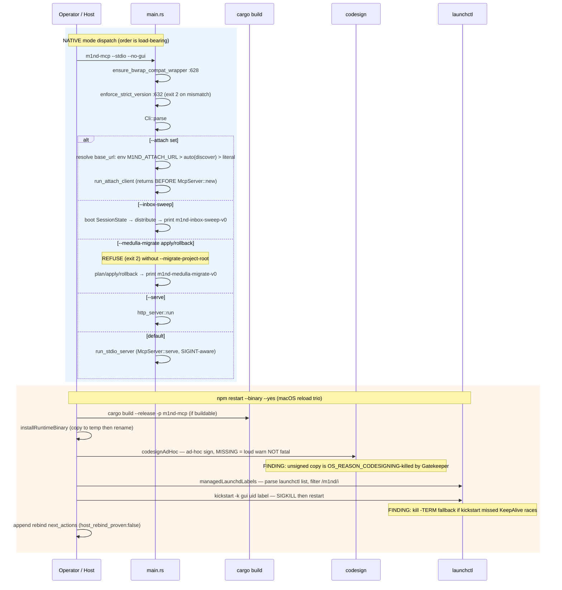
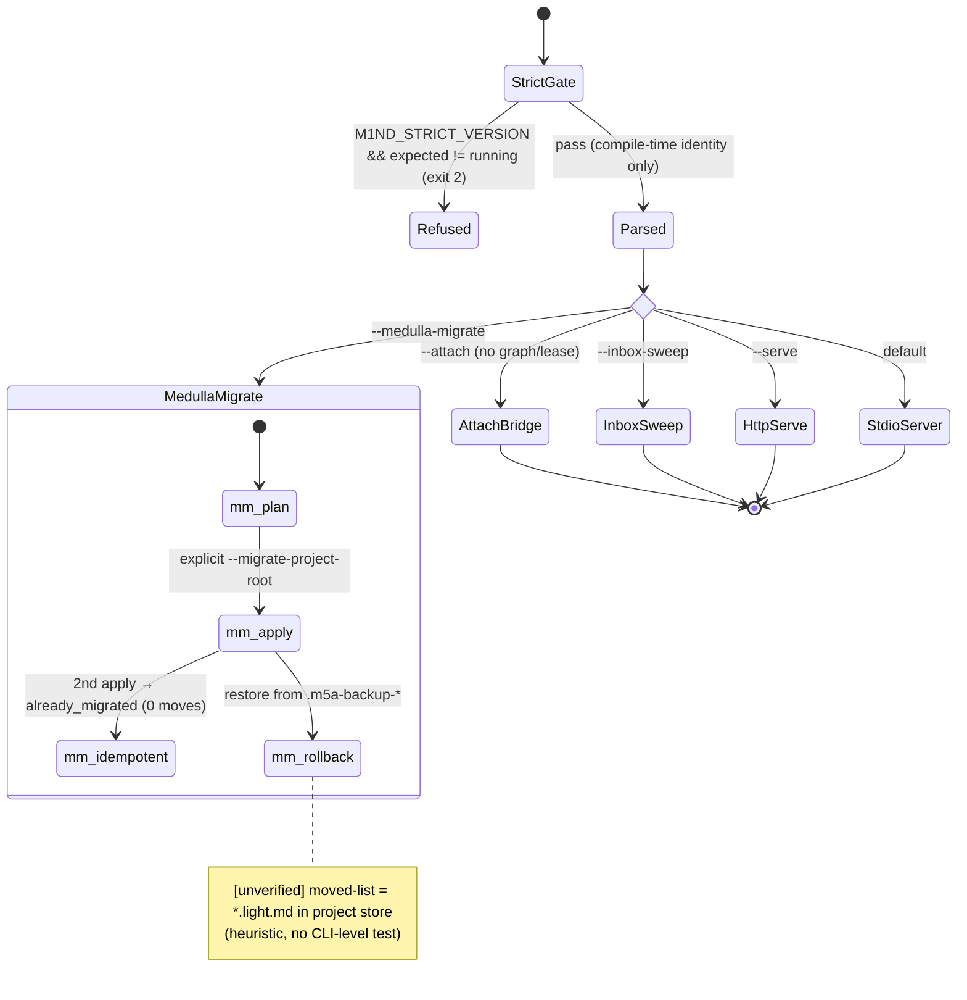

# cli-operator-surface

A two-layer front door: a Rust clap binary (`m1nd-mcp`) that selects one runtime mode (stdio MCP / `--serve` HTTP / `--attach` bridge) or runs one of three offline one-shot operator verbs, plus an npm installer/repair CLI (`m1nd` cli.js) that wires agent hosts to that binary and repairs stale bindings (restart/update/hosts/doctor/kickstart). The two layers meet ONLY through the on-disk runtime binary path and version strings — never in-process.

## Class/Component



## Sequence



## State/Flow



## Invariantes
- `--attach` loads NO graph, builds NO engines, takes NO lease: the branch returns before `load_config_from_cli` and can never reach `McpServer::new` (confirmed main.rs :640-680, attach branch precedes config load).
- Strict-version refusal runs before any session/graph/lease, using only compile-time identity; refusal is exit code 2 (confirmed `strict_version_verdict` :565 returns Some(msg) on version_mismatch||sha_mismatch).
- `--read-only` (or truthy `M1ND_READ_ONLY`) always wins over a config file — force-OR'd onto `config.read_only`.
- `--medulla-migrate` apply/rollback REFUSE (exit 2) without explicit `--migrate-project-root`; destination brain is never derived from ambient binding (test `apply_without_explicit_project_root_is_refused`).
- `--medulla-migrate` is idempotent: a second apply moves zero claims and reports `already_migrated`.
- Relative persist targets anchor under `runtime_dir`; explicit absolute paths pass through untouched; the `temp` sentinel resolves to an OS-temp per-pid file (6 unit tests).
- `--attach auto` resolves only a ReadWrite AND `owner_live==Some(true)` AND `!stale` owner with a reachable URL; stdio-only owners publish no port and are skipped. Those four gates are shared by BOTH discovery questions (`is_attachable_serve_owner`): (1) runtime_root match, then (2) an owner whose declared roots (`workspace_root` + `ingest_roots.json`) COVER the caller root — canonical path identity, worktree resolved to its main repo, `>1` covering owner refuses naming all candidates, and the bearer token is read from the RESOLVED owner's runtime root, not the client's.
- npm restart/update mutate ONLY with `--yes`; check/plan/status are read-only dry-runs.
- launchd labels discovered GENERICALLY from `launchctl list` filtered `/m1nd/i` — never a hardcoded personal label (confirmed `managedLaunchdLabels` :2662-2671).
- A missing `codesign` tool is a loud warning appended to next_actions, never fatal (confirmed `codesignAdHoc` :2643 returns `{missing:true}` on ENOENT).
- Every npm operator command carries a `non_claims` list: does NOT prove a live host rebound / refresh a cached tool list / repair graph.
- `stopRuntimeProcesses` never kills its own pid; matches only `argv[0]` basename == `m1nd-mcp[.exe]`.

## Gaps
- **[high] `restart --yes` macOS reload trio is entirely untested**: `codesignAdHoc`/`managedLaunchdLabels`/`kickstartManagedServices` (confirmed present cli.js:2641/2662/2679) have ZERO coverage — all three `restart()` test calls use `--no-kill` or omit `--yes`, so the codesign/kickstart/kill branch never runs. The exact Gatekeeper/launchd incident it was built for cannot be regression-guarded.
- **[high] `--medulla-migrate rollback` has no CLI-level proof**: reachable + mutating, but no test invokes it. The moved-list is reconstructed heuristically (files ending `.light.md` in the project store, confirmed main.rs:435-445) and unverified end-to-end; `most_recent_backup` :477 also untested at the seam.
- **[medium] `--attach auto` owner-discovery CLI path untested at binary level**: `resolve_attach_auto` precedence (env>auto>literal) + runtime_root derivation; a misresolved runtime_root would silently bridge to the wrong owner or fail. Only `instance_registry`'s in-module tests exercise discovery.
- **[medium] `--inbox-sweep` has no binary-level test**: the multi-step `run_inbox_sweep` flow is only indirectly covered by the mailbox module tests.
- **[medium] crates.io↔npm dist-tag parity enforced only by a human-invoked skill** (`/release-parity`, `disable-model-invocation:true`), not CI — the historical npm-lags-crates.io (beta.8 vs beta.0) failure can recur if the operator forgets.
- **[low] `restart --yes` does not verify the swapped binary's version/sha before declaring done** (unlike `update apply`'s `version_verified` gate); `after_version` is read but not asserted against an expected target.
- **[low] `managedLaunchdLabels` matches ANY `/m1nd/i` label and kickstarts all of them**: a co-resident non-owner m1nd service would be force-restarted by an unrelated repair.
```
