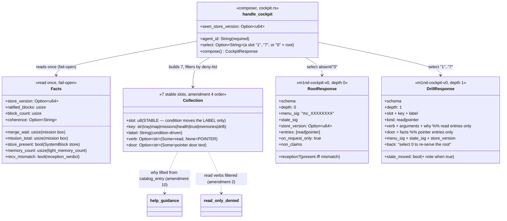
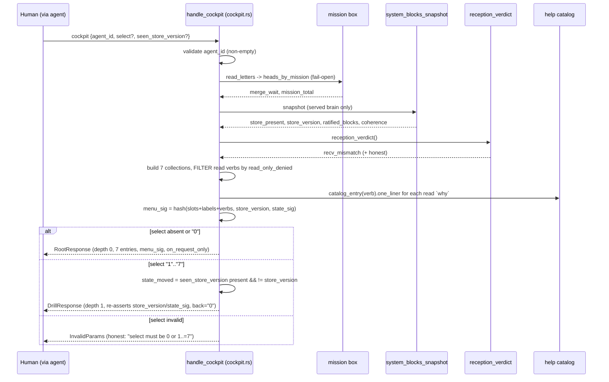

# The Cockpit — the navigable m1nd menu (`cockpit`)

`cockpit(agent_id, select?, seen_store_version?)` is a pure read-only COMPOSER:
the human's ON-REQUEST router over m1nd's read surfaces. It is a **sibling of
`north`, never a field of it** — if it breaks it breaks ALONE, never taking
`north` down (fail-open does not apply). It reads the same cheap surfaces
`north` already touches (the mission box, the served brain's SystemBlock store,
the durable-memory count, the reception verdict) to label the menu honestly, and
never mutates anything.

Law source: the askGOD verdict "the navigable cockpit" (2026-07-12, CHANGE with
10 required changes) — `docs/voice/ASKGOD-VERDICT-COCKPIT.md`. The widget that
renders it: `docs/voice/WIDGET-TEMPLATE.md`.

## Class

## Sequence — compose + drill

## The ten laws (amendment → where it lands)

| # | Amendment | Where it lands |
|---|---|---|
| 1 | dedicated read-only verb, sibling of north, no fail-open | `handle_cockpit`; NOT in `READ_ONLY_DENIED_TOOLS`; own dispatch arm |
| 2 | read-only law DERIVED from the single source + Rust test | `.filter(read_only_denied)`; `cockpit_read_verbs_are_never_write_denied` |
| 3 | pointer entries carry NO verb — only door text | `Collection.verb == None` for tray/missions; `pointer_entries_carry_no_verb` |
| 4 | root = argument-less reads only; impact/why/trace OUT | seven collections; no analysis verb in the root |
| 5 | max depth 3 (root→collection→item); "0" = back | `depth` 0/1; `select:"0"` re-serves root |
| 6 | stable slots for the trio; menu_sig; drill re-asserts store_version/state_sig | `slots_are_stable_across_conditions`; `state_moved` |
| 7 | widget payload = number + menu_sig, never free text / write verb | `menu_sig`; `docs/voice/WIDGET-TEMPLATE.md` |
| 8 | on-request only; no landing auto-serve | `on_request_only:true`; negative default in `M1ND_INSTRUCTIONS` §7 + 3 skills |
| 9 | own budget, battery-pinned | ~695 tokens root (≤800 ceiling); ~430 drill — 2026-07-12 |
| 10 | reuse the help machine (catalog), never a parallel one | `why` from `help_guidance::catalog_entry` |

## Invariantes

- **Sibling, not a field — breaks alone**: `cockpit` has its own dispatch arm and
  is read-only-safe; a compose miss returns a cockpit error and never touches the
  `north` packet (cockpit.rs; amendment 1).
- **Read-only derivation, mechanical**: every root read verb is filtered through
  `server::read_only_denied` at compose time, and `cockpit_read_verbs_are_never_write_denied`
  intersects the routed set with the write deny-list — a verb that becomes a
  mutation drops itself, no hand-kept list (amendment 2).
- **Pointer purity**: the tray and missions carry a `door` and NO `verb` — there
  is nothing to execute even by mistake; the stamp stays a human gesture at the
  tray (amendment 3).
- **Per-brain only**: the map/bell/memory facts read the BOUND brain's own
  surfaces; the cockpit never aggregates across brains, and warns honestly under
  `caller_root_mismatch` (the menu describes the bound brain, not the caller's repo).
- **Stable slots, moving labels**: the seven collections keep their slots across
  every condition; only the label moves (`slots_are_stable_across_conditions`;
  amendment 6).
- **Anti-staleness**: `menu_sig` is a deterministic digest of the served menu; a
  drill re-asserts `store_version`/`state_sig` and flags `state_moved` when the
  caller's `seen_store_version` diverged (amendment 6).
- **Own budget**: root ~695 tokens, drill ~430 (≤800 ceiling), battery-pinned
  2026-07-12 — north's pin does not cover it (amendment 9).

## Gaps / deferred (honest)

- **Router, not executor (v1 scope)**: a read drill presents the argument-less
  call to RUN (like the help overview presents `minimal_calls`); its OUTPUT carries
  the live detail (receipts/hashes render in the item view, amendment 5). The
  cockpit never fabricates a receipt — it routes. Serving verb output inline is a
  future slice.
- **Per-item drill (depth 2, impact/why/trace)**: explicitly OUT of v1 (amendment
  4) — reserved as drill-down actions from a selected item.
- **`state_sig` is the menu's own** (`bell|map|coh|recv|sv`), not byte-identical to
  the human_view sig; both re-affirm the same beat. Unifying them is a future tidy.
