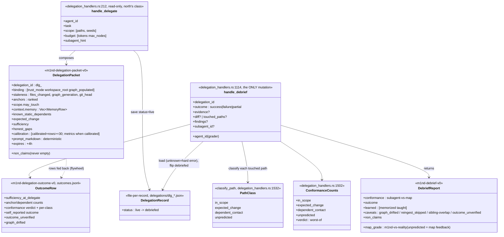
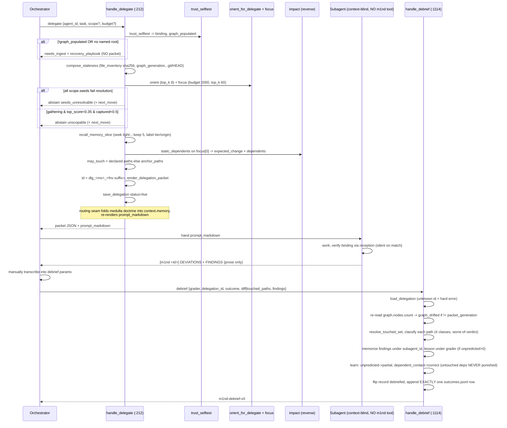
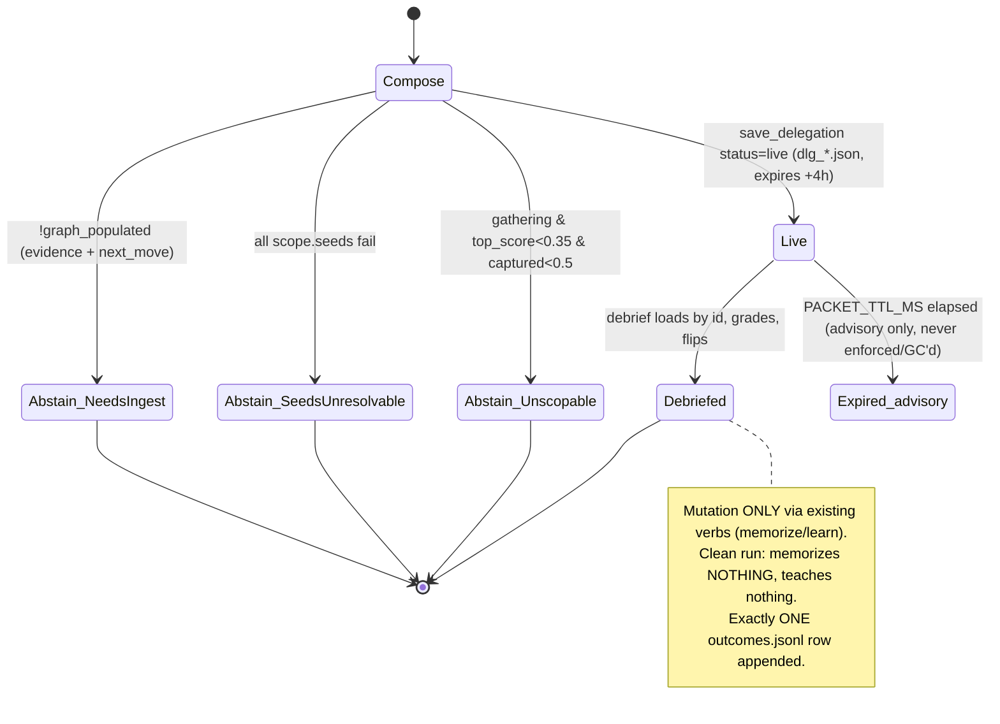
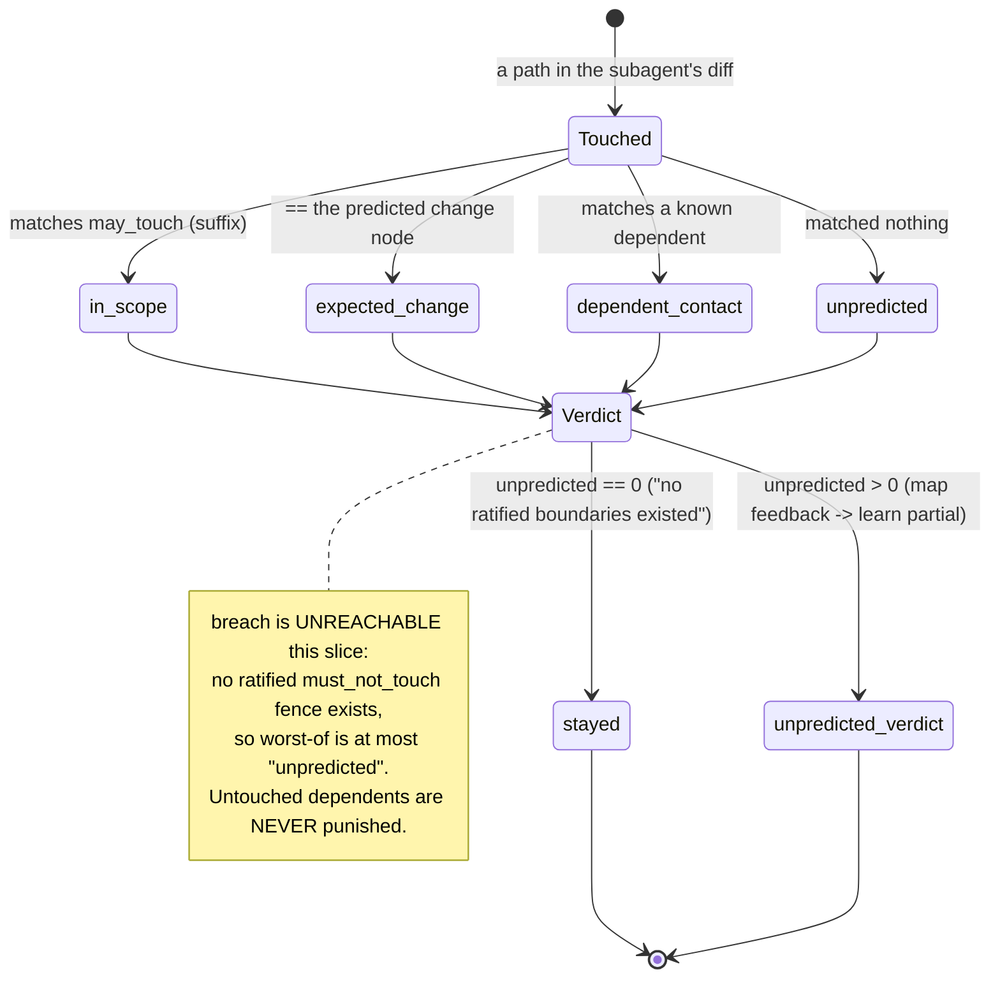

# Delegation Layer (ORGANISM ladder R6-R7)

A two-verb layer that turns the retrieval-half of a subagent's spec into one grounded,
honest, read-only delegation packet (`delegate`) and later grades the spawned agent's
real diff against that packet's static map, teaching the graph through existing verbs
(`debrief`). Every delegation is meant to make the next packet smarter — but the
calibration flywheel is not yet wired to consume the outcomes it records.

## Class

## Sequence — delegate -> child -> debrief (the loop)

## State/Flow — delegation record lifecycle + abstain gates

## State/Flow — path conformance classification (worst-of verdict)

## Invariantes

- **delegate NEVER emits a packet on an empty/unbound graph** — returns needs_ingest + recovery_playbook (delegation_handlers.rs:320-338 — verified: handle_delegate at :212).
- **delegate is read-only**: absent from READ_ONLY_DENIED_TOOLS; its ONLY side effect is the dumb registry record.
- **debrief is the ONLY mutation** and mutates ONLY through existing verbs (handle_light_author/handle_learn) — no bespoke graph write (verified: handle_debrief at :1114).
- **mission.binding.workspace_root == the exact covers_root datum the child later compares via reception** (binding_workspace_root :91) — two hops, provably identical; the child verifies, never chooses (verified: binding_workspace_root at :91).
- **Every abstain carries evidence + a next_move** — never a bare no (seeds_unresolvable, unscopable, needs_ingest).
- **non_claims is NEVER empty**; each omitted stage-5 section adds one honest drop-out line; the renderer's final 'what m1nd could NOT determine' section is NEVER dropped.
- **outcome enum is EXACTLY success|failure|partial** — any other value is InvalidParams.
- **delegation_id must be a generated dlg_* id with only [A-Za-z0-9_-]** (no path separators) — gates both save and load.
- **Unknown delegation_id on debrief is a hard error** — no guessing.
- **breach is UNREACHABLE in this slice**: with no ratified must_not_touch fence the worst-of verdict is at most 'unpredicted'.
- **Untouched dependents are NEVER punished** — learn(correct) fires only for dependents actually contacted.
- **Clean runs memorize NOTHING and teach nothing** — no filler memories.
- **A self-reported outcome with no attached evidence is stamped outcome_unverified**; `calibration.calibrated` is derived from the ledger — `false` below N ≥ 30, `true` at/above (hardening wave 4: `calibration_metrics_from_rows`; the hardcoded `false` is gone). The three quality numbers print ONLY once calibrated (bands/counts only below the floor).
- **Exactly ONE outcomes.jsonl row is appended per debrief** (append_outcome_row — verified: at :1617).
- **The renderer is string-stable**: same packet in -> byte-identical markdown out (verified: render_delegation_packet at :896).
- **Memory rows are labeled cargo**: every row carries tier + origin_brain; absent provenance renders 'unknown', never faked to fresh (MED-INV-4).
- **Cross-store reads happen ONLY in the routing seam (mcp_http)** — the handler holds one lock and emits project-tier rows only.

## Gaps

- **[medium] Calibration flywheel is open-loop** — **CLOSED** (hardening wave 4): a pure reducer `calibration_metrics_from_rows` parses every ledger row and computes the three §O.12.8 metrics — scope_precision = Σ(in_scope+expected_change)/Σ(touched), miss_rate = Σ(unpredicted)/Σ(touched), dependents_honesty = P(failure|contact) − P(failure|stayed) — and flips `calibrated` on at N ≥ 30 (the numbers stay withheld below the floor, the predict-gate discipline; torn/zero-denominator rows never fabricate a ratio). The pure function is exhaustively unit-tested on synthetic ledgers. Residual by design: the scoping constants (0.35/0.5/budgets) are still UNTUNED — the sweep at N ≥ 30 is backlog; the loop MEASURES, it does not yet tune.
- **[medium] Report protocol is a prompt-only contract with no machine parser**: the renderer demands `[m1nd <id>]` + DEVIATIONS + FINDINGS, but nothing parses that string — the orchestrator must manually transcribe it into debrief params. A lazy/wrong transcription silently corrupts the conformance grade and the taught signal (renderer L1095-1102; debrief consumes only structured params).
- **[medium] Path classification is pure suffix/substring matching**: `s==path || s.ends_with(path) || path.ends_with(s)`, applied to both may_touch and dependents. Short/shared path fragments can mis-classify (a touched 'x.rs' matching may_touch 'prefix/x.rs' by suffix). No normalization to canonical repo-relative paths (classify_path L1538-1541 — verified: at :1532).
- **[low] static_dependents grounds the entire dependents pass on a SINGLE top focus node** (focus[0]); expected_change is likewise just that one node. If the true blast center is the 2nd+ anchor, the map is 'one anchor too tight' by construction — surfaced only reactively as an unpredicted lesson (delegation_handlers.rs:812-822 — verified: static_dependents at :806).
- **[low] Debrief never physically re-ingests the edited files**: conformance is graded against a possibly-stale graph; graph_drifted only compares node COUNT, so an edit changing bodies/edges without changing node count reads as not-drifted (reingest_skipped hardcoded).
- **[low] Registry has no eviction/GC**: every delegate writes a dlg_*.json forever; live_sibling_records reads the WHOLE directory each debrief (O(N-files) scan); expired packets (>4h TTL) never pruned (verified: recall_memory_slice at :685 is the memory feed; PACKET_TTL_MS advisory only).
- **[low] Sibling-overlap and outcome_unverified are advisory, not gates**: a same-worktree contaminated diff or an evidence-free outcome still writes a full ledger row and teaches learn signals — the calibration substrate can be polluted with no downweighting.
