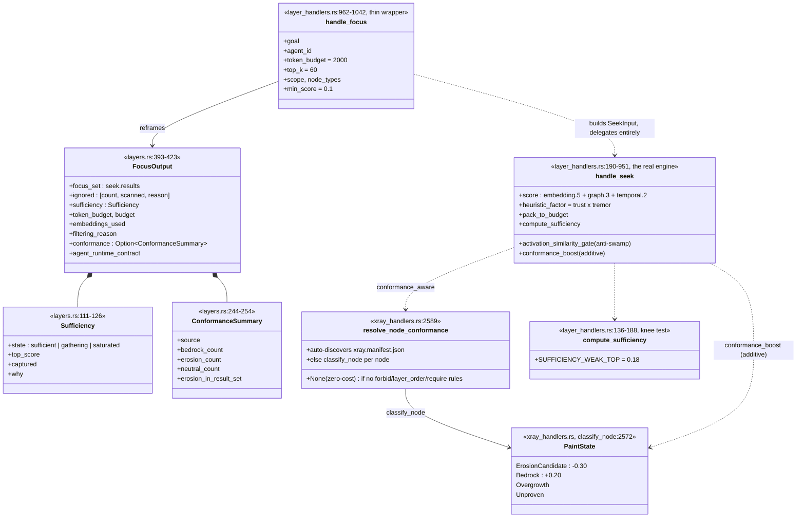
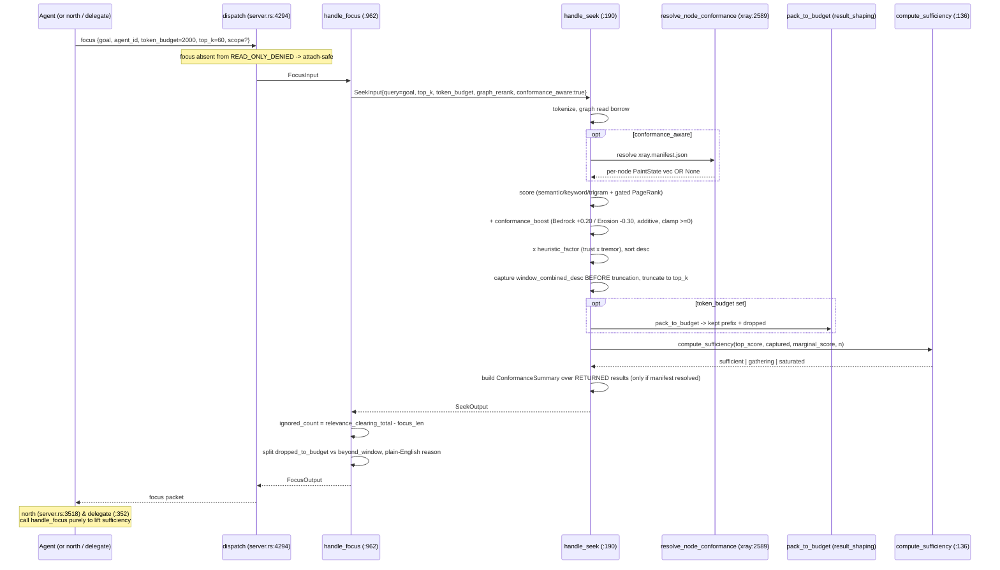
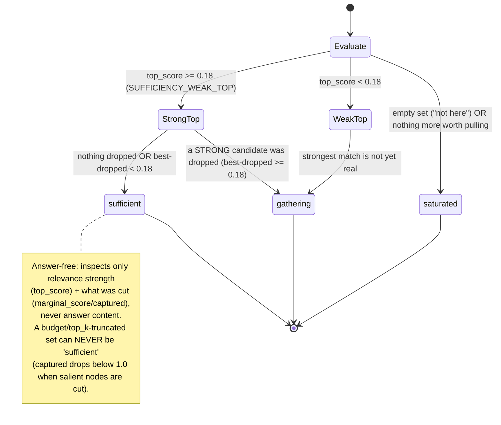
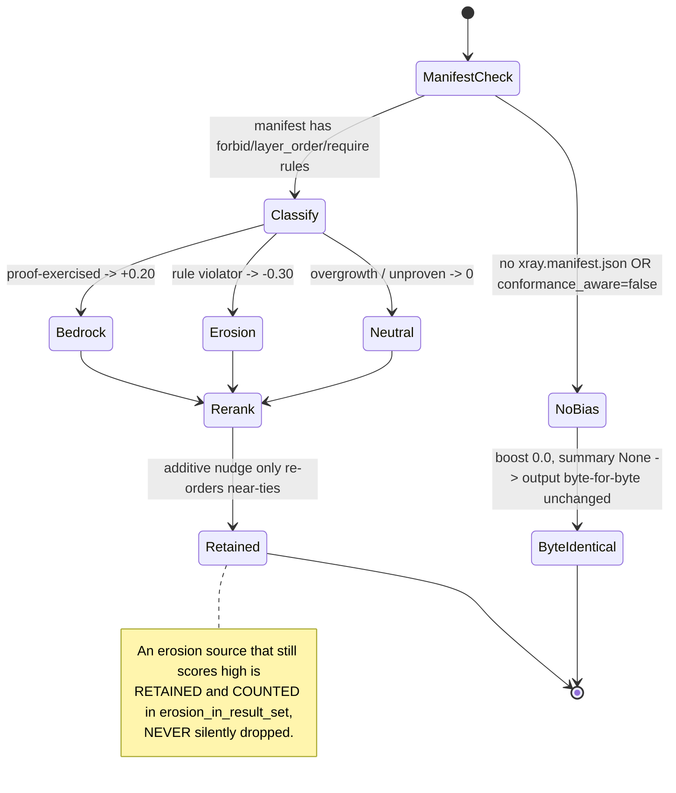

# Focus Runtime (attention) + conformance-aware retrieval

`focus(goal, budget)` is a thin, SHIPPED attention layer that rides `handle_seek`: it
reframes budget-bounded, conformance-biased retrieval as an explicit attention decision
— a minimal `focus_set`, an honest `ignored` tail, and an answer-free `sufficiency` stop
signal — and it is composed internally by `north` and `delegate`. It is NOT the
personalized-PageRank salience composer the PRD proposes; PRD-P1 shipped in reduced form
by delegating to seek, and P2/P3/P4 are unbuilt.

## Class

## Sequence — focus reframing (rides seek)

## State/Flow — sufficiency (knee-test stop signal)

## State/Flow — conformance bias (additive, never a cut)

## Invariantes

- **Byte-identical-by-absence**: no xray.manifest.json (or conformance_aware=false) => conformance_boost=0.0 and ConformanceSummary=None => seek/focus output is byte-for-byte unchanged (test: conformance_off_is_byte_identical — verified: resolve_node_conformance at xray_handlers.rs:2589 returns None on absence).
- **Additive-not-a-cut**: conformance is an ADDITIVE score nudge that only re-orders near-ties; an erosion source that still scores high is RETAINED and COUNTED in erosion_in_result_set, never silently dropped.
- **Honest ignored**: ignored.count = relevance_clearing_total - focus_len, a conservative UPPER bound (pre-de-dupe) spanning budget drops AND top_k/window truncation; it can never read 0 while relevant nodes were truncated.
- **Never silently sufficient**: a budget- or top_k-truncated set must NEVER report sufficiency.state=='sufficient'; captured drops below 1.0 whenever salient nodes were cut.
- **Knee-test sufficiency**: 'sufficient' requires top_score >= SUFFICIENCY_WEAK_TOP (0.18) AND (nothing dropped OR best dropped < 0.18); a long weak tail does not force 'gathering', only a STRONG dropped candidate does (verified: compute_sufficiency at :136).
- **Answer-free**: sufficiency inspects only relevance strength (top_score) and what was cut (marginal_score/captured) — never answer content; empty set => 'saturated' with an honest 'not here' reason.
- **captured is an exact prefix ratio** in the same combined units the kept/dropped partition is decided in, computed from window_combined_desc captured BEFORE truncation — trust/tremor re-ranking cannot make a strong dropped node look retained.
- **Conformance reuses one evaluator**: resolve_node_conformance uses the exact erosion/exercised/indegree predicates and classify_node precedence as the X-RAY paint/gate/orient verbs — no divergent second classifier (verified: classify_node at :2572, resolve_node_conformance at :2589).
- **focus invents no scoring**: salience, budget packing, embeddings_used flag, recovery, and agent_runtime_contract are all lifted verbatim from handle_seek; the two stay consistent by construction (verified: handle_focus at :962 builds a SeekInput and delegates).

## Gaps

- **[medium] PRD<->code divergence**: focus is documented (PRD §3.1, §4.3) as a personalized-PageRank + RRF(bm25+model2vec) - taint salience COMPOSER, but the shipped handle_focus just delegates to seek (global-PageRank combined score, no bm25/RRF/forward-push/explicit-taint). Anyone reading the PRD mis-models the actual salience math; PRD header still 'PROPOSAL — awaiting approval' despite the feature shipping (docs/FOCUS-RUNTIME-PRD.md L85-90, L147-166 vs layer_handlers.rs:969-983).
- **[medium] No working-set / attention-budget manager (PRD P2)**: budget is per-call only; there is no cross-query budget state, no heat metric, no page-in/out, no pinning. focus cannot 'manage what is resident' across turns — the PRD's core 'RAM manager' role is absent (handle_focus:962-1042 is stateless w.r.t. attention budget).
- **[medium] Thresholds are hand-tuned magic numbers with NO calibration backing**: SUFFICIENCY_WEAK_TOP=0.18, boosts +0.20/-0.30, activation gate 0.15/0.30 are asserted-correct by construction but never validated against real tokens-to-answer / over-search-rate metrics, despite the PRD's 'measured not promised' criteria (consts at layer_handlers.rs:85, 91-92, 109-110; the 0.18 floor sits in an acknowledged 'genuinely ambiguous' 0.18-0.26 zone).
- **[low] Single-shape verb**: the PRD's focus modes (set/check/status) do not exist; FocusInput has no `mode` field. The 'check sufficiency only' and 'working-set status' surfaces are unbuilt (layers.rs FocusInput L347-371; server.rs schema L1200-1214).
- **[low] No anti-thrash / drift / skimmer (PRD P3)**: no value-of-information detection, no drift->refocus on stale evidence/cache_generation, no goal-conditioned tool-output pruning — design-only.
- **[low] read-only safety is only IMPLICIT**: read_only_deny_list_is_precise (server.rs:5643-5680) does NOT assert `focus` in its allow-list. A future edit adding focus to READ_ONLY_DENIED_TOOLS would silently break north/delegate in attach mode with no test catching it.
- **[low] Terminology collision**: 'conformance' names TWO unrelated subsystems — retrieval-bias conformance (this system) and delegation diff-grading conformance (delegation_handlers.rs:1224-1502) — same word, disjoint machinery.
- **[low] trust_envelope asymmetry**: seek composes a per-answer trust_envelope that ships dark; focus does not re-surface it in FocusOutput (no field). Minor.
