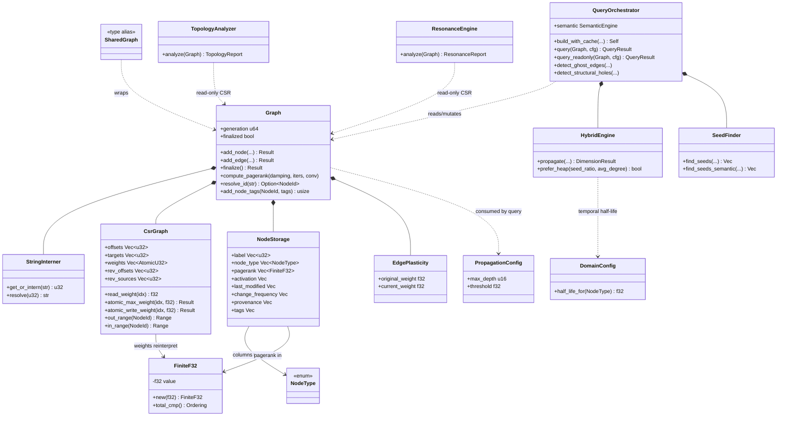
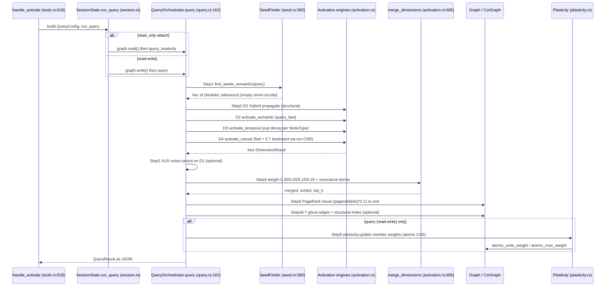
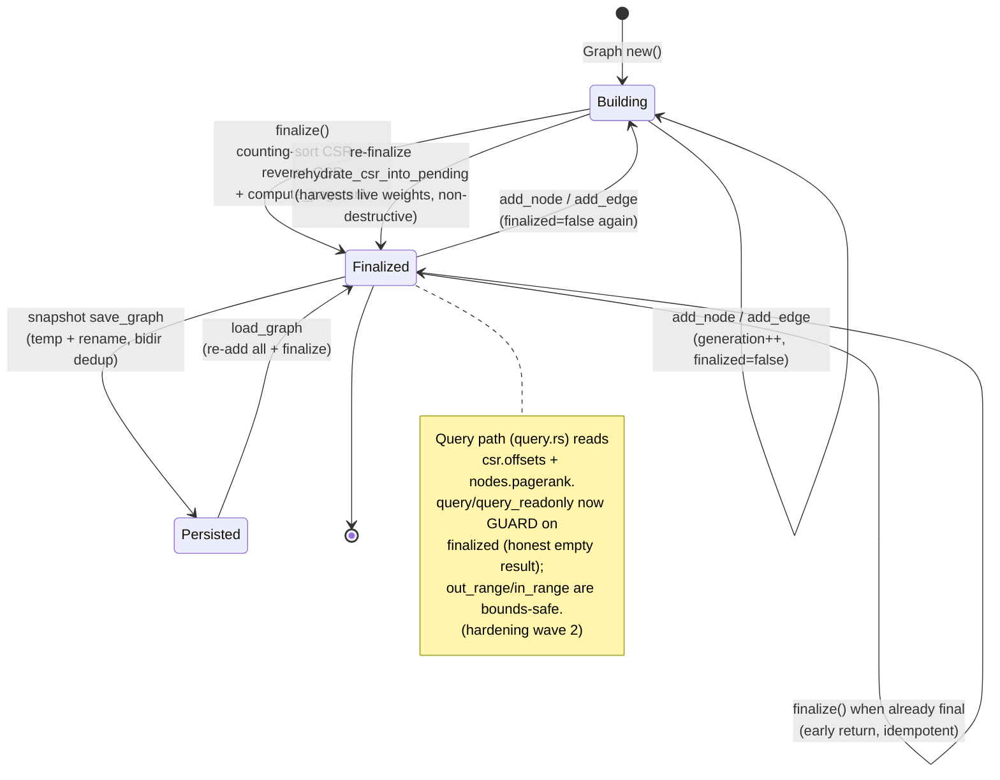

# Graph Core (neuro-symbolic substrate) — m1nd-core

Struct-of-Arrays CSR property graph + 4-dim spreading activation + PageRank anchors + Louvain/spectral topology + wave resonance + atomic snapshot persistence. The in-memory engine every higher m1nd verb rides on.

## Class

## Sequence

Main query flow (activate/why/impact verb through the 8-step pipeline). Read-write path shown; read-only attach swaps `query` for `query_readonly` and skips Step 8.

## State/Flow

The lifecycle a Graph moves through (the `finalized` invariant is central — several GAPS below stem from querying while `finalized=false`).

## Invariantes

- FiniteF32 cannot hold NaN/Inf: debug panics, release clamps to 0.0; gives total order safe for sort/Ord/Hash (types.rs:20-73).
- PosF32/LearningRate/DecayFactor reject non-positive/out-of-range at construction, so division by freq/wavelength/half-life never yields NaN/Inf (types.rs:112-189).
- Duplicate external node id rejected: add_node returns Err(DuplicateNode) if interned id present (graph.rs:484-487).
- Dangling edges rejected at add_edge: source/target must be less than node count or Err(DanglingEdge) (graph.rs:528-539).
- Every structural mutation increments generation and sets finalized=false — stale-CSR use is detectable (graph.rs:509-510, 564-565).
- finalize idempotent when already finalized AND non-destructive across re-finalize: rehydrate_csr_into_pending harvests existing CSR edges with live plasticity weights before rebuild (graph.rs:681, 698-700; test refinalize_preserves_edges.rs).
- CSR offsets array is length n+1 with offsets[n]==total_edges; out_range/in_range slice [offsets[i], offsets[i+1]) (graph.rs:100-168).
- Edge weights are the single canonical store as AtomicU32 (bit-reinterpreted f32); reads via read_weight, writes via atomic_max/write with retry limit to Err(CasRetryExhausted) — lock-free plasticity under a shared read lock (graph.rs:105, 172-231).
- Bidirectional edges stored once canonically (source LE target) on save, re-expanded both directions on finalize/load — round-trip preserves edge set (graph.rs:604, 723-770; snapshot.rs:185).
- PageRank normalized to [0,1] by max, recomputed ONLY inside finalize (damping 0.85 / 50 iters / 1e-6) (graph.rs:848, 1073-1080).
- query_readonly borrows &Graph only and skips the sole &mut write (plasticity Step 8) — a read-only attach cannot perturb weights (query.rs:287-454).
- Snapshot writes atomic: serialize to path.tmp then rename over target (snapshot.rs:214-222).
- Plasticity export applies a NaN firewall (non-finite current to original); load rejects non-finite with Err(CorruptState) (snapshot.rs:301-345).
- Seed count capped at MAX_SEEDS=200; propagation depth capped at 20; resonance capped by pulse_budget=50000 — no unbounded traversal (seed.rs:13, activation.rs:179, resonance.rs:18/163).

## Gaps

- **[medium]** ~~PageRank staleness after incremental mutation.~~ **CLOSED** (hardening wave 2): a `pagerank_dirty` flag is set on every `add_node`/`add_edge` and cleared by `compute_pagerank`; the query Step-5 boost is skipped when dirty (degrades to un-boosted ranking) rather than re-ranking on stale/zero values (graph.rs, query.rs).
- **[medium]** ~~Queries can run against a non-finalized graph with no guard (out_range indexes empty csr.offsets; index-OOB risk).~~ **CLOSED** (hardening wave 2): `query`/`query_readonly` guard on `finalized` and return an honest empty result; additionally `out_range`/`in_range` are bounds-safe (empty range for an unbuilt CSR), removing the OOB risk for every caller (graph.rs:154-168, query.rs).
- **[medium]** ~~HeapEngine re-expansion bug: a later stronger signal never propagates onward; Bloom false-positives silently drop first-time nodes.~~ **CLOSED** (hardening wave 2): both engines re-relax an already-visited node when a new arrival exceeds the stored activation by `REEXPANSION_MARGIN` (decrease-key via re-push / re-add to next frontier; margin bounds re-pushes for termination); the Heap re-push also rescues a Bloom false-positive first-time node. Cross-engine equivalence test (brute-force fixpoint oracle) proves convergence (activation.rs).
- **[low]** SpectralGapAnalyzer documents Err(SpectralDivergence) but never returns it; non-convergence swallowed into converged=false; the error variant is dead for this path (topology.rs:421-422 vs 597-604).
- **[low]** Louvain non-convergence is silent: FM-TOP-003 branch is empty; detect() returns the partial assignment with no converged flag (topology.rs:194-196; CommunityResult has passes, no converged bool).
- **[low]** MultiScaleViewer is a facade over single-scale Louvain — always one ScaleView at scale 0, max_scales unused (topology.rs:829-840).
- **[low]** StringInterner grows monotonically (get_or_intern append-only); no node/edge removal API on Graph, so a long-lived mutated graph leaks interned strings until snapshot reload (graph.rs:44-52).
- **[low]** load_co_change_matrix does not reconstruct the matrix — reads metadata then returns an empty matrix; co-change temporal signal lost across JSON reload (snapshot.rs:378-385).
- **[low]** query and query_readonly duplicate ~120 lines of steps 1-7 verbatim; any change must be made twice or the mutating/read-only paths silently diverge despite the byte-identical promise (query.rs:162-285 vs 330-454).

## Proof gaps (from map proof_missing)

- ~~No test asserts querying a non-finalized graph is rejected or safe.~~ **CLOSED** (hardening wave 2): `query_on_non_finalized_graph_is_honest_empty_not_panic` (RED: previously panicked with index-OOB on the empty CSR; now an honest empty result).
- ~~No test proves PageRank freshness after incremental add.~~ **CLOSED** (hardening wave 2): dirty-flag lifecycle tests (`incremental_add_node/edge_marks_pagerank_dirty`, `refinalize_clears_pagerank_dirty`).
- ~~No cross-engine equivalence test (Heap vs Wavefront) large enough to trigger Bloom collisions.~~ **CLOSED** (hardening wave 2): `heap_and_wavefront_converge_to_fixpoint_on_weak_then_strong` (600-relay weak-first/strong-later topology vs an independent brute-force fixpoint oracle).
- No forced SpectralDivergence / Louvain converged-vs-capped test.
- No concurrency/stress test on the atomic weight CAS under real multi-reader + single-writer contention.
- No JSON to bin cross-format snapshot-equivalence property test.
