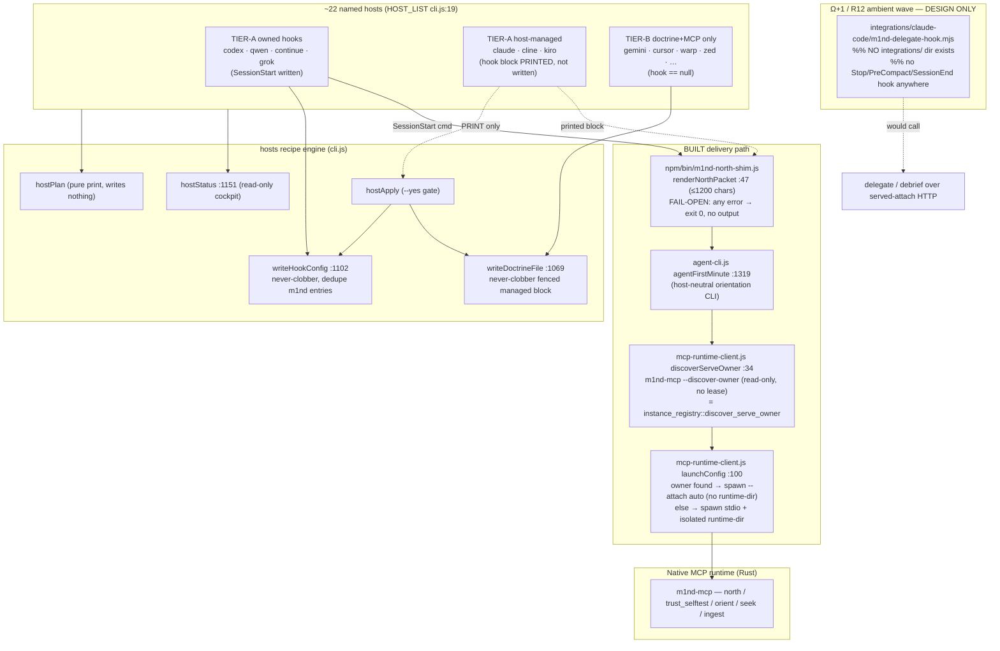
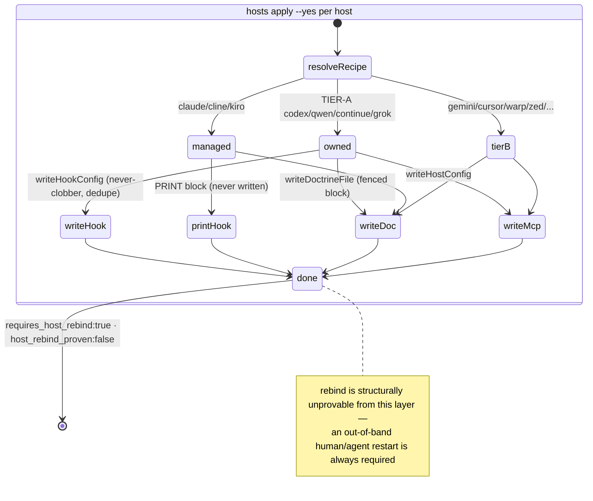

# host-integration-ambient-hooks

The multi-environment surface that gets a computed "north packet" in front of a coding agent at/before its first action on ~22 named MCP hosts — via a shipped SessionStart north-shim + `m1nd hosts plan/apply` recipe engine — while the deeper Ω+1/R12 "ambient wave" (Stop/PreCompact/SessionEnd distiller and the delegate-injection hook) remains PRD-only, entirely unbuilt.

## Class/Component (22 hosts → shim/apply/doctrine)



## Sequence

```mermaid
sequenceDiagram
    participant Host as Host (SessionStart hook)
    participant Shim as m1nd-north-shim.js
    participant FM as agent first-minute
    participant RC as McpRuntimeClient
    participant MCP as m1nd-mcp (Rust)

    Note over Host,MCP: BUILT SessionStart delivery (turn 0)
    Host->>Shim: m1nd-north-shim --repo $CWD --query orient
    Shim->>FM: spawnSync agent first-minute --json (8s timeout, SIGKILL)
    FM->>RC: withClient → resolveBootPlan
    RC->>MCP: m1nd-mcp --discover-owner (read-only, no lease)
    MCP-->>RC: m1nd-owner-discovery-v0 (found / refusal reason)
    alt a live serve owner covers $repo
        RC->>MCP: spawn --attach auto (bridge; no graph, no lease, no runtime-dir)
    else no covering owner
        RC->>MCP: M1ND_WORKSPACE_ROOT=$repo, isolated --runtime-dir
    end
    MCP->>MCP: trust sequence + ONE orientation tool<br/>(search/seek/activate/audit/glob)
    MCP-->>FM: m1nd-agent-cli-v0 envelope<br/>(scope_alignment, trust, anchors, proof_boundary)
    FM-->>Shim: JSON
    alt any failure / timeout / empty / parse error
        Shim-->>Host: print nothing, exit 0 (session proceeds cold)
    else ok
        Shim->>Shim: renderNorthPacket (≤1200 chars)
        Shim-->>Host: {hookSpecificOutput:{hookEventName,additionalContext}}
        Host->>Host: inject additionalContext BEFORE turn 1
    end

    Note over Host,MCP: %% [finding] shim reads memory[]/honest_gaps/next_move/<br/>binding.trust_mode — but first-minute emits NONE of them.<br/>Packet is THINNER than a live `north` verb.
```

## State/Flow



## Invariantes
- FAIL-OPEN is sacred: the north-shim prints nothing and exits 0 on any error/timeout/non-zero-exit/parse-failure/empty-render (confirmed m1nd-north-shim.js:101-114 — `if (!res || res.error || res.status !== 0 || !res.stdout...) process.exit(0)`). A broken/absent runtime can never block a host session.
- Never-clobber doctrine: `writeDoctrineFile` preserves foreign rules-file content and only replaces its own fenced `<!-- BEGIN/END m1nd-orient (managed) -->` block; if the file mentions m1nd but has no fence it makes NO change (:1069-1096; test :1437).
- Never-clobber hook: `writeHookConfig` keeps all non-m1nd entries, dedupes prior m1nd entries by matching the shim command, appends exactly one; invalid JSON raises rather than overwriting (:1102-1149; test :1456).
- Host-managed hooks are PRINTED, never written: claude settings.json, cline TaskStart, kiro agentSpawn carry `owned:false` (test asserts claude settings.json NOT written :1479).
- `plan` is pure print: mutates nothing on disk for every host and target (test :1385).
- `apply` mutates ONLY with `--yes`; without it, `applied_actions.length==0`.
- OS gate honored: cline's TaskStart is gated to darwin|linux; `osGateOk` blocks win32 with a hook-unsupported-os action (test :1516).
- No rebind overclaim: every status/plan/apply carries `host_rebind_proven:false` + `requires_host_rebind:true`.
- MCP-server-speaks-only-when-called (spec floor): the in-band north packet is the universal channel precisely because the server cannot inject before turn 1; instructions/roots/sampling are bonus, never load-bearing.
- Workspace binding is explicit: the runtime always binds `M1ND_WORKSPACE_ROOT` to the inspected repo and isolates graph/plasticity artifacts in a runtime-dir (mcp-runtime-client.js:39-65).

## Gaps
- **[high] The entire Ω+1/R12 ambient wave is unbuilt**: no Stop/PreCompact/SessionEnd distillation hook and no delegate-injection ambient hook exist. Confirmed: no `integrations/` dir; grep for `m1nd-delegate-hook`/`SubagentStop`/`PreCompact`/`SessionEnd`/Stop-distiller across the repo → zero code hits; NEXTGEN-AGENT-PRD slice 3 (ambient) has no SHIPPED marker. The "compound" half of pre-orient→act→post-capture→compound is pure PRD; only the pre-orient (SessionStart) half is real.
- **[medium] Shim packet is thinner than a live north packet**: `renderNorthPacket` reads `data.memory[]`/`honest_gaps`/`next_move`/`binding.trust_mode` (confirmed m1nd-north-shim.js:66-83), but `agent first-minute` (the ONLY source the shim calls) emits none of them (`baseAgentEnvelope` has no such keys). The ambient SessionStart injection therefore delivers trust+anchors+proof-boundary but silently omits prior cross-session memory and explicit honest_gaps — the two features that most distinguish `north` from a plain orientation.
- **[medium] The north-shim itself has no unit test**: `renderNorthPacket` field extraction, the 1200-char cap, and the exit-0-on-anything fail-open branches are only exercised indirectly as a command-string literal in the hook-write tests.
- **[medium] Almost the whole matrix is docs-verified, not hands-on**: tier assignments, instructions/roots support, and `additionalContext` field names for most hosts are `[verified-docs]` or `[unverified]`; the §6c 9-probe list is unclosed. A promised TIER-A host could silently drop the packet on a real machine.
- **[low] Cursor TIER-A is staged behind an unfixed host bug**: sessionStart `additional_context` is dropped by Cursor (staff-confirmed), so Cursor is coded TIER-B (hook==null). Deterministic pre-turn injection on Cursor is currently unmet.
- **[low] host_rebind is structurally unprovable from this layer**: neither shim nor apply can refresh an already-open host's cached MCP tool list; installation always requires an out-of-band restart, and a stale session can keep an old tool surface indefinitely.
- **[low] Doctrine leaks between two tools sharing `~/.gemini/GEMINI.md`** (Gemini CLI vs Antigravity) — apply writes antigravity doctrine to the same shared file, so the managed block bleeds across tools (explicit collision WARNING #16058).
```
