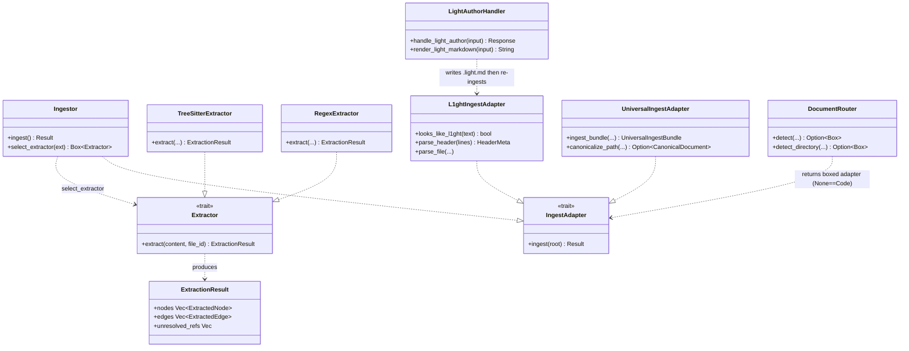
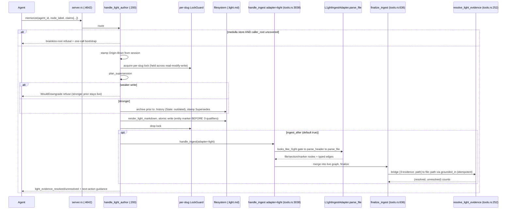
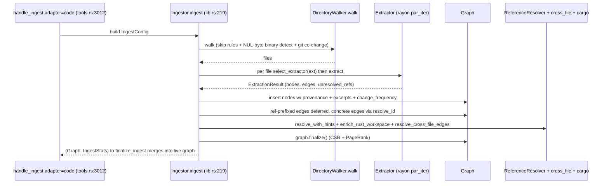
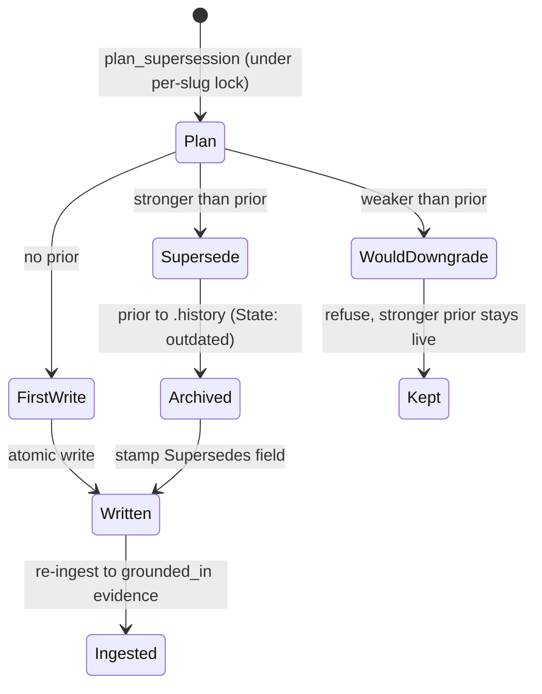
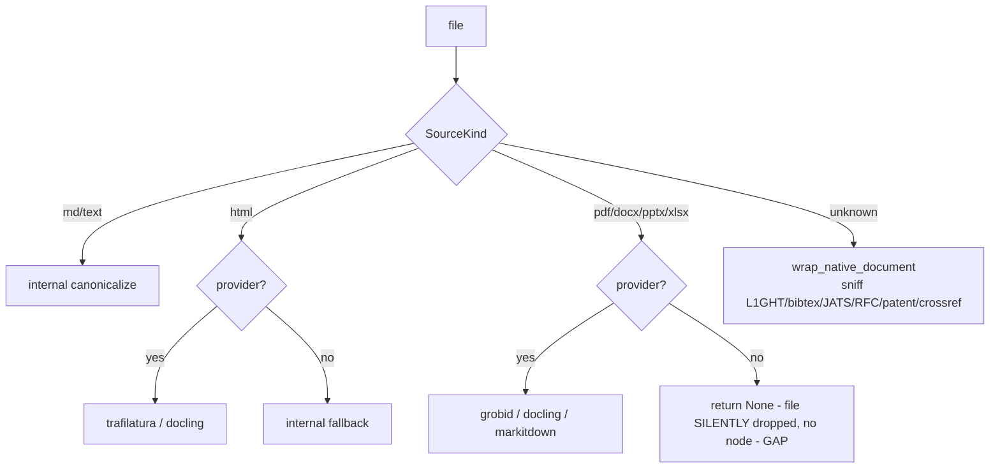

# m1nd (Ingest & L1GHT) — the write-side of the organism

Turns repos, arbitrary documents, and agent-authored L1GHT memory into a neuro-symbolic code graph via language extractors (regex core + tree-sitter tier), a family of domain adapters, a universal document canonicalizer, and `memorize` — the only L1GHT writer that closes the read to prove to write loop.

## Class

## Sequence

The memorize write to prove to read loop (the closing seam of the whole organism), plus the code-ingest backbone it re-enters.

Code-ingest backbone (Ingestor::ingest):

## State/Flow

memorize supersession (invalidate-and-keep) + universal document routing by SourceKind.

## Invariantes

- External-id hygiene: file ids must be non-empty relative paths; build_file_external_id/is_valid_external_id reject empty/`.`/`file::`; invalid nodes/edges skipped with a hygiene warning (lib.rs:46-92,316-324).
- Node-id uniqueness within a file: same-named siblings get #2/#3 suffixes (unique_node_id) so no distinct definition is silently dropped by DuplicateNode (extract/mod.rs:387).
- First-wins on duplicate ids: the surviving node keeps its OWN excerpt (or_insert), matching graph insertion order (lib.rs:292-298).
- ref::-prefixed edge targets are always deferred to the reference resolver, never added directly (lib.rs:389-408).
- Provenance source_path is the containing file with the file:: prefix stripped, or repointed to canonical.md for universal docs — required for xray_apply AnnotateSymbol to match symbols (lib.rs:358; universal_docs.rs:282).
- L1GHT gate: a file is parsed as L1GHT only if looks_like_l1ght passes (Protocol: L1GHT/ OR GE 2 glyph markers) — enforced in parse_file and the ingest loop (l1ght_adapter.rs:320,711).
- L1GHT dedup: nodes by id, edges by (src,tgt,relation,dir) with bidirectional canonical ordering (push_node 204-218, push_edge 220-253).
- Epistemic (𝔻) markers attach to the preceding non-epistemic claim (last_claim_id); render order emits the entity marker BEFORE 𝔻 qualifiers or they bind to the wrong node (l1ght_adapter.rs:656-683; light_author_handlers.rs:480).
- memorize supersession is invalidate-and-keep: weaker write refused, stronger archives prior to .history as State: outdated and stamps Supersedes: — under a per-slug exclusive lock held across read-modify-write, dropped before ingest (light_author_handlers.rs:267-312).
- Provenance is honest, never faked: absent Created/Source-Agent/Origin-Brain yields None/no tag, not a guessed value (l1ght_adapter.rs:49-57,353; light_author_handlers.rs:420).
- Brainless-root refusal: a default-path memorize into the medulla store from a known-uncovered caller root is refused rather than polluting shared doctrine (light_author_handlers.rs:218-242).
- resolve_light_evidence is idempotent: existing grounded_in edges (in pending or CSR) are deduped so re-runs add no duplicates (tools.rs:256-290,341-345).
- Incremental ingest is code-adapter-only (tools.rs:3005-3009).
- .light.md hidden-dir pruning keeps .history/ and .locks/ out of the reloaded graph (l1ght_adapter.rs:127-140).

## Gaps

- **[medium]** Extractor trait doc-comment claims "All impls use tree-sitter (not regex)" but the five core-language extractors (Rust/TS-JS/Python/Go/Java) and the generic fallback are regex-based — misleading contract and a real accuracy ceiling for the most common languages (heuristic call/type detection; regex extractors leave end_line==line, degrading excerpt/span accuracy) (extract/mod.rs:511-513 vs rust_lang.rs:9,32 etc; compute_excerpts fallback extract/mod.rs:446-450).
- **[medium]** Universal ingestion's binary/document lanes (pdf/docx/pptx/xlsx) silently produce NOTHING when no external provider is installed — the file is dropped (return Ok(None)) with no node, no graph-surfaced warning. A PDF-heavy corpus with no docling/markitdown yields an empty graph and the user may not realize why (universal_adapter.rs:155-182; provider detection shells to python3/CLIs 268-289).
- **[low]** Provider availability is probed by spawning python3/`sh -c command -v` on (potentially) every ingest and per-file canonicalize_path call — a process-spawn cost per document with no caching visible in this module (universal_adapter.rs:119, 268-274).
- **[low]** L1GHT supersession is frontmatter-only; there is no graph-visible supersedes edge, so a query walking the graph cannot see that one claim invalidates another — only a frontmatter read or the .history archive reveals it (light_author_handlers.rs:454-457).
- **[low]** memorize default schema exposes only string-ish claim fields; internal medulla/promotion/soul frontmatter is #[serde(skip)] and filled only by internal callers — a hand-built LightAuthorInput bypassing the handler renders no Origin-Brain, so provenance can legitimately read "unknown". Correct by design but provenance completeness is not guaranteed for all write paths (light_author_handlers.rs:146-192, 249-251).
- **[low]** The regex core extractors' comment/string stripper preserves string content on any line that merely STARTS with a quote (to protect grouped imports), which can leak non-import string content and confuse downstream extraction on quote-leading non-import lines (extract/mod.rs:207-212).

## Proof gaps (from map proof_missing)

- No end-to-end test of the universal document lane WITH real external providers — provider-present branches are effectively untested in CI, so pdf/office fidelity and the silent-skip behavior are unproven.
- No test asserting the silent-skip contract itself: a pdf/docx with no provider yields zero nodes and (ideally) a surfaced warning.
- No test pinning the regex-vs-tree-sitter reality against the trait doc-comment, nor a comparative accuracy test.
- memorize supersession under CONCURRENT sibling sessions on the same slug is asserted only indirectly — no test drives two writers racing the same slug to prove the lock serializes.
- No test that WouldDowngrade refusal + stronger-prior-stays-live is exercised across a real ingest.
- document_bindings/document_drift recompute-on-generation-advance has cache-entry tests but no proof a code change flips a binding to drift exactly once per generation.
- No test for the regex stripper's quote-leading-line preservation edge case.

## MCP verbs

ingest (adapters: code, json, memory, light, patent, article/jats, bibtex/bib, rfc, crossref/doi, universal, auto/document) - memorize (the L1GHT writer) - document_resolve - document_bindings - document_drift - document_provider_health.
