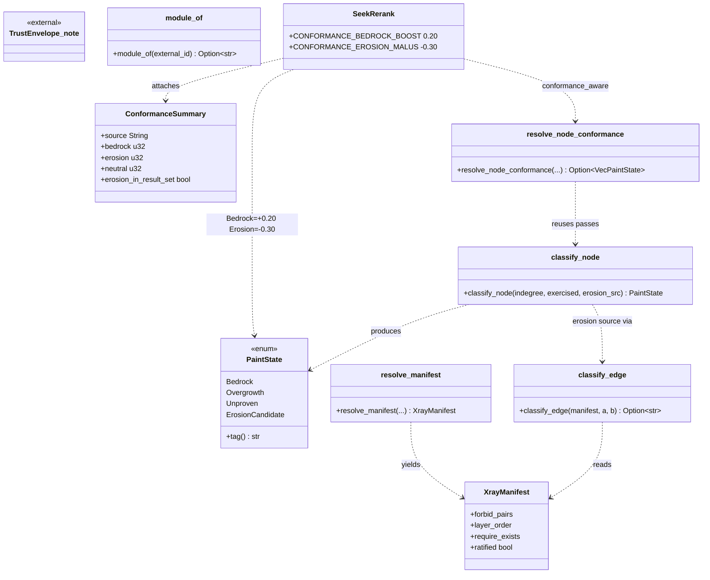
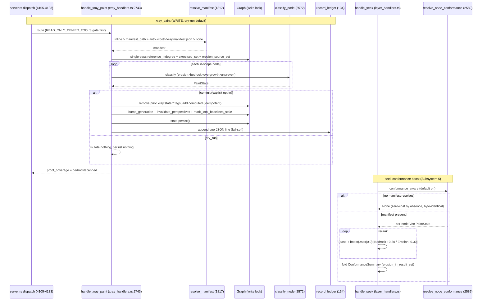
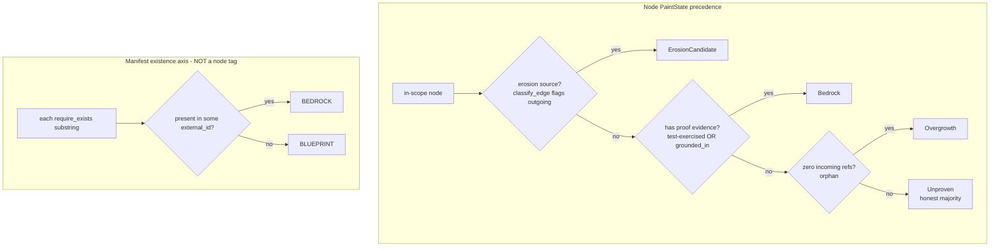
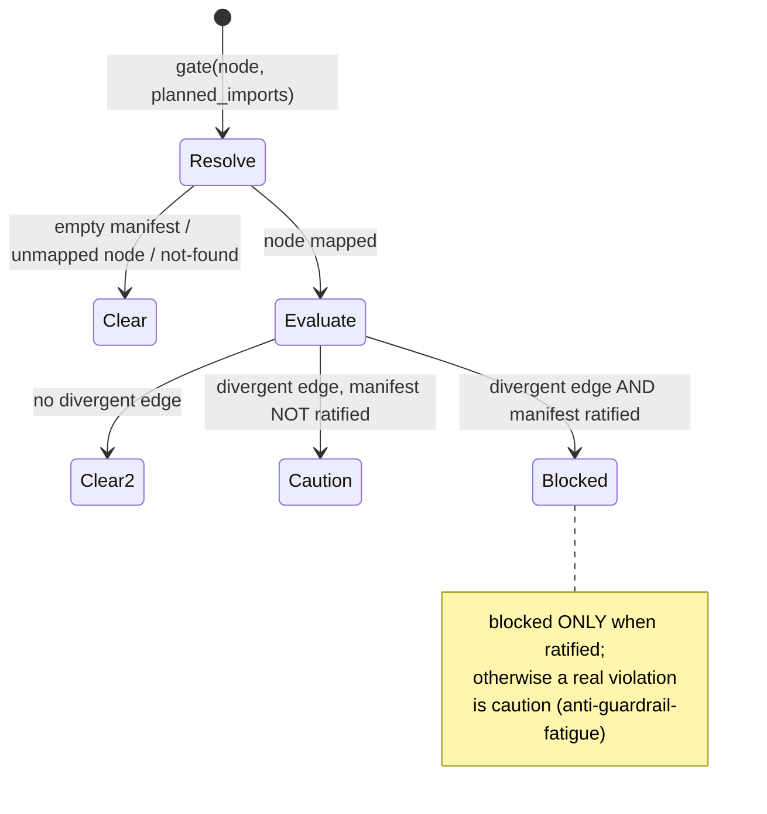

# Layers & X-RAY conformance

A conformance instrument that classifies graph nodes against a north-star manifest into a structural proof-grammar (BEDROCK / OVERGROWTH / UNPROVEN / EROSION-CANDIDATE node states + a manifest-level BEDROCK-vs-BLUEPRINT existence axis), exposed through six read/write MCP verbs (orient/gate/paint/retag/apply/ledger) with an append-only audit ledger, feeding the paint states back into seek rerank as a small additive attention nudge — candidates, never confirmed verdicts, and read-only-attach-safe.

> NOTE (terminology): the code's PaintState is exactly Bedrock/Overgrowth/Unproven/ErosionCandidate (xray_handlers.rs:2456). `BLUEPRINT` is a manifest-level existence result, NEVER a node tag. `UNPROVABLE` belongs to trust_envelope.rs, a different subsystem. The mission's "BEDROCK/BLUEPRINT/EROSION/OVERGROWTH/UNPROVABLE" is NOT a literal five-way node grammar.

## Class

## Sequence

The six verbs share manifest resolution; the seek bridge reuses the exact same passes. Shown: xray_paint (write) + the seek conformance boost.

## State/Flow

Node classification precedence (paint) and the separate manifest-level existence axis (BEDROCK vs BLUEPRINT).

xray_gate verdict (pre-edit guardrail, ratified-gated anti-fatigue):

## Invariantes

- Single rule source: classify_edge (xray_handlers.rs:1954) is the ONLY erosion predicate; orient/gate/paint/seek all call it — no second copy to drift.
- Honest candidates, never verdicts: divergences are erosion_candidates; ErosionCandidate is a candidate not a confirmed violation; empty manifest yields an empty candidate list by construction (L1749-1751).
- Ratified-gate anti-fatigue: xray_gate returns blocked ONLY when the manifest is ratified; otherwise a real violation is caution (gate_graph L2290-2306).
- dry-run-by-default: XrayMode defaults to DryRun; commit is the explicit opt-in; dry_run mutates/persists nothing across retag/paint/apply (L189).
- Zero-cost-by-absence: with no manifest, resolve_node_conformance returns None and every seek boost is 0.0 to byte-identical output (proven by conformance_off_is_byte_identical).
- Additive-only bias: the seek nudge is added then .max(0.0) clamped — it re-orders but never removes a candidate; a surviving erosion hit is counted, never hidden (layer_handlers.rs L609).
- Idempotent re-paint: paint removes all existing xray:state:* tags before adding the computed one; a node already correct is skipped — states never accumulate (paint_graph_inner L2687-2690).
- BLUEPRINT is manifest-level only: an existence-axis absence, NEVER painted as a node tag (only the four PaintStates are node tags) (L2373-2375).
- Cross-call OCC: retag and apply recompute a selection/plan version fingerprint on commit and ABORT (status aborted_conflicts, write nothing) if it no longer equals the caller's expect_version.
- Atomic all-or-nothing file apply: xray_apply stages every temp, re-hashes all originals, and on ANY conflict/stage error deletes every temp and writes ZERO originals; only a fully-clean plan swaps.
- Read-only-attach safety: orient/gate/ledger never take a write lock and are absent from READ_ONLY_DENIED_TOOLS; retag/apply/paint are present (server.rs L2611-2616).
- Ledger fail-soft: ledger I/O NEVER fails the underlying op; seq derived from prior line count under the single-instance lock.
- Forbidden-artifact + root confinement on apply: is_forbidden_path blocks runtime/VCS/build artifacts; path_confined_to_root keeps writes under workspace_root.
- Persist bookkeeping consistency: every committed tag write bumps generation, invalidates perspectives, and marks lock baselines stale so lock.diff cannot fast-path over the mutation.

## Gaps

- **[high]** xray_apply (physical source-file writes) is deliberately NOT in PROOF_GATED_WRITE_TOOLS — the strongest write verb bypasses the proof gate that guards other agent-supplied source writes. Guard rails are only dry-run-default + attach-deny + root-confinement + forbidden-filter (xray_handlers.rs:L608-611).
- **[medium]** Grammar divergence vs the mission's stated grammar: no UNPROVABLE node state (that is trust_envelope's verdict), and BLUEPRINT is manifest-level, never a node tag. A docs pass treating BEDROCK/BLUEPRINT/EROSION/OVERGROWTH/UNPROVABLE as five node states would misdescribe the code (PaintState L2455-2461; BLUEPRINT set only in orient L2072; UNPROVABLE in trust_envelope.rs L36).
- **[medium]** Manifest auto-discovery is silent-fail: a malformed or explicit-but-unloadable manifest_path falls through to none (empty manifest) with no diagnostic, so an agent can believe conformance is active when it silently is not (load_manifest_file L1794; resolve_manifest L1840).
- **[low]** spectral_overlap (xlr.rs L522) computes hot/cold spectral overlap but is not called from the XLR query pipeline (query() L152 never invokes it) — a designed function with no live caller.
- **[low]** Conformance boost magnitudes (+0.20 / -0.30) are hard-coded with no calibration table backing, unlike the trust/envelope signals; the "only re-orders near-ties" guarantee depends on typical score scale, not a proven bound (layer_handlers.rs L91-92).
- **[low]** Ledger seq/ordering integrity relies on the single-instance lock (read-count-then-append). Under served-owner concurrency violating that assumption, seq could collide; no fsync of the append, corrupt lines silently skipped (append_ledger L76-86; read_ledger L2859).
- **[low]** module_of derives a module purely from the first path segment; nodes without a file:: prefix are silently skipped from census/matrix/gate/paint — coverage is invisible to the agent (module_of L1929-1939).

## Proof gaps (from map proof_missing)

- No test exercises xray_apply through proof-gate integration (that integration does not exist yet).
- No integration/property test that the seek boost's "only re-orders near-ties, never dominates" holds across the real score distribution.
- No test for the silent manifest-load-failure path (manifest_source=none, no false "conformance active").
- No concurrency/stress test on the ledger read-count-then-append seq under contention.
- spectral_overlap has no test and no production caller.
- No end-to-end test binding xray_paint's persisted xray:state:* tags back into a later retag selector or a state-tag query.
- No test asserting non-file:: nodes (skipped by module_of) are reported rather than silently dropped.

## Adjacent systems (share a name, not code)

- m1nd-core/src/layer.rs — architectural LAYER DETECTION (Tarjan SCC to BFS depth to violation), the `layers` verb. Distinct from X-RAY conformance.
- m1nd-core/src/xlr.rs — XLR spectral query refiner consumed by core query.rs. Distinct despite the near-homophone.
- delegation_handlers.rs — a second "conformance" notion (delegate/debrief path grading). Same word, distinct code.
