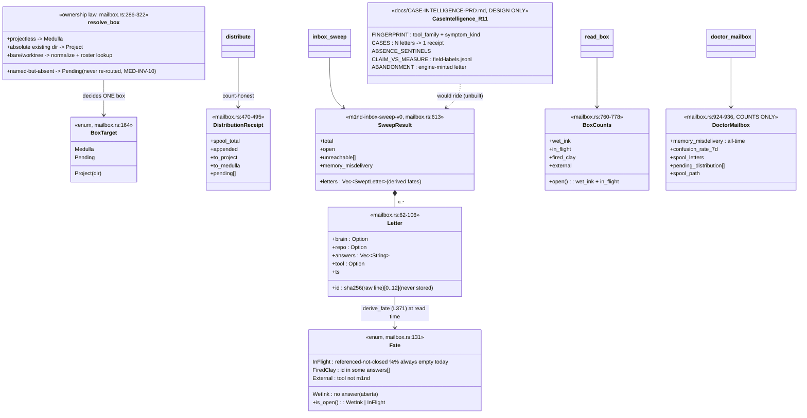
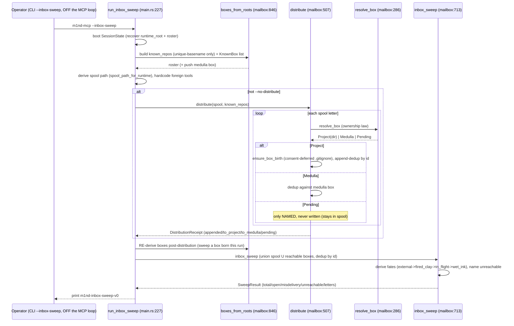
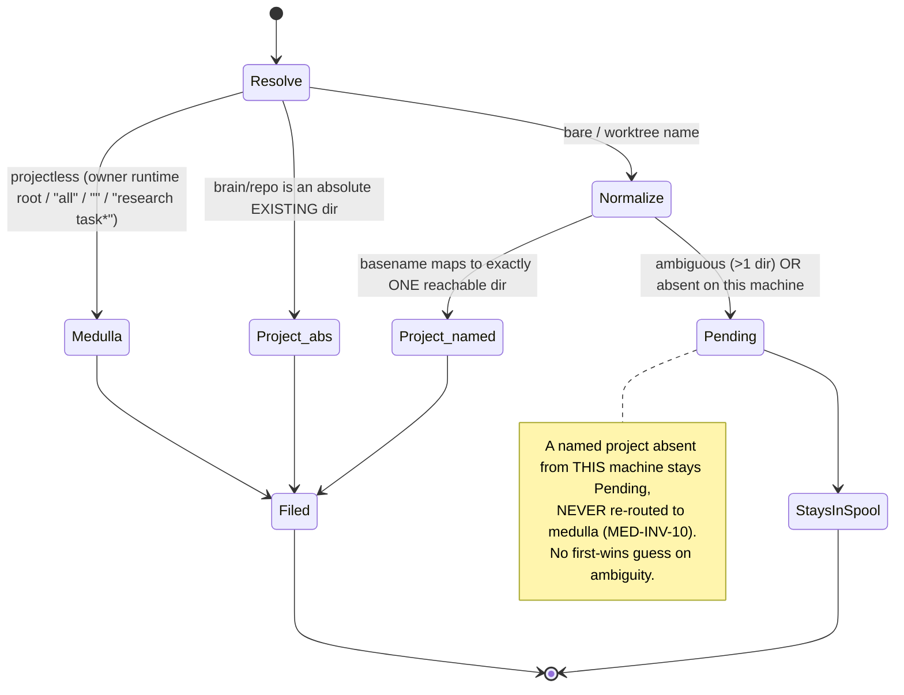
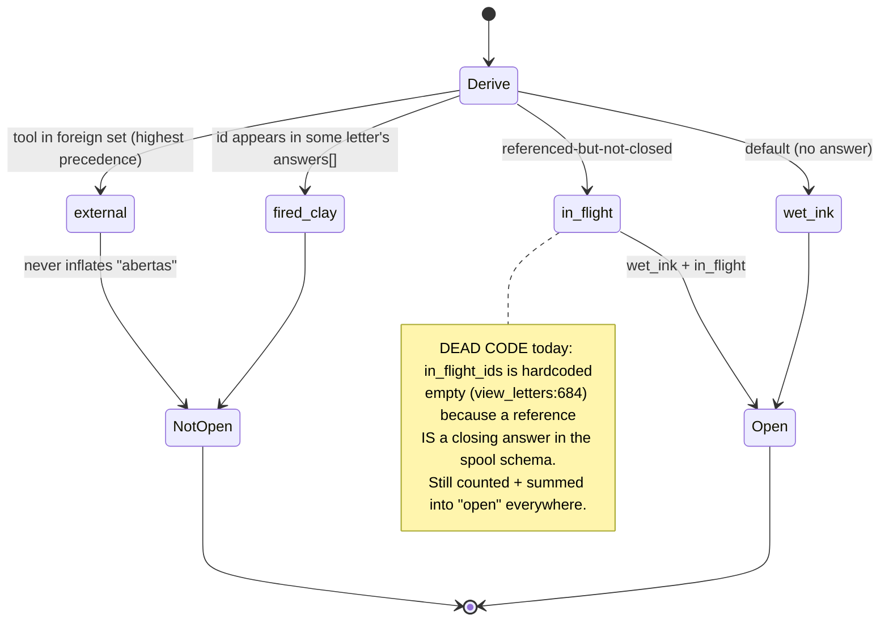

# Mailbox & Case Intelligence

A read/distribution layer over the append-only field-report spool: it files each letter
into exactly one per-project (or medulla) box by an ownership law, derives each letter's
fate (wet_ink / in_flight / fired_clay / external) from the reply graph at read time,
unions everything for cross-box triage, and surfaces a counts-only confusion metric —
with the R11 case-intelligence overlay (fingerprints / cases / sentinels / claim-vs-measure
/ abandonment) fully designed but zero-lines-built.

## Class

## Sequence — inbox_sweep distribute + cross-box union

## State/Flow — letter routing (ownership law)

## State/Flow — letter fate (derived at read time, never stored)

## Invariantes

- **MED-INV-9 (spool inviolate)**: the spool is read-only to this module and never truncated — distribute/inbox_sweep/doctor_mailbox all only read it (verified: distribute at :507, inbox_sweep at :713, doctor_mailbox at :975).
- **MED-INV-10 (no repo-bearing letter in the medulla box)**: a letter naming a project directory NEVER lands in medulla; an absent named repo stays Pending, never re-routed (resolve_box Pending branch — verified: resolve_box at :286, BoxTarget enum at :164).
- **Fates are derived, never stored**: computed at read time from answers[] in derive_fate; no fate field is ever written (verified: derive_fate at :371; Fate enum at :131 with is_open = WetInk|InFlight).
- **Content-id identity is machine-independent & dedup-stable**: id = sha256(raw line, newline trimmed)[0..12]; append-with-dedup keeps git-traveled letters un-clobbered; distribution idempotent (appended:0 on re-run).
- **'abertas' honesty**: open = wet_ink + in_flight ONLY; external and fired_clay never inflate it (verified: Fate::is_open matches WetInk|InFlight; BoxCounts::open at :760-778).
- **Consent-deferred box birth**: first write to a repo creates .m1nd/ with an ignore-by-default .gitignore covering inbox.jsonl; an EXISTING .gitignore is never rewritten.
- **Unique/abstain roster resolution**: a bare basename resolves only when it maps to exactly one distinct reachable dir; >1 -> left out of known_repos -> stays Pending (never a first-wins guess); every distinct root still a named KnownBox (verified: boxes_from_roots at :846).
- **Sweep union counts each letter once and names every unreachable box** (never silently skips).
- **memory_misdelivery is a closed vocabulary**: class 'memory_misdelivery' with kinds {leak, false_absence, wrong_store_write, misattribution, vanished}.
- **Reads are scoped, never a re-fold of the spool (MED-INV-1/INV-17)**: read_box reads THIS box's file only; a missing box reads 0 open, never a fabricated count (verified: read_box at :793).
- **Counts-only rendering (doctor)**: confusion is reported as weekly count + volume + pending names, never an uncalibrated quality score; fail-open on read error.

## Gaps

- **[high, feature-level] R11 Case Intelligence is entirely unbuilt**: no fingerprint computation, no case derivation, no sentinel runner, no claims export, no abandonment detection, no engine-minted-letter write path. The recurrence the corpus demonstrably contains is invisible to the machine (grep over m1nd-mcp/src + m1nd-core/src for case_id/CaseId/absence_sentinel/abandonment/sentinel_sweep/field-labels/m1nd:engine/symptom_kind/tool_family returns ZERO; docs/CASE-INTELLIGENCE-PRD.md:5 self-declares UNBUILT).
- **[medium] The InFlight fate is dead code today**: in_flight_ids is hardcoded empty (mailbox.rs:684 — verified: `let in_flight_ids: BTreeSet<String> = BTreeSet::new();`), so no letter can ever be in_flight — yet the fate is counted, rendered, and summed into 'open' across every surface. A referenced-but-unclosed letter is mis-rendered as fired_clay.
- **[medium] doctor_mailbox over-reports pending_distribution**: the doctor path passes an empty known_repos (tools.rs:4332), so every named project (even one present on this machine) resolves to Pending — an honesty defect on the one case-adjacent MCP-reachable surface (self-documented at mailbox.rs/tools.rs:4315-4321).
- **[medium] Routing is machine-state-dependent via live is_dir() probes**: the same spool distributes differently on different machines (a Project here is Pending there) — breaks recomputability of the sweep output from the spool alone (mailbox.rs:309, :314, :863).
- **[medium] No end-to-end proof of the CLI/REST/doctor handlers**: every test targets the pure functions with synthetic scratch fixtures; the SessionState-boot path, roster wiring, served_brain selector, and the boxes-re-derived-after-distribution step are unproven (the bare-name gap was a real field defect caught only by a live probe).
- **[medium] Legacy letters carry no `kind`**: the future fingerprint has no symptom_kind for most of the corpus; conservative backfill rules are unbuilt and narrow, and the abandonment organ (S4) is hard-gated on a Stop-hook 'ambient wave' that does not exist (Letter has no kind field at mailbox.rs:62-106).
- **[low] foreign_tool_markers is DUPLICATED verbatim in two triage entry points** (main.rs:267-271 and http_server.rs:1887-1892): adding a foreign tool in one and not the other silently changes a letter's fate between the CLI sweep and the REST sweep.
