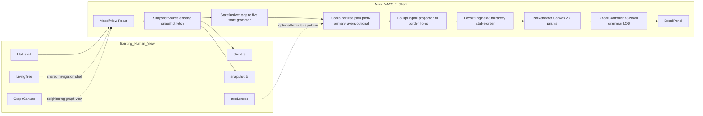
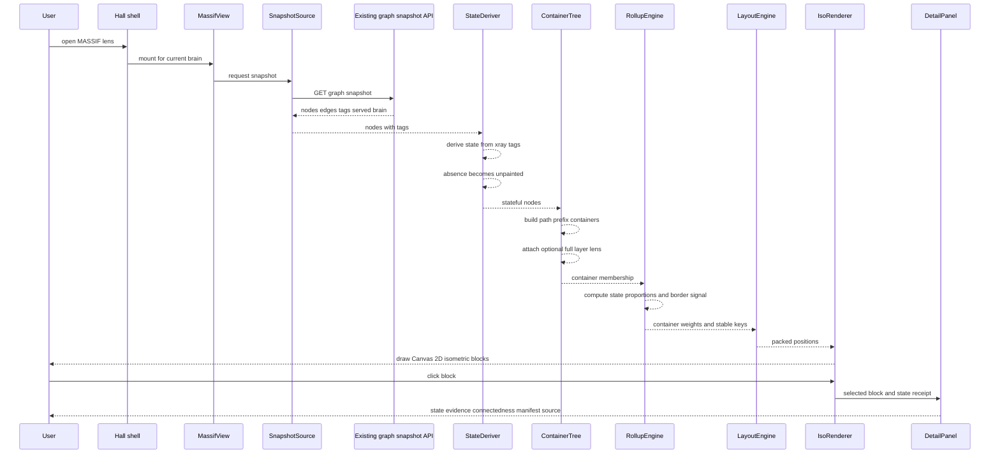
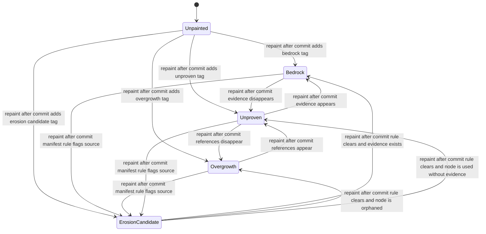
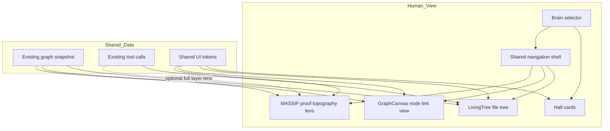

# MASSIF UML

MASSIF is a Human View lens that renders persisted X-RAY paint tags from the existing graph snapshot as a stable isometric proof-topography view.

## Component diagram

## Load and interaction sequence

## Grammar state diagram

## Human View integration diagram

