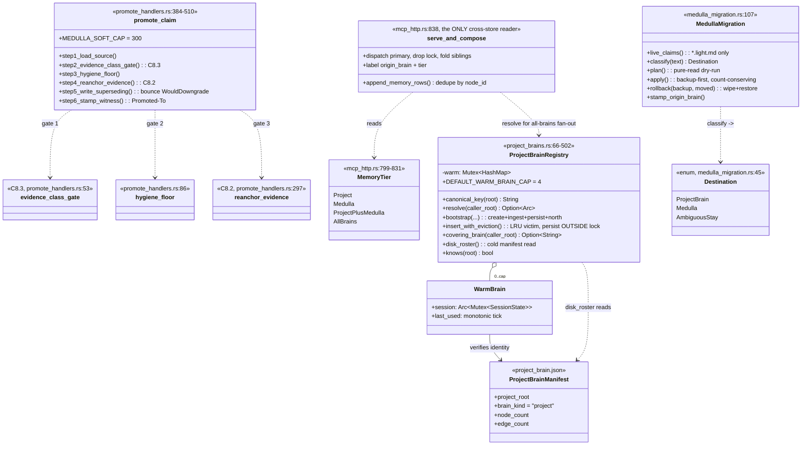
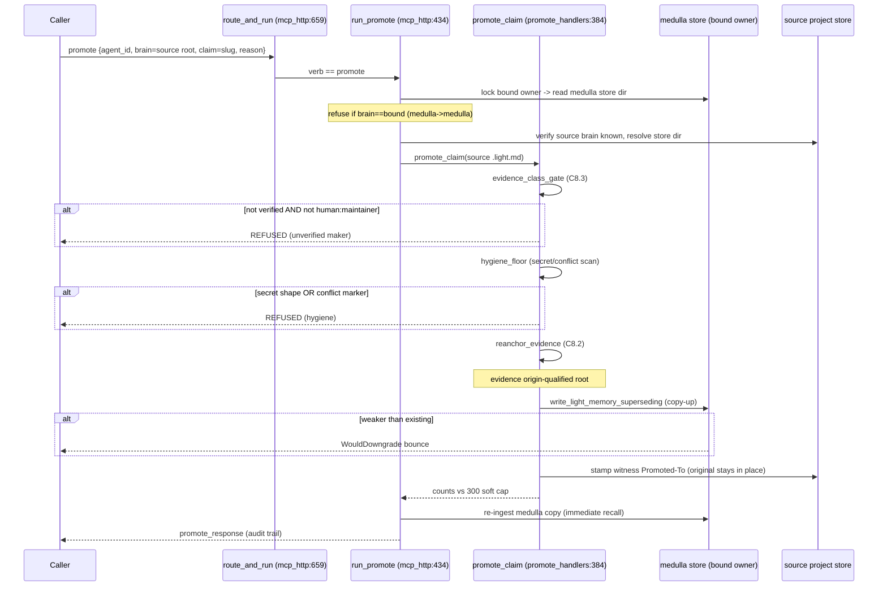
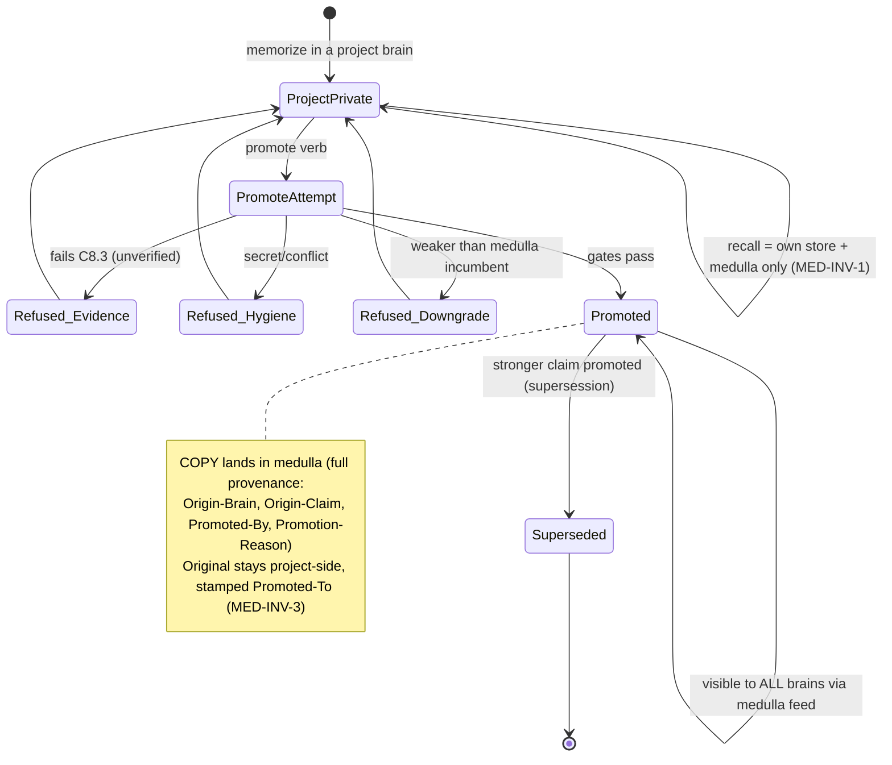
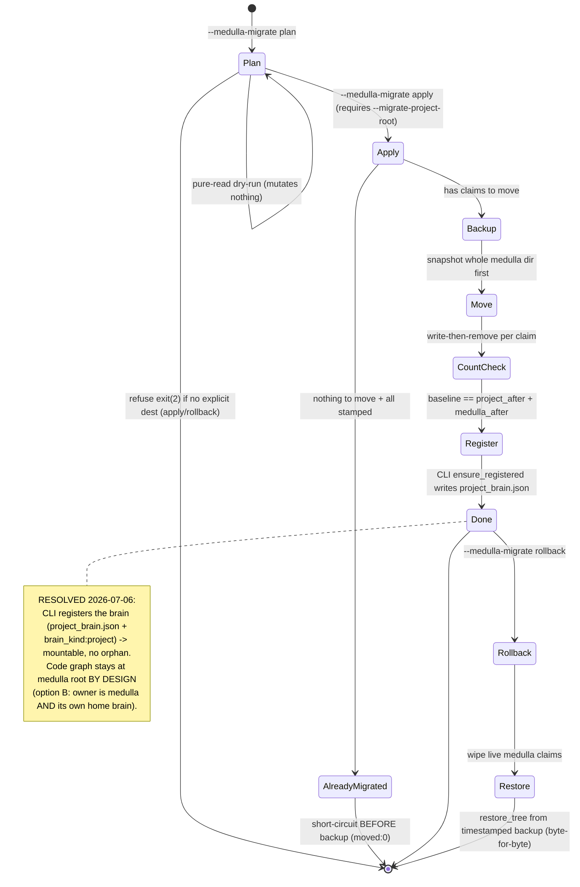
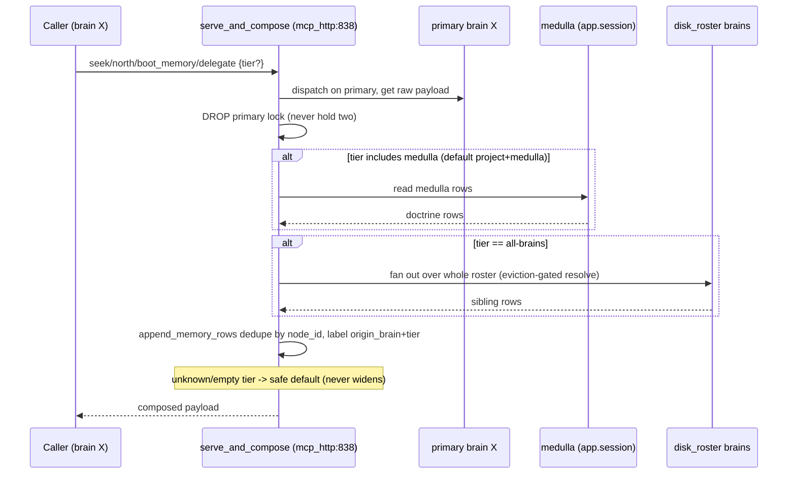

# MEDULLA — per-project brains, tiers, promotion, migration

The owner-hosted multi-brain layer: one served process holds N per-project brain stores
(tier-is-a-directory) plus a shared "medulla" doctrine store. Recall is pull-only
(own store + medulla); `promote` is the audited copy-up crossing; the M5a migration
splits the legacy mixed store — CLI apply now registers the destination brain (no
orphan) and the code graph stays at the medulla root by design (option B), with the
remaining CLI-apply gaps ranked medium/low below.

## Class

## Sequence — promote (project -> medulla, gates C8.2 / C8.3)

## State/Flow — belief lifecycle (project_private -> promoted -> superseded)

## State/Flow — M5a migration plan/apply/rollback

## Sequence — M5b pull-only tier recall (the read side)

## Invariantes

- **Tier-is-a-directory**: a brain's tier is which physical store dir it lives in — project-brains/<fp>/agent-memory vs runtime_root/agent-memory (medulla); no move, no in-file tier field.
- **No-leak / pull-not-push (MED-INV-1)**: brain X default beat = X's own store + medulla only; a sibling Y store is read ONLY under tier:all-brains. Enforced in serve_and_compose; unknown tier -> safe default.
- **Bound dev graph is never evictable and never a project brain**: it lives on AppState.session, not the registry map, so insert_with_eviction only selects project brains (project_brains.rs:304-305).
- **Warm-brain cap** (default 4, clamped >=1): map_never_exceeds_capacity.
- **Persist-on-evict**: an evicted brain's snapshot is flushed BEFORE its Arc drops (project_brains.rs:352-360; proven by eviction_persists_unpersisted_state — verified: insert_with_eviction at :311).
- **First-insert-wins under race**: concurrent boots adopt the incumbent, loser drops unpersisted; its on-disk store unchanged.
- **Manifest identity**: a warm-boot verifies project_brain.json project_root == resolved key; a hash collision resolves to an honest miss, never a wrong-brain bind (project_brains.rs:157).
- **Canonical key uniqueness**: symlink/`/tmp`-alias resolution means one repo cannot become two brains (project_brains.rs:131).
- **Promotion elevates, never moves (MED-INV-3)**: the medulla gets a COPY; the project original stays stamped Promoted-To (verified: promote_claim at :384; evidence_class_gate :53, hygiene_floor :86, reanchor_evidence :297).
- **Evidence-class gate (C8.3)**: only State:verified OR Source-Agent:human:maintainer may promote.
- **Medulla hygiene floor**: a claim with a merge-conflict marker or a secret shape is refused at the door.
- **C8.2**: promoted evidence is origin-qualified `<root>#<path>`, else stamped evidence_unverifiable.
- **WouldDowngrade bounce**: weaker re-promotion refused — shared doctrine keeps its strongest form.
- **Migration count-conservation**: baseline == project_after + medulla_after; plan->apply->rollback restores byte-for-byte (verified: plan :338, apply :402, rollback :493, classify :172, Destination :45).
- **Migration destination explicit, never ambient**: apply/rollback refuse (exit 2) without --migrate-project-root.
- **Idempotent already-migrated apply**: a re-run short-circuits BEFORE any backup/mutation (medulla_migration.rs:411).

## Gaps

- **[high] CLI apply leaves an ORPHAN, unmountable project store** — **CLOSED (2026-07-06)**: after a successful move the CLI calls `ProjectBrainRegistry::ensure_registered(project_root)`, which reuses the SAME `write_manifest` birth path a bootstrap uses to stamp `project_brain.json` (identity + `brain_kind:"project"`) — so `resolve()`/`knows()` (`manifest_matches`) now mount the moved claims instead of finding an orphan. Idempotent (a matching manifest is left untouched; a re-run self-heals a prior orphan). Proven by `apply_registers_the_destination_brain_so_it_is_mountable` driving the real binary (ensure_registered project_brains.rs; apply arm main.rs; manifest_matches project_brains.rs:157-166). *(Graph/plasticity state is intentionally NOT written — see the code-graph resolution below: the owner keeps the code graph, a migrated memory brain is graph-less by design.)*
- **[high] No live-owner-detection guard on apply**: the CLI mutates on-disk stores while a served owner (launchd keepalive) may be live at :1338, then resurrect mid-apply and race the file moves (main.rs:330-472 has no :1338/lock/liveness check; same field report).
- **[high] The split has no design for the CODE GRAPH** — **CLOSED (2026-07-06, option B)**: the design is now explicit — the runtime owner is BOTH the medulla AND the home brain of its own repo, so the ~6657-node code graph legitimately stays at the medulla root, and migration separates memories BY origin (owner-repo claims stay; only other projects' facts move). Option A (reassociate the graph into the project brain) is rejected as the expensive, data-risky path; dropping the m1nd code root from the owner is deferred post-M5 (Slices 5–7). `apply` already never touches `graph_snapshot.json` (`live_claims` enumerates only `*.light.md`), so no code change was needed — the invariant is pinned by `apply_is_memory_only_and_never_touches_the_code_graph` so a future change cannot silently start migrating the graph (MEDULLA-PRD §4.2 "the code graph stays at the medulla root").
- **[medium] Rollback incomplete against a real store**: restore_tree never DELETES files the backup lacks (only overwrites/creates); CLI derives moved names from a post-apply dir scan, unreliable if apply half-failed (medulla_migration.rs:493-517, restore_tree :640; main.rs:435-445).
- **[medium] Classifier is heuristic substring-matching**: a doctrine note using 'gate' misfiles to a project brain; a repo fact using 'always' stays medulla — silent wrong-tier routing (medulla_migration.rs:182-274; field report 23/27 legacy claims routed to project).
- **[low] promote slug divergence**: source lookup uses slugify(input.claim) while medulla_slug=slugify(node_label from frontmatter) — a fork instead of a supersede if they differ (promote_handlers.rs:391 vs 432-437, witness :489).
- **[low] promote re-ingest assumes bound owner IS medulla**: no covers/identity check before the re-ingest into app.session (mcp_http.rs:497-515).
- **[low] Malformed .light.md aborts mid-apply**: read_to_string errors abort the whole run after the backup, no per-file skip (medulla_migration.rs:159 counts by extension; plan:347 / apply:438 no skip).
