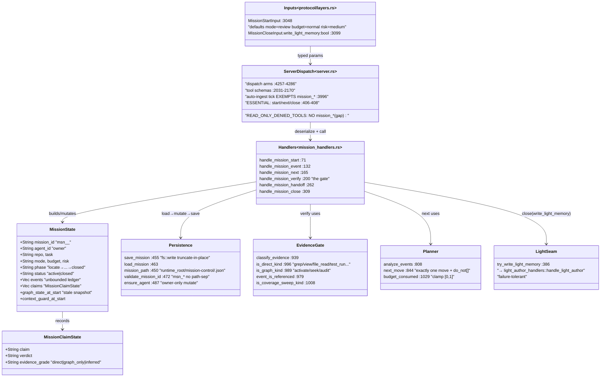
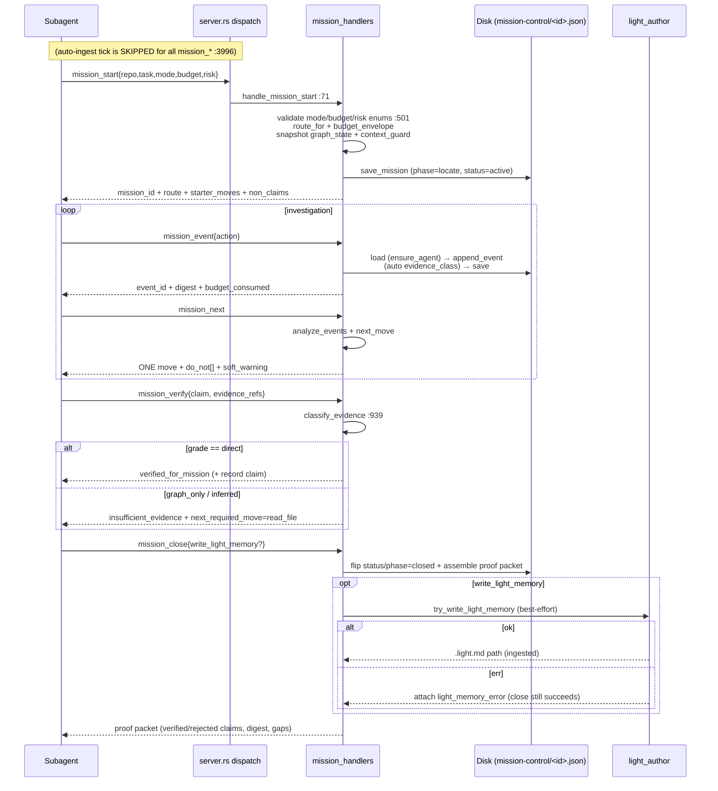
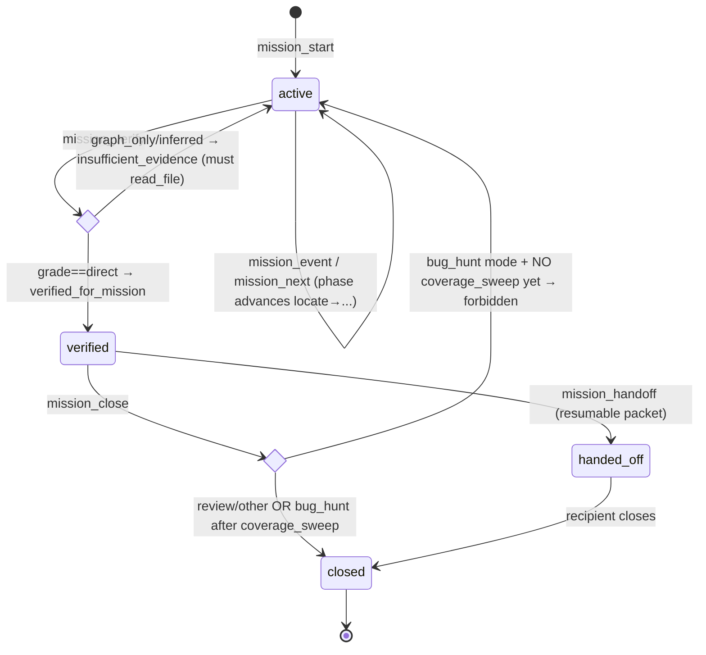

# mission-control

A bounded, repo-scoped agent-mission state machine: `mission_start/event/next/verify/handoff/close` persist a per-mission JSON contract to disk and hand the agent one next move plus an evidence-class gate, so a subagent's scoped mission ends in a code-anchored proof packet — deliberately reserved for SubagentStop, never the default Stop loop.

## Class/Component



## Sequence



## State/Flow



## Invariantes
- `mission_id` must start `msn_` and be `[A-Za-z0-9_-]` — path-escape rejected before any fs op (validate_mission_id :472; test `mission_id_rejects_path_escape` :1172). Confirmed in code.
- Only the owning `agent_id` may load-then-mutate (ensure_agent :487). Confirmed in code.
- mode ∈ {bug_hunt,review,refactor,docs_drift,architecture,release}; budget ∈ {short,normal,deep}; risk ∈ {low,medium,high} else InvalidParams (:501; test :1298).
- A claim is `verified_for_mission` ONLY when evidence grade == `direct`; graph-only/inferred → insufficient_evidence + required direct-read (:209-232; tests :1178,:1184). Confirmed via `classify_evidence`.
- Direct evidence must be RELATED to the claim — an unreferenced direct event does not upgrade a graph-only ref (event_is_referenced :979; test :1190).
- In bug_hunt mode, `next_move` forbids close after a verified claim until ≥1 coverage-sweep event exists; review/other may close immediately (tests :1311,:1335,:1356).
- 4 `DEFAULT_NON_CLAIMS` always attached; close merges+sorts+dedups extra caller non_claims (:22,:323).
- `mission_close` never fails on a light-memory write error — attaches `light_memory_error`, close still succeeds (:351-365).
- `budget_consumed` monotonic events/max_tool_calls clamped [0,1]; max floored at 1 to avoid div-by-zero (:1029).
- DOCTRINE (docs/skills, NOT code): `mission_*` is reserved for SubagentStop; the default Stop path is `cross_verify → memorize` directly (NEXTGEN-AGENT-PRD Correction 1, :428-432).

## Gaps
- **[medium] Mission write handlers absent from `READ_ONLY_DENIED_TOOLS`**: start/event/next/verify/handoff/close all `save_mission` (fs::create_dir_all + fs::write) yet a `--read-only`/`M1ND_READ_ONLY` attach can still create/mutate mission JSON. Confirmed: `grep mission … READ_ONLY` returns nothing; ingest/memorize/learn/xray_* ARE denied, mission_* silently is not. The auto-ingest exemption right beside dispatch (:3996) shows they were grouped but not added to the denylist.
- **[medium] No concurrency / lost-update protection** — **CLOSED** (hardening wave 4): every mutating handler (`mission_event`/`next`/`verify`/`handoff`/`close`) now holds a per-mission exclusive `flock` across the whole load→mutate→save, via `mission_lock` reusing the memorize `LockGuard` (generalized to `acquire_in` on `<runtime_root>/mission-control/.locks/<mission_id>.lock`). Two writers on one `mission_id` serialize instead of clobbering. RED: 40+40 concurrent event appends lost events without the lock and land all 80 with it. Residual: `save_mission` is still `fs::write` (truncate-in-place), not tmp+rename — a crash mid-write can still leave torn JSON; the lock addresses lost updates, not atomicity.
- **[medium] Keystone trigger discipline UNENFORCED in code**: nothing rejects/warns when `mission_start` runs on an ordinary Stop turn; drift back to mission-as-default-loop is prevented only by prose. Mechanizing hooks (SubagentStop → mission_verify → decision:block) explicitly deferred (NEXTGEN-AGENT-PRD Wave 6).
- **[medium] Evidence classification is lexical** — **CLOSED** (hardening wave 4): `classify_evidence` now requires a verifiable signal beyond the label. A bare direct label earns full `direct` ONLY when it cites a path that EXISTS under a repo root (`direct_ref_has_verifiable_path`) or is corroborated by a referenced recorded mission event; a label with neither grades the new `direct_unverified`, which `mission_verify` treats as `insufficient_evidence` and whose self-reported confidence is capped at 0.5. RED: a forged `file_read:src/nope.rs:1` graded direct/verified before and direct_unverified/insufficient after. The gate now checks the act, not just the label.
- **[low] No listing / expiry / GC / size bound**: mission JSON accumulates forever, `events` Vec uncapped; no enumeration, TTL, or delete verb.
- **[low] No Rust handler-level round-trip test** through real disk save/load — the 14 unit tests hand-build MissionState and call pure helpers; the only round-level test is Python (counts calls).
- **[low] Start-time snapshots never re-checked**: `graph_state_at_start` / `context_guard_at_start` captured once (:104-105) and echoed verbatim at close; a mission that started with node_count==0 or unverified binding carries the stale snapshot into the close packet.
```
