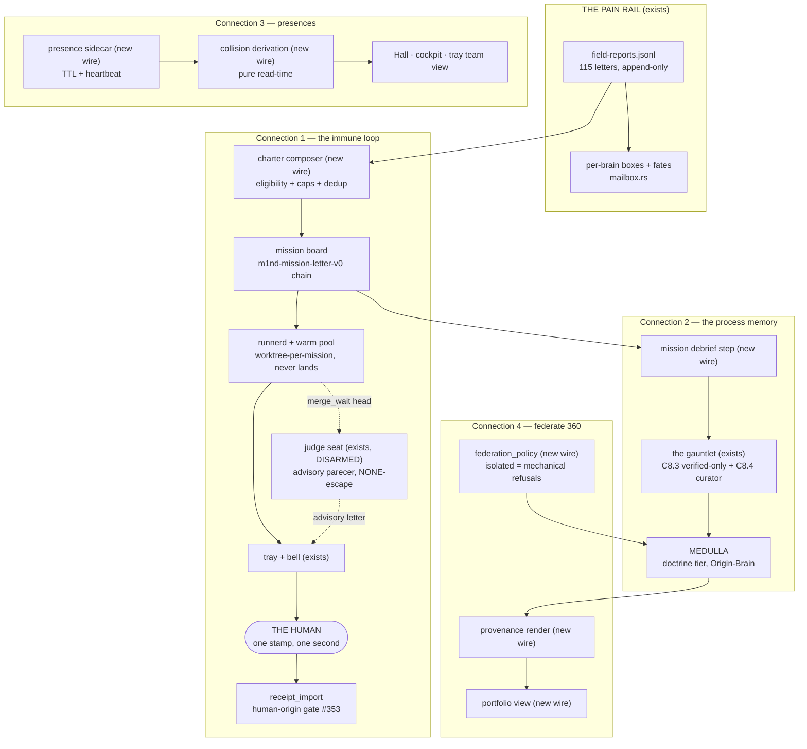
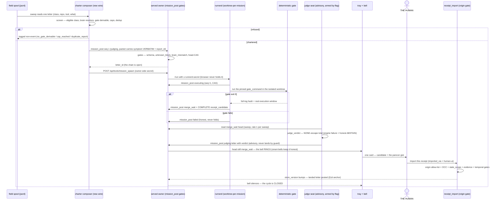
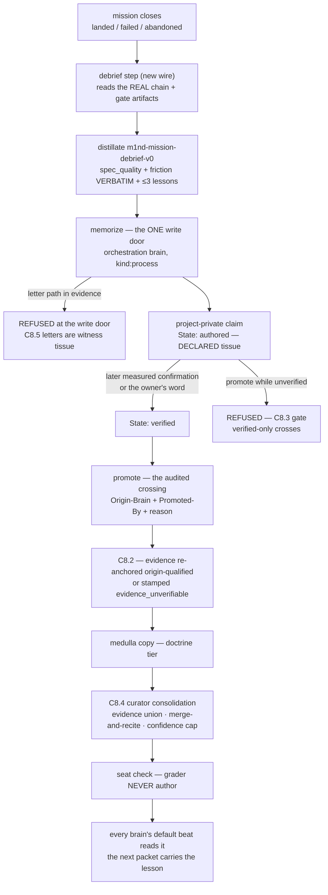
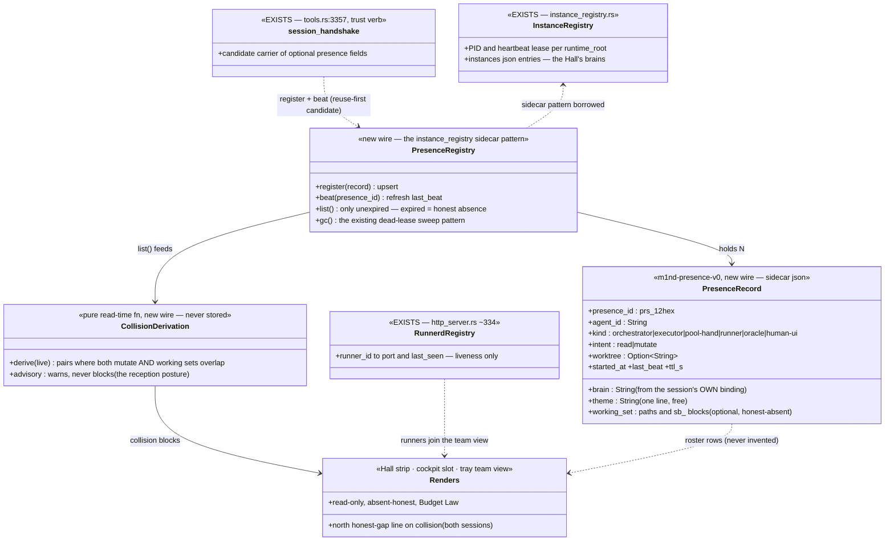
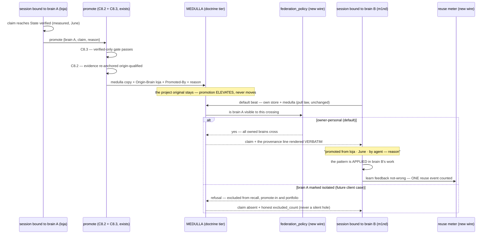
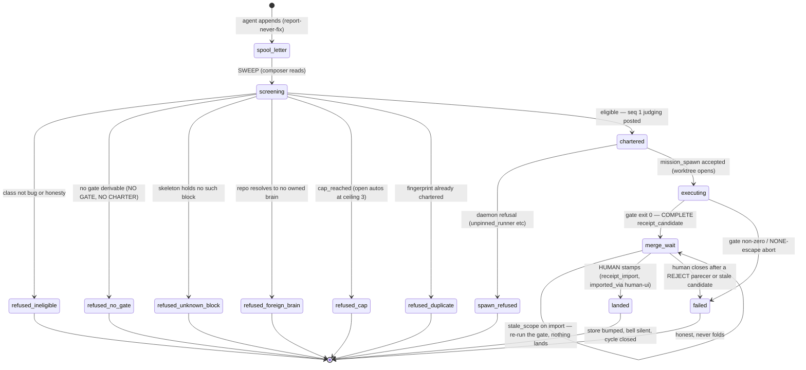

# The Organism From Inside + 360 — UML (arc sheet, DRAFT)

**The four new wires drawn against the machinery that exists** — the immune cycle, the
process-memory gauntlet, the presences, the provenance-honest portfolio, and the
auto-charter lifecycle with every refusal named.

> **Status:** the arc's DESIGN is RATIFIED (owner, 2026-07-12 — *"MUITO BEM! ratificado
> bora pra frente"*); this sheet stays the design-stage lens of `../ORGANISM-INSIDE-PRD.md`.
> Like `docs/uml/massif.md`, this sheet is a DESIGN-STAGE view: it draws intent against
> verified anchors; it does NOT claim the new wires exist. Grounded at `main` @ `7b3b665` + live probes of the served owner, the
> poold daemon, and the field spool (2026-07-12). Existing components carry their code
> homes; new components are marked **(new wire)**. Where this sheet and the PRD disagree,
> the PRD wins about the target and the code wins about the present.

**Code homes (existing):** the spool `~/.m1nd/field-reports.jsonl` + boxes/fates
`m1nd-mcp/src/mailbox.rs` · the letter chain `m1nd-mcp/src/mission_letter.rs` (7-phase
enum at `:83`) + `mission_letter_handlers.rs` · the spawner proxy + runnerd registry
`server.rs` / `http_server.rs` (~`:334`) / `m1nd-runnerd/` · the warm pool
`god-hud/h4nd-pool/poold.py` (judge arm-flag at `:660`) + `judge.py` · the landing gate
`m1nd-mcp/src/system_blocks_handlers.rs:499` (`RECEIPT_IMPORT_HUMAN_ORIGINS`) · the
delegation debrief `m1nd-mcp/src/delegation_handlers.rs` · the audited crossing
`m1nd-mcp/src/promote_handlers.rs` (C8.2/C8.3) · the instance registry
`m1nd-mcp/src/instance_registry.rs` · renders: the Hall (`m1nd-ui`), `cockpit.rs`, the
h4nd tray. **New wires (planned):** the charter composer, the mission-close debrief
step, the presence sidecar + collision derivation, the provenance render + portfolio
view + `federation_policy` + reuse meter.

---

## 1. The four connections at one glance



Reading order: the pain rail feeds connection 1; every closed mission feeds connection
2; every live session feeds connection 3; the medulla — filtered by the untouched
gauntlet — is the ONLY tissue connection 4 makes visible across brains.

## 2. Sequence — the full immune cycle (report → stamp)

The judge participates as a TRIAGER: its parecer is one more letter on the chain, phase
`judging` (the wire refused a gateless `merge_wait` parecer, live 2026-07-11), and the
bell keeps ringing on the head's `merge_wait` — smart-bells is the declared h4nd-side
dependency before the seat arms.



## 3. Flow — debrief → distillate → gauntlet → medulla

Nothing new after `memorize`: the distillate walks the SAME audited road every claim
walks. The arc adds the feeder, never a shortcut.



## 4. The presences — sessions become visible (class view)



## 5. Sequence — federate 360 with provenance (two brains, one medulla)



## 6. State chart — the auto-chartered mission lifecycle (every refusal named)

Events are REAL only: a sweep read, a wire refusal, a gate exit, a parecer letter, a
human gesture. The judge's parecer moves NO phase — advisory is a self-loop.



State notes: every `refused_*` is a LOGGED non-event (law 5 — refusals teach);
`refused_cap` and `refused_duplicate` are the anti-spam ceiling working, counted in §7
of the PRD; `landed` is reachable through EXACTLY ONE arrow, and it starts at the human.

---

## Invariants (the sheet's own, inherited from the PRD's laws)

- **One arrow lands.** In every diagram above, the only path into `landed`/store-bump
  passes the human's gesture through the origin-gated `receipt_import`. No component in
  any lane composes a landing (mechanical guards + grep + CI).
- **Advisory is a self-loop.** The judge's letter changes labels humans read, never the
  phase machine the wire enforces — drawn as `merge_wait --> merge_wait`.
- **The gauntlet is a straight line with two refusal exits.** C8.5 at the write door,
  C8.3 at the crossing — the process memory cannot shortcut either (diagram 3 draws both
  refusals explicitly).
- **Presences verify nothing.** No arrow leaves the presence layer toward any store,
  gate, or letter — presence renders and warns, only.
- **Provenance rides every crossing.** No arrow from medulla to a foreign session
  without the verbatim origin line (diagram 5); the isolated branch answers with a
  refusal + count, never a silent absence.
- **Real events only.** No transition in diagram 6 is driven by a timer fraction, an
  estimate, or an invented percentage — the scan-loading discipline applied to the
  charter lifecycle.

## Gaps / deferred (honest)

- **Smart-bells is not drawn as existing** — diagram 2's "smart-bells keep it honest"
  note is a DEPENDENCY on the queued h4nd slice; until it lands the judge stays disarmed
  and the sequence runs without the J lane.
- **The presence carrier is undecided by design** — diagram 4 shows `session_handshake`
  as the reuse-first CANDIDATE; the zero-new-verbs argument happens at implementation
  (C6.3), and the class relations survive either outcome.
- **The pool lane is simplified** — diagram 2 draws the runnerd lane; the h4nd poold
  claims only its reserved `sb_m1nd_pool_` namespace today (fail-closed anchor) and
  drains real missions through its own handoff spool. The charter routes through
  `mission_spawn`/runnerd in v1; pool-lane chartering is a later routing decision.
- **The reuse meter counts survival, not causation** — a learn-not-wrong event proves
  the crossed claim was not rejected, not that it caused the success; the PRD's §7 words
  the metric accordingly.
- **`judged` telemetry** (parecer counts, ABSTAIN rate, human-override rate) is drawn
  nowhere yet — it is a P2 landing requirement (PRD §7), not a diagram.

## Validation record

Every ` ```mermaid ` block in this sheet was validated with the REAL `mermaid.parse()`
(mermaid v11 under jsdom, node — the same harness pattern the 2026-07-12 atlas curation
used, generalized to all blocks per file). **Result: 6/6 blocks parse OK** (master
flowchart · immune sequence · gauntlet flow · presences class · federate sequence ·
charter state chart). House traps respected: no `;` inside sequence messages, no `.`
inside dotted-link labels.

*Authored at the Fable seat, 2026-07-12, beside `../ORGANISM-INSIDE-PRD.md`, ratified by
the owner the same day. Design-stage lens — deliberately NOT in the code-grounded atlas
index until the arc lands.*
