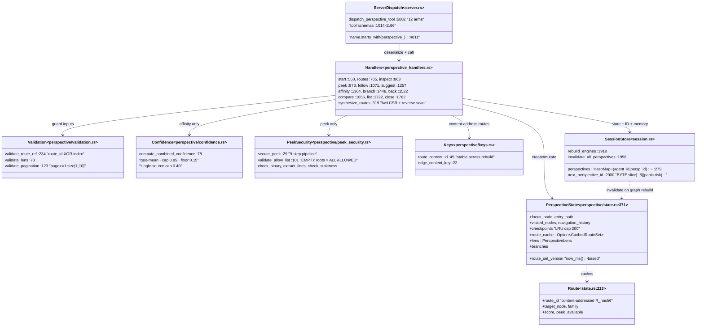
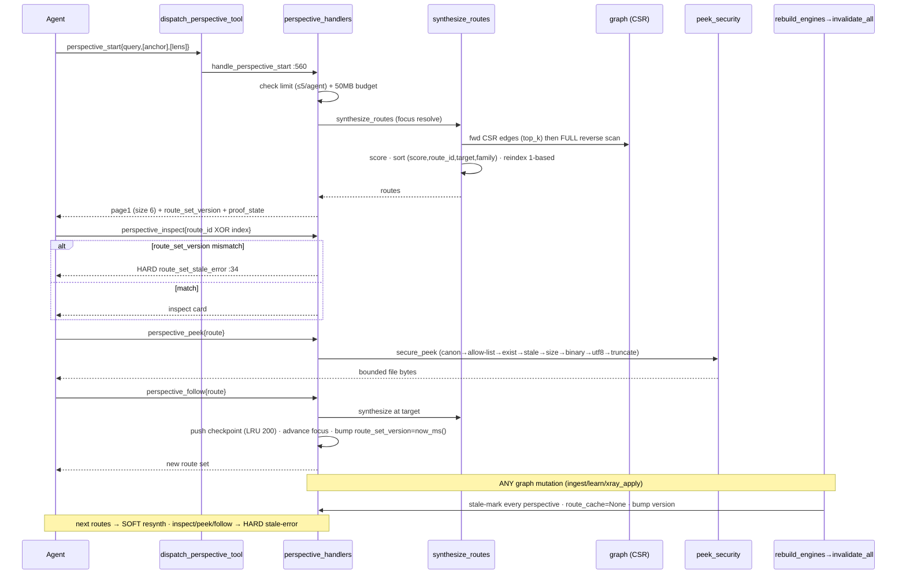

# perspective

A stateful, per-agent multi-viewpoint graph-navigation system exposing 12 MCP verbs that let an agent open a "perspective" over the code graph, synthesize scored routes from a focus node, inspect/peek/follow/branch/back/compare them, and get next-move suggestions — with content-addressed route IDs, optimistic `route_set_version` concurrency, and epistemically-guarded affinity hypotheses.

## Class/Component



## Sequence



## State/Flow

```mermaid
stateDiagram-v2
    [*] --> Open: perspective_start (focus resolved, routes synthesized)
    Open --> Open: routes / inspect / peek / suggest / affinity (read)
    Open --> Deeper: perspective_follow (checkpoint pushed, focus advances)
    Deeper --> Open: perspective_back (checkpoint popped, focus restored)
    Deeper --> Deeper: follow again
    Open --> Branched: perspective_branch (clone to new id; NOT at root)

    state Stale <<choice>>
    Open --> Stale: graph rebuild → invalidate_all
    Stale --> Open: perspective_routes (SOFT resynth, continues)
    Stale --> Refused: inspect/peek/follow/affinity/suggest (HARD stale-error)
    Refused --> Open: agent re-calls perspective_routes

    Open --> [*]: perspective_close (cascade-release agent locks)
```



## Invariantes
- Route ref is exactly-one-of `route_id` XOR `route_index` (1-based); both→AMBIGUOUS, neither→MISSING, index 0→invalid (validation.rs:234).
- Ownership: every access keyed by `(agent_id, perspective_id)`; visible only to owning agent.
- Optimistic concurrency: inspect/peek/follow/affinity/suggest HARD-reject a `route_set_version` mismatch; only `perspective_routes` SOFT-degrades (handlers.rs:723 vs :876/:985/:1086/:1268/:1377). Confirmed.
- Determinism: total order — score desc, then route_id, then target_node, then family ordinal; reindexed 1-based (synthesize_routes:523-535).
- Route IDs content-addressed (`R_{6 hex}` from target+family), stable across rebuild (keys.rs:45).
- `route_set_version` is `now_ms()`-based, monotonic across the lifetime and across restarts.
- Affinity epistemic guards: `is_hypothetical` always true, `proposed_relation` always None (V1), confidence ∈ [0.15, 0.85], single-source capped 0.40 (confidence.rs:78-113). Confirmed.
- Hard caps: ≤5 perspectives/agent, ≤10 branches/agent, ≤200 checkpoints/perspective (LRU-evict), ≤8 affinity candidates, 50MB combined perspective+lock memory.
- Branch precondition: cannot branch at root (navigation_history non-empty, :1468); Back errors `NavigationAtRoot` when checkpoint stack empty (:1534).
- Graph mutation invalidates: `rebuild_engines` always stale-marks + nulls route_cache + re-stamps version (session.rs:1958). This is the ONLY writer of the stale signal.

## Gaps
- **[high] Route family is ALWAYS `Structural`**: the entire multi-family taxonomy (Semantic/Temporal/Causal/Ghost/Hole/Resonant) is declared and used for tie-breaking + affinity classification but never PRODUCED by synthesis. Confirmed in code: `let family = RouteFamily::Structural; // V1: default to structural` at handlers.rs:403 and again at :482. `lens.route_families` filtering is therefore a no-op — "multi-viewpoint" is currently single-viewpoint.
- **[high] Lens is largely inert**: dimensions, xlr, include_ghost_edges, include_structural_holes, namespaces, tags, node_types, ranking_weights are validated/stored/echoed but NOT consulted during synthesis — only `top_k` affects output (synthesize_routes reads only `lens.top_k`). Agents set a lens believing it filters/reweights when it does not.
- **[medium] UTF-8 panic risk**: `next_perspective_id`/`next_lock_id`/`next_edit_preview_id` slice `&agent_id[..agent_id.len().min(8)]` by BYTES (confirmed session.rs:2006,:2014). A multi-byte `agent_id` whose 8th byte lands mid-codepoint panics the handler and the request.
- **[medium] Reverse-edge synthesis is O(V·E)**: when forward edges < top_k, `synthesize_routes` scans EVERY node and edge to find inbound edges to focus (handlers.rs:456-519), on every start/follow/back/routes-resynth call. No reverse adjacency index.
- **[medium] Peek allow-list OPEN BY DEFAULT**: `validate_allow_list` returns `Ok` when `allow_roots` is empty — confirmed peek_security.rs:101-105 with comment "should be tightened in production"; `PeekSecurityConfig::default` ships `allow_roots: Vec::new()`. If shipped empty, peek reads any readable file within size/binary limits.
- **[low] `compare` only set-diffs `visited_nodes`**: `dimension_deltas` always `[]` ("V1: requires engine_ops", :1704); cache-generation mismatch only WARNS, does not block.
- **[low] Fuzzy focus resolution**: start binds focus to the first graph label CONTAINING the query; synthesize falls back to substring on external_id — different queries can silently bind an unintended node with no disambiguation surfaced.
- **[low] No persistence**: perspective/nav/checkpoint state is memory-only; a server restart (the documented owner-restart failure mode) silently drops every open perspective despite all types deriving `Serialize`.
- **[low] Coarse lock cascade on close**: releases ALL agent locks once `agent_perspective_count` hits 0, ignoring per-perspective scope ("V1 simplified", :1787-1796).
```
