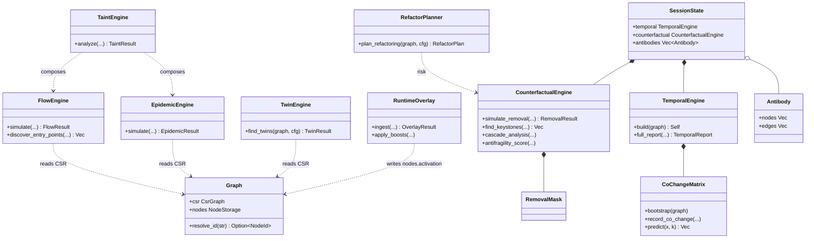
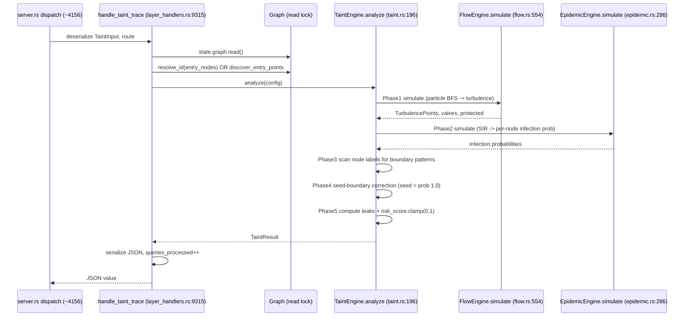
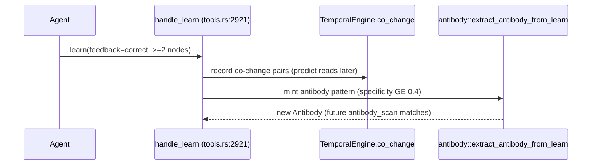
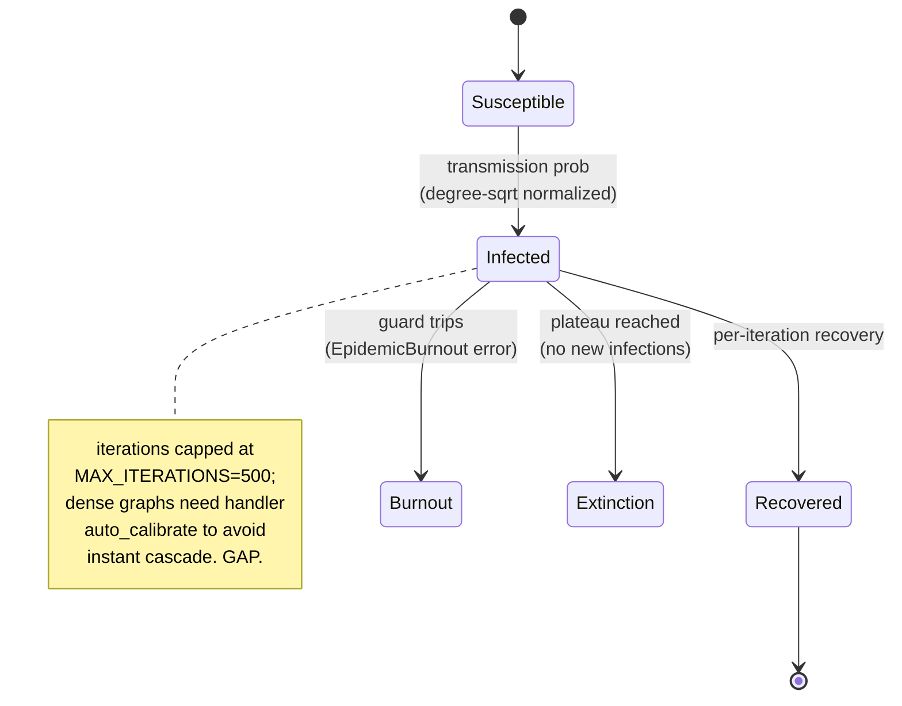

# RETROBUILDER (RB family) — advanced graph-analysis layer

Five+ advanced graph-analysis engines (RB-01..RB-05 plus epidemic/temporal/counterfactual/antibody) that turn the static+temporal code graph into concurrency, security, structural-duplication, refactoring, runtime-heat, bug-propagation and bug-recurrence analyses, composed from shared graph primitives (CSR traversal, activation, community/bridge detection), surfaced as MCP verbs gated to the full tool tier.

## Class

## Sequence

taint_trace (RB-02) as the canonical composed flow — the deepest composition (flow + epidemic + boundary scan). Every RB verb follows the same shape: dispatch to typed input, lock graph, resolve ids, build config, call pure engine, serialize.

Feedback loop (learn closes two RB subsystems):

## State/Flow

Epidemic SIR compartment transitions (deterministic expected-value; burnout + extinction guards bound it).

## Invariantes

- Empty input is a typed error, never a panic: NoEntryPoints (flow.rs:565, taint.rs:203), NoValidInfectedNodes (epidemic.rs:312), EmptyGraph (twins.rs:321, refactor.rs:137, runtime_overlay.rs:186).
- All scores clamped to bounded ranges: taint risk_score, twins cosine, epidemic infection_probability, counterfactual pct_activation_lost, antibody confidence/specificity all clamp(0.0,1.0) at exit.
- All traversals budget-bounded: flow step budget density-scaled with 1000-floor + MAX_ACTIVE_PARTICLES=10000; epidemic MAX_ITERATIONS=500; causal chains DEFAULT_CHAIN_BUDGET=10000; co-change DEFAULT_MATRIX_BUDGET=500000 + CO_CHANGE_MAX_ROW=100; twins 100000 comparisons; antibody PATTERN_MATCH_TIMEOUT_MS=10 + TOTAL_SCAN_TIMEOUT_MS=100.
- Determinism: expected-value/deterministic tie-breaks not RNG; every float-keyed sort breaks ties by node id (flow.rs:945 etc).
- Entry seeds carry maximal taint: a boundary node coinciding with an injection seed is reported hit with prob 1.0, not miss 0.0 (taint.rs:265-297).
- Counterfactual removal never mutates or clones the graph: RemovalMask is a bitset; propagate_with_mask skips removed nodes/edges (counterfactual.rs:27-91,237-331).
- Antibody persistence atomic-with-backup: save writes temp+rename and backs up prior; load falls back to .json.bak then empty (antibody.rs:1338-1414).
- Auto-extracted antibodies must clear MIN_AUTO_EXTRACT_SPECIFICITY=0.4 or are dropped; near-duplicates above DUPLICATE_SIMILARITY_THRESHOLD=0.9 rejected (antibody.rs:1192; tools.rs:90-91).
- Ghost edges are strictly the complement of static structure: a co-change pair becomes a ghost edge only if has_static_edge is false in both directions (git_history.rs:227,253-270).

## Gaps

- **[high]** Temporal co-change state (CoChangeMatrix) is NOT persisted — rebuilt from graph structure on every session load and graph rebuild, so all ghost_edges git-history injection and all learn()-recorded co-change is ephemeral and silently lost across restarts/re-ingests; only the structural BFS bootstrap survives (temporal.rs:73 no Serialize; session.rs:1558/1927 rebuild. Contrast antibodies + epidemic DO persist).
- **[medium]** Boundary/lock/read-only/entry-point detection across flow and taint is pure case-insensitive substring matching on labels/excerpts — real boundaries with unconventional names are missed (false negatives) and unrelated names containing a token are false positives (taint.rs:132/399, flow.rs:405-418).
- **[medium]** find_keystones runs a single seed-trial per candidate so impact_std is always 0.0 despite KeystoneEntry advertising a standard deviation — the statistic is misleading (counterfactual.rs:611-626).
- **[medium]** Several counterfactual outputs are structurally present but unpopulated: communities_split always 0, antifragility most_redundant/least_redundant empty — callers (incl refactor risk) get a zero where a real value is implied (counterfactual.rs:532, 810-811).
- **[medium]** Antibody `regex` match_mode is a lie by omission: silently degrades to substring (regex crate not a dependency), so regex semantics differ with no error/warning (antibody.rs:911-916).
- **[low]** ghost_edges shells out to the git binary; on a non-git/shallow/missing-git source it returns an I/O error rather than degrading, leaving the temporal layer with no real co-change signal (git_history.rs:113-124).
- **[low]** Twins pairwise comparison is O(candidates^2) capped at a fixed 100000-comparison budget; on large graphs the scan silently truncates mid-pass with no `truncated` flag in TwinResult (twins.rs:388-399).
- **[low]** All RB verbs are hidden by default: with `M1ND_TOOL_TIER` unset none appear in `tools/list` (`CORE_TOOLS` has no RB verb). Since 2026-08-01 they are discoverable without setting the full tier — `help` catalogs the whole registry at every tier, and the core menu says outright that it is a core — but an agent still has to ask `help` rather than read them off the list.
- **[low]** Epidemic on dense graphs relies on handler-side heuristics (auto_calibrate + promotion_threshold=1.0 when avg_degree>4) to avoid burnout; without auto_calibrate the SIR can burnout-error or saturate, sensitive to a flag the caller may not set (layer_handlers.rs:8278-8308; epidemic.rs:533-541).

## Proof gaps (from map proof_missing)

- No test asserts temporal co-change PERSISTENCE across reload/rebuild (because there is none — the gap is silent).
- Neither temporal.rs nor counterfactual.rs has any INLINE unit test; coverage is entirely external, so per-function edge cases are only exercised indirectly.
- No test verifies find_keystones impact_std is meaningful (always 0.0) nor that antifragility redundant lists are populated.
- No test distinguishes antibody regex from substring mode.
- No test covers ghost_edges failure on a non-git/shallow source.
- No test asserts twins truncation on a large graph.
- No end-to-end test proves epidemic auto_calibrate prevents burnout on a genuinely dense real graph.

## MCP verbs

ghost_edges (RB-01) - taint_trace (RB-02) - twins (RB-03) - refactor_plan (RB-04) - runtime_overlay (RB-05) - flow_simulate - epidemic - counterfactual - antibody_scan/list/create - predict (reads temporal) - learn (writes co-change + auto-extracts antibodies).
