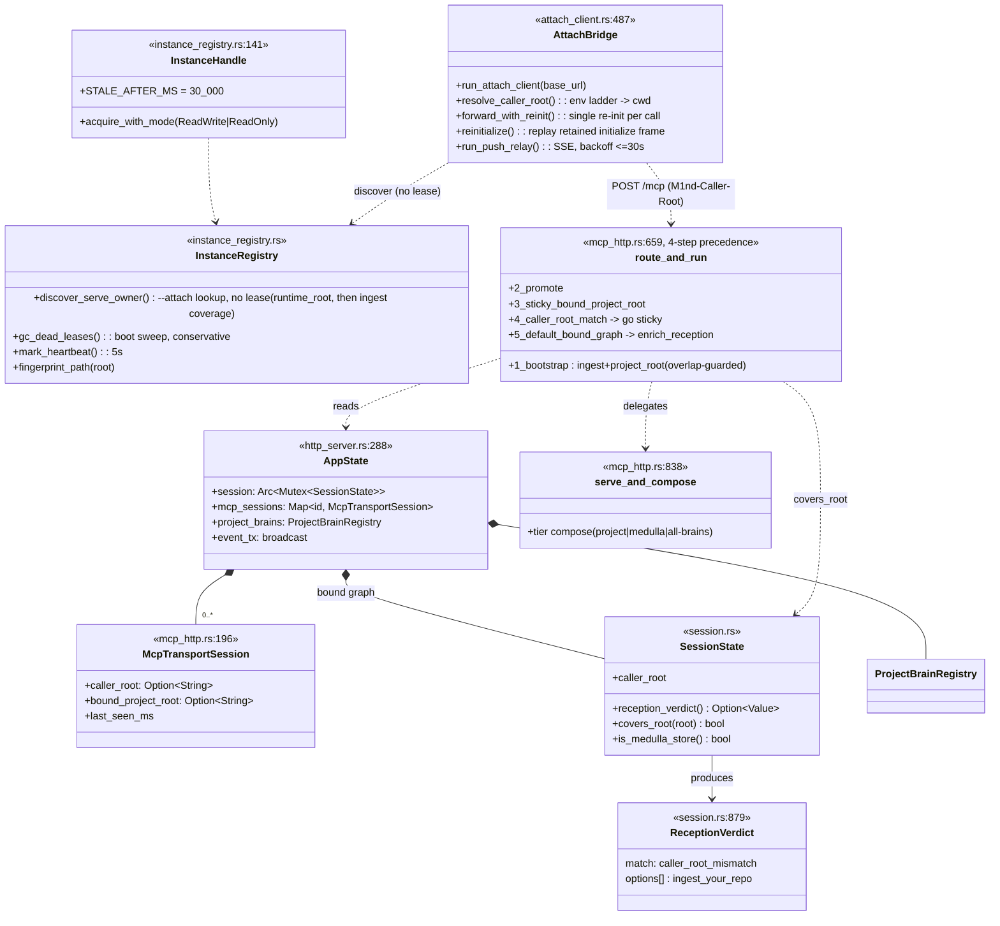
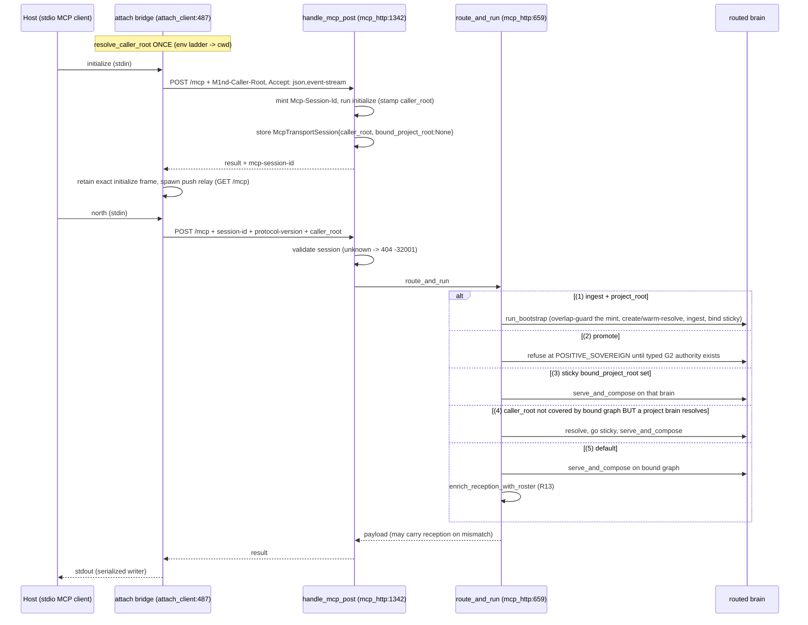
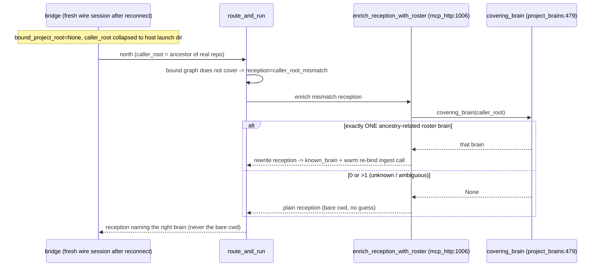
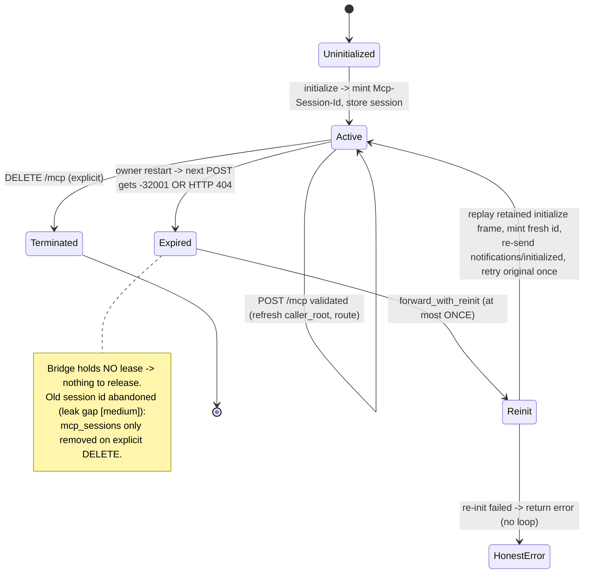
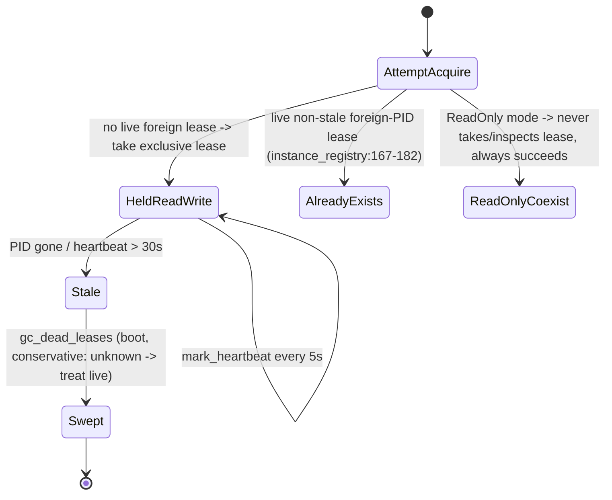

# Routing / Reception / Serve-Attach — the served-owner (:1338) transport spine

A single long-lived served owner process holds one live graph + a set of owner-hosted
per-project brains, exposes them over a spec-compliant Streamable-HTTP MCP endpoint
(`/mcp`), routes each wire request to the brain that owns the caller's repo (via the
M1nd-Caller-Root header + a caller_root_mismatch reception verdict), and lets any number
of thin, graph-less `--attach` bridges share that one owner's state while transparently
surviving owner restarts.

## Class

## Sequence — caller_root -> bind (4-step routing precedence)

## Sequence — reconnect-rebind (R13, covering_brain)

## State/Flow — MCP wire session lifecycle + transparent re-init

## State/Flow — instance lease (single writer)

## Invariantes

- **Single exclusive ReadWrite lease per runtime_root**: a live, non-stale, foreign-PID lease makes acquire_with_mode return AlreadyExists (instance_registry.rs:167-182 — verified: acquire_with_mode at :141). ReadOnly attachers never take/inspect/overwrite the lease.
- **Attach bridge holds NO graph and NO lease**: pure transport; N bridges share the one owner's Arc<Mutex<SessionState>> (verified: run_attach_client at :487, resolve_caller_root at :460).
- **stdout framing fidelity**: exactly ONE task owns stdout (run_stdout_writer L86); every producer pushes whole frames into an unbounded channel so a push notification can never interleave inside a response frame; only JSON-RPC frames touch stdout.
- **Silent bind ONLY on a match (TT-INV-12)**: reception_verdict returns None when covers_root is true AND None when caller_root is unknown; emits caller_root_mismatch only when the root is KNOWN and NOT covered (session.rs:882-909 — verified: reception_verdict at :879, covers_root at :917).
- **One definition of 'covers'**: covers_root uses workspace_root + ingest_roots via path_starts_with_loosely, shared by the reception verdict AND the HTTP routing layer.
- **Never hold two session locks at once**: each store is locked, queried, released before the next; the primary lock is dropped before any sibling store is read; no lock across an .await.
- **Pull-only memory (MED-INV-1)**: brain X default beat = X's own store + medulla; a third store only under tier:all-brains (serve_and_compose L903-943 — verified: serve_and_compose at :838).
- **Session stickiness never re-asks**: bound_project_root set once and sticky for the wire session lifetime; mid-session cwd travel deliberately not re-detected (mcp_http.rs:208-214).
- **Single re-init per call**: forward_with_reinit re-initializes at most once then returns the honest error (attach_client.rs:438-448 — verified: forward_with_reinit at :394, reinitialize at :340).
- **Session-expiry detected by EITHER -32001 OR HTTP 404** (PostOutcome::signals_session_expired L201), robust to a proxy stripping the body.
- **Self-echo suppression**: a graph_changed event stamped with a stream's own origin session is never relayed back (handle_mcp_get L1631).
- **GC never deletes an entry it cannot prove dead**: LivePids conservative (unsupported platform / failed refresh -> every pid treated live); corrupt files skipped, never removed (verified: gc_dead_leases at :412).
- **Eviction persists before dropping**; the bound dev graph is never in the map and never a victim.
- **Bootstrap never shadows the bound graph**: a project_root the bound graph already covers is refused with one honest error (the seam-shared `mcp_http::run_bootstrap_core`).
- **Skeleton writes are root-gated — the second write law is now MECHANICAL (2026-07-10 night)**: the skeleton WRITE verbs (`system_blocks_seed_import`, `skeleton_candidate`, `candidate_edit`, `candidate_lease` acquire, `system_blocks_ratify`/`reconcile`/`archive`/`delete`) REFUSE (`brainless_root`, naming BOTH roots) when the dispatching session carries a `caller_root` the serving brain does not cover — the implicit mis-route that once let a foreign repo's scan overwrite the bound skeleton can no longer write. The refusal teaches the two honest paths: `ingest project_root=<your root>` (bind first), or the explicit REST `?brain=` selector for a DELIBERATE cross-brain write (which bypasses the gate — selection is consent). Bare/bound sessions with no caller_root (the owner's own UI, tests) proceed as before; reads stay advisory; `memorize` keeps its own refusal.
- **Both seams — JSON-RPC and REST — route through the same guarded bootstrap**: an `ingest` carrying a non-empty `project_root` is a bootstrap DIRECTIVE on either door — the wire frame (`bootstrap_project_root` → `run_bootstrap`) and the REST `POST /api/tools/ingest` route (`handle_tool_call` intercepts it exactly like `mission_spawn`/`candidate_naming`) both call the ONE seam-shared core (`mcp_http::run_bootstrap_core`: bound-shadow guard → guarded mint with the overlap guard and its `allow_overlap` escape → ingest → same-response `north`). The REST route renders a refusal as an honest HTTP 400 `invalid_params` carrying the guard's full message; only the packet's `routing` line differs per seam (wire = sticky session bind, REST = the `?brain=` selector). Field hole closed 2026-07-10: the REST route used to IGNORE `project_root` and dispatch the ingest into the RESOLVED brain — the BOUND graph when `?brain=` was absent — replacing the owner's ingest_roots. Without `project_root` the REST route is untouched (re-ingesting the resolved brain via `?brain=` stays legitimate).
- **Bootstrap refuses an OVERLAPPING project brain unless `allow_overlap:true`**: before minting a NEW project brain, the mint path classifies the root against every existing project brain (warm map ∪ on-disk roster, via `existing_brain_roots`) into one of three overlap classes — **child** (the new root is INSIDE an existing brain's root), **parent** (an existing brain's root is INSIDE the new root — the mother-folder trap that re-ingests the child repo from above), or **worktree** (the new root is a git worktree, `.git` a gitdir file under `<main>/.git/worktrees/`, whose main repo already has a brain) — and returns one honest `overlap_<class>` error that names the conflicting root and the two ways forward: (a) bind to the existing brain (`ingest project_root=<existing>`), or (b) pass `allow_overlap:true` to mint a separate brain anyway. The exact same root is warm-reuse, never an overlap (it never reaches the guard). This stops one repo growing two brains by accident — double auto-ingest cost + memories fragmented across stores (project_brains.rs `detect_root_overlap` + the bootstrap None-arm; `allow_overlap` is a routing directive stripped before the inner ingest, like `project_root`).
- **covering_brain returns a rebind target only when EXACTLY ONE roster brain is ancestry-related** (0=unknown, >1=ambiguous -> plain reception); an exact match is skipped (silent bind, not rebind).

## Gaps

- **[closed/high] No authentication; 0.0.0.0 exposed the full tool surface**: every non-loopback bind is now refused before owner boot, including when the legacy `--allow-remote` flag is present (`remote_bind_verdict`; battery-pinned for wildcard, LAN IP, hostname, and both flag values). The residual is explicit: the loopback HTTP surface still has no client authentication, and authenticated TLS remote transport plus scoped authorization remain future work.
- **[medium] MCP wire sessions never expire / never GC'd in-process**: the mcp_sessions map only grows (insert on initialize, remove on explicit DELETE). The re-init path mints a NEW id and abandons the old one -> a McpTransportSession leaks forever (handle_mcp_post inserts L1398; only handle_mcp_delete removes L1670; reinitialize mints fresh id, never DELETEs old — attach_client.rs:352-356).
- **[medium] caller_root trusted verbatim from the header**: no validation the caller owns that path — any HTTP client can claim to be rooted in any repo and be routed to (or bootstrap) that brain (caller_root_from_headers L1330 -> route_and_run uses it directly). Combined with the no-auth gap this is a routing-confusion surface.
- **[medium] Deployment drift**: the live :1338 owner is documented as NOT restarted onto the current binary, so proven-in-code behaviors (medulla re-scope, unified registry, R13) are not guaranteed live (docs/PATHOS.md L165, docs/ORGANISM-PRD.md L778/795/835/856). %% [unverified against running deployment]
- **[low] Instance-ID collision possible in principle**: generate_instance_id hashes with std DefaultHasher (SipHash, non-crypto) into 64 bits; two colliding entries would overwrite each other's instances/<id>.json (instance_registry.rs:543-553).
- **[low] Push-relay reconnect loops forever with no give-up**: run_push_relay retries with bounded backoff (<=30s) indefinitely even on a persistent non-success (e.g. permanent 404); only stdin EOF stops it (attach_client.rs:802-820 — verified: run_push_relay at :765).
- **[low] Mid-session cwd travel not re-detected**: an agent that cd's into another repo inside one wire session keeps hitting the original brain; the claimed 'scope-guard backstop' is outside this system's code (mcp_http.rs:208-214).
- **[low] Warm-boot on the routed hot path is synchronous under the MCP tool timeout**: a first call into a large dormant brain can block up to MCP_TOOL_TIMEOUT_SECS and, if exceeded, returns -32000 with the brain half-booted (project_brains.rs resolve L187; route_and_run timeout L666).
