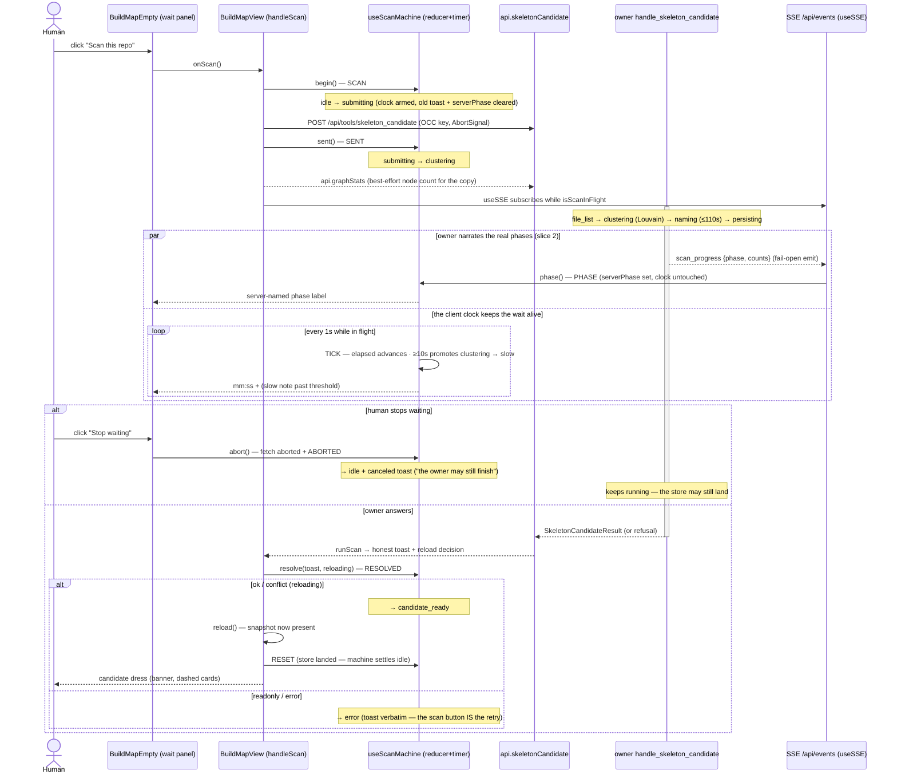
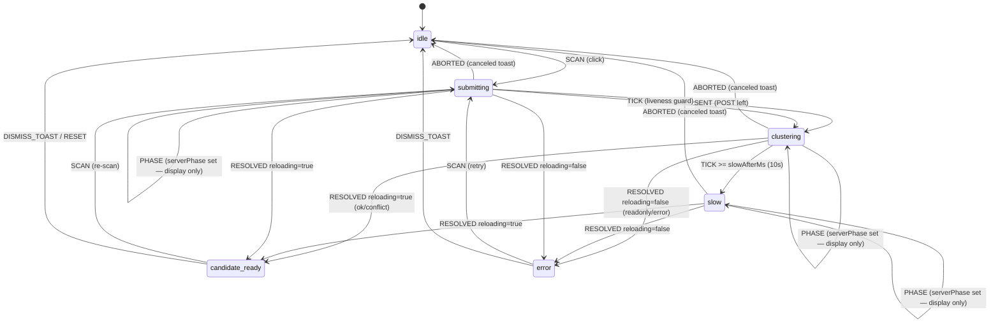

# Scan Loading — the `skeleton_candidate` wait as a state machine

The Build Map's "Scan this repo" gesture fires ONE synchronous `skeleton_candidate`
POST that the owner legitimately holds for minutes on a big graph — and until this
sheet's fix the UI collapsed that whole wait into a single boolean (`scanning`), so
the button read "Scanning…" and the screen looked frozen. This sheet grounds the
real server timeline (why it is slow, with code anchors), defines the client-side
loading state machine that dresses the wait honestly, AND — slice 2, now BUILT —
the owner narrates its real phases on the EXISTING SSE channel so the wait panel
shows the server's actual phase, not a static guess.

**Code homes:** the pure machine `m1nd-ui/src/lib/scanMachine.ts` (`PHASE` event +
`serverPhaseLabel`) · the React driver `m1nd-ui/src/hooks/useScanMachine.ts`
(`phase()`) · the SSE hook `m1nd-ui/src/hooks/useSSE.ts` (`scan_progress`) · the
write owner `m1nd-ui/src/components/map/BuildMapView.tsx` (`handleScan` + the
in-flight SSE subscription) · the wait panel `m1nd-ui/src/components/map/BuildMap.tsx`
(`BuildMapEmpty`) · the abortable client `m1nd-ui/src/api/client.ts`
(`skeletonCandidate`) · the server handler `m1nd-mcp/src/system_blocks_handlers.rs`
(`handle_skeleton_candidate`, now emitting) + the sink wiring
`m1nd-mcp/src/http_server.rs` (`scan_progress_sink`).

## The measured truth — where the minutes go

`handle_skeleton_candidate` (system_blocks_handlers.rs:218) is a plain synchronous
`fn` dispatched inside the HTTP server's `spawn_blocking`; the browser's POST stays
open across the WHOLE pipeline and nothing streams back until the final JSON:

| stage | code anchor | cost driver |
|---|---|---|
| repo file list | `system_blocks::repo_file_list` (handler :237) | git ls-files / walk — seconds on a big repo |
| HEAD commit | `git_head_commit` :334 | one `git rev-parse` spawn |
| graph → scan input | `scan_input_from_graph` under the graph read lock :245 | O(nodes+edges) copy |
| Louvain + directory modules | `skeleton_scan::scan_skeleton` :255 | community detection over the whole graph |
| **naming-runner batch** | `naming_runner::run_scan_naming` :274, budget `scan_naming_timeout` (naming_runner.rs:482) | **`10 + 95×⌈blocks/4⌉` s, capped 110 s.** Field-measured in the code's own comment: a real CLI-backed naming runner takes ~50 s per call (process startup dominates). Skipped entirely when no runnerd is announced. |
| persist store | `skeleton_candidate_in_dir` :319 | atomic write, fast |

So with a LIVE naming runner announced, one scan legitimately holds the POST for
up to ~2 minutes before the heuristic fallback — exactly the "frozen for minutes"
report this fix answers. Progress events: the owner has an SSE channel
(`/api/events`, e.g. `apply_batch_progress`, http_server.rs) and — slice 2 — the
scan path now emits `scan_progress` phase events on it (the same sink pattern). The
client's elapsed clock stays the client's own; the SERVER states the phase. Neither
side fabricates a percentage — the events are phase boundaries and the counts the
owner actually computed (files, nodes, blocks, the naming budget's wave estimate).
When no SSE flows (older owner / closed channel) the panel degrades to exactly the
pre-slice-2 behavior: a REAL elapsed clock + the static client phase label.

## Sequence — click → held POST → candidate dress

## State chart — the machine itself

Events are REAL only: a response, an error, a user gesture, or the 1 s timer tick.
No transition is driven by an invented fraction.

State fields: `startedAt` (epoch ms of SCAN), `elapsedMs` (advanced only by
event-carried clocks, floored at 0), `toast` (the honest outcome; `null` in flight),
`serverPhase` (the owner's last-narrated phase, or `null` when none flows — cleared
on SCAN/ABORT/RESET). `isScanInFlight` names exactly {submitting, clustering, slow}
— the button locks and the wait panel shows precisely there. `PHASE` sets
`serverPhase` and NOTHING else: it never moves the clock or the phase machine, and
it is a no-op outside flight (TOTAL law), so a late/stray phase cannot wedge it.

## Invariants

- **NEVER-DEAD** — every in-flight render carries a named phase, a counting mm:ss
  clock, and the calm pulse; past 10 s the panel SAYS the wait is long
  (`scanSlowNote`, with the REAL node count when `graphStats` landed) and keeps
  counting. The screen can no longer look frozen while the owner clusters.
- **REAL EVENTS ONLY / NO FABRICATED PROGRESS** — the machine advances on
  response / error / gesture / timer tick, and now on the owner's `PHASE` (which
  changes only the label, never the clock). There is no percentage anywhere in the
  wait surfaces — the owner narrates PHASES and COUNTS (a fact), never a fraction;
  inventing one would lie. Unit tests pin `%`-absence on every copy string,
  client- and server-label alike (`scanMachine.test.ts`, `scan-wait.test.tsx`).
- **TOTAL REDUCER** — every (state, event) pair is defined; inapplicable events
  return the SAME state reference. A late RESOLVED after an abort, a stray TICK
  after settle, and a double SCAN are provable no-ops. The machine cannot wedge.
- **HONEST ABORT** — "Stop waiting" aborts the browser's fetch, NOT the owner's
  work (the handler runs to completion and may still write the store). The
  canceled toast says exactly that, in the NEUTRAL tint — a user gesture, not a
  failure. `canceled` extends the shared write-toast grammar (`ReconcileToastKind`).
- **OCC UNCHANGED** — the gesture still keys `expected_store_version` from the
  snapshot it read (`null` on the first scan); conflict/readonly/error keep the
  exact `runScan` grammar and copy that F0c shipped.
- **LEGACY SURFACE BYTE-COMPATIBLE** — `scanning`/`scanToast`/`onScan` props behave
  as before (button lock + "Scanning…"); the wait panel renders only when the new
  `scanPhase` view is provided. All pre-existing specs pass unmodified.
- **SERVER PHASE IS DISPLAY-ONLY + DEGRADES (slice 2)** — the owner's `scan_progress`
  phase only NAMES the wait; it never drives the client machine, and its emit is
  fail-open on the owner. When the channel is silent (older owner / closed) the
  panel shows the static client label with no loss (`data-scan-server-phase` is
  simply absent). The scan verb's response is byte-identical with or without a
  listener — a parallel narration layer, not a semantics change.

## Proof

- Unit (node:test): `m1nd-ui/src/lib/scanMachine.test.ts` — every transition, the
  slow threshold (default + injectable), totality/no-op law, abort copy, elapsed
  floor, copy law, AND slice 2: `PHASE` sets `serverPhase` without moving the clock,
  is a no-op outside flight, is cleared on SCAN/ABORT, the snake_case→camelCase
  mapper drops malformed events, and `serverPhaseLabel`/`scanDisplayLabel` hold the
  copy law. `m1nd-ui/src/components/map/scan-wait.test.tsx` — the panel per phase,
  the neutral canceled tint, the legacy surface, AND the owner-named phase riding
  the panel + the no-serverPhase degradation.
- Rust (cargo test -p m1nd-mcp): `system_blocks_handlers.rs` — the emitted phase
  ORDER with and without a live runner, the `failed` terminal on a persist
  conflict, and the no-fraction event shape; `http_server.rs` — the sink flattens
  the phase + envelope, and is fail-open with no subscriber.
- Browser (deterministic Playwright, `npm run test:e2e`, own Vite server on a
  private port, whole owner REST surface mocked in-page — no live owner touched):
  `m1nd-ui/e2e/scan-loading.spec.ts` — the counting clock, the earned slow note,
  error verbatim + retry landing the candidate banner, stop-waiting to idle, AND
  the owner narrating file_list → clustering → naming with the panel tracking each.

## Slice 2 — server progress events (DELIVERED)

The client-side ceiling is passed: the owner now narrates on the EXISTING
`/api/events` channel, and the UI shows the real phase.

- `handle_skeleton_candidate` emits `scan_progress` at each real boundary via the
  session's `scan_progress_sink` (the `apply_batch_progress_sink` pattern, wired
  per-request in `http_server.rs` for HTTP + stdio):
  `{"event_type":"scan_progress","data":{"phase":"file_list|clustering|naming|persisting|done|failed","file_count":N,"node_count":N,"edge_count":N,"block_count":N,"naming_waves":n,"error":"…"}}`.
  Only the fields the owner has at that boundary are present; no percentage anywhere.
- **Honest divergence from the original design** — the ledger imagined a
  `naming_wave i/N` counter "the batch loop already knows". It does NOT: `run_scan_naming`
  makes ONE opaque daemon call for all packets (the `div_ceil(4)` "waves" only size
  the timeout budget). Splitting it into per-wave calls would change the verb's
  semantics (forbidden), so the `naming` phase emits ONE boundary event carrying the
  block count + that wave ESTIMATE (a real number), and the client's elapsed clock
  narrates the wait. No fabricated per-wave sub-progress is invented.
- The UI subscribes while `isScanInFlight` (`useSSE`, `scan_progress` added to its
  event list) and replaces the static phase label with the server-named phase via
  the `PHASE` machine event; elapsed stays the client's own clock. Absent events
  (older owner) degrade to the pre-slice-2 behavior — retrocompat honesta.
- Owner-side cost: a handful of `event_tx.send` calls in the already-blocking
  handler — cheap, fail-open, no new locks.
