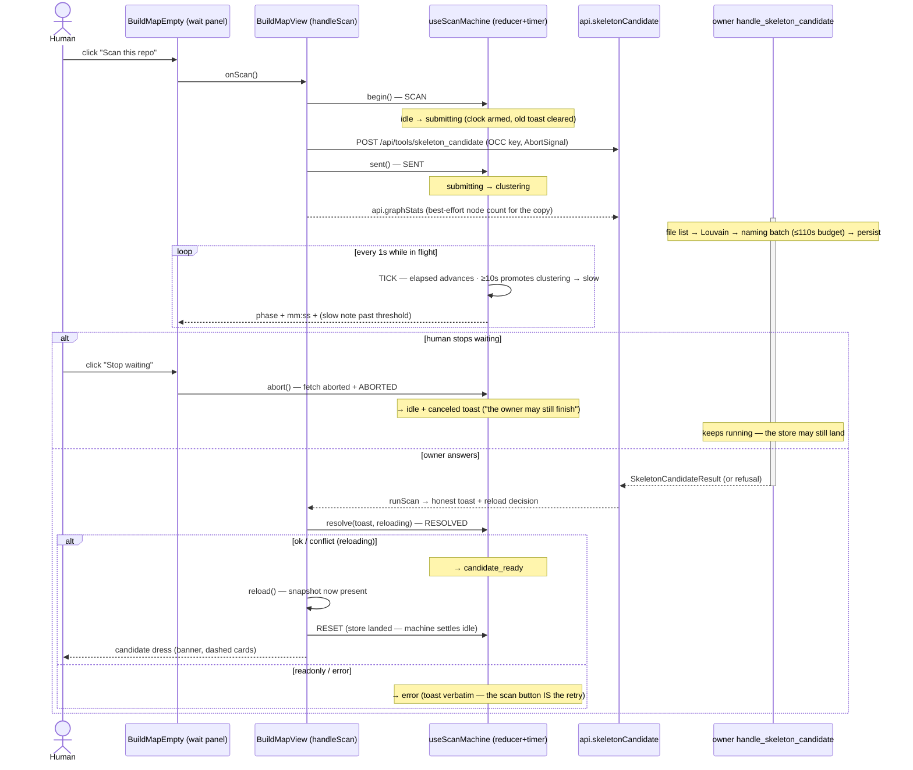
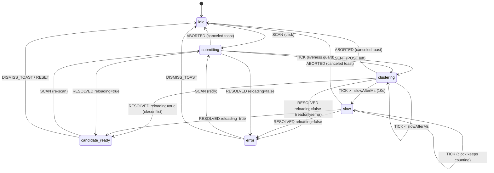

# Scan Loading — the `skeleton_candidate` wait as a state machine

The Build Map's "Scan this repo" gesture fires ONE synchronous `skeleton_candidate`
POST that the owner legitimately holds for minutes on a big graph — and until this
sheet's fix the UI collapsed that whole wait into a single boolean (`scanning`), so
the button read "Scanning…" and the screen looked frozen. This sheet grounds the
real server timeline (why it is slow, with code anchors), defines the client-side
loading state machine that now dresses the wait honestly, and declares the gap:
the owner still emits NO scan progress events (slice 2, designed below, not built).

**Code homes:** the pure machine `m1nd-ui/src/lib/scanMachine.ts` · the React driver
`m1nd-ui/src/hooks/useScanMachine.ts` · the write owner `m1nd-ui/src/components/map/BuildMapView.tsx`
(`handleScan`) · the wait panel `m1nd-ui/src/components/map/BuildMap.tsx` (`BuildMapEmpty`)
· the abortable client `m1nd-ui/src/api/client.ts` (`skeletonCandidate`) · the server
handler `m1nd-mcp/src/system_blocks_handlers.rs:218` (read-only for this slice).

## The measured truth — where the minutes go

`handle_skeleton_candidate` (system_blocks_handlers.rs:218) is a plain synchronous
`fn` dispatched inside the HTTP server's `spawn_blocking`; the browser's POST stays
open across the WHOLE pipeline and nothing streams back until the final JSON:

| stage | code anchor | cost driver |
|---|---|---|
| repo file list | `system_blocks::repo_file_list` (handler :237) | git ls-files / walk — seconds on a big repo |
| HEAD commit | `git_head_commit` :334 | one `git rev-parse` spawn |
| graph → scan input | `scan_input_from_graph` under the graph read lock :245 | O(nodes+edges) copy |
| Louvain + directory modules | `skeleton_scan::scan_skeleton` :255 | community detection over the whole graph |
| **naming-runner batch** | `naming_runner::run_scan_naming` :274, budget `scan_naming_timeout` (naming_runner.rs:482) | **`10 + 95×⌈blocks/4⌉` s, capped 110 s.** Field-measured in the code's own comment: a real CLI-backed naming runner takes ~50 s per call (process startup dominates). Skipped entirely when no runnerd is announced. |
| persist store | `skeleton_candidate_in_dir` :319 | atomic write, fast |

So with a LIVE naming runner announced, one scan legitimately holds the POST for
up to ~2 minutes before the heuristic fallback — exactly the "frozen for minutes"
report this fix answers. Progress events: the owner HAS an SSE channel
(`/api/events`, e.g. `apply_batch_progress`, http_server.rs:70) but the scan path
emits **nothing** on it. The client therefore cannot know the server phase — the
honest client-side maximum is a REAL elapsed clock + honest copy, never a
fabricated percentage. That is what this machine renders.

## Sequence — click → held POST → candidate dress

## State chart — the machine itself

Events are REAL only: a response, an error, a user gesture, or the 1 s timer tick.
No transition is driven by an invented fraction.

State fields: `startedAt` (epoch ms of SCAN), `elapsedMs` (advanced only by
event-carried clocks, floored at 0), `toast` (the honest outcome; `null` in flight).
`isScanInFlight` names exactly {submitting, clustering, slow} — the button locks and
the wait panel shows precisely there.

## Invariants

- **NEVER-DEAD** — every in-flight render carries a named phase, a counting mm:ss
  clock, and the calm pulse; past 10 s the panel SAYS the wait is long
  (`scanSlowNote`, with the REAL node count when `graphStats` landed) and keeps
  counting. The screen can no longer look frozen while the owner clusters.
- **REAL EVENTS ONLY / NO FABRICATED PROGRESS** — the machine advances on
  response / error / gesture / timer tick. There is no percentage anywhere in the
  wait surfaces (the owner emits no progress; inventing one would lie). Unit tests
  pin `%`-absence on every copy string.
- **TOTAL REDUCER** — every (state, event) pair is defined; inapplicable events
  return the SAME state reference. A late RESOLVED after an abort, a stray TICK
  after settle, and a double SCAN are provable no-ops. The machine cannot wedge.
- **HONEST ABORT** — "Stop waiting" aborts the browser's fetch, NOT the owner's
  work (the handler runs to completion and may still write the store). The
  canceled toast says exactly that, in the NEUTRAL tint — a user gesture, not a
  failure. `canceled` extends the shared write-toast grammar (`ReconcileToastKind`).
- **OCC UNCHANGED** — the gesture still keys `expected_store_version` from the
  snapshot it read (`null` on the first scan); conflict/readonly/error keep the
  exact `runScan` grammar and copy that F0c shipped.
- **LEGACY SURFACE BYTE-COMPATIBLE** — `scanning`/`scanToast`/`onScan` props behave
  as before (button lock + "Scanning…"); the wait panel renders only when the new
  `scanPhase` view is provided. All pre-existing specs pass unmodified.

## Proof

- Unit (node:test): `m1nd-ui/src/lib/scanMachine.test.ts` — every transition, the
  slow threshold (default + injectable), totality/no-op law, abort copy, elapsed
  floor, copy law. `m1nd-ui/src/components/map/scan-wait.test.tsx` — the panel at
  the pixel boundary per phase, the neutral canceled tint, the legacy surface.
- Browser (deterministic Playwright, `npm run test:e2e`, own Vite server on a
  private port, whole owner REST surface mocked in-page — no live owner touched):
  `m1nd-ui/e2e/scan-loading.spec.ts` — the counting clock, the earned slow note,
  error verbatim + retry landing the candidate banner, stop-waiting to idle.

## Gap ledger — slice 2: server progress events (NOT built)

The honest client-side ceiling is reached; the next truth increment must come from
the owner. Proposed contract (design only — the server is untouched by this slice):

- `handle_skeleton_candidate` emits SSE events on the EXISTING `/api/events`
  channel (the `apply_batch_progress` pattern, http_server.rs:70):
  `{"event_type":"scan_progress","data":{"phase":"file_list|clustering|naming|persisting","block_count":N,"naming_wave":i,"naming_waves":n}}`
  — real phase boundaries the pipeline already crosses, plus the naming wave
  counter the batch loop already knows. No percentages here either: phases and
  wave counts are facts.
- The UI subscribes while `isScanInFlight` (the `useSSE` hook already exists) and
  replaces the generic phase label with the server-named phase; elapsed stays the
  client's own clock. Absent events (older owner) degrade to exactly this slice's
  behavior — retrocompat honesta.
- Owner-side cost: four `event_tx.send` calls in an already-blocking handler —
  cheap; no new locks.
