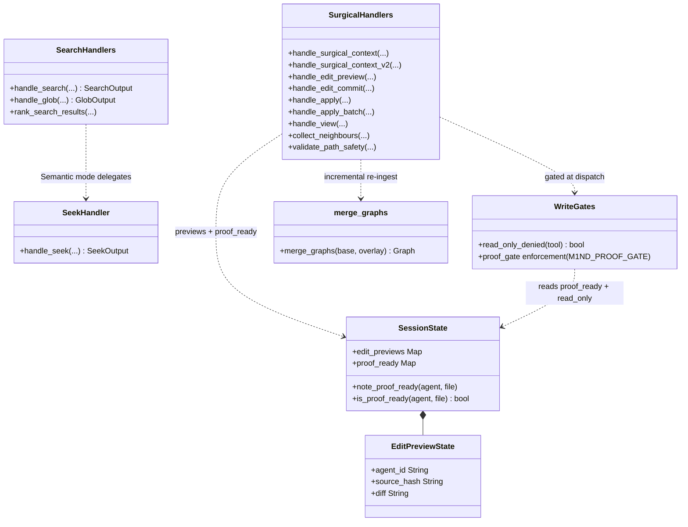
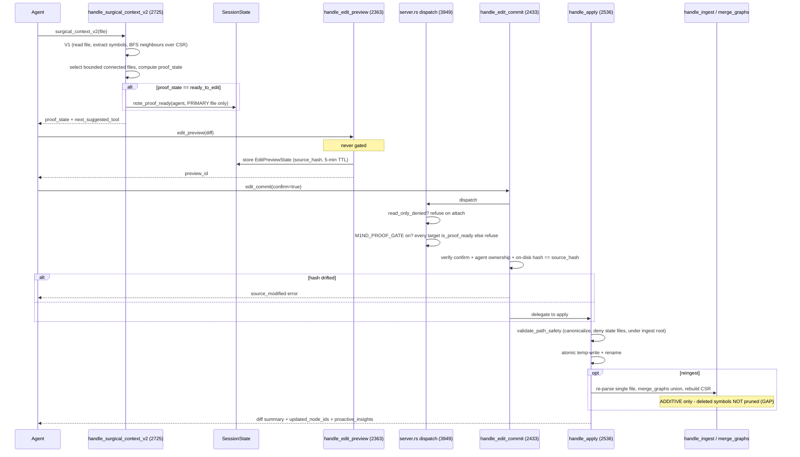
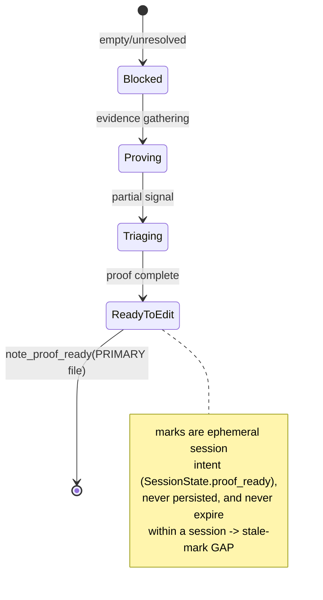
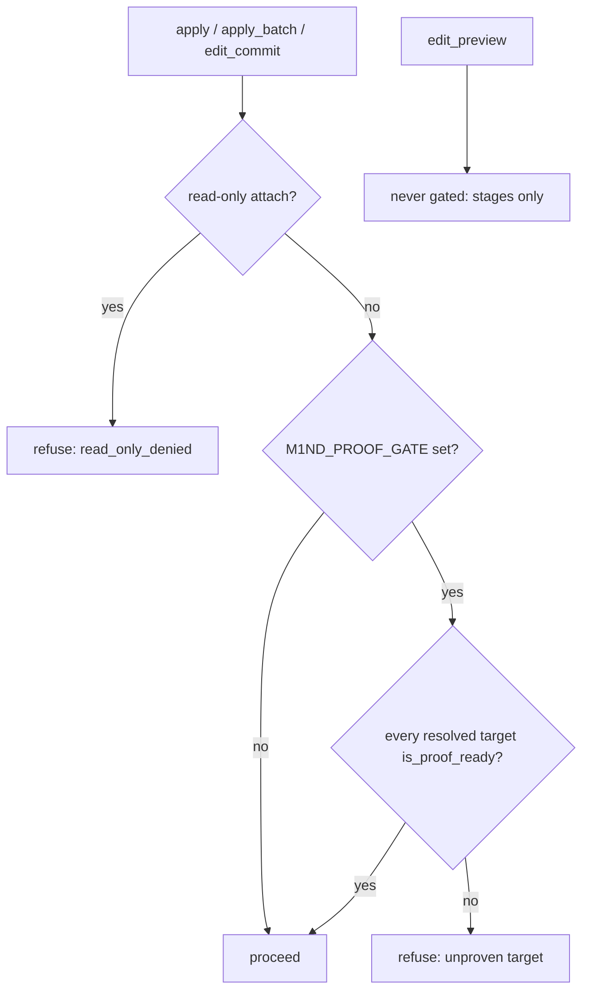

# Search & Surgical context

A dual-purpose retrieval-and-edit surface over the code graph: content/name search (literal/regex/semantic), file globbing, semantic seek, spread-activation, and a graph-aware surgical-context/preview/commit pipeline that reads neighbours, stages diffs, atomically writes, and incrementally re-ingests — guarded by a proof-gate and a read-only-attach gate.

## Class

## Sequence

The full EDIT path: prove (v2) to preview to commit to apply, with both gates at dispatch. `edit_preview` is deliberately exempt from both gates (stages only).

## State/Flow

surgical_context_v2 proof_state machine (the proof-gate producer) + the two write gates.

## Invariantes

- search query must be non-empty; top_k clamped to [1,500], context_lines to [0,10]; glob top_k clamped to [1,10000] (search_handlers.rs:310,333-334,1587).
- glob only returns file-level nodes: skips non-file:: nodes and any id containing '::' (search_handlers.rs:1600-1607).
- auto-ingest scope refuses to proceed when a relative scope resolves under >1 ingest root (ambiguous) rather than guessing (search_handlers.rs:804-809).
- semantic search delegates to seek only AFTER dropping the graph read-lock — no lock held across the nested handler call (search_handlers.rs:510).
- seek: empty graph or empty token set returns proof_state=blocked with a recovery_playbook and a trust envelope that never fabricates act (layer_handlers.rs:214-277).
- seek embeddings_used is truthful — true only when a real query-node cosine fed a node's score; with embed off it stays false and scoring is byte-identical (layer_handlers.rs:409,460).
- conformance-aware attention is zero-cost by absence: no X-RAY manifest resolves to every per-node conformance boost 0.0, output unchanged (layer_handlers.rs:296-302,599-605).
- write path confined to ingest roots: validate_path_safety canonicalizes (resolving .. and symlinks), denies m1nd runtime state filenames, requires the path to start with a canonicalized ingest root; empty ingest_roots blocks ALL writes (surgical_handlers.rs:1019-1089).
- apply writes atomically: temp file then rename, with temp cleanup on rename failure (surgical_handlers.rs:2551-2590).
- edit_commit is optimistic-concurrency safe: requires confirm==true, matching agent_id, and current on-disk hash equals the preview's source_hash, else source_modified (surgical_handlers.rs:2440-2492).
- edit previews expire: 5-minute TTL GC on every edit_commit (surgical_handlers.rs:2454-2457).
- proof gate: with M1ND_PROOF_GATE on, apply/apply_batch/edit_commit refused unless EVERY resolved target is is_proof_ready; an unresolvable target set is treated as unproven and refused; edit_preview never gated (server.rs:3954-3982).
- read-only attach denies exactly the on-disk-writing verbs (ingest/apply/apply_batch/edit_commit/...); search/glob/seek/activate/surgical_context/v2/view/batch_view/edit_preview ambiently legal (server.rs:2597-2623).
- surgical_context_v2 records proof-ready only for the PRIMARY file, never connected context files (surgical_handlers.rs:2947-2953).
- re-ingest failure is non-fatal — the on-disk write already succeeded; graph update is best-effort and logged (surgical_handlers.rs:2633-2641).
- proof_ready marks are ephemeral session intent — kept only on SessionState.proof_ready, never persisted (session.rs:126-127).

## Gaps

- **[high]** Incremental re-ingest never prunes: merge_graphs is an additive union keyed by external_id; a single-file re-ingest after an edit that DELETES a function leaves the deleted symbol's node and edges in the live graph. Over a session the graph drifts to over-count symbols/callers until a full replace ingest (merge.rs:344-423; consumed via finalize_ingest merge arm, all apply/view auto_ingest call with mode=merge/incremental).
- **[medium]** Semantic-mode and non-count literal/regex search iterate every node and read matching files from disk line-by-line; there is no index for content grep, so cost scales O(nodes + bytes-on-disk) per call. collect_limit caps rows but not files scanned — dominant latency on very large repos (search_handlers.rs:361-395, 945; seek scores all n nodes layer_handlers.rs:309-515).
- **[medium]** Proof-ready marks are per-(agent, normalized-target) and never expire within a session; a target proved ready_to_edit early stays writable the rest of the session even if the file/heuristics later change. edit_commit's hash check catches on-disk drift, but a direct apply relies only on the stale mark + path safety (session.rs:2250-2285; gate admits any is_proof_ready target server.rs:3964).
- **[low]** apply_batch re-ingest is per-file (N merges), not the "single bulk re-ingest" its doc-comment and phase label claim (surgical_handlers.rs:3141 vs loop 3518-3542).
- **[low]** content_hash for preview/commit uses std DefaultHasher (SipHash, 64-bit, non-cryptographic) — adequate for accidental-change detection but no adversarial collision resistance; also the commit concurrency guard (surgical_handlers.rs:1103-1107).
- **[low]** diff_summary counts added/removed by whole-line set-membership, so it miscounts moved/duplicated identical lines — a cosmetic summary, not a true LCS diff (surgical_handlers.rs:1092-1101).
- **[low]** Auto-ingest-on-scope inside search can trigger a full directory ingest as a side effect of a read call, coupling a nominally read-only verb to a graph mutation; refused on a read-only attach only because ingest is separately denied, not because search self-limits (search_handlers.rs:785-838; server.rs:2598).

## Proof gaps (from map proof_missing)

- No test proves the additive-merge stale-node behavior on re-ingest (deleted symbol's node/edges after edit + incremental re-ingest).
- No test that apply_batch reflects a multi-file edit as a single consistent graph state (only any_ingested becomes true).
- No concurrency/race test for two agents previewing+committing the same file (A previews, B commits, A commits).
- No test that a proof-ready mark can go stale within a session yet still admits a direct apply.
- No large-repo performance/scaling test for search Phase-2 disk grep or seek's all-node scan.
- Semantic-recall quality of the default embed path is not asserted by a handler-level test here — only embeddings_used truthfulness.
- No test that search auto_ingest side-effecting a full ingest is correctly refused/allowed under a read-only attach.

## MCP verbs

search - glob - seek - activate - surgical_context - surgical_context_v2 - edit_preview - edit_commit - apply - apply_batch - view - batch_view - heuristics_surface - help.
