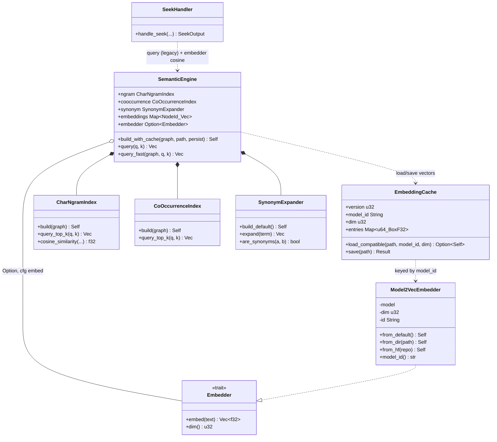
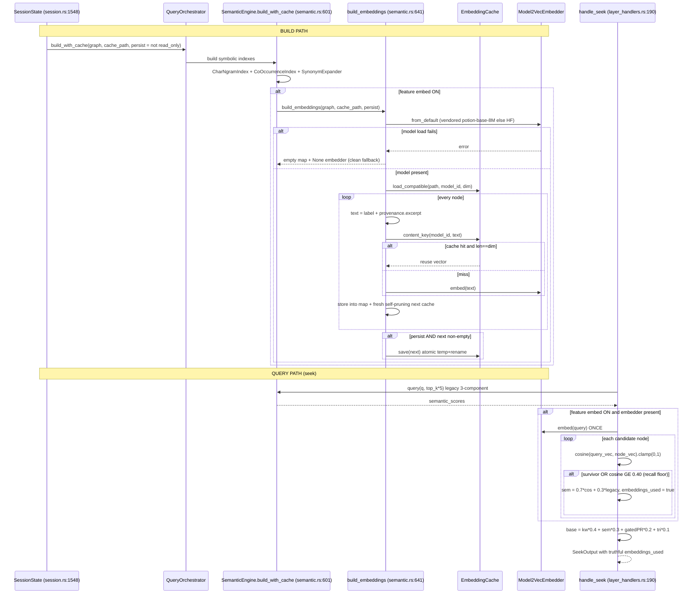
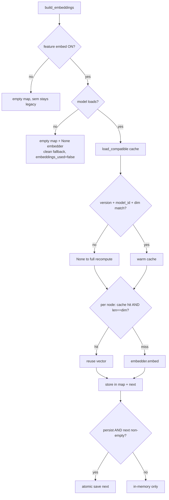

# Semantic & Embeddings

Two-tier semantic layer: a legacy always-on 3-component symbolic scorer (char-trigram TF-IDF + DeepWalk-lite co-occurrence + synonym expansion) plus an OPTIONAL default-ON static-embedding tier (model2vec/potion-base-8M) whose per-node vectors are content-addressed and cached on disk, blended into seek's `sem` slot and gated by a recall floor.

## Class

## Sequence

BUILD path (once per graph load/rebuild) then QUERY path (per seek). The embed cosine reaches ONLY seek/focus/semantic-search — activation/seed use query_fast (no cosine).

## State/Flow

Cache-validity decision inside build_embeddings (the advisory-cache promise: any mismatch to recompute, never a wrong vector).

## Invariantes

- Advisory cache, never a wrong vector: load_compatible returns None on ANY version/model_id/dim mismatch or I/O error (embed_cache.rs:57-64); build_embeddings re-checks v.len()==dim per hit (semantic.rs:686).
- Single writer per cache file: persisted only when persist==true (== !read_only), so read-only attachers load-but-never-write (session.rs:1556, semantic.rs:704). Enforced by caller, not a file lock.
- Self-pruning cache: persisted set is a fresh `next` = exactly the current graph's node texts (semantic.rs:668,695), so stale/cross-repo entries never accumulate.
- Empty cache never written: persist guarded by !next.entries.is_empty() (semantic.rs:704).
- Deterministic portable key: content_key is hand-rolled FNV-1a with a 0xff separator between model_id and text (embed_cache.rs:88-103).
- Model identity binds cache validity: Model2VecEmbedder.id folds model.safetensors byte length (path#weights_len), so an in-place weight swap invalidates the cache (embed.rs:124-130).
- All output vectors L2-normalized: embed() re-normalizes defensively so cosine == dot product; length-mismatch/empty to 0.0 (embed.rs:143-146, 167).
- Recall floor is a hard admission gate: a non-survivor is admitted only if cosine GE SEMANTIC_RECALL_FLOOR=0.40; survivors always get the blend (layer_handlers.rs:73,458).
- Zero-behavior-change when embed OFF or model absent: sem stays legacy_sem, embeddings_used stays false (layer_handlers.rs:409,443).
- embeddings_used is truthful: true ONLY when a real embedding fed a node's score (layer_handlers.rs:460).
- Co-occurrence auto-disables above 50k nodes (returns empty vectors) and is deterministic via fixed LCG seed 42 (semantic.rs:267-274,279).
- dim() is probed once at load, never hardcoded (embed.rs:89,117-118).

## Gaps

- **[high]** Every embed-gated test is model-file-gated and self-skips when the ~30MB vendored blob is absent (gitignored/Git-LFS). CI runners without the model exercise ZERO embedding code — smoke/probe/recall/ARC-E2E all no-op; the default-ON server feature can regress silently (embed.rs:194-204; layer_handlers.rs:10454-10457).
- **[medium]** The embedding cosine never reaches primary activation/seed ranking: activate_semantic and seed re-rank call query_fast (trigram+cooccurrence only). why/impact/activation get NO embedding benefit — only seek/focus/semantic-search do (activation.rs:479, seed.rs:400 vs layer_handlers.rs:444-463). Design boundary, not a bug.
- **[medium]** No test covers the warm-cache REUSE path in build_embeddings (hits/misses accounting, self-pruning next, read-only skip). semantic.rs has zero #[test]; only leaf embed_cache/embed tests exist. A regression in reuse/persist logic passes CI (semantic.rs:641-717 untested end-to-end).
- **[low]** Doc/comment drift on model identity: embed.rs:62 and Cargo.toml variously say potion-retrieval-32M / ~29MB, but DEFAULT_MODEL_SUBDIR and the vendored asset are potion-base-8M (~30MB) (embed.rs:26 vs 62).
- **[low]** query_fast normalizes only ngram/cooccurrence weights (synonym.weight dropped, semantic.rs:821); the synonym component present in `query` is silently absent. Two "semantic" scorers with different component sets; the one feeding activation/seed is weaker.
- **[low]** CoOccurrenceIndex::query_top_k is O(N) full scan per call (semantic.rs:425-435); seek calls it per top-3 ngram seed to O(3N), no inverted index (unlike the ngram side).
- **[low]** The embed side-map is recomputed every build and lives only in memory + advisory bin cache, NOT the snapshot; a cold start with a stale/absent cache re-embeds every node synchronously during build init, no async/lazy path (semantic.rs:564-567, 671-697).

## Proof gaps (from map proof_missing)

- Non-model-gated proof of the embedding path (committed tiny fixture model or injected fake Embedder) so CI without the blob still exercises the seek blend + recall floor.
- Direct unit test of build_embeddings warm-reuse (hits>0/misses==0 on unchanged nodes, miss on changed text — currently only printed).
- Test that read-only never writes the cache while read-write does (single-writer invariant is mechanically unenforced).
- Self-pruning test: seed cache with absent-node entries, rebuild, assert persisted keys == current-graph keys only.
- File-level corruption test: truncated/garbage cache ignored, build succeeds with recomputed vectors.
- Fallback-equivalence test: model-load-failure yields identical seek output to feature-off.
- rebuild_engines coherence: embed side-map vs graph generation after a swap under the RwLock.
- Scale guard for CoOccurrence O(N) near the 50k cap and clean empty-cooccurrence above the cap.
