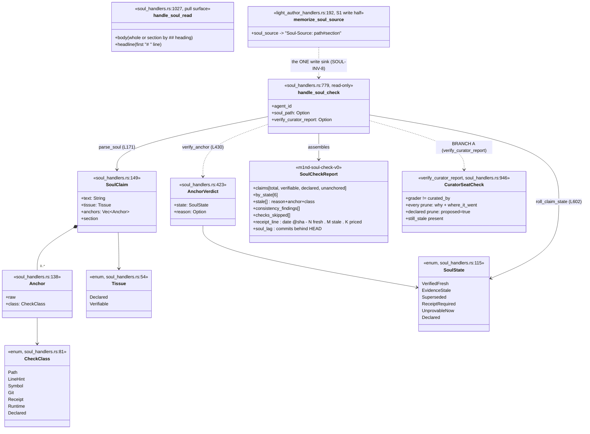
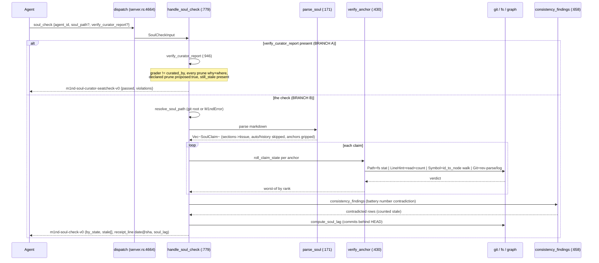
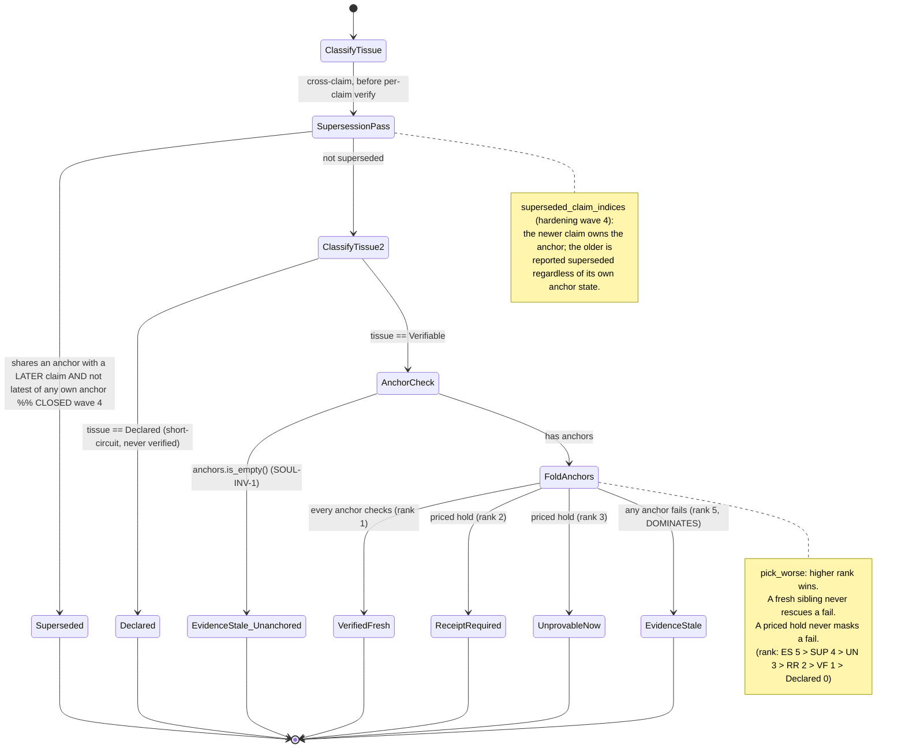
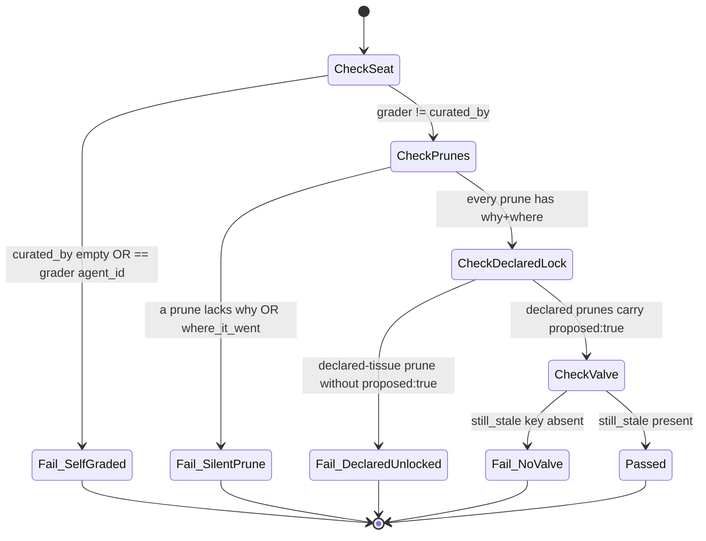

# SOUL — PATHOS as a verified type

A read-only verifier that parses the project's PATHOS handoff document into anchored
claims, classifies each by a check-class, verifies against fs/git/graph, and emits a
one-line freshness receipt plus a two-tissue honesty report — with a separate curator
seat-check that enforces grader != author on curation reports. S0 (read) fully shipped
and green; S1 write-half exists as a `memorize` field; S2 (north beat) unbuilt.

## Class

## Sequence — soul_check parse -> classify -> verify -> receipt

## State/Flow — claim state roll-up (worst-anchor-wins)

## State/Flow — curator seat-check verification states (§C8.4)

## Invariantes

- **SOUL-INV-1**: a verifiable claim with no anchor is EvidenceStale(reason='unanchored'), never a silent pass (roll_claim_state:611-614 — verified: at :602, returns EvidenceStale/"unanchored" on empty anchors).
- **SOUL-INV-3 (never fake-fresh)**: a missing anchor -> EvidenceStale; priced classes hold as ReceiptRequired/UnprovableNow and are NEVER folded into fresh/stale; every unexercised class is named in checks_skipped.
- **SOUL-INV-5**: declared tissue is never machine-verified (CheckClass::Declared has no verifier; roll_claim_state:608 short-circuits to Declared) and the curator may not remove declared tissue without proposed:true.
- **SOUL-INV-7**: claim states are COMPUTED at check time from doc+anchors+repo truth, never stored — SoulState is a local enum per call; the document grows no status field.
- **SOUL-INV-8**: one write sink — no soul-private write path; soul_source rides memorize's LightAuthorInput (light_author_handlers.rs:451).
- **Seat law (§C8.4)**: a curator report fails unless curated_by is non-empty AND != the grading agent_id (verify_curator_report:957-966 — verified: at :946).
- **Never-silent-prune (SOUL-INV-2)**: every prune must carry a non-empty why AND where_it_went.
- **still_stale honesty valve** must be PRESENT even if empty, else the report is refused.
- **Worst-anchor-wins**: a claim is fresh only if EVERY anchor checks; rank() makes a fail dominate, a priced hold rank above fresh, a fresh anchor never rescues a failing sibling (verified: rank at :641, ES=5..Declared=0).
- **The symbol is the contract, the line is a hint**: a LineHint whose file exists but is shorter than the hinted line is line_drift, not a lie.
- **Repo-relative-only path anchoring**: ~,/abs,$env,./target,target/,!negation, chained-dot extensions are refused so non-fs references don't fake-fail (looks_like_path:363-388).
- **History is excluded**: 'Prior Eras'/'Prior checkpoint' sections skipped (parse_soul:199-203).
- **The freshness receipt self-ages**: always carries date + @sha (SOUL-INV-6) so a stale receipt indicts itself.

## Gaps

- **[medium] soul_source is not discoverable**: the memorize tool's advertised JSON schema (server.rs:2381-2409) does NOT list soul_source among its properties, though LightAuthorInput deserializes it via #[serde(default)]. An agent reading the schema cannot know the key exists — the S1 write half is effectively hidden.
- **[medium] SoulState::Superseded is an unreachable state** — **CLOSED** (hardening wave 4): a pure cross-claim pass `superseded_claim_indices` now produces it. When two claims speak to the SAME anchor the later one is the current word (newest-wins, document order the age proxy) and the older is reported `superseded` — a claim is superseded iff it shares an anchor with a later claim and is not itself the latest author of any of its anchors. `soul_check` overrides that claim's state to `Superseded` (with a `superseded_claims` evidence block) before per-anchor verification. Self-supersession within one soul is now detected. RED: two claims on one anchor → the older grades Superseded, end-to-end through `parse_soul`.
- **[medium] Consistency pass is hard-coded to a single quantity keyword ('battery') and range 20..=99**: any other drifting tracked number (node/test/commit counts, version numbers) is invisible — a one-case proof, not a general engine (soul_handlers.rs TRACKED const :663; verified: consistency_findings at :658).
- **[low] Parser bypasses the universal document pipeline (S0 shortcut)**: it parses markdown directly instead of materializing a document_resolve cache entry, so the soul is NOT a routed document type — bindings/drift/cross_verify do not see it. aged_out/unverifiable reason strings appear only in a doc comment, never emitted.
- **[low] Symbol verification is O(nodes) linear + substring match**: verify_symbol iterates the ENTIRE graph.id_to_node per symbol anchor (no index) with a `.contains(head)` test that can false-positive; on the live soul the class is never exercised (checks_skipped: 'symbol').
- **[low] Two-tissue mapping is substring-based and brittle**: tissue_for_section matches DECLARED_SECTIONS substrings; a renamed/merged section silently flips tissue, and the promised per-claim override for doctrine lines that cite artifacts is NOT implemented — a citation inside a declared section is never verified.
- **[low] git verification shells out per anchor with no timeout and no batching**: N subprocess spawns; a slow/locked repo has no bound; no caching by (soul mtime, repo sha).
- **[low] The live soul grips almost no verifiable anchors**: on cp10, all 14 stale rows are 'unanchored' prose bullets, 0 priced — 'receipt theater' risk: a reader sees 13 fresh but the checkable surface is thin. %% [unverified against current PATHOS.md — probe is #[ignore]]
