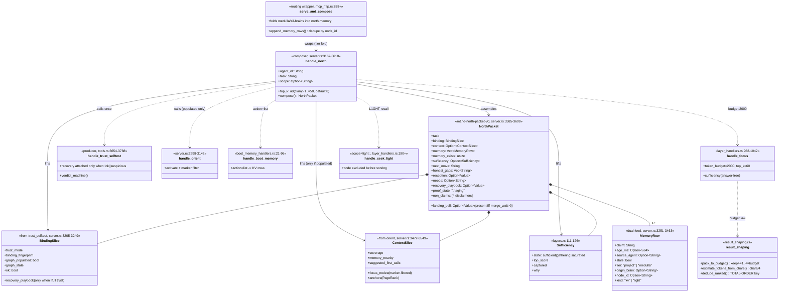
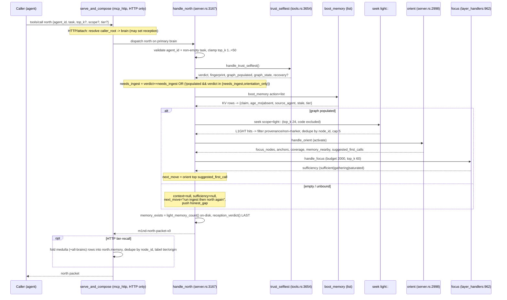
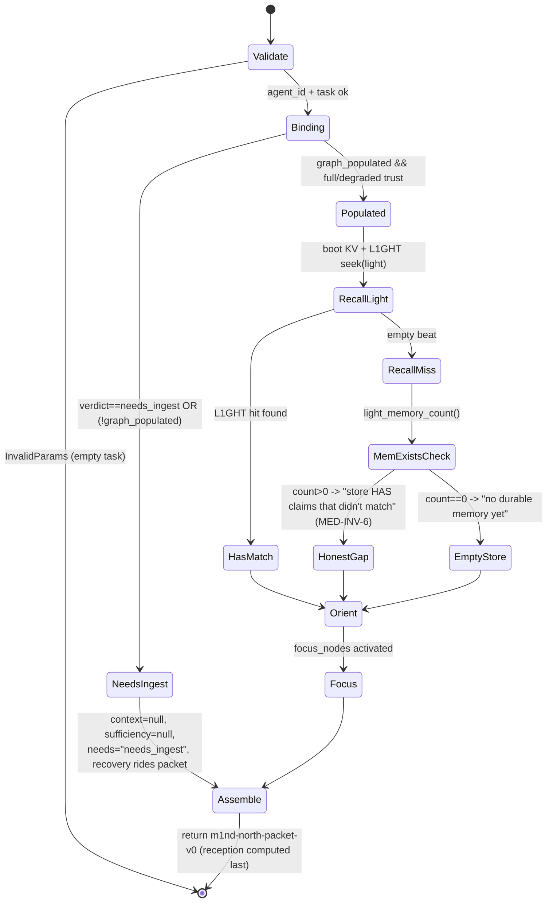

# The Spine — north packet (pre-orient)

`north(task)` is a pure read-only COMPOSER: it fans out four already-shipped handlers
(trust_selftest -> orient -> boot_memory + L1GHT recall -> focus) into ONE honest
pre-orient packet, passing every honesty signal straight through and never fabricating
context on an empty/unbound graph.

## Class

## Sequence — north compose fan-out

## State/Flow — needs_ingest decision + memory_exists honesty

## Invariantes

- **Pure composition**: handle_north performs NO graph traversal of its own — only fans out trust_selftest/orient/boot_memory/focus/seek and reshapes their honest outputs (server.rs:3147-3151). [verified: fn handle_north at 3167]
- **Never start cold, never fabricate**: on empty/unbound graph (needs_ingest||!graph_populated) context AND sufficiency are hard-null and needs="needs_ingest" with the repair — no orient/focus over an empty graph (server.rs:3472-3482).
- **Age honesty**: age_ms = now-timestamp only when the stamp is present and sane (ts>0 && ts<=now); absent otherwise, never faked to 'now' (boot KV 3290-3292; L1GHT 3385-3392).
- **memory_exists never lies (MED-INV-6)**: an empty memory[] beat over a non-empty on-disk store carries memory_exists>0 + a gap; recall-miss != empty-store (server.rs:3556-3577; session.rs:1016-1024 light_memory_count — verified at :1016).
- **Mixed-graph recall robustness**: L1GHT recall scoped to the `light::` id prefix so CODE nodes are structurally excluded BEFORE scoring (server.rs:3342-3352, 3421-3423).
- **Marker fragments never occupy a slot**: is_marker_fragment (::tag:: id segment OR leading glyph) excludes annotation nodes from memory rows AND orient focus/anchors (server.rs:2739-2744, 3368-3371, 3057-3061).
- **Repair travels with the diagnosis**: recovery_playbook rides the packet whenever binding is not full trust (server.rs:3244-3249; trust_selftest attaches only when !ok||suspicious tools.rs:3714-3732).
- **Read-only safe**: north is NOT in read_only_denied; every composed handler routes through read-only-safe query paths (server.rs:3164-3166).
- **Landing bell is a vital sign, never a gate**: north counts the missions whose CURRENT head letter is `merge_wait` (mission_letter::heads_by_mission over the bound brain's mailbox box — the same box the tray and mission_post speak, resolved by mission_letter_handlers::mission_box_path). Only when N>0 it pushes ONE honest_gaps line ("N mission(s) in merge_wait await the human landing — the tray is the door") and a structured `landing_bell:{merge_wait:N}` (absent, not null, when N==0 — no empty ornament). A head that later `landed`/`failed` moved off merge_wait and is never counted; historical letters never ring. The box read FAILS OPEN — an absent/unreadable box rings nothing and never takes the packet down (server.rs handle_north, right after the skeleton-coherence signal). Mirrors the skeleton_coherence mould.
- **Budget law**: pack_to_budget always keeps >=1 item even on zero/overflow budget, boundary <=budget inclusive; dedupe_ranked's comparator is a TOTAL order (single scalar key, panic-fix) (result_shaping.rs:80-106, 15-65 — verified: dedupe_ranked at :15, pack_to_budget at :80).
- **top_k clamped 1..=50, default 8**; task non-empty or InvalidParams (server.rs:3188-3199).
- **Sufficiency is answer-free**: reports sufficient|gathering|saturated from a knee test on relevance strength + what was cut, never inspecting answer content (layers.rs:100-126).

## Gaps

- **[medium] Freshest-first fallback puts undated legacy claims FIRST**: the broad L1GHT fallback does `hits.sort_by_key(|r| r.authored_ms_ago)` where `Option<u64>` sorts None < Some, so legacy memories with no Created stamp crowd out fresher stamped claims — contradicts the "surfaced most-recent" intent (server.rs:3442-3444).
- **[medium] Medulla fold is HTTP/attach-only**: the cross-store medulla/all-brains fold into north.memory happens ONLY on serve_and_compose; a plain stdio server dispatches north directly (server.rs:4095) with no sibling compose, so a stdio caller's north.memory silently lacks the medulla doctrine feed (mcp_http.rs:838-855 vs server.rs:4095). The memory-is-pull medulla law is only realized on the HTTP path.
- **[low] No aggregate packet budget**: north declares token_budget=2000 to focus and caps L1GHT at 5, but the OUTER north packet has no budget_block; composed memory+context+anchors+gaps can sum arbitrarily large (server.rs:3585-3609; budget_block never called for north).
- **[low] Two overlapping retrieval passes**: sufficiency is a SECOND focus call re-running seek over the whole graph (top_k=60), separate from orient's activate — cost scales with graph size and the two rankings can disagree (server.rs:3486-3493 vs 3518-3529).
- **[low] Uncached per-call disk walk**: memory_exists/light_memory_count does a synchronous read_dir of the agent-memory dir on every north call — O(files) in the hot pre-orient path (session.rs:1016-1024, called at server.rs:3560).
- **[low] honest_gaps are unstructured strings**: the 'not full trust' and 'no focus nodes' gaps are additive English with no machine-readable code, unlike reception/needs (server.rs:3504-3507, 3551-3555).
