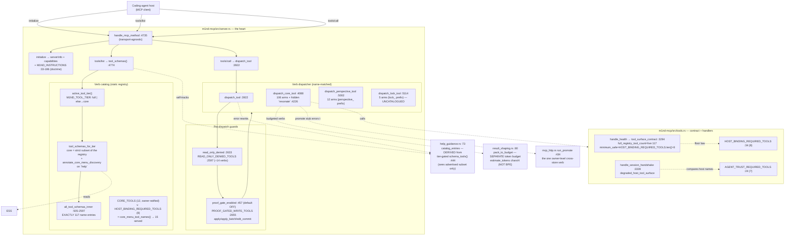
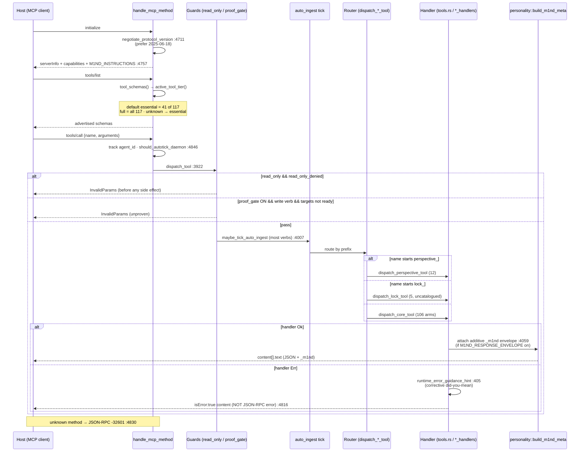
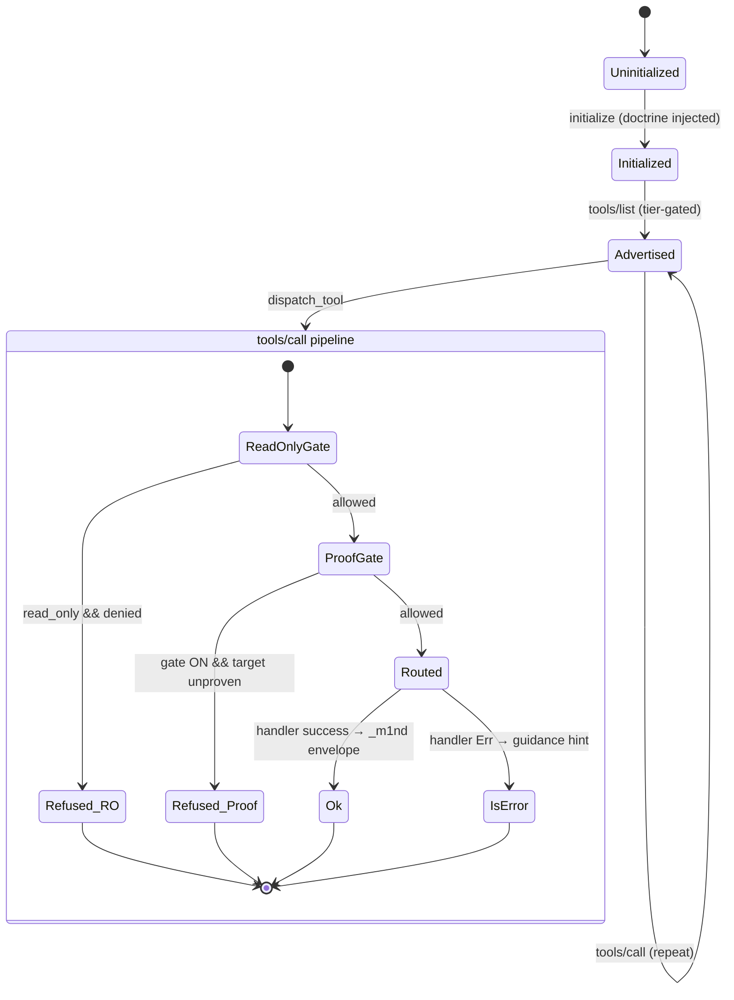

# m1nd-mcp-tool-surface-verb-budget

The MCP server's outward face: a static 117-verb catalog advertised through a two-tier verb-budget gate (41 essential vs 117 full), dispatched by a name-matched router to per-verb handlers, wrapped by injected `M1ND_INSTRUCTIONS` doctrine, a host-binding tool-surface contract, and read-only / proof-gate write guards.

## Class/Component



## Sequence



## State/Flow



## Invariantes
- Catalog size == 117: `all_tool_schemas_inner()` has exactly 117 top-level `"name"` entries (server.rs:505-2597; verified in-session: grep of 8-space-indent names = 117; the 2 extra `"name"` hits are nested inside inputSchemas).
- Tier gate trims **advertisement only**, never handler existence: hidden verbs stay registered and callable (tests `all_tool_schemas_always_contains_all_tools_regardless_of_tier` :7352, `tier_gate_full_advertises_all_tools` :7270). Essential is a strict subset.
- Unrecognized `M1ND_TOOL_TIER` → the CORE menu, never full: `active_tool_tier()` matches only `"full"`, so a typo in an operator env fails closed on the SMALL surface (test `tier_gate_unrecognized_value_falls_back_to_core`).
- The served menu == `core_menu_tool_names()` == `CORE_TOOLS` ∪ `HOST_BINDING_REQUIRED_TOOLS` — DERIVED, never a second hand-typed list, so it cannot drift from the host-binding contract it has to satisfy (tests `core_menu_serves_exactly_the_ratified_core_plus_the_binding_floor`, `tier_gate_default_advertises_only_the_core_menu`). The historical `"essential"` token still resolves here.
- Menu size ≤ `CORE_MENU_MAX` (20; 15 served today) — the mechanical form of the owner's "the menu must fit on one screen". The bound itself is guarded at COMPILE time (`const _: () = assert!(CORE_MENU_MAX < 30)`).
- Every `CORE_TOOLS` name exists in the registry — a typo would silently shrink the menu (test `core_menu_stays_within_its_stated_bound`).
- The core menu carries its own map: `annotate_core_menu_discovery` appends the `[CORE MENU]` line to the `help` description with a COMPUTED hidden count, so verb #143 keeps the sentence true (test `core_menu_carries_the_line_that_leads_to_the_rest`).
- `full_registry_tool_count` in health is COMPUTED live from the schema array (tools.rs:3269) — self-corrects to 117 despite nearby "102" doc comments.
- `minimum_safe_tool_count` is the REQUIRED-verb floor (`HOST_BINDING_REQUIRED_TOOLS.len()` = 8), NOT total registry — deliberately so tiering never falsely reads as degraded.
- `degraded_host_tool_surface` fires iff any `AGENT_TRUST_REQUIRED_TOOL` (7) is missing from host-reported `available_tools`; a count-only handshake never invents missing tools (test :6291).
- read-only attach refuses every listed mutating verb BEFORE any side-effecting tick (read_only gate is first in dispatch_tool :3932); `delegate` is intentionally ABSENT from the denylist (it is read-only, ambient-legal).
- proof gate (when ON) treats an empty/unresolvable target set as unproven → refuses (:3957).
- tools/call handler errors surface as `isError` content, not JSON-RPC errors (MCP spec, :4816).
- `resonate` is a handler-only back-compat verb: dispatchable (:4226) but ABSENT from every advertised tier (test `resonate_schema_absent_from_all_tiers_after_surface_removal` :7391).

## Gaps
- **[medium] No parity/drift-guard test** between advertised catalog (122), the dispatch table, and `ESSENTIAL_TOOLS`. A verb can be added to one and forgotten in another with green CI. Live drift PRESENT: 5 `lock_` verbs dispatchable (server.rs:5114-5162) but NOT in the 122-catalog; `resonate` dispatchable-but-uncatalogued (by design).
- **[medium] `lock_` verbs are invisible verbs**: callable via tools/call but never advertised in ANY tier (not even `full`). `schema_tools()` now reads `all_tool_schemas()`, so `help` covers every REGISTERED verb — but the `lock_` family is not in the registry at all, so it remains unreachable by `help`/`find_similar_tool_names`. Fixing it means registering the schemas, not widening help.
- **[low] `help` + fuzzy suggestion saw only the advertised tier** — **CLOSED 2026-08-01**: `schema_tools()` reads `all_tool_schemas()`, so `help` and the did-you-mean matcher catalog the FULL registry at every tier (test `help_sees_every_verb_regardless_of_tier`). The gap was low severity while the default menu was 48; shrinking it to a core of 15 made `help` the door and promoted this to load-bearing.
- **[low] Stale count literals** — **CLOSED**: docstrings now state the registry-derived counts (122 full / 42 essential — the F0a slice-2 landing added the four system-blocks verbs).
  Original finding: in doctrine-adjacent comments: "all 102 tools" (server.rs:423,465,504 — confirmed in code read), "expose all 102 tools" (tools.rs:3301), "curated ~25 tools" for the 41-entry const (server.rs:367). Live values are correct; only the human-readable comments mislead.
- **[low] `session_handshake` degraded verdict trusts the caller**: the server cannot independently see which subset the host injected (non_claim, tools.rs:3323-3326). A host that omits verbs but passes no `available_tools` yields a false "ok".
- **[low] Naming hazard — two "budgets"**: the verb budget (tier gate) and the result token budget (result_shaping) are orthogonal; the token estimate is chars/4, explicitly NOT real BPE (result_shaping.rs:114), so packed budgets can drift.
```
