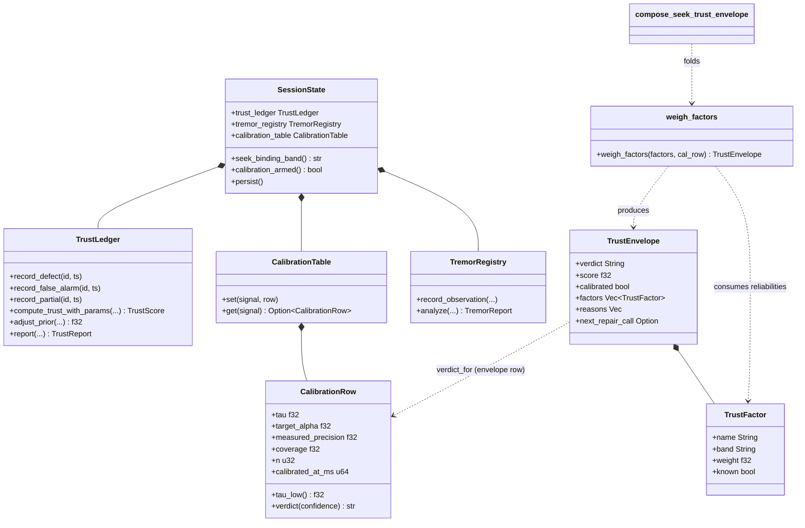
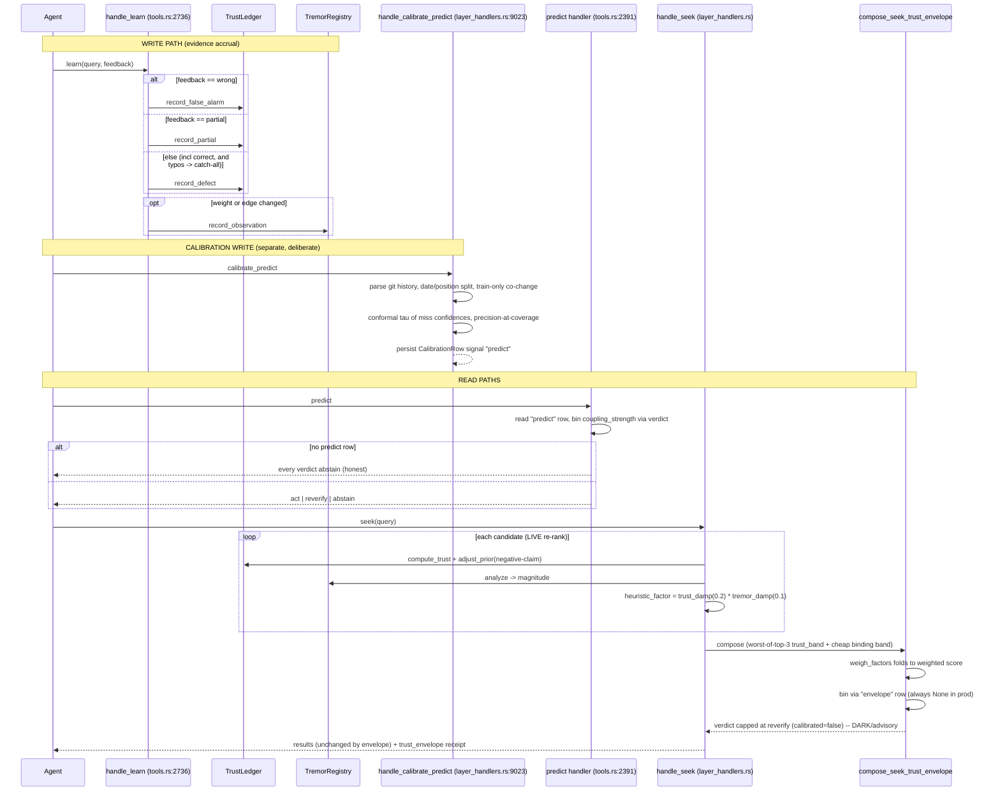
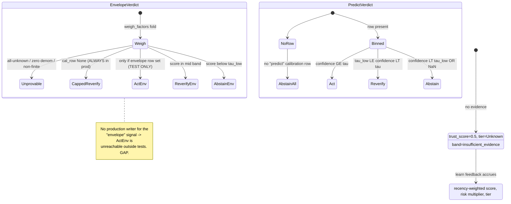

# Trust & Calibration

A defect-history actuarial ledger + tremor detector feed a live multiplicative re-rank of seek results, plus a split-conformal calibration table gating `predict` (act|reverify|abstain) and an advisory DARK trust envelope on seek (act|reverify|abstain|unprovable). The envelope's own calibration signal has NO production writer, so in real operation it is structurally capped at reverify.

## Class

## Sequence

WRITE path (learn is the sole production writer) then READ paths (predict verdict binning + seek live re-rank + DARK envelope). The `envelope` calibration row is never set in production, so envelope_cal is always None.

## State/Flow

The trust ladder / verdict binning. Two ladders coexist: predict (3-state) and the seek envelope (4-state, with the `act` rung structurally unreachable in production).

## Invariantes

- Cold start with no evidence to trust_score=0.5, tier=Unknown, risk_multiplier=1.0, band=insufficient_evidence (never a bare 0.5 quoted as confidence) (trust.rs:266-287, l78-85).
- trust_score clamped GE 0.05 (never 0); risk_multiplier capped at RISK_MULTIPLIER_CAP=3.0 (trust.rs:304-307).
- Recency decay: old defects decay toward RECENCY_FLOOR=0.3 (never to zero) — an old bug still contributes 30% (trust.rs:301).
- adjust_prior clamps to [0.0, PRIOR_CAP=0.95]: positive claims scaled by trust, negative claims by risk_multiplier (trust.rs:499-518).
- Conformal: empty/under-data miss set to tau=1.0 (nothing clears it to abstain-by-default), the honest maximally-conservative case (calibration.rs:124-147).
- Verdict binning: confidence GE tau to act, [tau_low, tau) to reverify, LT tau_low to abstain; NaN/non-finite to abstain (never fake-high act) (calibration.rs:100-111).
- No calibration row to verdict capped at reverify, act UNREACHABLE, calibrated=false (envelope) / every verdict abstain (predict) (trust_envelope.rs:170-176, tools.rs:2400-2402).
- Anti-AND: a single red factor does NOT force abstain when the weighted majority is clean (weighted fold, not any-red conjunction) (trust_envelope.rs weigh_factors).
- known:false factors drop from BOTH numerator and denominator; all-unknown / zero denominator / non-finite score to unprovable, score=0.0 (never a fake number) (trust_envelope.rs:120-164).
- Non-finite / negative / zero-weight factors are skipped rather than poisoning the fold into NaN (trust_envelope.rs:126-131).
- Persistence atomic (temp+rename) and versioned; corrupt entries silently dropped on load; missing file to empty store (trust.rs:554-613, calibration.rs:207-259, tremor.rs:436-500).
- Tremor magnitude capped at MAGNITUDE_CAP=100.0; nodes below MIN_OBSERVATIONS_FOR_ACCELERATION=3 (after gap-dedup) skipped; ring buffer bounded at 256 (tremor.rs:286-335).
- Tremor registry keyed by stable external_id so it survives ingest mode=replace (tremor.rs:157-162).

## Gaps

- **[high]** The `envelope` calibration signal has NO production writer — no calibrate_envelope harness. CALIBRATION_SIGNAL_ENVELOPE is only .set() inside test helper seed_envelope_calibration; production only .get()s it. So compose_seek_trust_envelope always receives cal_row=None, the verdict is capped at reverify, and act is UNREACHABLE outside tests (layer_handlers.rs:10842-10844 test-only; reads at :244/:918; trust_envelope.rs:170-176).
- **[medium]** The trust envelope is DARK/advisory — attached to SeekOutput but does not gate or alter results; an agent must voluntarily honor it (protocol/layers.rs:147-148; layer_handlers.rs:904).
- **[medium]** Evidence supply is entirely manual: the only production writer of ledger + tremor is handle_learn; the daemon does not autonomously record defects/tremor. With no learn traffic every node stays cold-start, so trust/tremor contribute ~nothing to re-rank (all other record_* sites are #[cfg(test)]).
- **[medium]** Scale mismatch: the envelope's reliability-weighted score in [0,1] is binned against a tau conceptually derived from predict/co-change miss-confidences; the two confidence scales are not obviously commensurable, and no envelope-specific harness ever measures the right tau (trust_envelope.rs:166-176 vs only calibrate_predict at layer_handlers.rs:9023).
- **[low]** Stale doc comment: tremor.rs:180 says record_observation is called from handle_learn AND handle_activate, but handle_activate does not call it (tools.rs:918+).
- **[low]** seek_binding_band can only return needs_ingest or full_trust, so the degraded/stale_binding bands (reliability 0.15) that binding_reliability supports are never exercised on the seek path — a genuinely degraded host is invisible to the seek envelope (session.rs:706-716).
- **[low]** handle_learn maps ALL non-{wrong,partial} feedback to record_defect via a catch-all `_` arm, so a typo ("correkt","ok") is silently recorded as a confirmed DEFECT, lowering trust (tools.rs:2959-2961).

## Proof gaps (from map proof_missing)

- No test exercises a PRODUCTION envelope path reaching verdict=act (the only act test manually seeds the row via seed_envelope_calibration).
- No test covers handle_learn's catch-all feedback arm (typo silently recorded as defect).
- No end-to-end learn to seek test asserting accrued defects/tremor actually change seek result ORDER.
- No test that the seek envelope observes a DEGRADED binding on the seek path specifically.
- No calibration-drift/recalibration test (calibrated_at_ms stored, staleness never asserted).
- No proof the envelope's reliability-scaled score is commensurable with a predict-derived tau.
- No concurrency/property test on ledger/registry under interleaved learn writes + seek reads.

## MCP verbs

learn (write path) - trust - tremor - predict (calibrated verdict; abstain-all uncalibrated) - calibrate_predict (measure tau + precision) - seek (live re-rank + DARK envelope) - trust_selftest (binding self-check).
