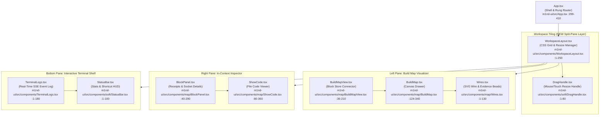
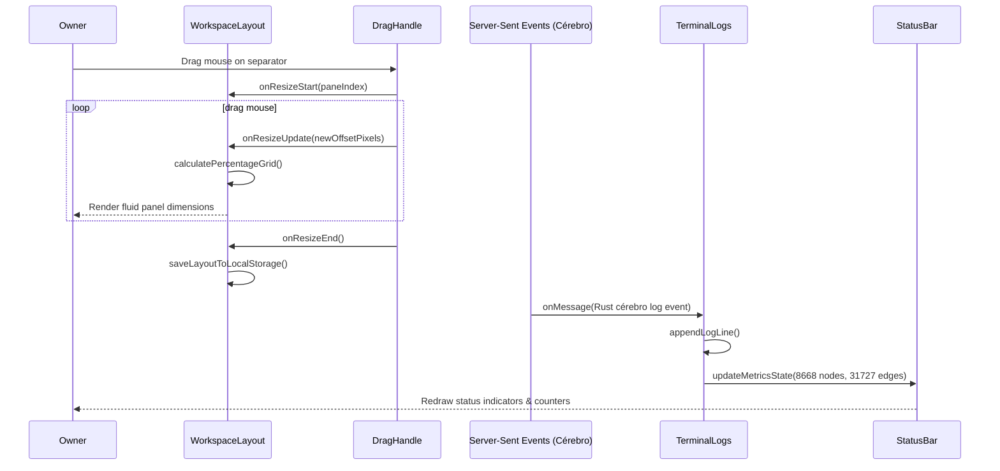
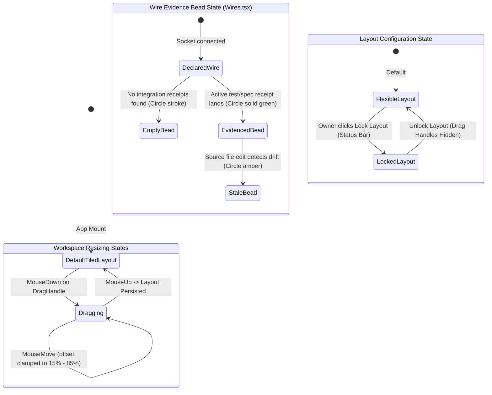

# Visual OS Workspace — Tiled Layout and Split Panes (UML atlas)

This sheet details the structural layout, component tree, sequence of operations, state transitions, and invariants of the upgraded **m1nd-ui** Visual OS workspace layout (F3-SplitPane). 

The layout transitions from a drawer/modal-overlay model to a grid-pane environment. It introduces resizable split panes, a bottom terminal for event logs, an interactive status bar, and real-time wire evidence beads.

---

## 1. Component Architecture & Code Anchors

The following diagram maps the front-end layout components to their files and lines in the codebase:

---

## 2. Sequence Diagram: Drag Resize & Event Propagation

The sequence below illustrates how pane resize operations are processed locally, and how real-time server events propagate to the terminal log panel:

---

## 3. State & Flow Diagram: Layout Locking & Wire Evidence Beads

The system handles panel visibility, layout locks, and wire evidence beads dynamically:

---

## 4. Architectural Invariants

Every workspace layout implementation must enforce the following rules:

1.  **Registry-Only Icons**: Icons used within drag handles, status bar, and panels must be imported solely from [registry.tsx](file:///Users/kle1nz/m1nd/m1nd-ui/src/lib/icons/registry.tsx). Any direct import of `lucide-react` is blocked by `icon-lint.mjs`.
2.  **Violet Quarantine**: Colors within the `iris` (violet) namespace are strictly prohibited in the layout panels. Violet is reserved solely for abstenção/unknown states (like unmapped residue or untested blocks), validated by `violet-lint.mjs`.
3.  **Hairline Borders**: Pane borders and separators must use the `hairline` token (`border-hairline`, `#D8D1C6` in porcelain theme) with a width of exactly `1px`.
4.  **Layout Non-Erosion**: Resizing pane ratios must never override the structural integrity of the Build Map canvas. The map must use responsive resize observers to center block structures automatically upon panel adjustments.
5.  **No-Leak Cleanliness**: Layout configurations stored in `localStorage` or reported in debugging logs must never contain personal directory paths (e.g. `/Users/kleinz/`). All paths must be relative to the workspace root.

---

## 5. Known Gaps

1.  **[High] Canvas Interaction Lag on Resize**: During pane resizing, continuous rerendering of SVG wires in `Wires.tsx` can cause visual stutter on low-tier screens. A debounce or CSS-driven scale overlay may be required during dragging.
2.  **[Medium] Overlay Dialog Precedence**: Modals like `ReviewRatify` must still float over the split panes to prevent split-panel focus confusion, but their boundaries must map to a central layout overlay registry to avoid visual collisions.
