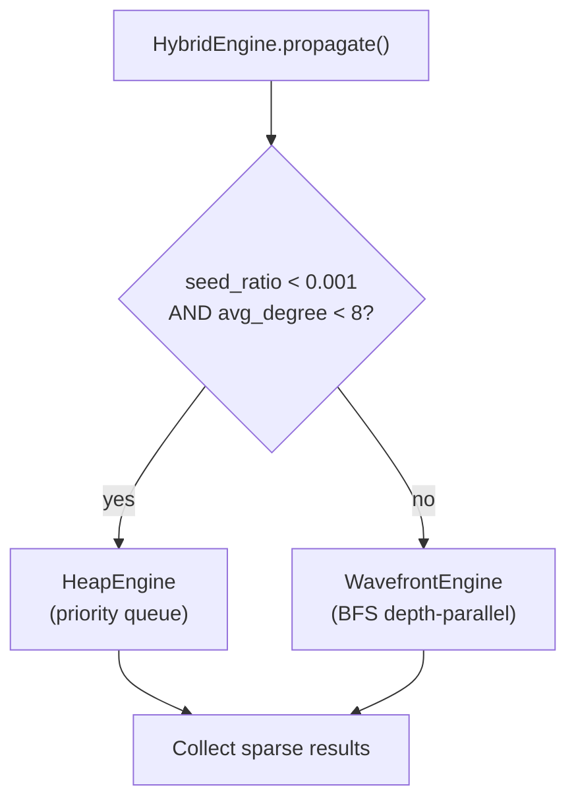
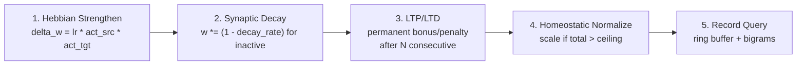

# Graph Engine (m1nd-core)

m1nd-core is the computational core of the graph runtime. It owns the graph data structure, the activation and analysis engines, the plasticity system, and the type-safe numeric primitives that prevent NaN/Inf corruption system-wide.

Source: `m1nd-core/src/`

## Type System

### Numeric Primitives

Every floating-point value in m1nd flows through one of four newtype wrappers defined in `types.rs`:

| Type | Invariant | Use |
|------|-----------|-----|
| `FiniteF32` | Never NaN or Inf | All activation scores, edge weights, scores |
| `PosF32` | Strictly positive, finite | Wavelength, frequency, half-life, decay rate, threshold |
| `LearningRate` | (0.0, 1.0] | Plasticity learning rate |
| `DecayFactor` | (0.0, 1.0] | Signal decay per hop |

`FiniteF32` is the foundation. In debug builds, constructing one from a non-finite value panics. In release builds, it clamps to 0.0. Because NaN is excluded by construction, `FiniteF32` implements `Ord`, `Eq`, and `Hash` -- all unsound on raw `f32`:

```rust
impl Ord for FiniteF32 {
    fn cmp(&self, other: &Self) -> std::cmp::Ordering {
        self.0.total_cmp(&other.0)
    }
}
```

### Index Types

Thin `#[repr(transparent)]` wrappers over `u32` provide type-safe indexing:

| Type | Wraps | Purpose |
|------|-------|---------|
| `NodeId(u32)` | Node index | Index into `NodeStorage` parallel arrays |
| `EdgeIdx(u32)` | Edge index | Index into CSR parallel arrays |
| `InternedStr(u32)` | String handle | Opaque index into `StringInterner` |
| `CommunityId(u32)` | Community | Louvain community membership |
| `Generation(u64)` | Mutation counter | Plasticity engine desync detection |

### Node and Edge Classification

```rust
#[repr(u8)]
pub enum NodeType {
    File = 0, Directory = 1, Function = 2, Class = 3,
    Struct = 4, Enum = 5, Type = 6, Module = 7,
    Reference = 8, Concept = 9, Material = 10, Process = 11,
    Product = 12, Supplier = 13, Regulatory = 14, System = 15,
    Cost = 16, Custom(u8),
}

#[repr(u8)]
pub enum EdgeDirection {
    Forward = 0,
    Bidirectional = 1,
}
```

Variants 0-8 are code-domain types. Variants 9-16 support non-code domains (supply chain, manufacturing). `Custom(u8)` is the extension point for future domains.

### Dimension System

Activation operates across four dimensions with fixed weights:

```rust
pub enum Dimension {
    Structural = 0,  // Graph topology (BFS/heap propagation)
    Semantic = 1,    // Text similarity (trigram TF-IDF + co-occurrence)
    Temporal = 2,    // Time-based (decay + velocity)
    Causal = 3,      // Causal chains (forward/backward with discount)
}

pub const DIMENSION_WEIGHTS: [f32; 4] = [0.35, 0.25, 0.15, 0.25];
```

When fewer than 4 dimensions contribute to a result, weights are adaptively redistributed. Results that fire across multiple dimensions receive a resonance bonus: 1.5x for all 4, 1.3x for 3.

## Property Graph Model

### String Interner

All strings pass through `StringInterner` before entering the graph. The interner maps strings to `InternedStr(u32)` handles via a `HashMap<String, InternedStr>` and resolves handles back via a `Vec<String>` indexed by the u32 value.

Once interned, all string comparisons become integer comparisons -- zero-allocation, single CPU cycle.

```rust
pub struct StringInterner {
    strings: Vec<String>,
    index: HashMap<String, InternedStr>,
}
```

### CSR Graph

The graph uses Compressed Sparse Row (CSR) format with both forward and reverse adjacency. For node `i`, outgoing edges span `offsets[i]..offsets[i+1]` into parallel arrays for targets, weights, inhibitory flags, relations, directions, and causal strengths.

```rust
pub struct CsrGraph {
    // Forward CSR
    pub offsets: Vec<u64>,              // num_nodes + 1
    pub targets: Vec<NodeId>,           // total_edges
    pub weights: Vec<AtomicU32>,        // bit-reinterpreted f32 for lock-free CAS
    pub inhibitory: Vec<bool>,          // edge polarity
    pub relations: Vec<InternedStr>,    // edge type (interned)
    pub directions: Vec<EdgeDirection>, // forward or bidirectional
    pub causal_strengths: Vec<FiniteF32>,

    // Reverse CSR (built at finalize)
    pub rev_offsets: Vec<u64>,
    pub rev_sources: Vec<NodeId>,
    pub rev_edge_idx: Vec<EdgeIdx>,     // maps back to forward arrays

    // Pre-finalize staging
    pub pending_edges: Vec<PendingEdge>,
}
```

The CSR is immutable after finalization. Edges are added to `pending_edges` during graph building, then sorted by source and compacted into the CSR arrays by `Graph.finalize()`. Bidirectional edges are expanded into two forward entries during finalization.

### Atomic Weight Updates

Edge weights are stored as `AtomicU32` rather than `f32`. The plasticity engine updates weights concurrently with read queries using Compare-And-Swap:

```rust
pub fn atomic_max_weight(
    &self, edge: EdgeIdx, new_val: FiniteF32, max_retries: u32,
) -> M1ndResult<()> {
    let slot = &self.weights[edge.as_usize()];
    let new_bits = new_val.get().to_bits();
    for _ in 0..max_retries {
        let old_bits = slot.load(Ordering::Relaxed);
        let old_val = f32::from_bits(old_bits);
        if old_val >= new_val.get() { return Ok(()); }
        if slot.compare_exchange_weak(
            old_bits, new_bits, Ordering::Release, Ordering::Relaxed
        ).is_ok() { return Ok(()); }
    }
    Err(M1ndError::CasRetryExhausted { edge, limit: max_retries })
}
```

Two CAS operations are provided: `atomic_max_weight` (only increases, for activation scatter-max) and `atomic_write_weight` (unconditional, for plasticity). Both retry up to 64 times (constant `CAS_RETRY_LIMIT`).

### Node Storage (SoA)

All per-node data lives in `NodeStorage`, organized as Struct-of-Arrays with explicit cache-path separation:

```rust
pub struct NodeStorage {
    pub count: u32,

    // Hot path: activation engine reads every query
    pub activation: Vec<[FiniteF32; 4]>,  // [structural, semantic, temporal, causal]
    pub pagerank: Vec<FiniteF32>,

    // Warm path: plasticity reads per query
    pub plasticity: Vec<PlasticityNode>,

    // Cold path: seed finding, display, export
    pub label: Vec<InternedStr>,
    pub node_type: Vec<NodeType>,
    pub tags: Vec<SmallVec<[InternedStr; 6]>>,
    pub last_modified: Vec<f64>,
    pub change_frequency: Vec<FiniteF32>,
    pub provenance: Vec<NodeProvenance>,
}
```

The `SmallVec<[InternedStr; 6]>` for tags avoids heap allocation for nodes with 6 or fewer tags (the common case), while still supporting arbitrary tag counts.

### Node Provenance

Each node carries source metadata for tracing back to the original code:

```rust
pub struct NodeProvenance {
    pub source_path: Option<InternedStr>,
    pub line_start: u32,
    pub line_end: u32,
    pub excerpt: Option<InternedStr>,
    pub namespace: Option<InternedStr>,
    pub canonical: bool,
}
```

### Generation Counter

`Generation(u64)` tracks graph mutations. The plasticity engine stores the generation at initialization. Every plasticity operation asserts that the current graph generation matches; a mismatch (from concurrent ingestion) causes a controlled rebuild rather than operating on stale state.

## Activation Propagation

### Engine Selection (HybridEngine)

The `HybridEngine` auto-selects between two propagation strategies based on graph characteristics:



- **HeapEngine**: Max-heap priority queue. Processes strongest signal first. Early-terminates when the heap top drops below threshold. Uses a double-hashing `BloomFilter` for O(1) amortized visited checks. Best for sparse queries with few seeds in low-degree graphs.
- **WavefrontEngine**: BFS depth-parallel. All active nodes at current depth fire simultaneously. Signal accumulated via scatter-max into next depth's buffer. Best for dense queries or high-degree graphs.

### Structural Propagation (D1)

The wavefront engine is the reference implementation. Signal propagates depth by depth:

1. Seed nodes initialized with their scores (capped at `saturation_cap`).
2. For each depth (up to `max_depth=5`, hard cap 20):
   - Each frontier node `src` with activation above `threshold=0.04` fires.
   - For each outgoing edge: `signal = src_activation * weight * decay(0.55)`.
   - Inhibitory edges: `signal = -signal * inhibitory_factor(0.5)`, subtracted from target (floored at 0).
   - Excitatory edges: scatter-max into target (keep strongest arrival).
3. Collect all nodes with non-zero activation, sorted descending.

### Semantic Dimension (D2)

Two indexes power semantic matching:

**CharNgramIndex**: FNV-1a 24-bit trigram hashing over node labels with TF-IDF weighting. An inverted index maps trigram hashes to node lists, enabling O(K) query time (K = number of matching trigrams) instead of O(N) full scan.

**CoOccurrenceIndex**: DeepWalk-lite random walks (20 walks/node, length 10, window 4) generate co-occurrence counts, normalized to Positive Pointwise Mutual Information (PPMI). Sorted vectors enable O(D) merge-intersection for similarity queries. Disabled above 50K nodes to bound walk cost.

The semantic engine also includes a `SynonymExpander` with 15 default groups covering code terminology and Portuguese domain terms.

Query pipeline: Phase 1 ngram candidates (3x top_k) -> Phase 2 multi-seed co-occurrence re-rank.

### Temporal Dimension (D3)

Three scorers combine:

- **TemporalDecayScorer**: Per-NodeType half-lives (File=7 days, Function=14 days, Module/Directory=30 days). Formula: `exp(-ln(2) * age_hours / half_life)`. Dormant nodes (>35 days) get a resurrection bonus with an additive floor.
- **VelocityScorer**: Z-score based change velocity. Nodes changing faster than average receive higher scores.
- **CoChangeMatrix**: Sparse matrix (budget: 500K entries, 100 per row) bootstrapped from BFS depth 3, refined with git co-change observations.

### Causal Dimension (D4)

`CausalChainDetector`: Budget-limited priority-queue DFS along `causal_strength` edges. Forward propagation follows contains/imports/calls edges; backward propagation reverses direction. Discount factor 0.7 per hop. Chain depth capped at 6 by default.

### Dimension Merging

`merge_dimensions()` combines all four dimension results:

1. For each activated node, compute weighted sum: `score = sum(dim_score * DIMENSION_WEIGHTS[dim])`.
2. If a dimension produced no results, redistribute its weight proportionally to active dimensions.
3. Apply resonance bonus: 1.5x if all 4 dimensions contributed, 1.3x if 3 contributed.
4. Sort by final score, truncate to top_k.

### Seed Finding

`SeedFinder` resolves query strings to graph nodes via a 5-level matching cascade:

1. **Exact label match** (highest priority)
2. **Prefix match** (e.g., "chat_" matches "chat_handler")
3. **Substring match** (e.g., "handler" matches "chat_handler")
4. **Tag match** (e.g., "#api" tag)
5. **Fuzzy trigram** (cosine similarity of trigram vectors, lowest priority)

A semantic re-ranking phase (0.6 basic score / 0.4 semantic blend) refines results when multiple candidates match.

## Weight Systems

### Hebbian Plasticity

The `PlasticityEngine` implements biological Hebbian learning with 5 phases executed after every activation query:



**Constants** (from `plasticity.rs`):

| Parameter | Value | Purpose |
|-----------|-------|---------|
| `DEFAULT_LEARNING_RATE` | 0.08 | Hebbian weight change rate |
| `DEFAULT_DECAY_RATE` | 0.005 | Inactive synapse decay per query |
| `LTP_THRESHOLD` | 5 | Consecutive strengthens before permanent bonus |
| `LTD_THRESHOLD` | 5 | Consecutive weakens before permanent penalty |
| `LTP_BONUS` | 0.15 | Permanent weight increase |
| `LTD_PENALTY` | 0.15 | Permanent weight decrease |
| `HOMEOSTATIC_CEILING` | 5.0 | Max sum of incoming weights per node |
| `WEIGHT_FLOOR` | 0.05 | Minimum edge weight (prevents extinction) |
| `WEIGHT_CAP` | 3.0 | Maximum edge weight |

**Hebbian update**: For each edge where both source and target were activated: `delta_w = learning_rate * activation_source * activation_target`. Applied via atomic CAS (`atomic_write_weight`).

**Homeostatic normalization**: If the sum of incoming weights for any node exceeds `HOMEOSTATIC_CEILING`, all incoming weights are scaled proportionally to bring the total back under the ceiling. This prevents runaway positive feedback.

**Query Memory**: A ring buffer of 1000 entries tracks recent queries. Each record stores the query text, seed nodes, activated nodes, and timestamp. The memory tracks:
- Node frequency: how often each node appears across recent queries.
- Seed bigrams: co-occurring seed pairs, used for priming signals.

When the buffer wraps, evicted records have their frequency and bigram counts decremented -- maintaining accurate sliding-window statistics.

**Persistence**: Plasticity state (per-edge `SynapticState`) is exported as JSON using triple-based identity matching (source_label, target_label, relation). This allows plasticity to survive graph rebuilds as long as the semantic structure remains similar.

### XLR Differential Processing

XLR (eXcitatory-Lateral-inhibitory Response) is a spectral noise cancellation system that separates signal from noise in activation results.

**Constants**:

| Parameter | Value | Purpose |
|-----------|-------|---------|
| `F_HOT` | 1.0 | Hot signal frequency |
| `F_COLD` | 3.7 | Cold signal frequency |
| `SPECTRAL_BANDWIDTH` | 0.8 | Gaussian kernel bandwidth |
| `IMMUNITY_HOPS` | 2 | BFS immunity radius |
| `SIGMOID_STEEPNESS` | 6.0 | Gating function steepness |

**6-step pipeline**:

1. **Anti-seed selection**: Pick nodes dissimilar to seeds (Jaccard similarity < 0.2, degree ratio filter).
2. **Immunity computation**: BFS 2 hops from seeds. Immune nodes cannot be suppressed.
3. **Hot propagation**: Spread `SpectralPulse` with frequency `F_HOT=1.0` from seed nodes. Pulses carry amplitude, phase, frequency, and a bounded recent path (`[NodeId; 3]`, not unbounded Vec -- FM-RES-007).
4. **Cold propagation**: Spread from anti-seeds with frequency `F_COLD=3.7`.
5. **Spectral overlap + density modulation**: Compute overlap between hot and cold spectra using Gaussian kernel (`bw=0.8`). Dense neighborhoods get modulated (clamped to `[0.3, 2.0]`).
6. **Sigmoid gating**: Apply `1 / (1 + exp(-steepness * (hot - cold)))` to produce final scores.

**Over-cancellation fallback** (FM-XLR-010): If all results score zero after gating (cold dominates everywhere), fall back to hot-only results. This prevents total signal erasure in adversarial topologies.

## Standing Wave Resonance

The resonance engine discovers structural harmonics by propagating wave pulses through the graph:

```rust
pub struct WavePulse {
    pub node: NodeId,
    pub amplitude: FiniteF32,   // can be negative for destructive interference
    pub phase: FiniteF32,       // [0, 2*pi)
    pub frequency: PosF32,      // MUST be positive (FM-RES-002)
    pub wavelength: PosF32,     // MUST be positive (FM-RES-001)
    pub hops: u8,
    pub prev_node: NodeId,
}
```

**Wave interference**: Pulses accumulate at each node as complex numbers (real + imaginary). Constructive interference occurs when pulses arrive in phase; destructive when out of phase. The `WaveAccumulator` tracks `sum(amplitude * cos(phase))` and `sum(amplitude * sin(phase))`, with resultant amplitude `sqrt(real^2 + imag^2)`.

**Reflection rules**:
- **Dead-end reflection**: At leaf nodes (degree 1), pulse reflects with a pi phase shift (`REFLECTION_PHASE_SHIFT`).
- **Hub partial reflection**: At hub nodes (degree > 4x average), 30% of amplitude reflects (`HUB_REFLECTION_COEFF`).

**Budget**: `DEFAULT_PULSE_BUDGET = 50,000` prevents combinatorial explosion in dense subgraphs. Pulses are processed in BFS order via a `VecDeque`.

**Harmonic analysis**: `HarmonicAnalyzer` sweeps across frequencies, groups nodes by harmonic response, and identifies resonant frequencies (local maxima in the sweep). `SympatheticResonanceDetector` finds nodes that resonate across regions (outside 2-hop seed neighborhood) -- indicating structural coupling without direct edges.

## PageRank

Computed once at `Graph.finalize()` via power iteration:

- Damping factor: 0.85
- Max iterations: 50
- Convergence threshold: 1e-6

PageRank scores are stored in `NodeStorage.pagerank` and used as a static importance signal in seed finding and result ranking.

## Persistence

### Graph Snapshot

`snapshot.rs` serializes the graph to JSON format (version 3):

```rust
struct GraphSnapshot {
    version: u32,           // SNAPSHOT_VERSION = 3
    nodes: Vec<NodeSnapshot>,
    edges: Vec<EdgeSnapshot>,
}
```

Each `NodeSnapshot` includes external_id, label, node_type, tags, timestamps, and optional provenance. Each `EdgeSnapshot` includes source/target IDs, relation, weight, direction, inhibitory flag, and causal strength.

**Atomic write** (FM-PL-008): Write to a temporary file, then `rename()` over the target. The rename is atomic on POSIX filesystems, so a crash mid-write leaves the previous snapshot intact.

**NaN firewall**: All values are checked for finiteness at the export boundary. Non-finite values are rejected before writing.

### Plasticity State

Per-edge `SynapticState` (original weight, current weight, strengthen/weaken counts, LTP/LTD flags) is serialized to a separate JSON file. Import uses triple-based matching (source_label, target_label, relation) to reconnect state to edges after graph rebuilds.

### Auto-Persist

The MCP server triggers persistence every `auto_persist_interval` queries (default: 50). Ordering: graph first (source of truth), then plasticity. If graph save fails, plasticity save is skipped to prevent inconsistent state.
