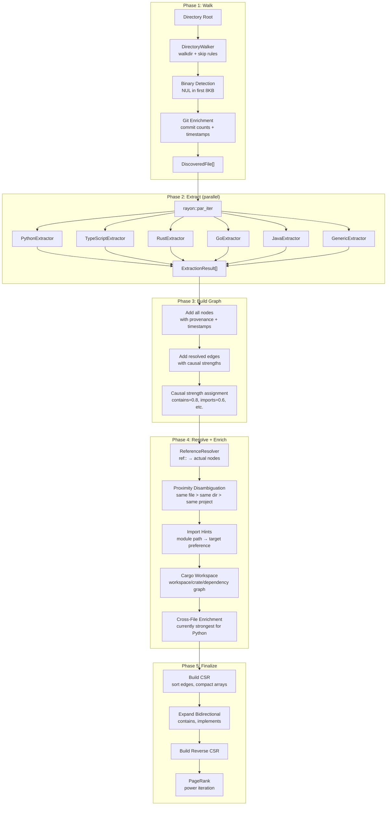

# Ingestion Pipeline (m1nd-ingest)

m1nd-ingest transforms codebases and structured documents into the property graph consumed by m1nd-core. It handles file discovery, language-specific code extraction, cross-file reference resolution, incremental diff computation, and memory/markdown ingestion.

Source: `m1nd-ingest/src/`

## Module Map

| Module | Purpose |
|--------|---------|
| `lib.rs` | `Ingestor` pipeline, `IngestAdapter` trait, config, stats |
| `walker.rs` | `DirectoryWalker`, binary detection, git enrichment |
| `extract/mod.rs` | `Extractor` trait, comment stripping, `CommentSyntax` |
| `extract/python.rs` | Python: classes, functions, decorators, imports |
| `extract/typescript.rs` | TypeScript/JS: classes, functions, interfaces, imports |
| `extract/rust_lang.rs` | Rust: structs, enums, impls, traits, functions, mods |
| `extract/go.rs` | Go: structs, interfaces, functions, packages |
| `extract/java.rs` | Java: classes, interfaces, methods, packages |
| `extract/generic.rs` | Fallback: file-level node with tag extraction |
| `resolve.rs` | `ReferenceResolver`, proximity disambiguation |
| `cargo_workspace.rs` | Cargo workspace/crate/dependency enrichment for Rust repos |
| `cross_file.rs` | Python-weighted cross-file enrichment (`imports`, `tests`, `registers`) |
| `diff.rs` | `GraphDiff` for incremental updates |
| `json_adapter.rs` | Generic JSON-to-graph adapter |
| `memory_adapter.rs` | Markdown/memory document adapter |
| `canonical.rs` | Canonical document substrate used by the universal lane |
| `merge.rs` | Graph merge utilities |
| `patent_adapter.rs` | USPTO/EPO patent XML ingestion |
| `jats_adapter.rs` | PubMed/JATS scientific article XML ingestion |
| `bibtex_adapter.rs` | BibTeX bibliography file ingestion |
| `rfc_adapter.rs` | IETF RFC XML v3 ingestion |
| `crossref_adapter.rs` | CrossRef API JSON (DOI metadata) ingestion |
| `document_router.rs` | Auto-detect document format and route to correct adapter |
| `universal_adapter.rs` | Best-effort document canonicalization, provider routing, and graphification |
| `cross_domain.rs` | Cross-domain edge resolution (DOI, ORCID, keyword bridges) |

## Pipeline Overview



## Phase 1: Directory Walking

`DirectoryWalker` uses the `walkdir` crate to traverse the filesystem. It applies skip rules, detects binary files, and enriches results with git metadata.

### Skip Rules

Default skip directories (configured via `IngestConfig`):

```rust
skip_dirs: vec![
    ".git", "node_modules", "__pycache__", ".venv",
    "target", "dist", "build", ".next", "vendor",
],
skip_files: vec![
    "package-lock.json", "yarn.lock", "Cargo.lock", "poetry.lock",
],
```

Hidden directories (starting with `.`) are skipped unless they are the root. Symlinks are not followed.

### Binary Detection (FM-ING-004)

After discovering a file, the walker reads the first 8KB and checks for NUL bytes (`0x00`). Any file containing NUL is classified as binary and skipped. This prevents feeding compiled binaries, images, or other non-text files into the language extractors.

### Git Enrichment

If the root is inside a git repository, the walker runs `git log --format=%at --name-only` to extract:

- **Commit count per file**: Used to compute `change_frequency` (1 commit = 0.1, 50+ = 1.0, capped).
- **Most recent commit timestamp**: Used for temporal decay scoring.
- **Commit groups**: Sets of files that changed together in the same commit. Fed into the `CoChangeMatrix` after graph finalization.

The result is a `WalkResult` containing `Vec<DiscoveredFile>` and `Vec<Vec<String>>` commit groups.

```rust
pub struct DiscoveredFile {
    pub path: PathBuf,
    pub relative_path: String,
    pub extension: Option<String>,
    pub size_bytes: u64,
    pub last_modified: f64,
    pub commit_count: u32,
    pub last_commit_time: f64,
}
```

## Phase 2: Parallel Extraction

Files are distributed across rayon's thread pool for concurrent extraction. Each file is assigned a language-specific extractor based on its extension:

| Extension | Extractor | Extracted Entities |
|-----------|-----------|-------------------|
| `.py`, `.pyi` | `PythonExtractor` | Classes, functions, decorators, imports, global assignments |
| `.ts`, `.tsx`, `.js`, `.jsx`, `.mjs`, `.cjs` | `TypeScriptExtractor` | Classes, functions, interfaces, type aliases, imports, exports |
| `.rs` | `RustExtractor` | Structs, enums, traits, impls, functions, modules, macros |
| `.go` | `GoExtractor` | Structs, interfaces, functions, methods, packages |
| `.java` | `JavaExtractor` | Classes, interfaces, methods, fields, packages |
| everything else | `GenericExtractor` | File-level node with tag extraction from content |

This stack is hybrid:

- native/manual extractors for Python, TypeScript/JavaScript, Rust, Go, and Java
- tree-sitter-backed tiers for additional languages
- generic fallback for unsupported files

### Extractor Interface

All extractors implement the `Extractor` trait:

```rust
pub trait Extractor: Send + Sync {
    fn extract(&self, content: &[u8], file_id: &str) -> M1ndResult<ExtractionResult>;
    fn extensions(&self) -> &[&str];
}
```

An `ExtractionResult` contains:

```rust
pub struct ExtractionResult {
    pub nodes: Vec<ExtractedNode>,
    pub edges: Vec<ExtractedEdge>,
    pub unresolved_refs: Vec<String>,
}
```

Each extracted node carries:

```rust
pub struct ExtractedNode {
    pub id: String,        // e.g. "file::backend/chat_handler.py::ChatHandler"
    pub label: String,     // e.g. "ChatHandler"
    pub node_type: NodeType,
    pub tags: Vec<String>,
    pub line: u32,
    pub end_line: u32,
}
```

### Comment and String Stripping

Before extraction, each file's content passes through `strip_comments_and_strings()` which removes comments and string literals to prevent false-positive matches from regex extractors. The function preserves import line string content (so `from "react"` still resolves) but strips string bodies elsewhere.

Comment syntax is per-language:

```rust
pub struct CommentSyntax {
    pub line: &'static str,         // e.g. "//" or "#"
    pub block_open: &'static str,   // e.g. "/*"
    pub block_close: &'static str,  // e.g. "*/"
}
```

Supported: Rust (`//`, `/* */`), Python (`#`, `""" """`), C-style (`//`, `/* */`), Go (`//`, `/* */`), Generic (`#`, none).

### Node ID Format

Extracted nodes use a hierarchical ID scheme: `file::{relative_path}::{entity_name}`. For example:

- `file::backend/chat_handler.py` (file node)
- `file::backend/chat_handler.py::ChatHandler` (class node)
- `file::backend/chat_handler.py::ChatHandler::handle_message` (method node)

Unresolved references use the prefix `ref::`: `ref::Config`, `ref::react`. These are resolved to actual nodes in Phase 4.

## Phase 3: Graph Building

After parallel extraction completes, results are collected and processed sequentially (graph mutation is single-threaded).

### Node Creation

For each `ExtractedNode`:

1. Look up the file timestamp from git enrichment (or filesystem mtime).
2. Compute `change_frequency` from git commit count: `(commits / 50).clamp(0.1, 1.0)`. Default 0.3 for non-git repos.
3. Call `graph.add_node()` with the external ID, label, node type, tags, timestamp, and change frequency.
4. Set provenance: `source_path`, `line_start`, `line_end`, `namespace="code"`.
5. On `DuplicateNode` error, increment collision counter and continue.

### Edge Creation

For each `ExtractedEdge` (skipping `ref::` targets, which are deferred):

1. Resolve source and target IDs to `NodeId`.
2. Assign causal strength by relation type:

| Relation | Causal Strength | Direction |
|----------|-----------------|-----------|
| `contains` | 0.8 | Bidirectional |
| `implements` | 0.7 | Bidirectional |
| `imports` | 0.6 | Forward |
| `calls` | 0.5 | Forward |
| `references` | 0.3 | Forward |
| other | 0.4 | Forward |

`contains` and `implements` edges are bidirectional so that both parent-to-child and child-to-parent navigation work.

### Safety Guards (FM-ING-002)

Two budget checks run between sequential file processing:

- **Timeout**: If `start.elapsed() > config.timeout` (default 300s), stop processing.
- **Node budget**: If `nodes >= config.max_nodes` (default 500K), stop processing.

Both log a warning and break from the build loop, producing a partial but consistent graph from whatever was processed.

## Phase 4: Reference Resolution And Enrichment

### ReferenceResolver

Unresolved references (`ref::Config`, `ref::FastAPI`, etc.) are resolved to actual graph nodes using the `ReferenceResolver`.

**Multi-value label index** (FM-ING-008): The resolver builds a HashMap from labels to lists of matching NodeIds. When multiple nodes share a label (e.g., multiple files define a `Config` class), proximity disambiguation selects the best match:

| Proximity | Score | Condition |
|-----------|-------|-----------|
| Same file | 100 | Source and target share the same `file::` prefix |
| Same directory | 50 | Source and target share the same directory |
| Same project | 10 | Default (both exist in the graph) |

**Import hint disambiguation**: When the extractor sees `from foo.bar import Baz`, it records an import hint mapping `(source_file, "ref::Baz")` to the module path `foo.bar`. The resolver uses this hint to prefer the `Baz` node under `foo/bar/` over a same-named node elsewhere.

Resolution outcome per reference:

- **Resolved**: Exactly one match (or best proximity match). Edge created with resolved `NodeId`.
- **Ambiguous**: Multiple matches with equal proximity. Best guess selected, counted in stats.
- **Unresolved**: No match found. Counted in stats, no edge created.

### Cargo Workspace Enrichment

For Rust repos, `cargo_workspace.rs` adds a workspace-aware layer before finalization:

- workspace nodes
- crate nodes
- crate -> file `contains` edges
- crate -> crate `depends_on` edges for internal workspace dependencies
- external dependency nodes for non-workspace dependencies

This means Rust repos are no longer represented only as file graphs.

### Cross-File Enrichment

After reference resolution and Cargo enrichment, `cross_file.rs` adds a narrower set of shipped cross-file edges.

Today this pass is strongest for Python and focuses on:

- `imports`
- `tests`
- `registers`

It should not be described as a language-uniform cross-file engine yet.

## Phase 5: Finalization

`Graph.finalize()` transforms the mutable graph into its read-optimized CSR form:

1. **Sort edges by source**: All pending edges are sorted by `source.0` (node index).
2. **Build forward CSR**: Compute offsets array, pack targets/weights/relations/etc into parallel arrays.
3. **Expand bidirectional edges**: For each bidirectional edge `(A, B)`, ensure both `A->B` and `B->A` exist in the CSR.
4. **Build reverse CSR**: Sort edges by target, build `rev_offsets`, `rev_sources`, `rev_edge_idx` (mapping back to forward array indices).
5. **Rebuild plasticity arrays**: Allocate `PlasticityNode` for each node with default ceiling.
6. **Compute PageRank**: Power iteration with damping 0.85, max 50 iterations, convergence 1e-6.

After finalization, the graph is immutable (except for atomic weight updates by plasticity).

## Incremental Ingestion (GraphDiff)

`diff.rs` enables incremental updates without full re-ingestion.

```rust
pub enum DiffAction {
    AddNode(ExtractedNode),
    RemoveNode(String),
    ModifyNode { external_id, new_label, new_tags, new_last_modified },
    AddEdge(ExtractedEdge),
    RemoveEdge { source_id, target_id, relation },
    ModifyEdgeWeight { source_id, target_id, relation, new_weight },
}
```

`GraphDiff::compute()` compares old and new extraction results by indexing both into HashMaps by external ID, then classifying each node/edge as added, removed, or modified.

`GraphDiff::apply()` executes the diff against a live graph. Note: CSR does not support true node/edge removal. "Removed" nodes are tombstoned (zero weight, empty label) rather than physically deleted. A full re-ingest is needed to reclaim space.

**When to use incremental vs full**:

| Scenario | Strategy |
|----------|----------|
| Single file changed | Incremental diff (fast, ~10ms) |
| Many files changed (>20%) | Full re-ingest (cleaner CSR, correct PageRank) |
| New codebase | Full ingest |
| Plasticity state important | Full ingest + plasticity reimport (triple matching) |

## Memory Adapter

`MemoryIngestAdapter` converts markdown documents into graph nodes. It implements the `IngestAdapter` trait with domain `"memory"`.

### Supported Formats

Files with extensions `.md`, `.markdown`, or `.txt` are accepted. The adapter walks a directory of memory files and parses each one into:

- **Section nodes** (`NodeType::Concept`): Created from markdown headings (`#`, `##`, etc.).
- **Entry nodes** (`NodeType::Process`): Created from list items under sections.
- **File reference nodes** (`NodeType::Reference`): Created from file paths mentioned in content.

### Entry Classification

List items are classified by content patterns:

| Classification | Pattern | Example |
|----------------|---------|---------|
| Task | Contains "TODO", "FIXME", "pending", "implement" | "- TODO: add tests" |
| Decision | Contains "decision:", "decided:", "chose" | "- Decision: use CSR format" |
| State | Contains "status:", "state:", "current:" | "- Status: in progress" |
| Event | Contains date pattern (`YYYY-MM-DD`) | "- 2026-03-12: deployed" |
| Note | Default | "- Config lives in settings.py" |

### Edges

The adapter creates:

- `contains` edges from section to child entries.
- `references` edges from entries to file reference nodes.
- `follows` edges between sequential entries in the same section.

This allows the activation engine to traverse from a concept ("plasticity") through memory entries to referenced code files, bridging the semantic gap between human notes and source code.

## IngestAdapter Trait

The `IngestAdapter` trait enables domain-specific ingestion beyond code:

```rust
pub trait IngestAdapter: Send + Sync {
    fn domain(&self) -> &str;
    fn ingest(&self, root: &Path) -> M1ndResult<(Graph, IngestStats)>;
}
```

Implemented adapters:

| Adapter | Domain | Input | MCP `adapter=` |
|---------|--------|-------|----------------|
| `Ingestor` | `"code"` | Source code directories | `code` |
| `MemoryIngestAdapter` | `"memory"` | Markdown/text documents | `memory` |
| `JsonIngestAdapter` | `"generic"` | Arbitrary JSON with `nodes[]` and `edges[]` | `json` |
| `PatentIngestAdapter` | `"patent"` | USPTO/EPO patent XML | `patent` |
| `JatsArticleAdapter` | `"article"` | PubMed NLM / JATS Z39.96 XML | `article` |
| `BibTexAdapter` | `"bibtex"` | BibTeX bibliography files | `bibtex`, `bib` |
| `RfcAdapter` | `"rfc"` | IETF RFC XML v3 | `rfc` |
| `CrossRefAdapter` | `"crossref"` | CrossRef API JSON (DOI metadata) | `crossref`, `doi` |
| `L1ghtIngestAdapter` | `"light"` | L1GHT protocol Markdown | `light` |

The JSON adapter is the escape hatch for importing graphs from external tools. It expects a JSON document with `nodes` (array of `{id, label, type, tags}`) and `edges` (array of `{source, target, relation, weight}`).

### Universal Document Lane

The universal lane is the best-effort document path for sources that are not authored in `L1GHT` and are not already handled by a stronger native structured adapter.

Its flow is:

1. detect document family
2. normalize into a `CanonicalDocument`
3. graphify sections, blocks, tables, citations, entities, and claims

Optional providers can enrich the lane when available:

- `Trafilatura` for HTML/wiki/article extraction
- `Docling` for office and broad document canonicalization
- `MarkItDown` as a lightweight fallback lane
- `GROBID` for scholarly PDFs

This provider stack is intentionally optional. The default green path does not require these providers; richer extraction appears only when the environment supports it.

## Document Router (Auto-Detection)

`DocumentRouter` inspects file content and extension to auto-detect the correct adapter:

```rust
let (format, adapter) = DocumentRouter::detect(path);
let (format, adapter) = DocumentRouter::detect_directory(root); // samples ≤20 files
```

| Detection Method | Format | Heuristic |
|-----------------|--------|----------|
| Extension `.bib` / `.bibtex` | BibTeX | Extension only |
| Extension `.md` + `Protocol: L1GHT` | L1GHT | Content check |
| Extension `.md` without `L1GHT`, `.txt`, `.rst`, `.adoc`, `.html`, `.pdf`, `.docx`, `.pptx`, `.xlsx` | Universal | Extension + universal lane |
| Extension `.xml` / `.nxml` | Patent, JATS, or RFC | Root element inspection |
| Extension `.json` | CrossRef | Checks for `DOI` + `publisher` + `type` keys |
| Fallback | Code | Default pipeline |

Used via MCP: `m1nd.ingest(adapter="auto")`, `adapter="document"`, or `adapter="universal"` when you want best-effort document normalization directly.

For directory detection, the router samples up to 20 files and returns the dominant format.

## Cross-Domain Resolution

`CrossDomainResolver` merges multiple adapter outputs and discovers cross-domain connections automatically.

### Bridge Strategies

| Bridge | Weight | Source | Description |
|--------|--------|--------|-------------|
| `same_as` | 1.0 | DOI/PMID | Same identifier in different domains → identity edge |
| `cross_cites` | 0.95 | Citation edges | Citation target exists as a full node in another domain |
| `same_orcid` | 0.95 | ORCID tags | Same researcher ORCID across different domains |
| `same_author` | 0.7 | Author name | Same author name across different namespaces |
| `shared_keyword` | 0.6 | Keyword tags | Shared `keyword:`, `article:keyword:`, or `subject:` tags |
| `citation_chain` | 0.5 | Citation adjacency | Transitive A→B→C bridging with decayed weight |

### Safety Guards

- **Keyword cap**: Keywords shared by >20 nodes are ignored to prevent hub explosion.
- **Cross-domain only**: All bridges require nodes from ≥2 different namespaces. Same-domain matches are skipped.
- **Self-loop prevention**: Citation chains A→B→A do not generate self-loop edges.
- **Deduplication**: Nodes with identical external IDs are deduplicated (first wins).

### Resolution Statistics

```rust
pub struct ResolutionStats {
    pub graphs_merged: usize,
    pub total_nodes: u32,
    pub total_edges: usize,
    pub cross_edges_created: usize,
    pub identity_matches: usize,
    pub author_bridges: usize,
    pub keyword_bridges: usize,
    pub orcid_bridges: usize,
    pub citation_chains: usize,
}
```

## Configuration Reference

```rust
pub struct IngestConfig {
    pub root: PathBuf,
    pub timeout: Duration,          // default: 300s
    pub max_nodes: u64,             // default: 500_000
    pub skip_dirs: Vec<String>,     // default: [".git", "node_modules", ...]
    pub skip_files: Vec<String>,    // default: ["package-lock.json", ...]
    pub parallelism: usize,         // default: 8 (rayon threads)
}
```

### Statistics

Every ingest run produces `IngestStats`:

```rust
pub struct IngestStats {
    pub files_scanned: u64,
    pub files_parsed: u64,
    pub files_skipped_binary: u64,
    pub files_skipped_encoding: u64,
    pub nodes_created: u64,
    pub edges_created: u64,
    pub references_resolved: u64,
    pub references_unresolved: u64,
    pub label_collisions: u64,
    pub elapsed_ms: f64,
    pub commit_groups: Vec<Vec<String>>,
}
```

`commit_groups` is passed to the `CoChangeMatrix` in m1nd-core after graph finalization, seeding the temporal co-change model with real git history.
