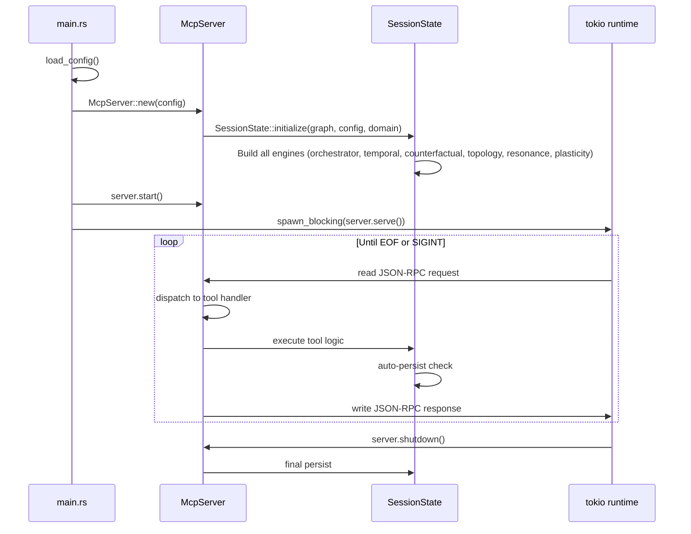
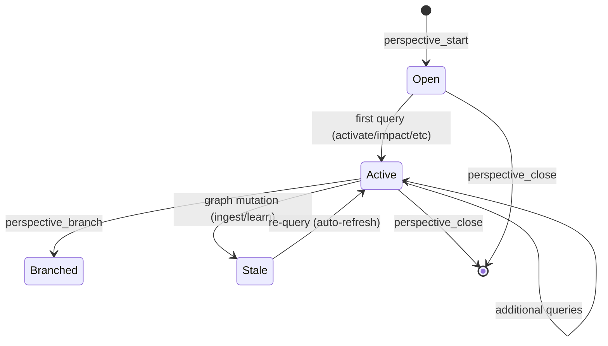
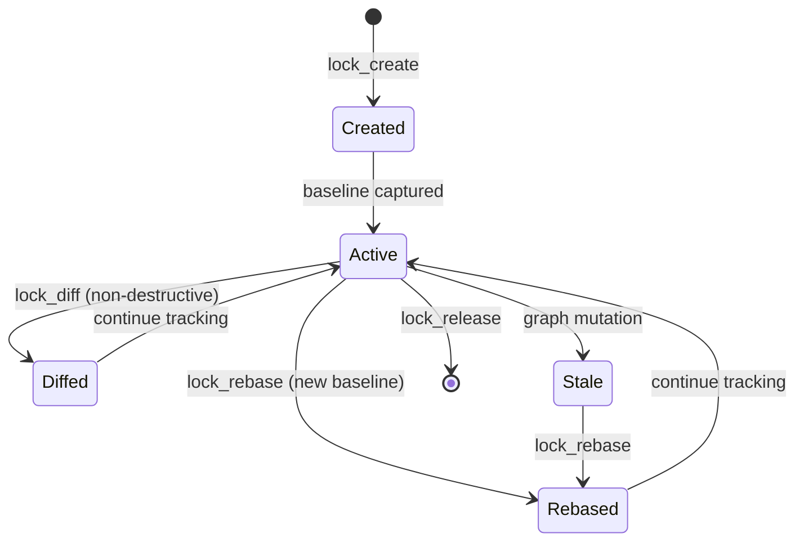
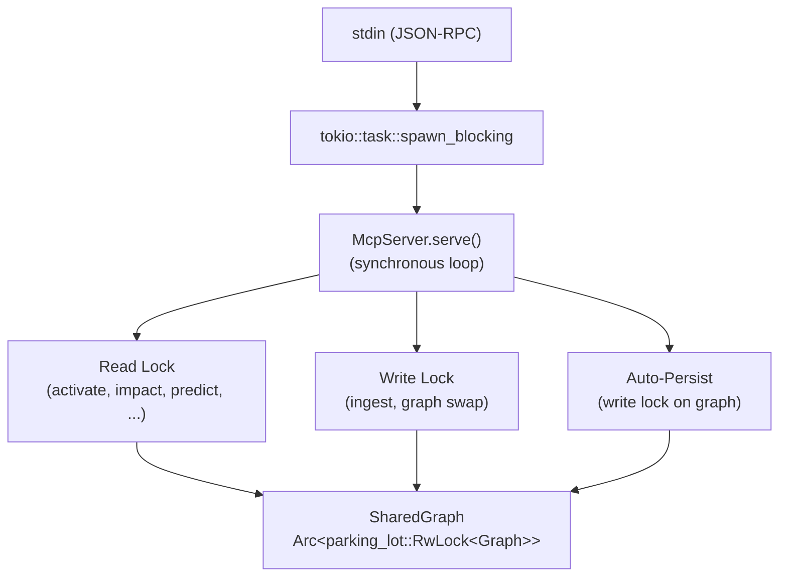

# MCP Server (m1nd-mcp)

m1nd-mcp is the transport and session layer. It exposes m1nd-core and m1nd-ingest through the live MCP tool surface over JSON-RPC stdio, manages the shared graph lifecycle, handles multi-agent sessions, and turns graph results into a more agent-operational runtime with proof-state, next-step guidance, recovery-oriented errors, observable batch execution, and a local-first document runtime. Use `tools/list` for the exact count in your current build.

Source: `m1nd-mcp/src/`

## Module Map

| Module | Purpose |
|--------|---------|
| `main.rs` | Binary entry point, config loading, tokio runtime, SIGINT handling |
| `server.rs` | `McpServer`, JSON-RPC transport (framed + line), tool schema registry |
| `session.rs` | `SessionState`, engine lifecycle, auto-persist, perspective/lock management |
| `tools.rs` | Tool handler implementations for the exported MCP surface |
| `auto_ingest.rs` | Document watcher runtime, persisted manifest, queue/tick orchestration |
| `universal_docs.rs` | Canonical document artifacts, provider health, resolve/bindings/drift surfaces |
| `engine_ops.rs` | Read-only engine wrappers for perspective synthesis |
| `protocol/auto_ingest.rs` | Request/response types for document and auto-ingest tools |
| `perspective/` | Perspective branching, lock state, watcher events |
| `layer_handlers.rs` | Layer-based tool dispatch |

## Transport Layer

### Dual Transport Mode

m1nd-mcp accepts two JSON-RPC transport formats on stdin, auto-detected per message:

**Framed mode** (HTTP-style headers):
```
Content-Length: 142\r\n
\r\n
{"jsonrpc":"2.0","method":"tools/call","params":{"name":"activate","arguments":{"query":"chat","agent_id":"jimi"}},"id":1}
```

**Line mode** (raw JSON):
```
{"jsonrpc":"2.0","method":"tools/call","params":{"name":"activate","arguments":{"query":"chat","agent_id":"jimi"}},"id":1}
```

Detection is based on the first non-whitespace byte: if it is `{` or `[`, the message is treated as line-mode JSON. Otherwise, it is parsed as framed with `Content-Length` headers. Responses are written in the same mode as the incoming request.

```rust
fn read_request_payload<R: BufRead>(
    reader: &mut R,
) -> std::io::Result<Option<(String, TransportMode)>> {
    loop {
        let buffer = reader.fill_buf()?;
        if buffer.is_empty() { return Ok(None); }
        let first_non_ws = buffer.iter().copied()
            .find(|byte| !byte.is_ascii_whitespace());
        let starts_framed = matches!(first_non_ws, Some(byte) if byte != b'{' && byte != b'[');
        // ...
    }
}
```

This dual-mode support allows m1nd to work with both Claude Code (which uses framed headers) and other MCP clients that send raw line JSON.

### Request/Response Format

Requests follow the JSON-RPC 2.0 specification with MCP conventions:

```json
{
    "jsonrpc": "2.0",
    "method": "tools/call",
    "params": {
        "name": "activate",
        "arguments": {
            "query": "chat handler",
            "agent_id": "jimi",
            "top_k": 20,
            "dimensions": ["structural", "semantic", "temporal", "causal"],
            "xlr": true
        }
    },
    "id": 1
}
```

Responses:

```json
{
    "jsonrpc": "2.0",
    "result": {
        "content": [{
            "type": "text",
            "text": "..."
        }]
    },
    "id": 1
}
```

The `tools/list` method returns the live tool schemas with full `inputSchema` per MCP spec, enabling auto-discovery by any MCP client. Use it as the source of truth for exact names and count in your current build.

## Server Lifecycle



### Configuration

Configuration is resolved in priority order: CLI argument (JSON file path) > environment variables > defaults.

```rust
pub struct McpConfig {
    pub graph_source: PathBuf,          // default: "./graph_snapshot.json"
    pub plasticity_state: PathBuf,      // default: "./plasticity_state.json"
    pub auto_persist_interval: u32,     // default: 50 (queries between persists)
    pub learning_rate: f32,             // default: 0.08
    pub decay_rate: f32,                // default: 0.005
    pub xlr_enabled: bool,             // default: true
    pub max_concurrent_reads: usize,    // default: 32
    pub write_queue_size: usize,        // default: 64
    pub domain: Option<String>,         // default: None ("code")
}
```

Environment variables: `M1ND_GRAPH_SOURCE`, `M1ND_PLASTICITY_STATE`, `M1ND_XLR_ENABLED`.

### Startup Sequence

1. `load_config()`: Resolve config from CLI args, env vars, or defaults.
2. `McpServer::new(config)`: Load graph snapshot from disk (or create empty graph). Load plasticity state. Initialize `SessionState` with all engines.
3. `server.start()`: Prepare the server for serving (no-op currently, reserved for future setup).
4. `tokio::task::spawn_blocking(server.serve())`: The serve loop does synchronous stdio I/O in a blocking task.
5. `tokio::select!` waits for either SIGINT (`ctrl_c()`) or serve loop completion.

### Shutdown

On SIGINT or stdin EOF:

1. `server.shutdown()`: Final persist of graph and plasticity state.
2. Process exits.

The atomic write pattern (temp file + rename) ensures that even if shutdown is interrupted, the previous snapshot remains intact.

## Tool Registration and Dispatch

### Schema Registry

`tool_schemas()` returns a JSON array of the live tool definitions with full `inputSchema` objects. Each tool specifies:

- `name`: Canonical live registry name (e.g., `activate`)
- `description`: Human-readable purpose
- `inputSchema`: JSON Schema with `properties`, `required`, `type`, defaults

Some clients may display compatibility aliases with a transport prefix such as `m1nd.activate`, but the live registry returned by `tools/list` uses the bare tool names.

The current surface now includes a document runtime in addition to the code graph runtime:

- `document_resolve`
- `document_provider_health`
- `document_bindings`
- `document_drift`
- `auto_ingest_start`
- `auto_ingest_stop`
- `auto_ingest_status`
- `auto_ingest_tick`

Example schema entry:

```json
{
    "name": "activate",
    "description": "Spreading activation query across the graph",
    "inputSchema": {
        "type": "object",
        "properties": {
            "query": { "type": "string" },
            "agent_id": { "type": "string" },
            "top_k": { "type": "integer", "default": 20 },
            "dimensions": {
                "type": "array",
                "items": { "type": "string", "enum": ["structural", "semantic", "temporal", "causal"] },
                "default": ["structural", "semantic", "temporal", "causal"]
            },
            "xlr": { "type": "boolean", "default": true }
        },
        "required": ["query", "agent_id"]
    }
}
```

### Tool Categories

The live tool surface is organized into functional groups. Use `tools/list` for the exhaustive registry in your current build.

**Core Query Tools**:

| Tool | Purpose | Key Parameters |
|------|---------|----------------|
| `activate` | Spreading activation query | `query`, `top_k`, `dimensions`, `xlr` |
| `impact` | Blast radius analysis | `node_id`, `direction` (forward/reverse/both) |
| `missing` | Structural hole detection | `query`, `min_sibling_activation` |
| `why` | Path explanation between nodes | `source`, `target`, `max_hops` |
| `warmup` | Task-based priming | `task_description`, `boost_strength` |
| `counterfactual` | Node removal simulation | `node_ids`, `include_cascade` |
| `predict` | Co-change prediction | `changed_node`, `top_k`, `include_velocity` |
| `fingerprint` | Equivalence detection | `target_node` |
| `drift` | Weight changes since baseline | `since` |
| `learn` | Hebbian feedback | `feedback` (correct/wrong) |
| `resonate` | Standing wave analysis | `query`, `frequencies`, `num_harmonics` |
| `seek` | Seed-level node lookup | `query` |
| `scan` | Full graph summary | (none) |

**Graph Mutation Tools**:

| Tool | Purpose |
|------|---------|
| `ingest` | Ingest codebase into graph |
| `health` | Server diagnostics |
| `timeline` | Temporal event timeline |

**Perspective Tools**:

| Tool | Purpose |
|------|---------|
| `perspective_start` | Open a named perspective branch |
| `perspective_close` | Close a perspective |
| `perspective_list` | List open perspectives for an agent |
| `perspective_inspect` | View perspective state and cached results |
| `perspective_compare` | Diff two perspectives |
| `perspective_branch` | Fork a perspective |
| `perspective_suggest` | Generate suggestions from perspective context |
| `perspective_back` | Undo last perspective operation |
| `perspective_peek` | Read source file content from within perspective |
| `perspective_follow` | Follow links from perspective results |
| `perspective_routes` | View cached activation routes |
| `perspective_affinity` | Cross-perspective affinity analysis |

**Lock Tools**:

| Tool | Purpose |
|------|---------|
| `lock_create` | Create a baseline snapshot for change tracking |
| `lock_diff` | Diff current state against lock baseline |
| `lock_rebase` | Update lock baseline to current state |
| `lock_release` | Release a lock |
| `lock_watch` | Watch for changes against lock baseline |

**Trail Tools**:

| Tool | Purpose |
|------|---------|
| `trail_save` | Save current exploration trail |
| `trail_list` | List saved trails |
| `trail_resume` | Resume a saved trail |
| `trail_merge` | Merge trails |

**Topology Tools**:

| Tool | Purpose |
|------|---------|
| `federate` | Cross-graph federation |
| `diverge` | Divergence analysis between graph regions |
| `differential` | Differential activation (compare two queries) |
| `hypothesize` | Generate hypotheses from graph structure |
| `validate_plan` | Validate an implementation plan against graph |

### Dispatch

All tools require an `agent_id` parameter. The serve loop matches the tool name from the JSON-RPC request and dispatches to the corresponding handler in `tools.rs`. The handler extracts parameters from the `arguments` JSON object, acquires the appropriate lock on `SessionState`, executes the operation, and returns the result as a JSON-RPC response.

## Session Management

### SessionState

`SessionState` is the central state object. It owns the graph, all engines, and all session metadata:

```rust
pub struct SessionState {
    pub graph: SharedGraph,                    // Arc<RwLock<Graph>>
    pub domain: DomainConfig,
    pub orchestrator: QueryOrchestrator,       // activation + XLR + semantic
    pub temporal: TemporalEngine,
    pub counterfactual: CounterfactualEngine,
    pub topology: TopologyAnalyzer,
    pub resonance: ResonanceEngine,
    pub plasticity: PlasticityEngine,

    pub queries_processed: u64,
    pub auto_persist_interval: u32,            // default: 50
    pub start_time: Instant,
    pub last_persist_time: Option<Instant>,
    pub graph_path: PathBuf,
    pub plasticity_path: PathBuf,
    pub sessions: HashMap<String, AgentSession>,

    // Perspective/lock state
    pub graph_generation: u64,
    pub plasticity_generation: u64,
    pub cache_generation: u64,
    pub perspectives: HashMap<(String, String), PerspectiveState>,
    pub locks: HashMap<String, LockState>,
    pub perspective_counter: HashMap<String, u64>,
    pub lock_counter: HashMap<String, u64>,
    pub pending_watcher_events: Vec<WatcherEvent>,
    pub perspective_limits: PerspectiveLimits,
    pub peek_security: PeekSecurityConfig,
    pub ingest_roots: Vec<String>,
}
```

### SharedGraph

`SharedGraph = Arc<parking_lot::RwLock<Graph>>` provides concurrent access:

- **Reads** (activation, impact, predict, etc.): Acquire read lock. Multiple concurrent reads allowed.
- **Writes** (ingest, learn): Acquire write lock. Exclusive access. Blocks all readers.

`parking_lot::RwLock` is used instead of `std::sync::RwLock` for two reasons:
1. **Writer starvation prevention**: parking_lot uses a fair queue, so plasticity writes do not starve behind continuous read queries.
2. **Performance**: parking_lot's implementation is faster for the read-heavy, write-rare access pattern of m1nd.

### Engine Rebuild

After ingestion replaces the graph, all engines must be rebuilt because they hold indexes derived from the old graph:

```rust
pub fn rebuild_engines(&mut self) -> M1ndResult<()> {
    {
        let graph = self.graph.read();
        self.orchestrator = QueryOrchestrator::build(&graph)?;
        self.temporal = TemporalEngine::build(&graph)?;
        self.plasticity = PlasticityEngine::new(
            &graph, PlasticityConfig::default(),
        );
    }
    self.invalidate_all_perspectives();
    self.mark_all_lock_baselines_stale();
    self.graph_generation += 1;
    self.cache_generation = self.cache_generation.max(self.graph_generation);
    Ok(())
}
```

The rebuild also invalidates all perspective and lock state, bumping generation counters so that stale caches are detected.

### Auto-Persist

Every `auto_persist_interval` queries (default 50), the session persists state to disk:

1. **Graph first**: `save_graph()` writes the CSR graph to JSON via atomic temp-file-then-rename.
2. **Plasticity second**: `export_state()` extracts per-edge `SynapticState`, then `save_plasticity_state()` writes to JSON.
3. If graph save fails, plasticity save is skipped (prevents inconsistent state).
4. If plasticity save fails after graph succeeds, a warning is logged but the server continues.

```rust
pub fn persist(&mut self) -> M1ndResult<()> {
    let graph = self.graph.read();
    m1nd_core::snapshot::save_graph(&graph, &self.graph_path)?;
    match self.plasticity.export_state(&graph) {
        Ok(states) => {
            if let Err(e) = save_plasticity_state(&states, &self.plasticity_path) {
                eprintln!("[m1nd] WARNING: plasticity persist failed: {}", e);
            }
        }
        Err(e) => eprintln!("[m1nd] WARNING: plasticity export failed: {}", e),
    }
    self.last_persist_time = Some(Instant::now());
    Ok(())
}
```

## Multi-Agent Support

### Agent Sessions

Each unique `agent_id` gets an `AgentSession`:

```rust
pub struct AgentSession {
    pub agent_id: String,
    pub first_seen: Instant,
    pub last_seen: Instant,
    pub query_count: u64,
}
```

Sessions are created on first query and updated on each subsequent query. The `last_seen` timestamp enables timeout-based cleanup.

### Agent Isolation

All agents share one graph (writes are immediately visible), but isolation is provided through:

- **Perspectives**: Per-agent branching views with independent route caches. A perspective opened by Agent A is invisible to Agent B.
- **Locks**: Per-agent change tracking baselines. Each agent can create independent locks to track changes from their perspective.
- **Query Memory**: The plasticity engine's ring buffer is global (shared learning), but perspective-level route caches are per-agent.

### Generation Counters

Three generation counters detect stale state:

| Counter | Bumped By | Purpose |
|---------|-----------|---------|
| `graph_generation` | Ingest, rebuild_engines | Detects stale engine indexes |
| `plasticity_generation` | Learn | Detects stale plasticity state |
| `cache_generation` | max(graph_gen, plasticity_gen) | Unified staleness for perspective caches |

When a perspective's cached results were computed at a different generation than the current `cache_generation`, the perspective is marked stale and results are recomputed on next access.

## Perspective System

Perspectives are per-agent named branches that cache activation results and enable comparative analysis.

### Lifecycle



### Perspective IDs

Generated as `persp_{agent_prefix}_{counter:03}`. Each agent has an independent monotonic counter. Example: Agent "jimi" creates perspectives `persp_jimi_001`, `persp_jimi_002`, etc.

### Resource Limits

`PerspectiveLimits` caps resource usage:

- Maximum open perspectives per agent
- Maximum total perspectives across all agents
- Maximum locks per agent

### Peek Security

`perspective_peek` allows reading source file content from within a perspective context. Security restrictions:

- Files must be within an `ingest_roots` allow-list (populated during ingest).
- Path traversal (`..`) is blocked.
- Symlinks outside the allow-list are rejected.

## Lock System

Locks capture a baseline snapshot of graph state for change tracking.

### Lock Lifecycle



### Operations

- **lock_create**: Captures current graph state (generation counter + weight snapshot for tracked edges).
- **lock_diff**: Compares current state against baseline. Reports weight changes, new/removed edges. Non-destructive.
- **lock_rebase**: Updates baseline to current state. Clears staleness flag.
- **lock_release**: Frees the lock.
- **lock_watch**: Returns pending watcher events (changes that occurred since last check).

When a graph mutation occurs (ingest, learn), all locks are marked `baseline_stale = true`. `lock_diff` reports this staleness and suggests `lock_rebase`.

## Engine Operations (Perspective Synthesis)

`engine_ops.rs` provides read-only wrappers around engine operations for use within perspective synthesis. These wrappers operate under a `SynthesisBudget`:

- **Max calls**: 8 engine calls per synthesis operation.
- **Wall-clock timeout**: 500ms total.

This prevents perspective synthesis from monopolizing the server. Each wrapper (`activate_readonly`, `impact_readonly`, etc.) checks budget before executing and returns a budget-exhausted error if limits are exceeded.

## Concurrency Model



The serve loop is single-threaded (synchronous stdio I/O), but graph access is concurrent-safe through `SharedGraph`. Within a single request:

- Read operations acquire a read lock (shared, non-blocking with other reads).
- Write operations acquire a write lock (exclusive, blocks all other access).
- Plasticity weight updates use atomic CAS (no lock needed for individual weight writes).

The tokio runtime is used solely for the `select!` between SIGINT and serve loop completion. All actual tool processing happens synchronously within `spawn_blocking`.
