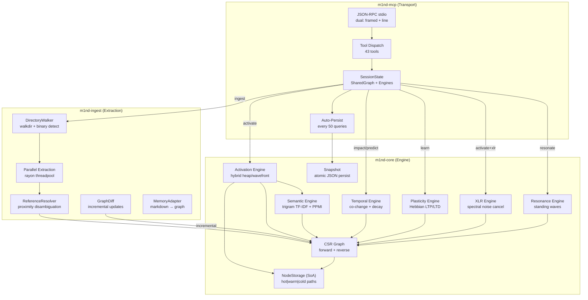

# System Architecture Overview

m1nd is a neuro-symbolic connectome engine that transforms codebases (and other structured domains) into a weighted property graph, then runs biologically-inspired algorithms over it: spreading activation, Hebbian plasticity, spectral noise cancellation, standing wave resonance, and temporal co-change analysis. It exposes these capabilities as 43 MCP tools over JSON-RPC stdio, serving multiple agents concurrently from a single process.

## Three-Crate Workspace

The system is organized as a Cargo workspace with three crates:

```toml
[workspace]
members = ["m1nd-core", "m1nd-ingest", "m1nd-mcp"]
resolver = "2"

[workspace.dependencies]
thiserror = "2"
serde = { version = "1", features = ["derive"] }
serde_json = "1"
smallvec = { version = "1.13", features = ["serde"] }
parking_lot = "0.12"
rayon = "1.10"
static_assertions = "1"
```

| Crate | Role | Key Dependency |
|-------|------|----------------|
| **m1nd-core** | Graph engine, activation, plasticity, XLR, resonance, temporal, semantic | `parking_lot`, `smallvec`, `static_assertions` |
| **m1nd-ingest** | File walking, language-specific extraction, reference resolution, diff | `rayon`, `walkdir`, `regex` |
| **m1nd-mcp** | JSON-RPC transport, tool dispatch, session management, persistence | `tokio`, `serde_json` |

Dependencies flow strictly downward: `m1nd-mcp` depends on both `m1nd-core` and `m1nd-ingest`; `m1nd-ingest` depends on `m1nd-core`; `m1nd-core` has no internal crate dependencies.

## Data Flow



## Request Lifecycle

A typical `m1nd.activate` query flows through these stages:

1. **Transport**: JSON-RPC message arrives on stdin (either Content-Length framed or raw line JSON).
2. **Dispatch**: `McpServer.serve()` parses the JSON-RPC request, matches the tool name, extracts parameters.
3. **Session**: The tool handler acquires a read lock on `SharedGraph` (`Arc<parking_lot::RwLock<Graph>>`).
4. **Seed Finding**: `SeedFinder` locates matching nodes via multi-strategy matching (exact label, prefix, substring, tag, fuzzy trigram -- all checked per token with early-continue on strong matches).
5. **Activation**: `HybridEngine` auto-selects heap or wavefront strategy based on seed ratio and average degree.
6. **Dimensions**: Four dimensions run: Structural (BFS/heap propagation), Semantic (trigram TF-IDF + co-occurrence PPMI), Temporal (decay + velocity), Causal (forward/backward with discount).
7. **Merge**: `merge_dimensions()` combines results with adaptive weights `[0.35, 0.25, 0.15, 0.25]` and resonance bonus (4-dim: 1.5x, 3-dim: 1.3x).
8. **XLR**: If enabled, `AdaptiveXlrEngine` runs spectral noise cancellation with dual hot/cold pulses and sigmoid gating.
9. **Plasticity**: `PlasticityEngine.update()` runs the 5-step Hebbian cycle on co-activated edges.
10. **Response**: Results serialized to JSON-RPC response, written to stdout in the same transport mode as the request.

## Key Design Decisions

### Compressed Sparse Row (CSR) Graph

The graph uses CSR format rather than adjacency lists or adjacency matrices. CSR provides O(1) neighbor iteration start, cache-friendly sequential access, and compact memory layout. Edge weights are stored as `AtomicU32` (bit-reinterpreted `f32`) for lock-free plasticity updates via CAS with a 64-retry limit.

Forward and reverse CSR arrays are maintained in parallel, enabling both outgoing and incoming edge traversal without full graph scans.

### Struct-of-Arrays Node Storage

`NodeStorage` uses SoA layout with explicit hot/warm/cold path separation:

- **Hot path** (every query): `activation: Vec<[FiniteF32; 4]>`, `pagerank: Vec<FiniteF32>`
- **Warm path** (plasticity): `plasticity: Vec<PlasticityNode>`
- **Cold path** (seed finding, export): `label`, `node_type`, `tags`, `last_modified`, `change_frequency`, `provenance`

This layout ensures that activation queries touch only hot-path arrays, maximizing L1/L2 cache utilization.

### FiniteF32 Type Safety

All floating-point values in the graph are wrapped in `FiniteF32`, a `#[repr(transparent)]` newtype that makes NaN and Infinity impossible by construction:

```rust
#[derive(Clone, Copy, Default, PartialEq)]
#[repr(transparent)]
pub struct FiniteF32(f32);

impl FiniteF32 {
    #[inline]
    pub fn new(v: f32) -> Self {
        debug_assert!(v.is_finite(), "FiniteF32::new received non-finite: {v}");
        Self(if v.is_finite() { v } else { 0.0 })
    }
}
```

Because NaN is excluded, `FiniteF32` can safely implement `Ord`, `Eq`, and `Hash` -- operations that are unsound on raw `f32`. Related newtypes `PosF32` (strictly positive), `LearningRate` (0, 1]), and `DecayFactor` (0, 1]) provide compile-time invariant enforcement for their respective domains.

### String Interning

All node labels, tags, and relation names are interned via `StringInterner`. Once interned, string comparisons become `u32 == u32` (zero-allocation, single CPU cycle). The interner maps strings to `InternedStr(u32)` handles and provides O(1) bidirectional lookup.

### Parallel Extraction, Sequential Building

Ingestion uses rayon for parallel file reading and language-specific extraction across all CPU cores, but graph construction is single-threaded. This avoids the complexity of concurrent graph mutation while still saturating I/O bandwidth during the most expensive phase (parsing hundreds of files).

### Atomic Persistence

Graph and plasticity state are saved via atomic write: serialize to a temporary file, then `rename()` over the target. This prevents corruption on crash (FM-PL-008). The NaN firewall at the export boundary rejects any non-finite values that might have leaked through.

## Performance Characteristics

Benchmarks on a production codebase (335 files, ~52K lines, Python + Rust + TypeScript):

| Operation | Time | Notes |
|-----------|------|-------|
| Full ingest | ~910ms | Walk + parallel extract + resolve + finalize (CSR + PageRank) |
| Activate query | ~31ms | 4-dimension with XLR, top-20 results |
| Impact analysis | ~5ms | BFS blast radius, 3-hop default |
| Predict (co-change) | <1ms | Co-change matrix lookup + velocity scoring |
| Graph persist | ~45ms | Atomic JSON write, ~2MB snapshot |
| Plasticity update | ~2ms | 5-step Hebbian cycle on co-activated edges |

Memory footprint scales linearly with graph size. A 10K-node graph with 25K edges uses approximately 15MB of heap (graph + all engine indexes). The CSR representation is 3-5x more compact than equivalent adjacency list representations.

### Scaling Bounds

- **Node limit**: `NodeId(u32)` supports up to ~4 billion nodes. Practical limit is the `max_nodes` config (default: 500K).
- **Edge weights**: `AtomicU32` CAS with 64-retry limit. Under high contention (>32 concurrent plasticity updates on the same edge), CAS may exhaust retries and return `CasRetryExhausted`.
- **Co-occurrence index**: Disabled above 50K nodes (`COOCCURRENCE_MAX_NODES`) to avoid O(N * walks * length) random walk cost.
- **Co-change matrix**: Hard budget of 500K entries with per-row cap of 100 entries.
- **Resonance pulse budget**: 50K pulses per standing wave analysis to prevent combinatorial explosion in dense subgraphs.

## Multi-Agent Model

m1nd runs as a single process serving multiple agents through the same JSON-RPC stdio channel. All agents share one graph and one set of engines. Writes (plasticity updates, ingestion) are immediately visible to all readers through `SharedGraph = Arc<parking_lot::RwLock<Graph>>`.

Each agent gets its own `AgentSession` tracking first/last seen timestamps and query count. The perspective system (per-agent branching views) and lock system (per-agent change tracking) provide isolation where needed without duplicating the underlying graph.

`parking_lot::RwLock` is used instead of `std::sync::RwLock` to prevent writer starvation -- a critical property when plasticity updates (writes) must interleave with activation queries (reads).
