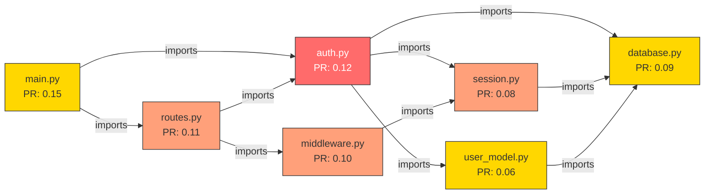

# Spreading Activation

Spreading activation is the core query mechanism in m1nd. Instead of searching for text matches, m1nd *fires a signal into a weighted graph* and observes where the energy propagates. The resulting activation pattern tells you what is structurally, semantically, temporally, and causally related to your query.

## The neuroscience origin

The concept comes from cognitive psychology. In 1975, Allan Collins and Elizabeth Loftus proposed that human semantic memory is organized as a network of interconnected concepts. When you think of "doctor," activation spreads along weighted connections to "nurse," "hospital," "stethoscope" -- but not to "bicycle." The strength of the connection determines how much activation passes through. Distant or weak connections receive less energy. The pattern of activated nodes *is* the meaning.

m1nd applies this model to code. Files, functions, classes, and modules become nodes. Import relationships, call chains, type references, and co-change history become weighted edges. Querying "authentication" does not find the string "authentication" -- it fires signal into nodes that match and watches energy flow outward through the graph's structure.

## Four dimensions of activation

Most spreading activation systems operate on a single graph. m1nd runs four independent activation passes and fuses the results. Each dimension captures a different kind of relationship.

### D1: Structural

Graph distance, edge types, and edge weights. This is classical spreading activation -- signal decays as it hops along edges. A file that imports another file is one hop away. A function that calls through two intermediate modules is three hops away. The signal strength at each node tells you how structurally close it is to the query.

The structural dimension uses m1nd's CSR (Compressed Sparse Row) adjacency matrix with forward and reverse indices. PageRank scores computed at ingest time provide a static importance baseline.

### D2: Semantic

Token overlap and naming patterns. This dimension scores nodes based on how their identifiers (file names, function names, class names) relate to the query text. m1nd uses a TF-IDF weighted trigram index built at ingest time. The trigrams for "authentication" overlap with "auth_handler," "authenticate_user," and "auth_middleware" -- without requiring exact string matching.

Co-occurrence embeddings from short random walks on the graph add a second signal: nodes that tend to appear near each other in the graph structure score higher, even if their names share no characters.

### D3: Temporal

Recency and change frequency. Files modified recently score higher than files untouched for months. Files that change often (high velocity) score higher than stable ones. The temporal dimension uses exponential decay with a 7-day half-life:

```
recency = exp(-0.693 * age_seconds / (168 * 3600))
score   = recency * 0.6 + frequency * 0.4
```

This ensures that recently active parts of the codebase surface in activation results, even if they are structurally distant.

### D4: Causal

Forward and backward causal chain traversal. Edges with `causal_strength > 0` (derived from call chains, error propagation paths, and stacktrace mappings) form a causal subgraph. Signal propagates forward along causal edges with full strength, and backward with a 0.7 discount factor. This surfaces nodes that *cause* or *are caused by* the query target.

## The activation wavefront algorithm

m1nd implements two propagation strategies and a hybrid selector that chooses between them at runtime.

### WavefrontEngine (BFS)

Breadth-first, depth-parallel propagation. All active nodes at the current depth fire simultaneously. Signal accumulates into the next depth's buffer via a **scatter-max** operation: when multiple sources send signal to the same target, only the strongest arrival survives.

```
for each depth 0..max_depth:
    for each node in current frontier:
        if activation[node] < threshold: skip
        for each outgoing edge (node -> target):
            signal = activation[node] * edge_weight * decay
            if inhibitory: signal = -signal * inhibitory_factor
            if signal > activation[target]:
                activation[target] = signal    // scatter-max
                add target to next frontier
    frontier = next_frontier
```

This processes all nodes at the same distance in one pass. Optimal when many seeds fire simultaneously or the graph has high average degree.

### HeapEngine (priority queue)

Max-heap propagation. The strongest signal fires first. Early-terminates when the heap top drops below threshold. Uses a Bloom filter for fast visited checks (probabilistic, with FPR ~ 1% at typical graph sizes).

Optimal for sparse queries: few seeds, low graph density. The seed-to-node ratio and average degree determine the crossover point.

### HybridEngine (auto-select)

The `HybridEngine` chooses at runtime:

```rust
fn prefer_heap(graph: &Graph, seed_count: usize) -> bool {
    let seed_ratio = seed_count as f64 / graph.num_nodes().max(1) as f64;
    seed_ratio < 0.001 && graph.avg_degree() < 8.0
}
```

If fewer than 0.1% of nodes are seeds **and** the average degree is below 8, the HeapEngine wins. Otherwise, the WavefrontEngine is faster because it avoids heap overhead for dense propagation.

## Seed node selection

Before activation can begin, the query text must be converted into seed nodes. The `SeedFinder` performs a multi-strategy match against all node labels:

| Strategy | Relevance score | Example |
|----------|----------------|---------|
| Exact label match | 1.0 | "auth" matches node "auth" |
| Prefix match | 0.9 | "auth" matches "auth_handler" |
| Substring match | 0.8 | "auth" matches "pre_auth_check" |
| Tag match | 0.85 | "auth" matches node tagged "authentication" |
| Fuzzy trigram | 0.7 * sim | "authenticaton" (typo) matches "authentication" |

Trigram similarity uses cosine distance between character n-gram frequency vectors. A match threshold of 0.3 catches most typos without generating noise.

For enhanced matching, `find_seeds_semantic` runs a two-phase process: basic seed finding produces candidates, then the semantic engine re-ranks them with a 0.6/0.4 blend of basic and semantic scores. Maximum 200 seeds are returned (capped by `MAX_SEEDS`).

## Decay and damping

Signal attenuates at every hop:

```
signal_at_target = signal_at_source * edge_weight * decay_factor
```

The default decay factor is **0.55** per hop (from `DecayFactor::DEFAULT`). After 3 hops, the signal has decayed to 0.55^3 = 16.6% of its original strength. After 5 hops (the default `max_depth`), it is at 5%. The max depth is hard-capped at 20 to prevent runaway propagation.

Additional controls:

- **Threshold** (default 0.04): signal below this value is discarded. This prunes the wavefront and prevents ghost activations.
- **Saturation cap** (default 1.0): seeds cannot inject more than this amount of activation. Prevents a single high-PageRank node from dominating.
- **Inhibitory factor** (default 0.5): inhibitory edges (negative relationships like "replaces," "deprecates") apply capped proportional suppression rather than simple negation.

## How dimensions are combined

After all four dimensions produce their scored node lists, the `merge_dimensions` function fuses them into a single ranking.

### Weighted sum

Each dimension has a base weight:

```rust
pub const DIMENSION_WEIGHTS: [f32; 4] = [0.35, 0.25, 0.15, 0.25];
//                                        D1     D2     D3     D4
//                                    Struct  Seman  Temp  Causal
```

If a dimension produces no results (e.g., no temporal data available), its weight is redistributed proportionally to the active dimensions. This adaptive redistribution prevents zero-result dimensions from diluting the signal.

### Resonance bonus

Nodes that appear in multiple dimensions receive a multiplicative bonus:

```rust
pub const RESONANCE_BONUS_3DIM: f32 = 1.3;  // 3 dimensions agree
pub const RESONANCE_BONUS_4DIM: f32 = 1.5;  // all 4 dimensions agree
```

A node that scores above 0.01 in all four dimensions receives a 1.5x boost. This is a powerful signal: structural proximity, naming similarity, recent change activity, and causal relationship all point to the same node. These are the nodes the agent should examine first.

The check order matters. m1nd checks `dim_count >= 4` before `dim_count >= 3`. The original Python implementation had a dead `elif` branch that never triggered the 4-dimension bonus -- this was fixed during the Rust port (FM-ACT-001).

### PageRank boost

After dimension fusion, each node receives a small PageRank boost:

```rust
const PAGERANK_BOOST: f32 = 0.1;
node.activation += node.pagerank * PAGERANK_BOOST;
```

This ensures that structurally important nodes (high PageRank) surface slightly higher in results, all else being equal. The factor is intentionally small (10% of PageRank) to avoid overwhelming the activation signal.

## Visual example

Consider a simplified graph of a backend application:



**Query:** `"authentication"`

**Step 1: Seed selection.** `auth.py` matches with relevance 0.9 (prefix match). `session.py` matches with relevance 0.85 (tag "auth" in its tags). These become seeds with activation 0.9 and 0.85 respectively.

**Step 2: Structural propagation (D1).** From `auth.py` (0.9), signal flows to:
- `session.py`: 0.9 * 1.0 * 0.55 = 0.495
- `user_model.py`: 0.9 * 1.0 * 0.55 = 0.495
- `database.py`: 0.9 * 1.0 * 0.55 = 0.495

From `session.py` (already at 0.85 from seed, plus 0.495 from structural -- scatter-max keeps the higher):
- `database.py`: 0.85 * 1.0 * 0.55 = 0.467 (less than existing 0.495, discarded)

Reverse propagation (via reverse CSR):
- `routes.py` imports `auth.py`, so `routes.py` receives: 0.9 * 1.0 * 0.55 = 0.495
- `main.py` imports `auth.py`, so `main.py` receives: 0.9 * 1.0 * 0.55 = 0.495
- `middleware.py` imports `session.py`, so `middleware.py` receives: 0.85 * 1.0 * 0.55 = 0.467

**Step 3: Merge.** After running all four dimensions, the final ranking (with resonance bonuses for multi-dimension hits) produces:

| Node | D1 | D2 | D3 | D4 | Dims | Bonus | Final |
|------|-----|-----|-----|-----|------|-------|-------|
| auth.py | 0.90 | 0.88 | 0.70 | 0.65 | 4 | 1.5x | **0.88** |
| session.py | 0.85 | 0.40 | 0.50 | 0.45 | 4 | 1.5x | **0.64** |
| user_model.py | 0.50 | 0.30 | 0.10 | 0.20 | 4 | 1.5x | **0.40** |
| middleware.py | 0.47 | 0.15 | 0.60 | 0.30 | 4 | 1.5x | **0.39** |
| database.py | 0.50 | 0.05 | 0.20 | 0.10 | 3 | 1.3x | **0.28** |

The result tells the agent: start with `auth.py`, then examine `session.py` and `user_model.py`. The four-dimension resonance bonus pushes `middleware.py` ahead of `database.py` even though their structural scores are similar -- because middleware was recently modified (temporal) and sits on a causal chain (causal).

## What this means in practice

An agent calling `activate("authentication")` gets back a ranked list of the 20 most relevant nodes in 31ms. It does not need to know file names, directory structure, or grep patterns. The activation pattern encodes structural proximity, naming affinity, temporal relevance, and causal relationships -- fused into a single score.

Over time, as the agent provides feedback via `learn`, the edge weights shift through Hebbian plasticity (see [Hebbian Plasticity](hebbian-plasticity.md)). The paths that led to useful results strengthen. The paths that led to noise weaken. The same query tomorrow will produce better results.
