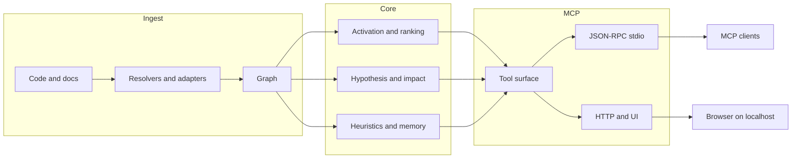

🇬🇧 [English](../README.md) | 🇧🇷 [Português](README.pt-BR.md) | 🇪🇸 [Español](README.es.md) | 🇮🇹 [Italiano](README.it.md) | 🇫🇷 [Français](README.fr.md) | 🇩🇪 [Deutsch](README.de.md) | 🇨🇳 [中文](README.zh.md) | 🇯🇵 [日本語](README.ja.md)

<p align="center">
  
</p>

<h3 align="center">Für Agenten gebaut. Menschen sind willkommen.</h3>

<p align="center">
  <strong>Bevor du Code änderst, sieh, was kaputtgeht.</strong><br/>
  <strong>Frag die Codebasis eine Frage. Hol dir die Karte, nicht das Labyrinth.</strong><br/><br/>
  m1nd gibt Coding-Agenten strukturelle Intelligenz, bevor sie in grep-/read-Drift verschwinden. Einmal ingestieren, in einen Graphen verwandeln und den Agenten fragen lassen, was wirklich zählt: was von dieser Änderung betroffen ist, was sonst noch mitzieht und was als Nächstes verifiziert werden sollte.<br/>
  <em>Lokale Ausführung. MCP über stdio. Optionale HTTP/UI-Oberfläche im aktuellen Standard-Build.</em>
</p>

<p align="center">
  <strong>Basierend auf aktuellem Code, Tests und ausgelieferten Tool-Oberflächen.</strong>
</p>

<p align="center">
  <a href="https://crates.io/crates/m1nd-core"></a>
  <a href="https://github.com/maxkle1nz/m1nd/actions"></a>
  <a href="../LICENSE"></a>
  <a href="https://docs.rs/m1nd-core"></a>
</p>

<p align="center">
  <a href="#identity">Identität</a> &middot;
  <a href="#what-m1nd-does">Was m1nd macht</a> &middot;
  <a href="#quick-start">Schnellstart</a> &middot;
  <a href="#anwendungsfalle">Anwendungsfälle</a> &middot;
  <a href="#wann-m1nd-nicht-verwendet-werden-sollte">Wann m1nd nicht verwenden</a> &middot;
  <a href="#configure-your-agent">Agent konfigurieren</a> &middot;
  <a href="#results-and-measurements">Ergebnisse</a> &middot;
  <a href="#operativer-workflow-fur-agenten">Operativer Workflow</a> &middot;
  <a href="#tool-surface">Tools</a> &middot;
  <a href="#mitwirken">Mitwirken</a> &middot;
  <a href="#lizenz">Lizenz</a> &middot;
  <a href="https://github.com/maxkle1nz/m1nd/wiki">Wiki</a> &middot;
  <a href="../EXAMPLES.md">Examples</a>
</p>

<h4 align="center">Funktioniert mit jedem MCP-Client</h4>

<p align="center">
  <a href="https://claude.ai/download"></a>
  <a href="https://cursor.sh"></a>
  <a href="https://codeium.com/windsurf"></a>
  <a href="https://github.com/features/copilot"></a>
  <a href="https://zed.dev"></a>
  <a href="https://github.com/cline/cline"></a>
  <a href="https://roocode.com"></a>
  <a href="https://github.com/continuedev/continue"></a>
  <a href="https://opencode.ai"></a>
  <a href="https://aws.amazon.com/q/developer"></a>
</p>

<p align="center">
  <strong>Findet strukturelle Bugs in &lt;1s</strong> &middot; 89% Hypothesengenauigkeit &middot; Reduziert LLM-Kontextkosten um 84%
</p>

<p align="center">
  
</p>

---

<a id="identity"></a>
## Identität

m1nd ist strukturelle Intelligenz für Coding-Agenten.

Einmal ingestieren, den Codebase-Graphen aufbauen und dem Agenten erlauben, strukturelle Fragen direkt zu stellen.

Vor einer Änderung hilft m1nd dem Agenten dabei, Auswirkungsradius, verbundene Kontexte, wahrscheinliche Co-Changes und die nächsten Verifikationsschritte zu sehen, bevor er sich in grep- und read-Loops verliert.

> Bezahle nicht in jeder Runde die Orientierungsteuer.
>
> `grep` findet, wonach du gefragt hast. `m1nd` findet, was du übersehen hast.

<a id="what-m1nd-does"></a>
## Was m1nd macht

m1nd ist ein lokaler Rust-Workspace mit drei Kern-Crates plus einer Hilfs-Bridge:

- `m1nd-core`: Graph-Engine, Ranking, Propagation, Heuristiken und Analyseschichten
- `m1nd-ingest`: Code- und Dokumenten-Ingestion, Extraktoren, Resolver, Merge-Pfade und Graph-Konstruktion
- `m1nd-mcp`: MCP-Server über stdio, plus eine HTTP/UI-Oberfläche im aktuellen Standard-Build
- `m1nd-openclaw`: Hilfs-Bridge-Crate für OpenClaw-bezogene Integrationsflächen

Aktuelle Stärken:

- graphengestützte Repo-Navigation
- verbundener Kontext für Änderungen
- Impact- und Erreichbarkeitsanalyse
- Stacktrace-zu-Suspect-Mapping
- strukturelle Prüfungen wie `missing`, `hypothesize`, `counterfactual` und `layers`
- persistente Sidecars für `boot_memory`, `trust`, `tremor` und `antibody`-Workflows

Aktueller Umfang:

- native/manuelle Extraktoren für Python, TypeScript/JavaScript, Rust, Go und Java
- 22 weitere tree-sitter-gestützte Sprachen über Tier 1 und Tier 2 hinweg
- Ingest-Adapter für Code, `memory`, `json` und `light`
- Cargo-Workspace-Anreicherung für Rust-Repos
- Heuristikzusammenfassungen auf chirurgischen und Planungs-Pfaden
- eine universelle Dokumenten-Lane für Markdown, HTML/Wiki-Seiten, Office-Dokumente und PDFs
- kanonische lokale Artefakte wie `source.<ext>`, `canonical.md`, `canonical.json`, `claims.json` und `metadata.json`
- dokumentbezogene MCP-Workflows wie `document_resolve`, `document_bindings`, `document_drift`, `document_provider_health` und `auto_ingest_*`

Die Sprachabdeckung ist breit, aber die Tiefe variiert weiterhin je nach Sprache. Python und Rust haben eine stärkere Behandlung als viele tree-sitter-gestützte Sprachen.

<a id="quick-start"></a>
## Schnellstart

```bash
git clone https://github.com/maxkle1nz/m1nd.git
cd m1nd
cargo build --release --workspace
./target/release/m1nd-mcp
```

Damit erhältst du einen funktionierenden lokalen Server aus dem Quellcode. Der aktuelle `main`-Branch wurde mit `cargo build --release --workspace` validiert und liefert einen funktionierenden MCP-Server-Pfad.

Minimaler MCP-Flow:

```jsonc
// 1. Den Graphen aufbauen
{"method":"tools/call","params":{"name":"ingest","arguments":{"path":"/your/project","agent_id":"dev"}}}

// 2. Nach verbundener Struktur fragen
{"method":"tools/call","params":{"name":"activate","arguments":{"query":"authentication flow","agent_id":"dev"}}}

// 3. Den Auswirkungsradius vor einer Dateänderung prüfen
{"method":"tools/call","params":{"name":"impact","arguments":{"node_id":"file::src/auth.rs","agent_id":"dev"}}}
```

Zu Claude Code hinzufügen (`~/.claude.json`):

```json
{
  "mcpServers": {
    "m1nd": {
      "command": "/path/to/m1nd-mcp",
      "env": {
        "M1ND_GRAPH_SOURCE": "/tmp/m1nd-graph.json",
        "M1ND_PLASTICITY_STATE": "/tmp/m1nd-plasticity.json"
      }
    }
  }
}
```

Funktioniert mit jedem MCP-Client, der sich mit einem MCP-Server verbinden kann: Claude Code, Codex, Cursor, Windsurf, Zed oder dein eigener.

Für größere Repos und dauerhafte Nutzung siehe [Deployment & Production Setup](../docs/deployment.md).

### Graph-First statt Text-First

Die meisten KI-Coding-Workflows verbringen immer noch viel Zeit mit Navigation: grep, glob, Dateilesen und wiederholtes Nachladen von Kontext. m1nd geht anders vor, indem es den Graphen vorab berechnet und diesen Graphen über MCP bereitstellt.

Dadurch verändert sich die Form der Frage. Statt das Modell jedes Mal die Repo-Struktur aus Rohdateien rekonstruieren zu lassen, kann der Agent nach Folgendem fragen:

- verbundene Code-Pfade
- Auswirkungsradius
- strukturelle Lücken
- Graph-Pfade zwischen Knoten
- verbundenen Kontext für eine Änderung

Das ersetzt weder ein LSP noch einen Compiler oder eine vollständige statische Analyse-/Security-Suite. Es gibt dem Agenten eine strukturelle Karte des Repos, damit er weniger Zeit mit Navigation und mehr Zeit mit der eigentlichen Aufgabe verbringt.

<a id="when-plain-tools-are-better"></a>
## Wann einfache Tools besser sind

Es gibt viele Aufgaben, bei denen m1nd unnötig ist und einfache Tools schneller sind.

- Einzeldatei-Änderungen, wenn du die Datei bereits kennst
- exakte String-Ersetzungen über ein ganzes Repo
- Zählen oder Greppen von Literaltext
- Compiler-Wahrheit, Testfehler, Runtime-Logs und Debugger-Arbeit

Nutze `rg`, deinen Editor, Logs, `cargo test`, `go test`, `pytest` oder den Compiler, wenn Ausführungstreue zählt. m1nd ist ein Navigations- und Strukturkontext-Tool, kein Ersatz für Runtime-Evidenz.

<a id="choose-the-right-tool"></a>
## Das richtige Tool wählen

Das ist der Teil, den die meisten READMEs auslassen. Wenn der Leser nicht weiß, wonach er greifen soll, fühlt sich die Oberfläche größer an, als sie ist.

| Was du brauchst | Nutze |
|------|-----|
| Exakter Text oder Regex im Code | `search` |
| Datei-/Pfadmuster | `glob` |
| Natürliche Sprachabsicht wie „wem gehört retry backoff?“ | `seek` |
| Verbundenes Nachbarschaftsbild zu einem Thema | `activate` |
| Schnelles Dateilesen ohne Graph-Erweiterung | `view` |
| Warum etwas als riskant oder wichtig eingestuft wurde | `heuristics_surface` |
| Auswirkungsradius vor einer Änderung | `impact` |
| Einen riskanten Änderungsplan vorab prüfen | `validate_plan` |
| Datei + Aufrufer + Callees + Tests für eine Änderung zusammenstellen | `surgical_context` |
| Die primäre Datei plus verbundene Dateiquellen in einem Zug laden | `surgical_context_v2` |
| Kleinen persistenten Betriebszustand speichern | `boot_memory` |
| Eine Untersuchungsspur speichern oder fortsetzen | `trail_save`, `trail_resume`, `trail_merge` |
| Eine Untersuchung fortsetzen und den nächsten wahrscheinlichen Schritt erhalten | `trail_resume` mit `resume_hints`, `next_focus_node_id`, `next_open_question` und `next_suggested_tool` |
| Verstehen, ob ein Tool noch triagiert, beweist oder bereits editierbar ist | `proof_state` auf `impact`, `trace`, `hypothesize`, `validate_plan` und `surgical_context_v2` |
| Wenn unklar ist, welches Tool passt oder wie man sich von einem Fehlaufruf erholt | `help` |

<a id="results-and-measurements"></a>
## Ergebnisse und Messungen

Diese Zahlen sind beobachtete Beispiele aus den aktuellen Repo-Dokus, Benchmarks und Tests. Betrachte sie als Referenzpunkte, nicht als Garantie für jedes beliebige Repo.

Fallstudien-Audit an einer Python/FastAPI-Codebasis:

| Metrik | Ergebnis |
|--------|--------|
| Bugs in einer Sitzung gefunden | 39 (28 bestätigt behoben + 9 mit hoher Sicherheit) |
| Für grep unsichtbar | 8 von 28 |
| Hypothesen-Genauigkeit | 89% über 10 Live-Behauptungen |
| Stichprobe der Nachvalidierung nach dem Schreiben | 12/12 Szenarien im dokumentierten Satz korrekt klassifiziert |
| Vom Graph-Engine selbst verbrauchte LLM-Token | 0 |
| Beispielhafte Anzahl von Abfragen vs. grep-lastigem Loop | 46 vs. ~210 |
| Geschätzte gesamte Abfrage-Latenz in der dokumentierten Sitzung | ~3.1 Sekunden |

Mikro-Benchmarks nach Kriterium, die in den aktuellen Dokus erfasst wurden:

| Operation | Zeit |
|-----------|------|
| `activate` 1K nodes | 1.36 &micro;s |
| `impact` depth=3 | 543 ns |
| `flow_simulate` 4 particles | 552 &micro;s |
| `antibody_scan` 50 patterns | 2.68 ms |
| `layers` 500 nodes | 862 &micro;s |
| `resonate` 5 harmonics | 8.17 &micro;s |

Diese Zahlen sind vor allem dann wichtig, wenn sie mit dem Workflow-Nutzen zusammengedacht werden: weniger Hin-und-her zwischen grep/read-Loops und weniger Kontext, der in das Modell geladen werden muss.

Im heute dokumentierten aggregierten Warm-Graph-Korpus sinkt `warm` von `10518` auf `5182` Proxy-Tokens (`50.73%` Ersparnis), reduziert `false_starts` von `14` auf `0`, verzeichnet `31` guided follow-throughs und `12` erfolgreich befolgte recovery loops.

<a id="configure-your-agent"></a>
## Den Agenten konfigurieren

m1nd funktioniert am besten, wenn dein Agent es als erste Anlaufstelle für Struktur und verbundenen Kontext behandelt, nicht als einziges Tool, das er verwenden darf.

### Was du dem System-Prompt deines Agenten hinzufügen solltest

```text
Nutze m1nd vor breiten grep/glob/Dateilese-Loops, wenn die Aufgabe von Struktur, Impact, verbundenem Kontext oder dateiübergreifendem Reasoning abhängt.

- nutze `search` für exakten Text oder Regex mit graphbewusstem Scope
- nutze `glob` für Dateinamen- und Pfadmuster
- nutze `seek` für Intention in natürlicher Sprache
- nutze `activate` für verbundene Nachbarschaften
- nutze `impact` vor riskanten Änderungen
- nutze `heuristics_surface`, wenn du eine Ranking-Begründung brauchst
- nutze `validate_plan` vor breiten oder gekoppelten Änderungen
- nutze `surgical_context_v2`, wenn du einen Multi-Datei-Edit vorbereitest
- nutze `boot_memory` für kleinen persistenten Betriebszustand
- nutze `help`, wenn du nicht sicher bist, welches Tool passt

Nutze einfache Tools, wenn die Aufgabe single-file, textgenau oder von Runtime-/Build-Wahrheit getrieben ist.
```

### Claude Code (`CLAUDE.md`)

```markdown
## Code Intelligence
Nutze m1nd vor breiten grep/glob/Dateilese-Loops, wenn die Aufgabe von Struktur, Impact, verbundenem Kontext oder dateiübergreifendem Reasoning abhängt.

Greife zu:
- `search` für exakten Code/Text
- `glob` für Dateinamenmuster
- `seek` für Intention
- `activate` für verwandten Code
- `impact` vor Änderungen
- `validate_plan` vor riskanten Änderungen
- `surgical_context_v2` zur Vorbereitung von Multi-Datei-Edits
- `heuristics_surface` zur Ranking-Erklärung
- `trail_resume` für Kontinuität, wenn du den nächsten wahrscheinlichen Schritt brauchst
- `help`, um das richtige Tool zu wählen oder dich von einem Fehlaufruf zu erholen

Nutze einfache Tools für Single-File-Edits, exakte Textaufgaben, Tests, Compilerfehler und Runtime-Logs.
```

### Cursor (`.cursorrules`)

```text
Prefer m1nd for repo exploration when structure matters:
- search for exact code/text
- glob for filename/path patterns
- seek for intent
- activate for related code
- impact before edits

Prefer plain tools for single-file edits, exact string chores, and runtime/build truth.
```

### Warum das wichtig ist

Das Ziel ist nicht „immer m1nd benutzen“. Das Ziel ist: „m1nd dann benutzen, wenn es dem Modell erspart, die Repo-Struktur jedes Mal neu aus dem Nichts zu rekonstruieren.“

Das bedeutet meist:

- vor einer riskanten Änderung
- bevor ein breiter Bereich des Repos gelesen wird
- beim Triage eines Fehlerpfads
- beim Prüfen architektonischer Auswirkungen

## Wo m1nd hingehört

m1nd ist am nützlichsten, wenn ein Agent graphengestützten Repo-Kontext braucht, den einfache Textsuche nicht gut liefert:

- persistenter Graphenzustand statt einmaliger Suchergebnisse
- Impact- und Nachbarschaftsabfragen vor Änderungen
- gespeicherte Untersuchungen über Sitzung hinweg
- strukturelle Prüfungen wie Hypothesentests, Counterfactual-Entfernung und Layer-Inspektion
- gemischte Code- und Doku-Graphen über die Adapter `memory`, `json` und `light`

Es ist kein Ersatz für ein LSP, einen Compiler oder Runtime-Observability. Es gibt dem Agenten eine Strukturkarte, damit Exploration günstiger und Änderungen sicherer werden.

## Was es besonders macht

**Es hält einen persistierenden Graphen, nicht nur Suchergebnisse.** Bestätigte Pfade können mit `learn` verstärkt werden, und spätere Abfragen können diese Struktur wiederverwenden, statt bei null zu starten.

**Es kann erklären, warum etwas gerankt wurde.** `heuristics_surface`, `validate_plan`, `predict` und chirurgische Flows können Heuristikzusammenfassungen und Hotspot-Referenzen sichtbar machen, statt nur einen Score zurückzugeben.

**Es kann Code und Doku in denselben Suchraum bringen.** Code, Markdown-Memory, strukturiertes JSON und L1GHT-Dokumente können in denselben Graphen ingestiert und gemeinsam abgefragt werden.

**Es hat write-aware Workflows.** `surgical_context_v2`, `edit_preview`, `edit_commit` und `apply_batch` sind sinnvoller als Vorbereitungs- und Verifikationswerkzeuge für Änderungen denn als generische Suchwerkzeuge.

<a id="operativer-workflow-fur-agenten"></a>
## Operativer Workflow für Agenten

m1nd macht einen bevorzugten Bewegungsablauf für Agenten sichtbar. Der im Server eingebettete `M1ND_INSTRUCTIONS`-Block beschreibt eine empfohlene Choreografie:

- **Sitzungsstart**: `health -> drift -> ingest`
- **Recherche**: `ingest -> activate -> why -> missing -> learn`
- **Codeänderung**: `impact -> predict -> counterfactual -> warmup -> surgical/apply`
- **Zustandsorientierte Navigation**: `perspective_*` und `trail_*`
- **Kanonischer Hot State**: `boot_memory`

Das ist wichtig, weil m1nd nicht nur ein Such-Endpunkt ist. Es ist eine opinionated Graph-Operationsschicht für Agenten, und sie funktioniert am besten, wenn der Graph Teil des Workflows wird statt nur die letzte Rettung zu sein.

<a id="tool-surface"></a>
## Tool-Oberfläche

Verwende `tools/list` für die exakte Live-Anzahl in deinem aktuellen Build. Die Kategorien darunter sind wichtiger als eine fest codierte Zahl.

Kanonische Tool-Namen im exportierten MCP-Schema verwenden Unterstriche, etwa `trail_save`, `perspective_start` und `apply_batch`. Manche Clients zeigen Aliasnamen mit Transportpräfix an, aber Live-Registry und `tools/list` verwenden die nackten Namen.

| Kategorie | Highlights |
|----------|------------|
| Grundlagen | ingest, activate, impact, why, learn, drift, seek, search, glob, view, warmup, federate |
| Dokumentintelligenz | document_resolve, document_bindings, document_drift, document_provider_health, auto_ingest_start/status/tick/stop |
| Perspektivennavigation | perspective_start, perspective_follow, perspective_peek, perspective_branch, perspective_compare, perspective_inspect, perspective_suggest |
| Graphanalyse | hypothesize, counterfactual, missing, resonate, fingerprint, trace, predict, validate_plan, trail_* |
| Erweiterte Analyse | antibody_*, flow_simulate, epidemic, tremor, trust, layers, layer_inspect |
| Berichte & Zustand | report, savings, persist, boot_memory |
| Surgical | surgical_context, surgical_context_v2, heuristics_surface, apply, edit_preview, edit_commit, apply_batch |

<details>
<summary><strong>Grundlagen</strong></summary>

| Tool | Was es tut | Geschwindigkeit |
|------|-------------|----------------|
| `ingest` | Eine Codebasis oder ein Korpus in den Graphen parsen | 910ms / 335 files |
| `search` | Exakter Text oder Regex mit graphbewusster Scope-Behandlung | variiert |
| `glob` | Datei-/Pfadpattern-Suche | variiert |
| `view` | Schnelles Dateilesen mit Zeilenbereichen | variiert |
| `seek` | Code nach natürlicher Sprachabsicht finden | 10-15ms |
| `activate` | Verbundene Nachbarschaft abrufen | 1.36 &micro;s (Benchmark) |
| `impact` | Auswirkungsradius einer Codeänderung | 543ns (Benchmark) |
| `why` | Kürzester Pfad zwischen zwei Knoten | 5-6ms |
| `learn` | Feedback-Schleife, die nützliche Pfade verstärkt | <1ms |
| `drift` | Was sich seit einem Baseline-Zeitpunkt verändert hat | 23ms |
| `health` | Serverdiagnostik | <1ms |
| `warmup` | Den Graphen für eine bevorstehende Aufgabe primen | 82-89ms |
| `federate` | Mehrere Repos zu einem Graphen vereinen | 1.3s / 2 repos |
</details>

<details>
<summary><strong>Perspektivennavigation</strong></summary>

| Tool | Zweck |
|------|------|
| `perspective_start` | Eine an einen Knoten oder eine Query angeheftete Perspektive öffnen |
| `perspective_routes` | Routen vom aktuellen Fokus auflisten |
| `perspective_follow` | Den Fokus zu einem Routen-Ziel verschieben |
| `perspective_back` | Rückwärts navigieren |
| `perspective_peek` | Quellcode am fokussierten Knoten lesen |
| `perspective_inspect` | Tiefergehende Routen-Metadaten und Score-Aufschlüsselung |
| `perspective_suggest` | Navigations-Empfehlung |
| `perspective_affinity` | Die Relevanz einer Route für die aktuelle Untersuchung prüfen |
| `perspective_branch` | Eine unabhängige Kopie der Perspektive abzweigen |
| `perspective_compare` | Zwei Perspektiven diffen |
| `perspective_list` | Aktive Perspektiven auflisten |
| `perspective_close` | Perspektivenzustand freigeben |
</details>

<details>
<summary><strong>Graphanalyse</strong></summary>

| Tool | Was es tut | Geschwindigkeit |
|------|-------------|----------------|
| `hypothesize` | Eine strukturelle Behauptung gegen den Graphen testen | 28-58ms |
| `counterfactual` | Knotenentfernung und Kaskade simulieren | 3ms |
| `missing` | Strukturelle Lücken finden | 44-67ms |
| `resonate` | Strukturelle Hubs und Harmonien finden | 37-52ms |
| `fingerprint` | Strukturelle Zwillinge über die Topologie finden | 1-107ms |
| `trace` | Stacktraces auf wahrscheinliche strukturelle Ursachen abbilden | 3.5-5.8ms |
| `validate_plan` | Änderungsrisiko vorab prüfen, inklusive Hotspot-Referenzen | 0.5-10ms |
| `predict` | Co-Change-Vorhersage mit Ranking-Begründung | <1ms |
| `trail_save` | Untersuchungszustand persistieren | ~0ms |
| `trail_resume` | Eine gespeicherte Untersuchung wiederherstellen und den nächsten Schritt vorschlagen | 0.2ms |
| `trail_merge` | Mehragenten-Untersuchungen zusammenführen | 1.2ms |
| `trail_list` | Gespeicherte Untersuchungen durchsuchen | ~0ms |
| `differential` | Strukturelles Diff zwischen Graph-Snapshots | variiert |
</details>

<details>
<summary><strong>Erweiterte Analyse</strong></summary>

| Tool | Was es tut | Geschwindigkeit |
|------|-------------|----------------|
| `antibody_scan` | Graph gegen gespeicherte Bug-Muster scannen | 2.68ms |
| `antibody_list` | Gespeicherte Antikörper mit Trefferhistorie auflisten | ~0ms |
| `antibody_create` | Einen Antikörper erstellen, deaktivieren, aktivieren oder löschen | ~0ms |
| `flow_simulate` | Gleichzeitigen Ausführungsfluss simulieren | 552 &micro;s |
| `epidemic` | SIR-basierte Vorhersage der Bug-Ausbreitung | 110 &micro;s |
| `tremor` | Beschleunigte Änderungsfrequenz erkennen | 236 &micro;s |
| `trust` | Vertrauenswert pro Modul auf Basis der Defekt-Historie | 70 &micro;s |
| `layers` | Architekturelle Layer und Verstöße automatisch erkennen | 862 &micro;s |
| `layer_inspect` | Einen bestimmten Layer inspizieren | variiert |
</details>

<details>
<summary><strong>Surgical</strong></summary>

| Tool | Was es tut | Geschwindigkeit |
|------|-------------|----------------|
| `surgical_context` | Primäre Datei plus Aufrufer, Callees, Tests und Heuristikzusammenfassung | variiert |
| `heuristics_surface` | Erklären, warum eine Datei oder ein Knoten als riskant oder wichtig eingestuft wurde | variiert |
| `surgical_context_v2` | Primäre Datei plus verbundene Dateiquellen in einem Aufruf | 1.3ms |
| `edit_preview` | Eine Änderung in-memory vorschauen, ohne auf die Platte zu schreiben | <1ms |
| `edit_commit` | Eine vorgesehene Änderung mit Freshness-Prüfung committen | <1ms + apply |
| `apply` | Eine Datei schreiben, erneut ingestieren und den Graphenzustand aktualisieren | 3.5ms |
| `apply_batch` | Mehrere Dateien atomar mit einem einzigen Re-Ingest-Pass schreiben | 165ms |
| `apply_batch(verify=true)` | Batch-Write plus Nachverifikation und hotspot-bewusste Bewertung | 165ms + verify |
</details>

<details>
<summary><strong>Berichte & Zustand</strong></summary>

| Tool | Was es tut | Geschwindigkeit |
|------|-------------|----------------|
| `report` | Sitzungbericht mit letzten Queries, Einsparungen, Graph-Statistiken und Heuristik-Hotspots | ~0ms |
| `savings` | Zusammenfassung der Token-, CO2- und Kosteneinsparungen pro Sitzung und global | ~0ms |
| `persist` | Graph- und Plastizitäts-Snapshots speichern/laden | variiert |
| `boot_memory` | Kleine kanonische Doctrine oder Betriebszustände persistieren und im Runtime-Gedächtnis warm halten | ~0ms |
</details>

[Vollständige API-Referenz mit Beispielen ->](https://github.com/maxkle1nz/m1nd/wiki/API-Reference)

## Nachschreib-Verifikation

`apply_batch` mit `verify=true` führt mehrere Verifikationsschichten aus und gibt eine einzige SAFE-/RISKY-/BROKEN-artige Bewertung zurück.

Wenn `verification.high_impact_files` Heuristik-Hotspots enthält, kann der Bericht auf `RISKY` hochgestuft werden, selbst wenn der reine Auswirkungsradius niedriger geblieben wäre.

`apply_batch` liefert jetzt außerdem:

- `status_message` und grobe Fortschrittsfelder
- `proof_state` plus `next_suggested_tool`, `next_suggested_target` und `next_step_hint`
- `phases` als strukturierte Timeline von `validate`, `write`, `reingest`, `verify` und `done`
- `progress_events` als streaming-freundliches Protokoll desselben Zyklus
- im HTTP/UI-Transport Live-SSE-Fortschritt über `apply_batch_progress`, gefolgt von einem semantischen Handoff am Batch-Ende

```jsonc
{
  "method": "tools/call",
  "params": {
    "name": "apply_batch",
    "arguments": {
      "agent_id": "my-agent",
      "verify": true,
      "edits": [
        { "file_path": "/project/src/auth.py", "new_content": "..." },
        { "file_path": "/project/src/session.py", "new_content": "..." }
      ]
    }
  }
}
```

Die Schichten umfassen:

- strukturelle Diff-Prüfungen
- Analyse von Anti-Patterns
- Graph-BFS-Auswirkung
- Projekttest-Ausführung
- Compile-/Build-Prüfungen

Der Punkt ist nicht „formaler Beweis“. Der Punkt ist, offensichtliche Defekte und riskante Ausbreitung zu erkennen, bevor der Agent weiterzieht.

## Architektur

Drei Rust-Crates. Lokale Ausführung. Keine API-Schlüssel für den Kern-Serverpfad erforderlich.

```text
m1nd-core/     Graph-Engine, Propagation, Heuristiken, Hypothesen-Engine,
               Antibody-System, Flusssimulator, Epidemic, Tremor, Trust, Layers
m1nd-ingest/   Sprach-Extraktoren, memory/json/light-Adapter,
               Git-Anreicherung, Cross-File-Resolver, inkrementelles Diff
m1nd-mcp/      MCP-Server, JSON-RPC über stdio, plus HTTP/UI-Unterstützung im aktuellen Standard-Build
```



Die Sprachanzahl ist groß, aber die Tiefe variiert je nach Sprache. Details zu den Adaptern findest du im Wiki.

<a id="wann-m1nd-nicht-verwendet-werden-sollte"></a>
## Wann m1nd nicht verwendet werden sollte

- **Wenn du ein embedding-first Suchsystem als primäre Suchmaschine brauchst.** m1nd hat semantische und intent-basierte Suche (`seek`, hybride semantische Indizes, Graph-Re-Ranking), ist aber auf strukturelle Erdung statt auf rein embedding-first Suche optimiert.
- **Wenn du 400K+ Dateien hast und das billig wirken soll.** Der Graph ist weiterhin im Speicher. Das kann in dieser Größenordnung funktionieren, aber m1nd ist für Repos optimiert, bei denen Orientierungsgeschwindigkeit wichtiger ist als extreme Graph-Dichte.
- **Wenn du CodeQL-artige Dataflow-Garantien auf Variablenebene brauchst.** m1nd hat inzwischen flow- und taint-orientierte Fähigkeiten, sollte aber dedizierte SAST-/Dataflow-Tools für formale Sicherheitsanalysen ergänzen, nicht ersetzen.
- **Wenn du SSA-artige Propagation auf Argument-für-Argument-Basis brauchst.** m1nd verfolgt Dateien, Symbole, Aufrufe, Nachbarschaften, chirurgischen Edit-Kontext und Graph-Pfade gut; es ist aber keine Compiler-grade Value-Flow-Engine.
- **Wenn du Indexing im Tastaturtempo bei jedem Speichern brauchst.** Ingest ist schnell, aber m1nd ist weiterhin Session-Level-Intelligenz, keine Infrastruktur für jeden Editor-Keystroke. Dafür ist dein LSP da.

<a id="anwendungsfalle"></a>
## Anwendungsfälle

**Bug-Hunt:** Starte mit `hypothesize` -> `missing` -> `flow_simulate` -> `trace`.
Im dokumentierten Audit-Workflow reduzierte das grep-lastige Exploration und machte Probleme sichtbar, die reine Textsuche verfehlte. [Fallstudie ->](../EXAMPLES.md)

**Pre-Deploy-Gate:** `antibody_scan` -> `validate_plan` -> `epidemic`.
Scannt nach bekannten Bug-Mustern, bewertet den Auswirkungsradius und sagt die Ausbreitung voraus.

**Architektur-Audit:** `layers` -> `layer_inspect` -> `counterfactual`.
Erkennt Layer automatisch, findet Verstöße und simuliert, was beim Entfernen eines Moduls bricht.

**Onboarding:** `activate` -> `layers` -> `perspective_start` -> `perspective_follow`.
Neue Teammitglieder fragen: „Wie funktioniert Auth?“ und der Graph beleuchtet den Pfad.

**Cross-Domain-Suche:** `ingest(adapter="memory", mode="merge")` -> `activate`.
Code und Doku in einem Graphen. Eine Frage liefert Spezifikation und Implementierung zusammen.

**Sichere Multi-Datei-Änderung:** `surgical_context_v2` -> `apply_batch(verify=true)`.
Mehrere Dateien auf einmal schreiben. Vor CI einen SAFE/RISKY/BROKEN-Befund bekommen.

<a id="mitwirken"></a>
## Mitwirken

m1nd ist noch jung und bewegt sich schnell. Beiträge sind willkommen:
Sprach-Extraktoren, Graph-Algorithmen, MCP-Tools und Benchmarks.
Siehe [CONTRIBUTING.md](CONTRIBUTING.md).

<a id="lizenz"></a>
## Lizenz

MIT -- siehe [LICENSE](../LICENSE).

---

<p align="center">
  Erstellt von <a href="https://github.com/maxkle1nz">Max Elias Kleinschmidt</a><br/>
  <em>KI sollte verstärken, niemals ersetzen. Mensch und Maschine in Symbiose.</em><br/>
  <em>Wenn du es träumen kannst, kannst du es bauen. m1nd verkürzt den Abstand.</em>
</p>
