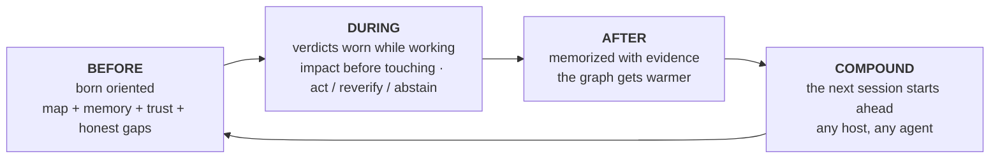

🇬🇧 [English](../README.md) | 🇧🇷 [Português](README.pt-BR.md) | 🇪🇸 [Español](README.es.md) | 🇮🇹 [Italiano](README.it.md) | 🇫🇷 [Français](README.fr.md) | 🇩🇪 [Deutsch](README.de.md) | 🇨🇳 [中文](README.zh.md) | 🇯🇵 [日本語](README.ja.md)

<p align="center">
  
</p>

<h1 align="center">Operational Intelligence für Coding-Agenten</h1>

<p align="center">
  <strong>Dein Coding-Agent hört auf, blind zu starten.</strong><br/>
  <em>Local-first. MCP-native. Graph-Gedächtnis, Trust und Change-Reasoning für Agent-Hosts.</em>
</p>

<p align="center">
  <a href="https://www.npmjs.com/package/@maxkle1nz/m1nd"></a>
  <a href="https://crates.io/crates/m1nd-core"></a>
  <a href="https://github.com/maxkle1nz/m1nd/actions"></a>
  <a href="../LICENSE"></a>
  <a href="https://docs.rs/m1nd-core"></a>
</p>

<p align="center">
  <a href="https://github.com/openai/codex"></a>
  <a href="https://claude.ai/download"></a>
  <a href="https://cursor.sh"></a>
  <a href="https://codeium.com/windsurf"></a>
  <a href="https://github.com/features/copilot"></a>
  <a href="https://zed.dev"></a>
  <a href="https://github.com/cline/cline"></a>
  <a href="https://roocode.com"></a>
  <a href="https://github.com/continuedev/continue"></a>
  <a href="https://opencode.ai"></a>
  <a href="https://aistudio.google.com"></a>
  <a href="https://aws.amazon.com/q/developer"></a>
</p>

---

**m1nd ist die Hülle um deinen Coding-Agenten — die Betriebsschleife, in der er lebt: orientiert, bevor er handelt, ehrliche Verdikte, während er arbeitet, Gedächtnis mit Evidenz, nachdem er fertig ist, aufbauend über Sessions hinweg.**

<p align="center"></p>

> grep findet Text. Vektorsuche findet ähnliche Chunks. `m1nd` gibt Agenten einen lokalen Graphen davon, was verbunden ist, was sich geändert hat, was bricht, was gedriftet ist, und wo weiterzumachen ist.

## Was m1nd ist: die Hülle um deinen Agenten

*m1nd umhüllt deinen Coding-Agenten mit einer Schleife, die ihn orientiert, bevor er handelt, ihn ehrlich hält, während er arbeitet, und sich merkt, was er gelernt hat, wenn er fertig ist.*

- **Wenn du mit Agenten baust** — nichts Neues zu lernen: einmal installieren und weiter mit deinem Agenten reden. Er hört auf zu raten, fängt an, sich zu erinnern, und sagt „ich weiß es nicht", wenn das die Wahrheit ist.
- **Wenn du Ingenieur bist** — eine local-first Rust-Graph-Engine hinter einem MCP-Server: ein kausaler Code-Graph (strukturelle, semantische, zeitliche und kausale Kanten), konform kalibrierte Verdikte, und Gedächtnis, das mit Provenienz an Code-Knoten verankert ist. Nichts verlässt deine Maschine.

Agenten auf echten Codebasen scheitern nicht, weil sie nicht suchen können — sie scheitern, weil sie kein operatives Modell haben. Jede Session baut den Kontext von Grund auf neu auf, editiert ohne den Blast Radius zu kennen, und kann ein leeres Ergebnis, das „nichts existiert" bedeutet, nicht von einem unterscheiden, das „falsches Repo" bedeutet. m1nd gibt dem Agenten ein dauerhaftes Modell der Codebasis — einen kausalen Graphen mit Spreading Activation und Hebbianischer Plastizität — und legt die gesamte Schleife des Agenten darum. Die Features sind hier kein Katalog; sie sind die Stationen dieser Hülle:


```mermaid
flowchart LR
    B["<b>BEFORE</b><br/>born oriented<br/>map + memory + trust + honest gaps"]
    D["<b>DURING</b><br/>verdicts worn while working<br/>impact before touching · act / reverify / abstain"]
    A["<b>AFTER</b><br/>memorized with evidence<br/>the graph gets warmer"]
    C["<b>COMPOUND</b><br/>the next session starts ahead<br/>any host, any agent"]
    B --> D --> A --> C --> B
```

**m1nd wird von deinem Agenten bedient, nicht von dir.** Jedes Tool unten wird vom Agenten selbst aufgerufen — automatisch, vor und nach seiner Arbeit. Ein Mensch führt sie im normalen Gebrauch nie aus; du installierst einmal ([Schnellstart](#schnellstart)) und redest weiter mit deinem Agenten wie immer.

**Eine Hülle, drei Leser.** Dasselbe orientierte Paket wird für den gerendert, der gleich handelt: der **Haupt-Agent** liest es als `north` (ausgeliefert — die Eingangstür unten); ein **Subagent** wird es als das Delegation Packet erhalten, die Retrieval-Hälfte seiner Spawn-Spec (entworfen — [docs/NEXTGEN-AGENT-PRD.md](../docs/NEXTGEN-AGENT-PRD.md), §O.12); der **Mensch** wird es als die Pre-Flight Card auf dem Living Tree sehen — dein Projekt als navigierbarer Baum mit Gedächtnis-Post-its, der zeigt, was der Agent verifiziert vs. geraten hat, bevor eine Änderung landet (entworfen, in Entwicklung — [docs/HUMAN-LAYER-PRD.md](../docs/HUMAN-LAYER-PRD.md)). Eine Wahrheit, einmal berechnet.

<p align="center"></p>

<p align="center">
  
</p>

### Was passiert, wenn du eine Nachricht schickst

Du bittest deinen Agenten, etwas zu reparieren. Das macht die Hülle um diese Nachricht herum:

1. **Bevor dein Agent handelt**, reicht m1nd ihm die lebende Karte deines Projekts, was vergangene Sessions gelernt haben, wie sehr jedem Teil zu vertrauen ist — und was es *nicht* weiß (`north`).
2. **Während er arbeitet**, trägt er Verdikte: er prüft, was eine Änderung kaputt machen würde, *bevor* er den Code anfasst (`impact`), und wo die Evidenz dünn ist, bekommt er ein ehrliches „ich weiß es nicht" statt einer selbstbewussten Vermutung (`abstain`).
3. Er kann fragen, warum zwei Code-Teile verbunden sind, und gewarnt werden, wenn die Antwort auf einer Vermutung ruht (`why`), und er wird alarmiert, bevor er eine Architekturgrenze überschreitet (`xray_gate`).
4. **Wenn er fertig ist**, wird die Entscheidung zusammen mit der Evidenz, die sie stützt, festgehalten (`memorize`).
5. Dieses Gedächtnis ist am echten Code verankert — ändert sich der Code später, markiert sich das Gedächtnis selbst als veraltet, anstatt still zu lügen (`cross_verify`).
6. **Deine nächste Session startet bereits wissend** — jeder Agent, jedes Tool: Claude Code, Codex, Cursor, Gemini. Was ein Agent lernt, erbt der nächste.

## BEFORE — orientiert geboren

*Dein Agent beginnt jede Session, indem er dein Projekt bereits kennt — und weiß, was er nicht weiß.*

<p align="center"></p>

Innerhalb einer MCP-Session ist die Eingangstür ein einziger Aufruf — `north(task)` komponiert Trust, Task-Kontext (Focus-Knoten + PageRank-Anker), vorheriges Cross-Session-Gedächtnis, ein Suffizienz-Signal, einen `next_move` und `honest_gaps` (was m1nd noch *nicht* weiß) zu einem einzigen Paket, vor jeder Query:

```jsonc
{"method":"tools/call","params":{"name":"north",
  "arguments":{"agent_id":"dev","task":"harden the JWT auth token validation flow"}}}
```

Die Antwort ist ein orientiertes Paket — Trust-Verdikt, das Gedächtnis, das die letzte Session hinterlassen hat, und eine ehrliche Lückenliste. Eine echte Aufnahme vom `main`-Binary, leicht gekürzt:

```jsonc
{
  "binding": { "trust_mode": "full_trust", "ok": true },      // verdict before retrieval
  "memory": [                                                 // recalled from a PRIOR session
    { "claim": "AuthTokenFlow", "source_agent": "authbot", "age_ms": 221, "stale": false }
    // …other claims from the same authored note, trimmed…
  ],
  "sufficiency": { "state": "gathering", "top_score": 0.64,
    "why": "the strongest match left out still scores 0.30 — relevant context did not fit …" },
  "next_move": "Call `surgical_context` on the top focus node to ground the task before editing.",
  "honest_gaps": []                                           // nothing withheld on this graph
}
```

`north` komponiert `trust_selftest` + `orient` + `boot_memory` + `focus` — der Agent greift nur dann direkt zu einem Einzelteil, wenn er genau eines braucht. `focus` ist die Attention-Runtime dieser Station: das minimale, budget-begrenzte Working Set für ein Ziel, mit einem ehrlichen Rest dessen, was es weggelassen hat, und einem Signal dafür, ob das schon *genug* Kontext ist. `needs_ingest` ist eine echte Antwort für einen leeren Graphen.

Meldet `north` `needs: "needs_ingest"`, oder läufst du auf einem Binary vor 1.2.1 ohne die L1GHT-Recall-Komposition, fällt der Agent auf die explizite Trust-Schleife zurück — Trust *vor* dem Vertrauen in irgendein Retrieval herstellen:

```jsonc
// 0. Trust the binding in one call (verdict before retrieval)
{"method":"tools/call","params":{"name":"trust_selftest","arguments":{"agent_id":"dev"}}}

// 1. If the verdict is not full_trust, ask for the deterministic recovery path
{"method":"tools/call","params":{"name":"recovery_playbook","arguments":{"agent_id":"dev"}}}

// 2. Build graph truth
{"method":"tools/call","params":{"name":"ingest","arguments":{"path":"/your/project","agent_id":"dev"}}}

// 3. Ask a structural question — empty results say *why*, never just "no results"
{"method":"tools/call","params":{"name":"activate","arguments":{"query":"authentication flow","agent_id":"dev"}}}
```

**Erste-Session-Schleife, in vier Zügen:** `north` (oder `trust_selftest` → `ingest`) → `seek`/`audit` → `memorize` das dauerhafte Ergebnis, damit die nächste Session voraus startet.

## DURING — Verdikte, getragen während der Arbeit

*Während er arbeitet, kommt jede Antwort mit der Angabe, wie sehr ihr zu vertrauen ist — und „ich weiß es nicht" ist eine echte Antwort.*

<p align="center"></p>

Der Agent konsultiert m1nd nicht; er trägt es. Jede Antwort mitten in der Arbeit ist ein kalibriertes Verdikt, kein Bauchgefühl:

- **`impact` vor dem Anfassen** zeigt den Blast Radius, den du nicht gelesen hast; `ghost_edges` bringt Dateien ans Licht, die sich immer zusammen ändern, aber keinen Import teilen.
- **`why` trägt ein `closure`-Verdikt** — `blocked` bedeutet, der Pfad ruht auf einer unaufgelösten oder geratenen Kante: verifiziere diese Kante, bevor du dich auf den Pfad verlässt.
- **`predict` ist konform kalibriert** — `calibrate_predict` schärft ein Pro-Repo-Gate; Verdikte lesen sich dann als `act` / `reverify` / `abstain`, wobei `abstain` *unkalibriert oder unzureichend* bedeutet — ein Signal zum Anhalten, kein schwaches Ja. Wird dunkel ausgeliefert: bis du kalibrierst, deckeln Verdikte bei `reverify`. Co-Change-Kopplung wird geglättet-Jaccard-normalisiert, keine rohen Commit-Zählungen (kalibrierungsbewiesen +3 Punkte). *Vorbehalt:* `predict` hat nur strukturellen Fallback, bis `ghost_edges` die Git-Co-Change-Matrix lädt — führe es zuerst aus für echte Co-Change-Wahrscheinlichkeit.
- **`xray_gate` bewacht Architekturgrenzen** — vor einer Änderung aufgerufen, beantwortet es „überschreitet diese Änderung eine verbotene Modulgrenze?" mit `clear` / `caution` / `blocked`; nur ein ratifiziertes Manifest kann blockieren (Anti-Guardrail-Müdigkeit).
- **Mission Control ist Beweisdisziplin** — `mission_next` gibt genau einen Zug plus `do_not`-Guardrails zurück; im `bug_hunt`-Modus ist ein abschließender direkter Sweep vor dem Schließen erforderlich, damit Agenten den Negativraum prüfen.

Dieselbe Ehrlichkeit begleitet das Retrieval. Ein `seek`-Treffer trägt eine `sufficiency`-Anzeige und einen `trust_envelope` — und wenn der Envelope noch keine gemessene Kalibrierungszeile hat, deckelt er sein eigenes Verdikt, anstatt zu übertreiben. Eine echte Aufnahme, gekürzt (der Top-Treffer ist ein Gedächtnis, das die letzte Session verfasst hat):

```jsonc
{
  "results": [
    { "label": "AuthTokenFlow", "source_agent": "authbot", "authored_ms_ago": 101161, "score": 0.48 }
    // …code-node hits, trimmed…
  ],
  "sufficiency": { "state": "gathering", "top_score": 0.48,
    "why": "the strongest match left out still scores 0.25 — relevant context did not fit …" },
  "trust_envelope": {
    "calibrated": false,               // no calibration row measured
    "verdict": "reverify",             // …so the verdict is capped below `act`
    "next_repair_call": "trust_selftest"
  }
}
```

<p align="center"></p>

## AFTER — der Graph wird wärmer

*Wenn die Arbeit landet, wird das Gelernte mit der Evidenz festgehalten, die es stützt — und es bleibt ehrlich, wenn der Code weiterzieht.*

<p align="center"></p>

Die meisten Tools geben einem Agenten besseres *Retrieval*. An dieser Station **verfasst der Agent dauerhafte, maschinenlesbare Erkenntnisse**, die sich über Sessions hinweg aufbauen und gegenüber dem Code ehrlich bleiben. L1GHT verwandelt verfasstes Wissen in graph-native Struktur, die sich selbst markiert, wenn sich der Code ändert, den es zitiert — sichere Behauptungen verbreiten mehr Aktivierung als unsichere.

1. **Schlussfolgern** — der Agent erreicht etwas Dauerhaftes (eine Entscheidung, ein verifiziertes Ergebnis, warum Code so ist wie er ist) und ruft `memorize` mit strukturierten Behauptungen und `evidence`-Pfaden auf.

```jsonc
memorize({
  "agent_id": "authbot",
  "node_label": "AuthTokenFlow",
  "claims": [
    { "label": "TokenValidator",
      "text": "TokenValidator validates JWTs via HMAC — rotate keys via KMS only",
      "confidence": "high", "evidence": ["src/auth/token.rs"] }
  ]
})
```

Der Aufruf liefert den Beweis, dass es gelandet ist — dies ist eine echte aufgenommene Antwort, gekürzt:

```jsonc
{
  "ok": true,
  "claims_written": 1,
  "light_evidence_resolved": 1, "light_evidence_unresolved": 0,   // the evidence path bound to a real code node
  "path": ".../agent-memory/authtokenflow.light.md",
  "next_action": "Memory anchored to code and will auto-load next session; cross_verify(check:[\"evidence_freshness\"]) flags it if the cited code changes."
}
```

2. **Verankern** — m1nd schreibt eine graph-native `.light.md` unter `<runtime>/agent-memory/`, ingest sie (`adapter=light mode=merge`), und löst jeden `evidence`-Pfad zum echten Code-Knoten über eine `grounded_in`-Kante auf — so lebt das Wissen im selben Aktivierungsraum wie Code und taucht in `seek` / `activate` / `impact` auf.
3. **Auto-Load** — bei jedem zukünftigen Session-Start ingest `m1nd` `agent-memory/` automatisch und meldet es in `session_handshake.agent_memory`. Vergangene Erkenntnisse überleben einen `mode=replace`-Ingest und sind einfach *da*.
4. **Staleness selbst markieren** — `cross_verify(check: ["evidence_freshness"])` re-hasht jede zitierte Datei und benennt, welche Behauptungen veraltet sind, weil sich ihr Code geändert hat — so sagt das Gedächtnis, wann es lügt, anstatt dich irrezuführen. Das Gedächtnis trägt ein Provenienz-Rückgrat: Behauptungen geben echtes Alter + Autor an, lösen ältere Behauptungen ab, altern aus und respektieren einen Recency-Cap — erinnertes Wissen gibt seine eigene Frische an, anstatt still zu veralten.

Diese Schleife wurde live von Ende zu Ende bewiesen: `memorize` → `grounded_in`-Kante → Freshness-Flag auf bearbeiteter Datei → überlebt `mode=replace` → Boot-Auto-Load. Schließt du eine begrenzte Mission? Übergib `write_light_memory: true` an `mission_close`, um seine verifizierten Behauptungen auf dieselbe Weise zu persistieren.

**COMPOUND — die nächste Session wird in der aufgewärmten Hülle geboren.** Töte diesen Prozess, starte einen **frischen** gegen dieselbe Runtime, und sein erstes `north(task)` trägt bereits die Behauptung der früheren Session — dies ist ein echter aufgenommener Austausch (die beiden Aufrufe oben liefen in getrennten Prozessen), gekürzt:

```jsonc
// north.memory, from a process that never called memorize itself:
"memory": [
  { "claim": "AuthTokenFlow",                   "source_agent": "authbot", "age_ms": 221, "stale": false },
  { "claim": "𝔻 evidence: src/auth/token.rs",   "source_agent": "authbot", "age_ms": 221, "stale": false },
  { "claim": "⍂ entity: TokenValidator",        "source_agent": "authbot", "age_ms": 221, "stale": false },
  { "claim": "𝔻 confidence: high",              "source_agent": "authbot", "age_ms": 221, "stale": false }
  // …the authored-note file node, trimmed…
]
```

`source_agent` benennt, wer es verfasst hat, und `stale` prüft den zitierten Code erneut — die nächste Session erbt das Wissen *und* seine Provenienz, keinen bloßen String.

### Ein Graph, viele Agenten

<p align="center"></p>

Der Schnellstart unten verdrahtet einen stdio-Server pro Host — in Ordnung für einen Agenten, aber jeder Prozess lädt seinen eigenen Graphen und hält seinen eigenen Lease. Das Deployment, für das m1nd gebaut ist, ist ein Eigentümer, viele attachte Agenten. Ein Eigentümer-Prozess hält den Live-Graphen:

```bash
m1nd-mcp --serve --no-gui --port 1337 --runtime-dir /your/project/.m1nd
```

Jeder Agent attacht dann als dünne stdio↔HTTP-Bridge — er lädt **keinen** Graphen, baut keine Engines und nimmt **keinen** Lease:

```bash
m1nd-mcp --attach http://127.0.0.1:1337 --stdio    # or set M1ND_ATTACH_URL and omit the flag
```

Beliebig viele Bridges zeigen auf den einen Eigentümer und teilen sich seinen einzigen Live-Graphen, sodass das, was ein Agent `memorize`t, ein anderer sofort abruft — kein Reingest, keine Pro-Agent-Kopie. Queries laufen über localhost, sodass es local-first bleibt (`bind` bleibt `127.0.0.1`, außer du entscheidest dich für `--bind 0.0.0.0`). Ein warmes `seek` über die Bridge maß ≈0.7ms auf einem kleinen Graphen auf einer Maschine — Größenordnung, keine Garantie: Attach fügt einen localhost-Roundtrip hinzu, und die Latenz skaliert mit Graphgröße und Last.

## Das Material: Ehrlichkeit

*Die ganze Hülle besteht aus einem einzigen Material — m1nd sagt deinem Agenten lieber „vertrau dem nicht", als ihn raten zu lassen.*

Das ist das Verteidigungswürdigste, was m1nd tut, und kein Konkurrent liefert es. Die Doktrin: **Glaubwürdigkeit kommt von Ehrlichkeit, nicht davon, immer zu gewinnen.** Ein ehrliches *Nein* schlägt eine selbstbewusste Vermutung — jede Station oben besteht aus diesem Material.

- **`trust_selftest`** gibt ein Verdikt *vor* jedem Retrieval zurück: `full_trust`, `needs_ingest`, `wrong_workspace_binding`, `stale_binding_suspected`, oder `degraded_host_tool_surface`. Der Agent weiß, ob er fortfahren, ingestieren, rebinden oder zurückfallen soll.
- **`agent_runtime_contract`** begleitet jede Retrieve-Antwort und trägt einen `trust_mode`. Ein leeres Ergebnis wird disambiguiert — an falsches Repo gebunden vs. tatsächlich nichts vorhanden — niemals still als „keine Ergebnisse" gemeldet.
- **`trust_band: insufficient_evidence` bedeutet KEINE Evidenz — nicht mittleres Risiko.** Die ehrliche Cold-Start-Antwort, verschieden von niedrig/mittel/hoch.
- **`non_claims`-Arrays** werden bei jedem Mission-Tool geliefert. m1nd teilt dem Agenten mit, was es *nicht* bewiesen hat.
- **`mission_verify` kann Nein sagen — und tut es, in getestetem Code.** Es lehnt Graph-only-Beweise ab: eine Behauptung kann sich nicht schließen ohne einen Dateilesevorgang, einen Testlauf oder eine Runtime-Probe. Der Test heißt buchstäblich `graph_only_evidence_is_not_enough`.
- **`recovery_playbook`** gibt eine deterministische, geordnete Schritt-Liste zurück, um das Binding zu reparieren.

Gezeigt, nicht erzählt. Rufe `trust_selftest` auf einer ungebundenen Runtime auf und das Verdikt *ist* die Reparaturanweisung — eine echte Aufnahme, gekürzt:

```jsonc
{
  "ok": false,
  "status": "blocked",
  "verdict": "needs_ingest",          // not "no results" — it says why
  "next_action": "call_ingest",
  "checks": { "graph_populated": false, "needs_ingest": true, "recovery_playbook_attached": true },
  "recovery_playbook": {
    "recovery_goal": "Populate this binding's active graph for the intended repository.",
    "steps": [ { "action": "Call ingest for the intended repository on this same binding." } /* …trimmed… */ ]
  }
}
```

Der Beweis für das Engagement ist das, was dafür gestrichen wurde: `savings` und `resonate` wurden in beta.7 aus der beworbenen Oberfläche entfernt, weil ein Tool, das immer behauptet zu gewinnen, nicht glaubwürdig ist. Kein Konkurrent — weder mem0, Zep, Letta, Sourcegraph, noch irgendein Code-Graph-MCP — liefert einen Layer, der dem Agenten sagt, was er *nicht* vertrauen soll und wie er sich erholt.

<p align="center"></p>

**Die Field-Triage-Schleife schließt sich auf sich selbst.** Die Session-Telemetrie, die Agenten in `~/.m1nd/field-reports.jsonl` hinterlassen (rein lokal — m1nd telefoniert niemals nach Hause), ist kein passives Log: Reports werden triagiert, und ein *bestätigter* Field-Bug wird zu einem roten Battery-Case **vor** dem Fix, sodass die Regression bewiesen und nicht nur beschrieben ist. Diese Schleife ist bereits von Ende zu Ende durch einen vollständigen Field-Triage-Sweep gelaufen: vier im Feld gemeldete Bugs wurden zu fehlschlagenden Battery-Cases und dann gemergten Fixes, alle in **1.2.1** ausgeliefert — `north` komponiert jetzt L1GHT-Recall in sein Gedächtnis-Paket, der `temp`-Graph-Sentinel löst zu einem echten Tempdir auf, anstatt das Arbeitsverzeichnis zu vermüllen, `memorize` akzeptiert eine numerische `confidence`, und das Closure-Ambiguitäts-Tag feuert jetzt nur bei echten Gleichständen (der Wolfsschrei: ambiguous-blocked fiel von 9/11 → 0/11).

## Schnellstart

*Einmal installieren, den Host deines Agenten verdrahten und aus dem Weg gehen — ab hier fährt dein Agent.*

```bash
git clone https://github.com/maxkle1nz/m1nd.git && cd m1nd
npm install -g .
m1nd doctor
```

Dann verbinde deinen Host — dieselben zwei Befehle, einer pro Host (`codex`, `claude`, `gemini`, `antigravity`, `generic`):

| Host | Agent-Pack installieren | MCP-Config verbinden |
|---|---|---|
| Codex | `m1nd install-skills codex` | `m1nd mcp-config codex --project /your/project` |
| Claude Code | `m1nd install-skills claude --project /your/project` | `m1nd mcp-config claude --project /your/project` |
| Gemini | `m1nd install-skills gemini --project /your/project` | `m1nd mcp-config gemini --project /your/project` |
| Antigravity | `m1nd install-skills antigravity --project /your/project` | `m1nd mcp-config antigravity --project /your/project` |
| Generic | `m1nd install-skills generic --project /your/project` | `m1nd mcp-config generic --project /your/project` |

Oder aus npm: `npm install -g @maxkle1nz/m1nd`. `install-skills` liefert das Agent-Pack — die Betriebsschleife selbst als fünf benannte Protokolle, keine dekorative Dokumentation.

**Die Operator-Oberfläche ist diese CLI; die Oberfläche des Agenten ist MCP.** Ein Mensch führt gelegentlich `m1nd doctor`, `install-skills`, `mcp-config` aus — der Agent führt alles andere aus. Ein host-neutraler Notausgang existiert für den Fall, dass es keine lebende MCP-Session gibt, in der `north` aufgerufen werden kann (veraltet, an das falsche Repo gebunden, oder noch nicht geladen): er startet eine isolierte Runtime, bindet sie an das Repository, und gibt einen einzigen maschinenlesbaren Envelope zurück, der scoped, Trust herstellt, bei Bedarf ingested, Anker zurückgibt und zum direkten Beweis übergibt:

```bash
m1nd agent first-minute --repo /your/project --query "understand this system" --json
```

Pinne das Binary bei Bedarf: `--version` gibt `1.2.x (<sha>)` aus, und `M1ND_EXPECTED_VERSION` / `M1ND_EXPECTED_SHA` (+ `M1ND_STRICT_VERSION`) lassen einen Host ein gedriftetes Binary erkennen und ablehnen.

Vollständige Installationskarte, Host-Packs, nativer Runtime-Build und Update-Flags: [docs/AGENT-PACKS.md](../docs/AGENT-PACKS.md) · Client-für-Client-Einrichtung: [Integrationsmatrix](../docs/IDE-INTEGRATIONS.md).

## Nachweise

<p align="center"></p>

Jede Zeile ist genau auf das kalibriert, was gemessen wurde. m1nd führt keine Einsparungs- oder ROI-Zahlen an — das ist der Punkt.

| Behauptung | Ergebnis | Quelle / Einschränkung |
|---|---|---|
| `activate` / `impact`-Latenz | ~1µs `activate`, sub-µs `impact` auf einem synthetischen 1K-Knoten-Graph | Criterion-Benchmarks — **reproduziere es selbst: `cargo bench -p m1nd-core`** (gemessen `activate_1k_nodes` ≈1.4µs, `impact_depth3` ≈0.5µs auf einem Apple-Silicon-Mac); [Methodik](https://m1nd.world/wiki/benchmarks.html); Größenordnung, hardware-abhängig. |
| Sprachmatrix | Calls + Cross-File-Imports für 10 Sprachen (+ Ruby Cross-File) | Von Ende zu Ende in einem einzelnen polyglottes Ingest verifiziert; sprachspezifische Tests in `m1nd-ingest`. Siehe [Sprachabdeckung](#sprachabdeckung). |
| Post-Write-Validierungsstichprobe | 12/12 korrekt klassifiziert | Interner Runtime-Check. |
| Geseedeter Bug-Hunt | 16/20 in der ersten akzeptierten `humanize`-Seed-Defekt-Runde (m1nd-trained); `m1nd-basic` und direkt je 8/15 | Interne Produktnachweise, `public_claim_worthy=false` — kein universeller Benchmark. |
| Gedächtnis-Selbstverifizierung | live von Ende zu Ende bewiesen | `memorize` → `grounded_in` → Freshness-Flag auf bearbeiteter Datei → überlebt replace → Boot-Auto-Load. |
| Fähigkeiten-Battery vs. grep | 37/37 bestanden; head-to-head 16 m1nd-Siege / 12 Unentschieden / **0 grep-Siege** | In-Repo-Harness `scratchpad/m1nd_battery.py` (37 Fälle, frischer Ingest + Ground-Truth-PASS/FAIL + `rg`-head-to-head). **Reproduziere: `python3 scratchpad/m1nd_battery.py ./target/release/m1nd-mcp . --suite m1nd`.** Einschränkung: ein Repo (m1nd selbst), selbst verfasste Fälle; ~5 der Unentschieden sind strukturelle Tools, gewertet gegen einen Literal-grep-Proxy, der nicht ausdrücken kann, was sie beantworten. |
| Konforme Kalibrierung (`predict`) | act-Band ≈32% Präzision @ ≈13.5% Coverage (α=0.10) | Auf m1nds eigener Git-Historie (n≈9.2k held-out Prädiktionen), +3pts gegenüber rohen Zählungen nach der Geglättetes-Jaccard-Änderung. Einschränkung: ein Repo, ein grobes zählbasiertes Signal — das Gate abstiniert heute meist, **by design**: Abstinenz ist die ehrliche Ausgabe eines schwachen Signals, kein Fehler. |

<details>
<summary><strong>Weitere Visuals — die vollständige Mechanismus-Serie</strong></summary>
<br/>
<p align="center">
  
  
</p>
<p align="center">
  
  
</p>
</details>

## Einschränkungen

`m1nd` ergänzt deinen LSP, Compiler, Test-Runner, Sicherheitsscanner und Observability-Stack, anstatt sie zu ersetzen. Es ist am nützlichsten vor der Suche, Überprüfung oder Änderung, und immer wenn Docs, Impact oder Kontinuität wichtig sind.

Es ist **weniger nützlich** wenn:

- exakte Textsuche die Frage bereits beantwortet
- Compiler- oder Runtime-Wahrheit das Einzige ist, was du brauchst
- die Aufgabe eine triviale lokale Datei-Aktion ohne strukturelle Unsicherheit ist

**Braucht Fütterung:** `trust` und `tremor` starten mit neutralen Priors, bis `learn`-Feedback / `ghost_edges`-Daten sich ansammeln, und `predict` braucht `ghost_edges` geladen, bevor sein Co-Change-Signal bedeutsam ist. Diese verbessern sich mit der Nutzung; sie sind ehrlich darüber, beim Start uninformiert zu sein.

## Was m1nd Nicht Ist

`m1nd` ist nicht nur:

- ein Code-Suchtool mit einem größeren Index
- ein Repo-RAG-Layer, der nur Dateien oder Chunks abruft
- eine Graphdatenbank, die Workflow-Entscheidungen dem Client überlässt
- ein Ersatz für statische Analyse durch Compiler, Tests oder Sicherheits-Tools
- ein MCP-Bundle unzusammenhängender Hilfsmittel
- eine Tool-Oberfläche, die der Mensch lernen muss — die Verben gehören dem Agenten; deins ist die kleine [Setup-CLI](#schnellstart)

Es ist der Layer, der diese Oberflächen in ein operatives System verwandelt, über das ein Agent nachdenken und durch das er handeln kann. Nicht für Einzeldatei-Lookups, einfaches grep oder Compiler-Wahrheit — verwende dort einfache Tools.

## Sprachabdeckung

Graph-Reasoning (`impact`, `why`, `predict`, `trace`, `taint_trace`) ist nur so gut wie der Extraktor. m1nd löst sowohl **`calls`-Kanten** (Call-Graph) als auch **Cross-File-`imports`** (Datei→Datei-Abhängigkeitsauflösung) pro Sprache auf. Die Matrix unten wurde live in einem einzelnen polyglottes Ingest bewiesen:

| Sprache | `calls` | Cross-File-Imports |
|---|:---:|:---:|
| Rust | ✅ | ✅ (`mod`/`use crate::`) |
| Python | ✅ | ✅ |
| JavaScript / TypeScript | ✅ | ✅ |
| Go | ✅ | ✅ (package) |
| Java | ✅ | ✅ (FQCN + wildcard) |
| C / C++ | ✅ | ✅ (`#include "..."`) |
| Kotlin | ✅ | ✅ (package) |
| PHP | ✅ | ✅ (PSR-4) |
| Scala | ✅ | ✅ (package) |
| Ruby | ⏳ | ✅ (`require_relative`) |
| C# | ✅ | — (Namespaces bilden nicht 1:1 auf Dateien ab) |
| Swift | ✅ | — |

Alle ✅-Zeilen sind von Ende zu Ende verifiziert (ein `caller`→`callee`-Import löst auf und der Caller emittiert Call-Kanten). Andere Sprachen fallen auf den generischen Extraktor zurück (nur `contains`). Nicht auflösbare Imports (externe Pakete, Gems, Stdlib, System-Header) werden ehrlich unaufgelöst gelassen, anstatt geraten zu werden.

## Architektur auf einen Blick

Drei Kern-Rust-Crates plus eine auxiliäre Bridge:

- **`m1nd-mcp`** — der MCP-Server und die operative Runtime-Oberfläche.
- **`m1nd-core`** — die Graph-Engine: ein `WavefrontEngine`, der Spreading Activation, Hebbianische Plastizität, CSR-Adjacency und Git-abgeleitete Ghost Edges durchführt.
- **`m1nd-ingest`** — Extraktions-, Routing- und Graph-Konstruktions-Adapter (Code, universelle Docs, L1GHT).
- **`m1nd-openclaw`** — auxiliäre OpenClaw-Bridge (Unix-Socket-Lane, unabhängig versioniert).

Aktuelle Crate-Versionen: `m1nd-core`, `m1nd-ingest`, `m1nd-mcp` alle `1.2.0` (`m1nd-openclaw` ist unabhängig bei `0.1.0` versioniert).

<p align="center">
  
</p>

Die Live-MCP-Oberfläche entwickelt sich mit den Releases — verwende `tools/list` für die genaue Tool-Anzahl und Namen in deinem Build. **Tiering:** 27 essentielle Tools werden standardmäßig beworben, um die Tool-Auswahlkosten zu reduzieren; setze `M1ND_TOOL_TIER=full`, um die vollständige Oberfläche zu bewerben (100+ Tools: RETROBUILDER, Perspectives, Federation, Daemon). Versteckte Tools sind immer über `tools/call` aufrufbar — Tiering kontrolliert nur, was `tools/list` anzeigt. Der Tool-für-Tool-Katalog lebt nicht in diesem README: siehe das [kanonische Wiki](https://m1nd.world/wiki/), [docs/AGENT-PACKS.md](../docs/AGENT-PACKS.md) und [EXAMPLES.md](../EXAMPLES.md) für die Tiefe, und [CHANGELOG.md](../CHANGELOG.md) für die Release-Historie.

## Beitragen

Beiträge sind willkommen bei Extraktoren und Adaptern, MCP/Runtime-Tooling, Benchmarks, Docs und Graph-Algorithmen. Siehe [CONTRIBUTING.md](../CONTRIBUTING.md).

## Lizenz

MIT. Siehe [LICENSE](../LICENSE).
