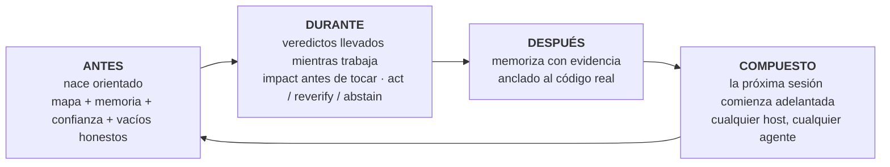

```markdown
<p align="center">
  
</p>

**m1nd** le da a tu agente de codificación un cerebro por repositorio: un gráfico de código local servido a través de MCP, memoria vinculada al código que cita, y un veredicto de confianza para cada respuesta. "Evidencia insuficiente" es una respuesta válida aquí. También lo es "no confíes en esto aún y aquí está cómo solucionarlo".

Nada sale de tu máquina. Un binario en Rust. MIT.

Piensa en ello como una radiografía de tu repositorio que tu agente puede leer: una estructura que combina todo y dice dónde vive cada cosa, para qué sirve ese programa, en qué se está trabajando, qué se ha hecho y qué queda por resolver. Ese panorama es algo que ninguna otra herramienta entrega a tu agente.

<p align="center">
  <a href="https://www.npmjs.com/package/@maxkle1nz/m1nd"></a>
  <a href="https://crates.io/crates/m1nd-mcp"></a>
  <a href="https://github.com/maxkle1nz/m1nd/actions"></a>
  <a href="LICENSE"></a>
  <a href="https://registry.modelcontextprotocol.io/?search=io.github.maxkle1nz/m1nd"></a>
</p>

<p align="center">Cuatro comandos para instalar: <a href="#sixty-seconds">Sesenta segundos</a>. Razones para cerrar primero esta pestaña: <a href="#when-not-to-use-m1nd">Cuándo no usar m1nd</a>.</p>

<p align="center">
  
</p>

<p align="center"><em>Una sesión real en el gráfico de 6,453 nodos de este repositorio (m1nd-mcp 1.4.0): <code>north</code> orienta, <code>seek</code> responde usando un veredicto <code>reverify</code>, <code>memorize</code> ancla el hallazgo al código.</em></p>

## La auditoría que tu agente deja de pagar

Conoces el ritual. El agente abre un archivo, hace grep, abre otro archivo, hace grep nuevamente, quema la mayoría de su contexto reconstruyendo lo que incluso es el repositorio y solo entonces comienza la tarea real. Con m1nd esa búsqueda se convierte en una única pregunta. En menos de un segundo el agente tiene el mapa: qué llama a qué, qué rompe qué, dónde vive todo. No es un montón de coincidencias que interpretar. La estructura conectada, ensamblada de antemano.

Y lo recuerda. Entre sesiones y entre agentes. Lo que un agente aprende hoy por la noche, otro agente lo hereda mañana, con la evidencia adjunta y una bandera si el código cambió desde entonces. Cada conclusión deja un rastro para que tú, o cualquier agente que venga después, siempre puedan ver qué sucedió con ese código y por qué.

Entonces l1ght lo lleva más allá: documentos, artículos, RFCs, borradores y notas se conectan a las partes del código que explican, dentro de la misma estructura. El agente recibe el contexto CORRECTO en lugar del más parecido, y crear código que no existe deja de ser el camino de menor resistencia: la estructura dice qué existe y el veredicto dice cuánto confiar incluso en eso.

Antes de m1nd, una función solo era una función perdida en algún manual. Ahora vive dentro de la inteligencia del agente, combinada con el código, su historia, sus documentos y sus riesgos. No he encontrado nada así en otro lugar.

## grep responde buenas preguntas. m1nd responde las más profundas.

Preguntas que tu agente ahora puede hacer y obtener respuestas estructurales:

- ¿Qué se rompe si toco esta función?
- ¿Dónde ocurre realmente la actualización de token en este repositorio?
- ¿Por qué estos dos archivos están conectados y ese camino es sólido o una suposición?
- ¿Qué aprendió la última sesión sobre este código y sigue siendo cierto?
- ¿Qué siempre cambia junto aquí, incluso sin un import entre ellos?
- ¿Este cambio cruza un límite arquitectónico que no debería cruzar?
- ¿Qué reclamo de este documento implementa esta función?
- ¿El error que acabo de solucionar está escondido en otro lugar como una forma?
- ¿Qué falta aquí que este patrón suele tener?
- ¿Estoy siquiera en el repositorio correcto?
- ¿Debería actuar con esta respuesta o verificarla primero?

Cada una es un verbo en la superficie MCP (`impact`, `seek`, `why`, `north`, `ghost_edges`, `xray_gate`, `antibody_scan`, `missing`, `trust_selftest`, `predict`), no un truco de prompt.

## Y no se detiene al mostrar estructura

Anticuerpos: un error solucionado se convierte en un patrón estructural nombrado y cada sesión posterior busca esa forma en todo el repositorio. Soluciónalo una vez, persíguelo por siempre.

Conexiones fantasma: archivos que siempre cambian juntos sin un import entre ellos, encontrados en tu historial git. El acoplamiento invisible que rompe refactorizaciones.

Huecos estructurales: `missing` busca el código que no está allí. El guard, el intento, el timeout que este patrón suele llevar y esta instancia carece.

Hipótesis contra el gráfico: enuncia un reclamo en lenguaje sencillo ("los ajustes pueden llegar al arranque sin validación") y prueba contra la estructura activa.

Temblores: archivos cuya velocidad de cambio está acelerándose se marcan antes de que alguien informe del error.

Un gráfico cálido: los resultados confirmados refuerzan sus bordes, estilo hebbiano, por lo que los caminos que demostraron ser útiles se clasifican más alto para el siguiente agente.

Cada una de estas señales y sugiere; tu compilador y pruebas aún hacen la verificación.

## m1nd no solo busca. También escribe.

Aquí está la parte que la gente necesita un segundo para creer. El gráfico que lee tu repositorio también puede operar en él. Tu agente nombra un símbolo y un destino, alrededor de 48 tokens, y `transplant` calcula todo el movimiento desde el gráfico: la región ampliada (los comentarios de los documentos y atributos viajan), las dependencias clasificadas por sus bordes de llamada (las privadas viajan, las compartidas permanecen y ganan un back-import), cada referente re-calificado en cada archivo que lo nombra. Luego escribe de forma atómica, re-ingiere y devuelve un recibo honesto: lo que se movió, lo que permaneció, lo que no pudo resolver. `refs_unresolved` nunca está silenciosamente vacío cuando algo salió mal.

Es de dos fases, `transplant_preview` antes de `transplant_commit`, y el commit revalida el hash de cada archivo que planeó tocar, para que nada aterrice en un repositorio que cambió por debajo de él. La zona de dinero de tu repositorio (backend, esquema, pagos, CI) está protegida del lado del servidor y falla cerrado. Una negativa nunca toca un byte y enseña el reintento: una colisión nombra al ocupante, un módulo inválido nombra a sí mismo, un movimiento entre crates nombra ambas raíces de crate.

Medido en un caso real: la edición de archivo completo costó 12,235 tokens de salida, el transplant costó 48 de entrada y escribió 3 archivos en 1.3 segundos, con el crate compilando una vez terminado. rust-analyzer ha tenido un problema abierto solicitando movimientos entre archivos desde 2019.

Límites v1, establecidos claramente: solo Rust, solo `fn` de nivel superior, mismo crate, el archivo de destino ya debe existir y las referencias nacidas dentro de macros son invisibles para él. Cada límite es deliberado y está escrito en [docs/TRANSPLANT-PRD.md](docs/TRANSPLANT-PRD.md), junto a 13 archivos de prueba que contienen el verbo.

## Y cuando no sea un agente sino cinco

Ejecuta varios agentes en el mismo repositorio y el gráfico se convierte en el lugar donde se coordinan. Cada sesión se registra como una presencia, y cuando dos están a punto de tocar trabajos superpuestos, ambos se notifican en su siguiente paquete de orientación, antes de que cualquiera aterrice un cambio. El sistema advierte, tú decides.

Trabajo delimitado se ejecuta como misiones, y las misiones rinden cuentas de sí mismas de una manera que la mayoría de los equipos humanos omiten: cada herramienta de misión informa `non_claims`, la lista de lo que NO fue probado. Un reclamo no puede cerrarse solo con evidencia del gráfico. Se necesita una lectura de archivo, una ejecución de prueba o una sonda en tiempo de ejecución, y la prueba que refuerza esto se llama `graph_only_evidence_is_not_enough`.

Y las barandillas no dan falsas alarmas. `xray_gate` solo puede decir `blocked` desde un manifiesto de límites ratificado por un humano. Todo lo demás llega como una advertencia con una razón, para que el agente nunca aprenda a ignorar su propia barandilla de seguridad.

Cada cerebro también tiene un buzón. Un agente que encuentra un defecto real fuera de su propia misión no lo soluciona de inmediato ni lo pasa por alto: deja una nota en el buzón de ese repositorio, en disco, junto al código. El próximo agente que trabaje con ese cerebro revisa el buzón y comienza su trabajo ya sabiendo los defectos que otros agentes encontraron, con contexto adjunto. El conocimiento de lo que está roto deja de morir en el historial del chat. La revisión es un gesto deliberado (CLI o REST, nunca dentro del bucle de consulta), para que las notas informen el trabajo en lugar de interrumpirlo.

## Nacido pensando en el agente

Sin cuenta, sin telemetría y sin API en el camino, lo que también explica por qué el gráfico responde en microsegundos.

El desarrollo de m1nd tampoco es muy normal. Construirlo significó crear un flujo de trabajo completo donde los agentes dirigen, verifican y prueban el trabajo, y la lógica del producto está dirigida al dolor del agente, no al dashboard del humano. Cuando m1nd se comporta mal en el campo, los agentes que lo usan presentan el informe y un error confirmado se convierte en una prueba roja antes de que la solución aterrice. Muy pocos programas comienzan desde eso en su diseño inicial. Así que m1nd nace diferente: los verbos, las negativas y los paquetes están diseñados para el lector que realmente los utiliza, y ni siquiera tienes que recordarle al modelo que la herramienta existe. `m1nd hosts apply` instala hooks de sesión (`SessionStart`, `agentSpawn`, `TaskStart`, por host) que inyectan la orientación al momento de aparecer: tu agente y cada subagente que genera comienzan orientados antes de que alguien escriba una palabra.

Un cerebro por repositorio lo mantiene unido: un gráfico, su propia memoria, su propia persistencia, vinculada a una raíz de repositorio. Un propietario servido alberga muchos cerebros y enruta cada sesión al correcto; una sesión de un repositorio que no alberga recibe una negativa tipada en lugar de respuestas incorrectas.

## Lo que tu agente obtiene

m1nd envuelve todo el ciclo del agente alrededor de un gráfico de tu repositorio que sobrevive a la sesión:



La puerta de entrada es una única llamada. `north(task)` devuelve toda la orientación en un único paquete antes de cualquier recuperación:

```jsonc
{"method":"tools/call","params":{"name":"north",
  "arguments":{"agent_id":"dev","task":"harden the JWT auth token validation flow"}}}
```

```jsonc
{
  "binding": { "trust_mode": "full_trust", "ok": true },      // veredicto antes de la recuperación
  "memory": [                                                 // recordado de una sesión PREVIA
    { "claim": "AuthTokenFlow", "source_agent": "authbot", "age_ms": 221, "stale": false }
  ],
  "sufficiency": { "state": "gathering", "top_score": 0.64 },
  "next_move": "Call `surgical_context` on the top focus node before editing.",
  "honest_gaps": []                                           // nada retenido en este gráfico
}
```

Mientras el agente trabaja, `impact` muestra el radio antes de que un cambio aterrice, `why` explica una conexión y admite cuando el camino se basa en una suposición, y `xray_gate` advierte antes de que un cambio cruce un límite arquitectónico. Cuando el trabajo está terminado, `memorize` guarda la conclusión con la evidencia que la respalda. La próxima sesión comienza con las conclusiones de la última ya en mano, en cualquier host MCP: Claude Code, Codex, Cursor, Gemini, Zed, 22 hosts en total.

Nunca usas ninguno de estos verbos personalmente. El agente lo hace. Tu superficie es un pequeño CLI de configuración y luego sigues hablando con tu agente como siempre.

## Sesenta segundos

El paquete npm es el instalador. El runtime nativo es un binario Rust separado que el paso 1 descarga como un release firmado.

```bash
# 1 · instala el runtime nativo (firmado, verificado, con posibilidad de retroceder)
npx -y @maxkle1nz/m1nd update apply --yes

# 2 · confirma que es visible (impresión de un veredicto JSON; debería verse como "status": "ok")
npx -y @maxkle1nz/m1nd doctor

# 3 · conecta tu host: configuración de MCP + hooks de sesión que hacen que m1nd sea ambiental
npx -y @maxkle1nz/m1nd hosts apply --host claude --project . --yes

# 4 · primer valor: el paquete de orientación PARA TU repositorio, solo lectura, sin tocar configuración del host
npx -y @maxkle1nz/m1nd agent first-minute --repo . --query "map this repo" --json
```

El paso 1 verifica la firma con [`cosign`](https://docs.sigstore.dev/cosign/system_config/installation/), así que instálalo primero si no está en tu PATH. Si prefieres la fuente del registro y aceptas omitir la verificación, `cargo install m1nd-mcp` también funciona. ¿Preferirías ver antes de escribir? `hosts plan` imprime todo lo que tocaría `hosts apply` y no escribe nada. No hay comando de desinstalación por ahora; `hosts plan` también sirve como lista de lo que quitar manualmente.

Los hooks del paso 3 son los que hacen que m1nd sea ambiental: el paquete de orientación se inyecta en cada sesión y spawn de subagente, y el agente se dirige desde ahí. ¿Instalando desde un agente en lugar de un terminal? Hay una sección gemela y legible para máquina de esta en [`llms-install.md`](llms-install.md).

Un release manipulado o truncado no puede aterrizar en tu máquina, y una actualización fallida está a un rollback de distancia: el actualizador verifica la firma contra la identidad exacta del build, luego el SHA-256 y el tamaño, antes de tocar algo. Si la verificación falla, se rehúsa en lugar de usar un camino sin verificar. Detalles en [docs/AGENT-PACKS.md](docs/AGENT-PACKS.md).

## Si desaparezco

m1nd es MIT y no hay servidor que perder. El runtime es un binario Rust ya en tu disco. La memoria que escribe es markdown simple bajo `agent-memory/`, legible y buscable con grep incluso sin m1nd instalado. El gráfico se deriva de tu código y se reconstruye desde cero en cualquier máquina. Si este proyecto se detiene mañana, conservas los archivos y pierdes una herramienta. Eso es deliberado. Es por eso que la memoria es markdown y por qué no hay nube entre tu agente y su propio conocimiento.

## Por qué confiar en las respuestas

Esto es por lo que construí m1nd. Las capas de recuperación son buenas para responder. Casi ninguna es buena para rechazar. m1nd trata el rechazo como un resultado de primera clase:

```jsonc
// trust_selftest en un runtime no vinculado. El veredicto ES la instrucción de reparación:
{
  "ok": false,
  "verdict": "needs_ingest",          // nunca un simple "no results"
  "next_action": "call_ingest",
  "recovery_playbook": {
    "steps": [ { "action": "Call ingest for the intended repository on this same binding." } ]
  }
}
```

Un resultado de `seek` lleva una lectura de suficiencia y un sobre de confianza. Cuando aún no se ha medido calibración, el sobre limita su propio veredicto en `reverify` en lugar de exagerar. La puerta de `predict` está calibrada para cobertura (α=0.10); en el historial de este repositorio eso resulta en aproximadamente un tercio de precisión en la banda `act`, y la mayoría de las veces se abstiene, que es la salida honesta de una señal débil. `abstain` le dice al agente que se detenga. `insufficient_evidence` significa que no hay evidencia en absoluto, que es diferente a un riesgo medio, y la API mantiene separados los dos.

Dos herramientas, `savings` y `resonate`, se eliminaron por completo en beta (gestores, tipos y archivos de estado, todo se fue) porque devolvían un éxito en cada entrada que les daba, y una herramienta que nunca pierde ha dejado de medir. Esa es la barra que cada afirmación en este archivo cumple.

El vecino más cercano que conozco es GitHub Copilot Memory (public preview, 2026): almacena hechos con citas de código y los vuelve a verificar contra la rama actual antes de usarlos. Esa es detección de obsolescencia real, y merece el crédito. También está en la nube, es binario, y vive dentro de Copilot. Lo que todavía no he encontrado en ningún lugar es el resto del veredicto: un `act` / `reverify` / `abstain` graduado con calibración por repositorio, rechazos tipados que llevan un plan de reparación, en un gráfico local que cualquier agente MCP puede compartir. Verifiqué la documentación pública de Mem0, Zep, Letta, Cognee, Supermemory y Copilot Memory, a partir de julio de 2026. ¿Conoces uno más cercano? Abre un issue y lo enlazaré aquí.

## Memoria que sabe cuando está obsoleta

La mayoría de las capas de memoria almacenan texto y esperan. m1nd ancla la memoria al gráfico. Cuando un agente llama a `memorize`, cada ruta de `evidence` de un reclamo se resuelve al nodo de código real, para que la nota se muestre cada vez que el agente toque ese código, sin que nadie recuerde que existe:

```jsonc
memorize({
  "agent_id": "authbot",
  "node_label": "AuthTokenFlow",
  "claims": [{
    "label": "TokenValidator",
    "text": "TokenValidator valida JWTs vía HMAC. Rota claves solo a través de KMS.",
    "confidence": "high", "evidence": ["src/auth/token.rs"]
  }]
})
```

Debido a que la memoria está anclada, se puede auditar contra la realidad. `cross_verify` vuelve a calcular el hash de cada archivo citado y nombra cuáles reclamos se volvieron obsoletos porque su código cambió. Los reclamos llevan edad y autor, sustituyen reclamos más antiguos y se envejecen. Este bucle se prueba vivo de principio a fin en este repositorio: memorizar, anclar, editar el archivo citado, observar cómo el reclamo se marca, sobrevivir a una re-ingesta completa, auto-cargar en el próximo inicio. Mata el proceso, inicia uno nuevo, y el primer `north` ya lleva los reclamos de la sesión anterior con la procedencia adjunta.

## Un gráfico para código y conocimiento (l1ght)

l1ght es el segundo carril del mismo motor: los documentos se convierten en nodos del gráfico en el mismo espacio de activación que el código, por lo que una consulta atraviesa ambos. No es una carpeta RAG añadida. Hay 7,400 líneas de adaptadores dedicados en este árbol: Markdown, HTML, PDF, texto plano, RST y JSON, además de rutas académicas para BibTeX, DOI/Crossref, JATS papers, RFCs y patentes.

Diferentes personas obtienen diferentes productos del mismo carril:

- Un investigador coloca una carpeta de PDFs y DOIs junto al código de análisis y pregunta qué documento contradice el reclamo que esta función implementa.
- Un estudiante combina un capítulo de texto y el código de ejercicios como un solo gráfico, y el agente explica cada uno en términos del otro.
- Un maestro ingesta las notas del curso una vez; cada agente estudiantil responde desde el mismo corpus fundamentado en lugar de improvisar.
- Un ingeniero vincula RFCs y documentos de diseño a las funciones que los implementan; la sección del spec está a un salto del código.
- El v1becoder detiene su pila de chat exports y notas dispersas de ser solo una carpeta y las convierte en memoria que el agente consulta durante un edit.

Mismo binario, mismos verbos MCP, misma capa de confianza. `seek` en un gráfico mixto devuelve código y documentos en una respuesta clasificada.

## Cuándo no usar m1nd

Algunas razones honestas para cerrar esta pestaña:

- Repos pequeños. Con menos de unos cientos de archivos, grep ya es barato y el borde del gráfico se reduce a casi nada. La medida independiente de herramientas de gráficos comparables en un repositorio de ~110 archivos puso la ventaja en aproximadamente el 20 por ciento. Real, y no vale la pena ejecutar un runtime para ello.
- Preguntas difusas. Un gráfico simbólico responde "qué conecta con qué". No responde "¿por qué se siente lento esto?". La búsqueda agentica es mejor para preguntas abiertas.
- La verdad del compilador y el runtime. Tu LSP, tus pruebas y tu profiler son precisos y m1nd está adivinando. m1nd apunta, ellos prueban.
- Tareas pequeñas. Un archivo y veinte líneas no necesitan una ingesta. Salta esto.
- `predict` principalmente se abstiene hoy. Calibrado en la historia de este repositorio alcanza aproximadamente un tercio de precisión en la banda `act` con baja cobertura. La abstención es la salida honesta de una señal débil, y ahora también es la mayoría de la salida.

m1nd complementa tu compilador, tu runner de pruebas y tu herramienta de seguridad. No reemplaza ninguno de ellos.

## Evidencia

Todo lo anterior se incluye en el lanzamiento actual; los documentos bajo `docs/` marcados como PRD son la intención de diseño, mantenidos etiquetados aparte. Cada fila está ajustada exactamente a lo que fue medido. m1nd no lidera con ahorros de tokens ni ROI, y eso es deliberado: esos son los números menos verificables en esta categoría.

| Reclamo | Resultado | Reproducción / ajuste |
|---|---|---|
| Latencia del gráfico | ~1.4µs `activate`, ~0.5µs `impact` en un gráfico sintético de 1K nodos | `cargo bench -p m1nd-core` en Apple silicon. Orden de magnitud solamente, dependiente de hardware. |
| Batería de capacidades contra grep | 37/37 pasan; cara a cara 16 victorias, 12 empates, 0 ganancias de grep | `python3 scratchpad/m1nd_battery.py ./target/release/m1nd-mcp . --suite m1nd`. Un repositorio (este), casos auto-generados. |
| `predict` ajustado para cobertura | aproximadamente un tercio de precisión en la banda `act` con baja cobertura (α=0.10) | Medido en el historial git de este repositorio, n≈9.2k predicciones retenidas. La puerta principalmente se abstiene, por diseño. |
| Auto-verificación de memoria | bucle de 6 pasos probado en vivo | memorize → anchor → flag de frescura en un archivo editado → sobrevive reemplazo → auto-carga al inicio. |
| Persistencia entre inicios y fallos | la puerta ejecuta el binario real sobre stdio a través de cuatro inicios limpios y con un kill -9 | `m1nd-mcp/tests/persist_runtime_root.rs`. Revertir cualquiera de las correcciones de inicio lo vuelve rojo con un mensaje que nombra la regresión. |

## Un gráfico, muchos agentes

Para un agente, el servidor stdio desde [Sesenta segundos](#sixty-seconds) es todo lo que necesitas, y el agente puede llamar a `ingest` directamente sobre un gráfico vacío. Para trabajo real, ejecuta un propietario servido que mantenga el gráfico activo y conecta a cada agente como un puente delgado:

```bash
m1nd-mcp --serve --no-gui --port 1337 --runtime-dir /your/project/.m1nd
m1nd-mcp --attach auto --stdio     # cada agente: sin carga de gráfico, sin lease, memoria compartida
```

Lo que memorice un agente, otro lo recuerda de inmediato, y las advertencias de presencia y colisión descritas anteriormente pasan por este mismo propietario. También alberga cerebros por repositorio y renderiza la interfaz web. Las consultas permanecen en localhost; cada binding que no sea loopback se rechaza hasta que exista transporte autenticado.

Una puerta que debes conocer: un propietario servido rechaza un `ingest` genérico para repositorios que aún no alberga. Crear un nuevo cerebro en un propietario servido es un gesto regulado y falla cerrado por diseño. Para una sesión inicial en un nuevo repositorio, utiliza el camino stdio o `m1nd agent first-minute`. Conéctalo al propietario una vez que albergue tu repositorio. Guía completa de implementación: [docs/deployment.md](docs/deployment.md).

## Cobertura lingüística

Extractores dedicados cubren más de veinte lenguajes para que un repositorio poliglota no regrese mapeado a medias: Python y TypeScript hasta Elixir, Haskell y Zig, clasificados por extensión de archivo en `m1nd-ingest`. La tabla a continuación es el reclamo más estricto, probado de extremo a extremo en una única ingesta poliglota: bordes de gráfico de llamadas y resolución de imports cruzados entre archivos.

| Lenguaje | `calls` | imports cruzados entre archivos |
|---|:---:|:---:|
| Rust | ✅ | ✅ |
| Python | ✅ | ✅ |
| JavaScript / TypeScript | ✅ | ✅ |
| Go | ✅ | ✅ |
| Java | ✅ | ✅ |
| C / C++ | ✅ | ✅ |
| Kotlin | ✅ | ✅ |
| PHP | ✅ | ✅ |
| Scala | ✅ | ✅ |
| Ruby | ⏳ | ✅ |
| C# | ✅ | los namespaces no se mapean 1:1 a archivos |
| Swift | ✅ | aún no |

Imports irresolubles (paquetes externos, stdlib, headers del sistema) quedan sin resolver en lugar de ser adivinados. Todo lo demás recurre a un extractor genérico con bordes `contains` solamente.

## El humano es el segundo lector

La mayoría de las herramientas de desarrollo están hechas para una persona y luego crecen una API. m1nd corre al revés: el agente es el usuario y sus verbos son los verbos de él.

Esa elección da forma al diseño de maneras que puedes probar. Los rechazos son tipados y llevan un esquema de recuperación porque el lector que actúa sobre ellos es una máquina. Un mensaje de error que necesita interpretación humana es un fallo de diseño aquí. El mismo paquete de orientación que el agente lee como `north` se renderiza para ti como una tarjeta breve en la conversación y como el Árbol Vivo en la UI web servida (tu repositorio dibujado como un árbol navegable, notas de memoria fijadas a él): computado una vez, proyectado por lector, para que la vista humana nunca se desvíe hacia una segunda verdad.

Los humanos son bienvenidos. Simplemente eres el segundo lector y el sistema es más honesto con ambos lectores por ello.

## Cómo se construye este repositorio

Lee el log de commits con escepticismo, luego lee esto. Soy Max. Construyo m1nd dirigiendo un sistema de agentes de codificación, bajo reglas más estrictas que la mayoría de los equipos humanos en los que he trabajado:

- Cada cambio sustancial comienza como un spec confrontado por un modelo oráculo independiente antes de que se escriba código. Las objeciones se registran dentro de los archivos spec.
- Cada solución se acompaña de una prueba que se demostró fallando primero. Una prueba que nunca ha estado roja no prueba nada.
- El revisador nunca es el autor. Cada agente trabaja manualmente en un worktree aislado.
- Una puerta verde es un candidato. El gesto para aterrizarlo es mío y respondo por cada línea.
- Las leyes son nombres de prueba: `letter_cannot_color_the_store`, `gate_zero_cannot_land`, `graph_only_evidence_is_not_enough`.
- El árbol contiene 2,462 funciones de prueba, y la puerta completa corre en verde en Linux, macOS y Windows.

La pregunta del escéptico ("ningún humano escribe tanto tan rápido") es correcta. Ningún humano lo hace. Un humano dirigiendo un sistema de prueba basado en agentes sí. Este árbol es lo que salió de ello. La capa de confianza de m1nd nació de esa práctica diaria; necesitaba que mis propios agentes dejaran de confiar en respuestas obsoletas antes de poder enviar algo a este ritmo.

## Arquitectura a simple vista

Tres "crates" base de Rust más auxiliares: `m1nd-mcp` (el servidor MCP y la superficie de runtime), `m1nd-core` (el motor de gráficos: activación propagada, plasticidad hebbiana, CSR adjacency, bordes fantasma derivados de git), `m1nd-ingest` (extractores y adaptadores para código, documentos y memoria). Tu agente ve 48 herramientas por defecto en lugar de 130+, por lo que elige la correcta más a menudo y paga una lista de herramientas más corta en cada solicitud; toda la superficie está a un env var de distancia (`M1ND_TOOL_TIER=full`) y la clasificación solo recorta el menú publicitado, nunca la disponibilidad.

<p align="center">
  
</p>

La profundidad está en el [wiki](https://m1nd.world/wiki/), [docs/AGENT-PACKS.md](docs/AGENT-PACKS.md), [EXAMPLES.md](EXAMPLES.md) y [CHANGELOG.md](CHANGELOG.md).

## Traducciones

🇧🇷 [Português](i18n/README.pt-BR.md) · 🇪🇸 [Español](i18n/README.es.md) · 🇮🇹 [Italiano](i18n/README.it.md) · 🇫🇷 [Français](i18n/README.fr.md) · 🇩🇪 [Deutsch](i18n/README.de.md) · 🇨🇳 [中文](i18n/README.zh.md) · 🇯🇵 [日本語](i18n/README.ja.md)

Las traducciones siguen el texto en inglés con algo de retraso. Cuando discrepen, el inglés es canónico.

## Contribuir

Las contribuciones son bienvenidas en extractores, adaptadores, herramientas MCP, benchmarks, documentación y algoritmos de gráficos. Mira [CONTRIBUTING.md](CONTRIBUTING.md). Hay una sala activa en [CodeRooms](https://coderooms.com/github/maxkle1nz/m1nd) si prefieres hablar primero. Y si llegaste hasta aquí y quieres intentarlo: [cuatro comandos](#sixty-seconds).

## Licencia

MIT. Mira [LICENSE](LICENSE).
```
