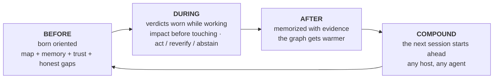

🇬🇧 [English](../README.md) | 🇧🇷 [Português](README.pt-BR.md) | 🇪🇸 [Español](README.es.md) | 🇮🇹 [Italiano](README.it.md) | 🇫🇷 [Français](README.fr.md) | 🇩🇪 [Deutsch](README.de.md) | 🇨🇳 [中文](README.zh.md) | 🇯🇵 [日本語](README.ja.md)

<p align="center">
  
</p>

<h1 align="center">Inteligencia Operacional para Agentes de Código</h1>

<p align="center">
  <strong>Tu agente de código deja de empezar a ciegas.</strong><br/>
  <em>Local-first. MCP-nativo. Memoria en grafo, confianza y razonamiento sobre cambios para hosts de agentes.</em>
</p>

<p align="center">
  <a href="https://www.npmjs.com/package/@maxkle1nz/m1nd"></a>
  <a href="https://crates.io/crates/m1nd-mcp"></a>
  <a href="https://github.com/maxkle1nz/m1nd/actions"></a>
  <a href="../LICENSE"></a>
  <a href="https://registry.modelcontextprotocol.io/?search=io.github.maxkle1nz/m1nd"></a>
  <a href="https://glama.ai/mcp/servers/maxkle1nz/m1nd"></a>
  <a href="https://docs.rs/m1nd-core"></a>
</p>

<p align="center">
  <a href="https://github.com/openai/codex"></a>
  <a href="https://claude.ai/download"></a>
  <a href="https://cursor.sh"></a>
  <a href="https://codeium.com/windsurf"></a>
  <a href="https://github.com/features/copilot"></a>
  <a href="https://zed.dev"></a>
  <a href="https://github.com/cline/cline"></a>
  <a href="https://roocode.com"></a>
  <a href="https://github.com/continuedev/continue"></a>
  <a href="https://opencode.ai"></a>
  <a href="https://aistudio.google.com"></a>
  <a href="https://aws.amazon.com/q/developer"></a>
</p>

---

**m1nd es la carcasa alrededor de tu agente de código — el loop operacional dentro del cual vive: orientado antes de actuar, veredictos honestos mientras trabaja, memoria con evidencia después de terminar, acumulándose entre sesiones.**

<p align="center">
  
</p>

<p align="center"><em>Una sesión real — capturada de un dueño en vivo (<code>m1nd-mcp 1.3.0</code>, un grafo de 6,453 nodos sobre este repositorio): <code>north</code> orienta al agente con confianza + huecos honestos, <code>seek</code> responde vistiendo un veredicto <code>reverify</code> en lugar de una conjetura confiada, <code>memorize</code> escribe el hallazgo de vuelta anclado al código.</em></p>

<p align="center"></p>

> `grep` encuentra texto. La búsqueda vectorial encuentra chunks similares. `m1nd` da a los agentes un grafo local de qué se conecta, qué cambió, qué se rompe, qué ha derivado y dónde retomar.

## Empieza en 60 segundos

Tres comandos. El primero prueba que el runtime está visible, el segundo imprime el cableado exacto de tu host, y el tercero es de tu agente — nunca más lo llamas a mano.

```bash
# 1 · comprueba que el runtime está instalado y visible (sin build, sin config)
npx -y @maxkle1nz/m1nd doctor
#    → imprime un veredicto JSON: runtime encontrado + versión, o el arreglo exacto si no
```

```bash
# 2 · imprime el cableado de tu host (claude · codex · gemini · cursor · cline · …)
npx -y @maxkle1nz/m1nd hosts plan --host claude --project .
#    → dry-run: el JSON de config MCP + el hook de session-start para pegar — no escribe nada
```

```jsonc
// 3 · de ahora en adelante conduce tu AGENTE — su primer movimiento en cada sesión es una llamada:
north({ "agent_id": "dev", "task": "harden the JWT auth token validation flow" })
//    → un paquete: confianza del binding · nodos de foco + anclas · memoria previa · honest_gaps
```

¿Listo para cablearlo de verdad (skills + config MCP, todos los hosts)? → [Inicio Rápido](#inicio-rápido). ¿Autoinstalando desde un agente? → [`llms-install.md`](../llms-install.md).

## Qué es m1nd: la carcasa alrededor de tu agente

*m1nd envuelve a tu agente de código en un loop que lo orienta antes de actuar, lo mantiene honesto mientras trabaja y recuerda lo que aprendió cuando termina.*

- **Si construyes con agentes** — nada nuevo que aprender: instala una vez y sigue hablando con tu agente. Deja de adivinar, empieza a recordar y dice "no sé" cuando esa es la verdad.
- **Si eres ingeniero** — un motor de grafo en Rust, local-first, detrás de un servidor MCP: un grafo causal de código (aristas estructurales, semánticas, temporales y causales), veredictos con calibración conformal y memoria anclada a nodos de código con procedencia. Nada sale de tu máquina.

Los agentes en codebases reales no fallan porque no puedan buscar — fallan porque no tienen un modelo operacional. Cada sesión reconstruye contexto desde cero, edita sin conocer el blast radius y no puede distinguir un resultado vacío que significa "no existe nada" de uno que significa "repositorio equivocado". m1nd le da al agente un modelo duradero del codebase — un grafo causal con spreading activation y plasticidad Hebbiana — y envuelve el loop entero del agente a su alrededor. Las funcionalidades aquí no son un catálogo; son las estaciones de esa carcasa:



**m1nd es operado por tu agente, no por ti.** Cada herramienta de abajo la llama el propio agente — automáticamente, antes y después de trabajar. Un humano nunca las ejecuta en uso normal; instalas una vez ([Inicio Rápido](#inicio-rápido)) y sigues hablando con tu agente como siempre.

**Una carcasa, tres lectores.** El mismo paquete orientado se renderiza para quien está a punto de actuar: el **agente principal** lo lee como `north` (entregado — la puerta de entrada de abajo); un **subagente** lo recibirá como el Delegation Packet, la mitad de recuperación de su spec de spawn (diseñado — [docs/NEXTGEN-AGENT-PRD.md](../docs/NEXTGEN-AGENT-PRD.md), §O.12); el **humano** lo verá como la Pre-Flight Card sobre el Living Tree — tu proyecto como un árbol navegable con post-its de memoria, mostrando qué verificó el agente vs. qué adivinó antes de que una edición aterrice (diseñado, en desarrollo — [docs/HUMAN-LAYER-PRD.md](../docs/HUMAN-LAYER-PRD.md)). Una verdad, computada una sola vez.

<p align="center"></p>

<p align="center">
  
</p>

### Qué pasa cuando envías un mensaje

Le pides a tu agente que arregle algo. Esto es lo que la carcasa hace alrededor de ese mensaje:

1. **Antes de que tu agente actúe**, m1nd le entrega el mapa vivo de tu proyecto, lo que sesiones pasadas aprendieron, cuánto confiar en cada pieza — y lo que *no* sabe (`north`).
2. **Mientras trabaja**, lleva puestos veredictos: comprueba qué rompería una edición *antes* de tocar el código (`impact`), y donde la evidencia es delgada recibe un honesto "no sé" en lugar de una conjetura confiada (`abstain`).
3. Puede preguntar por qué dos piezas de código están conectadas y ser avisado cuando la respuesta descansa sobre una suposición (`why`), y es alertado antes de cruzar una frontera de arquitectura (`xray_gate`).
4. **Cuando termina**, la decisión queda anotada junto con la evidencia que la respalda (`memorize`).
5. Esa memoria está anclada al código real — si el código cambia después, la memoria se marca sola como obsoleta en lugar de mentir en silencio (`cross_verify`).
6. **Tu próxima sesión empieza ya sabiendo** — cualquier agente, cualquier herramienta: Claude Code, Codex, Cursor, Gemini. Lo que un agente aprende, el siguiente lo hereda.

## BEFORE — nace orientado

*Tu agente empieza cada sesión conociendo ya tu proyecto — y sabiendo lo que no sabe.*

<p align="center"></p>

Dentro de una sesión MCP, la puerta de entrada es una sola llamada — `north(task)` compone confianza, contexto de tarea (nodos de focus + anclas de PageRank), memoria previa entre sesiones, una señal de suficiencia, un `next_move` y `honest_gaps` (lo que m1nd *todavía* no sabe) en un único paquete, antes de cualquier consulta:

```jsonc
{"method":"tools/call","params":{"name":"north",
  "arguments":{"agent_id":"dev","task":"harden the JWT auth token validation flow"}}}
```

La respuesta es un paquete orientado — veredicto de confianza, la memoria que dejó la última sesión y una lista honesta de brechas. Una captura real del binario de `main`, ligeramente recortada:

```jsonc
{
  "binding": { "trust_mode": "full_trust", "ok": true },      // verdict before retrieval
  "memory": [                                                 // recalled from a PRIOR session
    { "claim": "AuthTokenFlow", "source_agent": "authbot", "age_ms": 221, "stale": false }
    // …other claims from the same authored note, trimmed…
  ],
  "sufficiency": { "state": "gathering", "top_score": 0.64,
    "why": "the strongest match left out still scores 0.30 — relevant context did not fit …" },
  "next_move": "Call `surgical_context` on the top focus node to ground the task before editing.",
  "honest_gaps": []                                           // nothing withheld on this graph
}
```

`north` compone `trust_selftest` + `orient` + `boot_memory` + `focus` — el agente solo recurre a una pieza aislada cuando necesita exactamente una. `focus` es el runtime de atención de esta estación: el conjunto de trabajo mínimo y acotado por presupuesto para un objetivo, con una cola honesta de lo que dejó fuera y una señal de si eso ya es contexto *suficiente*. `needs_ingest` es una respuesta real para un grafo vacío.

Si `north` reporta `needs: "needs_ingest"`, o estás en un binario anterior a 1.2.1 sin la composición de L1GHT-recall, el agente recurre al loop explícito de confianza — establecer confianza *antes* de creer cualquier recuperación:

```jsonc
// 0. Trust the binding in one call (verdict before retrieval)
{"method":"tools/call","params":{"name":"trust_selftest","arguments":{"agent_id":"dev"}}}

// 1. If the verdict is not full_trust, ask for the deterministic recovery path
{"method":"tools/call","params":{"name":"recovery_playbook","arguments":{"agent_id":"dev"}}}

// 2. Build graph truth
{"method":"tools/call","params":{"name":"ingest","arguments":{"path":"/your/project","agent_id":"dev"}}}

// 3. Ask a structural question — empty results say *why*, never just "no results"
{"method":"tools/call","params":{"name":"activate","arguments":{"query":"authentication flow","agent_id":"dev"}}}
```

**Loop de primera sesión, en cuatro movimientos:** `north` (o `trust_selftest` → `ingest`) → `seek`/`audit` → `memorize` el hallazgo duradero para que la próxima sesión empiece adelantada.

## DURING — veredictos puestos mientras trabaja

*Mientras trabaja, cada respuesta llega con cuánto se puede confiar en ella — y "no sé" es una respuesta real.*

<p align="center"></p>

El agente no consulta a m1nd; lo lleva puesto. Cada respuesta a mitad del trabajo es un veredicto calibrado, no una intuición:

- **`impact` antes de tocar** muestra el blast radius que no leíste; `ghost_edges` revela archivos que siempre cambian juntos pero no comparten ningún import.
- **`why` lleva un veredicto `closure`** — `blocked` significa que la ruta descansa sobre una arista no resuelta o adivinada: verifica esa arista antes de confiar en la ruta.
- **`predict` tiene calibración conformal** — `calibrate_predict` arma una compuerta por repositorio; los veredictos pasan a leer `act` / `reverify` / `abstain`, donde `abstain` significa *no calibrado o insuficiente* — una señal para detenerse, no un sí débil. Se entrega en modo oscuro: hasta que calibres, los veredictos se topan en `reverify`. El acoplamiento de co-cambio se normaliza con Jaccard suavizado, no conteos crudos de commits (calibración probada: +3 puntos). *Advertencia:* `predict` tiene fallback solo estructural hasta que `ghost_edges` cargue la matriz de co-cambio de git — ejecútalo primero para probabilidad real de co-cambio.
- **`xray_gate` guarda las fronteras de la arquitectura** — llamado antes de una edición, responde "¿este cambio cruza una frontera de módulo prohibida?" con `clear` / `caution` / `blocked`; solo un manifiesto ratificado puede bloquear (anti-fatiga de guardrail).
- **Mission Control es disciplina de prueba** — `mission_next` devuelve exactamente un movimiento más guardrails `do_not`; en modo `bug_hunt` se exige un barrido directo final antes del cierre, para que los agentes revisen el espacio negativo.

La misma honestidad acompaña la recuperación. Un hit de `seek` lleva una lectura de `sufficiency` y un `trust_envelope` — y cuando el sobre aún no tiene ninguna fila de calibración medida, limita su propio veredicto en lugar de exagerar. Una captura real, recortada (el primer hit es una memoria que escribió la última sesión):

```jsonc
{
  "results": [
    { "label": "AuthTokenFlow", "source_agent": "authbot", "authored_ms_ago": 101161, "score": 0.48 }
    // …code-node hits, trimmed…
  ],
  "sufficiency": { "state": "gathering", "top_score": 0.48,
    "why": "the strongest match left out still scores 0.25 — relevant context did not fit …" },
  "trust_envelope": {
    "calibrated": false,               // no calibration row measured
    "verdict": "reverify",             // …so the verdict is capped below `act`
    "next_repair_call": "trust_selftest"
  }
}
```

<p align="center"></p>

## AFTER — el grafo se calienta

*Cuando el trabajo aterriza, lo aprendido queda anotado con la evidencia que lo respalda — y se mantiene honesto cuando el código sigue adelante.*

<p align="center"></p>

La mayoría de las herramientas dan al agente mejor *recuperación*. En esta estación el agente **produce conocimiento duradero y legible por máquina** que se acumula entre sesiones y se mantiene honesto respecto al código. L1GHT convierte el conocimiento producido en estructura nativa de grafo que se auto-señaliza cuando el código que cita cambia — las afirmaciones confiadas propagan más activación que las inciertas.

1. **Concluir** — el agente llega a algo duradero (una decisión, un hallazgo verificado, por qué el código es como es) y llama a `memorize` con afirmaciones estructuradas y rutas de `evidence`.

```jsonc
memorize({
  "agent_id": "authbot",
  "node_label": "AuthTokenFlow",
  "claims": [
    { "label": "TokenValidator",
      "text": "TokenValidator validates JWTs via HMAC — rotate keys via KMS only",
      "confidence": "high", "evidence": ["src/auth/token.rs"] }
  ]
})
```

La llamada devuelve la prueba de que aterrizó — esta es una respuesta real capturada, recortada:

```jsonc
{
  "ok": true,
  "claims_written": 1,
  "light_evidence_resolved": 1, "light_evidence_unresolved": 0,   // the evidence path bound to a real code node
  "path": ".../agent-memory/authtokenflow.light.md",
  "next_action": "Memory anchored to code and will auto-load next session; cross_verify(check:[\"evidence_freshness\"]) flags it if the cited code changes."
}
```

2. **Anclar** — m1nd escribe un `.light.md` nativo de grafo bajo `<runtime>/agent-memory/`, lo ingiere (`adapter=light mode=merge`) y resuelve cada ruta de `evidence` al nodo de código real vía arista `grounded_in` — haciendo que el conocimiento viva en el mismo espacio de activación que el código y emerja en `seek` / `activate` / `impact`.
3. **Carga automática** — en cada inicio de sesión futuro, `m1nd` ingiere `agent-memory/` automáticamente y lo reporta en `session_handshake.agent_memory`. Los hallazgos pasados sobreviven a una ingestión `mode=replace` y simplemente *están ahí*.
4. **Auto-señalización de obsolescencia** — `cross_verify(check: ["evidence_freshness"])` re-hashea cada archivo citado y nombra qué afirmaciones se volvieron obsoletas porque su código cambió — así la memoria avisa cuando miente, en lugar de inducir a error. La memoria lleva una columna vertebral de procedencia: las afirmaciones declaran edad + autor reales, reemplazan afirmaciones más antiguas, expiran con el tiempo y respetan un tope de recencia — el conocimiento recordado declara su propia frescura en lugar de volverse obsoleto en silencio.

Este loop ha sido probado en vivo de extremo a extremo: `memorize` → arista `grounded_in` → flag de frescura en archivo editado → sobrevive a `mode=replace` → carga automática en el boot. ¿Cerrando una misión acotada? Pasa `write_light_memory: true` a `mission_close` para persistir sus afirmaciones verificadas de la misma manera.

**COMPOUND — la próxima sesión nace dentro de la carcasa caldeada.** Mata ese proceso, arranca uno **nuevo** contra el mismo runtime, y su primer `north(task)` ya lleva la afirmación de la sesión anterior — este es un intercambio real capturado (las dos llamadas de arriba corrieron en procesos separados), recortado:

```jsonc
// north.memory, from a process that never called memorize itself:
"memory": [
  { "claim": "AuthTokenFlow",                   "source_agent": "authbot", "age_ms": 221, "stale": false },
  { "claim": "𝔻 evidence: src/auth/token.rs",   "source_agent": "authbot", "age_ms": 221, "stale": false },
  { "claim": "⍂ entity: TokenValidator",        "source_agent": "authbot", "age_ms": 221, "stale": false },
  { "claim": "𝔻 confidence: high",              "source_agent": "authbot", "age_ms": 221, "stale": false }
  // …the authored-note file node, trimmed…
]
```

`source_agent` nombra quién la escribió y `stale` re-verifica el código citado — la próxima sesión hereda el conocimiento *y* su procedencia, no una string suelta.

### Un grafo, muchos agentes

<p align="center"></p>

El Inicio Rápido de abajo conecta un servidor stdio por host — está bien para un agente, pero cada proceso carga su propio grafo y retiene su propia lease. El despliegue para el que m1nd fue construido es un dueño, muchos agentes adjuntos. Un proceso dueño retiene el grafo vivo:

```bash
m1nd-mcp --serve --no-gui --port 1337 --runtime-dir /your/project/.m1nd
```

Cada agente luego se adjunta como un puente delgado stdio↔HTTP — **no** carga grafo, no construye motores y **no** toma lease:

```bash
m1nd-mcp --attach http://127.0.0.1:1337 --stdio    # or set M1ND_ATTACH_URL and omit the flag
```

Cualquier número de puentes apunta al único dueño y comparte su único grafo vivo, así que lo que un agente hace `memorize` otro lo recupera de inmediato — sin reingestión, sin copia por agente. Las consultas van por localhost, así que se mantiene local-first (el bind se queda en `127.0.0.1` a menos que optes por `--bind 0.0.0.0`). Un `seek` en caliente sobre el puente midió ≈0.7ms en un grafo pequeño en una sola máquina — orden de magnitud, no una garantía: adjuntar añade un round-trip por localhost, y la latencia escala con el tamaño del grafo y la carga.

## El material: honestidad

*La carcasa entera está hecha de un solo material — m1nd prefiere decirle a tu agente "no confíes en esto" antes que dejarlo adivinar.*

Esta es la cosa más defendible que hace m1nd, y ningún competidor la entrega. La doctrina: **la credibilidad viene de la honestidad, no de siempre ganar.** Un *no* honesto vence a una conjetura confiada — cada estación de arriba está hecha de ese material.

- **`trust_selftest`** devuelve un veredicto *antes* de cualquier recuperación: `full_trust`, `needs_ingest`, `wrong_workspace_binding`, `stale_binding_suspected` o `degraded_host_tool_surface`. El agente sabe si debe proceder, ingerir, rebindear o retroceder.
- **`agent_runtime_contract`** acompaña cada respuesta de recuperación, llevando un `trust_mode`. Un resultado vacío está desambiguado — vinculado al repositorio equivocado versus genuinamente nada ahí — nunca reportado silenciosamente como "sin resultados."
- **`trust_band: insufficient_evidence` significa SIN evidencia — no riesgo medio.** La respuesta honesta de arranque en frío, distinta de bajo/medio/alto.
- **Arrays `non_claims`** se envían en cada herramienta de misión. m1nd le dice al agente lo que *no* probó.
- **`mission_verify` puede decir no — y lo hace, en código testado.** Rechaza evidencia solo de grafo: una afirmación no puede cerrarse sin una lectura de archivo, una ejecución de test o una sonda de runtime. El test se llama literalmente `graph_only_evidence_is_not_enough`.
- **`recovery_playbook`** devuelve una lista de pasos determinística y ordenada para reparar el binding.

Mostrado, no contado. Llama a `trust_selftest` en un runtime sin binding y el veredicto *es* la instrucción de reparación — una captura real, recortada:

```jsonc
{
  "ok": false,
  "status": "blocked",
  "verdict": "needs_ingest",          // not "no results" — it says why
  "next_action": "call_ingest",
  "checks": { "graph_populated": false, "needs_ingest": true, "recovery_playbook_attached": true },
  "recovery_playbook": {
    "recovery_goal": "Populate this binding's active graph for the intended repository.",
    "steps": [ { "action": "Call ingest for the intended repository on this same binding." } /* …trimmed… */ ]
  }
}
```

La prueba del compromiso está en lo que se sacrificó por él: `savings` y `resonate` fueron retirados de la superficie anunciada en beta.7 porque una herramienta que siempre afirma ganar no es creíble. Ningún competidor — ni mem0, Zep, Letta, Sourcegraph ni ningún MCP de grafo de código — entrega una capa que le dice al agente en qué *no* confiar y cómo recuperarse.

<p align="center"></p>

**El loop de triaje de campo se cierra sobre sí mismo.** La telemetría de sesión que los agentes dejan en `~/.m1nd/field-reports.jsonl` (solo local — m1nd nunca llama a casa) no es un log pasivo: los reportes se triajean, y un bug de campo *confirmado* se convierte en un caso rojo de batería **antes** del arreglo, de modo que la regresión queda probada, no solo descrita. Ese loop ya corrió de extremo a extremo en un barrido completo de triaje de campo: cuatro bugs reportados en campo se convirtieron en casos de batería fallidos y luego en arreglos mergeados, todos entregados en **1.2.1** — `north` ahora compone el recall de L1GHT dentro de su paquete de memoria, el centinela de grafo `temp` resuelve a un tempdir real en lugar de ensuciar el directorio de trabajo, `memorize` acepta una `confidence` numérica, y la etiqueta de ambigüedad de closure ahora solo se dispara en empates genuinos (el falso-alarmista: ambiguous-blocked cayó de 9/11 → 0/11).

## Inicio Rápido

*Instala una vez, conecta el host de tu agente y apártate — desde aquí, tu agente lleva el volante.*

```bash
git clone https://github.com/maxkle1nz/m1nd.git && cd m1nd
npm install -g .
m1nd doctor
```

Luego conecta tu host — los mismos dos comandos, uno por host (`codex`, `claude`, `gemini`, `antigravity`, `generic`):

| Host | Instalar el paquete de agente | Conectar la config MCP |
|---|---|---|
| Codex | `m1nd install-skills codex` | `m1nd mcp-config codex --project /your/project` |
| Claude Code | `m1nd install-skills claude --project /your/project` | `m1nd mcp-config claude --project /your/project` |
| Gemini | `m1nd install-skills gemini --project /your/project` | `m1nd mcp-config gemini --project /your/project` |
| Antigravity | `m1nd install-skills antigravity --project /your/project` | `m1nd mcp-config antigravity --project /your/project` |
| Generic | `m1nd install-skills generic --project /your/project` | `m1nd mcp-config generic --project /your/project` |

O desde npm: `npm install -g @maxkle1nz/m1nd`. `install-skills` entrega el paquete de agente — el propio loop operacional en cinco protocolos nombrados, no documentación decorativa.

**La superficie del operador es este CLI; la superficie del agente es MCP.** Un humano ocasionalmente ejecuta `m1nd doctor`, `install-skills`, `mcp-config` — el agente ejecuta todo lo demás. Existe una vía de escape neutra de host para cuando no hay una sesión MCP activa en la que llamar a `north` (obsoleta, vinculada al repositorio equivocado, o aún no cargada): lanza un runtime aislado, lo vincula al repositorio y devuelve un único sobre legible por máquina que delimita el alcance, establece confianza, ingiere si es necesario, devuelve anclas y hace el handoff a la prueba directa:

```bash
m1nd agent first-minute --repo /your/project --query "understand this system" --json
```

Fija el binario si lo necesitas: `--version` imprime `1.2.x (<sha>)`, y `M1ND_EXPECTED_VERSION` / `M1ND_EXPECTED_SHA` (+ `M1ND_STRICT_VERSION`) permiten que un host detecte y rechace un binario que ha derivado.

Mapa completo de instalación, paquetes de host, build nativo del runtime y flags de actualización: [docs/AGENT-PACKS.md](../docs/AGENT-PACKS.md) · configuración por cliente: [matriz de integración](../docs/IDE-INTEGRATIONS.md).

## Evidencias

<p align="center"></p>

Cada fila está calibrada exactamente a lo que se midió. m1nd no lidera con números de ahorro o ROI — ese es el punto.

| Afirmación | Resultado | Fuente / advertencia |
|---|---|---|
| Latencia de `activate` / `impact` | ~1µs `activate`, sub-µs `impact` en un grafo sintético de 1K nodos | Benchmarks Criterion — **reprodúcelo tú mismo: `cargo bench -p m1nd-core`** (medido `activate_1k_nodes` ≈1.4µs, `impact_depth3` ≈0.5µs en un Mac con Apple silicon); [metodología](https://m1nd.world/wiki/benchmarks.html); orden de magnitud, dependiente del hardware. |
| Matriz de lenguajes | calls + imports entre archivos para 10 lenguajes (+ Ruby entre archivos) | Verificado de extremo a extremo en una única ingestión políglota; tests por lenguaje en `m1nd-ingest`. Ver [Cobertura de Lenguajes](#cobertura-de-lenguajes). |
| Muestra de validación post-escritura | 12/12 clasificados correctamente | Verificación de runtime interna. |
| Caza de bugs con seeds | 16/20 en la primera ronda aceptada de defectos con seed `humanize` (entrenado con m1nd); `m1nd-basic` y directo cada uno 8/15 | Evidencia interna de producto, `public_claim_worthy=false` — no es un benchmark universal. |
| Auto-verificación de memoria | probado en vivo de extremo a extremo | `memorize` → `grounded_in` → flag de frescura en archivo editado → sobrevive a replace → carga automática en el boot. |
| Batería de capacidades vs grep | 37/37 pasan; mano a mano 16 victorias-m1nd / 12 empates / **0 victorias-grep** | Harness en el repo `scratchpad/m1nd_battery.py` (37 casos, ingestión fresca + PASS/FAIL contra ground-truth + mano a mano con `rg`). **Reprodúcelo: `python3 scratchpad/m1nd_battery.py ./target/release/m1nd-mcp . --suite m1nd`.** Advertencia: un solo repo (el propio m1nd), casos escritos por nosotros; ~5 de los empates son herramientas estructurales puntuadas contra un proxy de grep literal que no puede expresar lo que ellas responden. |
| Calibración conformal (`predict`) | banda act ≈32% de precisión @ ≈13.5% de cobertura (α=0.10) | Sobre el propio historial git de m1nd (n≈9.2k predicciones held-out), +3pts sobre los conteos crudos tras el cambio a Jaccard suavizado. Advertencia: un solo repo, una señal gruesa basada en conteos — la compuerta hoy mayormente se abstiene, **por diseño**: la abstención es la salida honesta de una señal débil, no un fallo. |

<details>
<summary><strong>Más visuales — la serie completa de mecanismos</strong></summary>
<br/>
<p align="center">
  
  
</p>
<p align="center">
  
  
</p>
</details>

## Límites

`m1nd` complementa en lugar de reemplazar tu LSP, compilador, test runner, escáneres de seguridad y stack de observabilidad. Es más útil antes de búsqueda, revisión o cambio, y siempre que docs, impacto o continuidad importen.

Es **menos útil** cuando:

- la búsqueda exacta de texto ya responde la pregunta
- la verdad del compilador o runtime es lo único que necesitas
- la tarea es una acción local trivial en archivo sin incertidumbre estructural

**Necesita alimentarse:** `trust` y `tremor` comienzan con priors neutros hasta que el feedback de `learn` / los datos de `ghost_edges` se acumulen, y `predict` necesita que `ghost_edges` esté cargado primero para que su señal de co-cambio sea significativa. Mejoran con el uso; son honestos sobre estar sin información al arrancar.

## Lo Que m1nd No Es

`m1nd` no es solo:

- una herramienta de búsqueda de código con un índice más grande
- una capa de RAG de repositorio que solo recupera archivos o chunks
- una base de datos de grafo que deja las decisiones de workflow al cliente
- un reemplazo de análisis estático para el compilador, tests o herramientas de seguridad
- un bundle MCP de utilidades sin relación entre sí
- una superficie de herramientas que el humano deba aprender — los verbos son del agente; el tuyo es el pequeño [CLI de setup](#inicio-rápido)

Es la capa que convierte esas superficies en un sistema operacional sobre el que un agente puede razonar y actuar. No sirve para lookups de un solo archivo, grep simple o verdad del compilador — usa herramientas simples en esos casos.

## Cobertura de Lenguajes

El razonamiento de grafo (`impact`, `why`, `predict`, `trace`, `taint_trace`) es tan bueno como el extractor. m1nd resuelve tanto **aristas `calls`** (grafo de llamadas) como **`imports` entre archivos** (resolución de dependencia archivo→archivo) por lenguaje. La matriz a continuación fue probada en vivo en una única ingestión políglota:

| Lenguaje | `calls` | imports entre archivos |
|---|:---:|:---:|
| Rust | ✅ | ✅ (`mod`/`use crate::`) |
| Python | ✅ | ✅ |
| JavaScript / TypeScript | ✅ | ✅ |
| Go | ✅ | ✅ (package) |
| Java | ✅ | ✅ (FQCN + wildcard) |
| C / C++ | ✅ | ✅ (`#include "..."`) |
| Kotlin | ✅ | ✅ (package) |
| PHP | ✅ | ✅ (PSR-4) |
| Scala | ✅ | ✅ (package) |
| Ruby | ⏳ | ✅ (`require_relative`) |
| C# | ✅ | — (los namespaces no mapean 1:1 a archivos) |
| Swift | ✅ | — |

Todas las filas ✅ están verificadas de extremo a extremo (un import `caller`→`callee` resuelve y el caller emite aristas de llamada). Otros lenguajes caen de vuelta al extractor genérico (solo `contains`). Los imports no resolvibles (paquetes externos, gems, stdlib, cabeceras de sistema) se dejan honestamente sin resolver en lugar de adivinarlos.

## Arquitectura de un Vistazo

Tres crates core en Rust más un bridge auxiliar:

- **`m1nd-mcp`** — el servidor MCP y la superficie de runtime operacional.
- **`m1nd-core`** — el motor de grafo: un `WavefrontEngine` que hace spreading activation, plasticidad Hebbiana, adyacencia CSR y aristas ghost derivadas de git.
- **`m1nd-ingest`** — extracción, enrutamiento y adapters de construcción de grafo (código, docs universales, L1GHT).
- **`m1nd-openclaw`** — bridge auxiliar OpenClaw (canal Unix socket, versionado independientemente).

Versiones actuales de los crates: `m1nd-core`, `m1nd-ingest`, `m1nd-mcp` todos en `1.2.0` (`m1nd-openclaw` está versionado de forma independiente en `0.1.0`).

<p align="center">
  
</p>

La superficie MCP activa evoluciona con los releases — usa `tools/list` para la cuenta exacta de herramientas y nombres en tu build. **Menú central:** por defecto se anuncian unas 15 herramientas — el núcleo ratificado por el dueño más el piso de vinculación del host — porque seis semanas de tráfico medido mostraron 141 herramientas anunciadas y 13 realmente llamadas. Establece `M1ND_TOOL_TIER=full` para anunciar el registro completo (140+ herramientas: RETROBUILDER, perspectives, federación, daemon). Nada se elimina: las herramientas ocultas siguen siendo llamables por nombre vía `tools/call`, y `help` cataloga y explica TODO el registro en cualquier nivel — es la puerta. El catálogo herramienta a herramienta no vive en este README: ver la [wiki canónica](https://m1nd.world/wiki/), [docs/AGENT-PACKS.md](../docs/AGENT-PACKS.md) y [EXAMPLES.md](../EXAMPLES.md) para profundidad, y [CHANGELOG.md](../CHANGELOG.md) para el historial de releases.

## Contribuir

Las contribuciones son bienvenidas en extractores y adapters, tooling MCP/runtime, benchmarks, documentación y algoritmos de grafo. Ver [CONTRIBUTING.md](../CONTRIBUTING.md).

## Licencia

MIT. Ver [LICENSE](../LICENSE).
