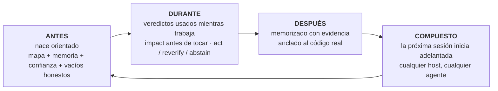

<p align="center">
  
</p>

**m1nd** le da a tu agente de codificación un cerebro por repositorio: un gráfico de código local servido sobre MCP, memoria anclada al código que cita y un veredicto de confianza en cada respuesta. "Evidencia insuficiente" es una respuesta válida aquí, al igual que "no confíes en esto todavía, y aquí está cómo repararlo".

Nada sale de tu máquina. Un binario hecho en Rust. MIT.

Piensa en él como una radiografía de tu repositorio que tu agente puede leer: una estructura que combina todo y dice dónde vive cada cosa, para qué sirve ese programa, en qué se está trabajando, qué está hecho y qué sigue pendiente. Ese panorama es algo que ninguna otra herramienta le ofrece a tu agente.

<p align="center">
  <a href="https://www.npmjs.com/package/@maxkle1nz/m1nd"></a>
  <a href="https://crates.io/crates/m1nd-mcp"></a>
  <a href="https://github.com/maxkle1nz/m1nd/actions"></a>
  <a href="LICENSE"></a>
  <a href="https://registry.modelcontextprotocol.io/?search=io.github.maxkle1nz/m1nd"></a>
</p>

<p align="center">Cuatro comandos para instalar: <a href="#sixty-seconds">Sesenta segundos</a>. Razones para cerrar esta pestaña primero: <a href="#when-not-to-use-m1nd">Cuándo no usar m1nd</a>.</p>

<p align="center">
  
</p>

<p align="center"><em>Una sesión real en el gráfico de 6,453 nodos de este repositorio (m1nd-mcp 1.4.0): <code>north</code> orienta, <code>seek</code> responde con un veredicto de <code>reverify</code>, <code>memorize</code> ancla el hallazgo al código.</em></p>

## La auditoría por la que tu agente deja de pagar

Sabes cómo es el ritual. El agente abre un archivo, busca, abre otro archivo, busca de nuevo, gasta la mayor parte de su contexto reconstruyendo qué es el repositorio, y solo entonces empieza la tarea real. Con m1nd, esa barrida se convierte en una sola pregunta. En menos de un segundo, el agente tiene el mapa: qué llama a qué, qué rompe a qué, dónde vive todo. No una pila de coincidencias para interpretar, sino la estructura conectada, ya ensamblada.

Y recuerda. Entre sesiones y entre agentes. Lo que un agente aprende hoy, otro agente lo hereda mañana, con la evidencia adjunta y una bandera si el código ha cambiado desde entonces. Cada conclusión deja un rastro, para que tú, o cualquier agente que venga después, siempre puedan ver qué pasó con ese código y por qué.

Entonces l1ght lo lleva más lejos: documentos, artículos, RFCs, borradores y notas se conectan a las partes de tu código que explican, dentro de la misma estructura. El agente obtiene el contexto CORRECTO en lugar del que suena más cercano, y dejar de inventar código que no existe deja de ser el camino de menor resistencia: la estructura dice qué existe, y el veredicto dice cuánto confiar en ello.

Antes de m1nd, una función era solo una función perdida en algún manual. Ahora vive dentro de la inteligencia del agente, combinada con el código, su historial, sus documentos y sus riesgos. No he encontrado nada como eso en ningún otro lugar.

## grep responde buenas preguntas. m1nd responde las más profundas.

Preguntas que tu agente puede hacer ahora y obtener una respuesta estructural:

- ¿Qué se rompe si modifico esta función?
- ¿Dónde ocurre realmente la actualización del token en este repositorio?
- ¿Por qué están conectados estos dos archivos, y ese camino es sólido o una suposición?
- ¿Qué aprendió la última sesión sobre este código, y sigue siendo cierto?
- ¿Qué siempre cambia junto aquí, incluso sin importar entre ellos?
- ¿Esta edición cruza un límite de arquitectura que no debería cruzar?
- ¿Qué afirmación en este documento implementa esta función?
- ¿El error que acabo de corregir está escondido en otro lugar, en forma de patrón?
- ¿Qué falta aquí que este patrón suele tener?
- ¿Estoy siquiera en el repositorio correcto?
- ¿Debo actuar según esta respuesta o verificarla primero?

Cada una es un verbo en la superficie MCP (`impact`, `seek`, `why`, `north`, `ghost_edges`, `xray_gate`, `antibody_scan`, `missing`, `trust_selftest`, `predict`), no un truco de comandos.

## Y no se detiene en mostrar la estructura

Anticuerpos: un error corregido se convierte en un patrón estructural identificado, y cada sesión posterior busca esa forma en todo el repositorio. Corrígelo una vez, búscalo para siempre.

Ghost edges: archivos que siempre cambian juntos sin importar entre ellos, extraídos de tu historial de git. El acoplamiento invisible que rompe las refactorizaciones.

Huecos estructurales: `missing` busca el código que no está. La protección, el reintento, el tiempo de espera que este patrón suele tener y este caso no.

Hipótesis contra el gráfico: plantea una afirmación en lenguaje simple ("las configuraciones pueden alcanzar el inicio sin validación") y haz que se pruebe contra la estructura activa.

Temblores: los archivos cuya velocidad de cambio está acelerando se marcan antes de que alguien informe el error.

Un gráfico cálido: los resultados confirmados refuerzan sus bordes, al estilo Hebbian, así que los caminos que probaron ser útiles se clasifican más alto para el próximo agente.

Cada una de estas funciones advierte o sugiere, pero tu compilador y pruebas todavía hacen la demostración.

## m1nd no solo busca. Escribe.

Aquí viene la parte que la gente tarda un momento en creer. El gráfico que lee tu repositorio también puede operar en él. Tu agente nombra un símbolo y un destino, alrededor de 48 tokens, y `transplant` calcula todo el traslado desde el gráfico: la región ampliada (los comentarios de documentación y atributos viajan juntos), las dependencias clasificadas por sus bordes de llamada (las privadas viajan, las compartidas se quedan y ganan una importación de vuelta), cada referente se recalifica en cada archivo que lo nombra. Luego escribe atómicamente, vuelve a ingerir y devuelve un recibo honesto: qué se movió, qué se quedó, qué no pudo resolver. `refs_unresolved` nunca está vacío silenciosamente cuando algo salió mal.

Es un proceso en dos fases, `transplant_preview` antes de `transplant_commit`, y el commit revalida el hash de cada archivo que planeó tocar, para que nada se produzca en un repositorio que cambió antes de que lo hiciera. La zona crítica de tu repositorio (backend, esquema, pagos, CI) está protegida del lado del servidor y falla de manera segura. Una negación nunca toca un byte y enseña el intento fallido: una colisión nombra al ocupante, un módulo inválido se nombra a sí mismo, un traslado entre crates nombra las raíces de ambos.

Medido en un caso real: el costo de la edición en todo el archivo fue de 12,235 tokens generados; el traslado costó 48 de entrada y escribió 3 archivos en 1.3 segundos, con el crate compilando al otro lado. rust-analyzer tiene un tema abierto solicitando traslados entre archivos desde 2019.

Límites de v1, declarados claramente: solo Rust, solo funciones de nivel superior, mismo crate, el archivo destino debe existir ya, y las referencias creadas dentro de macros son invisibles para él. Cada límite es deliberado y está documentado en [docs/TRANSPLANT-PRD.md](docs/TRANSPLANT-PRD.md), junto a 13 archivos de prueba que sostienen el verbo.

## ¿Y cuando no es un agente sino cinco?

Ejecuta varios agentes en el mismo repositorio y el gráfico se convierte en el lugar donde se coordinan. Cada sesión se registra como una presencia, y cuando dos de ellos están a punto de tocar trabajos superpuestos, ambos son advertidos en su próximo paquete de orientación, antes de que cualquiera haga un cambio. El sistema advierte; tú decides.

El trabajo acotado corre como misiones, y las misiones responden por ellas mismas de una manera que la mayoría de los equipos humanos suelen omitir: cada herramienta de misión informa `non_claims`, la lista de lo que NO se demostró. Una afirmación no puede cerrarse solo con evidencia del gráfico. Requiere una lectura del archivo, una prueba o una verificación en tiempo de ejecución, y la prueba que lo refuerza lleva por nombre `graph_only_evidence_is_not_enough`.

Y las protecciones no dan falsas alarmas. `xray_gate` puede decir `blocked` solo desde un manifiesto de límite ratificado por un humano. Todo lo demás llega como una advertencia con una razón, así que el agente nunca aprende a ignorar su propia protección de seguridad.

Cada cerebro también tiene un buzón. Un agente que encuentra un defecto real fuera de su propia misión no lo corrige en el momento ni lo omite: deja una carta en el buzón de ese repositorio, en disco, junto al código. El próximo agente que trabaje con ese cerebro revisa el buzón y comienza sabiendo los defectos que otros agentes encontraron, con el contexto adjunto. El conocimiento de lo que está roto deja de morir en el historial de chat. La revisión es un gesto deliberado (CLI o REST, nunca dentro del ciclo de consulta), así que las cartas informan el trabajo en lugar de interrumpirlo.

## Nacido primero para agente

Sin cuentas, sin telemetría y sin API entrometida, lo que también explica por qué el gráfico responde en microsegundos.

El desarrollo de m1nd tampoco es muy normal. Construirlo implicó crear todo un flujo de trabajo donde los agentes dirigen, verifican y prueban el trabajo, y la lógica del producto está orientada al dolor del agente, no al tablero del humano. Cuando m1nd se porta mal en el campo, los agentes que lo usan presentan el informe, y un error confirmado se convierte en una prueba roja antes de que llegue la corrección. Muy pocos programas parten de eso en su diseño inicial. Así que m1nd nació diferente: los verbos, las denegaciones y los paquetes están diseñados para el lector que realmente los utiliza, y ni siquiera tienes que recordarle al modelo que la herramienta existe. `m1nd hosts apply` instala hooks de sesión (`SessionStart`, `agentSpawn`, `TaskStart`, por host) que inyectan la orientación al comienzo: tu agente, y cada subagente que genera, comienza orientado antes de que alguien teclee una palabra.

Un cerebro por repositorio lo mantiene unido: un gráfico, su propia memoria, su propia persistencia, vinculado a una raíz de repositorio. Un propietario servido aloja muchos cerebros y dirige cada sesión al correcto; una sesión de un repositorio que no aloja obtiene una denegación en lugar de respuestas incorrectas.

## Lo que tu agente obtiene

m1nd envuelve todo el ciclo del agente en torno a un gráfico de tu repositorio que sobrevive a la sesión:



La puerta de entrada es solo una llamada. `north(task)` devuelve toda la orientación en un único paquete antes de cualquier recuperación:

```jsonc
{"method":"tools/call","params":{"name":"north",
  "arguments":{"agent_id":"dev","task":"reforzar el flujo de validación de tokens JWT"}}}
```

```jsonc
{
  "binding": { "trust_mode": "full_trust", "ok": true },      // veredicto antes de la recuperación
  "memory": [                                                 // recuperado de una sesión ANTERIOR
    { "claim": "AuthTokenFlow", "source_agent": "authbot", "age_ms": 221, "stale": false }
  ],
  "sufficiency": { "state": "gathering", "top_score": 0.64 },
  "next_move": "Llama a `surgical_context` en el nodo de enfoque superior antes de editar.",
  "honest_gaps": []                                           // nada retenido en este gráfico
}
```

Mientras el agente trabaja, `impact` muestra el radio de efecto antes de que un cambio ocurra, `why` explica una conexión y admite cuando el camino se basa en una suposición, y `xray_gate` advierte antes de que un cambio cruce un límite de arquitectura. Cuando el trabajo está hecho, `memorize` escribe la conclusión con la evidencia que la respalda. La próxima sesión inicia con las conclusiones de la última ya en mano en cualquier host MCP: Claude Code, Codex, Cursor, Gemini, Zed, 22 hosts en total.

Nunca utilizas estos verbos directamente. El agente lo hace. Tu interacción es una pequeña CLI de configuración inicial, y luego sigues comunicándote con tu agente como siempre.

## Sesenta segundos

El paquete npm es el instalador. El runtime nativo es un binario Rust separado que el paso 1 descarga como una versión firmada.

```bash
# 1 · instalar el runtime nativo (firmado, verificado, con reversión)
npx -y @maxkle1nz/m1nd update apply --yes

# 2 · confirmar que es visible (imprime un veredicto JSON; "estado": "ok" es lo esperado)
npx -y @maxkle1nz/m1nd doctor

# 3 · configurar tu host: configuración de MCP + hooks de sesión para tener m1nd como entorno
npx -y @maxkle1nz/m1nd hosts apply --host claude --project . --yes

# 4 · primer valor: el paquete de orientación para TU repositorio, solo lectura, sin tocar configuración
npx -y @maxkle1nz/m1nd agent first-minute --repo . --query "mapear este repositorio" --json
```

El paso 1 verifica la firma con [`cosign`](https://docs.sigstore.dev/cosign/system_config/installation/), así que primero instala eso si no está en tu PATH. Si prefieres usar el registro fuente y aceptas saltarte la verificación, también funciona `cargo install m1nd-mcp`. Prefieres mirar antes de escribir: `hosts plan` imprime todo lo que `hosts apply` tocaría, y no escribe nada. Todavía no hay un comando de desinstalación, `hosts plan` sirve como lista de qué eliminar manualmente.

Los hooks del paso 3 son lo que hace a m1nd un entorno: el paquete de orientación se inyecta en cada inicio de sesión y generación de subagente, y el agente se dirige desde allí. ¿Instalar desde un agente en lugar de una terminal? Hay una versión legible por máquina de esta sección en [`llms-install.md`](llms-install.md).

Una versión truncada o manipulada no puede instalarse en tu máquina, y una mala actualización es reversible: el actualizador verifica la firma contra la identidad exacta del build, luego el SHA-256 y el tamaño antes de tocar algo. Si falla la verificación, se niega en lugar de caer en un camino no verificado. Detalles en [docs/AGENT-PACKS.md](docs/AGENT-PACKS.md).

## Si desaparezco

m1nd es MIT y no hay servidor que perder. El runtime es un binario Rust ya en tu disco. La memoria que escribe es markdown simple bajo `agent-memory/`, legible y buscable sin m1nd instalado en absoluto. El gráfico se deriva de tu código y se reconstruye desde cero en cualquier máquina. Si este proyecto termina mañana, conservas los archivos y pierdes una herramienta. Eso es deliberado. Es por eso que la memoria es markdown y por qué no hay una nube entre tu agente y su propio conocimiento.

## Por qué confiar en las respuestas

Esto es por lo que construí m1nd. Las capas de recuperación son buenas para responder. Casi ninguna es buena para negarse. m1nd trata la negación como un resultado de primera clase:

```jsonc
// trust_selftest en un runtime no vinculado. El veredicto ES la instrucción de reparación:
{
  "ok": false,
  "verdict": "needs_ingest",          // nunca un simple "sin resultados"
  "next_action": "call_ingest",
  "recovery_playbook": {
    "steps": [ { "action": "Llama a ingest para el repositorio deseado en este mismo binding." } ]
  }
}
```

Un resultado `seek` trae una lectura de suficiencia y un sobre de confianza. Cuando aún no se ha medido ninguna calibración, el sobre limita su propio veredicto a `reverify` en lugar de exagerar. El gate de `predict` está sintonizado para cobertura (α=0.10); en el historial de este repositorio eso llega a aproximadamente un tercio de precisión en la banda `act`, y la mayoría de las veces se abstiene, lo cual es la salida honesta de una señal débil. `abstain` indica al agente que se detenga. `insufficient_evidence` significa que no hay evidencia en absoluto, lo cual es algo diferente de riesgo medio, y la API mantiene ambas separadas.

Dos herramientas, `savings` y `resonate`, fueron eliminadas por completo en la beta (handlers, tipos y archivos de estado, todo borrado) porque devolvían un resultado positivo en cada entrada que les di, y una herramienta que nunca pierde ha dejado de medir. Ese es el nivel que se aplica a cada afirmación en este archivo.

El vecino más cercano que conozco es GitHub Copilot Memory (vista pública, 2026): almacena hechos con citas de código y los vuelve a verificar contra la rama actual antes de usarlos. Eso es verdadera detección de antigüedad y merece el crédito. También está en la nube, es binario y vive dentro de Copilot. Lo que aún no he encontrado en ningún lugar es el resto del veredicto: un gradado `act` / `reverify` / `abstain` con calibración por repositorio, negaciones tipadas que traen un plan de reparación, en un gráfico local que cualquier agente MCP puede compartir. Revisé los documentos públicos de Mem0, Zep, Letta, Cognee, Supermemory y Copilot Memory, a julio de 2026. ¿Conoces uno más cercano? Abre un tema y lo enlazaré aquí.

## Una memoria que sabe cuándo es antigua

La mayoría de las capas de memoria almacenan texto y esperan. m1nd ancla memoria al gráfico. Cuando un agente llama a `memorize`, la ruta `evidence` de cada afirmación se resuelve al nodo de código real, así que la nota aparece cada vez que el agente toca ese código, sin que nadie recuerde que existe:

```jsonc
memorize({
  "agent_id": "authbot",
  "node_label": "AuthTokenFlow",
  "claims": [{
    "label": "TokenValidator",
    "text": "TokenValidator valida JWTs mediante HMAC. Rota claves solo a través de KMS.",
    "confidence": "high", "evidence": ["src/auth/token.rs"]
  }]
})
```

Debido a que la memoria está anclada, puede ser auditada contra la realidad. `cross_verify` rehace el hash de cada archivo citado y nombra qué afirmaciones quedaron obsoletas porque su código cambió. Las afirmaciones tienen edad y autor, reemplazan afirmaciones anteriores y caducan. Este ciclo se prueba en vivo de principio a fin en este repositorio: memorizar, anclar, editar el archivo citado, ver la afirmación marcarse a sí misma, sobrevivir una re-ingestión completa, carga automática en el próximo inicio. Mata el proceso, inicia uno nuevo y el primer `north` ya lleva las afirmaciones de la sesión anterior con procedencia adjunta.

## Un gráfico para código y conocimiento (l1ght)

l1ght es el segundo carril del mismo motor: los documentos se convierten en nodos de gráfico en el mismo espacio de activación que el código, así que una consulta atraviesa ambos. No es una carpeta RAG añadida. Hay 7,400 líneas de adaptadores dedicados en este árbol: Markdown, HTML, PDF, texto plano, RST y JSON, además de rutas académicas para BibTeX, DOI/Crossref, documentos JATS, RFCs y patentes.

Diferentes personas obtienen diferentes productos de este mismo carril:

- Un investigador coloca una carpeta de PDFs y DOIs junto al código de análisis y pregunta qué documento contradice la afirmación que esta función implementa.
- Un estudiante conecta un capítulo de libro de texto y el código del ejercicio como un solo gráfico, y el agente explica cada uno en términos del otro.
- Un maestro ingresa las notas del curso una vez; el agente de cada estudiante responde desde el mismo corpus fundamentado en lugar de improvisar.
- Un ingeniero vincula RFCs y documentos de diseño a las funciones que los implementan; la sección del espec está a un paso del código.
- El "vibecoder" deja de tener solo un montón de chats y notas dispersas y las convierte en memoria que el agente realmente consulta mientras edita.

Mismo binario, mismos verbos MCP, misma capa de confianza. `seek` en un gráfico mixto devuelve código y documentos en una respuesta clasificada.

## Cuándo no usar m1nd

Algunas razones honestas para cerrar esta pestaña:

- Repositorios pequeños. Con unos pocos cientos de archivos, grep ya es barato y los bordes del gráfico se reducen a casi nada. Una medición independiente de herramientas de gráficos en un repositorio de ~110 archivos indicó una ventaja de aproximadamente un 20 por ciento. Es real, pero no vale la pena ejecutar un runtime para eso.
- Preguntas ambiguas. Un gráfico de símbolos responde "qué conecta con qué". No responde "por qué esto se siente lento". La búsqueda agentiva es mejor para preguntas abiertas.
- Veracidad del compilador y runtime. Tu LSP, tus pruebas y tu perfilador tienen razón y m1nd solo hace conjeturas. m1nd apunta, ellos prueban.
- Tareas pequeñas. Un archivo y veinte líneas no necesitan una ingestión. Omítelo.
- `predict` en su mayoría se abstiene hoy en día. Calibrado en el propio historial de este repositorio alcanza aproximadamente un tercio de precisión en la banda `act` con baja cobertura. Abstenerse es la salida honesta de una señal débil, y en este momento también es la mayoría de la salida.

m1nd complementa el compilador, el ejecutor de pruebas y tus herramientas de seguridad. No reemplaza ninguna de ellas.

## Evidencia

Todo lo anterior está incluido en la versión actual; los documentos bajo `docs/` marcados PRD son la intención de diseño, mantenidos etiquetados aparte. Cada línea está respaldada con lo que se ha medido exactamente. m1nd no lidera con ahorro de tokens o ROI, y eso es deliberado: esos son los números menos verificables en esta categoría.

| Afirmación | Resultado | Reproducir / límite |
|---|---|---|
| Latencia del gráfico | ~1.4µs `activate`, ~0.5µs `impact` en un gráfico sintético de 1K nodos | `cargo bench -p m1nd-core` en Apple silicon. Orden de magnitud solamente, dependiente del hardware. |
| Batería de capacidades vs grep | 37/37 pasan; cara a cara 16 ganan, 12 empatan, 0 grep gana | `python3 scratchpad/m1nd_battery.py ./target/release/m1nd-mcp . --suite m1nd`. Un repositorio (este), casos autogenerados. |
| Puerta de cobertura en `predict` | aproximadamente un tercio de precisión en la banda `act` a baja cobertura (α=0.10) | Medido en el historial de git de este repositorio, n≈9.2k predicciones separadas. La puerta se abstiene en mayor medida, por diseño. |
| Auto-verificación de memoria | ciclo de 6 pasos probado en vivo | memorize → anclar → flag de frescura en un archivo editado → sobrevive reemplazo → carga automática al iniciar. |
| Persistencia entre arranques y bloqueos | la puerta maneja el binario real sobre stdio entre cuatro arranques limpios, y entre un kill -9 | `m1nd-mcp/tests/persist_runtime_root.rs`. Revertir cualquier corrección en el arranque lo convierte en rojo con un mensaje que nombra la regresión. |

## Un gráfico, muchos agentes

Para un agente, el servidor stdio de [Sesenta segundos](#sixty-seconds) es todo lo que necesitas, y el agente puede llamar a `ingest` directamente en un gráfico vacío. Para trabajo real, ejecuta un propietario servidor que aloja el gráfico en tiempo real y conecta a cada agente como un puente delgado:

```bash
m1nd-mcp --serve --no-gui --port 1337 --runtime-dir /your/project/.m1nd
m1nd-mcp --attach auto --stdio     # cada agente: sin carga de gráfico, sin lease, memoria compartida
```

Lo que un agente memoriza, otro lo recuerda inmediatamente, y las presencias y advertencias de colisión descritas anteriormente funcionan a través de este mismo servidor. También aloja cerebros por repositorio y renderiza la interfaz web. Las consultas permanecen en localhost; cualquier enlace no loopback se rechaza hasta que exista un transporte autenticado.

Una protección importante: un propietario servidor rechaza el genérico `ingest` para repositorios que no hospeda ya. Crear un nuevo cerebro en un propietario servidor es un gesto reducido y falla cerrado por diseño. Para una primera sesión en un nuevo repositorio, usa el camino stdio o `m1nd agent first-minute`. Conéctate al servidor una vez que aloje tu repositorio. Guía completa de despliegue: [docs/deployment.md](docs/deployment.md).

## Cobertura de lenguaje

Los extractores dedicados cubren más de veinte lenguajes, así un repositorio poliglota no regresa mapeado a mitad: desde Python y TypeScript hasta Elixir, Haskell y Zig, organizado por extensión de archivo en `m1nd-ingest`. La tabla abajo es la afirmación más estricta, comprobada de extremo a extremo en una sola ingestión poliglota: bordes del gráfico de llamadas más resolución de importaciones entre archivos.

| Lenguaje | `calls` | importaciones entre archivos |
|---|:---:|:---:|
| Rust | ✅ | ✅ |
| Python | ✅ | ✅ |
| JavaScript / TypeScript | ✅ | ✅ |
| Go | ✅ | ✅ |
| Java | ✅ | ✅ |
| C / C++ | ✅ | ✅ |
| Kotlin | ✅ | ✅ |
| PHP | ✅ | ✅ |
| Scala | ✅ | ✅ |
| Ruby | ⏳ | ✅ |
| C# | ✅ | los namespaces no mapean 1:1 a archivos |
| Swift | ✅ | aún no |

Las importaciones no resolvibles (paquetes externos, stdlib, headers del sistema) quedan sin resolver en lugar de estimarse. Todo lo demás recurre a un extractor genérico con solo bordes `contains`.

## El humano es el segundo lector

La mayoría de las herramientas de desarrolladores están diseñadas para una persona y luego obtienen una API. m1nd va en la dirección opuesta: el agente es el usuario, y los verbos son sus verbos.

Esa elección moldea el diseño de formas que puedes verificar. Las negaciones son tipadas y traen un plan de recuperación, porque el lector que actúa sobre ellas es una máquina. Un mensaje de error que necesita interpretación humana es un fallo de diseño aquí. El mismo paquete de orientación que el agente lee como `north` se proyecta para ti como una tarjeta breve en la conversación y como el Árbol Vivo en la UI web servida (tu repositorio dibujado como un árbol navegable, con notas de memoria ancladas a él): calculado una vez, proyectado para cada lector, así la vista humana nunca puede desviarse hacia una segunda verdad.

Los humanos son bienvenidos. Solo eres el segundo lector, y el sistema es más honesto con ambos lectores por ello.

## Cómo se construye este repositorio

Lee el log de commits con una ceja levantada, y luego lee esto. Soy Max. Construyo m1nd dirigiendo un sistema de agentes de codificación, bajo reglas más estrictas que cualquier equipo humano con el que haya trabajado:

- Cada cambio sustancial comienza como una especificación enfrentada a un modelo oráculo independiente antes de que se escriba el código. Las objeciones se registran dentro de los archivos de las especificaciones.
- Cada corrección aterriza con una prueba que se demostró fallando primero. Una prueba que nunca estuvo en rojo no prueba nada.
- El revisor nunca es el autor. Cada agente trabaja anidado en worktrees aislados.
- Puerta verde es candidata. Yo ejecuto el gesto de aterrizaje y respondo por cada línea.
- Las leyes son nombres de prueba: `letter_cannot_color_the_store`, `gate_zero_cannot_land`, `graph_only_evidence_is_not_enough`.
- El árbol contiene 2,462 funciones de prueba, y todo el gate corre verde en Linux, macOS y Windows.

La pregunta del escéptico ("ningún humano escribe tanto tan rápido") es correcta. Ningún humano lo hace. Un humano dirigiendo un sistema de agentes basados en pruebas sí lo hace. Este árbol es lo que salió. La capa de confianza de m1nd nació de esa práctica diaria: necesitaba que mis propios agentes dejaran de confiar en respuestas obsoletas antes de poder enviar algo a este ritmo.

## Arquitectura a primera vista

Tres crates nucleares en Rust más auxiliares: `m1nd-mcp` (el servidor MCP y superficie runtime), `m1nd-core` (el motor gráfico: activación difusa, plasticidad hebbiana, CSR adjacencia, ghost edges derivadas de git), `m1nd-ingest` (extractores y adaptadores para código, documentos y memoria). Tu agente ve 48 herramientas por defecto en lugar de 130+, así escoge la correcta con más frecuencia y paga por una lista de herramientas más corta en cada solicitud; la superficie completa está a un `env var` de distancia (`M1ND_TOOL_TIER=full`), y la jerarquización solo recorta el menú informado, nunca la disponibilidad.

<p align="center">
  
</p>

Detalles en el [wiki](https://m1nd.world/wiki/), [docs/AGENT-PACKS.md](docs/AGENT-PACKS.md), [EXAMPLES.md](EXAMPLES.md) y [CHANGELOG.md](CHANGELOG.md).

## Traducciones

🇧🇷 [Português](i18n/README.pt-BR.md) · 🇪🇸 [Español](i18n/README.es.md) · 🇮🇹 [Italiano](i18n/README.it.md) · 🇫🇷 [Français](i18n/README.fr.md) · 🇩🇪 [Deutsch](i18n/README.de.md) · 🇨🇳 [中文](i18n/README.zh.md) · 🇯🇵 [日本語](i18n/README.ja.md)

Las traducciones siguen el texto en inglés con algún retraso. Si no concuerdan, el inglés es canónico.

## Contribuir

Las contribuciones son bienvenidas para extractores, adaptadores, herramientas MCP, benchmarks, documentación y algoritmos de gráficos. Consulta [CONTRIBUTING.md](CONTRIBUTING.md). Hay una sala activa en [CodeRooms](https://coderooms.com/github/maxkle1nz/m1nd) si quieres hablar primero. Y si leíste hasta aquí y quieres probarlo: [cuatro comandos](#sixty-seconds).

## Licencia

MIT. Consulta [LICENSE](LICENSE).
