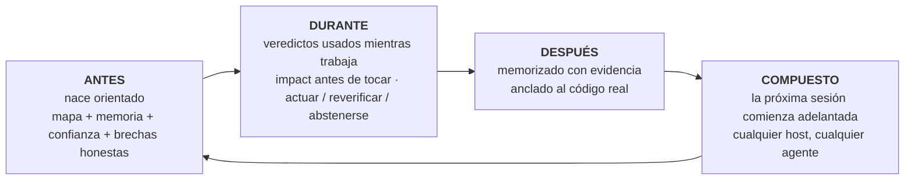

```markdown
<p align="center">
  
</p>

**m1nd** da a tu agente de codificación un cerebro por repositorio: un grafo de código local servido a través de MCP, memoria anclada al código que cita, y un veredicto de confianza en cada respuesta. "Evidencia insuficiente" es una respuesta válida aquí. También lo es "no confíes en esto aún, y aquí está cómo repararlo".

Nada sale de tu máquina. Un binario de Rust. MIT.

Piénsalo como un rayos X de tu repositorio que tu agente puede leer: una estructura que combina todo y dice dónde vive cada cosa, para qué sirve cada programa, en qué se está trabajando, qué está hecho y qué aún está pendiente. Ese panorama es algo que ninguna otra herramienta le da a tu agente.

<p align="center">
  <a href="https://www.npmjs.com/package/@maxkle1nz/m1nd"></a>
  <a href="https://crates.io/crates/m1nd-mcp"></a>
  <a href="https://github.com/maxkle1nz/m1nd/actions"></a>
  <a href="LICENSE"></a>
  <a href="https://registry.modelcontextprotocol.io/?search=io.github.maxkle1nz/m1nd"></a>
</p>

<p align="center">Cuatro comandos para instalar: <a href="#sixty-seconds">Sesenta segundos</a>. Razones para cerrar esta pestaña primero: <a href="#when-not-to-use-m1nd">Cuando no usar m1nd</a>.</p>

<p align="center">
  
</p>

<p align="center"><em>Una sesión real en el grafo de 6,453 nodos de este repositorio (m1nd-mcp 1.4.0): <code>north</code> orienta, <code>seek</code> responde con un veredicto de <code>reverify</code>, <code>memorize</code> ancla el hallazgo al código.</em></p>

## La auditoría que tu agente deja de pagar

Conoces el ritual. El agente abre un archivo, busca con grep, abre otro archivo, vuelve a buscar, quema la mayor parte de su contexto reconstruyendo lo que el repositorio incluso es, y recién ahí empieza la tarea real. Con m1nd esa exploración se convierte en una sola pregunta. En menos de un segundo el agente tiene el mapa: qué llama qué, qué rompe qué, dónde vive todo. No una pila de coincidencias para interpretar. La estructura conectada, ya ensamblada.

Y recuerda. Entre sesiones, y entre agentes. Lo que un agente aprende esta noche, otro agente lo hereda mañana, con la evidencia adjunta y una bandera si el código ha cambiado desde entonces. Cada conclusión deja un rastro, así que tú, o cualquier agente que venga después, siempre puede ver qué pasó con ese código y por qué.

Luego l1ght lo lleva más lejos: artículos, borradores, normas RFC y notas se conectan a las partes de tu código que explican, dentro de la misma estructura. El agente obtiene el contexto correcto en lugar del que suena cercano, y el hábito de inventar código inexistente deja de ser el camino de menor resistencia: la estructura dice lo que existe, y el veredicto dice cuánto confiar incluso en eso.

Antes de m1nd, una función solo era una función, perdida en algún manual. Ahora vive dentro de la inteligencia del agente, combinada con el código, su historia, sus documentos y sus riesgos. No he encontrado nada parecido en ningún otro lugar.

## grep responde buenas preguntas. m1nd responde las más profundas.

Preguntas que tu agente ahora puede hacer y obtener una respuesta estructural:

- ¿Qué se rompe si toco esta función?
- ¿Dónde ocurre realmente la actualización del token en este repositorio?
- ¿Por qué están conectados estos dos archivos, y es sólido ese vínculo o es una suposición?
- ¿Qué aprendió la última sesión sobre este código, y sigue siendo cierto?
- ¿Qué siempre cambia junto aquí, incluso sin importar entre ellos?
- ¿Esta edición cruza un límite de arquitectura que no debería cruzar?
- ¿Qué afirmación en este artículo implementa esta función?
- ¿El error que acabo de arreglar está oculto en algún otro lugar, como una forma?
- ¿Qué falta aquí que este patrón suele tener?
- ¿Estoy siquiera en el repositorio correcto?
- ¿Debería actuar sobre esta respuesta, o verificarla primero?

Cada una es un verbo en la superficie MCP (`impact`, `seek`, `why`, `north`, `ghost_edges`, `xray_gate`, `antibody_scan`, `missing`, `trust_selftest`, `predict`), no un truco de sugerencias.

## Y no se detiene con mostrar la estructura

Anticuerpos: un error corregido se convierte en un patrón estructural nombrado, y cada sesión posterior busca esa forma en todo el repositorio. Arréglalo una vez, encuéntralo para siempre.

Conexiones fantasmas: archivos que siempre cambian juntos sin importar entre ellos, derivados de tu historial git. El acoplamiento invisible que rompe refactorizaciones.

Huecos estructurales: `missing` busca el código que falta. El guardado, el reintento, el tiempo de espera que este patrón suele llevar y que esta instancia no tiene.

Hipótesis contra el grafo: establece una afirmación en lenguaje simple ("las configuraciones pueden alcanzar el arranque sin validación") y haz que se pruebe contra la estructura activa.

Temblor: los archivos cuya velocidad de cambio está acelerándose se señalan antes de que alguien archive el informe de error.

Un grafo cálido: los resultados confirmados refuerzan sus conexiones, estilo hebbiano, para que los caminos que demostraron ser útiles tengan mayor prioridad para el próximo agente.

Cada uno de estos marca y sugiere. Tu compilador y tus pruebas siguen haciendo la confirmación.

## m1nd no solo busca. Escribe.

Aquí está la parte que toma un segundo creer. El grafo que lee tu repositorio también puede operar sobre él. Tu agente nombra un símbolo y un destino, unas 48 palabras, y `transplant` calcula todo el movimiento desde el grafo: la región ampliada (los comentarios de documentación y atributos se trasladan), las dependencias clasificadas según sus conexiones de llamadas (las privadas se trasladan, las compartidas se quedan y ganan una re-importación), cada referente reajustado en cada archivo que lo nombra. Luego escribe de forma atómica, re-ingiere, y entrega un recibo honesto: qué se movió, qué se quedó, qué no pudo resolver. `refs_unresolved` nunca está silenciosamente vacío cuando algo salió mal.

Es de dos fases: `transplant_preview` antes de `transplant_commit`, y el commit re-valida el hash de cada archivo que planeaba tocar, para que nada aterrice en un repositorio que haya cambiado debajo. La zona crítica de tu repositorio (backend, esquema, pagos, CI) está protegida del lado del servidor y falla de manera cerrada. Una negativa nunca toca un byte y enseña el reintento: una colisión nombra al ocupante, una ruta de módulo inválida se nombra a sí misma, un movimiento entre crates nombra ambos roots del crate.

Medido en el caso real: el costo de edición de archivo completo fue de 12,235 palabras de salida. El trasplante costó 48 de entrada y escribió tres archivos en 1.3 segundos, con el crate compilando al otro lado. rust-analyzer tiene abierto un problema solicitando movimientos entre archivos desde 2019.

Límites de la versión 1, declarados claramente: solo Rust, solo funciones `fn` a nivel superior, mismo crate, el archivo de destino ya debe existir, y las referencias nacidas dentro de macros son invisibles para él. Cada límite es deliberado y está escrito en [docs/TRANSPLANT-PRD.md](docs/TRANSPLANT-PRD.md), junto a 13 archivos de prueba que sostienen el verbo.

## ¿Y cuando no es solo un agente, sino cinco?

Ejecuta varios agentes en el mismo repositorio y el grafo se convierte en el lugar donde se coordinan. Cada sesión se registra como una presencia, y cuando dos de ellos están a punto de tocar trabajos que se superponen, ambos son advertidos en su próximo paquete de orientación, antes de que cualquiera realice un cambio. El sistema advierte, tú decides.

El trabajo delimitado se ejecuta como misiones, y las misiones son responsables de sí mismas de una manera que la mayoría de los equipos humanos omiten: todas las herramientas de misiones reportan `non_claims`, la lista de lo que NO se probó. Una afirmación no puede cerrarse solo con evidencia del grafo. Requiere leer un archivo, ejecutar una prueba o realizar una sonda en tiempo de ejecución, y la prueba que refuerza esto se llama `graph_only_evidence_is_not_enough`.

Y las barandas de seguridad no lanzan falsas alarmas. `xray_gate` puede decir `blocked` solo desde un manifiesto de límites ratificados por un humano. Todo lo demás llega como una advertencia con una razón, por lo que el agente nunca aprende a ignorar su propio riel de seguridad.

Cada cerebro también tiene un buzón. Un agente que encuentra un defecto real fuera de su propia misión no lo corrige en el momento ni lo ignora: deja una carta en el buzón de ese repositorio, en el disco, junto al código. El próximo agente que trabaje en ese cerebro barre el buzón y comienza justo con el conocimiento de los defectos que otros agentes encontraron, con el contexto adjunto. El conocimiento de lo que está roto deja de morir en el historial de chat. La barrida es un gesto deliberado (CLI o REST, nunca dentro del bucle de consultas), para que las cartas informen el trabajo en lugar de interrumpirlo.

## Nacido para el agente primero

Sin cuentas, sin telemetría y sin API en el camino, lo cual también es la razón por la que el grafo responde en microsegundos.

El desarrollo de m1nd tampoco es muy normal. Construirlo significó construir un flujo de trabajo completo en el que los agentes dirigen, verifican y prueban el trabajo, y la lógica del producto está dirigida al dolor del agente, no al tablero de control del humano. Cuando m1nd se comporta mal en el campo, los agentes que lo usan son quienes hacen el informe, y un error confirmado se convierte en una prueba roja antes de que se haga la corrección. Muy pocos programas comienzan con eso en su diseño inicial. Así que m1nd nació diferente: los verbos, las negativas y los paquetes están diseñados para el lector que realmente los usa, y ni siquiera tienes que recordar al modelo que la herramienta existe. `m1nd hosts apply` instala ganchos de sesión (`SessionStart`, `agentSpawn`, `TaskStart`, por host) que inyectan la orientación al inicio: tu agente, y cada subagente que genera, comienza orientado antes de que nadie escriba una palabra.

Un cerebro por repositorio lo mantiene unido: un grafo, su propia memoria, su propia persistencia, vinculado a una raíz de repositorio. Un dueño servido alberga muchos cerebros y dirige cada sesión al correcto. Una sesión de un repositorio que no aloja obtiene una negativa tipificada en lugar de respuestas equivocadas.

## Lo que tu agente obtiene

m1nd envuelve todo el bucle de tu agente en torno a un grafo de tu repositorio que sobrevive a la sesión:



La puerta de entrada es una sola llamada. `north(task)` devuelve toda la orientación en un solo paquete, antes de cualquier recuperación:

```jsonc
{"method":"tools/call","params":{"name":"north",
  "arguments":{"agent_id":"dev","task":"fortalece el flujo de validación de los tokens JWT"}}}
```

```jsonc
{
  "binding": { "trust_mode": "full_trust", "ok": true },      // veredicto antes de la recuperación
  "memory": [                                                 // recuperado de una sesión ANTERIOR
    { "claim": "AuthTokenFlow", "source_agent": "authbot", "age_ms": 221, "stale": false }
  ],
  "sufficiency": { "state": "gathering", "top_score": 0.64 },
  "next_move": "Llama a `surgical_context` sobre el nodo de enfoque superior antes de editar.",
  "honest_gaps": []                                           // nada retenido en este grafo
}
```

Mientras el agente trabaja, `impact` muestra el radio de impacto antes de que se realice un cambio, `why` explica una conexión y admite cuando el camino descansa sobre una suposición, y `xray_gate` advierte antes de que un cambio cruce un límite de arquitectura. Cuando el trabajo está terminado, `memorize` registra la conclusión con la evidencia que la respalda. La próxima sesión comienza con las conclusiones de la sesión anterior ya disponibles, en cualquier host MCP: Claude Code, Codex, Cursor, Gemini, Zed, 22 hosts en total.

Nunca ejecutas ninguno de estos verbos tú mismo. El agente lo hace. Tu superficie es un pequeño CLI de configuración, y luego sigues hablando con tu agente como siempre.

## Sesenta segundos

El paquete de npm es el instalador. El runtime nativo es un binario separado de Rust que el paso 1 descarga como una versión firmada.

```bash
# 1 · instala el runtime nativo (firmado, verificado, con rollback)
npx -y @maxkle1nz/m1nd update apply --yes

# 2 · confirma que es visible (imprime un veredicto JSON; debe decir "status": "ok")
npx -y @maxkle1nz/m1nd doctor

# 3 · vincula tu host: configuración MCP + los ganchos de sesión que hacen m1nd ambiental
npx -y @maxkle1nz/m1nd hosts apply --host claude --project . --yes

# 4 · primer valor: el paquete de orientación para TU repositorio, solo lectura, sin tocar la configuración del host
npx -y @maxkle1nz/m1nd agent first-minute --repo . --query "mapea este repositorio" --json
```

El paso 1 verifica la firma con [`cosign`](https://docs.sigstore.dev/cosign/system_config/installation/), así que instálalo primero si no está en tu PATH. Si prefieres el registro fuente y aceptas saltarte la verificación, `cargo install m1nd-mcp` funciona también. Prefieres ver antes de escribir: `hosts plan` imprime todo lo que `hosts apply` tocaría y no escribe nada. No hay aún un comando de desinstalación; `hosts plan` es la lista de qué quitar manualmente.

Los ganchos del paso 3 son lo que hacen m1nd ambiental: el paquete de orientación se inyecta en cada inicio de sesión y de subagente, y el agente se dirige a sí mismo desde ahí. ¿Instalando desde un agente en lugar de una terminal? Hay una versión legible para máquinas de esta sección en [`llms-install.md`](llms-install.md).

Una versión truncada o manipulada no puede aterrizar en tu máquina, y una mala actualización está a solo un rollback: el actualizador verifica la firma contra la identidad exacta de la compilación, luego el SHA-256 y el tamaño, antes de tocar algo. Si la verificación falla, se niega a continuar en lugar de recurrir a una ruta no verificada. Detalles en [docs/AGENT-PACKS.md](docs/AGENT-PACKS.md).

## Si desaparezco

m1nd es MIT y no hay servidor que perder. El runtime es un binario de Rust que ya está en tu disco. La memoria que escribe es markdown simple bajo `agent-memory/`, legible y buscable con grep incluso si m1nd no está instalado. El grafo se deriva de tu código y se reconstruye desde cero en cualquier máquina. Si este proyecto se detiene mañana, mantienes los archivos y pierdes una herramienta. Eso es deliberado. Es por eso que la memoria es markdown y por qué no hay una nube entre tu agente y su propio conocimiento.

## Por qué confiar en las respuestas

Esta es la razón por la que construí m1nd. Las capas de recuperación son buenas para responder. Casi ninguna de ellas es buena para negarse. m1nd trata la negativa como resultado de primera clase:

```jsonc
// trust_selftest en un runtime no vinculado. El veredicto ES la instrucción de reparación:
{
  "ok": false,
  "verdict": "needs_ingest",          // nunca un simple "sin resultados"
  "next_action": "call_ingest",
  "recovery_playbook": {
    "steps": [ { "action": "Llama a ingest para el repositorio deseado en este mismo binding." } ]
  }
}
```

Un resultado positivo en `seek` incluye una lectura de suficiencia y un sobre de confianza. Cuando aún no se ha medido calibración, el sobre limita su propio veredicto a `reverify` en lugar de sobrevalorar. La puerta de `predict` está ajustada para cobertura (α=0.10); en la historia de este repositorio eso se traduce en aproximadamente un tercio de precisión en la banda `act`, y la mayor parte del tiempo se abstiene, que es la salida honesta de una señal débil. `abstain` le dice al agente que se detenga. `insufficient_evidence` significa sin evidencia en absoluto, lo cual es diferente de riesgo medio, y la API mantiene ambos separados.

Dos herramientas, `savings` y `resonate`, fueron eliminadas directamente en beta (handlers, tipos y archivos de estado, todo eliminado) porque devolvían una victoria en cada entrada que les di, y una herramienta que nunca pierde ha dejado de medir. Ese es el estándar al que se somete cada afirmación en este archivo.

El vecino más cercano que conozco es GitHub Copilot Memory (vista previa pública, 2026): almacena hechos con citas de código y los vuelve a verificar contra la versión actual antes de usarlos. Eso es detección real de caducidad, y merece crédito. También está en la nube, es binario, y vive dentro de Copilot. Lo que aún no he encontrado en ningún lugar es el resto del veredicto: un gradado `act` / `reverify` / `abstain` con calibración por repositorio, negativas tipadas que llevan un plan de reparación, en un grafo local que cualquier agente MCP puede compartir. Revisé la documentación pública de Mem0, Zep, Letta, Cognee, Supermemory y Copilot Memory, hasta julio de 2026. ¿Conoces uno más cercano? Abre un issue y lo enlazaré aquí.

## Memoria que sabe cuándo está obsoleta

La mayoría de las capas de memoria almacenan texto y esperan. La memoria de m1nd está anclada al grafo. Cuando un agente llama `memorize`, la ruta de `evidence` de cada afirmación se resuelve al nodo de código real, de manera que la nota aparece cada vez que el agente toca ese código, sin que nadie recuerde que existe:

```jsonc
memorize({
  "agent_id": "authbot",
  "node_label": "AuthTokenFlow",
  "claims": [{
    "label": "TokenValidator",
    "text": "TokenValidator valida JWTs vía HMAC. Rota claves solo a través de KMS.",
    "confidence": "high", "evidence": ["src/auth/token.rs"]
  }]
})
```

Porque la memoria está anclada, puede ser auditada contra la realidad. `cross_verify` re-hashea cada archivo citado y nombra qué afirmaciones se volvieron obsoletas porque su código cambió. Las afirmaciones tienen edad y autor, reemplazan afirmaciones más antiguas y caducan. Este ciclo está probado en vivo de punta a punta en este repositorio: memorizar, anclar, editar el archivo citado, ver la afirmación marcarse a sí misma, sobrevivir a una reintegración completa, auto-cargar en el siguiente inicio. Mata el proceso, inicia uno nuevo, y la primera llamada a `north` ya incluye las afirmaciones de la sesión anterior con la procedencia adjunta.

## Un grafo para código y conocimiento (l1ght)

l1ght es el segundo carril del mismo motor: los documentos se convierten en nodos del grafo en el mismo espacio de activación que el código, por lo que una consulta atraviesa ambos. No es una carpeta de RAG añadida al final. Hay 7,400 líneas de adaptadores dedicados en esta estructura: Markdown, HTML, PDF, texto plano, RST y JSON, más rutas académicas para BibTeX, DOI/Crossref, JATS papers, RFCs y patentes.

Diferentes personas obtienen productos diferentes del mismo carril:

- Un investigador deja una carpeta de PDFs y DOIs junto al código de análisis y pregunta qué artículo contradice la afirmación que esta función implementa.
- Un estudiante procesa un capítulo de libro de texto y el código de ejercicios como un grafo, y el agente explica cada uno en términos del otro.
- Un profesor ingiere las notas del curso una vez; el agente de cada estudiante responde del mismo corpus fundamentado en lugar de improvisar.
- Un ingeniero vincula RFCs y documentos de diseño a las funciones que los implementan; la sección de especificaciones está a un salto del código.
- Un vibecoder convierte su pila de exportaciones de chat y notas dispersas en memoria que el agente realmente consulta en plena edición.

Mismo binario, mismos verbos MCP, misma capa de confianza. `seek` en un grafo mixto devuelve código y documentos en una sola respuesta clasificada.

## Cuando no usar m1nd

Algunas razones honestas para cerrar esta pestaña:

- Repositorios pequeños. Con unos pocos cientos de archivos, grep ya es barato y el borde del grafo se reduce a casi nada. La medición independiente de herramientas gráficas comparables en un repositorio de ~110 archivos puso la ventaja en aproximadamente un 20 por ciento. Real, pero no vale la pena ejecutar un runtime para eso.
- Preguntas difusas. Un grafo de símbolos responde "qué conecta con qué". No responde "por qué esto parece lento". La búsqueda agéntica es mejor para preguntas abiertas.
- Verdad del compilador y tiempo de ejecución. Tu LSP, tus pruebas y tu profiler tienen la razón y m1nd está adivinando. m1nd señala, ellos prueban.
- Tareas pequeñas. Un archivo y veinte líneas no necesitan una ingesta. Sáltalo.
- `predict` principalmente se abstiene hoy en día. Calibrado en la historia de este repositorio alcanza aproximadamente un tercio de precisión en la banda `act` con baja cobertura. La abstención es la salida honesta de una señal débil, y en este momento también es la mayoría de la salida.

m1nd complementa el compilador, el ejecutor de pruebas y tus herramientas de seguridad. No reemplaza ninguna de ellas.

## Evidencia

Todo lo anterior se envía en la versión actual; los documentos bajo `docs/` marcados PRD son intención de diseño, mantenidos por separado. Cada fila está respaldada estrictamente por lo que se midió. m1nd no lidera con ahorros de palabras o ROI, y eso es deliberado: esos son los números menos falsificables en esta categoría.

| Afirmación | Resultado | Reproducir / respaldo |
|---|---|---|
| Latencia del grafo | ~1.4µs `activate`, ~0.5µs `impact` en un grafo sintético de 1K nodos | `cargo bench -p m1nd-core` en Apple silicon. Orden de magnitud solamente, dependiente del hardware. |
| Batería de capacidades frente a grep | 37/37 pasan; cara a cara 16 victorias, 12 empates, 0 victorias de grep | `python3 scratchpad/m1nd_battery.py ./target/release/m1nd-mcp . --suite m1nd`. Un repositorio (este), casos autogenerados. |
| `predict` afinado para cobertura | aproximadamente un tercio de precisión en la banda `act` con baja cobertura (α=0.10) | Medido en la historia git de este repositorio, n≈9.2k predicciones retenidas. La puerta principalmente se abstiene, por diseño. |
| Auto-verificación de memoria | ciclo de 6 pasos probado en vivo | memorizar → anclar → marcar de frescura en un archivo editado → sobrevive reemplazo → carga automática al inicio. |
| Persistencia a través de reinicios y crasheos | la puerta impulsa el binario real sobre stdio en cuatro arranques limpios y a través de un kill -9 | `m1nd-mcp/tests/persist_runtime_root.rs`. Revertir cualquiera de las correcciones de inicio lo hace rojo con un mensaje nombrando la regresión. |

## Un grafo, muchos agentes

Para un agente, el servidor stdio de [Sesenta segundos](#sixty-seconds) es todo lo que necesitas, y el agente puede llamar a `ingest` directamente en un grafo vacío. Para trabajo real, ejecuta un dueño servido que mantenga el grafo en vivo, y conecta cada agente a él como un puente ligero:

```bash
m1nd-mcp --serve --no-gui --port 1337 --runtime-dir /your/project/.m1nd
m1nd-mcp --attach auto --stdio     # cada agente: sin carga de grafo, sin arrendamiento, memoria compartida
```

Lo que un agente memoriza, otro recuerda inmediatamente, y las advertencias de presencia y colisión descritas anteriormente pasan por este mismo dueño. También alberga cerebros por repositorio y renderiza la interfaz web. Las consultas permanecen en localhost; cada vínculo no loopback es rechazado hasta que exista transporte autenticado. `auto` encuentra primero al dueño de tu propio runtime, y de otra manera cualquier dueño vivo que ya haya ingerido el repositorio en el que estás parado — incluido desde un worktree de git — así que un dueño central se encuentra desde dentro de sus propios proyectos en lugar de que cada repositorio inicie un cerebro vacío.

Una puerta que debes conocer: un dueño servido rechaza `ingest` genérico para los repositorios que aún no hospeda. Crear un nuevo cerebro en un dueño servido es un gesto regulado, y falla cerrado por diseño. Para una primera sesión en un nuevo repositorio, utiliza la ruta stdio o `m1nd agent first-minute`. Conéctate al dueño una vez que hospede tu repositorio. Guía completa de despliegue: [docs/deployment.md](docs/deployment.md).

## Cobertura de idiomas

Extractores dedicados cubren más de veinte lenguajes, por lo que un repositorio políglota no vuelve medio mapeado: desde Python y TypeScript hasta Elixir, Haskell y Zig, dirigidos por extensión de archivo en `m1nd-ingest`. La tabla a continuación es la afirmación más estricta, probada de punta a punta en una ingestión políglota única: bordes de grafo de llamadas más resolución de importaciones entre archivos.

| Idioma | `calls` | importaciones entre archivos |
|---|:---:|:---:|
| Rust | ✅ | ✅ |
| Python | ✅ | ✅ |
| JavaScript / TypeScript | ✅ | ✅ |
| Go | ✅ | ✅ |
| Java | ✅ | ✅ |
| C / C++ | ✅ | ✅ |
| Kotlin | ✅ | ✅ |
| PHP | ✅ | ✅ |
| Scala | ✅ | ✅ |
| Ruby | ⏳ | ✅ |
| C# | ✅ | los namespaces no se mapean 1:1 con los archivos |
| Swift | ✅ | aún no |

Las importaciones irresolubles (paquetes externos, biblioteca estándar, encabezados del sistema) se quedan sin resolver en lugar de hacer una suposición. Todo lo demás tiene como último recurso un extractor genérico con solo bordes de `contains`.

## El humano es el segundo lector

La mayoría de las herramientas para desarrolladores se construyen para una persona y luego desarrollan una API. m1nd va en el sentido contrario: el usuario es el agente y los verbos son sus verbos.

Esa elección da forma al diseño de maneras que puedes verificar. Las negativas están tipadas y llevan un plan de recuperación, porque el lector que actúa sobre ellas es una máquina. Un mensaje de error que requiere interpretación humana es un fracaso de diseño aquí. El mismo paquete de orientación que el agente lee como `north` se representa para ti como una carta corta en la conversación y como el Living Tree en la interfaz web servida (tu repositorio dibujado como un árbol navegable, notas de memoria fijadas en él): computado una vez, proyectado por lector, para que la vista humana nunca se desvíe hacia una segunda verdad.

Los humanos son bienvenidos. Solo eres el segundo lector, y el sistema es más honesto para ambos lectores debido a ello.

## Cómo se construye este repositorio

Lee el registro de commits con una ceja levantada, luego lee esto. Soy Max. Construyo m1nd dirigiendo un sistema de agentes de codificación, bajo reglas más estrictas que la mayoría de los equipos humanos con los que he trabajado:

- Cada cambio sustancial comienza como una especificación confrontada por un modelo oráculo independiente antes de escribir código. Las objeciones están registradas dentro de los archivos de especificaciones.
- Cada corrección aterriza con una prueba que se demostró fallando primero. Una prueba que nunca ha estado roja no demuestra nada.
- El revisor nunca es el autor. Cada agente trabaja manualmente en un worktree aislado.
- Una puerta verde es un candidato. El gesto de aterrizaje es mío, y soy responsable de cada línea.
- Las leyes son nombres de pruebas: `letter_cannot_color_the_store`, `gate_zero_cannot_land`, `graph_only_evidence_is_not_enough`.
- El árbol contiene 2,462 funciones de prueba, y la puerta completa es verde en Linux, macOS y Windows.

La pregunta del escéptico ("ningún humano escribe tanto tan rápido") es correcta. Ningún humano lo hace. Un humano que dirige un sistema de pruebas-agente sí. Este árbol es lo que salió. La capa de confianza de m1nd nació de esa práctica diaria: necesitaba que mis propios agentes dejaran de confiar en respuestas obsoletas antes de poder enviar algo a este ritmo.

## Arquitectura en un vistazo

Tres crates centrales en Rust más auxiliares: `m1nd-mcp` (el servidor MCP y la superficie del runtime), `m1nd-core` (el motor del grafo: activación repartida, plasticidad hebbiana, CSR adjacency, bordes fantasmas derivados de git), `m1nd-ingest` (extractores y adaptadores para código, documentos y memoria). Tu agente ve 48 herramientas por defecto en lugar de 130+, por lo que elige la correcta más a menudo y paga por una lista de herramientas más corta en cada solicitud; toda la superficie está a un env var (`M1ND_TOOL_TIER=full`), y la clasificación solo recorta el menú publicado, nunca la disponibilidad.

<p align="center">
  
</p>

La profundización está en el [wiki](https://m1nd.world/wiki/), [docs/AGENT-PACKS.md](docs/AGENT-PACKS.md), [EXAMPLES.md](EXAMPLES.md) y [CHANGELOG.md](CHANGELOG.md).

## Traducciones

🇧🇷 [Português](i18n/README.pt-BR.md) · 🇪🇸 [Español](i18n/README.es.md) · 🇮🇹 [Italiano](i18n/README.it.md) · 🇫🇷 [Français](i18n/README.fr.md) · 🇩🇪 [Deutsch](i18n/README.de.md) · 🇨🇳 [中文](i18n/README.zh.md) · 🇯🇵 [日本語](i18n/README.ja.md)

Las traducciones siguen el texto en inglés con cierto retraso. Cuando no coinciden, el inglés es canónico.

## Cómo contribuir

Las contribuciones son bienvenidas en extractores, adaptadores, herramientas MCP, benchmarks, documentación y algoritmos de grafo. Ver [CONTRIBUTING.md](CONTRIBUTING.md). Hay una sala en vivo en [CodeRooms](https://coderooms.com/github/maxkle1nz/m1nd) si quieres hablar primero. Y si has leído hasta aquí y deseas probarlo: [cuatro comandos](#sixty-seconds).

## Licencia

MIT. Ver [LICENSE](LICENSE).
```
