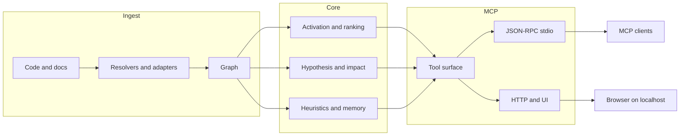

🇬🇧 [English](../README.md) | 🇧🇷 [Português](README.pt-BR.md) | 🇪🇸 [Español](README.es.md) | 🇮🇹 [Italiano](README.it.md) | 🇫🇷 [Français](README.fr.md) | 🇩🇪 [Deutsch](README.de.md) | 🇨🇳 [中文](README.zh.md) | 🇯🇵 [日本語](README.ja.md)

<p align="center">
  
</p>

<h3 align="center">Pensé d’abord pour les agents. Les humains sont les bienvenus.</h3>

<p align="center">
  <strong>Avant de changer le code, vois ce qui casse.</strong><br/>
  <strong>Pose une question au codebase. Obtiens la carte, pas le labyrinthe.</strong><br/><br/>
  m1nd donne aux agents de coding une intelligence structurelle avant qu’ils ne se perdent dans des boucles grep/read. Tu ingères un dépôt une seule fois, tu le transformes en graphe, puis l’agent peut demander ce qui compte vraiment : ce qui casse si ça change, ce qui bouge avec lui, et ce qu’il faut vérifier ensuite.<br/>
  <em>Exécution locale. MCP sur stdio. Surface HTTP/UI optionnelle dans le build par défaut actuel.</em>
</p>

<p align="center">
  <strong>Basé sur le code, les tests et les surfaces d’outils déjà livrées.</strong>
</p>

<p align="center">
  <a href="https://crates.io/crates/m1nd-core"></a>
  <a href="https://github.com/maxkle1nz/m1nd/actions"></a>
  <a href="../LICENSE"></a>
  <a href="https://docs.rs/m1nd-core"></a>
</p>

<p align="center">
  <a href="#identity">Identité</a> &middot;
  <a href="#what-m1nd-does">Ce que fait m1nd</a> &middot;
  <a href="#résultats-et-mesures">Résultats</a> &middot;
  <a href="#quick-start">Démarrage rapide</a> &middot;
  <a href="#configurer-votre-agent">Configurer votre agent</a> &middot;
  <a href="#when-not-to-use-m1nd">Quand ne pas utiliser m1nd</a> &middot;
  <a href="#use-cases">Cas d'usage</a> &middot;
  <a href="#contributing">Contribuer</a> &middot;
  <a href="#license">Licence</a> &middot;
  <a href="#surface-des-outils">Tools</a> &middot;
  <a href="../EXAMPLES.md">Examples</a>
</p>

<h4 align="center">Fonctionne avec n’importe quel client MCP</h4>

<p align="center">
  <a href="https://claude.ai/download"></a>
  <a href="https://cursor.sh"></a>
  <a href="https://codeium.com/windsurf"></a>
  <a href="https://github.com/features/copilot"></a>
  <a href="https://zed.dev"></a>
  <a href="https://github.com/cline/cline"></a>
  <a href="https://roocode.com"></a>
  <a href="https://github.com/continuedev/continue"></a>
  <a href="https://opencode.ai"></a>
  <a href="https://aws.amazon.com/q/developer"></a>
</p>

<p align="center">
  <strong>Trouve des bugs structurels en &lt;1s</strong> &middot; 89% de précision des hypothèses &middot; Réduit 84% des coûts de contexte LLM
</p>

---

## Identity

m1nd est une intelligence structurelle pour les agents de coding.

Tu ingères un codebase une seule fois, tu le transformes en graphe, puis l’agent peut poser directement des questions structurelles.

Avant une modification, m1nd aide l’agent à voir le blast radius, le contexte connecté, les co-changements probables et ce qu’il faut vérifier ensuite, avant de se perdre dans des boucles grep/read.

> Arrête de payer le coût d’orientation à chaque tour.
>
> `grep` trouve ce que tu as demandé. `m1nd` trouve ce que tu as manqué.

## What m1nd Does

m1nd sert au moment juste avant que l’agent se perde.

Tu ingères le dépôt une seule fois, tu le transformes en graphe et tu arrêtes de faire reconstruire la structure à partir de texte brut à chaque tour.

Cela signifie qu’il peut répondre aux vraies questions :

- qu’est-ce qui est relié à ça ?
- qu’est-ce qui casse si je change ça ?
- qu’est-ce qui doit probablement bouger avec lui ?
- où se trouve le contexte connecté pour une édition ?
- qu’est-ce que je devrais vérifier ensuite ?

Sous le capot, le workspace comporte trois crates cœur plus un crate de pont auxiliaire :

- `m1nd-core` : moteur de graphe, propagation, plasticité, heuristiques et couches d’analyse
- `m1nd-ingest` : ingestion de code et de documents, extracteurs, résolveurs, chemins de merge et construction du graphe
- `m1nd-mcp` : serveur MCP sur stdio, plus une surface HTTP/UI dans le build par défaut actuel
- `m1nd-openclaw` : crate de pont auxiliaire pour les surfaces d’intégration côté OpenClaw

Points forts actuels :

- navigation de dépôt fondée sur le graphe plutôt que sur la seule recherche textuelle
- relations entre fichiers, fonctions, types, modules et voisinages du graphe
- exposition du graphe via des outils MCP pour la navigation, l’analyse d’impact, le tracing, la prédiction et les workflows d’édition
- fusion du code avec du markdown ou des graphes de mémoire structurée quand c’est utile
- mémoire heuristique persistante dans le temps, afin que le feedback améliore le retrieval via `learn`, `trust`, `tremor` et `antibody`
- explication de pourquoi un résultat a été classé, et pas seulement de ce qu’il a matché

Aujourd’hui, il inclut :

- des extracteurs natifs/manuels pour Python, TypeScript/JavaScript, Rust, Go et Java
- 22 langages supplémentaires pris en charge par tree-sitter sur Tier 1 et Tier 2
- un fallback générique pour les types de fichiers non pris en charge
- la résolution des références dans le chemin d’ingest live
- l’enrichissement Cargo workspace pour les dépôts Rust
- l’ingestion de documents pour les brevets (USPTO/EPO XML), les articles scientifiques (PubMed/JATS), les bibliographies BibTeX, les métadonnées DOI CrossRef et les RFC IETF
- des signaux heuristiques inspectables sur les chemins de retrieval de niveau supérieur, afin que `seek` et `predict` exposent plus qu’un simple score
- une voie documentaire universelle pour le markdown, les pages HTML/wiki, les documents bureautiques et les PDF
- des artefacts locaux canoniques comme `source.<ext>`, `canonical.md`, `canonical.json`, `claims.json` et `metadata.json`
- des workflows MCP documentaires comme `document_resolve`, `document_bindings`, `document_drift`, `document_provider_health` et `auto_ingest_*`

La couverture linguistique est large, mais la profondeur sémantique varie encore d’un langage à l’autre. Python et Rust ont aujourd’hui un traitement plus spécialisé que beaucoup de langages basés sur tree-sitter.

## Pourquoi utiliser m1nd

La plupart des boucles d’agents perdent du temps avec le même schéma :

1. grep un symbole ou une expression
2. ouvrir un fichier
3. grep les appelants ou les fichiers liés
4. ouvrir davantage de fichiers
5. répéter jusqu’à ce que la forme du sous-système devienne claire

m1nd aide lorsque ce coût de navigation est le vrai goulot d’étranglement.

Au lieu de traiter un dépôt comme du texte brut à chaque fois, il construit un graphe une fois et permet à un agent de demander :

- ce qui est lié à cette panne ou à ce sous-système
- quels fichiers sont réellement dans le blast radius
- ce qui manque autour d’un flux, d’une garde ou d’une frontière
- quels fichiers connectés comptent avant une édition multi-fichiers
- pourquoi un fichier ou un nœud est classé comme risqué ou important

Le bénéfice pratique est simple :

- moins de lectures de fichiers avant que l’agent sache où regarder
- moins de tokens brûlés pour reconstruire le dépôt
- une analyse d’impact plus rapide avant l’édition
- des changements multi-fichiers plus sûrs, car les appelants, appelés, tests et hotspots peuvent être réunis en une seule passe

## Ce qu’est m1nd

m1nd est un workspace Rust local avec trois crates cœur et un crate de pont auxiliaire :

- `m1nd-core` : moteur de graphe, classement, propagation, heuristiques et couches d’analyse
- `m1nd-ingest` : ingestion de code et de documents, extracteurs, résolveurs, chemins de fusion et construction du graphe
- `m1nd-mcp` : serveur MCP sur stdio, plus une surface HTTP/UI dans le build par défaut actuel

Forces actuelles :

- navigation de dépôt ancrée dans le graphe
- contexte connecté pour les éditions
- analyse d’impact et d’accessibilité
- mappage stacktrace-vers-suspect
- vérifications structurelles comme `missing`, `hypothesize`, `counterfactual` et `layers`
- sidecars persistants pour les workflows `boot_memory`, `trust`, `tremor` et `antibody`

Périmètre actuel :

- extracteurs natifs/manuels pour Python, TypeScript/JavaScript, Rust, Go et Java
- 22 langages supplémentaires basés sur tree-sitter à travers Tier 1 et Tier 2
- adaptateurs d’ingestion `code`, `memory`, `json` et `light`
- enrichissement Cargo workspace pour les dépôts Rust
- résumés heuristiques sur les chemins chirurgicaux et de planification

La couverture linguistique est large, mais la profondeur varie encore selon les langages. Python et Rust sont mieux pris en charge que beaucoup de langages basés sur tree-sitter.

## Ce que m1nd n’est pas

m1nd n’est pas :

- un compilateur
- un débogueur
- un remplaçant d’exécuteur de tests
- un frontend de compilateur sémantique complet
- un substitut aux logs, stacktraces ou preuves d’exécution

Il se situe entre la recherche textuelle simple et l’analyse statique lourde. Il est meilleur lorsqu’un agent a besoin de structure et de contexte connecté plus vite que des boucles répétées grep/read ne peuvent le fournir.

## Démarrage rapide

```bash
git clone https://github.com/maxkle1nz/m1nd.git
cd m1nd
cargo build --release
./target/release/m1nd-mcp
```

Cela vous donne un serveur local fonctionnel à partir des sources. La branche `main` actuelle a été validée avec `cargo build --release` et fournit un chemin de serveur MCP fonctionnel.

Flux MCP minimal :

```jsonc
// 1. Construire le graphe
{"method":"tools/call","params":{"name":"ingest","arguments":{"path":"/your/project","agent_id":"dev"}}}

// 2. Demander la structure connectée
{"method":"tools/call","params":{"name":"activate","arguments":{"query":"authentication flow","agent_id":"dev"}}}

// 3. Inspecter le blast radius avant de modifier un fichier
{"method":"tools/call","params":{"name":"impact","arguments":{"node_id":"file::src/auth.rs","agent_id":"dev"}}}
```

Ajoutez à Claude Code (`~/.claude.json`) :

```json
{
  "mcpServers": {
    "m1nd": {
      "command": "/path/to/m1nd-mcp",
      "env": {
        "M1ND_GRAPH_SOURCE": "/tmp/m1nd-graph.json",
        "M1ND_PLASTICITY_STATE": "/tmp/m1nd-plasticity.json"
      }
    }
  }
}
```

Fonctionne avec n’importe quel client MCP pouvant se connecter à un serveur MCP : Claude Code, Codex, Cursor, Windsurf, Zed, ou le vôtre.

Pour les dépôts plus volumineux et un usage persistant, voir [Deployment & Production Setup](../docs/deployment.md).

## Graph-First Instead Of Text-First

La plupart des workflows de coding IA passent encore beaucoup de temps dans la navigation : grep, glob, lectures de fichiers et rechargements répétés du contexte. m1nd prend une autre voie : il pré-calcule un graphe et l’expose via MCP.

Cela change la forme de la question. Au lieu de demander au modèle de reconstruire à chaque fois la structure du dépôt à partir des fichiers bruts, l’agent peut demander :

- quels code paths sont liés
- quel est le blast radius
- quels sont les trous structurels
- quels sont les chemins du graphe entre les nœuds
- quel est le contexte connecté pour une modification

Cela ne remplace pas un LSP, un compilateur ou une suite complète d’analyse statique / sécurité. Cela donne à l’agent une carte structurelle du dépôt, afin qu’il passe moins de temps à se repérer et plus de temps sur la tâche elle-même.

---

**Cela vous a aidé ?** [Mettez une étoile à ce dépôt](https://github.com/maxkle1nz/m1nd) -- cela aide les autres à le trouver.
**Vous avez trouvé un bug ou une idée ?** [Ouvrez une issue](https://github.com/maxkle1nz/m1nd/issues).
**Vous voulez aller plus loin ?** Consultez [EXAMPLES.md](../EXAMPLES.md) pour des pipelines réels.

## Quand c’est utile

Le meilleur README pour m1nd n’est pas « il fait des choses de graphe ». C’est « voici les boucles où il économise réellement du travail ».

### 1. Triage de stacktrace

Utilisez `trace` lorsque vous avez une stacktrace ou une sortie d’échec et avez besoin du vrai jeu de suspects, pas seulement du frame supérieur.

Sans m1nd :

- grep le symbole en échec
- ouvrir un fichier
- trouver les appelants
- ouvrir plus de fichiers
- deviner la cause racine réelle

Avec m1nd :

- exécuter `trace`
- inspecter les suspects classés
- suivre le contexte connecté avec `activate`, `why` ou `perspective_*`

Bénéfice pratique :

- moins de lectures de fichiers à l’aveugle
- chemin plus rapide de « site du crash » à « site de la cause »

### 2. Trouver ce qui manque

Utilisez `missing`, `hypothesize` et `flow_simulate` lorsque le problème est une absence :

- validation manquante
- verrou manquant
- nettoyage manquant
- abstraction manquante autour d’un cycle de vie

Sans m1nd, cela devient généralement une longue boucle grep-and-read avec des règles d’arrêt faibles.

Avec m1nd, vous pouvez demander directement des trous structurels ou tester une affirmation contre des chemins du graphe.

### 3. Éditions multi-fichiers sûres

Utilisez `validate_plan`, `surgical_context_v2`, `heuristics_surface` et `apply_batch` lorsque vous modifiez du code inconnu ou connecté.

Sans m1nd :

- grep les appelants
- grep les tests
- lire les fichiers voisins
- faire une liste mentale des dépendances
- espérer ne pas avoir raté un fichier en aval

Avec m1nd :

- valider d’abord le plan
- récupérer le fichier principal plus les fichiers connectés en un seul appel
- inspecter les résumés heuristiques
- écrire avec un lot atomique si nécessaire

Bénéfice pratique :

- éditions plus sûres
- moins de voisins oubliés
- coût réduit de chargement de contexte

## Quand les outils simples sont préférables

Il existe de nombreuses tâches où m1nd n’est pas nécessaire et où les outils simples sont plus rapides.

- éditions sur un seul fichier quand vous connaissez déjà le fichier
- remplacements exacts de chaînes à travers un dépôt
- compter ou grep du texte littéral
- vérité du compilateur, échecs de tests, logs d’exécution et travail de débogage

Utilisez `rg`, votre éditeur, les logs, `cargo test`, `go test`, `pytest`, ou le compilateur lorsque la vérité d’exécution est ce qui compte. m1nd est un outil de navigation et de contexte structurel, pas un remplaçant des preuves d’exécution.

## Choisir le bon outil

C’est la partie que la plupart des README sautent. Si le lecteur ne sait pas quel outil utiliser, la surface paraît plus grande qu’elle ne l’est.

| Need | Use |
|------|-----|
| Exact text or regex in code | `search` |
| Filename/path pattern | `glob` |
| Natural-language intent like “who owns retry backoff?” | `seek` |
| Voisinage connecté autour d’un sujet | `activate` |
| Lecture rapide d’un fichier sans expansion du graphe | `view` |
| Pourquoi quelque chose a été classé comme risqué ou important | `heuristics_surface` |
| Rayon d’impact avant édition | `impact` |
| Pré-vol d’un plan de changement risqué | `validate_plan` |
| Rassembler fichier + appelants + appelés + tests pour une édition | `surgical_context` |
| Rassembler le fichier principal et les sources connectées en un seul appel | `surgical_context_v2` |
| Sauvegarder un petit état opérationnel persistant | `boot_memory` |
| Sauvegarder ou reprendre une investigation | `trail_save`, `trail_resume`, `trail_merge` |
| Reprendre une investigation et obtenir la prochaine action probable | `trail_resume` avec `resume_hints`, `next_focus_node_id`, `next_open_question` et `next_suggested_tool` |
| Comprendre si un outil est encore en triage, en preuve ou prêt pour l’édition | `proof_state` sur `impact`, `trace`, `hypothesize`, `validate_plan` et `surgical_context_v2` |
| Quand tu hésites sur l’outil à utiliser ou sur la récupération d’un mauvais appel | `help` |

## Résultats et mesures

Ces chiffres sont des exemples observés issus des docs, benches et tests actuels du dépôt. Considérez-les comme des points de référence, pas comme des garanties pour chaque dépôt.

Audit de cas d’usage sur une base Python/FastAPI :

| Metric | Result |
|--------|--------|
| Bugs found in one session | 39 (28 confirmed fixed + 9 high-confidence) |
| Invisible to grep | 8 of 28 |
| Hypothesis accuracy | 89% over 10 live claims |
| Post-write validation sample | 12/12 scenarios classified correctly in the documented set |
| LLM tokens consumed by the graph engine itself | 0 |
| Example query count vs grep-heavy loop | 46 vs ~210 |
| Estimated total query latency in the documented session | ~3.1 seconds |

Micro-benchmarks Criterion enregistrés dans les docs actuelles :

| Operation | Time |
|-----------|------|
| `activate` 1K nodes | 1.36 &micro;s |
| `impact` depth=3 | 543 ns |
| `flow_simulate` 4 particles | 552 &micro;s |
| `antibody_scan` 50 patterns | 2.68 ms |
| `layers` 500 nodes | 862 &micro;s |
| `resonate` 5 harmonics | 8.17 &micro;s |

Ces chiffres comptent surtout lorsqu’ils sont associés au bénéfice de workflow : moins d’allers-retours dans des boucles grep/read et moins de chargement de contexte dans le modèle.

Dans le corpus warm-graph agrégé documenté aujourd’hui, `m1nd_warm` descend de `10518` à `5182` tokens proxy (`50.73%` d’économie), réduit les `false_starts` de `14` à `0`, enregistre `31` guided follow-throughs et `12` recovery loops suivis avec succès.

## Configurer votre agent

m1nd fonctionne mieux lorsque votre agent le traite comme le premier arrêt pour la structure et le contexte connecté, pas comme le seul outil qu’il a le droit d’utiliser.

### Ce qu’il faut ajouter au prompt système de votre agent

```text
Utilise m1nd avant les boucles larges de grep/glob/lecture de fichiers quand la tâche dépend de la structure, de l’impact, du contexte connecté ou du raisonnement cross-file.

- utilise `search` pour du texte exact ou des regex avec scope conscient du graphe
- utilise `glob` pour des motifs de nom/chemin
- utilise `seek` pour l’intention en langage naturel
- utilise `activate` pour des voisinages connectés
- utilise `impact` avant des éditions risquées
- utilise `heuristics_surface` quand tu dois justifier le classement
- utilise `validate_plan` avant des changements larges ou couplés
- utilise `surgical_context_v2` quand tu prépares une édition multi-fichiers
- utilise `boot_memory` pour un petit état opérationnel persistant
- utilise `help` quand tu ne sais pas quel outil convient

Utilise des outils simples quand la tâche est mono-fichier, textuelle exacte ou guidée par la vérité runtime/build.
```

### Claude Code (`CLAUDE.md`)

```markdown
## Code Intelligence
Utilise m1nd avant les boucles larges de grep/glob/lecture de fichiers quand la tâche dépend de la structure, de l’impact, du contexte connecté ou du raisonnement cross-file.

Privilégie :
- `search` pour du code/texte exact
- `glob` pour des motifs de nom de fichier
- `seek` pour l’intention
- `activate` pour du code lié
- `impact` avant d’éditer
- `validate_plan` avant des changements risqués
- `surgical_context_v2` pour préparer une édition multi-fichiers
- `heuristics_surface` pour expliquer le ranking
- `trail_resume` pour la continuité quand tu veux la prochaine action probable
- `help` pour choisir le bon outil ou te remettre d’un mauvais appel

Utilise des outils simples pour les éditions mono-fichier, les tâches de texte exact, les tests, les erreurs de compilation et les logs runtime.
```

### Cursor (`.cursorrules`)

```text
Prefer m1nd for repo exploration when structure matters:
- search for exact code/text
- glob for filename/path patterns
- seek for intent
- activate for related code
- impact before edits

Prefer plain tools for single-file edits, exact string chores, and runtime/build truth.
```

### Pourquoi c’est important

L’objectif n’est pas « toujours utiliser m1nd ». L’objectif est « utiliser m1nd lorsqu’il évite au modèle de reconstruire la structure du dépôt depuis zéro ».

Cela signifie généralement :

- avant une édition risquée
- avant de lire une large tranche du dépôt
- lors du triage d’un chemin d’échec
- lors de la vérification d’un impact architectural

## Où se place m1nd

m1nd est le plus utile lorsqu’un agent a besoin d’un contexte de dépôt ancré dans un graphe que la recherche textuelle simple fournit mal :

- état de graphe persistant au lieu de résultats de recherche ponctuels
- requêtes d’impact et de voisinage avant édition
- investigations sauvegardées entre les sessions
- vérifications structurelles comme le test d’hypothèses, la suppression contrefactuelle et l’inspection de couches
- graphes mixtes code + documentation via les adaptateurs `memory`, `json` et `light`

Ce n’est pas un remplaçant d’un LSP, d’un compilateur ou de l’observabilité runtime. Il donne à l’agent une carte structurelle pour que l’exploration coûte moins cher et que les éditions soient plus sûres.

## Ce qui le rend différent

**Il conserve un graphe persistant, pas seulement des résultats de recherche.** Les chemins confirmés peuvent être renforcés via `learn`, et les requêtes ultérieures peuvent réutiliser cette structure au lieu de repartir de zéro.

**Il peut expliquer pourquoi un résultat a été classé.** `heuristics_surface`, `validate_plan`, `predict`, et les flux chirurgicaux peuvent exposer des résumés heuristiques et des références de hotspots au lieu de ne renvoyer qu’un score.

**Il peut fusionner code et docs dans un même espace d’interrogation.** Le code, la mémoire markdown, le JSON structuré et les documents L1GHT peuvent être ingérés dans le même graphe et interrogés ensemble.

**Il dispose de workflows conscients de l’écriture.** `surgical_context_v2`, `edit_preview`, `edit_commit`, et `apply_batch` ont plus de sens comme outils de préparation et de vérification d’édition que comme outils de recherche génériques.

## Surface des outils

L’implémentation actuelle de `tool_schemas()` dans [server.rs](https://github.com/maxkle1nz/m1nd/blob/main/m1nd-mcp/src/server.rs) expose **93 outils MCP**.

Les noms canoniques des outils dans le schéma MCP exporté utilisent des underscores, comme `trail_save`, `perspective_start`, et `apply_batch`. Certains clients peuvent afficher des noms avec un préfixe de transport comme `m1nd.apply_batch`, mais les entrées du registre live sont basées sur des underscores.

| Category | Highlights |
|----------|------------|
| Foundation | ingest, activate, impact, why, learn, drift, seek, search, glob, view, warmup, federate |
| Document Intelligence | document.resolve, document.bindings, document.drift, document.provider_health, auto_ingest.start/status/tick/stop |
| Perspective Navigation | perspective_start, perspective_follow, perspective_peek, perspective_branch, perspective_compare, perspective_inspect, perspective_suggest |
| Graph Analysis | hypothesize, counterfactual, missing, resonate, fingerprint, trace, predict, validate_plan, trail_* |
| Extended Analysis | antibody_*, flow_simulate, epidemic, tremor, trust, layers, layer_inspect |
| Reporting & State | report, savings, persist, boot_memory |
| Surgical | surgical_context, surgical_context_v2, heuristics_surface, apply, edit_preview, edit_commit, apply_batch |

<details>
<summary><strong>Foundation</strong></summary>

| Tool | Ce qu’il fait | Vitesse |
|------|-------------|-------|
| `ingest` | Parse un codebase ou corpus dans le graphe | 910ms / 335 files |
| `search` | Texte exact ou regex avec gestion du scope ancrée dans le graphe | varies |
| `glob` | Recherche par motif de fichier/chemin | varies |
| `view` | Lecture rapide de fichier avec plages de lignes | varies |
| `seek` | Trouver du code par intention en langage naturel | 10-15ms |
| `activate` | Récupération du voisinage connecté | 1.36 &micro;s (bench) |
| `impact` | Blast radius d’un changement de code | 543ns (bench) |
| `why` | Plus court chemin entre deux nœuds | 5-6ms |
| `learn` | Boucle de feedback qui renforce les chemins utiles | <1ms |
| `drift` | Ce qui a changé depuis une baseline | 23ms |
| `health` | Diagnostics du serveur | <1ms |
| `warmup` | Préparer le graphe pour une tâche à venir | 82-89ms |
| `federate` | Unifier plusieurs dépôts dans un seul graphe | 1.3s / 2 repos |
</details>

<details>
<summary><strong>Perspective Navigation</strong></summary>

| Tool | Purpose |
|------|---------|
| `perspective_start` | Ouvrir une perspective ancrée sur un nœud ou une requête |
| `perspective_routes` | Lister les routes depuis le focus actuel |
| `perspective_follow` | Déplacer le focus vers une cible de route |
| `perspective_back` | Naviguer en arrière |
| `perspective_peek` | Lire le code source au nœud focalisé |
| `perspective_inspect` | Métadonnées de route plus profondes et décomposition du score |
| `perspective_suggest` | Recommandation de navigation |
| `perspective_affinity` | Vérifier la pertinence d’une route pour l’investigation en cours |
| `perspective_branch` | Forker une copie de perspective indépendante |
| `perspective_compare` | Comparer deux perspectives |
| `perspective_list` | Lister les perspectives actives |
| `perspective_close` | Libérer l’état de la perspective |
</details>

<details>
<summary><strong>Graph Analysis</strong></summary>

| Tool | Ce qu’il fait | Vitesse |
|------|-------------|-------|
| `hypothesize` | Tester une affirmation structurelle contre le graphe | 28-58ms |
| `counterfactual` | Simuler la suppression d’un nœud et la cascade | 3ms |
| `missing` | Trouver des trous structurels | 44-67ms |
| `resonate` | Trouver des hubs structurels et des harmoniques | 37-52ms |
| `fingerprint` | Trouver des jumeaux structurels par topologie | 1-107ms |
| `trace` | Mapper des stacktraces vers des causes structurelles probables | 3.5-5.8ms |
| `validate_plan` | Pré-vol du risque de changement avec références de hotspots | 0.5-10ms |
| `predict` | Prédiction de co-changement avec justification du classement | <1ms |
| `trail_save` | Persister l’état d’une investigation | ~0ms |
| `trail_resume` | Restaurer une investigation sauvegardée et suggérer la prochaine action | 0.2ms |
| `trail_merge` | Combiner des investigations multi-agents | 1.2ms |
| `trail_list` | Parcourir les investigations sauvegardées | ~0ms |
| `differential` | Diff structurel entre snapshots du graphe | varies |
</details>

<details>
<summary><strong>Extended Analysis</strong></summary>

| Tool | Ce qu’il fait | Vitesse |
|------|-------------|-------|
| `antibody_scan` | Scanner le graphe contre des motifs de bugs stockés | 2.68ms |
| `antibody_list` | Lister les antibodies stockés avec l’historique des correspondances | ~0ms |
| `antibody_create` | Créer, désactiver, activer ou supprimer un antibody | ~0ms |
| `flow_simulate` | Simuler un flux d’exécution concurrent | 552 &micro;s |
| `epidemic` | Prédiction de propagation de bugs de type SIR | 110 &micro;s |
| `tremor` | Détection d’accélération de fréquence de changement | 236 &micro;s |
| `trust` | Scores de confiance par module basés sur l’historique des défauts | 70 &micro;s |
| `layers` | Auto-détecter les couches architecturales et les violations | 862 &micro;s |
| `layer_inspect` | Inspecter une couche spécifique | varies |
</details>

<details>
<summary><strong>Surgical</strong></summary>

| Tool | Ce qu’il fait | Vitesse |
|------|-------------|-------|
| `surgical_context` | Fichier principal plus appelants, appelés, tests et résumé heuristique | varies |
| `heuristics_surface` | Expliquer pourquoi un fichier ou un nœud a été classé comme risqué ou important | varies |
| `surgical_context_v2` | Fichier principal plus sources des fichiers connectés en un seul appel | 1.3ms |
| `edit_preview` | Prévisualiser une écriture sans toucher au disque | <1ms |
| `edit_commit` | Valider une écriture prévisualisée avec contrôles de fraîcheur | <1ms + apply |
| `apply` | Écrire un fichier, ré-ingérer et mettre à jour l’état du graphe | 3.5ms |
| `apply_batch` | Écrire plusieurs fichiers atomiquement avec une seule passe de ré-ingestion | 165ms |
| `apply_batch(verify=true)` | Écriture par lot plus vérification post-écriture et verdict conscient des hotspots | 165ms + verify |
</details>

<details>
<summary><strong>Reporting & State</strong></summary>

| Tool | Ce qu’il fait | Vitesse |
|------|-------------|-------|
| `report` | Rapport de session avec requêtes récentes, économies, stats du graphe et hotspots heuristiques | ~0ms |
| `savings` | Résumé des économies de tokens, CO2 et coûts en session/global | ~0ms |
| `persist` | Sauvegarder/charger des snapshots du graphe et de la plasticité | varies |
| `boot_memory` | Persister une petite doctrine canonique ou un état opérationnel et le garder chaud en mémoire runtime | ~0ms |
</details>

[Référence API complète avec exemples ->](https://github.com/maxkle1nz/m1nd/wiki/API-Reference)

## Vérification post-écriture

`apply_batch` avec `verify=true` exécute plusieurs couches de vérification et renvoie un verdict unique de type SAFE / RISKY / BROKEN.

Lorsque `verification.high_impact_files` contient des hotspots heuristiques, le rapport peut être promu à `RISKY` même si le blast radius seul serait resté plus faible.

`apply_batch` renvoie maintenant aussi :

- `status_message` et des champs coarse de progression
- `proof_state` plus `next_suggested_tool`, `next_suggested_target` et `next_step_hint`
- `phases` comme timeline structurée de `validate`, `write`, `reingest`, `verify` et `done`
- `progress_events` comme log streaming-friendly du même cycle
- sur le transport HTTP/UI, une progression SSE en direct via `apply_batch_progress`, suivie d’un handoff sémantique en fin de batch

```jsonc
{
  "method": "tools/call",
  "params": {
    "name": "apply_batch",
    "arguments": {
      "agent_id": "my-agent",
      "verify": true,
      "edits": [
        { "file_path": "/project/src/auth.py", "new_content": "..." },
        { "file_path": "/project/src/session.py", "new_content": "..." }
      ]
    }
  }
}
```

Les couches incluent :

- vérifications de diff structurel
- analyse d’anti-patterns
- impact BFS du graphe
- exécution des tests du projet
- vérifications de compilation/build

Le but n’est pas une « preuve formelle ». Le but est de détecter la casse évidente et la propagation risquée avant que l’agent ne s’en aille.

## Architecture

Trois crates Rust. Exécution locale. Aucune clé API requise pour le chemin serveur principal.

```text
m1nd-core/     Moteur de graphe, propagation, heuristiques, moteur d’hypothèses,
               système antibody, simulateur de flux, epidemic, tremor, trust, layers
m1nd-ingest/   Extracteurs de langages, adaptateurs memory/json/light,
               enrichissement git, résolveur cross-file, diff incrémental
m1nd-mcp/      Serveur MCP, JSON-RPC sur stdio, plus support HTTP/UI dans le build par défaut actuel
```



Le nombre de langages est large, mais la profondeur varie selon les langages. Voir le wiki pour les détails des adaptateurs.

## When NOT to Use m1nd

- **Vous avez besoin d’un retrieval embedding-first de niveau frontier comme moteur de recherche principal.** m1nd prend en charge le retrieval sémantique et basé sur l’intention (`seek`, index sémantiques hybrides, graph re-ranking), mais il est optimisé pour le grounding structurel plutôt que pour une recherche purement embedding-first.
- **Vous avez 400K+ fichiers et vous voulez que cela reste “cheap”.** Le graphe reste en mémoire. Il peut fonctionner à cette échelle, mais il a été optimisé pour des dépôts où la vitesse d’orientation de l’agent compte plus qu’une densité de graphe extrême.
- **Vous avez besoin de garanties de dataflow niveau variable à la CodeQL.** m1nd propose désormais des capacités orientées flow et taint, mais il doit encore compléter - et non remplacer - des outils SAST/dataflow dédiés pour l’analyse de sécurité formelle.
- **Vous avez besoin d’une propagation SSA-style argument par argument.** m1nd suit bien les fichiers, symboles, appels, voisinages, contexte chirurgical d’édition et chemins du graphe ; ce n’est pas un moteur de value-flow au niveau compilateur.
- **Vous avez besoin d’un indexage à la vitesse du keystroke à chaque sauvegarde.** L’ingest est rapide, mais m1nd reste une intelligence au niveau de la session, pas une infrastructure à chaque frappe. Pour cela, utilisez votre LSP.

## Use Cases

**Chasse aux bugs :** `hypothesize` -> `missing` -> `flow_simulate` -> `trace`.
Dans le cas d’audit documenté, cela a réduit l’exploration basée sur grep et a fait apparaître des problèmes que la simple recherche textuelle ne voyait pas. [Étude de cas ->](../EXAMPLES.md)

**Gate pre-deploy :** `antibody_scan` -> `validate_plan` -> `epidemic`.
Scanne les bugs connus, évalue le blast radius, prédit la diffusion de l’infection.

**Audit d’architecture :** `layers` -> `layer_inspect` -> `counterfactual`.
Détecte automatiquement les layers, trouve les violations, simule ce qui casse si vous retirez un module.

**Onboarding :** `activate` -> `layers` -> `perspective.start` -> `perspective.follow`.
Un nouveau développeur demande “comment fonctionne auth ?” et le graphe illumine le chemin.

**Recherche cross-domain :** `ingest(adapter="memory", mode="merge")` -> `activate`.
Code + docs dans un seul graphe. Une seule question renvoie à la fois la spec et l’implémentation.

**Édition sûre multi-fichiers :** `surgical_context_v2` -> `apply_batch(verify=true)`.
Écrivez N fichiers à la fois. Obtenez un verdict SAFE/RISKY/BROKEN avant que CI démarre.

## Contributing

m1nd est encore jeune et avance vite. Contributions bienvenues : extracteurs de langages, algorithmes de graphe, outils MCP et benchmarks.
Voir [CONTRIBUTING.md](CONTRIBUTING.md).

## License

MIT -- voir [LICENSE](../LICENSE).

---

**Vous voulez des workflows concrets ?** Lisez [EXAMPLES.md](../EXAMPLES.md).
**Vous avez trouvé un bug ou un écart ?** [Open an issue](https://github.com/maxkle1nz/m1nd/issues).
**Vous voulez toute la surface de l’API ?** Voir le [wiki](https://github.com/maxkle1nz/m1nd/wiki).