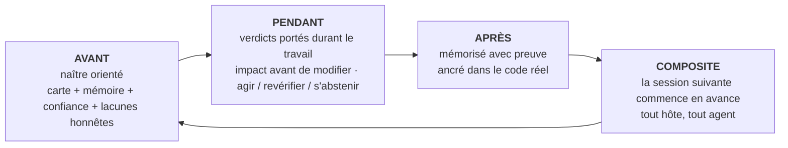

```markdown
<p align="center">
  
</p>

**m1nd** donne à votre agent de codage un cerveau par dépôt : un graphe de code local servi par MCP, une mémoire ancrée au code qu'il cite, et un verdict de confiance pour chaque réponse. "Preuve insuffisante" est une réponse valide ici. Tout comme "n'y faites pas encore confiance, voici comment le corriger".

Rien ne quitte votre machine. Un binaire Rust. MIT.

Pensez à cela comme une radiographie de votre dépôt que votre agent peut lire : une structure unique qui combine tout et indique où chaque élément se trouve, à quoi ce programme sert, sur quoi on travaille, ce qui est fini et ce qui reste à faire. Ce panorama est quelque chose qu'aucun autre outil ne fournit à votre agent.

<p align="center">
  <a href="https://www.npmjs.com/package/@maxkle1nz/m1nd"></a>
  <a href="https://crates.io/crates/m1nd-mcp"></a>
  <a href="https://github.com/maxkle1nz/m1nd/actions"></a>
  <a href="LICENSE"></a>
  <a href="https://registry.modelcontextprotocol.io/?search=io.github.maxkle1nz/m1nd"></a>
</p>

<p align="center">Quatre commandes pour installer : <a href="#sixty-seconds">Soixante secondes</a>. Raisons de fermer cet onglet d'abord : <a href="#when-not-to-use-m1nd">Quand ne pas utiliser m1nd</a>.</p>

<p align="center">
  
</p>

<p align="center"><em>Une session réelle sur le graphe de 6 453 nœuds de ce dépôt (m1nd-mcp 1.4.0) : <code>north</code> oriente, <code>seek</code> répond avec un verdict <code>reverify</code>, <code>memorize</code> ancre la découverte au code.</em></p>

## L'audit que votre agent ne paie plus

Vous connaissez le rituel. L'agent ouvre un fichier, recherche, ouvre un autre fichier, recherche encore, brûle la plupart de son contexte en reconstruisant ce qu'est le dépôt, et commence ensuite la tâche réelle. Avec m1nd, cette exploration devient une seule question. En moins d'une seconde, l'agent a la carte : ce qui appelle quoi, ce qui casse quoi, où tout se trouve. Pas un tas de correspondances à interpréter. La structure connectée, déjà assemblée.

Et il se souvient. Entre les sessions et entre les agents. Ce qu'un agent apprend aujourd'hui, un autre l'hérite demain, avec les preuves attachées et un drapeau si le code a évolué depuis. Chaque conclusion laisse une trace, pour que vous, ou tout agent venant après, puissiez toujours voir ce qu'il est advenu de ce code et pourquoi.

Ensuite l1ght va plus loin : les documents, articles, RFCs, brouillons et notes se connectent aux parties de votre code qu'ils expliquent, dans la même structure. L'agent obtient le bon contexte au lieu de celui qui semble juste le plus proche, et l'invention de code inexistant cesse d'être le chemin de moindre résistance : la structure dit ce qui existe, et le verdict évalue même cela.

Avant m1nd, une fonction n'était qu'une fonction, perdue dans un manuel. Maintenant, elle vit dans l'intelligence de l'agent, combinée avec le code, son histoire, ses documents et ses risques. Je n'ai rien trouvé de tel ailleurs.

## grep répond à de bonnes questions. m1nd répond aux plus profondes.

Des questions que votre agent peut maintenant poser et obtenir une réponse structurelle :

- Qu'est-ce qui casse si je modifie cette fonction ?
- Où se fait réellement le rafraîchissement des jetons dans ce dépôt ?
- Pourquoi ces deux fichiers sont-ils connectés, et ce chemin est-il solide ou juste une supposition ?
- Qu'a appris la dernière session sur ce code, et est-ce encore vrai ?
- Qu'est-ce qui change toujours ensemble ici, même sans import entre eux ?
- Est-ce que cette modification traverse une frontière d'architecture que je ne devrais pas franchir ?
- Quelle revendication dans ce document cette fonction met-elle en œuvre ?
- Le bug que je viens de corriger est-il caché ailleurs, sous une autre forme ?
- Qu'est-ce qui manque ici que ce modèle a habituellement ?
- Suis-je même dans le bon dépôt ?
- Dois-je agir sur cette réponse ou la vérifier d'abord ?

Chacune est un verbe sur la surface MCP (`impact`, `seek`, `why`, `north`, `ghost_edges`, `xray_gate`, `antibody_scan`, `missing`, `trust_selftest`, `predict`), pas un bricolage de prompt.

## Et ce n'est pas juste montrer une structure

Anticorps : un bug corrigé devient un modèle structurel nommé, et toute session ultérieure recherche cette forme dans tout le dépôt. Corrigez-le une fois, chassez-le à jamais.

Liens fantômes : des fichiers qui changent toujours ensemble sans import entre eux, extraits de votre historique git. Le couplage invisible qui ruine les refactorisations.

Trous structurels : `missing` recherche le code absent. Le garde, la reprise, le délai que ce modèle doit normalement inclure mais qui manque ici.

Hypothèses contre le graphe : énoncez une revendication en langage clair ("les paramètres peuvent atteindre le démarrage sans validation") et testez-la contre la structure vivante.

Tremblement : les fichiers dont la vitesse de modification accélère sont signalés avant qu'un rapport de bug ne soit déposé.

Un graphe chaud : les résultats confirmés renforcent leurs liens, à la manière de Hebb, donc les chemins qui se sont montrés utiles sont prioritaires pour le prochain agent.

Chacun de ces signaux suggère quelque chose. Votre compilateur et vos tests font encore preuve suffisamment probante.

## m1nd ne fait pas que chercher. Il écrit.

Voici la partie que les gens mettent un moment à croire. Le graphe qui lit votre dépôt peut également agir dessus. Votre agent nomme un symbole et une destination, environ 48 tokens, et `transplant` calcule tout le déplacement à partir du graphe : la région élargie (les commentaires de documentation et attributs sont pris en compte), les dépendances classifiées par leurs liens d'appel (les privées voyagent, les partagées restent et gagnent un import rétroactif), et chaque référent est requalifié dans chaque fichier qui le nomme. Ensuite, il écrit de manière atomique, ré-ingère et remet un reçu honnête : ce qui a été déplacé, ce qui est resté, ce qu'il n'a pas pu résoudre. `refs_unresolved` n'est jamais silencieusement vide si quelque chose a mal tourné.

Cela se fait en deux phases, `transplant_preview` avant `transplant_commit`, et le commit re-valide le hash de chaque fichier qu'il a prévu de toucher, pour que rien ne se retrouve dans un dépôt qui a changé entre temps. Les zones critiques de votre dépôt (backend, schéma, paiements, CI) sont protégées côté serveur et échouent de manière sécurisée. Un refus ne modifie aucun octet et indique ce qui nécessite un nouvel essai : une collision nomme l'occupant, un chemin de module invalide se désigne lui-même, un mouvement transversal entre crates désigne les deux racines de crate.

Mesuré sur un cas réel : modifier un fichier entier coûte 12 235 tokens de sortie ; la transplantation coûte 48 en entrée et écrit 3 fichiers en 1,3 secondes, avec une compilation réussie derrière. rust-analyzer a ouvert une issue demandant des déplacements entre fichiers en 2019.

Limites de la version 1 énoncées clairement : uniquement Rust, uniquement les `fn` au niveau supérieur, même crate, le fichier de destination doit déjà exister, et les références nées dans les macros lui sont invisibles. Chacune de ces limites est délibérée et consignée dans [docs/TRANSPLANT-PRD.md](docs/TRANSPLANT-PRD.md), aux côtés de 13 fichiers de test qui en assurent la solidité.

## Et quand il s'agit de plusieurs agents, et non pas un seul ?

Exécutez plusieurs agents sur le même dépôt et le graphe devient l'endroit où ils coordonnent leurs actions. Chaque session s'inscrit comme une présence, et lorsque deux d'entre elles s'apprêtent à modifier du travail qui se chevauche, elles sont toutes deux averties dans leur prochain paquet d'orientation, avant qu'aucune ne réalise une modification. Le système prévient ; vous décidez.

Les travaux délimités s'exécutent comme des missions, et les missions doivent se justifier de manière rigoureuse que beaucoup d'équipes humaines négligent : chaque outil de mission rapporte `non_claims`, la liste de ce qui N'A PAS été prouvé. Une revendication ne peut être close sur la seule base de preuves du graphe. Cela demande une lecture de fichier, un test ou une sonde d'exécution, et le test qui impose cela est nommé `graph_only_evidence_is_not_enough`.

Les garde-fous ne donnent pas de fausses alertes. `xray_gate` peut indiquer `blocked` uniquement sur la base d'un manifeste de frontières validé par un humain. Tout le reste arrive sous forme d'avertissement avec une raison, pour que l'agent n'apprenne jamais à ignorer sa propre barrière de sécurité.

Chaque cerveau a également une boîte aux lettres. Un agent qui trouve un réel défaut en dehors de sa propre mission ne le corrige pas sur-le-champ et ne l'omet pas non plus : il dépose une lettre dans la boîte du dépôt, sur le disque, à côté du code. Le prochain agent travaillant sur ce cerveau récupère cette boîte et commence en sachant déjà quels défauts les autres agents ont trouvés, avec le contexte attaché. La connaissance de ce qui est cassé cesse de se perdre dans le fil de discussion. Ce balayage se fait par un geste délibéré (CLI ou REST, jamais dans la boucle de requête), pour que ces lettres informent le travail au lieu de l'interrompre.

## Conçu pour l'agent avant tout

Pas de compte, pas de télémétrie, pas d'API intermédiaire, ce qui explique aussi pourquoi le graphe répond en microsecondes.

Le développement de m1nd n'est pas très conventionnel. Le construire a nécessité l'élaboration d'un flux de travail complet où les agents dirigent, vérifient et prouvent le travail, et la logique du produit est orientée vers la douleur de l'agent, pas vers un tableau de bord humain. Lorsque m1nd se comporte mal sur le terrain, les agents qui l'utilisent déposent le rapport, et un bug confirmé devient un test rouge avant que la correction n'arrive. Très peu de programmes démarrent avec cette philosophie dans leur conception initiale. Ainsi m1nd est né différent : les verbes, les refus et les paquets sont conçus pour le lecteur qui les utilise réellement, et vous n'avez même pas à rappeler au modèle que l'outil existe. `m1nd hosts apply` installe des hooks de session (`SessionStart`, `agentSpawn`, `TaskStart`, par hôte) qui injectent l'orientation dès la création : votre agent, et tout sous-agent qu'il lance, commence le travail orienté avant même que quiconque tape un mot.

Un cerveau par répertoire tient tout cela ensemble : un graphe unique, sa propre mémoire, sa propre persistance, lié à une racine de dépôt. Un propriétaire hébergé gère plusieurs cerveaux et dirige chaque session vers le bon. Une session depuis un dépôt qu'il n'héberge pas reçoit un refus typé à la place de réponses erronées.

## Ce que votre agent obtient

m1nd enveloppe la totalité de la boucle de travail de l'agent autour d’un graphe de votre dépôt qui perdure après la session :


```mermaid
flowchart LR
    B["<b>AVANT</b><br/>naître orienté<br/>carte + mémoire + confiance + lacunes honnêtes"]
    D["<b>PENDANT</b><br/>verdicts portés durant le travail<br/>impact avant de modifier · agir / revérifier / s'abstenir"]
    A["<b>APRÈS</b><br/>mémorisé avec preuve<br/>ancré dans le code réel"]
    C["<b>COMPOSITE</b><br/>la session suivante commence en avance<br/>tout hôte, tout agent"]
    B --> D --> A --> C --> B
```

L'entrée principale est un seul appel. `north(task)` retourne toute l'orientation en un seul paquet, avant toute récupération d'informations :

```jsonc
{"method":"tools/call","params":{"name":"north",
  "arguments":{"agent_id":"dev","task":"renforcer la validation des jetons JWT"}}}
```

```jsonc
{
  "binding": { "trust_mode": "full_trust", "ok": true },      // verdict avant la récupération
  "memory": [                                                 // rappelé d'une SESSION PRÉCÉDENTE
    { "claim": "AuthTokenFlow", "source_agent": "authbot", "age_ms": 221, "stale": false }
  ],
  "sufficiency": { "state": "gathering", "top_score": 0.64 },
  "next_move": "Appeler `surgical_context` sur le nœud de focus principal avant modification.",
  "honest_gaps": []                                           // rien de retenu sur ce graphe
}
```

Pendant que l'agent travaille, `impact` montre l'impact de l'édition avant sa validation, `why` explique une connexion et admet quand le chemin repose sur une supposition, et `xray_gate` avertit avant une modification traversant une limite architecturale. Une fois le travail terminé, `memorize` consigne la conclusion avec les preuves la soutenant. La session suivante commence avec les conclusions de la session précédente déjà en main, sur n'importe quel hôte MCP : Claude Code, Codex, Cursor, Gemini, Zed, 22 hôtes au total.

Vous ne faites jamais fonctionner ces verbes vous-même. L'agent s'en charge. Votre interface est un petit CLI de configuration, et ensuite, vous continuez à interagir avec votre agent comme d'habitude.

## Soixante secondes

Le package npm est l'installateur. Le runtime natif est un binaire Rust séparé que l'étape 1 récupère comme une version signée.

```bash
# 1 · installer le runtime natif (signé, vérifié, avec possibilité de retour en arrière)
npx -y @maxkle1nz/m1nd update apply --yes

# 2 · confirmer qu'il est visible (affiche un verdict JSON ; bon signifie "status": "ok")
npx -y @maxkle1nz/m1nd doctor

# 3 · connecter votre hôte : config MCP + les hooks de session qui rendent m1nd ambiant
npx -y @maxkle1nz/m1nd hosts apply --host claude --project . --yes

# 4 · première valeur : le paquet orientation pour VOTRE dépôt, en lecture seule, aucune config d'hôte modifiée
npx -y @maxkle1nz/m1nd agent first-minute --repo . --query "analyser ce dépôt" --json
```

L'étape 1 vérifie la signature avec [`cosign`](https://docs.sigstore.dev/cosign/system_config/installation/), donc installez-le d'abord si ce n'est pas déjà sur votre PATH. Si vous préférez utiliser le registre source et acceptez de ne pas vérifier, `cargo install m1nd-mcp` fonctionne aussi. Vous préférez voir avant d'écrire : `hosts plan` affiche tout ce que `hosts apply` toucherait, sans rien écrire. Il n’existe pas encore de commande de désinstallation ; `hosts plan` sert également de liste de ce qu'il faut supprimer manuellement.

Les hooks de l'étape 3 rendent m1nd ambiant : le paquet orientation est injecté à chaque session et chaque spawn de sous-agent, et l'agent se dirige de là. Installation depuis un agent au lieu d'un terminal ? Une version lisible par machine de cette section se trouve dans [`llms-install.md`](llms-install.md).

Une version altérée ou tronquée ne peut pas s'installer sur votre machine, et une mise à jour défectueuse ne tient qu'à un retour en arrière : le système vérifie la signature avec l'identité de build exacte, puis le SHA-256 et la taille, avant de toucher quoi que ce soit. Si la vérification échoue, il refuse plutôt que de passer par un chemin non vérifié. Détails dans [docs/AGENT-PACKS.md](docs/AGENT-PACKS.md).

## Si je disparais

m1nd est sous licence MIT et il n'y a aucun serveur à perdre. Le runtime est un binaire Rust déjà sur votre disque. La mémoire qu'il écrit est du markdown simple sous `agent-memory/`, lisible et recherchable même sans m1nd installé. Le graphe est dérivé de votre code et peut être reconstruit à partir de zéro sur n'importe quelle machine. Si ce projet s'arrête demain, vous gardez les fichiers et perdez un outil. C'est volontaire. C'est pour cela que la mémoire est en markdown et qu'il n'y a pas de cloud entre votre agent et ses connaissances.

## Pourquoi faire confiance aux réponses

C'est la raison pour laquelle j'ai créé m1nd. Les couches de récupération sont bonnes pour répondre. Presque aucune d'entre elles n'est bonne pour refuser. m1nd traite le refus comme un résultat à part entière :

```jsonc
// trust_selftest sur un runtime non configuré. Le verdict EST la consigne de réparation :
{
  "ok": false,
  "verdict": "needs_ingest",          // jamais un simple "pas de résultats"
  "next_action": "call_ingest",
  "recovery_playbook": {
    "steps": [ { "action": "Appelez ingest pour le dépôt envisagé sur cette même instance." } ]
  }
}
```

Un résultat `seek` inclut un relevé de suffisance et une enveloppe de confiance. Lorsqu'aucune calibration n'a été mesurée, l'enveloppe limite elle-même son verdict à `reverify` au lieu de surévaluer. La limite de `predict` est ajustée pour la couverture (α=0.10) ; sur l'historique de ce dépôt, elle atteint environ un tiers de précision pour les réponses `act`, et la plupart du temps, elle s'abstient, ce qui est le résultat honnête d'un signal faible. `abstain` indique à l'agent d'arrêter. `insufficient_evidence` signifie aucune preuve du tout, ce qui est bien distinct d'un risque moyen, et l'API différencie les deux.

Deux outils, `savings` et `resonate`, ont été supprimés en version bêta (gestionnaires, types et fichiers d'état, tout effacé) parce qu'ils renvoyaient un gain chaque fois, et un outil qui ne perd jamais a cessé de mesurer. C'est le niveau d'exigence auquel chaque revendication de ce fichier est soumise.

Le voisin le plus proche que je connais est GitHub Copilot Memory (aperçu public, 2026) : il stocke des faits avec des citations de code et les revérifie par rapport à la branche actuelle avant utilisation. C’est une véritable détection de désuétude et il mérite d'être salué. Cependant, il est également dans le cloud, binaire, et vit à l'intérieur de Copilot. Ce que je n'ai trouvé nulle part ailleurs, c'est le reste du verdict : `act` / `reverify` / `abstain` gradé avec calibration par dépôt, refus typés avec plan de réparation, sur un graphe local que tout agent MCP peut partager. J'ai vérifié la documentation publique de Mem0, Zep, Letta, Cognee, Supermemory et Copilot Memory, en juillet 2026. Vous connaissez un outil plus proche ? Ouvrez une issue et je le listerai ici.

## Une mémoire qui sait quand elle est obsolète

La plupart des couches de mémoire enregistrent du texte et espèrent le meilleur. m1nd ancre la mémoire au graphe. Lorsqu'un agent appelle `memorize`, chaque chemin d'`evidence` de revendication est résolu au nœud de code réel, de sorte que la note apparaît chaque fois que l'agent touche à ce code, sans que personne n'ait besoin de s'en souvenir :

```jsonc
memorize({
  "agent_id": "authbot",
  "node_label": "AuthTokenFlow",
  "claims": [{
    "label": "TokenValidator",
    "text": "TokenValidator valide les JWT via HMAC. Réorientez les clés uniquement via KMS.",
    "confidence": "high", "evidence": ["src/auth/token.rs"]
  }]
})
```

Étant donné que la mémoire est ancrée, elle peut être auditée par rapport à la réalité. `cross_verify` recalcule le hachage de chaque fichier cité et identifie les revendications devenues obsolètes parce que leur code a changé. Les revendications incluent l'âge et l'auteur, supplantent les revendications plus anciennes et vieillissent. Ce cycle est prouvé en direct de bout en bout sur ce dépôt : mémoriser, ancrer, modifier le fichier cité, voir la revendication se signaler, survivre à une ré-ingestion complète, réapparaître automatiquement au prochain démarrage. Tuez le processus, démarrez-en un nouveau, et le premier `north` porte déjà les revendications de la session précédente avec la provenance attachée.

## Un seul graphe pour le code et les connaissances (l1ght)

l1ght est la seconde voie du même moteur : les documents deviennent des nœuds de graphe dans le même espace que le code, donc une seule interrogation traverse les deux. Ce n'est pas un dossier de RAG ajouté comme un greffon. Il y a 7 400 lignes d'adaptateurs dédiés dans cet arbre : Markdown, HTML, PDF, texte brut, RST et JSON, plus des routes académiques pour BibTeX, DOI/Crossref, JATS, RFCs et brevets.

Différentes personnes obtiennent différents produits de la même voie :

- Un chercheur dépose un dossier de PDF et DOIs à côté du code d'analyse et demande quel article contredit la revendication que cette fonction met en œuvre.
- Un étudiant associe un chapitre de manuel et le code d'exercice comme un seul graphe, et l'agent explique chaque élément en termes de l'autre.
- Un enseignant ingère les notes du cours une fois ; l'agent de chaque étudiant répond à partir du même corpus fondé au lieu d'improviser.
- Un ingénieur lie des RFCs et documents de conception aux fonctions qui les mettent en œuvre ; la section de spécification se trouve à une étape du code.
- Une personne ayant un flux créatif transforme une pile de discussions exportées et de notes éparses en mémoire que l'agent consulte réellement pendant l'édition.

Même binaire, mêmes verbes MCP, même couche de confiance. `seek` sur un graphe mixte retourne code et documents dans une seule réponse hiérarchisée.

## Quand ne pas utiliser m1nd

Quelques raisons de fermer honnêtement cet onglet :

- Petits dépôts. Avec quelques centaines de fichiers, grep est déjà peu coûteux et l'avantage du graphe s'amenuise. Une mesure indépendante d'outils similaires sur un dépôt d'environ 110 fichiers a montré un avantage d'environ 20 %. Réel, mais pas suffisant pour justifier un runtime.
- Questions floues. Un graphe symbolique répond "qu'est-ce qui est connecté à quoi". Il ne répond pas à "pourquoi ceci semble-t-il lent". La recherche agentique est meilleure pour les questions ouvertes.
- Vérité du compilateur et du runtime. Votre LSP, vos tests et votre profileur ont raison, et m1nd émet seulement des hypothèses. m1nd pointe ; les autres prouvent.
- Tâches limitées. Un fichier de vingt lignes n'a pas besoin d'un processus d'ingestion. Évitez ça.
- `predict` s'abstient largement aujourd'hui. Calibré sur l'historique de ce dépôt, il atteint environ un tiers de précision dans la bande `act` avec une couverture faible. L'abstention est la réponse honnête d'un signal faible, et pour l'instant, elle constitue également l'essentiel des résultats.

m1nd complète le compilateur, les tests et vos outils de sécurité. Il ne les remplace pas.

## Preuves

Tout ce qui précède est inclus dans la release actuelle ; les documents sous `docs/` marqués PRD sont des intentions de conception, conservées avec leur étiquette. Chaque ligne est strictement mesurée. m1nd ne met pas en avant de prétendus gains de tokens ou ROI, et c'est intentionnel : ce sont les chiffres les moins vérifiables de cette catégorie.

| Revendication | Résultat | Reproduction / limitation |
|---|---|---|
| Latence du graphe | ~1.4µs `activate`, ~0.5µs `impact` sur un graphe synthétique de 1K nœuds | `cargo bench -p m1nd-core` sur Apple silicon. Ordre de grandeur seulement, dépendant du matériel. |
| Batterie de capacité vs grep | 37/37 passent ; tête-à-tête 16 victoires, 12 égalités, 0 victoires grep | `python3 scratchpad/m1nd_battery.py ./target/release/m1nd-mcp . --suite m1nd`. Un dépôt (celui-ci), cas auto-rédigés. |
| Calibrage de `predict` | environ un tiers de précision dans la bande `act` avec faible couverture (α=0.10) | Mesuré sur l'historique git de ce dépôt, n≈9.2k prédictions en aveugle. La barrière s'abstient principalement, par conception. |
| Auto-vérification mémoire | Boucle de 6 étapes prouvée en direct | mémoriser → ancrer → signaler la fraîcheur sur un fichier édité → survit au remplacement → auto-charge au démarrage. |
| Persistance au-delà des démarrages et des crashs | le système dirige le binaire réel via stdio sur quatre redémarrages purs, et à travers un kill -9 | `m1nd-mcp/tests/persist_runtime_root.rs`. Rétablir une modification du fichier de démarrage le rend rouge avec un message nominant la régression. |

## Un graphe, plusieurs agents

Pour un seul agent, le serveur stdio de [Soixante secondes](#sixty-seconds) suffit, et l'agent peut appeler directement `ingest` sur un graphe vierge. Pour un vrai travail, exécutez un propriétaire servi tenant le graphe en direct, et attachez chaque agent à celui-ci comme pont fin :

```bash
m1nd-mcp --serve --no-gui --port 1337 --runtime-dir /votre/projet/.m1nd
m1nd-mcp --attach auto --stdio     # chaque agent : pas de chargement du graphe, pas de location, mémoire partagée
```

Ce qu'un agent mémorise, un autre le rappelle immédiatement, et les présences et avertissements de collision décrits ci-dessus fonctionnent via ce même propriétaire. Il héberge également des cerveaux par dépôt et rend l'interface web. Les requêtes restent en localhost ; chaque liaison non-loopback est refusée tant qu’un transport authentifié n'existe pas. `auto` trouve d'abord le propriétaire de votre runtime actuel, et sinon n'importe quel propriétaire vivant ayant déjà ingéré le dépôt où vous êtes – y compris depuis un worktree git – donc un propriétaire central est trouvé à partir de ses propres projets au lieu que chaque dépôt démarre un cerveau vide.

Un détail à noter : un propriétaire servi refuse un `ingest` générique pour des dépôts qu'il n'héberge pas déjà. Créer un nouveau cerveau sur un propriétaire servi est une action rationnée, et échoue de manière sécurisée par conception. Pour une première session sur un nouveau dépôt, utilisez le chemin stdio ou `m1nd agent first-minute`. Attachez-vous au propriétaire une fois qu'il héberge votre dépôt. Guide complet de déploiement : [docs/deployment.md](docs/deployment.md).

## Couverture linguistique

Des extracteurs dédiés couvrent plus de vingt langues, donc un dépôt polyglotte ne revient pas à moitié cartographié : Python et TypeScript en passant par Elixir, Haskell et Zig, triés par extension de fichier dans `m1nd-ingest`. Le tableau ci-dessous montre la revendication stricte, prouvée de bout en bout dans une seule ingestion polyglotte : bords du graphe d’appel plus résolution des imports inter-fichiers.

| Langue | `calls` | imports inter-fichiers |
|---|:---:|:---:|
| Rust | ✅ | ✅ |
| Python | ✅ | ✅ |
| JavaScript / TypeScript | ✅ | ✅ |
| Go | ✅ | ✅ |
| Java | ✅ | ✅ |
| C / C++ | ✅ | ✅ |
| Kotlin | ✅ | ✅ |
| PHP | ✅ | ✅ |
| Scala | ✅ | ✅ |
| Ruby | ⏳ | ✅ |
| C# | ✅ | espaces de noms non mappés à 1:1 avec les fichiers |
| Swift | ✅ | pas encore |

Les imports non résolvables (packages externes, stdlib, en-têtes système) restent non résolus au lieu d'être devinés. Tout le reste revient à un extracteur générique doté seulement de liens `contains`.

## L'humain est le deuxième lecteur

La plupart des outils pour développeurs sont conçus pour une personne et évoluent ensuite vers une API. m1nd fait l'inverse : l’utilisateur est l’agent, et ses verbes sont ses verbes.

Ce choix façonne la conception de manière vérifiable. Les refus sont typés et incluent un plan de récupération, car le lecteur qui agit dessus est une machine. Un message d'erreur nécessitant une interprétation humaine serait ici un échec de conception. Le même paquet d'orientation que l'agent lit comme `north` est rendu pour vous sous forme de carte courte dans la conversation et comme l'Arbre Vivant dans l'interface utilisateur web servie (votre dépôt dessiné comme un arbre navigable, notes de mémoire épinglées dessus) : calculé une fois, projeté par lecteur, afin que la vision humaine ne dérive jamais vers une seconde vérité.

Les humains sont bienvenus. Vous êtes simplement le deuxième lecteur, et le système est plus honnête avec les deux lecteurs grâce à cela.

## Comment ce dépôt est construit

Lisez le journal des commits en restant sceptique, puis lisez ceci. Je suis Max. Je construis m1nd en dirigeant un système d'agents de codage, sous des règles plus strictes que la plupart des équipes humaines avec lesquelles j'ai pu travailler :

- Tout changement substantiel commence par une spécification confrontée à un modèle oracle indépendant avant que le code ne soit rédigé. Les objections sont enregistrées dans les fichiers de spécifications.
- Chaque correction est livrée avec un test démontré comme échouant d'abord. Un test qui n'a jamais été rouge ne prouve rien.
- Le réviseur n'est jamais l'auteur. Chaque main d'agent travaille dans un worktree isolé.
- Une porte verte est une candidate. Le geste de livraison est le mien et j'en réponds pour chaque ligne.
- Les lois sont les noms des tests : `letter_cannot_color_the_store`, `gate_zero_cannot_land`, `graph_only_evidence_is_not_enough`.
- L'arbre contient 2 462 fonctions de test, et la validation complète est verte sous Linux, macOS et Windows.

La question du sceptique ("aucun humain n'écrit autant aussi vite") est correcte. Aucun humain ne le fait. Un humain dirigeant un système de preuve assuré par des agents, oui. Cet arbre est le résultat. La couche de confiance intégrée à m1nd est née de cette pratique quotidienne : j'avais besoin que mes propres agents cessent de faire confiance aux réponses obsolètes avant de pouvoir expédier quoi que ce soit à ce rythme.

## Architecture en un coup d'œil

Trois crates Rust principales plus des auxiliaires : `m1nd-mcp` (le serveur MCP et l’interface runtime), `m1nd-core` (le moteur de graphe : activation diffuse, plasticité de type Hebb, CSR adjacency, ghost edges dérivés de git), `m1nd-ingest` (extracteurs et adaptateurs pour le code, les documents et la mémoire). Votre agent voit 48 outils par défaut au lieu de 130+, donc il choisit le bon plus souvent et paye pour une liste plus courte sur chaque requête ; la surface complète est accessible par une variable d’environnement (`M1ND_TOOL_TIER=full`), et le classement ne fait qu'optimiser le menu affiché, jamais la disponibilité.

<p align="center">
  
</p>

Les détails sont dans le [wiki](https://m1nd.world/wiki/), [docs/AGENT-PACKS.md](docs/AGENT-PACKS.md), [EXAMPLES.md](EXAMPLES.md) et [CHANGELOG.md](CHANGELOG.md).

## Traductions

🇧🇷 [Português](i18n/README.pt-BR.md) · 🇪🇸 [Español](i18n/README.es.md) · 🇮🇹 [Italiano](i18n/README.it.md) · 🇫🇷 [Français](i18n/README.fr.md) · 🇩🇪 [Deutsch](i18n/README.de.md) · 🇨🇳 [中文](i18n/README.zh.md) · 🇯🇵 [日本語](i18n/README.ja.md)

Les traductions suivent le texte anglais avec un certain décalage. En cas de divergence, l’anglais fait foi.

## Contribuer

Les contributions sont les bienvenues dans les extracteurs, les adaptateurs, les outils MCP, les benchmarks, la documentation et les algorithmes graphiques. Voir [CONTRIBUTING.md](CONTRIBUTING.md). Il y a un espace en direct sur [CodeRooms](https://coderooms.com/github/maxkle1nz/m1nd) si vous voulez parler d'abord. Et si vous avez lu jusqu'ici et voulez essayer : [quatre commandes](#sixty-seconds).

## Licence

MIT. Voir [LICENSE](LICENSE).
```
