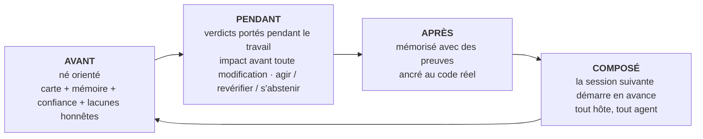

```markdown
<p align="center">
  
</p>

**m1nd** donne à votre agent de codage un cerveau par dépôt : un graphe de code local accessible via MCP, une mémoire ancrée au code qu'elle cite, et un verdict de confiance pour chaque réponse. "Preuves insuffisantes" est une réponse valide ici. Tout comme "ne faites pas encore confiance à cela, et voici comment le corriger".

Rien ne quitte votre machine. Un binaire Rust. Licencié sous MIT.

Pensez-y comme une radiographie de votre dépôt que votre agent peut lire : une structure unique qui combine tout et indique où chaque élément réside, à quoi sert ce programme, ce qui est en cours, ce qui est terminé et ce qui reste à faire. Ce panorama est ce qu'aucun autre outil ne fournit à votre agent.

<p align="center">
  <a href="https://www.npmjs.com/package/@maxkle1nz/m1nd"></a>
  <a href="https://crates.io/crates/m1nd-mcp"></a>
  <a href="https://github.com/maxkle1nz/m1nd/actions"></a>
  <a href="LICENSE"></a>
  <a href="https://registry.modelcontextprotocol.io/?search=io.github.maxkle1nz/m1nd"></a>
</p>

<p align="center">Quatre commandes pour installer : <a href="#sixty-seconds">Soixante secondes</a>. Raisons de fermer cet onglet d'abord : <a href="#when-not-to-use-m1nd">Quand ne pas utiliser m1nd</a>.</p>

<p align="center">
  
</p>

<p align="center"><em>Une vraie session sur le graphe de 6 453 nœuds de ce dépôt (m1nd-mcp 1.4.0) : <code>north</code> oriente, <code>seek</code> répond avec un verdict <code>reverify</code>, <code>memorize</code> ancre la découverte au code.</em></p>

## L'audit que votre agent cesse de payer

Vous connaissez le rituel. L'agent ouvre un fichier, effectue une recherche avec grep, ouvre un autre fichier, recherche à nouveau, gaspille la majorité de son contexte à reconstruire ce que le dépôt contient, et seulement ensuite commence la tâche réelle. Avec m1nd, cette recherche devient une seule question. En moins d'une seconde, l'agent dispose de la carte : ce qui appelle quoi, ce qui casse quoi, où tout se trouve. Pas une pile d'occurrences à interpréter. Une structure connectée, déjà assemblée.

Et ça se souvient. Entre les sessions, et entre les agents. Ce qu'un agent apprend aujourd'hui, un autre agent l'hérite demain, avec les preuves attachées et un drapeau si le code a évolué depuis. Chaque conclusion laisse une trace, de sorte que vous, ou tout agent suivant, puissiez toujours voir ce qui a été modifié dans ce code et pourquoi.

Ensuite, l1ght va plus loin : articles, RFCs, brouillons et notes se connectent aux parties de votre code qu'ils expliquent, dans la même structure. L'agent obtient le contexte APPROPRIÉ au lieu de celui qui semble le plus proche, et inventer du code inexistant cesse d'être la voie la plus facile : la structure indique ce qui existe et le verdict dit dans quelle mesure on peut même se fier à cela.

Avant m1nd, une fonction n'était qu'une fonction, perdue dans un manuel. Maintenant, elle vit au sein de l'intelligence de l'agent, combinée avec le code, son histoire, ses documents et ses risques. Je n'ai trouvé rien d'équivalent ailleurs.

## grep répond à de bonnes questions. m1nd répond aux plus profondes.

Des questions que votre agent peut désormais poser et obtenir une réponse structurelle :

- Qu'est-ce qui casse si je modifie cette fonction ?
- Où se fait réellement le rafraîchissement des tokens dans ce dépôt ?
- Pourquoi ces deux fichiers sont-ils connectés, et ce chemin est-il solide ou hypothétique ?
- Qu'a appris la dernière session sur ce code, et est-ce encore vrai ?
- Qu'est-ce qui change toujours ensemble ici, même sans import entre eux ?
- Cette modification franchit-elle une limite architecturale que je ne devrais pas franchir ?
- Quelle affirmation dans cet article cette fonction implémente-t-elle ?
- Le bug que je viens de corriger se cache-t-il ailleurs, sous une autre forme ?
- Que manque-t-il ici que ce modèle porte habituellement ?
- Suis-je même dans le bon dépôt ?
- Dois-je agir sur cette réponse ou la vérifier d'abord ?

Chacune correspond à un verbe sur la surface MCP (`impact`, `seek`, `why`, `north`, `ghost_edges`, `xray_gate`, `antibody_scan`, `missing`, `trust_selftest`, `predict`), pas à un simple prompt.

## Et cela ne s'arrête pas à l'affichage de la structure

Anticorps : un bug corrigé devient un modèle structural nommé, et chaque session ultérieure recherche cette forme dans le dépôt. Réparez-le une fois, chassez-le pour toujours.

Liens fantômes : des fichiers qui changent toujours ensemble sans lien d'importation entre eux, extraits de votre historique Git. Le couplage invisible qui brise les refactorisations.

Trous structurels : `missing` recherche le code absent, comme les gardiens, re-tentatives ou délais d'attente que ce modèle devrait comporter mais qui manquent.

Hypothèses contre le graphe : formulez une affirmation en langage simple ("les paramètres peuvent atteindre boot sans validation") et testez-la contre la structure active.

Tremblement : les fichiers dont la vitesse de modification augmente sont signalés avant même qu'un rapport de bug soit déposé.

Un graphe chauffé : les résultats confirmés renforcent leurs liens, à la manière d'Hebb, de sorte que les chemins jugés utiles soient prioritaires pour l'agent suivant.

Chacun de ces indicateurs suggère des actions ; votre compilateur et vos tests restent les preuves.

## m1nd ne fait pas que chercher. Il écrit.

Voici la partie que les gens mettent une seconde à croire. Le graphe qui lit votre dépôt peut également opérer dessus. Votre agent nomme un symbole et une destination, environ 48 tokens, et `transplant` calcule l'ensemble du déplacement à partir du graphe : la région élargie (les commentaires et attributs associés voyagent avec), les dépendances classées selon leurs liens d'appel (les dépendances privées voyagent, les partagées restent et gagnent un import en retour), chaque référence est réajustée pour tous les fichiers qui la mentionnent. Ensuite, il écrit de manière atomique, ré-ingère et renvoie un reçu honnête : ce qui a été déplacé, ce qui est resté, ce qu'il n'a pas pu résoudre. `refs_unresolved` ne reste jamais silencieusement vide si quelque chose s'est mal passé.

C'est un processus en deux phases, `transplant_preview` avant `transplant_commit`. L'engagement revalide le hachage de chaque fichier prévu pour modification, de sorte que rien ne soit ajouté à un dépôt qui a changé entre-temps. La zone sensible de votre dépôt (backend, schéma, paiements, CI) est protégée côté serveur et échoue en cas de problème. Un refus ne touche aucun octet et enseigne la reprise : une collision nomme l'élément occupant, un chemin de module invalide se nomme, et un déplacement transversal indique les deux racines des crates.

Mesuré sur le cas réel : l'édition complète de fichier a coûté 12 235 tokens de sortie ; le déplacement en a coûté 48 et a écrit 3 fichiers en 1,3 secondes, avec la compilation de la crate réussie par la suite. Depuis 2019, rust-analyzer rencontre des contraintes pour implémenter des déplacements multi-fichiers.

Limites de la v1, clairement énoncées : uniquement Rust, seulement pour les `fn` au niveau supérieur, même crate, le fichier de destination doit déjà exister, et les références nées dans des macros sont invisibles. Chaque limite est délibérée et documentée dans [docs/TRANSPLANT-PRD.md](docs/TRANSPLANT-PRD.md), accompagnée de 13 fichiers de test assurant le respect de cette action.

## Et lorsqu'il ne s'agit pas d'un agent, mais de cinq ?

Exécutez plusieurs agents sur le même dépôt et le graphe devient leur lieu de coordination. Chaque session s'enregistre comme une présence, et lorsque deux d'entre elles sont sur le point de toucher des travaux qui se chevauchent, les deux reçoivent un avertissement dans leur prochain paquet d'orientation, avant que l'une d'elles n'effectue un changement. Le système alerte, vous décidez.

Les travaux limités fonctionnent comme des missions, et ces missions se justifient d'une manière que la plupart des équipes humaines négligent : chaque outil de mission rapporte les `non_claims`, la liste de ce qui n'a PAS été prouvé. Une affirmation ne peut être validée sur la seule base des preuves du graphe. Cela nécessite une lecture de fichier, un test ou une sonde à l'exécution, et ce test s'appelle `graph_only_evidence_is_not_enough`.

Et les garde-fous ne sonnent pas de fausses alertes. `xray_gate` ne peut dire `blocked` que sur la base d'un manifeste de frontière ratifié par un humain. Tout le reste arrive sous forme d'avertissement avec une raison, de manière à ce que l'agent n'apprenne jamais à ignorer la sécurité de son propre rail.

Chaque cerveau a également une boîte aux lettres. Un agent qui trouve un vrai défaut, mais qui est hors de sa mission, ne le corrige pas immédiatement ni ne l'ignore : il dépose une lettre dans la boîte aux lettres de ce dépôt, sur le disque, à côté du code. Le prochain agent travaillant sur ce cerveau balaie la boîte et commence déjà avec la connaissance des défauts trouvés par d'autres agents, avec le contexte attaché. La connaissance de ce qui ne fonctionne pas cesse de se perdre dans le fil de discussion. Le balayage est un geste délibéré (CLI ou REST, jamais intégré dans la boucle de requête), de sorte que les lettres informent le travail au lieu de l'interrompre.

## Né pour les agents

Pas de compte, pas de télémétrie et aucune API intrusive, ce qui permet également au graphe de répondre en microsecondes.

Le développement de m1nd n'est pas très conventionnel non plus. Le construire a nécessité de concevoir un flux de travail complet où les agents dirigent, vérifient et prouvent le travail, et la logique du produit cible la douleur de l'agent, non le tableau de bord de l'humain. Lorsque m1nd se comporte mal sur le terrain, les agents qui l'utilisent déposent un rapport, et un bug confirmé devient un test rouge avant que la correction soit publiée. Peu de programmes partent sur ces bases dès leur conception initiale. m1nd est donc né différent : les verbes, les refus et les paquets sont conçus pour le lecteur qui les utilise réellement, et vous n'avez même pas à rappeler au modèle que l'outil existe. `m1nd hosts apply` installe des hooks de session (`SessionStart`, `agentSpawn`, `TaskStart`, par hôte) qui injectent l'orientation dès son lancement : votre agent, et tous les agents qu'il lance à son tour, s'orientent avant même que quiconque saisisse un mot.

Un cerveau par dépôt permet de tout regrouper : un graphe, sa propre mémoire, sa propre persistance, lié à une seule racine de dépôt. Un hôte serveur peut héberger plusieurs cerveaux et aiguiller chaque session vers le bon ; une session provenant d'un dépôt qu'il n'héberge pas reçoit un refus typé au lieu de réponses erronées.

## Ce que votre agent obtient

m1nd enrobe toute la boucle de l'agent autour d'un graphe de votre dépôt qui survit à la session :


```mermaid
flowchart LR
    B["<b>AVANT</b><br/>né orienté<br/>carte + mémoire + confiance + lacunes honnêtes"]
    D["<b>PENDANT</b><br/>verdicts portés pendant le travail<br/>impact avant toute modification · agir / revérifier / s'abstenir"]
    A["<b>APRÈS</b><br/>mémorisé avec des preuves<br/>ancré au code réel"]
    C["<b>COMPOSÉ</b><br/>la session suivante démarre en avance<br/>tout hôte, tout agent"]
    B --> D --> A --> C --> B
```

La porte d'entrée est un seul appel. `north(task)` retourne l'orientation entière dans un seul paquet avant toute récupération :

```jsonc
{"method":"tools/call","params":{"name":"north",
  "arguments":{"agent_id":"dev","task":"renforcer la validation du flux de token JWT"}}}
```

```jsonc
{
  "binding": { "trust_mode": "full_trust", "ok": true },      // verdict avant récupération
  "memory": [                                                 // rappelé depuis une session antérieure
    { "claim": "AuthTokenFlow", "source_agent": "authbot", "age_ms": 221, "stale": false }
  ],
  "sufficiency": { "state": "gathering", "top_score": 0.64 },
  "next_move": "Call `surgical_context` on the top focus node before editing.",
  "honest_gaps": []                                           // rien de retenu sur ce graphe
}
```

Pendant que l'agent travaille, `impact` montre le rayon d'impact avant qu'une modification atterrisse, `why` explique une connexion et admet quand le chemin repose sur une hypothèse, et `xray_gate` avertit avant qu'une modification ne traverse une limite architecturale. Une fois le travail terminé, `memorize` documente la conclusion avec les preuves qui la soutiennent. La session suivante démarre avec les conclusions de la session précédente déjà en main, sur tout hôte MCP : Claude Code, Codex, Cursor, Gemini, Zed, 22 hôtes au total.

Vous n'exécutez jamais ces verbes vous-même. C'est l'agent qui les exécute. Votre interface est une petite CLI de configuration, après quoi vous continuez à dialoguer avec votre agent comme avant.

## Soixante secondes

Le package npm est l'installeur. Le runtime natif est un binaire Rust distinct que l'étape 1 télécharge en tant que version signée.

```bash
# 1 · installez le runtime natif (signé, vérifié, avec restauration possible)
npx -y @maxkle1nz/m1nd update apply --yes

# 2 · confirmez qu'il est visible (affiche un verdict JSON; une sortie correcte contient "status": "ok")
npx -y @maxkle1nz/m1nd doctor

# 3 · configurez votre hôte : configuration MCP + les hooks de session qui rendent m1nd ambiant
npx -y @maxkle1nz/m1nd hosts apply --host claude --project . --yes

# 4 · première valeur : le paquet d'orientation pour VOTRE dépôt, en lecture seule, sans configuration hôte modifiée
npx -y @maxkle1nz/m1nd agent first-minute --repo . --query "cartographier ce dépôt" --json
```

L'étape 1 vérifie la signature avec [`cosign`](https://docs.sigstore.dev/cosign/system_config/installation/), donc installez-le d'abord si ce n'est pas dans votre PATH. Si vous préférez utiliser le registre source et accepter de passer outre la vérification, `cargo install m1nd-mcp` fonctionne également. Préférez vérifier avant d'écrire : `hosts plan` affiche tout ce que `hosts apply` modifierait, sans rien écrire. Il n'y a pas encore de commande de désinstallation ; `hosts plan` sert aussi de liste des éléments à supprimer manuellement.

Les hooks de l'étape 3 rendent m1nd ambiant : le paquet d'orientation est injecté à chaque session ou lancement d'un sous-agent, et l'agent s'oriente ensuite de lui-même. Installation à partir d'un agent au lieu d'un terminal ? Une version lisible par machine de cette section est disponible dans [`llms-install.md`](llms-install.md).

Une version altérée ou tronquée ne pourra pas être installée sur votre machine, et une mise à jour défectueuse est annulable : l'updater vérifie la signature, l'identité exacte de la build, puis le hash SHA-256 et la taille, avant de toucher quoi que ce soit. En cas d'échec de la vérification, il refuse plutôt que de tomber sur un chemin non vérifié. Détails disponibles dans [docs/AGENT-PACKS.md](docs/AGENT-PACKS.md).

## Si je disparais

m1nd est sous licence MIT et il n'y a pas de serveur à perdre. Le runtime est un binaire Rust qui est déjà sur votre disque. La mémoire qu'il écrit est un markdown simple sous `agent-memory/`, lisible et greppable même si m1nd n'est pas installé. Le graphe est dérivé de votre code et peut être reconstruit à partir de zéro sur n'importe quelle machine. Si ce projet s'arrête demain, vous conservez les fichiers et perdez un outil. C'est délibéré. C'est pourquoi la mémoire est en markdown et pourquoi il n'y a pas de cloud entre votre agent et sa propre connaissance.

## Pourquoi faire confiance aux réponses

C'est pourquoi j'ai créé m1nd. Les systèmes de récupération sont bons pour répondre. Presque aucun n'est bon pour refuser. m1nd traite le refus comme un résultat de premier ordre :

```jsonc
// trust_selftest sur un runtime non configuré. Le verdict EST l'instruction de réparation :
{
  "ok": false,
  "verdict": "needs_ingest",          // jamais un simple "aucun résultat"
  "next_action": "call_ingest",
  "recovery_playbook": {
    "steps": [ { "action": "Call ingest for the intended repository on this same binding." } ]
  }
}
```

Un hit `seek` inclut une analyse de suffisance et une enveloppe de confiance. Lorsque aucune calibration n'a été mesurée, l'enveloppe limite son verdict propre à `reverify` au lieu de surévaluer. La porte de `predict` est ajustée pour la couverture (α=0.10) ; sur l'historique de ce dépôt, cela correspond à environ un tiers de précision dans la bande `act`, et la plupart du temps, elle s'abstient, ce qui est le résultat honnête d'un signal faible. `abstain` indique à l'agent de s'arrêter. `insufficient_evidence` signifie qu'aucune preuve n'est disponible, ce qui est distinct d'un risque moyen, et l'API les maintient séparés.

Deux outils, `savings` et `resonate`, ont été supprimés purement et simplement en phase bêta (gestionnaires, types et fichiers d'état, tout supprimé) car ils renvoyaient un succès sur chaque entrée donnée, et un outil qui ne perd jamais a cessé de mesurer. C'est le niveau d'exigence auquel chaque affirmation dans ce fichier est soumise.

Le voisin le plus proche que je connais est GitHub Copilot Memory (aperçu public, 2026) : il stocke des faits avec des citations de code et les revérifie par rapport à la branche actuelle avant utilisation. C'est une détection réelle de périssabilité qui mérite d'être saluée. Mais c'est aussi basé sur le cloud, binaire et dépendant de Copilot. Ce que je n'ai trouvé nulle part ailleurs, c'est le reste du verdict : un `act` / `reverify` / `abstain` calibré par dépôt avec des refus typés contenant un plan de réparation, sur un graphe local que tout agent MCP peut partager. J'ai consulté la documentation publique de Mem0, Zep, Letta, Cognee, Supermemory et Copilot Memory, en juillet 2026. Vous connaissez une alternative plus proche ? Ouvrez une issue et je la lierai ici.

## Une mémoire qui sait quand elle est périmée

La plupart des couches de mémoire stockent du texte et croisent les doigts. m1nd ancre la mémoire au graphe. Lorsqu'un agent appelle `memorize`, le chemin `evidence` de chaque affirmation est résolu jusqu'au nœud réel dans le code, de sorte que la note soit visible dès que l'agent touche à ce code, sans que personne ne se souvienne qu'elle existe :

```jsonc
memorize({
  "agent_id": "authbot",
  "node_label": "AuthTokenFlow",
  "claims": [{
    "label": "TokenValidator",
    "text": "TokenValidator valide les JWT via HMAC. Effectuer la rotation des clés uniquement via KMS.",
    "confidence": "high", "evidence": ["src/auth/token.rs"]
  }]
})
```

Parce que la mémoire est ancrée, elle peut être auditée face à la réalité. `cross_verify` re-calculera le hachage de chaque fichier cité et identifiera quelles affirmations sont devenues périmées car leur code a changé. Les affirmations ont une durée et un auteur, remplacent les affirmations plus anciennes et finissent par expirer. Cette boucle est prouvée opérationnelle de bout en bout dans ce dépôt : mémoriser, ancrer, éditer le fichier cité, observer l'affirmation se signaler elle-même comme périmée, survivre à une ré-ingestion complète, se charger automatiquement au prochain démarrage. Tuez le processus, démarrez-en un nouveau, et le premier `north` inclut déjà les affirmations de la session précédente avec leur provenance attachée.

## Un graphe pour le code et les connaissances (l1ght)

l1ght est la deuxième voie du même moteur : les documents deviennent des nœuds dans le graphe, aux côtés du code, ce qui permet une requête unique traversant les deux. Ce n'est pas un simple dossier RAG ajouté. Il y a 7 400 lignes d'adaptateurs dédiés dans cet arbre : Markdown, HTML, PDF, texte brut, RST et JSON, ainsi que des routes académiques pour BibTeX, DOI/Crossref, articles JATS, RFC et brevets.

Différentes personnes obtiennent différents bénéfices de cette voie unique :

- Un chercheur dépose un dossier de PDFs et DOI à côté du code d'analyse et demande quel article contredit l'affirmation que cette fonction implémente.
- Un étudiant lie un chapitre de manuel à un graph de code d'exercice unique et demande des explications combinées.
- Un enseignant configure une fois les notes du cours ; chaque agent étudiant répond depuis le même corpus au lieu d'improviser.
- Un ingénieur connecte des RFC aux fonctions principales ; la section explicative du spec est à un clic d'inspection du graphe.
- Des développeurs tournés IA unifient dossiers flottants d'exports de chat.

Même binaire, mêmes verbes MCP, même couche de confiance. Les requêtes `terminal search` du mix content projects retournent les correspondantes code/document d'une seule portée testée.

## Quand ne pas utiliser m1nd

Voici d'honnêtes motifs de quitter cette page :

- Dépôts trop petits. Sous 150 fichiers, Grep reste préféré.
- Agents hybrides supportant architectications multi-back instances demandant spécificités architecturales au CPU directement-->
-->
```
