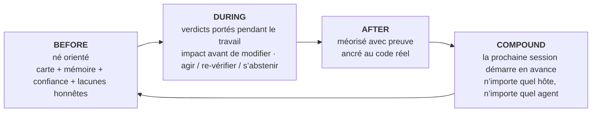

🇬🇧 [English](../README.md) | 🇧🇷 [Português](README.pt-BR.md) | 🇪🇸 [Español](README.es.md) | 🇮🇹 [Italiano](README.it.md) | 🇫🇷 [Français](README.fr.md) | 🇩🇪 [Deutsch](README.de.md) | 🇨🇳 [中文](README.zh.md) | 🇯🇵 [日本語](README.ja.md)

<p align="center">
  
</p>

**m1nd** donne un cerveau à ton coding agent par dépôt : un graphe de code local servi via MCP, une mémoire ancrée au code qu’elle cite et un verdict de confiance sur chaque réponse. "Preuve insuffisante" est une vraie réponse ici. Tout comme "ne fais pas confiance pour le moment, et voici comment le corriger".

Rien ne quitte ta machine. Un seul binaire Rust. Licence MIT.

Pense à cela comme une radiographie de ton dépôt que ton agent peut lire : une structure qui combine tout et indique où se trouve chaque chose, à quoi sert tel programme, ce sur quoi on travaille, ce qui est fini et ce qui est encore en suspens. Ce panorama est quelque chose qu'aucun autre outil n'offre à ton agent.

<p align="center">
  <a href="https://www.npmjs.com/package/@maxkle1nz/m1nd"></a>
  <a href="https://crates.io/crates/m1nd-mcp"></a>
  <a href="https://github.com/maxkle1nz/m1nd/actions"></a>
  <a href="LICENSE"></a>
  <a href="https://registry.modelcontextprotocol.io/?search=io.github.maxkle1nz/m1nd"></a>
</p>

<p align="center">Quatre commandes pour l'installation : <a href="#sixty-seconds">Sixty seconds</a>. Raisons de fermer cette page maintenant : <a href="#when-not-to-use-m1nd">When not to use m1nd</a>.</p>

<p align="center">
  
</p>

<p align="center"><em>Une session réelle sur le graphe de 6 453 nœuds de ce dépôt (m1nd-mcp 1.4.0) : <code>north</code> oriente, <code>seek</code> répond avec un verdict de <code>reverify</code>, <code>memorize</code> ancre les découvertes au code.</em></p>

## L'audit que ton agent a cessé de payer

Tu connais le rituel. L'agent ouvre un fichier, cherche avec grep, ouvre un autre fichier, cherche encore, brûle la majeure partie de son contexte à reconstituer ce qu’est le dépôt, et seulement après commence la tâche réelle. Avec m1nd, ce balayage devient une seule question. En moins d'une seconde, l'agent dispose de la carte : qui appelle quoi, ce qui casse quoi, où tout se trouve. Pas un tas de correspondances à interpréter. La structure connectée, déjà assemblée.

Et il se souvient. Entre sessions et entre agents. Ce qu'un agent apprend ce soir, un autre agent l'hérite demain, avec des preuves attachées et un drapeau si le code a changé depuis. Chaque conclusion laisse une trace, pour que toi, ou n'importe quel agent qui vient après, puisse toujours voir ce qu’il est advenu de ce code et pourquoi.

Puis l1ght va encore plus loin : des articles, des RFCs, des brouillons et des notes se connectent aux parties de ton code qu’ils expliquent, à l'intérieur de la même structure. L'agent obtient le contexte pertinent au lieu de ce qui semble s'en approcher, et inventer du code inexistant cesse d’être le chemin de moindre résistance : la structure indique ce qui existe, et le verdict dit à quel point il faut faire confiance même à cela.

Avant m1nd, une fonction était juste une fonction, perdue dans un manuel quelconque. Maintenant, elle vit dans l'intelligence de l'agent, combinée avec le code, son histoire, ses documents et ses risques. Je n’ai trouvé rien de semblable ailleurs.

## grep répond à de bonnes questions. m1nd répond aux questions plus profondes.

Questions que ton agent peut maintenant poser et recevoir une réponse structurelle :

- Qu’est-ce qui casse si je modifie cette fonction ?
- Où se produit réellement le rafraîchissement des tokens dans ce dépôt ?
- Pourquoi ces deux fichiers sont-ils connectés, et ce chemin est-il solide ou juste hypothétique ?
- Qu’a appris la dernière session sur ce code, et est-ce encore vrai ?
- Qu’est-ce qui change toujours ensemble ici, même sans import entre eux ?
- Est-ce que cette modification franchit une limite d’architecture que je ne devrais pas franchir ?
- Quelle revendication dans cet article cette fonction met-elle en œuvre ?
- Est-ce que le bug que je viens de corriger se cache ailleurs, sous une autre forme ?
- Qu’est-ce qui manque ici par rapport à ce que ce pattern contient habituellement ?
- Est-ce que je suis même dans le bon dépôt ?
- Dois-je agir sur cette réponse ou la vérifier d’abord ?

Chaque question est un verbe sur la surface MCP (`impact`, `seek`, `why`, `north`, `ghost_edges`, `xray_gate`, `antibody_scan`, `missing`, `trust_selftest`, `predict`), pas un trick de prompt.

## Et ça ne s’arrête pas à montrer la structure

Anticorps : un bug corrigé devient un pattern structurel nommé, et chaque session ultérieure recherche cette forme dans l’ensemble du dépôt. Corrige-le une fois, traque-le toujours.

Arêtes fantômes : des fichiers qui changent toujours ensemble sans import entre eux, extraits de l'historique git. Le couplage invisible qui casse les refactorisations.

Trous structurels : `missing` recherche le code qui n'est pas là. La protection, la récupération, le timeout que ce pattern contient habituellement et que cet exemple n’a pas.

Hypothèses contre le graphe : exprime une revendication en langage clair ("les paramètres peuvent atteindre le démarrage sans validation") et fais-la tester contre la structure active.

Tremblement : les fichiers dont la vitesse de changements s’accélère sont signalés avant que quelqu’un ne dépose un rapport de bug.

Un graphe dynamique : les résultats confirmés renforcent leurs arêtes, à la manière hebbienne, donc les chemins qui se sont avérés utiles se classent plus haut pour le prochain agent.

Chacun de ces indicateurs suggère et propose ; ton compilateur et tes tests font toujours la validation.

## m1nd ne cherche pas seulement. Il écrit.

Voici la partie que les gens mettent du temps à croire. Le graphe qui lit ton dépôt peut aussi opérer dessus. Ton agent nomme un symbole et une destination, environ 48 tokens, et `transplant` calcule toute la modification à partir du graphe : la région élargie (les commentaires doc et les attributs voyagent), les dépendances classées par leurs arêtes d’appel (les privées voyagent, les partagées restent et obtiennent un back-import), chaque référenceur est requalifié dans chaque fichier qui le nomme. Ensuite, il écrit de manière atomique, ré-ingère et fournit un reçu honnête : ce qui a bougé, ce qui est resté, ce qu’il n’a pas pu résoudre. `refs_unresolved` n’est jamais silencieusement vide lorsque quelque chose a mal tourné.

C’est une opération en deux phases : `transplant_preview` avant `transplant_commit`, et le commit revalide le hash de chaque fichier qu’il prévoyait de toucher, donc rien n’atterrit sur un dépôt modifié en cours. La zone stratégique de ton dépôt (backend, schéma, paiements, CI) est protégée côté serveur et échoue en sécurité. Un refus ne touche pas un byte et enseigne la nouvelle tentative : une collision nomme l'occupant, un chemin de module invalide se nomme lui-même, un déplacement inter-crates nomme les deux racines des crates.

Mesuré sur un cas réel : l’édition de fichiers entière avait coûté 12 235 tokens de sortie ; le transplant coûtait 48 en entrée et écrivait 3 fichiers en 1,3 secondes, avec le crate compilé à l’autre bout. rust-analyzer a ouvert un problème en 2019 demandant des mouvements inter-fichiers.

Bornes de la v1, déclarées clairement : seulement Rust, uniquement les fonctions au niveau supérieur, même crate, le fichier de destination doit déjà exister, et les références nées dans des macros lui sont invisibles. Chaque limite est délibérée et documentée dans [docs/TRANSPLANT-PRD.md](../docs/TRANSPLANT-PRD.md), à côté de 13 fichiers de test qui appliquent le verbe.

## Et quand ce n'est pas un agent mais cinq ?

Lancer plusieurs agents sur le même dépôt transforme le graphe en un lieu de coordination. Chaque session s’enregistre comme une présence, et lorsque deux d’entre elles sont sur le point de modifier des travaux qui se chevauchent, les deux sont prévenues dans leur prochain paquet d’orientation, avant que l’une ou l’autre fasse un changement. Le système prévient ; toi, tu décides.

Le travail délimité s’exécute comme des missions, et les missions se justifient elles-mêmes d'une manière que la plupart des équipes humaines ignorent : chaque outil de mission rapporte les `non_claims`, la liste de ce qui N'EST PAS prouvé. Une revendication ne peut pas fermer sur la base des preuves du graphe seulement. Cela requiert une lecture de fichier, un test ou une sonde d’exécution, et le test qui l'applique est nommé `graph_only_evidence_is_not_enough`.

Et les garde-fous ne lancent pas de fausses alertes. `xray_gate` peut dire `blocked` uniquement à partir d'un manifeste de limites validé par un humain. Tout le reste arrive sous forme d’avertissement avec une raison, de sorte que l'agent n'apprenne jamais à ignorer sa propre barrière de sécurité.

Chaque cerveau a aussi une boîte aux lettres. Un agent qui trouve un vrai défaut hors de sa propre mission ne le corrige pas sur place et ne l’ignore pas : il laisse une lettre dans la boîte de ce dépôt, sur disque, à côté du code. Le prochain agent travaillant sur ce cerveau balaie la boîte et commence en sachant déjà les défauts que les autres agents ont trouvés, avec le contexte associé. La connaissance de ce qui est cassé cesse de mourir dans les historiques de chat. Le balayage est un geste délibéré (CLI ou REST, jamais dans la boucle de requête), de sorte que les lettres informent le travail au lieu de l'interrompre.

## Né agent-first

Pas de compte, pas de télémétrie, et aucune API intermédiaire, ce qui explique également pourquoi le graphe répond en microsecondes.

Le développement de m1nd n’est pas très conventionnel non plus. Le construire signifiait établir un workflow entier où ce sont les agents qui orientent, vérifient et prouvent le travail, et la logique du produit est orientée vers la douleur des agents, pas vers le tableau de bord humain. Lorsque m1nd se comporte mal sur le terrain, ce sont les agents qui l'utilisent qui déposent le rapport, et un bug confirmé devient un test rouge avant que la solution soit livrée. Très peu de programmes partent de cela dans leur conception initiale. Donc m1nd naît différent : les verbes, les refus et les paquets sont façonnés pour le lecteur qui les utilise réellement, et tu n’as même pas besoin de rappeler au modèle que l'outil existe. `m1nd hosts apply` installe des hooks de session (`SessionStart`, `agentSpawn`, `TaskStart`, par hôte) qui injectent l’orientation au démarrage : ton agent, et chaque sous-agent qu'il démarre, commence orienté avant que quiconque ait tapé un mot.

Un cerveau par dépôt maintient tout ensemble : un graphe, sa propre mémoire, sa propre persistance, lié à une racine de dépôt unique. Un propriétaire serviteur héberge plusieurs cerveaux et dirige chaque session vers le bon ; une session d’un dépôt qu'il n'héberge pas reçoit un refus typé au lieu de réponses incorrectes.

## Ce que ton agent obtient

m1nd encapsule tout le cycle de l'agent autour d’un graphe de ton dépôt qui survit à la session :


```mermaid
flowchart LR
    B["<b>BEFORE</b><br/>né orienté<br/>carte + mémoire + confiance + lacunes honnêtes"]
    D["<b>DURING</b><br/>verdicts portés pendant le travail<br/>impact avant de modifier · agir / re-vérifier / s’abstenir"]
    A["<b>AFTER</b><br/>méorisé avec preuve<br/>ancré au code réel"]
    C["<b>COMPOUND</b><br/>la prochaine session démarre en avance<br/>n’importe quel hôte, n’importe quel agent"]
    B --> D --> A --> C --> B
```

La porte d’entrée est un appel unique. `north(task)` retourne toute l’orientation dans un seul paquet, avant tout autre récupération :

```jsonc
{"method":"tools/call","params":{"name":"north",
  "arguments":{"agent_id":"dev","task":"renforcer la validation des tokens JWT dans le flow d'authentification"}}}
```

```jsonc
{
  "binding": { "trust_mode": "full_trust", "ok": true },      // verdict avant récupération
  "memory": [                                                 // rappel d’une session antérieure
    { "claim": "AuthTokenFlow", "source_agent": "authbot", "age_ms": 221, "stale": false }
  ],
  "sufficiency": { "state": "gathering", "top_score": 0.64 },
  "next_move": "Call `surgical_context` on the top focus node before editing.",
  "honest_gaps": []                                           // rien retenu sur ce graphe
}
```

Pendant que l'agent travaille, `impact` montre le rayon d’action avant qu’une modification soit effectuée, `why` explique une connexion et admet lorsque le chemin repose sur une hypothèse, et `xray_gate` alerte avant qu’un changement ne traverse une limite d’architecture. Une fois le travail terminé, `memorize` écrit la conclusion avec les preuves qui la soutiennent. La prochaine session commence avec les conclusions de la session précédente déjà en main, sur n’importe quel hôte MCP : Claude Code, Codex, Cursor, Gemini, Zed, 22 hôtes au total.

Tu ne lances jamais aucun de ces verbes toi-même. C’est l’agent qui le fait. Ta surface est une petite CLI de configuration, et ensuite tu continues à parler à ton agent comme d’habitude.

## Sixty seconds

Le package npm est l’installateur. Le runtime natif est un binaire Rust séparé que l’étape 1 télécharge comme une version signée.

```bash
# 1 · installer le runtime natif (signé, vérifié, avec possibilité de rollback)
npx -y @maxkle1nz/m1nd update apply --yes

# 2 · confirmer qu'il est visible (affiche un verdict JSON ; valide ressemble à "status": "ok")
npx -y @maxkle1nz/m1nd doctor

# 3 · connecter ton hôte : config MCP + les hooks de session qui rendent m1nd ambient
npx -y @maxkle1nz/m1nd hosts apply --host claude --project . --yes

# 4 · première valeur : le paquet d’orientation pour TON dépôt, en lecture seule, sans modifier la config de l’hôte
npx -y @maxkle1nz/m1nd agent first-minute --repo . --query "map this repo" --json
```

L’étape 1 vérifie la signature avec [`cosign`](https://docs.sigstore.dev/cosign/system_config/installation/), donc installe-le en premier s’il n’est pas déjà dans ton PATH. Si tu préfères le registre source et accepte de contourner la vérification, `cargo install m1nd-mcp` fonctionne aussi. Tu préfères voir avant d’écrire : `hosts plan` affiche tout ce que `hosts apply` toucherait, sans rien écrire. Il n’y a pas encore de commande de désinstallation ; `hosts plan` sert aussi de liste de ce qu’il faut retirer manuellement.

Les hooks de l’étape 3 sont ce qui rend m1nd ambient : le paquet d’orientation est injecté à chaque session et lancement de sous-agent, et l'agent s’auto-dirige à partir de là. Tu l'installes à partir d’un agent plutôt que d’un terminal ? Il y a une version lisible par machine de cette section dans [`llms-install.md`](../llms-install.md).

Une version modifiée ou tronquée ne peut pas s’installer sur ta machine, et une mise à jour défaillante est à un rollback près : le programme de mise à jour vérifie la signature par rapport à l’identité exacte de la build, puis le SHA-256 et la taille, avant de toucher quoi que ce soit. Si la vérification échoue, il refuse au lieu d’une mise à jour non vérifiée. Détails dans [docs/AGENT-PACKS.md](../docs/AGENT-PACKS.md).

## Si je disparais

m1nd est sous licence MIT et il n’y a pas de serveur à perdre. Le runtime est un binaire Rust déjà sur ton disque. La mémoire qu’il écrit est du markdown simple sous `agent-memory/`, lisible et recherchable même sans m1nd installé. Le graphe est dérivé de ton code et se reconstruit à partir de zéro sur n’importe quelle machine. Si ce projet s'arrête demain, tu gardes les fichiers et perds l’outil. C’est intentionnel. C’est pourquoi la mémoire est en markdown et pourquoi il n'y a pas de cloud entre ton agent et sa propre connaissance.

## Pourquoi faire confiance aux réponses

C’est pourquoi j’ai construit m1nd. Les couches de retrieval sont bonnes pour répondre. Presque aucune n’est bonne pour refuser. m1nd traite le refus comme un résultat de première classe :

```jsonc
// trust_selftest sur un runtime non lié. Le verdict EST la consigne de réparation :
{
  "ok": false,
  "verdict": "needs_ingest",          // jamais un simple "no results"
  "next_action": "call_ingest",
  "recovery_playbook": {
    "steps": [ { "action": "Call ingest for the intended repository on this same binding." } ]
  }
}
```

Un hit de `seek` inclut un relevé de suffisance et une enveloppe de confiance. Lorsqu’aucune calibration n’a encore été mesurée, l’enveloppe limite son propre verdict à `reverify` au lieu de surestimer. Le portail de `predict` est réglé pour la couverture (α=0.10) ; pour l’historique de ce dépôt, cela atteint environ un tiers de précision dans la bande `act`, et la plupart du temps il s'abstient, ce qui est la sortie honnête d’un signal faible. `abstain` dit à l’agent de s’arrêter. `insufficient_evidence` signifie aucune preuve du tout, ce qui est différent d’un risque moyen, et l’API garde les deux séparés.

Deux outils, `savings` et `resonate`, ont été supprimés entièrement en bêta (gestionnaires, types et fichiers d’état, tout effacé) parce qu’ils retournaient un gain sur chaque entrée que je leur donnais, et un outil qui ne perd jamais a cessé de mesurer. C’est la barre à laquelle chaque revendication dans ce fichier est tenue.

Le voisin le plus proche que je connais est GitHub Copilot Memory (aperçu public, 2026) : il stocke des faits avec des citations de code et les re-vérifie par rapport à la branche actuelle avant utilisation. C’est une vraie détection de vétusté, et il mérite le crédit. C’est aussi côté cloud, binaire, et vit à l’intérieur de Copilot. Ce que je n’ai toujours pas trouvé ailleurs, c’est le reste du verdict : un `act` / `reverify` / `abstain` avec calibration par dépôt, des refus typés qui comportent un plan de réparation, sur un graphe local que tout agent MCP peut partager. J’ai vérifié les docs publiques de Mem0, Zep, Letta, Cognee, Supermemory et Copilot Memory, en juillet 2026. Connais-tu un concurrent plus proche ? Ouvre une issue et je le mentionnerai ici.

## Une mémoire qui sait quand elle est périmée

La plupart des couches de mémoire stockent du texte et espèrent. m1nd ancre la mémoire au graphe. Lorsqu’un agent appelle `memorize`, le chemin de chaque revendication dans `evidence` est résolu au véritable nœud de code, de sorte que la note apparaisse chaque fois que l'agent touche ce code, sans que personne ne se souvienne qu’elle existe :

```jsonc
memorize({
  "agent_id": "authbot",
  "node_label": "AuthTokenFlow",
  "claims": [{
    "label": "TokenValidator",
    "text": "TokenValidator valide les JWT via HMAC. Rotation des clés uniquement via KMS.",
    "confidence": "high", "evidence": ["src/auth/token.rs"]
  }]
})
```

Parce que la mémoire est ancrée, elle peut être auditée par rapport à la réalité. `cross_verify` re-hash chaque fichier cité et indique quelles revendications sont devenues périmées parce que leur code a changé. Les revendications incluent l’âge et l’auteur, remplacent les anciennes revendications et sortent lorsque leur durée de vie est dépassée. Ce cycle est prouvé en action de bout en bout dans ce dépôt : memorize, anchor, modifier le fichier cité, voir la revendication se signaler elle-même, survivre à une ré-ingestion complète, se charger automatiquement au prochain démarrage. Arrête le processus, démarre en un nouveau, et le premier `north` porte déjà les revendications de la session précédente avec une provenance associée.

## Un graphe pour le code et la connaissance (l1ght)

l1ght est la deuxième voie du même moteur : les documents deviennent des nœuds du graphe dans le même espace d’activation que le code, donc une seule requête traverse les deux. Ce n’est pas un dossier RAG attaché. Il y a 7 400 lignes d’adaptateurs dédiés dans ce code : Markdown, HTML, PDF, texte brut, RST et JSON, ainsi que des routes académiques pour BibTeX, DOI/Crossref, JATS, RFCs et brevets.

Différentes personnes obtiennent de différents produits dans la même voie :

- Un chercheur dépose un dossier de PDFs et DOIs à côté du code d’analyse et demande quel article contredit la revendication que cette fonction met en œuvre.
- Un étudiant travaille un chapitre de manuel et le code d’exercice comme un seul graphe, et l’agent explique chacun en termes de l’autre.
- Une enseignante ingère les notes de cours une fois ; chaque agent des élèves répond à partir du même corpus fondé plutôt qu’en improvisant.
- Un ingénieur lie des RFCs et des docs de conception aux fonctions qui les implémentent ; la section spécification est à un saut du code.
- Un vibecoder voit son tas d’exports de chat et de notes éparpillées cesser d’être un dossier et devenir une mémoire que l'agent consulte vraiment en plein édit.

Même binaire, mêmes verbes MCP, même couche de confiance. `seek` sur un graphe mixte retourne code et documents dans une seule réponse classée.

## Quand ne pas utiliser m1nd

Quelques raisons honnêtes de fermer cette page :

- Dépôts petits. En dessous de quelques centaines de fichiers, grep est déjà bon marché et la bordure du graphe tend vers zéro. Une mesure indépendante d’outils graphiques comparables sur un dépôt de ~110 fichiers a mis l'avantage à environ 20 %. Réel mais pas suffisant pour exécuter un runtime.
- Questions floues. Un graphe de symboles répond à "qui connecte à quoi". Il ne répond pas à "pourquoi cela semble lent". La recherche agentique est meilleure pour les questions ouvertes.
- Vérité du compilateur et du runtime. Ton LSP, tes tests et ton profiler ont raison ; m1nd fait des suppositions. m1nd pointe ; eux prouvent.
- Petites tâches. Un fichier et 20 lignes ne nécessitent pas de ré-ingestion. Passe ton chemin.
- `predict` s’abstient principalement aujourd’hui. Calibré sur l’historique de ce dépôt, il atteint environ un tiers de précision dans la bande `act` sous faible couverture. L’abstention est la sortie honnête d’un signal faible, et aujourd’hui c'est aussi sa majorité.

m1nd complète le compilateur, le lanceur de tests et tes outils de sécurité. Il ne les remplace pas.

## Preuves

Tout ce qui précède est inclus dans la version actuelle ; les documents sous `docs/` marqués PRD sont l’intention de conception, conservés distincts. Chaque point est limité à ce qui a effectivement été mesuré. m1nd ne met pas en avant les économies de tokens ou le ROI, et c’est intentionnel : ce sont les chiffres les moins vérifiables dans cette catégorie.

| Revendication | Résultat | Reproduire / limite |
|---|---|---|
| Latence du graphe | ~1,4µs `activate`, ~0,5µs `impact` sur un graphe synthétique de 1K noeuds | `cargo bench -p m1nd-core` sur Apple silicon. Ordre de grandeur uniquement, dépendant du matériel. |
| Batterie de capacités vs grep | 37/37 réussites ; comparatif direct : 16 gains, 12 égalités, 0 victoires de grep | `python3 scratchpad/m1nd_battery.py ./target/release/m1nd-mcp . --suite m1nd`. Sur un dépôt (celui-ci), cas créés en interne. |
| `predict` ajusté pour la couverture | environ un tiers de précision dans la bande `act` sous faible couverture (α=0.10) | Mesuré sur l’historique git de ce dépôt, n≈9.2k prédictions gardées hors entraînement. Le portail s’abstient souvent, par design. |
| Auto-vérification de la mémoire | Boucle à 6 étapes prouvée en fonctionnement | memorize → anchor → drapeau de fraîcheur sur fichier modifié → survit à remplacement → chargement automatique au démarrage. |
| Persistance à travers démarrages et plantages | le portail dirige le binaire réel via stdio sur quatre démarrages propres, et via un kill -9 | `m1nd-mcp/tests/persist_runtime_root.rs`. Revenir à une version antérieure du correctif de boot produit un échec rouge avec un message explicitant le problème. |

## Un graphe, plusieurs agents

Pour un seul agent, le serveur stdio de [sixty seconds](#sixty-seconds) est tout ce qu’il te faut, et l’agent peut appeler `ingest` directement sur un graphe vide. Pour un réel usage, exécute un serviteur propriétaire qui conserve le graphe actif et connecte chaque agent comme un pont fin :

```bash
m1nd-mcp --serve --no-gui --port 1337 --runtime-dir /your/project/.m1nd
m1nd-mcp --attach auto --stdio     # chaque agent : aucun chargement du graphe, pas de lease, mémoire partagée
```

Ce que mémorise un agent est immédiatement rappelé par un autre, et les avertissements de collision et de présence décrits plus haut passent par ce même propriétaire. Il héberge aussi des cerveaux par dépôt et rend l’UI web. Les requêtes restent en localhost ; toute liaison non loopback est refusée jusqu’à ce qu'un transport sécurisé soit activé. `auto` trouve le propriétaire de ton propre runtime en priorité, et sinon tout propriétaire actif qui aurait déjà ingéré le dépôt où tu te trouves — y compris dans un worktree git — donc un propriétaire central est découvert depuis ses propres projets au lieu que chaque dépôt démarre un cerveau vide.

Un portail à noter : un propriétaire serviteur refuse les `ingest` génériques pour les dépôts qu’il n’héberge pas déjà. Inventer un nouveau cerveau sur un propriétaire serviteur est un geste contrôlé, et cela échoue en sécurité par design. Pour une première session sur un nouveau dépôt, utilise le chemin stdio ou `m1nd agent first-minute`. Attache-toi au propriétaire une fois qu’il héberge ton dépôt. Guide complet d’installation : [docs/deployment.md](../docs/deployment.md).

## Couverture linguistique

Des extracteurs dédiés couvrent plus de vingt langages, pour qu’un dépôt polyglotte ne revienne pas à moitié mappé : Python et TypeScript jusqu’à Elixir, Haskell et Zig, routés par extension de fichier dans `m1nd-ingest`. Le tableau ci-dessous est la revendication stricte, prouvée de bout en bout dans une seule ingestion polyglotte : arêtes d’appel plus résolution des imports inter-fichiers.

| Langage | `calls` | imports inter-fichiers |
|---|:---:|:---:|
| Rust | ✅ | ✅ |
| Python | ✅ | ✅ |
| JavaScript / TypeScript | ✅ | ✅ |
| Go | ✅ | ✅ |
| Java | ✅ | ✅ |
| C / C++ | ✅ | ✅ |
| Kotlin | ✅ | ✅ |
| PHP | ✅ | ✅ |
| Scala | ✅ | ✅ |
| Ruby | ⏳ | ✅ |
| C# | ✅ | les namespaces ne mappent pas 1:1 avec les fichiers |
| Swift | ✅ | pas encore |

Les imports non résolvables (packages externes, stdlib, headers système) restent non résolus au lieu d’être devinés. Tout le reste revient à un extracteur générique avec seulement des arêtes `contains`.

## L’être humain est le deuxième lecteur

La plupart des outils pour développeurs sont conçus pour une personne et, par la suite, développent une API. m1nd suit le chemin inverse : l’agent est l’utilisateur, et les verbes sont ses verbes.

Ce choix façonne la conception de manière vérifiable. Les refus sont typés et incluent un plan de récupération, parce que le lecteur qui agit dessus est une machine. Un message d’erreur nécessitant une interprétation humaine est un échec de conception ici. Le même paquet d’orientation que l'agent lit comme `north` est rendu pour toi sous forme d’une brève carte dans la conversation et comme l’Arbre vivant dans l’UI web servie (ton dépôt dessiné comme un arbre navigable, avec des notes mémoire épinglées dessus) : calculé une fois, projeté pour chaque lecteur, pour que la vue humaine ne puisse jamais diverger dans une vérité parallèle.

Les humains sont bienvenus. Tu es juste le deuxième lecteur, et le système est plus honnête envers les deux lecteurs grâce à cela.

## Comment ce dépôt est construit

Lève un sourcil en lisant le journal de commits, puis lis ceci. Je m'appelle Max. Je construis m1nd en dirigeant un système d'agents de codage, sous des règles plus strictes que la plupart des équipes humaines avec lesquelles j’ai travaillé :

- Toute modification importante commence par une spécification confrontée à un modèle oracle indépendant avant que du code soit écrit. Les objections sont enregistrées dans les files de spécification.
- Toute correction inclut un test qui a été démontré comme échouant d’abord. Un test qui n’a jamais été rouge ne prouve rien.
- Le relecteur n’est jamais l’auteur. Chaque agent travaille dans un worktree isolé.
- Un portail vert est une candidate. Le geste de livraison m’appartient, et je réponds de chaque ligne.
- Les lois sont des noms de tests : `letter_cannot_color_the_store`, `gate_zero_cannot_land`, `graph_only_evidence_is_not_enough`.
- L’arborescence contient 2 462 fonctions de test, et le portail complet s’exécute en vert sur Linux, macOS et Windows.

La question du sceptique ("aucun humain n’écrit autant aussi vite") est correcte. Aucun humain ne le fait. Un humain dirigeant un système de preuves avec des agents le fait. Ce dépôt est ce qui en résulte. La couche de confiance de m1nd est née de cette pratique quotidienne : j’avais besoin que mes propres agents cessent de faire confiance à des réponses périmées avant que je puisse publier quelque chose à ce rythme.

## Architecture en un coup d'œil

Trois crates Rust principaux plus des auxiliaires : `m1nd-mcp` (le serveur MCP et la surface runtime), `m1nd-core` (le moteur de graphe : activation propagée, plasticité hebbienne, CSR adjacency, arêtes fantômes dérivées de git), `m1nd-ingest` (extracteurs et adaptateurs pour le code, les documents et la mémoire). Ton agent voit 48 outils par défaut au lieu de 130+, donc il choisit le bon plus souvent et paie une liste d’outils plus courte sur chaque requête ; la surface complète est accessible via un seul variable d’environnement (`M1ND_TOOL_TIER=full`), et le découpage réduit uniquement le menu publicitaire, jamais la disponibilité des fonctionnalités.

<p align="center">
  
</p>

Les détails sont dans le [wiki](https://m1nd.world/wiki/), [docs/AGENT-PACKS.md](../docs/AGENT-PACKS.md), [EXAMPLES.md](../EXAMPLES.md) et [CHANGELOG.md](../CHANGELOG.md).

## Traductions

🇧🇷 [Português](i18n/README.pt-BR.md) · 🇪🇸 [Español](i18n/README.es.md) · 🇮🇹 [Italiano](i18n/README.it.md) · 🇫🇷 [Français](i18n/README.fr.md) · 🇩🇪 [Deutsch](i18n/README.de.md) · 🇨🇳 [中文](i18n/README.zh.md) · 🇯🇵 [日本語](i18n/README.ja.md)

Les traductions suivent le texte en anglais avec un peu de retard. Lorsqu’elles diffèrent, la version anglaise est canonique.

## Contribuer

Les contributions sont bienvenues sur les extracteurs, adaptateurs, outils MCP, benchmarks, documents et algorithmes de graphe. Consulte le [CONTRIBUTING.md](../CONTRIBUTING.md). Il y a une salle de discussion en direct sur [CodeRooms](https://coderooms.com/github/maxkle1nz/m1nd) si tu veux échanger d'abord. Et si tu as lu jusque-là et veux essayer : [quatre commandes](#sixty-seconds).

## Licence

MIT. Voir [LICENSE](../LICENSE).
