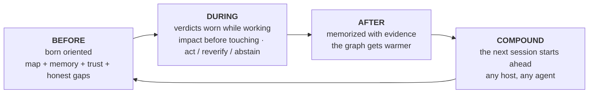

🇬🇧 [English](../README.md) | 🇧🇷 [Português](README.pt-BR.md) | 🇪🇸 [Español](README.es.md) | 🇮🇹 [Italiano](README.it.md) | 🇫🇷 [Français](README.fr.md) | 🇩🇪 [Deutsch](README.de.md) | 🇨🇳 [中文](README.zh.md) | 🇯🇵 [日本語](README.ja.md)

<p align="center">
  
</p>

<h1 align="center">Intelligence Opérationnelle pour Agents de Coding</h1>

<p align="center">
  <strong>Votre agent de coding arrête de démarrer à l'aveugle.</strong><br/>
  <em>Local-first. MCP-native. Mémoire en graphe, trust et raisonnement sur les changements pour les hôtes d'agents.</em>
</p>

<p align="center">
  <a href="https://www.npmjs.com/package/@maxkle1nz/m1nd"></a>
  <a href="https://crates.io/crates/m1nd-mcp"></a>
  <a href="https://github.com/maxkle1nz/m1nd/actions"></a>
  <a href="../LICENSE"></a>
  <a href="https://registry.modelcontextprotocol.io/?search=io.github.maxkle1nz/m1nd"></a>
  <a href="https://glama.ai/mcp/servers/maxkle1nz/m1nd"></a>
  <a href="https://docs.rs/m1nd-core"></a>
</p>

<p align="center">
  <a href="https://github.com/openai/codex"></a>
  <a href="https://claude.ai/download"></a>
  <a href="https://cursor.sh"></a>
  <a href="https://codeium.com/windsurf"></a>
  <a href="https://github.com/features/copilot"></a>
  <a href="https://zed.dev"></a>
  <a href="https://github.com/cline/cline"></a>
  <a href="https://roocode.com"></a>
  <a href="https://github.com/continuedev/continue"></a>
  <a href="https://opencode.ai"></a>
  <a href="https://aistudio.google.com"></a>
  <a href="https://aws.amazon.com/q/developer"></a>
</p>

---

**m1nd est la coque autour de votre agent de coding — la boucle opérationnelle dans laquelle il vit : orienté avant d'agir, des verdicts honnêtes pendant qu'il travaille, une mémoire avec preuves après qu'il a fini, qui se compose de session en session.**

<p align="center">
  
</p>

<p align="center"><em>Une session réelle — capturée depuis un propriétaire en direct (<code>m1nd-mcp 1.3.0</code>, un graphe de 6,453 nœuds sur ce dépôt) : <code>north</code> briefe l'agent avec du trust + des lacunes honnêtes, <code>seek</code> répond en portant un verdict <code>reverify</code> au lieu d'une supposition confiante, <code>memorize</code> réécrit la trouvaille ancrée au code.</em></p>

<p align="center"></p>

> grep trouve du texte. La recherche vectorielle trouve des chunks similaires. `m1nd` donne aux agents un graphe local de ce qui est connecté, ce qui a changé, ce qui casse, ce qui a dérivé, et où reprendre.

## Démarrez en 60 secondes

Trois commandes. La première prouve que le runtime est visible, la deuxième imprime le câblage exact de votre hôte, et la troisième est celle de votre agent — vous ne l'appelez plus jamais à la main.

```bash
# 1 · vérifiez que le runtime est installé et visible (pas de build, pas de config)
npx -y @maxkle1nz/m1nd doctor
#    → imprime un verdict JSON : runtime trouvé + version, ou le correctif exact sinon
```

```bash
# 2 · imprimez le câblage de votre hôte (claude · codex · gemini · cursor · cline · …)
npx -y @maxkle1nz/m1nd hosts plan --host claude --project .
#    → dry-run : le JSON de config MCP + le hook de session-start à coller — n'écrit rien
```

```jsonc
// 3 · désormais c'est votre AGENT qui conduit — son premier geste à chaque session est un seul appel :
north({ "agent_id": "dev", "task": "harden the JWT auth token validation flow" })
//    → un seul paquet : trust du binding · nœuds de focus + ancres · mémoire antérieure · honest_gaps
```

Prêt à le câbler pour de vrai (skills + config MCP, chaque hôte) ? → [Démarrage Rapide](#démarrage-rapide). Auto-installation depuis un agent ? → [`llms-install.md`](../llms-install.md).

## Ce qu'est m1nd : la coque autour de votre agent

*m1nd enveloppe votre agent de coding dans une boucle qui l'oriente avant d'agir, le garde honnête pendant qu'il travaille, et retient ce qu'il a appris quand il a terminé.*

- **Si vous construisez avec des agents** — rien de nouveau à apprendre : installez une fois et continuez à parler à votre agent. Il arrête de deviner, commence à se souvenir, et dit « je ne sais pas » quand c'est la vérité.
- **Si vous êtes ingénieur** — un moteur de graphe en Rust, local-first, derrière un serveur MCP : un graphe causal du code (edges structurels, sémantiques, temporels et causaux), des verdicts à calibration conforme, et une mémoire ancrée à des nœuds de code avec provenance. Rien ne quitte votre machine.

Les agents sur de vraies bases de code n'échouent pas parce qu'ils ne savent pas chercher — ils échouent parce qu'ils n'ont pas de modèle opérationnel. Chaque session reconstruit le contexte depuis zéro, modifie sans connaître le blast radius, et ne peut pas distinguer un résultat vide qui signifie « rien n'existe » d'un qui signifie « mauvais dépôt ». m1nd donne à l'agent un modèle durable de la base de code — un graphe causal avec spreading activation et plasticité Hebbienne — et enveloppe toute la boucle de l'agent autour de lui. Les fonctionnalités ici ne sont pas un catalogue ; ce sont les stations de cette coque :


```mermaid
flowchart LR
    B["<b>BEFORE</b><br/>born oriented<br/>map + memory + trust + honest gaps"]
    D["<b>DURING</b><br/>verdicts worn while working<br/>impact before touching · act / reverify / abstain"]
    A["<b>AFTER</b><br/>memorized with evidence<br/>the graph gets warmer"]
    C["<b>COMPOUND</b><br/>the next session starts ahead<br/>any host, any agent"]
    B --> D --> A --> C --> B
```

**m1nd est opéré par votre agent, pas par vous.** Chaque outil ci-dessous est appelé par l'agent lui-même — automatiquement, avant et après son travail. Un humain ne les exécute jamais en usage normal ; vous installez une fois ([Démarrage Rapide](#démarrage-rapide)) et continuez à parler à votre agent comme d'habitude.

**Une coque, trois lecteurs.** Le même paquet orienté est rendu pour celui qui s'apprête à agir : l'**agent principal** le lit comme `north` (livré — la porte d'entrée ci-dessous) ; un **sous-agent** le recevra comme le Delegation Packet, la moitié retrieval de sa spec de spawn (conçu — [docs/NEXTGEN-AGENT-PRD.md](../docs/NEXTGEN-AGENT-PRD.md), §O.12) ; l'**humain** le verra comme la Pre-Flight Card sur le Living Tree — votre projet en arbre navigable avec des post-its de mémoire, montrant ce que l'agent a vérifié vs. deviné avant qu'une modification n'atterrisse (conçu, en développement — [docs/HUMAN-LAYER-PRD.md](../docs/HUMAN-LAYER-PRD.md)). Une seule vérité, calculée une seule fois.

<p align="center"></p>

<p align="center">
  
</p>

### Ce qui se passe quand vous envoyez un message

Vous demandez à votre agent de réparer quelque chose. Voici ce que la coque fait autour de ce message :

1. **Avant que votre agent n'agisse**, m1nd lui remet la carte vivante de votre projet, ce que les sessions passées ont appris, à quel point faire confiance à chaque pièce — et ce qu'il ne sait *pas* (`north`).
2. **Pendant qu'il travaille**, il porte des verdicts : il vérifie ce qu'une modification casserait *avant* de toucher au code (`impact`), et là où la preuve est mince, il reçoit un honnête « je ne sais pas » au lieu d'une supposition confiante (`abstain`).
3. Il peut demander pourquoi deux morceaux de code sont connectés et être prévenu quand la réponse repose sur une supposition (`why`), et il est alerté avant de franchir une frontière d'architecture (`xray_gate`).
4. **Quand il termine**, la décision est consignée avec la preuve qui la soutient (`memorize`).
5. Cette mémoire est ancrée au code réel — si le code change plus tard, la mémoire se signale d'elle-même comme obsolète au lieu de mentir en silence (`cross_verify`).
6. **Votre prochaine session démarre en sachant déjà** — n'importe quel agent, n'importe quel outil : Claude Code, Codex, Cursor, Gemini. Ce qu'un agent apprend, le suivant en hérite.

## BEFORE — né orienté

*Votre agent démarre chaque session en connaissant déjà votre projet — et en sachant ce qu'il ne sait pas.*

<p align="center"></p>

Dans une session MCP, la porte d'entrée est un seul appel — `north(task)` compose le trust, le contexte de tâche (focus nodes + ancres PageRank), la mémoire inter-sessions antérieure, un signal de suffisance, un `next_move`, et `honest_gaps` (ce que m1nd ne sait *pas* encore) en un seul paquet, avant toute requête :

```jsonc
{"method":"tools/call","params":{"name":"north",
  "arguments":{"agent_id":"dev","task":"harden the JWT auth token validation flow"}}}
```

La réponse est un paquet orienté — verdict de trust, la mémoire laissée par la dernière session, et une liste honnête de lacunes. Une capture réelle du binaire de `main`, légèrement élaguée :

```jsonc
{
  "binding": { "trust_mode": "full_trust", "ok": true },      // verdict before retrieval
  "memory": [                                                 // recalled from a PRIOR session
    { "claim": "AuthTokenFlow", "source_agent": "authbot", "age_ms": 221, "stale": false }
    // …other claims from the same authored note, trimmed…
  ],
  "sufficiency": { "state": "gathering", "top_score": 0.64,
    "why": "the strongest match left out still scores 0.30 — relevant context did not fit …" },
  "next_move": "Call `surgical_context` on the top focus node to ground the task before editing.",
  "honest_gaps": []                                           // nothing withheld on this graph
}
```

`north` compose `trust_selftest` + `orient` + `boot_memory` + `focus` — l'agent ne va chercher une pièce isolée que lorsqu'il n'en a besoin que d'une. `focus` est le runtime d'attention de cette station : le working set minimal et borné en budget pour un objectif, avec une queue honnête de ce qu'il a laissé de côté et un signal indiquant si c'est *assez* de contexte pour l'instant. `needs_ingest` est une vraie réponse pour un graphe vide.

Si `north` rapporte `needs: "needs_ingest"`, ou si vous êtes sur un binaire antérieur à la 1.2.1 sans la composition L1GHT-recall, l'agent se replie sur la boucle de trust explicite — établir le trust *avant* de faire confiance à tout retrieval :

```jsonc
// 0. Trust the binding in one call (verdict before retrieval)
{"method":"tools/call","params":{"name":"trust_selftest","arguments":{"agent_id":"dev"}}}

// 1. If the verdict is not full_trust, ask for the deterministic recovery path
{"method":"tools/call","params":{"name":"recovery_playbook","arguments":{"agent_id":"dev"}}}

// 2. Build graph truth
{"method":"tools/call","params":{"name":"ingest","arguments":{"path":"/your/project","agent_id":"dev"}}}

// 3. Ask a structural question — empty results say *why*, never just "no results"
{"method":"tools/call","params":{"name":"activate","arguments":{"query":"authentication flow","agent_id":"dev"}}}
```

**Boucle première session, en quatre mouvements :** `north` (ou `trust_selftest` → `ingest`) → `seek`/`audit` → `memorize` le résultat durable pour que la prochaine session parte en avance.

## DURING — des verdicts portés pendant le travail

*Pendant qu'il travaille, chaque réponse arrive avec le degré de confiance à lui accorder — et « je ne sais pas » est une vraie réponse.*

<p align="center"></p>

L'agent ne consulte pas m1nd ; il le porte. Chaque réponse en cours de travail est un verdict calibré, pas une intuition :

- **`impact` avant de toucher** montre le blast radius que vous n'aviez pas lu ; `ghost_edges` fait remonter les fichiers qui changent toujours ensemble mais ne partagent aucun import.
- **`why` porte un verdict `closure`** — `blocked` signifie que le chemin repose sur un edge non résolu ou deviné : vérifiez cet edge avant de vous fier au chemin.
- **`predict` est à calibration conforme** — `calibrate_predict` arme une gate par dépôt ; les verdicts lisent ensuite `act` / `reverify` / `abstain`, où `abstain` signifie *non calibré ou insuffisant* — un signal pour s'arrêter, pas un oui faible. Livré dark : tant que vous ne calibrez pas, les verdicts plafonnent à `reverify`. Le couplage de co-change est normalisé en Jaccard lissé, pas en comptes bruts de commits (+3 points prouvés par calibration). *Mise en garde :* `predict` n'a qu'un fallback structurel tant que `ghost_edges` n'a pas chargé la matrice de co-change git — exécutez-le d'abord pour la vraie probabilité de co-change.
- **`xray_gate` garde les frontières de l'architecture** — appelé avant une modification, il répond « ce changement franchit-il une frontière de module interdite ? » avec `clear` / `caution` / `blocked` ; seul un manifest ratifié peut bloquer (anti-fatigue de guardrail).
- **Mission Control est de la discipline de preuve** — `mission_next` retourne exactement un mouvement plus des guardrails `do_not` ; en mode `bug_hunt`, un balayage direct final est requis avant la fermeture, pour que les agents vérifient l'espace négatif.

La même honnêteté accompagne le retrieval. Un hit de `seek` porte une lecture de `sufficiency` et un `trust_envelope` — et quand l'enveloppe n'a encore aucune ligne de calibration mesurée, elle plafonne son propre verdict au lieu d'exagérer. Une capture réelle, élaguée (le premier hit est une mémoire écrite par la dernière session) :

```jsonc
{
  "results": [
    { "label": "AuthTokenFlow", "source_agent": "authbot", "authored_ms_ago": 101161, "score": 0.48 }
    // …code-node hits, trimmed…
  ],
  "sufficiency": { "state": "gathering", "top_score": 0.48,
    "why": "the strongest match left out still scores 0.25 — relevant context did not fit …" },
  "trust_envelope": {
    "calibrated": false,               // no calibration row measured
    "verdict": "reverify",             // …so the verdict is capped below `act`
    "next_repair_call": "trust_selftest"
  }
}
```

<p align="center"></p>

## AFTER — le graphe se réchauffe

*Quand le travail atterrit, ce qui a été appris est consigné avec la preuve qui le soutient — et reste honnête quand le code continue d'évoluer.*

<p align="center"></p>

La plupart des outils donnent à l'agent un meilleur *retrieval*. À cette station, l'agent **crée des connaissances durables et lisibles par machine** qui se composent à travers les sessions et restent honnêtes par rapport au code. L1GHT transforme les connaissances créées en structure graph-native qui s'auto-signale quand le code qu'elle cite change — les affirmations confiantes diffusent plus d'activation que les incertaines.

1. **Conclure** — l'agent atteint quelque chose de durable (une décision, un résultat vérifié, pourquoi le code est ainsi) et appelle `memorize` avec des affirmations structurées et des chemins `evidence`.

```jsonc
memorize({
  "agent_id": "authbot",
  "node_label": "AuthTokenFlow",
  "claims": [
    { "label": "TokenValidator",
      "text": "TokenValidator validates JWTs via HMAC — rotate keys via KMS only",
      "confidence": "high", "evidence": ["src/auth/token.rs"] }
  ]
})
```

L'appel retourne la preuve qu'il a atterri — voici une réponse réelle capturée, élaguée :

```jsonc
{
  "ok": true,
  "claims_written": 1,
  "light_evidence_resolved": 1, "light_evidence_unresolved": 0,   // the evidence path bound to a real code node
  "path": ".../agent-memory/authtokenflow.light.md",
  "next_action": "Memory anchored to code and will auto-load next session; cross_verify(check:[\"evidence_freshness\"]) flags it if the cited code changes."
}
```

2. **Ancrer** — m1nd écrit un `.light.md` graph-native sous `<runtime>/agent-memory/`, l'ingère (`adapter=light mode=merge`), et résout chaque chemin `evidence` vers le vrai nœud de code via un edge `grounded_in` — ainsi la connaissance vit dans le même espace d'activation que le code et remonte dans `seek` / `activate` / `impact`.
3. **Auto-chargement** — à chaque démarrage de session future, `m1nd` ingère `agent-memory/` automatiquement et le rapporte dans `session_handshake.agent_memory`. Les résultats passés survivent à un ingest `mode=replace` et sont simplement *là*.
4. **Auto-signalement de la staleness** — `cross_verify(check: ["evidence_freshness"])` re-hash chaque fichier cité et nomme quelles affirmations sont devenues obsolètes parce que leur code a changé — ainsi la mémoire vous dit quand elle ment au lieu de vous tromper. La mémoire porte une colonne vertébrale de provenance : les affirmations déclarent un âge + un auteur réels, supplantent les affirmations plus anciennes, expirent avec le temps et respectent un plafond de récence — la connaissance mémorisée déclare sa propre fraîcheur au lieu de se périmer en silence.

Cette boucle a été prouvée en direct de bout en bout : `memorize` → edge `grounded_in` → signal de freshness sur fichier modifié → survit à `mode=replace` → boot auto-load. Vous fermez une mission bornée ? Passez `write_light_memory: true` à `mission_close` pour persister ses affirmations vérifiées de la même façon.

**COMPOUND — la session suivante naît dans la coque réchauffée.** Tuez ce processus, démarrez-en un **nouveau** contre le même runtime, et son premier `north(task)` porte déjà l'affirmation de la session précédente — voici un échange réel capturé (les deux appels ci-dessus ont tourné dans des processus séparés), élagué :

```jsonc
// north.memory, from a process that never called memorize itself:
"memory": [
  { "claim": "AuthTokenFlow",                   "source_agent": "authbot", "age_ms": 221, "stale": false },
  { "claim": "𝔻 evidence: src/auth/token.rs",   "source_agent": "authbot", "age_ms": 221, "stale": false },
  { "claim": "⍂ entity: TokenValidator",        "source_agent": "authbot", "age_ms": 221, "stale": false },
  { "claim": "𝔻 confidence: high",              "source_agent": "authbot", "age_ms": 221, "stale": false }
  // …the authored-note file node, trimmed…
]
```

`source_agent` nomme qui l'a écrite et `stale` re-vérifie le code cité — la session suivante hérite de la connaissance *et* de sa provenance, pas d'une simple chaîne.

### Un graphe, plusieurs agents

<p align="center"></p>

Le Démarrage Rapide ci-dessous câble un serveur stdio par hôte — parfait pour un seul agent, mais chaque processus charge son propre graphe et détient sa propre lease. Le déploiement pour lequel m1nd est conçu, c'est un seul propriétaire, plusieurs agents attachés. Un seul processus propriétaire détient le graphe vivant :

```bash
m1nd-mcp --serve --no-gui --port 1337 --runtime-dir /your/project/.m1nd
```

Chaque agent s'attache ensuite comme un fin pont stdio↔HTTP — il ne charge **aucun** graphe, ne construit aucun moteur, et ne prend **aucune** lease :

```bash
m1nd-mcp --attach http://127.0.0.1:1337 --stdio    # or set M1ND_ATTACH_URL and omit the flag
```

N'importe quel nombre de ponts pointent vers l'unique propriétaire et partagent son unique graphe vivant, si bien que ce qu'un agent `memorize` est immédiatement rappelé par un autre — pas de réingest, pas de copie par agent. Les requêtes passent par localhost, donc ça reste local-first (le bind reste `127.0.0.1` sauf si vous optez pour `--bind 0.0.0.0`). Un `seek` à chaud via le pont a mesuré ≈0.7ms sur un petit graphe sur une seule machine — ordre de grandeur, pas une garantie : l'attach ajoute un aller-retour localhost, et la latence croît avec la taille du graphe et la charge.

## Le matériau : l'honnêteté

*Toute la coque est faite d'un seul matériau — m1nd préfère dire à votre agent « ne fais pas confiance à ceci » plutôt que de le laisser deviner.*

C'est la chose la plus défendable que m1nd fait, et aucun concurrent ne la propose. La doctrine : **la crédibilité vient de l'honnêteté, pas de toujours gagner.** Un *non* honnête vaut mieux qu'une supposition confiante — chaque station ci-dessus est faite de ce matériau.

- **`trust_selftest`** retourne un verdict *avant* tout retrieval : `full_trust`, `needs_ingest`, `wrong_workspace_binding`, `stale_binding_suspected`, ou `degraded_host_tool_surface`. L'agent sait s'il doit continuer, ingérer, rebinder, ou faire un fallback.
- **`agent_runtime_contract`** est présent dans chaque réponse de retrieval, portant un `trust_mode`. Un résultat vide est désambiguïsé — lié au mauvais dépôt vs. genuinement rien là — jamais silencieusement rapporté comme « aucun résultat. »
- **`trust_band: insufficient_evidence` signifie AUCUNE preuve — pas un risque moyen.** La réponse honnête de démarrage à froid, distincte de faible/moyen/élevé.
- **Les tableaux `non_claims`** sont présents sur chaque outil de mission. m1nd dit à l'agent ce qu'il n'a *pas* prouvé.
- **`mission_verify` peut dire non — et le fait, dans du code testé.** Il rejette les preuves uniquement issues du graphe : une affirmation ne peut pas se fermer sans une lecture de fichier, une exécution de test, ou une sonde runtime. Le test s'appelle littéralement `graph_only_evidence_is_not_enough`.
- **`recovery_playbook`** retourne une liste d'étapes déterministe et ordonnée pour réparer le binding.

Montré, pas raconté. Appelez `trust_selftest` sur un runtime sans binding et le verdict *est* l'instruction de réparation — une capture réelle, élaguée :

```jsonc
{
  "ok": false,
  "status": "blocked",
  "verdict": "needs_ingest",          // not "no results" — it says why
  "next_action": "call_ingest",
  "checks": { "graph_populated": false, "needs_ingest": true, "recovery_playbook_attached": true },
  "recovery_playbook": {
    "recovery_goal": "Populate this binding's active graph for the intended repository.",
    "steps": [ { "action": "Call ingest for the intended repository on this same binding." } /* …trimmed… */ ]
  }
}
```

La preuve de l'engagement est ce qui a été supprimé pour lui : `savings` et `resonate` ont été retirés de la surface annoncée en beta.7 parce qu'un outil qui prétend toujours gagner n'est pas crédible. Aucun concurrent — ni mem0, Zep, Letta, Sourcegraph, ni aucun MCP code-graph — ne propose un layer qui dit à l'agent ce à quoi il ne faut *pas* faire confiance et comment récupérer.

<p align="center"></p>

**La boucle de field-triage se referme sur elle-même.** La télémétrie de session que les agents laissent dans `~/.m1nd/field-reports.jsonl` (local-only — m1nd ne téléphone jamais à la maison) n'est pas un log passif : les reports sont triés, et un bug de terrain *confirmé* devient un cas de batterie rouge **avant** le fix, si bien que la régression est prouvée, pas seulement décrite. Cette boucle a déjà tourné de bout en bout dans un balayage complet de field-triage : quatre bugs remontés du terrain sont devenus des cas de batterie en échec puis des fixes mergés, tous livrés dans la **1.2.1** — `north` compose désormais le L1GHT recall dans son paquet de mémoire, le sentinel de graphe `temp` se résout vers un vrai tempdir au lieu de joncher le répertoire de travail, `memorize` accepte une `confidence` numérique, et le tag d'ambiguïté de closure ne se déclenche plus que sur des égalités authentiques (le crieur au loup : ambiguous-blocked est tombé de 9/11 → 0/11).

## Démarrage Rapide

*Installez une fois, câblez l'hôte de votre agent et laissez la place — à partir d'ici, c'est votre agent qui conduit.*

```bash
git clone https://github.com/maxkle1nz/m1nd.git && cd m1nd
npm install -g .
m1nd doctor
```

Ensuite, câblez votre hôte — les deux mêmes commandes, une par hôte (`codex`, `claude`, `gemini`, `antigravity`, `generic`) :

| Hôte | Installer le pack d'agent | Câbler la config MCP |
|---|---|---|
| Codex | `m1nd install-skills codex` | `m1nd mcp-config codex --project /your/project` |
| Claude Code | `m1nd install-skills claude --project /your/project` | `m1nd mcp-config claude --project /your/project` |
| Gemini | `m1nd install-skills gemini --project /your/project` | `m1nd mcp-config gemini --project /your/project` |
| Antigravity | `m1nd install-skills antigravity --project /your/project` | `m1nd mcp-config antigravity --project /your/project` |
| Generic | `m1nd install-skills generic --project /your/project` | `m1nd mcp-config generic --project /your/project` |

Ou depuis npm : `npm install -g @maxkle1nz/m1nd`. `install-skills` livre le pack d'agent — la boucle opérationnelle elle-même en cinq protocoles nommés, pas de la documentation décorative.

**La surface de l'opérateur, c'est cette CLI ; la surface de l'agent, c'est MCP.** Un humain exécute occasionnellement `m1nd doctor`, `install-skills`, `mcp-config` — l'agent exécute tout le reste. Une échappatoire host-neutral existe pour quand il n'y a pas de session MCP vivante où appeler `north` (obsolète, liée au mauvais dépôt, ou pas encore chargée) : elle lance un runtime isolé, le lie au dépôt, et retourne une seule enveloppe lisible par machine qui délimite le périmètre, établit le trust, ingère si nécessaire, retourne des ancres, et fait le handoff vers la preuve directe :

```bash
m1nd agent first-minute --repo /your/project --query "understand this system" --json
```

Épinglez le binaire si besoin : `--version` affiche `1.2.x (<sha>)`, et `M1ND_EXPECTED_VERSION` / `M1ND_EXPECTED_SHA` (+ `M1ND_STRICT_VERSION`) permettent à un hôte de détecter et de refuser un binaire qui a dérivé.

Carte d'installation complète, packs d'hôtes, build du runtime natif et flags de mise à jour : [docs/AGENT-PACKS.md](../docs/AGENT-PACKS.md) · configuration client par client : [matrice d'intégration](../docs/IDE-INTEGRATIONS.md).

## Preuves

<p align="center"></p>

Chaque ligne est calibrée exactement à ce qui a été mesuré. m1nd ne met pas en avant des chiffres d'économies ou de ROI — c'est le principe.

| Affirmation | Résultat | Source / calibration |
|---|---|---|
| Latence `activate` / `impact` | `activate` ~1µs, `impact` sub-µs sur un graphe synthétique de 1K nœuds | Benchmarks Criterion — **reproduisez-le vous-même : `cargo bench -p m1nd-core`** (mesuré `activate_1k_nodes` ≈1.4µs, `impact_depth3` ≈0.5µs sur un Mac Apple-silicon) ; [méthodologie](https://m1nd.world/wiki/benchmarks.html) ; ordre de grandeur, dépendant du matériel. |
| Matrice linguistique | appels + imports cross-fichier pour 10 langages (+ Ruby cross-fichier) | Vérifié de bout en bout dans un seul ingest polyglotte ; tests par langage dans `m1nd-ingest`. Voir [Couverture Linguistique](#couverture-linguistique). |
| Échantillon de validation post-écriture | 12/12 classifiés correctement | Vérification runtime interne. |
| Bug-hunt avec graines | 16/20 au premier round accepté de défauts semés `humanize` (m1nd-trained) ; `m1nd-basic` et direct chacun 8/15 | Preuve produit interne, `public_claim_worthy=false` — pas un benchmark universel. |
| Auto-vérification de la mémoire | prouvée en direct de bout en bout | `memorize` → `grounded_in` → signal de freshness sur fichier modifié → survit à replace → boot auto-load. |
| Batterie de capacités vs grep | 37/37 passent ; en face-à-face 16 victoires m1nd / 12 égalités / **0 victoire grep** | Harness in-repo `scratchpad/m1nd_battery.py` (37 cas, ingest frais + vérité-terrain PASS/FAIL + face-à-face `rg`). **Reproduire : `python3 scratchpad/m1nd_battery.py ./target/release/m1nd-mcp . --suite m1nd`.** Calibration : un seul dépôt (m1nd lui-même), cas auto-rédigés ; ~5 des égalités sont des outils structurels notés face à un proxy grep littéral qui ne peut pas exprimer ce à quoi ils répondent. |
| Calibration conforme (`predict`) | act-band ≈32% de précision @ ≈13.5% de couverture (α=0.10) | Sur l'historique git propre de m1nd (n≈9.2k prédictions held-out), +3pts face aux comptes bruts après le passage au Jaccard lissé. Calibration : un seul dépôt, un signal grossier basé sur des comptes — la gate s'abstient surtout aujourd'hui, **par design** : l'abstention est la sortie honnête d'un signal faible, pas un échec. |

<details>
<summary><strong>Plus de visuels — la série complète des mécanismes</strong></summary>
<br/>
<p align="center">
  
  
</p>
<p align="center">
  
  
</p>
</details>

## Limites

`m1nd` complète plutôt que remplace votre LSP, compilateur, test runner, scanners de sécurité et stack d'observabilité. Il est le plus utile avant la recherche, la revue ou une modification, et chaque fois que les docs, l'impact ou la continuité comptent.

Il est **moins utile** quand :

- la recherche exacte de texte répond déjà à la question
- la vérité du compilateur ou du runtime est la seule chose dont vous avez besoin
- la tâche est une action locale banale sur fichier sans incertitude structurelle

**A besoin d'alimentation :** `trust` et `tremor` démarrent avec des priors neutres jusqu'à ce que le feedback `learn` / les données `ghost_edges` s'accumulent, et `predict` a besoin que `ghost_edges` soit chargé avant que son signal de co-change soit significatif. Ils s'améliorent avec l'usage ; ils sont honnêtes sur le fait d'être non informés au démarrage.

## Ce que m1nd N'Est Pas

`m1nd` n'est pas seulement :

- un outil de recherche de code avec un index plus grand
- un layer de RAG sur le dépôt qui ne récupère que des fichiers ou des chunks
- une base de données en graphe qui laisse les décisions de workflow au client
- un remplacement d'analyse statique pour le compilateur, les tests ou les outils de sécurité
- un bundle MCP d'utilitaires sans rapport
- une surface d'outils que l'humain doit apprendre — les verbes appartiennent à l'agent ; le vôtre, c'est la petite [CLI de setup](#démarrage-rapide)

C'est le layer qui transforme ces surfaces en un système opérationnel sur lequel un agent peut raisonner et agir. Pas pour les recherches mono-fichier, les grep simples, ou la vérité compilateur — utilisez des outils simples dans ces cas.

## Couverture Linguistique

Le raisonnement sur le graphe (`impact`, `why`, `predict`, `trace`, `taint_trace`) vaut ce que vaut l'extracteur. m1nd résout à la fois les **edges `calls`** (call graph) et les **`imports` cross-fichier** (résolution de dépendances fichier→fichier) par langage. La matrice ci-dessous a été prouvée en direct dans un seul ingest polyglotte :

| Langage | `calls` | imports cross-fichier |
|---|:---:|:---:|
| Rust | ✅ | ✅ (`mod`/`use crate::`) |
| Python | ✅ | ✅ |
| JavaScript / TypeScript | ✅ | ✅ |
| Go | ✅ | ✅ (package) |
| Java | ✅ | ✅ (FQCN + wildcard) |
| C / C++ | ✅ | ✅ (`#include "..."`) |
| Kotlin | ✅ | ✅ (package) |
| PHP | ✅ | ✅ (PSR-4) |
| Scala | ✅ | ✅ (package) |
| Ruby | ⏳ | ✅ (`require_relative`) |
| C# | ✅ | — (les namespaces ne mappent pas 1:1 aux fichiers) |
| Swift | ✅ | — |

Toutes les lignes ✅ sont vérifiées de bout en bout (un import `caller`→`callee` se résout et le caller émet des edges d'appel). Les autres langages tombent sur l'extracteur générique (uniquement `contains`). Les imports non résolvables (paquets externes, gems, stdlib, en-têtes système) sont honnêtement laissés non résolus plutôt que devinés.

## Architecture en Un Coup d'Œil

Trois crates Rust core plus un bridge auxiliaire :

- **`m1nd-mcp`** — le serveur MCP et la surface du runtime opérationnel.
- **`m1nd-core`** — le moteur de graphe : un `WavefrontEngine` faisant du spreading activation, de la plasticité Hebbienne, de l'adjacence CSR, et des ghost edges dérivés de git.
- **`m1nd-ingest`** — adapters d'extraction, de routage et de construction de graphe (code, docs universels, L1GHT).
- **`m1nd-openclaw`** — bridge auxiliaire OpenClaw (lane Unix-socket, versioning indépendant).

Versions actuelles des crates : `m1nd-core`, `m1nd-ingest`, `m1nd-mcp` tous en `1.2.0` (`m1nd-openclaw` est versionné indépendamment en `0.1.0`).

<p align="center">
  
</p>

La surface MCP live évolue avec les versions — utilisez `tools/list` pour le nombre exact d'outils et les noms dans votre build. **Menu central :** environ 15 outils sont annoncés par défaut — le noyau ratifié par le propriétaire plus le socle de liaison hôte — parce que six semaines de trafic mesuré ont montré 141 outils annoncés pour 13 réellement appelés. Définissez `M1ND_TOOL_TIER=full` pour annoncer le registre complet (140+ outils : RETROBUILDER, perspectives, federation, daemon). Rien n'est retiré : les outils cachés restent appelables par leur nom via `tools/call`, et `help` catalogue et explique TOUT le registre à n'importe quel niveau — c'est la porte d'entrée. Le catalogue outil par outil ne vit pas dans ce README : voir le [wiki canonique](https://m1nd.world/wiki/), [docs/AGENT-PACKS.md](../docs/AGENT-PACKS.md) et [EXAMPLES.md](../EXAMPLES.md) pour la profondeur, et [CHANGELOG.md](../CHANGELOG.md) pour l'historique des versions.

## Contribuer

Les contributions sont bienvenues sur les extracteurs et adapters, le tooling MCP/runtime, les benchmarks, la documentation, et les algorithmes de graphe. Voir [CONTRIBUTING.md](../CONTRIBUTING.md).

## Licence

MIT. Voir [LICENSE](../LICENSE).
