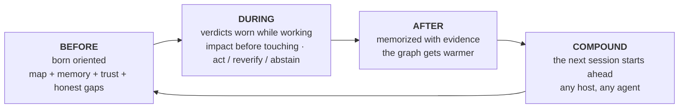

🇬🇧 [English](../README.md) | 🇧🇷 [Português](README.pt-BR.md) | 🇪🇸 [Español](README.es.md) | 🇮🇹 [Italiano](README.it.md) | 🇫🇷 [Français](README.fr.md) | 🇩🇪 [Deutsch](README.de.md) | 🇨🇳 [中文](README.zh.md) | 🇯🇵 [日本語](README.ja.md)

<p align="center">
  
</p>

<h1 align="center">Intelligenza Operativa per Agenti di Coding</h1>

<p align="center">
  <strong>Il tuo agente di coding smette di partire alla cieca.</strong><br/>
  <em>Local-first. MCP-native. Grafo di memoria, trust e ragionamento sui cambiamenti per agent host.</em>
</p>

<p align="center">
  <a href="https://www.npmjs.com/package/@maxkle1nz/m1nd"></a>
  <a href="https://crates.io/crates/m1nd-mcp"></a>
  <a href="https://github.com/maxkle1nz/m1nd/actions"></a>
  <a href="../LICENSE"></a>
  <a href="https://registry.modelcontextprotocol.io/?search=io.github.maxkle1nz/m1nd"></a>
  <a href="https://glama.ai/mcp/servers/maxkle1nz/m1nd"></a>
  <a href="https://docs.rs/m1nd-core"></a>
</p>

<p align="center">
  <a href="https://github.com/openai/codex"></a>
  <a href="https://claude.ai/download"></a>
  <a href="https://cursor.sh"></a>
  <a href="https://codeium.com/windsurf"></a>
  <a href="https://github.com/features/copilot"></a>
  <a href="https://zed.dev"></a>
  <a href="https://github.com/cline/cline"></a>
  <a href="https://roocode.com"></a>
  <a href="https://github.com/continuedev/continue"></a>
  <a href="https://opencode.ai"></a>
  <a href="https://aistudio.google.com"></a>
  <a href="https://aws.amazon.com/q/developer"></a>
</p>

---

**m1nd è il guscio attorno al tuo agente di coding — il ciclo operativo dentro cui vive: orientato prima di agire, verdetti onesti mentre lavora, memoria con evidenza dopo che ha finito, che si accumula tra le sessioni.**

<p align="center">
  
</p>

<p align="center"><em>Una sessione reale — catturata da un owner dal vivo (<code>m1nd-mcp 1.3.0</code>, un grafo di 6,453 nodi su questo repository): <code>north</code> orienta l'agente con trust + lacune oneste, <code>seek</code> risponde indossando un verdetto <code>reverify</code> invece di una supposizione sicura, <code>memorize</code> riscrive la scoperta ancorata al codice.</em></p>

<p align="center"></p>

> grep trova testo. La ricerca vettoriale trova chunk simili. `m1nd` dà agli agenti un grafo locale di cosa è connesso, cosa è cambiato, cosa si rompe, cosa è andato in drift, e dove riprendere.

## Inizia in 60 secondi

Tre comandi. Il primo prova che il runtime è visibile, il secondo stampa il cablaggio esatto del tuo host, e il terzo è del tuo agente — non lo chiami più a mano.

```bash
# 1 · verifica che il runtime sia installato e visibile (niente build, niente config)
npx -y @maxkle1nz/m1nd doctor
#    → stampa un verdetto JSON: runtime trovato + versione, o la correzione esatta altrimenti
```

```bash
# 2 · stampa il cablaggio del tuo host (claude · codex · gemini · cursor · cline · …)
npx -y @maxkle1nz/m1nd hosts plan --host claude --project .
#    → dry-run: il JSON di config MCP + l'hook di session-start da incollare — non scrive nulla
```

```jsonc
// 3 · d'ora in poi guida il tuo AGENTE — la sua prima mossa a ogni sessione è una sola chiamata:
north({ "agent_id": "dev", "task": "harden the JWT auth token validation flow" })
//    → un solo pacchetto: trust del binding · nodi di focus + ancore · memoria precedente · honest_gaps
```

Pronto a cablarlo davvero (skills + config MCP, ogni host)? → [Avvio Rapido](#avvio-rapido). Auto-installazione da un agente? → [`llms-install.md`](../llms-install.md).

## Cos'è m1nd: il guscio attorno al tuo agente

*m1nd avvolge il tuo agente di coding in un ciclo che lo orienta prima di agire, lo tiene onesto mentre lavora, e ricorda ciò che ha imparato quando ha finito.*

- **Se costruisci con gli agenti** — niente di nuovo da imparare: installi una volta e continui a parlare col tuo agente. Smette di tirare a indovinare, comincia a ricordare, e dice "non lo so" quando quella è la verità.
- **Se sei un ingegnere** — un motore a grafo in Rust, local-first, dietro un server MCP: un grafo causale del codice (edge strutturali, semantici, temporali e causali), verdetti con calibrazione conforme, e memoria ancorata a nodi di codice con provenienza. Nulla lascia la tua macchina.

Gli agenti su codebase reali non falliscono perché non sanno cercare — falliscono perché non hanno un modello operativo. Ogni sessione ricostruisce il contesto da zero, modifica senza conoscere il blast radius, e non distingue un risultato vuoto che significa "non esiste nulla" da uno che significa "repository sbagliato". m1nd dà all'agente un modello duraturo del codebase — un grafo causale con spreading activation e plasticità Hebbiana — e avvolge l'intero ciclo dell'agente attorno ad esso. Le funzionalità qui non sono un catalogo; sono le stazioni di quel guscio:



**m1nd è operato dal tuo agente, non da te.** Ogni strumento qui sotto è chiamato dall'agente stesso — automaticamente, prima e dopo il lavoro. Un umano non li esegue mai nell'uso normale; installi una volta ([Avvio Rapido](#avvio-rapido)) e continui a parlare col tuo agente come sempre.

**Un guscio, tre lettori.** Lo stesso pacchetto orientato viene renderizzato per chi sta per agire: l'**agente principale** lo legge come `north` (rilasciato — la porta d'ingresso qui sotto); un **subagente** lo riceverà come il Delegation Packet, la metà di retrieval della sua spec di spawn (progettato — [docs/NEXTGEN-AGENT-PRD.md](../docs/NEXTGEN-AGENT-PRD.md), §O.12); l'**umano** lo vedrà come la Pre-Flight Card sul Living Tree — il tuo progetto come un albero navigabile con post-it di memoria, che mostra cosa l'agente ha verificato vs. supposto prima che una modifica atterri (progettato, in sviluppo — [docs/HUMAN-LAYER-PRD.md](../docs/HUMAN-LAYER-PRD.md)). Una verità, calcolata una volta sola.

<p align="center"></p>

<p align="center">
  
</p>

### Cosa succede quando invii un messaggio

Chiedi al tuo agente di sistemare qualcosa. Ecco cosa fa il guscio attorno a quel messaggio:

1. **Prima che il tuo agente agisca**, m1nd gli consegna la mappa viva del tuo progetto, ciò che le sessioni passate hanno imparato, quanto fidarsi di ogni pezzo — e ciò che *non* sa (`north`).
2. **Mentre lavora**, indossa verdetti: controlla cosa romperebbe una modifica *prima* di toccare il codice (`impact`), e dove l'evidenza è sottile riceve un onesto "non lo so" invece di una supposizione sicura (`abstain`).
3. Può chiedere perché due pezzi di codice sono connessi ed essere avvisato quando la risposta poggia su una supposizione (`why`), ed è allertato prima di attraversare un confine architetturale (`xray_gate`).
4. **Quando finisce**, la decisione viene annotata insieme all'evidenza che la sostiene (`memorize`).
5. Quella memoria è ancorata al codice reale — se il codice cambia in seguito, la memoria si segnala da sola come obsoleta invece di mentire in silenzio (`cross_verify`).
6. **La tua prossima sessione parte già sapendo** — qualsiasi agente, qualsiasi strumento: Claude Code, Codex, Cursor, Gemini. Ciò che un agente impara, il successivo lo eredita.

## BEFORE — nasce orientato

*Il tuo agente inizia ogni sessione conoscendo già il tuo progetto — e sapendo ciò che non sa.*

<p align="center"></p>

All'interno di una sessione MCP, la porta d'ingresso è un'unica chiamata — `north(task)` compone trust, contesto del task (nodi di focus + anchor PageRank), memoria pregressa cross-sessione, un segnale di sufficienza, un `next_move` e `honest_gaps` (ciò che m1nd *non* sa ancora) in un unico pacchetto, prima di qualsiasi query:

```jsonc
{"method":"tools/call","params":{"name":"north",
  "arguments":{"agent_id":"dev","task":"harden the JWT auth token validation flow"}}}
```

La risposta è un pacchetto orientato — verdetto di trust, la memoria lasciata dall'ultima sessione, e un elenco onesto di gap. Una cattura reale dal binario di `main`, leggermente rifilata:

```jsonc
{
  "binding": { "trust_mode": "full_trust", "ok": true },      // verdict before retrieval
  "memory": [                                                 // recalled from a PRIOR session
    { "claim": "AuthTokenFlow", "source_agent": "authbot", "age_ms": 221, "stale": false }
    // …other claims from the same authored note, trimmed…
  ],
  "sufficiency": { "state": "gathering", "top_score": 0.64,
    "why": "the strongest match left out still scores 0.30 — relevant context did not fit …" },
  "next_move": "Call `surgical_context` on the top focus node to ground the task before editing.",
  "honest_gaps": []                                           // nothing withheld on this graph
}
```

`north` compone `trust_selftest` + `orient` + `boot_memory` + `focus` — l'agente ricorre a un pezzo singolo solo quando gliene serve esattamente uno. `focus` è il runtime di attenzione di questa stazione: il working set minimo e delimitato dal budget per un obiettivo, con una coda onesta di ciò che ha lasciato fuori e un segnale che indica se quel contesto è già *sufficiente*. `needs_ingest` è una risposta reale per un grafo vuoto.

Se `north` riporta `needs: "needs_ingest"`, o sei su un binario precedente alla 1.2.1 senza la composizione L1GHT-recall, l'agente ricorre al ciclo di trust esplicito — stabilire il trust *prima* di fidarsi di qualsiasi retrieval:

```jsonc
// 0. Trust the binding in one call (verdict before retrieval)
{"method":"tools/call","params":{"name":"trust_selftest","arguments":{"agent_id":"dev"}}}

// 1. If the verdict is not full_trust, ask for the deterministic recovery path
{"method":"tools/call","params":{"name":"recovery_playbook","arguments":{"agent_id":"dev"}}}

// 2. Build graph truth
{"method":"tools/call","params":{"name":"ingest","arguments":{"path":"/your/project","agent_id":"dev"}}}

// 3. Ask a structural question — empty results say *why*, never just "no results"
{"method":"tools/call","params":{"name":"activate","arguments":{"query":"authentication flow","agent_id":"dev"}}}
```

**Ciclo prima sessione, in quattro mosse:** `north` (o `trust_selftest` → `ingest`) → `seek`/`audit` → `memorize` il risultato duraturo così la sessione successiva parte avvantaggiata.

## DURING — verdetti indossati mentre lavora

*Mentre lavora, ogni risposta arriva con quanto ci si può fidare — e "non lo so" è una risposta reale.*

<p align="center"></p>

L'agente non consulta m1nd; lo indossa. Ogni risposta a metà lavoro è un verdetto calibrato, non una sensazione:

- **`impact` prima di toccare** mostra il blast radius che non avevi letto; `ghost_edges` fa emergere i file che cambiano sempre insieme ma non condividono alcun import.
- **`why` porta un verdetto `closure`** — `blocked` significa che il percorso poggia su un edge irrisolto o supposto: verifica quell'edge prima di fidarti del percorso.
- **`predict` ha calibrazione conforme** — `calibrate_predict` arma un gate per-repo; i verdetti leggono poi `act` / `reverify` / `abstain`, dove `abstain` significa *non calibrato o insufficiente* — un segnale per fermarsi, non un sì debole. Rilasciato dark: finché non calibri, i verdetti si fermano a `reverify`. L'accoppiamento di co-change è normalizzato con Jaccard smussato, non conteggi grezzi di commit (calibrazione-provata: +3 punti). *Avvertenza:* `predict` ha solo fallback strutturale finché `ghost_edges` non carica la matrice di co-change git — eseguilo prima per la reale probabilità di co-change.
- **`xray_gate` sorveglia i confini dell'architettura** — chiamato prima di una modifica, risponde "questo cambiamento attraversa un confine di modulo proibito?" con `clear` / `caution` / `blocked`; solo un manifest ratificato può bloccare (anti-fatica da guardrail).
- **Mission Control è disciplina della prova** — `mission_next` restituisce esattamente una mossa più guardrail `do_not`; in modalità `bug_hunt` è richiesto uno sweep diretto finale prima della chiusura, così gli agenti controllano lo spazio negativo.

La stessa onestà accompagna il retrieval. Un hit di `seek` porta una lettura di `sufficiency` e un `trust_envelope` — e quando l'envelope non ha ancora alcuna riga di calibrazione misurata, limita il proprio verdetto invece di esagerare. Una cattura reale, rifilata (il primo hit è una memoria scritta dall'ultima sessione):

```jsonc
{
  "results": [
    { "label": "AuthTokenFlow", "source_agent": "authbot", "authored_ms_ago": 101161, "score": 0.48 }
    // …code-node hits, trimmed…
  ],
  "sufficiency": { "state": "gathering", "top_score": 0.48,
    "why": "the strongest match left out still scores 0.25 — relevant context did not fit …" },
  "trust_envelope": {
    "calibrated": false,               // no calibration row measured
    "verdict": "reverify",             // …so the verdict is capped below `act`
    "next_repair_call": "trust_selftest"
  }
}
```

<p align="center"></p>

## AFTER — il grafo si scalda

*Quando il lavoro atterra, ciò che è stato imparato viene annotato con l'evidenza che lo sostiene — e resta onesto quando il codice va avanti.*

<p align="center"></p>

La maggior parte degli strumenti dà all'agente un *retrieval* migliore. In questa stazione l'agente **crea conoscenza durevole e leggibile dalla macchina** che si accumula tra le sessioni e rimane onesta rispetto al codice. L1GHT trasforma la conoscenza creata in struttura graph-native che si auto-segnala quando il codice che cita cambia — le affermazioni sicure diffondono più attivazione di quelle incerte.

1. **Concludi** — l'agente raggiunge qualcosa di duraturo (una decisione, un risultato verificato, perché il codice è così) e chiama `memorize` con affermazioni strutturate e percorsi `evidence`.

```jsonc
memorize({
  "agent_id": "authbot",
  "node_label": "AuthTokenFlow",
  "claims": [
    { "label": "TokenValidator",
      "text": "TokenValidator validates JWTs via HMAC — rotate keys via KMS only",
      "confidence": "high", "evidence": ["src/auth/token.rs"] }
  ]
})
```

La chiamata restituisce la prova che è atterrata — questa è una risposta reale catturata, rifilata:

```jsonc
{
  "ok": true,
  "claims_written": 1,
  "light_evidence_resolved": 1, "light_evidence_unresolved": 0,   // the evidence path bound to a real code node
  "path": ".../agent-memory/authtokenflow.light.md",
  "next_action": "Memory anchored to code and will auto-load next session; cross_verify(check:[\"evidence_freshness\"]) flags it if the cited code changes."
}
```

2. **Ancora** — m1nd scrive un `.light.md` graph-native sotto `<runtime>/agent-memory/`, lo ingerisce (`adapter=light mode=merge`), e risolve ogni percorso `evidence` al nodo reale del codice tramite un edge `grounded_in` — così la conoscenza vive nello stesso spazio di attivazione del codice e emerge in `seek` / `activate` / `impact`.
3. **Auto-load** — all'inizio di ogni sessione futura, `m1nd` ingerisce `agent-memory/` automaticamente e lo riporta in `session_handshake.agent_memory`. I risultati passati sopravvivono a un ingest `mode=replace` e sono semplicemente *lì*.
4. **Auto-segnala la staleness** — `cross_verify(check: ["evidence_freshness"])` ri-hash ogni file citato e nomina quali affermazioni sono diventate obsolete perché il loro codice è cambiato — così la memoria ti dice quando mente invece di ingannarti. La memoria porta una spina dorsale di provenienza: le affermazioni dichiarano età + autore reali, soppiantano affermazioni più vecchie, decadono nel tempo e rispettano un limite di recency — la conoscenza ricordata dichiara la propria freschezza invece di andare silenziosamente obsoleta.

Questo ciclo è stato provato live end-to-end: `memorize` → edge `grounded_in` → segnale di freshness su file modificato → sopravvive a `mode=replace` → boot auto-load. Stai chiudendo una missione delimitata? Passa `write_light_memory: true` a `mission_close` per persistere le sue affermazioni verificate allo stesso modo.

**COMPOUND — la sessione successiva nasce dentro il guscio riscaldato.** Uccidi quel processo, avviane uno **nuovo** contro lo stesso runtime, e il suo primo `north(task)` porta già l'affermazione della sessione precedente — questo è uno scambio reale catturato (le due chiamate qui sopra sono avvenute in processi separati), rifilato:

```jsonc
// north.memory, from a process that never called memorize itself:
"memory": [
  { "claim": "AuthTokenFlow",                   "source_agent": "authbot", "age_ms": 221, "stale": false },
  { "claim": "𝔻 evidence: src/auth/token.rs",   "source_agent": "authbot", "age_ms": 221, "stale": false },
  { "claim": "⍂ entity: TokenValidator",        "source_agent": "authbot", "age_ms": 221, "stale": false },
  { "claim": "𝔻 confidence: high",              "source_agent": "authbot", "age_ms": 221, "stale": false }
  // …the authored-note file node, trimmed…
]
```

`source_agent` nomina chi l'ha scritta e `stale` ri-verifica il codice citato — la sessione successiva eredita la conoscenza *e* la sua provenienza, non una stringa nuda.

### Un grafo, molti agenti

<p align="center"></p>

L'Avvio Rapido qui sotto collega un server stdio per host — va bene per un solo agente, ma ogni processo carica il proprio grafo e detiene il proprio lease. Il deployment per cui m1nd è costruito è un proprietario, molti agenti collegati. Un unico processo proprietario detiene il grafo live:

```bash
m1nd-mcp --serve --no-gui --port 1337 --runtime-dir /your/project/.m1nd
```

Ogni agente si collega poi come un sottile bridge stdio↔HTTP — **non** carica alcun grafo, non costruisce engine, e **non** prende alcun lease:

```bash
m1nd-mcp --attach http://127.0.0.1:1337 --stdio    # or set M1ND_ATTACH_URL and omit the flag
```

Un numero qualsiasi di bridge punta all'unico proprietario e ne condivide il singolo grafo live, così ciò che un agente `memorize` un altro lo richiama immediatamente — nessun reingest, nessuna copia per-agente. Le query passano su localhost, quindi resta local-first (il bind resta `127.0.0.1` a meno che tu non scelga `--bind 0.0.0.0`). Un `seek` a caldo sul bridge ha misurato ≈0.7ms su un grafo piccolo su una singola macchina — ordine di grandezza, non una garanzia: il collegamento aggiunge un round-trip su localhost, e la latenza scala con la dimensione del grafo e il carico.

## Il materiale: onestà

*L'intero guscio è fatto di un solo materiale — m1nd preferisce dire al tuo agente "non fidarti di questo" piuttosto che lasciarlo indovinare.*

Questa è la cosa più difendibile che m1nd fa, e nessun concorrente la offre. La dottrina: **la credibilità viene dall'onestà, non dal vincere sempre.** Un *no* onesto batte una supposizione sicura — ogni stazione qui sopra è fatta di quel materiale.

- **`trust_selftest`** restituisce un verdetto *prima* di qualsiasi retrieval: `full_trust`, `needs_ingest`, `wrong_workspace_binding`, `stale_binding_suspected`, o `degraded_host_tool_surface`. L'agente sa se procedere, eseguire ingest, rebindare, o fare fallback.
- **`agent_runtime_contract`** è presente in ogni risposta di retrieval, portando un `trust_mode`. Un risultato vuoto è disambiguato — associato al repository sbagliato vs. genuinamente niente lì — mai riportato silenziosamente come "nessun risultato."
- **`trust_band: insufficient_evidence` significa NESSUNA evidenza — non rischio medio.** La risposta onesta a freddo, distinta da basso/medio/alto.
- **Array `non_claims`** presenti su ogni tool di missione. m1nd dice all'agente cosa *non* ha provato.
- **`mission_verify` può dire no — e lo fa, nel codice testato.** Rifiuta prove solo da grafo: un'affermazione non può chiudersi senza una lettura di file, un'esecuzione di test, o un probe di runtime. Il test si chiama letteralmente `graph_only_evidence_is_not_enough`.
- **`recovery_playbook`** restituisce un elenco di passi deterministico e ordinato per riparare il binding.

Mostrato, non raccontato. Chiama `trust_selftest` su un runtime senza binding e il verdetto *è* l'istruzione di riparazione — una cattura reale, rifilata:

```jsonc
{
  "ok": false,
  "status": "blocked",
  "verdict": "needs_ingest",          // not "no results" — it says why
  "next_action": "call_ingest",
  "checks": { "graph_populated": false, "needs_ingest": true, "recovery_playbook_attached": true },
  "recovery_playbook": {
    "recovery_goal": "Populate this binding's active graph for the intended repository.",
    "steps": [ { "action": "Call ingest for the intended repository on this same binding." } /* …trimmed… */ ]
  }
}
```

La prova dell'impegno è ciò che è stato eliminato per esso: `savings` e `resonate` sono stati rimossi dalla superficie pubblicizzata nella beta.7 perché uno strumento che afferma sempre di vincere non è credibile. Nessun concorrente — né mem0, Zep, Letta, Sourcegraph, né alcun MCP code-graph — offre un layer che dice all'agente di cosa *non* fidarsi e come recuperare.

<p align="center"></p>

**Il ciclo di field-triage si chiude su sé stesso.** La telemetria di sessione che gli agenti lasciano in `~/.m1nd/field-reports.jsonl` (solo-locale — m1nd non telefona mai a casa) non è un log passivo: i report vengono sottoposti a triage, e un bug sul campo *confermato* diventa un caso rosso della battery **prima** della fix, così la regressione è provata, non solo descritta. Quel ciclo è già stato eseguito end-to-end in uno sweep completo di field-triage: quattro bug segnalati sul campo sono diventati casi della battery falliti e poi fix merge, tutti rilasciati nella **1.2.1** — `north` ora compone il recall L1GHT nel suo packet di memoria, la sentinella del grafo `temp` si risolve in una vera tempdir invece di sporcare la directory di lavoro, `memorize` accetta una `confidence` numerica, e il tag di ambiguità della closure ora scatta solo su pareggi genuini (il falso allarme: ambiguous-blocked è sceso da 9/11 → 0/11).

## Avvio Rapido

*Installa una volta, collega l'host del tuo agente e togliti di mezzo — da qui in poi, guida il tuo agente.*

```bash
git clone https://github.com/maxkle1nz/m1nd.git && cd m1nd
npm install -g .
m1nd doctor
```

Poi collega il tuo host — gli stessi due comandi, uno per host (`codex`, `claude`, `gemini`, `antigravity`, `generic`):

| Host | Installa l'agent pack | Collega la config MCP |
|---|---|---|
| Codex | `m1nd install-skills codex` | `m1nd mcp-config codex --project /your/project` |
| Claude Code | `m1nd install-skills claude --project /your/project` | `m1nd mcp-config claude --project /your/project` |
| Gemini | `m1nd install-skills gemini --project /your/project` | `m1nd mcp-config gemini --project /your/project` |
| Antigravity | `m1nd install-skills antigravity --project /your/project` | `m1nd mcp-config antigravity --project /your/project` |
| Generic | `m1nd install-skills generic --project /your/project` | `m1nd mcp-config generic --project /your/project` |

Oppure dal canale npm: `npm install -g @maxkle1nz/m1nd`. `install-skills` consegna l'agent pack — il ciclo operativo stesso in cinque protocolli nominati, non documentazione decorativa.

**La superficie dell'operatore è questa CLI; la superficie dell'agente è MCP.** Un umano ogni tanto esegue `m1nd doctor`, `install-skills`, `mcp-config` — l'agente esegue tutto il resto. Esiste una via di fuga host-neutral per quando non c'è una sessione MCP viva in cui chiamare `north` (obsoleta, associata al repository sbagliato, o non ancora caricata): lancia un runtime isolato, lo associa al repository, e restituisce un unico envelope leggibile da macchina che definisce lo scope, stabilisce il trust, esegue l'ingest se necessario, restituisce anchor, e fa l'handoff alla prova diretta:

```bash
m1nd agent first-minute --repo /your/project --query "understand this system" --json
```

Blocca il binario se ti serve: `--version` stampa `1.2.x (<sha>)`, e `M1ND_EXPECTED_VERSION` / `M1ND_EXPECTED_SHA` (+ `M1ND_STRICT_VERSION`) permettono a un host di rilevare e rifiutare un binario andato in drift.

Mappa di installazione completa, pack per host, build del runtime nativo e flag di aggiornamento: [docs/AGENT-PACKS.md](../docs/AGENT-PACKS.md) · configurazione client per client: [matrice di integrazione](../docs/IDE-INTEGRATIONS.md).

## Evidenze

<p align="center"></p>

Ogni riga è calibrata esattamente a ciò che è stato misurato. m1nd non guida con numeri di risparmio o ROI — questo è il punto.

| Affermazione | Risultato | Fonte / calibrazione |
|---|---|---|
| Latenza `activate` / `impact` | ~1µs `activate`, `impact` sub-µs su un grafo sintetico da 1K nodi | Benchmark Criterion — **riproducilo tu stesso: `cargo bench -p m1nd-core`** (misurati `activate_1k_nodes` ≈1.4µs, `impact_depth3` ≈0.5µs su un Mac Apple-silicon); [metodologia](https://m1nd.world/wiki/benchmarks.html); ordine di grandezza, dipendente dall'hardware. |
| Matrice linguistica | chiamate + import cross-file per 10 linguaggi (+ Ruby cross-file) | Verificato end-to-end in un singolo ingest poliglotta; test per linguaggio in `m1nd-ingest`. Vedi [Copertura Linguistica](#copertura-linguistica). |
| Campione di validazione post-scrittura | 12/12 classificati correttamente | Controllo di runtime interno. |
| Bug-hunt con semi | 16/20 al primo round accettato di difetti seminati `humanize` (m1nd-trained); `m1nd-basic` e diretto ciascuno 8/15 | Evidenza di prodotto interno, `public_claim_worthy=false` — non un benchmark universale. |
| Auto-verifica della memoria | provata live end-to-end | `memorize` → `grounded_in` → segnale di freshness su file modificato → sopravvive a replace → boot auto-load. |
| Capability battery vs grep | 37/37 superati; testa a testa 16 vittorie-m1nd / 12 pari / **0 vittorie-grep** | Harness in-repo `scratchpad/m1nd_battery.py` (37 casi, ingest fresco + PASS/FAIL su ground-truth + testa a testa con `rg`). **Riproduci: `python3 scratchpad/m1nd_battery.py ./target/release/m1nd-mcp . --suite m1nd`.** Calibrazione: un solo repo (m1nd stesso), casi auto-scritti; ~5 dei pari sono strumenti strutturali valutati contro un proxy grep-letterale che non riesce a esprimere ciò a cui rispondono. |
| Calibrazione conforme (`predict`) | banda-act ≈32% di precisione @ ≈13.5% di copertura (α=0.10) | Sulla cronologia git di m1nd stesso (n≈9.2k predizioni held-out), +3pts rispetto ai conteggi grezzi dopo il cambiamento a Jaccard smussato. Calibrazione: un solo repo, un segnale grezzo basato su conteggi — il gate oggi si astiene per lo più, **by design**: l'astensione è l'output onesto di un segnale debole, non un fallimento. |

<details>
<summary><strong>Altri visual — la serie completa dei meccanismi</strong></summary>
<br/>
<p align="center">
  
  
</p>
<p align="center">
  
  
</p>
</details>

## Limiti

`m1nd` complementa piuttosto che sostituire il tuo LSP, compilatore, test runner, scanner di sicurezza e stack di osservabilità. È più utile prima della ricerca, della revisione o di una modifica, e ogni volta che doc, impatto o continuità sono importanti.

È **meno utile** quando:

- la ricerca esatta di testo risponde già alla domanda
- la verità del compilatore o del runtime è l'unica cosa di cui hai bisogno
- il task è un'azione locale banale su file senza incertezza strutturale

**Necessita di alimentazione:** `trust` e `tremor` partono con prior neutri finché non si accumula feedback da `learn` / dati da `ghost_edges`, e `predict` ha bisogno che `ghost_edges` sia caricato prima che il suo segnale di co-change sia significativo. Migliorano con l'uso; sono onesti sull'essere non informati all'avvio.

## Cosa m1nd Non È

`m1nd` non è solo:

- uno strumento di ricerca del codice con un indice più grande
- un layer di RAG sul repository che recupera solo file o chunk
- un database a grafo che lascia le decisioni di workflow al client
- un sostituto dell'analisi statica per compilatore, test o strumenti di sicurezza
- un bundle MCP di utility non correlate
- una superficie di strumenti che l'umano deve imparare — i verbi sono dell'agente; il tuo è la piccola [CLI di setup](#avvio-rapido)

È il layer che trasforma quelle superfici in un sistema operativo su cui un agente può ragionare e agire. Non per ricerche su singolo file, semplici grep, o verità del compilatore — usa strumenti semplici in quei casi.

## Copertura Linguistica

Il ragionamento sul grafo (`impact`, `why`, `predict`, `trace`, `taint_trace`) è valido solo quanto l'estrattore. m1nd risolve sia gli **edge `calls`** (call graph) che i **`imports` cross-file** (risoluzione delle dipendenze file→file) per linguaggio. La matrice sotto è stata provata live in un singolo ingest poliglotta:

| Linguaggio | `calls` | import cross-file |
|---|:---:|:---:|
| Rust | ✅ | ✅ (`mod`/`use crate::`) |
| Python | ✅ | ✅ |
| JavaScript / TypeScript | ✅ | ✅ |
| Go | ✅ | ✅ (package) |
| Java | ✅ | ✅ (FQCN + wildcard) |
| C / C++ | ✅ | ✅ (`#include "..."`) |
| Kotlin | ✅ | ✅ (package) |
| PHP | ✅ | ✅ (PSR-4) |
| Scala | ✅ | ✅ (package) |
| Ruby | ⏳ | ✅ (`require_relative`) |
| C# | ✅ | — (i namespace non mappano 1:1 ai file) |
| Swift | ✅ | — |

Tutte le righe ✅ sono verificate end-to-end (un import `caller`→`callee` si risolve e il caller emette edge di chiamata). Gli altri linguaggi cadono sull'estrattore generico (solo `contains`). Gli import non risolvibili (pacchetti esterni, gem, stdlib, header di sistema) sono onestamente lasciati irrisolti anziché indovinati.

## Architettura in Sintesi

Tre crate Rust core più un bridge ausiliario:

- **`m1nd-mcp`** — il server MCP e la superficie del runtime operativo.
- **`m1nd-core`** — il motore del grafo: un `WavefrontEngine` che fa spreading activation, plasticità Hebbiana, adiacenza CSR e ghost edge derivati da git.
- **`m1nd-ingest`** — adapter di estrazione, routing e costruzione del grafo (codice, doc universali, L1GHT).
- **`m1nd-openclaw`** — bridge ausiliario OpenClaw (lane Unix-socket, versioning indipendente).

Versioni correnti dei crate: `m1nd-core`, `m1nd-ingest`, `m1nd-mcp` tutti `1.2.0` (`m1nd-openclaw` è versionato indipendentemente a `0.1.0`).

<p align="center">
  
</p>

La superficie MCP live si evolve con i rilasci — usa `tools/list` per il conteggio esatto degli strumenti e i nomi nella tua build. **Livelli:** 27 strumenti essenziali sono pubblicizzati di default per ridurre il costo di selezione degli strumenti; imposta `M1ND_TOOL_TIER=full` per pubblicizzare la superficie completa (100+ strumenti: RETROBUILDER, perspectives, federation, daemon). Gli strumenti nascosti sono sempre chiamabili via `tools/call` — il livello controlla solo ciò che `tools/list` espone. Il catalogo strumento per strumento non vive in questo README: vedi il [wiki canonico](https://m1nd.world/wiki/), [docs/AGENT-PACKS.md](../docs/AGENT-PACKS.md) e [EXAMPLES.md](../EXAMPLES.md) per la profondità, e [CHANGELOG.md](../CHANGELOG.md) per la cronologia dei rilasci.

## Contribuire

I contributi sono benvenuti su estrattori e adapter, tooling MCP/runtime, benchmark, doc e algoritmi di grafo. Vedi [CONTRIBUTING.md](../CONTRIBUTING.md).

## Licenza

MIT. Vedi [LICENSE](../LICENSE).
