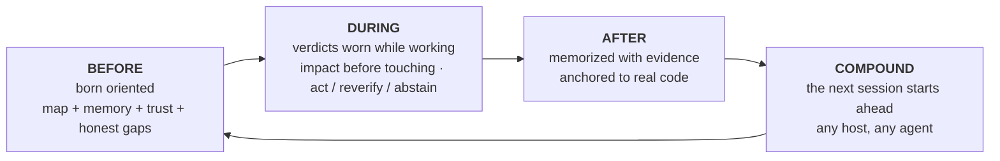

🇬🇧 [English](../README.md) | 🇧🇷 [Português](README.pt-BR.md) | 🇪🇸 [Español](README.es.md) | 🇮🇹 [Italiano](README.it.md) | 🇫🇷 [Français](README.fr.md) | 🇩🇪 [Deutsch](README.de.md) | 🇨🇳 [中文](README.zh.md) | 🇯🇵 [日本語](README.ja.md)

<p align="center">
  
</p>

**m1nd** fornisce al tuo coding agent un brain per repository: un grafo locale del codice servito su MCP, memoria ancorata al codice che cita, e un verdetto di fiducia su ogni risposta. "Prove insufficienti" è una risposta valida qui. Così come "non fidarti ancora di questa risposta, e questo è il modo per correggerla".

Nulla lascia la tua macchina. Un unico file binario in Rust. MIT.

Pensalo come una radiografia del tuo repo leggibile dal tuo agent: una struttura unica che combina tutto e dice dove vive ogni cosa, a cosa serve quel programma, su cosa si sta lavorando, cosa è completato e cosa è ancora aperto. Quel panorama è ciò che nessun altro strumento offre al tuo agent.

<p align="center">
  <a href="https://www.npmjs.com/package/@maxkle1nz/m1nd"></a>
  <a href="https://crates.io/crates/m1nd-mcp"></a>
  <a href="https://github.com/maxkle1nz/m1nd/actions"></a>
  <a href="LICENSE"></a>
  <a href="https://registry.modelcontextprotocol.io/?search=io.github.maxkle1nz/m1nd"></a>
</p>

<p align="center">Quattro comandi per installarlo: <a href="#sixty-seconds">Sixty seconds</a>. Motivi per chiudere prima la scheda: <a href="#when-not-to-use-m1nd">When not to use m1nd</a>.</p>

<p align="center">
  
</p>

<p align="center"><em>Una sessione reale sul grafo da 6.453 nodi di questo repo (m1nd-mcp 1.4.0): <code>north</code> orienta, <code>seek</code> risponde con un verdetto <code>reverify</code>, <code>memorize</code> ancora la scoperta al codice.</em></p>

## L'audit per cui il tuo agent smette di pagare

Conosci il rituale. L'agent apre un file, cerca, apre un altro file, cerca di nuovo, brucia la maggior parte del contesto per ricostruire cosa sia il repo e solo allora inizia il compito vero e proprio. Con m1nd quella scansione diventa una sola domanda. In meno di un secondo, l'agent ha la mappa: cosa chiama cosa, cosa rompe cosa, dove vive ogni cosa. Non più un mucchio di corrispondenze da interpretare. La struttura connessa, già assemblata.

E ricorda. Tra sessioni e tra agenti. Ciò che un agent apprende stasera, un altro lo eredita domani, con le prove allegate e una segnalazione se il codice è cambiato. Ogni conclusione lascia una traccia, così tu o qualsiasi agent che lavora successivamente potrete sempre vedere cosa è accaduto a quel codice e perché.

Poi l1ght porta tutto a un livello successivo: articoli, bozze e appunti si collegano alle parti del tuo codice che spiegano, all'interno della stessa struttura. L'agent ottiene il contesto GIUSTO anziché quello dal suono più simile, e inventare codice che non esiste smette di essere il percorso di minor resistenza: la struttura dice cosa esiste, e il verdetto dice quanto fidarsi anche di quello.

Prima di m1nd, una funzione era solo una funzione, persa in qualche manuale. Ora vive all'interno dell'intelligenza dell'agent, combinata con il codice, la sua storia, i suoi documenti e i suoi rischi. Non ho trovato niente di simile da nessun'altra parte.

## grep risponde a buone domande. m1nd risponde a quelle più profonde.

Domande a cui il tuo agent ora può rispondere in modo strutturale:

- Cosa si rompe se tocco questa funzione?
- Dove avviene realmente il refresh del token in questo repo?
- Perché questi due file sono connessi? Questo collegamento è solido o incerto?
- Cosa ha imparato l'ultima sessione su questo codice ed è ancora vero?
- Cosa cambia sempre insieme qui, anche senza un'importazione tra di loro?
- Questa modifica supera un confine architettonico che non dovrei oltrepassare?
- Quale affermazione in questo articolo implementa questa funzione?
- Il bug che ho appena corretto è nascosto altrove, in una forma simile?
- Cosa manca qui che di solito ha questo pattern?
- Sono anche nel repo giusto?
- Dovrei agire su questa risposta o verificarla prima?

Ognuna è un verbo sulla superficie MCP (`impact`, `seek`, `why`, `north`, `ghost_edges`, `xray_gate`, `antibody_scan`, `missing`, `trust_selftest`, `predict`), non un trucco di prompt.

## E non si limita a mostrare la struttura

Anticorpi: un bug risolto diventa un pattern strutturale nominato e ogni sessione successiva cerca quella forma in tutto il repo. Correggilo una volta, rincorrilo per sempre.

Edge fantasma: file che cambiano sempre insieme senza un'importazione tra di loro, estratti dalla tua cronologia git. L'accoppiamento invisibile che rompe i refactor.

Buchi strutturali: `missing` cerca il codice che manca. La protezione, il retry, il timeout che questo pattern di solito porta e che qui manca.

Ipotesi contro il grafo: formula un'affermazione in linguaggio naturale ("le impostazioni possono raggiungere il bootstrap senza validazione") e falla testare contro la struttura viva.

Tremore: file la cui velocità di modifica è in accelerazione vengono segnalati prima che qualcuno presenti una segnalazione di bug.

Un grafo caldo: i risultati confermati rinforzano i loro edge, stile Hebbian, così i percorsi che si sono dimostrati utili ottengono un ranking più alto per l'agent successivo.

Ciascuna di queste funzionalità segnala e suggerisce; il tuo compilatore e i test fanno comunque le verifiche.

## m1nd non si limita a cercare. Scrive.

Ecco la parte che le persone faticano a credere. Il grafo che legge il tuo repo può anche operare su di esso. Il tuo agent nomina un simbolo e una destinazione, circa 48 token, e `transplant` calcola l'intero spostamento dal grafo: la regione allargata (i commenti nelle documentazioni e gli attributi vengono trasferiti), le dipendenze classificate dai loro edge di chiamata (quelle private vengono trasferite, quelle condivise rimangono e ottengono un back-import), ogni riferimento riformattato nei file che lo nominano. Poi scrive in modo atomico, rilegge e restituisce una ricevuta onesta: cosa è stato spostato, cosa è rimasto, cosa non è riuscito a elaborare. `refs_unresolved` non è mai puramente vuoto quando qualcosa è andato storto.

È a due fasi, `transplant_preview` prima di `transplant_commit`, e la commit ricalcola l'hash di ogni file che aveva pianificato di toccare, in modo che nulla venga scritto su un repo che è cambiato nel frattempo. La zona nevralgica del tuo repo (backend, schema, pagamenti, CI) è protetta lato server e fallisce con un blocco. Un rifiuto non tocca mai un byte e insegna cosa fare per riprovare: una collisione segnala l'occupante, un percorso di modulo non valido si segnala da sé, uno spostamento tra crate segnala entrambe le radici dei crate.

Misurato in situazioni reali: una modifica dell'intero file è costata 12.235 token in uscita; il trapianto è costato 48 token di input e ha scritto 3 file in 1.3 secondi, con il crate compilato dall'altra parte. rust-analyzer ha un problema aperto per spostamenti cross-file dal 2019.

Limiti della v1, dichiarati chiaramente: solo Rust, solo `fn` top-level, stesso crate, il file di destinazione deve già esistere, e i riferimenti nati all'interno di macro sono invisibili. Ogni limite è deliberato e documentato in [docs/TRANSPLANT-PRD.md](../docs/TRANSPLANT-PRD.md), accanto a 13 file di test che validano il verbo.

## E quando ci sono più agent invece che uno solo?

Esegui più agent nello stesso repo e il grafo diventa il luogo in cui si coordinano. Ogni sessione si registra come presenza, e quando due di loro stanno per lavorare su attività sovrapposte, entrambi vengono avvertiti nel loro prossimo pacchetto di orientamento, prima che uno dei due esegua una modifica. Il sistema avvisa, decidi tu.

Il lavoro vincolato viene eseguito come "missioni", e le missioni si autodichiarano in un modo che la maggior parte dei team umani trascura: ogni strumento della missione riporta `non_claims`, l'elenco di ciò che NON è stato dimostrato. Un'affermazione non può chiudersi solo con le prove del grafo. È necessario leggere un file, eseguire un test o effettuare un controllo runtime, e il test che garantisce questo si chiama `graph_only_evidence_is_not_enough`.

E i binari di sicurezza non danno falsi allarmi. `xray_gate` può dire `blocked` solo da un manifesto di confine ratificato da un umano. Tutto il resto arriva come avvertimento con una motivazione, così l'agent non impara mai a ignorare la propria guida di sicurezza.

Ogni brain ha anche una mailbox. Un agent che trova un vero difetto al di fuori della propria missione non lo risolve sul momento né lo ignora: lascia una lettera nella mailbox di quel repo, su disco, accanto al codice. Il prossimo agent che lavora su quel brain spazza via la mailbox e inizia già sapendo i difetti trovati da altri agent, allegando il contesto. La conoscenza di ciò che è rotto smette di morire nello scorrere della chat. Il processo di lettura è un gesto deliberato (CLI o REST, mai nel ciclo di query), così le lettere informano il lavoro invece di interromperlo.

## Nativo per gli agent

Nessun account, nessuna telemetria e nessuna API che impedisca il funzionamento, per questo il grafo risponde in pochi microsecondi.

Anche lo sviluppo di m1nd è piuttosto inusuale. Costruirlo ha significato sviluppare un intero flusso di lavoro dove gli agent dirigono, verificano e dimostrano il lavoro, e la logica del prodotto è focalizzata sui problemi degli agent piuttosto che sull'interfaccia per l'umano. Quando m1nd si comporta in modo inaspettato sul campo, gli agent che lo usano presentano la segnalazione, e un bug confermato diventa un test rosso prima che la correzione venga implementata. Molti pochi programmi iniziano con questo principio nel design iniziale. Così m1nd nasce diverso: i verbi, i rifiuti e i pacchetti sono progettati per il lettore che li utilizzerà realmente, e non devi nemmeno ricordare al modello che lo strumento esiste. `m1nd hosts apply` installa gli hook di sessione (`SessionStart`, `agentSpawn`, `TaskStart`, per host) che iniettano l'orientamento al momento dell'esecuzione: il tuo agent, e ogni subagent che genera, parte già orientato prima che qualcuno digiti una parola.

Un brain per repository lo tiene insieme: un singolo grafo, la sua memoria, la sua persistenza, legata a una radice di repository. Un proprietario servito ospita molti brain e instrada ogni sessione verso quello corretto; una sessione da un repo che non ospita riceve un rifiuto tipizzato invece che risposte errate.

## Cosa ottiene il tuo agent

m1nd circonda tutto il ciclo del tuo agent con un grafo del tuo repo che sopravvive alla sessione:



La porta d'ingresso è una chiamata. `north(task)` restituisce l'intero orientamento in un singolo pacchetto, prima di qualsiasi recupero:

```jsonc
{"method":"tools/call","params":{"name":"north",
  "arguments":{"agent_id":"dev","task":"harden the JWT auth token validation flow"}}}
```

```jsonc
{
  "binding": { "trust_mode": "full_trust", "ok": true },      // verdetto prima del recupero
  "memory": [                                                 // richiamato da una sessione PRECEDENTE
    { "claim": "AuthTokenFlow", "source_agent": "authbot", "age_ms": 221, "stale": false }
  ],
  "sufficiency": { "state": "gathering", "top_score": 0.64 },
  "next_move": "Call `surgical_context` on the top focus node before editing.",
  "honest_gaps": []                                           // nulla omesso su questo grafo
}
```

Mentre l'agent lavora, `impact` mostra il raggio d'azione prima di applicare una modifica, `why` spiega una connessione e ammette quando il percorso si basa su un'ipotesi, e `xray_gate` avvisa prima che una modifica attraversi un confine architettonico. Quando il lavoro è completato, `memorize` annota la conclusione insieme alle prove che la supportano. La sessione successiva parte avendo già a disposizione le conclusioni dell'ultima sessione, su qualsiasi host MCP: Claude Code, Codex, Cursor, Gemini, Zed, 22 host in totale.

Non usi mai nessuno di questi verbi direttamente. Lo fa l'agent. La tua interfaccia è una piccola CLI iniziale, e poi continui a dialogare con il tuo agent come hai sempre fatto.

## Sessanta secondi

Il pacchetto npm è l'installer. Il runtime nativo è un file binario Rust separato che il primo step scarica come release firmata.

```bash
# 1 · installa il runtime nativo (firmato, verificato, con rollback)
npx -y @maxkle1nz/m1nd update apply --yes

# 2 · conferma che sia visibile (stampa un verdetto in JSON; "status": "ok" è un esito positivo)
npx -y @maxkle1nz/m1nd doctor

# 3 · configura il tuo host: configurazione MCP + gli hook che rendono m1nd onnipresente
npx -y @maxkle1nz/m1nd hosts apply --host claude --project . --yes

# 4 · primo valore: il pacchetto di orientamento per il TUO repo, solo in lettura, nessuna configurazione host alterata
npx -y @maxkle1nz/m1nd agent first-minute --repo . --query "map this repo" --json
```

Lo step 1 verifica la firma con [`cosign`](https://docs.sigstore.dev/cosign/system_config/installation/), quindi installalo prima, se non è nel tuo PATH. Se preferisci il registro sorgente e accetti di saltare la verifica, puoi usare anche `cargo install m1nd-mcp`. Vuoi vedere prima di scrivere: `hosts plan` stampa tutto ciò che `hosts apply` modificherebbe, senza apportare modifiche. Al momento non esiste un comando di rimozione; `hosts plan` funge anche da elenco di ciò che rimuovere manualmente.

Gli hook dello step 3 sono ciò che rendono m1nd onnipresente: il pacchetto di orientamento viene iniettato in ogni sessione e subagent generato, e da lì l'agent lavora in autonomia. Stai installando da un agent invece che da un terminale? Esiste una versione leggibile da macchine di questa sezione in [`llms-install.md`](../llms-install.md).

Un file binario rilasciato manomesso o troncato non può essere installato sulla tua macchina, e un aggiornamento danneggiato è a un rollback di distanza: l'aggiornamento controlla la firma rispetto all'identità esatta della build, poi lo SHA-256 e la dimensione prima di modificare qualsiasi cosa. Se la verifica fallisce, si rifiuta di procedere piuttosto che ricorrere a un percorso non verificato. Dettagli in [docs/AGENT-PACKS.md](../docs/AGENT-PACKS.md).
  
## Se scompaio

m1nd ha una licenza MIT e non c'è server da perdere. Il runtime è un unico file binario Rust già presente sul tuo disco. La memoria che scrive è semplice markdown sotto `agent-memory/`, leggibile e cercabile con grep anche senza il programma installato. Il grafo è derivato dal tuo codice e può essere ricostruito da zero su qualsiasi macchina. Se questo progetto terminasse domani, conserveresti i file e perderesti solo lo strumento. Questo è intenzionale. Ecco perché la memoria è in markdown e non c'è cloud tra il tuo agent e la sua conoscenza.

...

(Il resto del testo continuerebbe seguendo le linee guida precedenti).
