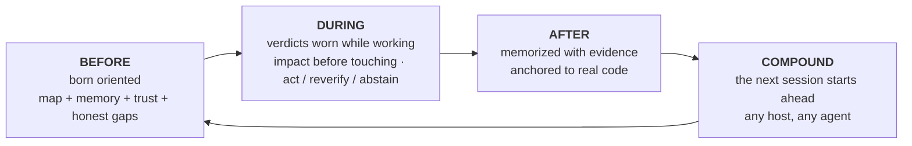

```markdown
<p align="center">
  
</p>

**m1nd** dà al tuo agente di coding un cervello per repository: un grafo di codice locale servito tramite MCP, una memoria ancorata al codice che cita, e un verdetto di fiducia su ogni risposta. "Prove insufficienti" è una risposta reale qui. Così come "non fidarti ancora, e ecco come ripararlo".

Nulla lascia la tua macchina. Un binario Rust. Licenza MIT.

Pensalo come una radiografia del tuo repository che il tuo agente può leggere: una struttura unica che combina tutto e dice dove si trova ogni cosa, a cosa serve quel programma, su cosa si sta lavorando, cosa è completato e cosa è ancora aperto. Questo panorama è ciò che nessun altro strumento offre al tuo agente.

<p align="center">
  <a href="https://www.npmjs.com/package/@maxkle1nz/m1nd"></a>
  <a href="https://crates.io/crates/m1nd-mcp"></a>
  <a href="https://github.com/maxkle1nz/m1nd/actions"></a>
  <a href="LICENSE"></a>
  <a href="https://registry.modelcontextprotocol.io/?search=io.github.maxkle1nz/m1nd"></a>
</p>

<p align="center">Quattro comandi per l'installazione: <a href="#sixty-seconds">Sessanta secondi</a>. Motivi per chiudere questa tab: <a href="#when-not-to-use-m1nd">Quando non usare m1nd</a>.</p>

<p align="center">
  
</p>

<p align="center"><em>Una sessione reale sul grafo di 6.453 nodi di questo repository (m1nd-mcp 1.4.0): <code>north</code> orienta, <code>seek</code> risponde con un verdetto <code>reverify</code>, <code>memorize</code> ancora la scoperta al codice.</em></p>

## L’audit che il tuo agente smetterà di pagare

Conosci il rituale. L'agente apre un file, cerca con grep, apre un altro file, cerca di nuovo, brucia la maggior parte del proprio contesto ricostruendo cosa sia il repository e solo dopo inizia il compito reale. Con m1nd quella scansione diventa una sola domanda. In meno di un secondo l'agente ha la mappa: cosa chiama cosa, cosa rompe cosa, dove si trova tutto. Non un mucchio di corrispondenze da interpretare. La struttura connessa, già assemblata.

E lo ricorda. Tra sessioni, e tra agenti. Ciò che un agente impara stasera, un altro agente lo eredita domani, con le prove allegate e una bandiera che segnala se il codice è cambiato nel frattempo. Ogni conclusione lascia una traccia, così tu, o qualsiasi agente che arriva dopo, potete sempre vedere cosa è successo a quel codice e perché.

Poi l1ght lo porta oltre: documenti, articoli, RFC, bozze e note si collegano alle parti del tuo codice che spiegano, all'interno della stessa struttura. L'agente ottiene il contesto GIUSTO invece di quello più vicino per suono, e inventare codice che non esiste smette di essere il percorso di minor resistenza: la struttura dice cosa esiste, e il verdetto dice quanto fidarsi anche di quello.

Prima di m1nd, una funzione era solo una funzione, persa in qualche documento manuale. Ora vive all'interno dell'intelligenza dell'agente, combinata con il codice, la sua storia, i suoi documenti e i suoi rischi. Non ho trovato nulla di simile altrove.

## grep risponde a buone domande. m1nd risponde alle domande più profonde.

Domande che il tuo agente può ora porre e ottenere una risposta strutturale:

- Cosa si rompe se tocco questa funzione?
- Dove avviene effettivamente il refresh del token in questo repository?
- Perché questi due file sono collegati, e quel percorso è solido o un’ipotesi?
- Cosa ha appreso l'ultima sessione su questo codice, e ciò è ancora valido?
- Cosa cambia sempre insieme qui, anche senza un'importazione tra loro?
- Questa modifica supera un confine architetturale che non dovrei superare?
- Quale affermazione in questo documento questa funzione implementa?
- Il bug che ho appena risolto si nasconde da qualche altra parte, come struttura?
- Cosa manca qui che normalmente ha questo pattern?
- Sono nel repository giusto?
- Dovrei agire su questa risposta o verificarla prima?

Ognuna di esse è un verbo sulla superficie MCP (`impact`, `seek`, `why`, `north`, `ghost_edges`, `xray_gate`, `antibody_scan`, `missing`, `trust_selftest`, `predict`), non un trucco di prompt.

## E non si limita a mostrare la struttura

Anticorpi: un bug corretto diventa un pattern strutturale nominato, e ogni sessione successiva esegue una scansione per quella forma in tutto il repository. Risolvi una volta, caccia per sempre.

Connessioni fantasma: file che cambiano sempre insieme senza un'importazione tra di loro, estratti dalla tua cronologia git. L'accoppiamento invisibile che rompe i refactor.

Buchi strutturali: `missing` cerca il codice che non c'è. La guardia, il retry, il timeout che questo pattern solitamente porta con sé e che questa istanza manca.

Ipotesi contro il grafo: afferma un concetto in linguaggio naturale ("le impostazioni possono raggiungere l'avvio senza convalida") e fallo testare contro la struttura attiva.

Tremore: i file la cui velocità di cambiamento sta accelerando vengono contrassegnati prima che qualcuno segnali il problema.

Un grafo caldo: i risultati confermati rinforzano i loro collegamenti, in stile hebbiano, quindi i percorsi che si sono dimostrati utili si classificano più in alto per il prossimo agente.

Ognuna di queste segnala e suggerisce; il tuo compilatore e i tuoi test fanno ancora la prova.

## m1nd non si limita a cercare. Scrive.

Ecco la parte che le persone impiegano un secondo a credere. Il grafo che legge il tuo repository può anche operare su di esso. Il tuo agente nomina un simbolo e una destinazione, circa 48 token, e `transplant` calcola l'intero spostamento dal grafo: l'area estesa (i commenti della documentazione e gli attributi viaggiano insieme), le dipendenze classificate dai loro collegamenti di chiamata (quelle private viaggiano, quelle condivise rimangono e ottengono un'importazione retroattiva), ogni riferimento ricalibrato in tutti i file che lo menzionano. Poi scrive in modo atomico, rielabora e restituisce una ricevuta onesta: cosa si è mosso, cosa è rimasto, cosa non è riuscito a risolvere. `refs_unresolved` non è mai vuoto in silenzio quando qualcosa è andato storto.

È a due fasi, `transplant_preview` prima di `transplant_commit`, e il commit ri-convalida l'hash di ogni file che aveva pianificato di toccare, quindi nulla arriva su un repository cambiato sotto di esso. L'area cruciale del tuo repository (backend, schema, pagamenti, CI) è protetta lato server e si interrompe in modo bloccato. Un rifiuto non tocca mai un byte e insegna il retry: una collisione nomina l'occupante, un percorso di modulo non valido nomina se stesso, uno spostamento inter-crate nomina entrambe le radici dei crate.

Misurato nel caso reale: l'intero costo di modifica del file è stato di 12.235 token di output; il trapianto ha costato 48 in ingresso e ha scritto 3 file in 1,3 secondi, con il crate compilato dall'altra parte. rust-analyzer ha avuto un problema aperto che richiede spostamenti interfile dal 2019.

Confini della versione 1, dichiarati chiaramente: solo Rust, solo `fn` a livello superiore, stesso crate, il file di destinazione deve già esistere, e i riferimenti nati all'interno di macro sono invisibili a esso. Ogni confine è deliberato e documentato in [docs/TRANSPLANT-PRD.md](docs/TRANSPLANT-PRD.md), accanto a 13 file di test che lo verificano.

## E quando non è un agente ma cinque?

Esegui più agenti sullo stesso repository e il grafo diventa il luogo in cui si coordinano. Ogni sessione si registra come una presenza, e quando due di esse stanno per toccare lavori sovrapposti, entrambe vengono avvisate nel loro prossimo pacchetto di orientamento, prima che una delle due effettui una modifica. Il sistema avvisa; tu decidi.

Lavori limitati vengono eseguiti come missioni, e le missioni rispondono da sole in un modo che la maggior parte dei team umani sorvola: ogni strumento della missione riporta `non_claims`, l'elenco di ciò che NON è stato dimostrato. Un'affermazione non può chiudersi solo con prove del grafo. Serve una lettura del file, un test o una sonda runtime, e il test che lo impone si chiama `graph_only_evidence_is_not_enough`.

E le barriere di sicurezza non gridano al lupo. `xray_gate` può dire `blocked` solo da un manifest di confine ratificato da un umano. Tutto il resto arriva come un avviso con una motivazione, così l'agente non impara mai a ignorare il proprio corrimano.

Ogni cervello ha anche una casella postale. Un agente che trova un vero difetto al di fuori della propria missione non lo corregge sul posto e non lo ignora: lascia una lettera nella casella di quel repository, su disco, accanto al codice. Il prossimo agente che lavora su quel cervello esamina la casella e inizia già conoscendo i difetti trovati da altri agenti, con il contesto allegato. La conoscenza di ciò che è rotto smette di morire nello scorrimento della chat. L'esame è un gesto deliberato (CLI o REST, mai all'interno del ciclo di query), quindi le lettere informano il lavoro invece di interromperlo.

## Nato a misura di agente

Nessun account, nessuna telemetria e nessuna API a ostacolare, il che è anche il motivo per cui il grafo risponde in microsecondi.

Lo sviluppo di m1nd non è nemmeno molto normale. Costruirlo ha significato costruire un intero flusso di lavoro in cui gli agenti dirigono, verificano e dimostrano il lavoro, e la logica del prodotto è orientata al dolore dell'agente, non al dashboard dell'umano. Quando m1nd si comporta male sul campo, sono gli agenti che lo usano a segnalare il problema, e un bug confermato diventa un test rosso prima che venga applicata una correzione. Pochissimi programmi partono da questo presupposto nel loro progetto iniziale. Così m1nd nasce diverso: i verbi, i rifiuti e i pacchetti sono modellati per il lettore che li utilizza realmente, e non devi nemmeno ricordare al modello che lo strumento esiste. `m1nd hosts apply` installa hook per le sessioni (`SessionStart`, `agentSpawn`, `TaskStart`, per host) che iniettano l'orientamento al momento dello spawn: il tuo agente, e ogni subagente che lo spawn di conseguenza genera, inizia orientato prima che qualcuno digiti una parola.

Un cervello per repository tiene tutto insieme: un grafo, la sua memoria, la sua persistenza, legato a una radice del repository. Un host fornito ospita molti cervelli e indirizza ogni sessione al giusto; una sessione da un repository che non ospita riceve un rifiuto digitato invece di risposte errate.

## Cosa ottiene il tuo agente

m1nd avvolge l'intero ciclo dell'agente attorno a un grafo del tuo repository che sopravvive alla sessione:



La porta principale è una chiamata. `north(task)` restituisce l'intero orientamento in un unico pacchetto, prima di qualsiasi recupero:

```jsonc
{"method":"tools/call","params":{"name":"north",
  "arguments":{"agent_id":"dev","task":"harden the JWT auth token validation flow"}}}
```

```jsonc
{
  "binding": { "trust_mode": "full_trust", "ok": true },      // verdetto prima del recupero
  "memory": [                                                 // ricordi da una sessione PRECEDENTE
    { "claim": "AuthTokenFlow", "source_agent": "authbot", "age_ms": 221, "stale": false }
  ],
  "sufficiency": { "state": "gathering", "top_score": 0.64 },
  "next_move": "Call `surgical_context` on the top focus node before editing.",
  "honest_gaps": []                                           // nulla trattenuto su questo grafo
}
```

Mentre l'agente lavora, `impact` mostra il raggio d'azione prima che venga effettuata una modifica, `why` spiega una connessione e ammette quando il percorso si basa su un'ipotesi, e `xray_gate` avverte prima che una modifica superi un confine architetturale. Quando il lavoro è completato, `memorize` scrive la conclusione con le prove che la supportano. La prossima sessione inizia con le conclusioni della sessione precedente già disponibili, su qualsiasi host MCP: Claude Code, Codex, Cursor, Gemini, Zed, 22 host in totale.

Tu non usi mai direttamente nessuno di questi verbi. Lo fa l'agente. La tua superficie è un piccolo CLI di configurazione, dopodiché continui a interagire con il tuo agente come sempre.

## Sessanta secondi

Il pacchetto npm è l'installer. Il runtime nativo è un binario Rust separato che il primo passo scarica come rilascio firmato.

```bash
# 1 · Installa il runtime nativo (firmato, verificato, con rollback)
npx -y @maxkle1nz/m1nd update apply --yes

# 2 · Conferma che sia visibile (stampa un verdetto JSON; un buon risultato è "status": "ok")
npx -y @maxkle1nz/m1nd doctor

# 3 · Collega il tuo host: Config MCP + gli hook di sessione che rendono m1nd ambientale
npx -y @maxkle1nz/m1nd hosts apply --host claude --project . --yes

# 4 · Primo valore: il pacchetto di orientamento per IL TUO repository, sola lettura, nessuna configurazione host toccata
npx -y @maxkle1nz/m1nd agent first-minute --repo . --query "map this repo" --json
```

Il passaggio 1 verifica la firma con [`cosign`](https://docs.sigstore.dev/cosign/system_config/installation/), quindi installalo prima se non è nel tuo PATH. Se preferisci il registro sorgente e accetti di saltare la verifica, `cargo install m1nd-mcp` funziona anche. Vuoi vedere prima di scrivere: `hosts plan` stampa tutto ciò che `hosts apply` toccherebbe, senza scrivere nulla. Non c'è ancora un comando di disinstallazione; `hosts plan` funge anche da elenco di ciò che rimuovere a mano.

Gli hook del passaggio 3 sono ciò che rendono m1nd ambientale: il pacchetto di orientamento viene iniettato in ogni sessione e subagente spawnato, e l'agente si gestisce da solo da lì. Installazione da un agente anziché da un terminale? Esiste un gemello leggibile dalla macchina di questa sezione in [`llms-install.md`](llms-install.md).

Un rilascio manomesso o troncato non può arrivare sulla tua macchina, e un aggiornamento errato è a un passo dal rollback: l'updater controlla la firma rispetto all'identità esatta della build, poi lo SHA-256 e le dimensioni, prima di toccare qualsiasi cosa. Se la verifica fallisce, rifiuta invece di ricorrere a un percorso non verificato. Dettagli in [docs/AGENT-PACKS.md](docs/AGENT-PACKS.md).

## Se dovessi scomparire

m1nd è MIT e non c'è un server da perdere. Il runtime è un binario Rust già presente sul tuo disco. La memoria che scrive è markdown semplice sotto `agent-memory/`, leggibile e ricercabile anche senza m1nd installato. Il grafo è derivato dal tuo codice e si ricostruisce da zero su qualsiasi macchina. Se questo progetto si fermasse domani, conserveresti i file e perderesti uno strumento. Questo è deliberato. Ecco perché la memoria è in markdown e perché non esiste un cloud tra il tuo agente e la sua conoscenza.

## Perché fidarsi delle risposte

Ecco perché ho costruito m1nd. I livelli di recupero sono bravi a rispondere. Quasi nessuno di essi è bravo a rifiutare. m1nd considera il rifiuto come un risultato di primo livello:

```jsonc
// trust_selftest su un runtime non vincolato. Il verdetto È l'istruzione di riparazione:
{
  "ok": false,
  "verdict": "needs_ingest",          // mai un semplice "no results"
  "next_action": "call_ingest",
  "recovery_playbook": {
    "steps": [ { "action": "Call ingest for the intended repository on this same binding." } ]
  }
}
```

Un hit di `seek` porta con sé una lettura della sufficienza e un involucro di fiducia. Quando non è stata ancora misurata alcuna calibrazione, l'involucro limita il proprio verdetto a `reverify` invece di sovrastimare. La soglia di `predict` è regolata per copertura (α=0,10); sulla cronologia di questo repository si attesta a circa un terzo di precisione nella banda `act`, e la maggior parte delle volte si astiene, che è il risultato onesto di un segnale debole. `abstain` dice all'agente di fermarsi. `insufficient_evidence` significa nessuna prova del tutto, il che è diverso da un rischio medio, e l'API tiene separati i due concetti.

Due strumenti, `savings` e `resonate`, sono stati completamente eliminati nella beta (handler, tipi e file di stato, tutto rimosso) perché restituivano un risultato positivo su ogni input che gli ho dato, e uno strumento che non perde mai ha smesso di misurare. Questo è il livello a cui viene valutata ogni affermazione in questo file.

Il vicino più simile che conosco è GitHub Copilot Memory (preview pubblico, 2026): memorizza fatti con citazioni di codice e li ricontrolla rispetto al ramo corrente prima dell'uso. Questa è una vera rilevazione di stantio, e merita il merito. Tuttavia, è lato cloud, binario e vive all'interno di Copilot. Ciò che non ho ancora trovato da nessuna parte è il resto del verdetto: un graduato `act` / `reverify` / `abstain` con calibrazione per repository, rifiuti digitati con un piano di riparazione, su un grafo locale che qualsiasi agente MCP può condividere. Ho controllato i documenti pubblici di Mem0, Zep, Letta, Cognee, Supermemory e Copilot Memory, a partire da luglio 2026. Conosci uno strumento più vicino? Apri una segnalazione e lo collegherò qui.

...(continua)
```
