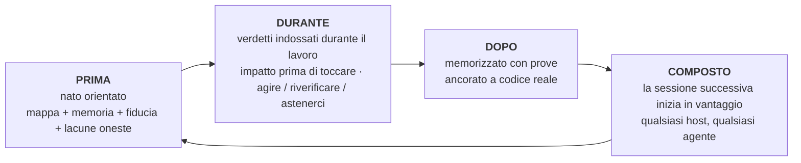

```markdown
<p align="center">
  
</p>

**m1nd** dona al tuo agente di programmazione un cervello per repository: un grafico locale del codice servito tramite MCP, una memoria ancorata al codice a cui fa riferimento e un verdetto di affidabilità su ogni risposta. "Prove insufficienti" è una risposta reale qui. Così come "non fidarti ancora, ecco come sistemarlo".

Niente lascia la tua macchina. Un unico binario Rust. MIT.

Pensalo come una radiografia del tuo repository che il tuo agente può leggere: una struttura che combina tutto e dice dove vive ogni elemento, qual è lo scopo di ciascun programma, su cosa si sta lavorando, cosa è già stato completato e cosa è ancora in sospeso. Quel panorama è ciò che nessun altro strumento fornisce al tuo agente.

<p align="center">
  <a href="https://www.npmjs.com/package/@maxkle1nz/m1nd"></a>
  <a href="https://crates.io/crates/m1nd-mcp"></a>
  <a href="https://github.com/maxkle1nz/m1nd/actions"></a>
  <a href="LICENSE"></a>
  <a href="https://registry.modelcontextprotocol.io/?search=io.github.maxkle1nz/m1nd"></a>
</p>

<p align="center">Quattro comandi per installare: <a href="#sixty-seconds">Sixty seconds</a>. Ragioni per chiudere questa scheda prima: <a href="#when-not-to-use-m1nd">When not to use m1nd</a>.</p>

<p align="center">
  
</p>

<p align="center"><em>Una sessione reale sul grafico di questo repository da 6.453 nodi (m1nd-mcp 1.4.0): <code>north</code> orienta, <code>seek</code> risponde con un verdetto <code>reverify</code>, <code>memorize</code> ancora le scoperte al codice.</em></p>

## L'audit che il tuo agente smette di pagare

Conosci il rituale. L'agente apre un file, usa grep, apre un altro file, usa grep di nuovo, consuma la maggior parte del contesto ricostruendo cosa sia effettivamente il repository, e solo allora inizia il vero compito. Con m1nd quella scansione diventa una sola domanda. In meno di un secondo l'agente ha la mappa: chi chiama chi, chi rompe cosa, dove vive tutto. Non un mucchio di corrispondenze da interpretare. La struttura connessa, già assemblata.

E ricorda. Tra sessioni e tra agenti. Quello che un agente impara stanotte, un altro agente eredita domani, con le prove allegate e una bandierina se il codice è cambiato nel frattempo. Ogni conclusione lascia una traccia, così tu, o qualsiasi agente che arriverà dopo, potrai sempre vedere cosa è successo a quel codice e perché.

Poi l1ght va oltre: documenti, articoli, RFC, bozze e appunti si connettono alle parti del tuo codice che spiegano, all'interno della stessa struttura. L'agente ottiene il contesto GIUSTO invece di quello che sembra più vicino, e inventare codice che non esiste smette di essere la via di minor resistenza: la struttura dice cosa esiste, e il verdetto dice quanto fidarsi anche di questo.

Prima di m1nd, una funzione era solo una funzione, persa in qualche manuale. Ora vive all'interno dell'intelligenza dell'agente, combinata con il codice, la sua storia, i suoi documenti e i suoi rischi. Non ho trovato nulla di simile altrove.

## grep risponde a buone domande. m1nd risponde a quelle più profonde.

Domande che il tuo agente può ora fare e ottenere risposte strutturali:

- Cosa si rompe se tocco questa funzione?
- Dove avviene effettivamente il refresh del token in questo repository?
- Perché questi due file sono connessi, e quel percorso è solido o solo un'ipotesi?
- Cosa ha appreso l'ultima sessione su questo codice, ed è ancora vero?
- Cosa cambia sempre insieme qui, anche senza import espliciti tra loro?
- Questa modifica supera un confine architetturale che non dovrei oltrepassare?
- Quale affermazione in questo documento implementa questa funzione?
- Il bug che ho appena risolto si nasconde in altre parti come forma?
- Cosa manca qui che di solito questo pattern include?
- Sono nel repository giusto?
- Dovrei agire su questa risposta o verificarla prima?

Ognuna di queste è un verbo sulla superficie MCP (`impact`, `seek`, `why`, `north`, `ghost_edges`, `xray_gate`, `antibody_scan`, `missing`, `trust_selftest`, `predict`), non un trucco di prompt.

## E non si limita a mostrare la struttura

Anticorpi: un bug risolto diventa un pattern strutturale nominato, e ogni sessione successiva scansiona il repository alla ricerca di quella forma. Risolvilo una volta, scovalo per sempre.

Collegamenti fantasma: file che cambiano sempre insieme senza un import esplicito, derivati dalla tua cronologia git. L'accoppiamento invisibile che rompe i refactor.

Vuoti strutturali: `missing` cerca il codice che non c'è. La protezione, il retry, il timeout che di solito questo pattern contiene ma che manca in questa istanza.

Ipotesi contro il grafico: afferma un'ipotesi in linguaggio semplice ("le impostazioni possono raggiungere l'avvio senza convalida") e falla testare contro la struttura attuale.

Tremori: i file la cui velocità di cambiamento sta accelerando vengono segnalati prima che qualcuno segnali il problema.

Un grafico caldo: i risultati confermati rafforzano i loro collegamenti, stile Hebbiano, quindi i percorsi che si sono dimostrati utili hanno una priorità più alta per il prossimo agente.

Ciascuno di questi avvisi e suggerisce; il tuo compilatore e i tuoi test eseguono comunque la verifica.

## m1nd non si limita a cercare. Scrive.

Questo è il punto che la gente stenta a credere subito. Il grafico che legge il tuo repository può anche operare su di esso. Il tuo agente nomina un simbolo e una destinazione, circa 48 token, e `transplant` calcola l'intero spostamento dal grafico: la regione ampliata (i commenti di documentazione e gli attributi si muovono con lui), le dipendenze classificate dai loro collegamenti (quelle private si spostano, quelle condivise restano e guadagnano un back-import), ogni referente riqualificato in ogni file che lo nomina. Poi, scrive in modo atomico, reingestisce e restituisce un resoconto onesto: cosa è stato spostato, cosa è rimasto, cosa non poteva risolvere. `refs_unresolved` non è mai vuoto silenziosamente quando qualcosa è andato storto.

È a due fasi, `transplant_preview` prima di `transplant_commit`, e il commit ri-valida l'hash di ogni file che intendeva toccare, quindi nulla viene applicato a un repository che è cambiato nel frattempo. La zona di sicurezza del tuo repository (backend, schema, pagamenti, CI) è protetta lato server e fallisce in modo chiuso. Un rifiuto non tocca mai un byte e insegna il retry: una collisione nomina l'occupante, un percorso del modulo non valido si identifica, uno spostamento tra crate nomina entrambe le radici dei crate.

Misurato sul caso reale: l'edit dell'intero file costava 12.235 token in output; il trapianto costava 48 in ingresso e scriveva 3 file in 1,3 secondi, con il crate che compilava alla fine. rust-analyzer ha un problema aperto per gli spostamenti tra file dal 2019.

Confini della v1, dichiarati chiaramente: Solo Rust, solo `fn` di livello superiore, stesso crate, il file di destinazione deve esistere già e i riferimenti nati all'interno delle macro sono invisibili. Ogni confine è deliberato e descritto in [docs/TRANSPLANT-PRD.md](docs/TRANSPLANT-PRD.md), accanto a 13 file di test che confermano il verbo.

## E quando non è un agente, ma cinque?

Esegui diversi agenti sullo stesso repository e il grafico diventa il punto di coordinazione. Ogni sessione viene registrata come una presenza, e quando due di esse stanno per toccare lavoro sovrapponibile, entrambe vengono avvisate nel loro prossimo pacchetto di orientamento, prima che una delle due applichi una modifica. Il sistema avvisa; tu decidi.

I lavori delimitati vengono eseguiti come missioni, e le missioni rispondono in modo che la maggior parte dei team umani trascura: ogni strumento di missione riporta `non_claims`, l'elenco di ciò che NON è stato dimostrato. Una affermazione non può essere chiusa solo con le prove del grafico. Serve una lettura del file, un test o una verifica runtime, e il test che impone questo si chiama `graph_only_evidence_is_not_enough`.

E le guide di sicurezza non lanciano falsi allarmi. `xray_gate` può dire `blocked` solo da un manifesto del confine ratificato da un umano. Tutto il resto arriva come un avvertimento con una ragione, quindi l'agente non impara mai a ignorare il proprio corrimano di sicurezza.

Ogni cervello ha anche una cassetta delle lettere. Un agente che trova un difetto reale al di fuori della propria missione non lo corregge sul posto e non lo ignora: lascia una nota nella cassetta del repository, sul disco, accanto al codice. Il prossimo agente che lavora su quel cervello svuota la cassetta e inizia già conoscendo i difetti trovati da altri agenti, con il contesto allegato. La conoscenza di ciò che è rotto smette di perdersi nell'archivio della chat. Lo svuotamento è un gesto deliberato (CLI o REST, mai all'interno del ciclo delle query), quindi le note informano il lavoro invece di interromperlo.

## Nativo per gli agenti

Nessun account, nessuna telemetria e nessuna API d'ostacolo, il che è anche il motivo per cui il grafico risponde in microsecondi.

Anche lo sviluppo di m1nd non è molto normale. Costruirlo ha significato costruire un intero flusso di lavoro in cui gli agenti dirigono, verificano e dimostrano il lavoro, e la logica del prodotto è orientata al dolore dell'agente, non alla dashboard dell'umano. Quando m1nd si comporta male sul campo, gli agenti che lo utilizzano fanno il report, e un bug confermato diventa un test rosso prima che la correzione venga integrata. Pochi programmi partono con questa impostazione nel loro design iniziale. Quindi m1nd nasce diverso: i verbi, i rifiuti e i pacchetti sono modellati per il lettore che li usa effettivamente, e non devi nemmeno ricordare al modello che lo strumento esiste. `m1nd hosts apply` installa degli hook di sessione (`SessionStart`, `agentSpawn`, `TaskStart`, per host) che iniettano l'orientamento all'avvio: il tuo agente, e ogni subagente che avvia, parte orientato prima ancora che qualcuno inizi a digitare.

Un cervello per repository tiene tutto insieme: un grafico, la sua memoria, la sua persistenza, legati a una radice del repository. Un host servito ospita molti cervelli e indirizza ogni sessione nel posto giusto; una sessione da un repository che non ospita ottiene un rifiuto esplicito invece di risposte errate.

## Cosa ottiene il tuo agente

m1nd avvolge l'intero ciclo dell'agente attorno a un grafico del tuo repository che sopravvive alla sessione:



La porta principale è una sola chiamata. `north(task)` restituisce l'intera orientazione in un unico pacchetto, prima di qualsiasi recupero:

```jsonc
{"method":"tools/call","params":{"name":"north",
  "arguments":{"agent_id":"dev","task":"rafforza il flusso di convalida del token di autenticazione JWT"}}}
```

```jsonc
{
  "binding": { "trust_mode": "full_trust", "ok": true },      // verdetto prima del recupero
  "memory": [                                                 // ricordato da una sessione PRECEDENTE
    { "claim": "AuthTokenFlow", "source_agent": "authbot", "age_ms": 221, "stale": false }
  ],
  "sufficiency": { "state": "gathering", "top_score": 0.64 },
  "next_move": "Call `surgical_context` on the top focus node before editing.",
  "honest_gaps": []                                           // nulla trattenuto su questo grafico
}
```

Mentre l'agente lavora, `impact` mostra il raggio d'azione prima che atterri una modifica, `why` spiega una connessione e ammette quando il percorso si basa su un'ipotesi e `xray_gate` avvisa prima che una modifica attraversi un confine architetturale. Quando il lavoro è concluso, `memorize` scrive le conclusioni con le prove che le supportano. La sessione successiva inizia con le conclusioni della sessione precedente già pronte, su qualsiasi host MCP: Claude Code, Codex, Cursor, Gemini, Zed, 22 host in totale.

Non eseguirai mai nessuno di questi verbi da solo. Lo farà l'agente. La tua interfaccia è una piccola CLI per la configurazione iniziale, dopodiché continuerai a parlare con il tuo agente come sempre.

## Sessanta secondi

Il pacchetto npm è l'installatore. Il runtime nativo è un binario separato in Rust che il primo passo scarica come versione firmata.

```bash
# 1 · installa il runtime nativo (firmato, verificato, con rollback)
npx -y @maxkle1nz/m1nd update apply --yes

# 2 · conferma che sia visibile (stampa un verdetto JSON; un valore buono è simile a "status": "ok")
npx -y @maxkle1nz/m1nd doctor

# 3 · configura il tuo host: configurazione MCP + gli hook di sessione che rendono m1nd ambient
npx -y @maxkle1nz/m1nd hosts apply --host claude --project . --yes

# 4 · primo valore: il pacchetto di orientamento per IL TUO repository, sola lettura, nessuna configurazione host toccata
npx -y @maxkle1nz/m1nd agent first-minute --repo . --query "mappa questo repo" --json
```

Il passo 1 verifica la firma con [`cosign`](https://docs.sigstore.dev/cosign/system_config/installation/), quindi installalo prima se non è già nella tua PATH. Se preferisci il registro sorgente e accetti di saltare la verifica, anche `cargo install m1nd-mcp` funziona. Preferisci vedere prima di scrivere: `hosts plan` stampa tutto quello che `hosts apply` toccherebbe, e non scrive nulla. Non c'è ancora un comando di disinstallazione; `hosts plan` funge anche da elenco di ciò che rimuovere manualmente.

Gli hook del passo 3 sono ciò che rendono m1nd ambient: il pacchetto di orientazione viene iniettato a ogni sessione e ogni avvio di subagente, e l'agente si guida da sé da qui in poi. Stai installando da un agente anziché da un terminale? Esiste un gemello leggibile dalla macchina di questa sezione in [`llms-install.md`](llms-install.md).

Una versione manomessa o troncata non può essere installata sulla tua macchina e un cattivo aggiornamento è a un solo rollback di distanza: l'aggiornamento verifica la firma contro l'identità esatta della build, quindi lo SHA-256 e la dimensione, prima di toccare qualsiasi cosa. Se la verifica fallisce, si rifiuta anziché ripiegare su un percorso non verificato. Maggiori dettagli in [docs/AGENT-PACKS.md](docs/AGENT-PACKS.md).

## Se sparisco

m1nd è MIT e non c'è nessun server che venga meno. Il runtime è un unico binario in Rust già sul tuo disco. La memoria che scrive è semplice markdown sotto `agent-memory/`, leggibile e consultabile con grep senza m1nd installato. Il grafico è derivato dal tuo codice e si ricostruisce da zero su qualsiasi macchina. Se questo progetto smette domani, ti restano i file e perdi lo strumento. Questo è intenzionale. È il motivo per cui la memoria è in markdown e per cui non c'è nessuna nuvola tra il tuo agente e il suo stesso sapere.

## Perché fidarsi delle risposte

Questo è il motivo per cui ho costruito m1nd. Gli strati di recupero sono bravi a rispondere. Quasi nessuno è bravo a rifiutare. m1nd tratta il rifiuto come un risultato di prima classe:

```jsonc
// trust_selftest su un runtime non legato. Il verdetto È l'istruzione per la riparazione:
{
  "ok": false,
  "verdict": "needs_ingest",          // mai un semplice "nessun risultato"
  "next_action": "call_ingest",
  "recovery_playbook": {
    "steps": [ { "action": "Chiamare ingest per il repository previsto su questo stesso binding." } ]
  }
}
```

Un colpo di `seek` porta una lettura di sufficienza e una busta di fiducia. Quando non è stata ancora misurata nessuna calibrazione, la busta limita il proprio verdetto a `reverify` invece di sovraaffermare. Il cancello di `predict` è sintonizzato per la copertura (α=0,10); sulla storia di questo repository ciò si traduce in una precisione di circa un terzo nella banda `act`, e la maggior parte delle volte si astiene, che è il risultato onesto di un segnale debole. `abstain` dice all'agente di fermarsi. `insufficient_evidence` significa nessuna prova del tutto, che è diverso dal rischio medio, e l'API mantiene i due separati.

Due strumenti, `savings` e `resonate`, sono stati cancellati del tutto in beta (gestori, tipi e file di stato, tutto sparito) perché restituiscono una vittoria su ogni input fornito, e uno strumento che non perde mai ha smesso di misurare. Questo è il metro di giudizio a cui ogni affermazione di questo file è sottoposta.

Il vicino più simile che conosco è GitHub Copilot Memory (anteprima pubblica, 2026): memorizza dati con citazioni di codice e li ricontrolla rispetto al branch corrente prima dell'uso. È una vera rilevazione della stanchezza, e merita credito. È anche lato cloud, binario e vive all'interno di Copilot. Quello che però ancora non ho trovato da nessuna parte è il resto del verdetto: un calibrato `act` / `reverify` / `abstain` con calibrazione per repository, rifiuti scritti con un piano di riparazione, su un grafico locale che qualsiasi agente MCP può utilizzare. Ho controllato la documentazione pubblica di Mem0, Zep, Letta, Cognee, Supermemory e Copilot Memory, a partire da luglio 2026. Conosci uno strumento più avanzato? Apri un'issue e lo linkerò qui.

## Memoria che sa quando è obsoleta

La maggior parte degli strati di memoria memorizza testo e spera. m1nd ancora la memoria al grafico. Quando un agente chiama `memorize`, il percorso di `evidence` di ogni affermazione viene risolto al nodo di codice reale, quindi la nota emerge ogni volta che l'agente tocca quel codice, senza che nessuno si ricordi che esiste:

```jsonc
memorize({
  "agent_id": "authbot",
  "node_label": "AuthTokenFlow",
  "claims": [{
    "label": "TokenValidator",
    "text": "TokenValidator valida i JWT tramite HMAC. Ruotare le chiavi solo tramite KMS.",
    "confidence": "alta", "evidence": ["src/auth/token.rs"]
  }]
})
```

Poiché la memoria è ancorata, può essere verificata rispetto alla realtà. `cross_verify` riactalizza ogni file citato e segnala quali dichiarazioni sono diventate obsolete perché il loro codice è cambiato. Le dichiarazioni portano l'età e l'autore, superano le dichiarazioni più vecchie e scadono nel tempo. Questo ciclo è dimostrato in diretta end-to-end in questo repository: memorizzare, ancorare, modificare il file citato, vedere la dichiarazione flaggarsi da sola, sopravvivere a un intero ricostruzione, caricamento automatico al prossimo avvio. Termina il processo, avvia un nuovo processo e il primo `north` porta già con sé le dichiarazioni della sessione precedente con la provenienza allegata.

## Un grafico per codice e conoscenza (l1ght)

l1ght è la seconda corsia dello stesso motore: i documenti diventano nodi grafici nello stesso spazio di attivazione del codice, quindi una query attraversa entrambi. Non è una cartella RAG installata separatamente. Ci sono 7.400 righe di adattatori dedicati in questo repository: Markdown, HTML, PDF, testo semplice, RST e JSON, oltre a percorsi accademici per BibTeX, DOI/Crossref, articoli JATS, RFC e brevetti.

Persone diverse ottengono prodotti diversi dalla stessa corsia:

- Un ricercatore lascia una cartella di PDF e DOI accanto al codice di analisi e chiede quale articolo contraddice l'affermazione che questa funzione implementa.
- Uno studente esplora un capitolo del libro di testo e il codice degli esercizi come un unico grafico, e l'agente spiega ciascuno in termini dell'altro.
- Un insegnante inserisce le note del corso una volta; l'agente di ogni studente risponde dallo stesso corpus radicato invece di improvvisare.
- Un ingegnere collega RFC e documenti di progettazione alle funzioni che implementano; la sezione della specifica si trova a un passo dal codice.
- Una persona creativa con una pila di estratti di chat e appunti sparsi smette di usare una cartella e trasforma tutto in memoria che l'agente può effettivamente consultare durante la modifica.

Stesso binario, stessi verbi MCP, stesso strato di fiducia. `seek` su un grafico misto restituisce codice e documenti in una risposta classificata.

## Quando non usare m1nd

Alcuni motivi onesti per chiudere questa scheda:

- Repository piccoli. Sotto qualche centinaio di file, grep è già economico e il margine del grafico si avvicina allo zero. Misurazioni indipendenti su strumenti grafici comparabili in un repository da circa 110 file hanno indicato un vantaggio del 20%. Concreto, ma non vale un runtime.
- Domande vaghe. Un grafo dei simboli risponde a "cosa è connesso a cosa". Non risponde a "perché questo sembra lento". La ricerca agentica è migliore per domande aperte e vaghe.
- Verità del compilatore e runtime. Il tuo LSP, i tuoi test e il tuo profiler sono corretti, m1nd sta tirando ad indovinare. m1nd indica; loro dimostrano.
- Compiti minuscoli. Un file e venti righe non richiedono un ingest. Evita inutile carico.
- `predict` si astiene nella maggior parte dei casi. Calibrato sulla storia di questo repository raggiunge circa un terzo di precisione nella banda `act` con bassa copertura. L'astensione è il risultato onesto di un segnale debole e attualmente rappresenta la maggior parte del risultato.

m1nd integra il compilatore, il runner di test e i tuoi strumenti di sicurezza. Non li sostituisce.

## Evidenza

Tutto quanto sopra è incluso nella versione corrente; i documenti sotto `docs/` contrassegnati PRD sono intenti di design, mantenuti separati. Ogni riga è vincolata esattamente a ciò che è stato misurato. m1nd non si basa su risparmi di token o ROI, e ciò è deliberato: questi sono i numeri meno verificabili in questa categoria.

| Dichiarazione | Risultato | Replica / riserva |
|---|---|---|
| Latenza del grafo | ~1.4µs `activate`, ~0.5µs `impact` su un grafo sintetico da 1K nodi | `cargo bench -p m1nd-core` su Apple silicon. Ordine di grandezza, dipendente dall'hardware. |
| Batteria di capacità rispetto a grep | 37/37 risultato positivo; test comparativo: 16 vittorie, 12 pareggi, 0 sconfitte vs grep | `python3 scratchpad/m1nd_battery.py ./target/release/m1nd-mcp . --suite m1nd`. Un repository, casi creati dall'autore. |
| Predict ottimizzato | circa un terzo di precisione nella banda `act` a bassa copertura (α=0.10) | Misurato sulla storia git di questo repository, n≈9,2k predizioni di testing. Sopprime molte risposte, per progettazione. |
| Autoverifica della memoria | Ciclo in 6 steps dimostrato vivo | memorizza → ancora → flag freschezza modificando un file → sopravvive al rimpiazzo → carico automatico alla riaccensione. |
| Persistenza tra riavvii e crash | il cancello dirige il binario reale via stdio per quattro avvii puliti, e un `kill -9` | `m1nd-mcp/tests/persist_runtime_root.rs`. Rimuovendo uno dei fix agli avvi, il test fallisce con un messaggio appropriato che nomina la regressione. |

## Un grafico, molti agenti

Per un singolo agente, il server stdio in [Sessanta secondi](#sixty-seconds) è tutto ciò di cui hai bisogno, e l'agente può chiamare `ingest` direttamente su un grafo vuoto. Per un lavoro reale, esegui un singolo proprietario servito che detiene il grafo vivo, e collega ogni agente a esso come un ponte sottile:

```bash
m1nd-mcp --serve --no-gui --port 1337 --runtime-dir /your/project/.m1nd
m1nd-mcp --attach auto --stdio     # ogni agente: nessun caricamento grafico, nessun lease, memoria condivisa
```

Ciò che un agente memorizza, un altro ricorda immediatamente, e le presenze e avvisi di collisione descritti sopra passano tutti attraverso questo stesso proprietario. Inoltre ospita cervelli per progetto e il rendering dell'interfaccia web. Le query restano su localhost; ogni binding non verso loopback è rifiutato finché un trasporto autenticato non è disponibile.

Un cancello da conoscere: un proprietario servito rifiuta genericamente `ingest` per repository che non ospita già. Creare un nuovo cervello su un proprietario servito è un gesto regolato, e fallisce chiuso per progettazione. Per una prima sessione su un nuovo repository, usa il percorso stdio o `m1nd agent first-minute`. Collega al proprietario una volta che ospita il tuo repository. Guida passo dopo passo: [docs/deployment.md](docs/deployment.md).

## Copertura linguistica

Gli estrattori dedicati coprono più di venti lingue, così un repository poliglotta non viene restituito mappato solo a metà: Python e TypeScript fino a Elixir, Haskell e Zig, instradati dall'estensione file in `m1nd-ingest`. La tabella sotto rappresenta la rivendicazione più restrittiva, provata end-to-end in una singola ingestione poliglotta: relazioni nelle chiamate, oltre a risoluzione inter-file per import.

| Lingua | `calls` | import inter-file |
|---|:---:|:---:|
| Rust | ✅ | ✅ |
| Python | ✅ | ✅ |
| JavaScript / TypeScript | ✅ | ✅ |
| Go | ✅ | ✅ |
| Java | ✅ | ✅ |
| C / C++ | ✅ | ✅ |
| Kotlin | ✅ | ✅ |
| PHP | ✅ | ✅ |
| Scala | ✅ | ✅ |
| Ruby | ⏳ | ✅ |
| C# | ✅ | le namespaces non mappano 1:1 ai file |
| Swift | ✅ | non ancora |

Gli import non risolvibili (pacchetti esterni, stdlib, headers di sistema) rimangono non risolti anziché ipotizzati. Tutto il resto ricorre a un estrattore generico con relazioni `contains` soltanto.

## L'umano è il secondo lettore

La maggior parte degli strumenti per sviluppatori è realizzata per una persona e poi cresce per avere un'API. m1nd funziona al contrario: l'agente è l'utente, e i verbi sono i suoi verbi.

Questa scelta modella il design in modi verificabili. I rifiuti sono tipizzati e portano un piano di recupero, perché il lettore che li segue è una macchina. Un messaggio di errore che necessita interpretazione umana è un fallimento progettuale qui. Lo stesso pacchetto di orientamento che l'agente legge come `north` è interpretato per te come una breve scheda nella conversazione e come l'Albero Vivente nell'interfaccia web servita (il tuo repository visualizzato come un albero navigabile, note di memoria ancorate ad esso): calcolato una volta, proiettato per lettore, così la vista umana non può mai divergere in una seconda verità.

Gli umani sono benvenuti. Sei solo il secondo lettore, e il sistema è più onesto con entrambi i lettori proprio per questo.

## Costruzione di questo repository

Leggi il registro commit con un sopracciglio alzato, poi leggi qui. Sono Max. Costruisco m1nd dirigendo un sistema di agenti di codifica, seguendo regole più rigide di molte squadre umane con cui ho lavorato:

- Ogni modifica sostanziale inizia come una specifica confrontata da un modello oracolare indipendente prima che venga scritto il codice. Le obiezioni sono registrate all'interno dei file delle specifiche.
- Ogni correzione atterra con un test dimostrato fallendo prima. Un test che non è mai stato rosso non prova nulla.
- Il revisore non è mai l'autore. Ogni agente lavora in un worktree isolato.
- Un cancello verde è un candidato. Il gesto di approdo è mio, e sono responsabile per ogni singola riga.
- Le leggi sono i nomi dei test: `letter_cannot_color_the_store`, `gate_zero_cannot_land`, `graph_only_evidence_is_not_enough`.
- L'albero contiene 2.462 funzioni di test; l'intero cancello funziona senza problemi su Linux, macOS e Windows.

La domanda dello scettico ("nessun umano scrive così tanto così velocemente") è corretta. Nessun umano lo fa. Un umano che dirige un sistema di prove di agenti, sì. Questo albero è il risultato. Lo strato di fiducia m1nd è nato da questa pratica quotidiana: avevo bisogno che i miei stessi agenti smettessero di fidarsi di risposte obsolete prima di poter spedire alcunché a questa velocità.

## L'architettura in breve

Tre crate Rust principali più ausiliari: `m1nd-mcp` (il server MCP e l'interfaccia runtime), `m1nd-core` (il motore del grafico: attivazione diffusa, plasticità hebbiana, CSR adjacency, ghost edges derivate da git), `m1nd-ingest` (estrattori e adattatori per codice, documenti e memoria). Il tuo agente vede 48 strumenti per default invece di oltre 130, rendendolo più efficiente nel selezionare lo strumento giusto e riducendo la lista dei comandi per ogni richiesta; l'intera superficie è comunque abilitabile con una variabile ambiente (`M1ND_TOOL_TIER=full`), e il tiering influisce solo sull'annuncio della lista, non sull'effettiva disponibilità.

<p align="center">
  
</p>

Ulteriori dettagli nel [wiki](https://m1nd.world/wiki/), [docs/AGENT-PACKS.md](docs/AGENT-PACKS.md), [EXAMPLES.md](EXAMPLES.md) e [CHANGELOG.md](CHANGELOG.md).

## Traduzioni

🇧🇷 [Português](i18n/README.pt-BR.md) · 🇪🇸 [Español](i18n/README.es.md) · 🇮🇹 [Italiano](i18n/README.it.md) · 🇫🇷 [Français](i18n/README.fr.md) · 🇩🇪 [Deutsch](i18n/README.de.md) · 🇨🇳 [中文](i18n/README.zh.md) · 🇯🇵 [日本語](i18n/README.ja.md)

Le traduzioni seguono il testo in inglese con un certo ritardo. Quando ci sono discrepanze, il testo in inglese è quello canonico.

## Contributi

I contributi sono benvenuti su estrattori, adattatori, strumenti MCP, benchmark, documentazione e algoritmi di grafico. Consulta [CONTRIBUTING.md](CONTRIBUTING.md). C'è una stanza attiva su [CodeRooms](https://coderooms.com/github/maxkle1nz/m1nd) se vuoi parlare prima. E se sei arrivato a leggere fin qui e vuoi provarlo: [quattro comandi](#sixty-seconds).

## Licenza

MIT. Vedi [LICENSE](LICENSE).
```
