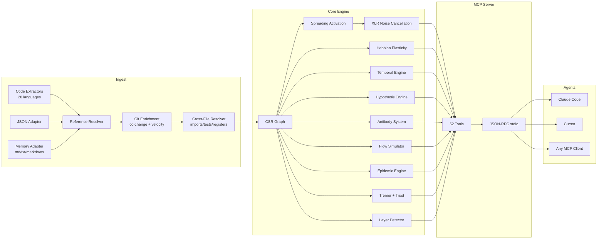

<p align="center">
  
</p>

<h3 align="center">学習する適応型コードグラフ。</h3>

<p align="center">
  ヘブ可塑性、スプレッディングアクティベーション、<br/>
  ライブMCPツール群を備えたニューロシンボリック・コネクトームエンジン。Rustで構築、AIエージェント向け。
</p>

<p align="center">
  <strong>1回の監査セッションで39件のバグを発見 &middot; 仮説精度89% &middot; アクティベーション1.36µs &middot; LLMトークン消費ゼロ</strong>
</p>

<p align="center">
  <a href="https://crates.io/crates/m1nd-core"></a>
  <a href="https://github.com/maxkle1nz/m1nd/actions"></a>
  <a href="../LICENSE"></a>
  <a href="https://docs.rs/m1nd-core"></a>
</p>

<p align="center">
  <a href="#30秒で最初のクエリ">クイックスタート</a> &middot;
  <a href="#実証済みの結果">実証済みの結果</a> &middot;
  <a href="#ツールサーフェス">ツールサーフェス</a> &middot;
  <a href="#m1ndの使用例">ユースケース</a> &middot;
  <a href="#m1ndが存在する理由">なぜm1ndか</a> &middot;
  <a href="#アーキテクチャ">アーキテクチャ</a> &middot;
  <a href="../EXAMPLES.md">サンプル集</a>
</p>

---

**言語:** [English](../README.md) &middot; **日本語** &middot; [中文](README.zh.md)

---

<h4 align="center">あらゆるMCPクライアントで動作</h4>

<p align="center">
  <a href="https://claude.ai/download"></a>
  <a href="https://cursor.sh"></a>
  <a href="https://codeium.com/windsurf"></a>
  <a href="https://github.com/features/copilot"></a>
  <a href="https://zed.dev"></a>
  <a href="https://github.com/cline/cline"></a>
  <a href="https://roocode.com"></a>
  <a href="https://github.com/continuedev/continue"></a>
  <a href="https://opencode.ai"></a>
  <a href="https://aws.amazon.com/q/developer"></a>
</p>

m1ndはコードベースを「検索」しません――*活性化*するのです。グラフにクエリを投げると、構造・意味・時間・因果の4つの次元にわたってシグナルが伝播します。ノイズは打ち消され、関連する接続が増幅される。そしてグラフはヘブ可塑性によって、あらゆるインタラクションから*学習します*。

```
335ファイル → 9,767ノード → 26,557エッジ、0.91秒で完了。
その後: activate 31ms、impact 5ms、trace 3.5ms、learn <1ms。
```

## 実証済みの結果

本番Python/FastAPIコードベース（52K行、380ファイル）のライブ監査から得た数値：

| 指標 | 結果 |
|--------|--------|
| **1セッションで発見したバグ数** | 39件（28件確認済み修正 + 9件新規高信頼度） |
| **grepでは見えないバグ** | 28件中8件（28.5%）— 構造解析が必要 |
| **仮説精度** | 10件のクレームで89%（`hypothesize`使用） |
| **消費LLMトークン** | 0 — 純粋なRust、ローカルバイナリ |
| **28件のバグ発見に要したクエリ数** | m1nd 46クエリ vs grep 約210オペレーション |
| **総クエリレイテンシ** | 約3.1秒 vs 推定約35分 |
| **誤検知率** | 約15% vs grepベースアプローチの約50% |

Criterionマイクロベンチマーク（実ハードウェア、1Kノードグラフ）：

| オペレーション | 時間 |
|-----------|------|
| `activate` 1Kノード | **1.36 µs** |
| `impact` depth=3 | **543 ns** |
| `graph build` 1Kノード | 528 µs |
| `flow_simulate` 4パーティクル | 552 µs |
| `epidemic` SIR 50回 | 110 µs |
| `antibody_scan` 50パターン | 2.68 ms |
| `tremor` 500ノード検出 | 236 µs |
| `trust` 500ノードレポート | 70 µs |
| `layer_detect` 500ノード | 862 µs |
| `resonate` 5ハーモニクス | 8.17 µs |

**メモリアダプター（キラーフィーチャー）：** 82件のドキュメント（PRD、仕様、ノート）とコードを1つのグラフに取り込む。
`activate("antibody pattern matching")` は `PRD-ANTIBODIES.md`（スコア1.156）と `pattern_models.py`（スコア0.904）の両方を返す――1回のクエリでコードとドキュメントを同時に。
`missing("GUI web server")` は実装のない仕様を検出する――ドメインをまたいだギャップ検出。

## 30秒で最初のクエリ

```bash
# ソースからビルド
git clone https://github.com/maxkle1nz/m1nd.git
cd m1nd && cargo build --release

# 実行（JSON-RPC stdioサーバーを起動 — あらゆるMCPクライアントで動作）
./target/release/m1nd-mcp
```

```jsonc
// 1. コードベースを取り込む（335ファイルで910ms）
{"method":"tools/call","params":{"name":"ingest","arguments":{"path":"/your/project","agent_id":"dev"}}}
// → 9,767ノード、26,557エッジ、PageRank計算完了

// 2. 「認証に関連するものは？」と尋ねる
{"method":"tools/call","params":{"name":"activate","arguments":{"query":"authentication","agent_id":"dev"}}}
// → authモジュールが発火 → session、middleware、JWT、userモデルへ伝播
//   ゴーストエッジが未文書の接続を明らかにする
//   31msで4次元関連度ランキング

// 3. 役に立った結果をグラフに伝える
{"method":"tools/call","params":{"name":"learn","arguments":{"feedback":"correct","node_ids":["file::auth.py","file::middleware.py"],"agent_id":"dev"}}}
// → 740エッジがヘブLTP（長期増強）で強化される。次のクエリはより賢くなる。
```

### Claude Codeに追加する

```json
{
  "mcpServers": {
    "m1nd": {
      "command": "/path/to/m1nd-mcp",
      "env": {
        "M1ND_GRAPH_SOURCE": "/tmp/m1nd-graph.json",
        "M1ND_PLASTICITY_STATE": "/tmp/m1nd-plasticity.json"
      }
    }
  }
}
```

Claude Code、Cursor、Windsurf、Zed、または独自のMCPクライアントで動作します。

### 設定ファイル

起動時のデフォルト値を上書きするには、最初のCLI引数としてJSON設定ファイルを渡します：

```bash
./target/release/m1nd-mcp config.json
```

```json
{
  "graph_source": "/path/to/graph.json",
  "plasticity_state": "/path/to/plasticity.json",
  "domain": "code",
  "xlr_enabled": true,
  "auto_persist_interval": 50
}
```

`domain` フィールドは `"code"`（デフォルト）、`"music"`、`"memory"`、または `"generic"` を受け付けます。各プリセットは時間的減衰の半減期と、スプレッディングアクティベーション中に認識されるリレーションタイプを変更します。

## m1ndが存在する理由

AIエージェントは優れた推論器ですが、ナビゲーションは苦手です。提示されたものを分析できても、10,000ファイルのコードベースから*重要なものを見つける*ことはできません。

現行のツールはエージェントを失望させます：

| アプローチ | 何をするか | なぜ失敗するか |
|----------|-------------|--------------|
| **全文検索** | トークンをマッチング | *言ったこと*を見つけるが、*意味すること*は見つけられない |
| **RAG** | チャンクを埋め込み、top-K類似度 | 各取得は健忘症。結果間に関係がない。 |
| **静的解析** | AST、コールグラフ | 凍結されたスナップショット。「もし〜なら？」に答えられない。学習しない。 |
| **知識グラフ** | トリプルストア、SPARQL | 手動でのキュレーションが必要。明示的にエンコードされたものしか返さない。 |

**m1ndはこれらのどれもできないことをします：** 重み付きグラフにシグナルを発火させ、エネルギーがどこへ向かうかを観察します。シグナルは物理学にインスパイアされたルールに従って伝播し、反射し、干渉し、減衰します。グラフはどのパスが重要かを学習します。そして答えはファイルのリストではなく――*アクティベーションパターン*です。

## 何が違うのか

### 1. グラフが学習する（ヘブ可塑性）

結果が有用であることを確認すると、そのパスに沿ってエッジの重みが強化されます。結果が間違っていると示すと、弱まります。時間とともに、グラフは*あなたの*チームが*あなたの*コードベースについてどう考えるかに合わせて進化します。

他のコードインテリジェンスツールでこれを実現するものはありません。

### 2. グラフがノイズをキャンセルする（XLR差動処理）

プロ用音響エンジニアリングから借用。バランスXLRケーブルのように、m1ndは2つの反転チャンネルでシグナルを伝送し、受信側でコモンモードノイズを差し引きます。結果：アクティベーションクエリはシグナルを返し、grepが溺れさせるノイズではありません。

### 3. グラフが調査を記憶する（トレイルシステム）

調査の中間状態――仮説、グラフの重み、未解決の疑問――を保存します。セッションを終了します。数日後に全く同じ認知的位置から再開します。同じバグを調査している2つのエージェント？トレイルをマージする――システムが独立した調査がどこで収束したかを自動的に検出し、競合をフラグします。

```
trail_save   → 調査状態を永続化          ~0ms
trail_resume → 正確なコンテキストを復元   0.2ms
trail_merge  → マルチエージェントの発見を結合   1.2ms
               （共有ノードの競合検出付き）
```

### 4. グラフがクレームを検証する（仮説エンジン）

「ワーカープールはWhatsAppマネージャーに対して隠れたランタイム依存関係を持っているか？」

m1ndは58msで25,015のパスを探索し、ベイズ信頼スコアとともに評決を返します。この場合：`likely_true`――キャンセル関数を経由する2ホップの依存関係で、grepには見えません。

**実証済み：** 本番コードベースの10件のライブクレームで89%の精度。このツールは `session_pool` のストームキャンセル時のリークを99%の信頼度で正確に確認し（実際のバグ3件発見）、循環依存の仮説を1%で正確に却下しました（クリーンなパス、バグなし）。またセッション中に新しい未修正のバグも発見しました：stormenderの重複フェーズ起動で83.5%の信頼度。

### 5. グラフが代替案をシミュレートする（反事実エンジン）

「`spawner.py` を削除したら何が壊れるか？」3msで、m1ndは完全なカスケードを計算します：4,189の影響ノード、深さ3でのカスケード爆発。比較：`config.py` の削除は、どこでもインポートされているにもかかわらず、2,531ノードしか影響しません。これらの数値はテキスト検索から導出することは不可能です。

### 6. グラフがメモリを取り込む（メモリアダプター）― コード+ドキュメント統合グラフ

m1ndはコードに限定されません。`adapter: "memory"` を渡すと、任意の `.md`、`.txt`、`.markdown` ファイルを型付きグラフとして取り込み――それをコードグラフとマージできます。見出しは `Module` ノードになります。箇条書きエントリは `Process` または `Concept` ノードになります。テーブル行は抽出されます。相互参照は `Reference` エッジを生成します。

結果：**1つのグラフ、1つのクエリ**でコードとドキュメントを横断。

```
// コード+ドキュメントを同じグラフに取り込む
ingest(path="/project/backend", agent_id="dev")
ingest(path="/project/docs", adapter="memory", namespace="docs", mode="merge", agent_id="dev")

// クエリは両方を返す — コードファイルと関連ドキュメント
activate("antibody pattern matching")
→ pattern_models.py       (score 1.156) — 実装
→ PRD-ANTIBODIES.md       (score 0.904) — 仕様
→ CONTRIBUTING.md         (score 0.741) — ガイドライン

// 実装のない仕様を見つける
missing("GUI web server")
→ specs: ["GUI-DESIGN.md", "GUI-SPEC.md"]   — 存在するドキュメント
→ code: []                                   — 実装が見つからない
→ verdict: structural gap
```

これは眠れる機能です。AIエージェントはそれを使って自分のセッションメモリをクエリします。チームはオーファンになった仕様を見つけるために使います。監査担当者はコードベースに対するドキュメントの完全性を検証するために使います。

**実証済み：** 82件のドキュメント（PRD、仕様、ノート）を138msで取り込み → 19,797ノード、21,616エッジ、クロスドメインクエリが即座に動作。

### 7. グラフがまだ起きていないバグを検出する（スーパーパワー拡張）

5つのエンジンが構造解析を超えて、予測と免疫システムの領域に踏み込みます：

- **抗体システム** — グラフがバグパターンを記憶します。バグが確認されると、サブグラフシグネチャ（抗体）を抽出します。以降のingestはすべての保存された抗体に対してスキャンされます。既知のバグ形状は60〜80%のコードベースで再発します。
- **エピデミックエンジン** — 既知のバグのあるモジュールのセットが与えられると、SIR疫学的伝播により、どの隣接モジュールが未発見のバグを持つ可能性が最も高いかを予測します。`R0` 推定値を返します。
- **トレモア検出** — 変更頻度が*加速している*モジュールを特定します（二次微分）。加速はバグに先行します、高チャーンだけでなく。
- **トラストレジャー** — 欠陥履歴からのモジュールごとのアクチュアリースコア。確認されたバグが多い = 低信頼 = アクティベーションクエリでの高リスク重み付け。
- **レイヤー検出** — グラフトポロジーからアーキテクチャレイヤーを自動検出し、依存関係違反（上方エッジ、循環依存、レイヤースキップ）を報告します。

## ツールサーフェス

### 基盤（13ツール）

| ツール | 何をするか | 速度 |
|------|-------------|-------|
| `ingest` | コードベースをセマンティックグラフに解析 | 910ms / 335ファイル（138ms / 82ドキュメント） |
| `activate` | 4Dスコアリングによるスプレッディングアクティベーション | 1.36µs（ベンチ）· 31–77ms（本番） |
| `impact` | コード変更のブラスト半径 | 543ns（ベンチ）· 5–52ms（本番） |
| `why` | 2ノード間の最短パス | 5-6ms |
| `learn` | ヘブフィードバック — グラフが賢くなる | <1ms |
| `drift` | 前回セッション以降の変更点 | 23ms |
| `health` | サーバー診断 | <1ms |
| `seek` | 自然言語の意図でコードを検索 | 10-15ms |
| `scan` | 8つの構造パターン（並行処理、認証、エラーなど） | 各3-5ms |
| `timeline` | ノードの時間的進化 | ~ms |
| `diverge` | gitベースの分岐解析 | 可変 |
| `warmup` | 次のタスクのためにグラフをプライム | 82-89ms |
| `federate` | 複数のリポジトリを1つのグラフに統合 | 1.3s / 2リポ |

### パースペクティブナビゲーション（12ツール）

グラフをファイルシステムのようにナビゲートします。ノードから開始し、構造的なルートを辿り、ソースコードを覗き、探索を分岐させ、エージェント間でパースペクティブを比較します。

| ツール | 目的 |
|------|---------|
| `perspective_start` | ノードにアンカーされたパースペクティブを開く |
| `perspective_routes` | 現在のフォーカスから利用可能なルートを一覧表示 |
| `perspective_follow` | フォーカスをルートターゲットに移動 |
| `perspective_back` | 後方にナビゲート |
| `perspective_peek` | フォーカスされたノードのソースコードを読む |
| `perspective_inspect` | 詳細なメタデータ + 5因子スコアの内訳 |
| `perspective_suggest` | AIナビゲーション推奨 |
| `perspective_affinity` | 現在の調査に対するルートの関連度を確認 |
| `perspective_branch` | 独立したパースペクティブのコピーをフォーク |
| `perspective_compare` | 2つのパースペクティブをdiff（共有/固有ノード） |
| `perspective_list` | すべてのアクティブなパースペクティブ + メモリ使用量 |
| `perspective_close` | パースペクティブの状態を解放 |

### ロックシステム（5ツール）

サブグラフ領域をピン留めして変更を監視します。`lock_diff` は **0.00008ms** で動作します――事実上コストなしの変更検出。

| ツール | 目的 | 速度 |
|------|---------|-------|
| `lock_create` | サブグラフ領域のスナップショット | 24ms |
| `lock_watch` | 変更戦略を登録 | ~0ms |
| `lock_diff` | 現在とベースラインを比較 | 0.08μs |
| `lock_rebase` | ベースラインを現在に進める | 22ms |
| `lock_release` | ロック状態を解放 | ~0ms |

### スーパーパワー（13ツール）

| ツール | 何をするか | 速度 |
|------|-------------|-------|
| `hypothesize` | グラフ構造に対してクレームをテスト（10件のライブクレームで89%精度） | 28-58ms |
| `counterfactual` | モジュール削除をシミュレート — 完全なカスケード | 3ms |
| `missing` | 構造的な穴を見つける — 存在すべきもの | 44-67ms |
| `resonate` | 定常波解析 — 構造的ハブを見つける | 37-52ms |
| `fingerprint` | トポロジーで構造的な双子を見つける | 1-107ms |
| `trace` | スタックトレースを根本原因にマッピング | 3.5-5.8ms |
| `validate_plan` | 変更の事前リスク評価 | 0.5-10ms |
| `predict` | 共変更予測 | <1ms |
| `trail_save` | 調査状態を永続化 | ~0ms |
| `trail_resume` | 正確な調査コンテキストを復元 | 0.2ms |
| `trail_merge` | マルチエージェントの調査を結合 | 1.2ms |
| `trail_list` | 保存済み調査を参照 | ~0ms |
| `differential` | XLRノイズキャンセリングアクティベーション | ~ms |

### スーパーパワー拡張（9ツール）

| ツール | 何をするか | 速度 |
|------|-------------|-------|
| `antibody_scan` | 保存されたバグ抗体パターンに対してグラフをスキャン | 2.68ms（50パターン） |
| `antibody_list` | マッチ履歴付きですべての保存済み抗体を一覧表示 | ~0ms |
| `antibody_create` | 抗体パターンの作成、無効化、有効化、削除 | ~0ms |
| `flow_simulate` | 並行実行フローシミュレーション — レース条件検出 | 552µs（4パーティクル、ベンチ） |
| `epidemic` | SIRバグ伝播予測 — 次に感染するモジュール | 110µs（50回、ベンチ） |
| `tremor` | 変更頻度加速検出 — 障害前のトレモアシグナル | 236µs（500ノード、ベンチ） |
| `trust` | モジュールごとの欠陥履歴トラストスコア — アクチュアリーリスク評価 | 70µs（500ノード、ベンチ） |
| `layers` | アーキテクチャレイヤーを自動検出 + 依存関係違反レポート | 862µs（500ノード、ベンチ） |
| `layer_inspect` | 特定のアーキテクチャレイヤーを検査：ノード、エッジ、健全性 | 可変 |

## アーキテクチャ

```
m1nd/
  m1nd-core/     グラフエンジン、可塑性、スプレッディングアクティベーション、仮説エンジン
                 抗体、フロー、エピデミック、トレモア、トラスト、レイヤー検出、ドメイン設定
  m1nd-ingest/   言語エクストラクター（28言語）、メモリアダプター、JSONアダプター、
                 git強化、クロスファイルリゾルバー、インクリメンタルdiff
  m1nd-mcp/      MCPサーバー、ライブMCPツールハンドラー、stdioを介したJSON-RPC
```

**純粋なRust。** ランタイム依存関係なし。LLM呼び出しなし。APIキー不要。バイナリは約8MBで、Rustがコンパイルできる場所ならどこでも動作します。

### 4つのアクティベーション次元

すべてのスプレッディングアクティベーションクエリは、4つの次元にわたってノードをスコアリングします：

| 次元 | 何を測定するか | ソース |
|-----------|-----------------|--------|
| **構造的** | グラフ距離、エッジタイプ、PageRank | CSR隣接 + 逆インデックス |
| **意味的** | トークン重複、命名パターン | 識別子のトリグラムマッチング |
| **時間的** | 共変更履歴、速度、減衰 | git履歴 + learnフィードバック |
| **因果的** | 疑わしさ、エラー近接度 | スタックトレースマッピング + コールチェーン |

最終スコアは加重組み合わせです（デフォルト `[0.35, 0.25, 0.15, 0.25]`）。ヘブ可塑性はフィードバックに基づいてこれらの重みをシフトします。3次元共鳴マッチは `1.3x` ボーナスを得ます；4次元は `1.5x`。

### グラフ表現

前方 + 逆方向隣接を持つ圧縮疎行（CSR）。PageRankはingest時に計算されます。可塑性レイヤーはヘブLTP/LTDと恒常性正規化（重みフロア `0.05`、上限 `3.0`）でエッジごとの重みを追跡します。

26,557エッジを持つ9,767ノードはメモリ上で約2MBを占有します。クエリは直接グラフを横断します――データベースなし、ネットワークなし、シリアライゼーションオーバーヘッドなし。



（Mermaidダイアグラムは後方互換性のため「52 Tools」と表示されていますが、正確なライブ件数は `tools/list` を真実のソースとして確認してください）

### 言語サポート

m1ndは3つのティアで28言語のエクストラクターを提供します：

| ティア | 言語 | ビルドフラグ |
|------|-----------|-----------|
| **組み込み（正規表現）** | Python、Rust、TypeScript/JavaScript、Go、Java | デフォルト |
| **汎用フォールバック** | `def`/`fn`/`class`/`struct` パターンを持つ任意言語 | デフォルト |
| **ティア1（tree-sitter）** | C、C++、C#、Ruby、PHP、Swift、Kotlin、Scala、Bash、Lua、R、HTML、CSS、JSON | `--features tier1` |
| **ティア2（tree-sitter）** | Elixir、Dart、Zig、Haskell、OCaml、TOML、YAML、SQL | `--features tier2` |

```bash
# 完全な言語サポートでビルド
cargo build --release --features tier1,tier2
```

### Ingestアダプター

`ingest` ツールは `adapter` パラメーターを受け付けて、3つのモードを切り替えます：

**Code（デフォルト）**
```jsonc
{"name":"ingest","arguments":{"path":"/your/project","agent_id":"dev"}}
```
ソースファイルを解析し、クロスファイルエッジを解決し、git履歴で強化します。

**Memory / Markdown**
```jsonc
{"name":"ingest","arguments":{
  "path":"/your/notes",
  "adapter":"memory",
  "namespace":"project-memory",
  "agent_id":"dev"
}}
```
`.md`、`.txt`、`.markdown` ファイルを取り込みます。見出しは `Module` ノードになります。箇条書きとチェックボックスエントリは `Process`/`Concept` ノードになります。テーブル行はエントリとして抽出されます。テキスト内のファイルパスからの相互参照は `Reference` エッジを生成します。正規ソース（`MEMORY.md`、`YYYY-MM-DD.md`、`-active.md`、ブリーフィングファイル）は強化された時間的スコアを受け取ります。

ノードIDは以下のスキームに従います：
```
memory::<namespace>::file::<slug>
memory::<namespace>::section::<file-slug>::<heading-slug>-<n>
memory::<namespace>::entry::<file-slug>::<line-no>::<entry-slug>
memory::<namespace>::reference::<referenced-path-slug>
```

**JSON（ドメイン非依存）**
```jsonc
{"name":"ingest","arguments":{
  "path":"/your/domain.json",
  "adapter":"json",
  "agent_id":"dev"
}}
```
JSONで任意のグラフを記述します。m1ndがそこから完全な型付きグラフを構築します：
```json
{
  "nodes": [
    {"id": "service::auth", "label": "AuthService", "type": "module", "tags": ["critical"]},
    {"id": "service::session", "label": "SessionStore", "type": "module"}
  ],
  "edges": [
    {"source": "service::auth", "target": "service::session", "relation": "calls", "weight": 0.8}
  ]
}
```
サポートされているノードタイプ：`file`、`function`、`class`、`struct`、`enum`、`module`、`type`、
`concept`、`process`、`material`、`product`、`supplier`、`regulatory`、`system`、`cost`、
`custom`。不明なタイプは `Custom(0)` にフォールバックします。

**マージモード**

`mode` パラメーターは、取り込まれたノードが既存のグラフとどのようにマージされるかを制御します：
- `"replace"`（デフォルト）— 既存のグラフをクリアし、新鮮に取り込む
- `"merge"` — 既存のグラフに新しいノードをオーバーレイ（タグのユニオン、重みはmax-wins）

### ドメインプリセット

`domain` 設定フィールドは、さまざまなグラフドメインに対して時間的減衰の半減期と認識されるリレーションタイプをチューニングします：

| ドメイン | 時間的半減期 | 典型的な用途 |
|--------|--------------------|----|
| `code`（デフォルト） | File=7d、Function=14d、Module=30d | ソフトウェアコードベース |
| `memory` | 知識減衰に調整済み | エージェントセッションメモリ、ノート |
| `music` | `git_co_change=false` | 音楽ルーティンググラフ、シグナルチェーン |
| `generic` | フラット減衰 | 任意のカスタムグラフドメイン |

### ノードID参照

m1ndはingest時に決定論的なIDを割り当てます。これらを `activate`、`impact`、`why`、および他のターゲットクエリで使用します：

```
コードノード:
  file::<relative/path.py>
  file::<relative/path.py>::class::<ClassName>
  file::<relative/path.py>::fn::<function_name>
  file::<relative/path.py>::struct::<StructName>
  file::<relative/path.py>::enum::<EnumName>
  file::<relative/path.py>::module::<ModName>

メモリノード:
  memory::<namespace>::file::<file-slug>
  memory::<namespace>::section::<file-slug>::<heading-slug>-<n>
  memory::<namespace>::entry::<file-slug>::<line-no>::<entry-slug>

JSONノード:
  <ユーザー定義>   （JSONディスクリプターで設定したid）
```

## m1ndはどう比較されるか？

| 機能 | Sourcegraph | Cursor | Aider | RAG | m1nd |
|------------|-------------|--------|-------|-----|------|
| コードグラフ | SCIP（静的） | 埋め込み | tree-sitter + PageRank | なし | CSR + 4Dアクティベーション |
| 使用から学習 | No | No | No | No | **ヘブ可塑性** |
| 調査の永続化 | No | No | No | No | **トレイルの保存/再開/マージ** |
| 仮説をテスト | No | No | No | No | **グラフパスのベイズ推論** |
| 削除をシミュレート | No | No | No | No | **反事実カスケード** |
| マルチリポグラフ | 検索のみ | No | No | No | **フェデレーショングラフ** |
| 時間的インテリジェンス | git blame | No | No | No | **共変更 + 速度 + 減衰** |
| メモリ/ドキュメントの取り込み | No | No | No | 部分的 | **メモリアダプター（型付きグラフ）** |
| バグ免疫メモリ | No | No | No | No | **抗体システム** |
| バグ伝播モデル | No | No | No | No | **SIRエピデミックエンジン** |
| 障害前トレモア | No | No | No | No | **変更加速検出** |
| アーキテクチャレイヤー | No | No | No | No | **自動検出 + 違反レポート** |
| エージェントインターフェース | API | N/A | CLI | N/A | **ライブMCPツール群** |
| クエリあたりコスト | ホスト型SaaS | サブスクリプション | LLMトークン | LLMトークン | **ゼロ** |

## m1ndを使わないべき場合

m1ndでないものについて正直に：

- **ニューラルセマンティック検索が必要な場合。** V1はトリグラムマッチングを使用し、埋め込みではありません。「authenticationという単語を使わないが*認証を意味する*コードを見つける」が必要なら、m1ndはまだそれができません。
- **m1ndがカバーしていない言語が必要な場合。** m1ndは2つのtree-sitterティアにわたる28言語のエクストラクターを搭載しています（計画ではなく出荷済み）。デフォルトビルドにはティア2（8言語）が含まれています。`--features tier1` を追加すると28言語すべてが有効になります。あなたの言語がどちらのティアにもない場合、汎用フォールバックがfunction/classの形状を処理しますが、importエッジを見逃します。
- **400K+ファイルがある場合。** グラフはメモリ上に存在します。10Kノードで約2MBの場合、400Kファイルのコードベースは約80MBが必要です。動作しますが、m1ndが最適化された場所ではありません。
- **データフローまたはテイント解析が必要な場合。** m1ndは構造的および共変更の関係を追跡しますが、変数を通じたデータフローは追跡しません。そのためには専用のSASTツールを使用してください。

## m1ndの使用例

### AIエージェント

エージェントはm1ndをナビゲーションレイヤーとして使用します。grep + 全ファイル読み込みにLLMトークンを消費する代わりに、グラフクエリを発行してマイクロ秒でランク付けされたアクティベーションパターンを取得します。

**バグハントパイプライン：**
```
hypothesize("worker pool leaks on task cancel")  → 99%信頼度、3件のバグ
missing("cancellation cleanup timeout")          → 2つの構造的な穴
flow_simulate(seeds=["worker_pool.py"])          → 223のタービュランスポイント
trace(stacktrace_text)                           → 疑わしさでランク付けされた容疑者
```
実証的な結果：380のPythonファイルで**1セッションで39件のバグを発見**。そのうち8件はgrepが生成できない構造的推論が必要でした。

**コードレビュー前：**
```
impact("file::payment.py")      → depth=3で2,100の影響ノード
validate_plan(["payment.py"])   → risk=0.70、347のギャップをフラグ
predict("file::payment.py")     → ["billing.py", "invoice.py"] が変更必要
```

### 人間の開発者

m1ndは開発者が常に尋ねる質問に答えます：

| 質問 | ツール | 何を得るか |
|----------|-------|-------------|
| 「バグはどこにあるか？」 | `trace` + `activate` | 疑わしさ × 中心性でランク付けされた容疑者 |
| 「デプロイして安全か？」 | `epidemic` + `tremor` + `trust` | 3つの障害モードのリスクヒートマップ |
| 「これはどう動くのか？」 | `layers` + `perspective` | 自動検出されたアーキテクチャ + ガイド付きナビゲーション |
| 「何が変わったか？」 | `drift` + `lock_diff` + `timeline` | 前回セッション以降の構造的デルタ |
| 「誰がこれに依存しているか？」 | `impact` + `why` | ブラスト半径 + 依存パス |

### CI/CDパイプライン

```bash
# マージ前ゲート（リスク > 0.8でPRをブロック）
antibody_scan(scope="changed", min_severity="Medium")
validate_plan(files=changed_files)     → blast_radius + gap count → risk score

# マージ後の再インデックス
ingest(mode="merge")                   → インクリメンタルデルタのみ
predict(file=changed_file)             → 注意が必要なファイル

# ナイトリーヘルスダッシュボード
tremor(top_k=20)                       → 変更頻度が加速しているモジュール
trust(min_defects=3)                   → 欠陥履歴が悪いモジュール
layers()                               → 依存関係違反数
```

### セキュリティ監査

```
# 認証ギャップを見つける
missing("authentication middleware")   → 認証ガードのないエントリポイント

# 並行コードのレース条件
flow_simulate(seeds=["auth.py"])       → タービュランス = 非同期の並行アクセス

# インジェクション面
layers()                               → バリデーションレイヤーなしでコアに到達する入力

# 「攻撃者は証明を偽造できるか？」
hypothesize("forge identity bypass")  → 99%信頼度、20の証拠パス
```

### チーム

```
# 並行作業 — 競合を防ぐためにリージョンをロック
lock_create(anchor="file::payment.py", depth=3)
lock_diff()         → 0.08μs 構造変更検出

# エンジニア間の知識移転
trail_save(label="payment-refactor-v2", hypotheses=[...])
trail_resume()      → 正確な調査コンテキスト、重み保持

# エージェント間のペアデバッグ
perspective_branch()    → 独立した探索コピー
perspective_compare()   → diff: 共有ノード vs 発散した発見
```

## 人々が構築しているもの

**バグハント：** `hypothesize` → `missing` → `flow_simulate` → `trace`
grepゼロ。グラフがバグへのナビゲートを担当します。

**デプロイ前ゲート：** `antibody_scan` → `validate_plan` → `epidemic`
既知のバグ形状をスキャンし、ブラスト半径を評価し、感染拡大を予測します。

**アーキテクチャ監査：** `layers` → `layer_inspect` → `counterfactual`
レイヤーを自動検出し、違反を見つけ、モジュールを削除したときに何が壊れるかをシミュレートします。

**オンボーディング：** `activate` → `layers` → `perspective_start` → `perspective_follow`
新しい開発者が「認証はどう動くか？」と尋ねる――グラフがパスを照らします。

**クロスドメイン検索：** `ingest(adapter="memory", mode="merge")` → `activate`
コード + ドキュメントが1つのグラフに。1つの質問で仕様と実装の両方を取得します。

## ユースケース

### AIエージェントメモリ

```
セッション1:
  ingest(adapter="memory", namespace="project") → activate("auth") → learn(correct)

セッション2:
  drift(since="last_session") → authパスが強化されている
  activate("auth") → より良い結果、より速い収束

セッションN:
  グラフはあなたのチームがauthについてどう考えるかに適応している
```

### ビルドオーケストレーション

```
コーディング前:
  warmup("refactor payment flow") → 50のシードノードをプライム
  validate_plan(["payment.py", "billing.py"]) → blast_radius + gaps
  impact("file::payment.py") → depth 3で2,100の影響ノード

コーディング中:
  predict("file::payment.py") → ["file::billing.py", "file::invoice.py"]
  trace(error_text) → 疑わしさでランク付けされた容疑者

コーディング後:
  learn(feedback="correct") → 使用したパスを強化
```

### コード調査

```
開始:
  activate("memory leak in worker pool") → 15のランク付けされた容疑者

調査:
  perspective_start(anchor="file::worker_pool.py")
  perspective_follow → perspective_peek → ソースを読む
  hypothesize("worker pool leaks when tasks cancel")

進捗を保存:
  trail_save(label="worker-pool-leak", hypotheses=[...])

翌日:
  trail_resume → 正確なコンテキストが復元、すべての重みが保持
```

### マルチリポ解析

```
federate(repos=[
  {path: "/app/backend", label: "backend"},
  {path: "/app/frontend", label: "frontend"}
])
→ 1.3sで11,217の統合ノード、18,203のクロスリポエッジ

activate("API contract") → バックエンドハンドラー + フロントエンドコンシューマーを発見
impact("file::backend::api.py") → ブラスト半径にフロントエンドコンポーネントを含む
```

### バグ予防

```
# バグを修正した後、抗体を作成:
antibody_create(action="create", pattern={
  nodes: [{id: "n1", type: "function", label_pattern: "process_.*"},
          {id: "n2", type: "function", label_pattern: ".*_async"}],
  edges: [{source: "n1", target: "n2", relation: "calls"}],
  negative_edges: [{source: "n2", target: "lock_node", relation: "calls"}]
})

# 将来のすべてのingestで再発をスキャン:
antibody_scan(scope="changed", min_severity="Medium")
→ matches: [{antibody_id: "...", confidence: 0.87, matched_nodes: [...]}]

# 既知のバグのあるモジュールから、バグが拡散する場所を予測:
epidemic(infected_nodes=["file::worker_pool.py"], direction="forward", top_k=10)
→ prediction: [{node: "file::session_pool.py", probability: 0.74, R0: 2.1}]
```

## ベンチマーク

**エンドツーエンド**（実際の実行、本番Pythonバックエンド — 335〜380ファイル、約52K行）：

| オペレーション | 時間 | スケール |
|-----------|------|-------|
| 完全なingest（コード） | 910ms〜1.3s | 335ファイル → 9,767ノード、26,557エッジ |
| 完全なingest（ドキュメント/メモリ） | 138ms | 82ドキュメント → 19,797ノード、21,616エッジ |
| スプレッディングアクティベーション | 31〜77ms | 9,767ノードから15の結果 |
| ブラスト半径（depth=3） | 5〜52ms | 最大4,271の影響ノード |
| スタックトレース解析 | 3.5ms | 5フレーム → 4つの容疑者ランク付け |
| プラン検証 | 10ms | 7ファイル → 43,152ブラスト半径 |
| 反事実カスケード | 3ms | 26,557エッジでの完全BFS |
| 仮説テスト | 28〜58ms | 25,015パスを探索 |
| パターンスキャン（全8パターン） | 38ms | 335ファイル、パターンあたり50の発見 |
| 抗体スキャン | <100ms | タイムアウトバジェットつき完全レジストリスキャン |
| マルチリポフェデレーション | 1.3s | 11,217ノード、18,203クロスリポエッジ |
| ロックdiff | 0.08μs | 1,639ノードのサブグラフ比較 |
| トレイルマージ | 1.2ms | 5つの仮説、3つの競合を検出 |

**Criterionマイクロベンチマーク**（独立、1K〜500ノードグラフ）：

| ベンチマーク | 時間 |
|-----------|------|
| activate 1Kノード | **1.36 µs** |
| impact depth=3 | **543 ns** |
| graph build 1Kノード | 528 µs |
| flow_simulate 4パーティクル | 552 µs |
| epidemic SIR 50回 | 110 µs |
| antibody_scan 50パターン | 2.68 ms |
| tremor 500ノード検出 | 236 µs |
| trust 500ノードレポート | 70 µs |
| layer_detect 500ノード | 862 µs |
| resonate 5ハーモニクス | 8.17 µs |

## 環境変数

| 変数 | 目的 | デフォルト |
|----------|---------|---------|
| `M1ND_GRAPH_SOURCE` | グラフ状態を永続化するパス | メモリ内のみ |
| `M1ND_PLASTICITY_STATE` | 可塑性重みを永続化するパス | メモリ内のみ |
| `M1ND_XLR_ENABLED` | XLRノイズキャンセリングの有効/無効 | `true` |

`M1ND_GRAPH_SOURCE` が設定されている場合、追加の状態ファイルが自動的に隣接して永続化されます：

| ファイル | 内容 |
|------|---------|
| `antibodies.json` | バグ抗体パターンレジストリ |
| `tremor_state.json` | 変更加速観測履歴 |
| `trust_state.json` | モジュールごとの欠陥履歴台帳 |

## 書き込み後の検証

`apply_batch` に `verify=true` を指定すると、書き込み操作ごとに5層の検証が自動実行されます——手動での確認は不要です。

```jsonc
{
  "name": "apply_batch",
  "arguments": {
    "writes": [
      {"file_path": "src/auth.py", "new_content": "..."},
      {"file_path": "src/session.py", "new_content": "..."}
    ],
    "verify": true,
    "agent_id": "dev"
  }
}
```

**5つの検証層：**

| 層 | 検証内容 | 結果フィールド |
|----|---------|-------------|
| **構文** | ASTパース（Python/Rust/TS/JS/Go） | `syntax_ok: true/false` |
| **インポート** | 参照モジュールがグラフ内に存在する | `imports_ok: true/false` |
| **インターフェース** | 公開APIシグネチャが呼び出し元と一致する | `interfaces_ok: true/false` |
| **リグレッションパターン** | 既知のバグ抗体が再導入されていない | `regressions_ok: true/false` |
| **グラフ整合性** | 新規書き込みノードのエッジが一貫している | `graph_ok: true/false` |

**実証済み：** 複数ファイルにまたがるバッチ書き込みで12/12の正確性を達成。エラーはファイルごとに報告され、正常な書き込みはブロックされません。

```jsonc
// レスポンス例
{
  "written": 2,
  "verified": 2,
  "errors": [],
  "verification": {
    "src/auth.py":    {"syntax_ok": true, "imports_ok": true, "interfaces_ok": true, "regressions_ok": true, "graph_ok": true},
    "src/session.py": {"syntax_ok": true, "imports_ok": true, "interfaces_ok": true, "regressions_ok": true, "graph_ok": true}
  }
}
```

複数の関連ファイルを1つのバッチ操作で変更する場合は、常に `verify: true` を使用してください。

## コントリビューション

m1ndは初期段階で急速に進化しています。コントリビューション歓迎：

- **言語エクストラクター**: `m1nd-ingest` に更多の言語のパーサーを追加
- **グラフアルゴリズム**: スプレッディングアクティベーションの改善、コミュニティ検出の追加
- **MCPツール**: グラフを活用する新しいツールの提案
- **ベンチマーク**: 異なるコードベースでテスト、パフォーマンスを報告

ガイドラインについては [CONTRIBUTING.md](../CONTRIBUTING.md) を参照してください。

## ライセンス

MIT — [LICENSE](../LICENSE) を参照。

---

<p align="center">
  Created by <a href="https://github.com/maxkle1nz">Max Elias Kleinschmidt</a><br/>
  <em>The graph must learn.</em>
</p>
